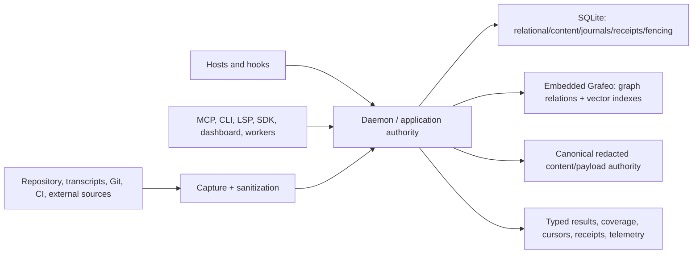

# TraceDecay final-V2 architecture

TraceDecay is a local-first code, session, memory, Git, task, workflow, and
agent-context intelligence product. One daemon/application authority turns
sanitized observations into durable relational, graph/vector, and content
state, then serves typed operations to every client surface.

## Ownership

- Domain crates own stable identities, requests, outcomes, invariants, and
  failure states.
- Capture owns provider/native parsing, sanitization, observation identity, and
  offsets.
- Projectors derive deterministic product views and commit effects/checkpoints
  atomically through daemon-owned stores.
- `tracedecay-graph-db` is the only direct Grafeo dependency and hides every
  Grafeo type/handle from domain and wire APIs.
- SQLite remains authoritative for relational/content records, configuration,
  observations, event journals, idempotency, leases, receipts, artifacts, and
  execution fencing.
- Grafeo is authoritative for code/Git/session/LCM/memory-reference/Work/
  workflow topology and admitted vector indexes.
- Holographic memory owns canonical project-wide fact content, trust,
  feedback, tombstones, and algorithm-intrinsic state. Grafeo stores only typed
  fact-ID relations/vectors, never fact payloads.
- Application services own authorization, routing, hydration, budgets,
  cancellation, reconciliation, and semantic composition.
- MCP, CLI, HTTP/dashboard, LSP, SDK, hooks, hosts, workers, and automation are
  thin clients. They do not open business databases or implement private
  mutation paths.

## Store and scope model

The repository `.tracedecay/` directory is an enrollment marker. The daemon
resolves the selected profile and registered project to private owner shards.
Linked worktrees share their repository's project/store identity while every
code generation retains exact worktree/ref/snapshot provenance.

Project facts and project sessions are project-wide. Branches/worktrees never
own, shard, copy, merge, archive, or retire facts. Multi-root and cross-project
requests explicitly freeze each registered identity, authorization epoch,
generation/watermark, and continuation.

Final V2 is a breaking fresh-store design. Incompatible TraceDecay stores
return `ResetRequired`; there is no migration, backfill, dual-write,
compatibility reader, census, or adoption. Historical host transcripts/logs
and repository observations may enter through ordinary sanitized V2 capture.

## LCM and memory

Lossless session retrieval preserves raw messages, occurrences, logical-copy
relations, summary DAGs, source pagination, redaction, temporal modes, and
coverage. Summary-source expansion hydrates exact content from each message's
owning canonical store. A summary never replaces source authority.

Compression, live-turn projection, and session-boundary mutation are internal
daemon hook-runtime/application effects. Public LCM retrieval, status,
preflight planning, and Doctor diagnostics are read-only. Explicit
session-source refresh is a separate daemon operation.

## Work, workflow, Git, and code

Immutable code generations bind extraction, graph/vector publication,
diagnostics, Git evidence, and affected-test attribution to an exact snapshot.
Git reads use the canonical `gix`/native authority; mutations retain explicit
preview/apply, compare-and-swap, and receipts.

Work/task and workflow topology lives in Grafeo; immutable events, activation
CAS, leases, attempts, artifacts, effects, and terminal receipts remain
relational. Runtime completion is evidence for task review, never automatic
task truth.

## Reliability

Every missing registry, stale generation, unavailable authority, denied scope,
partial source, cancellation, overload, corrupt store, reset requirement, and
uncertain post-commit durability state is typed. No read fabricates a zero,
opens a fallback store, or repairs state.

One daemon registry reuses exact owner handles, serializes writers, supports
snapshot readers, and owns shutdown, checkpoint/compaction, retention,
backup/restore or deterministic rebuild, and health telemetry. Doctor is
read-only; effects use separate authorized operations with idempotency,
fencing, receipts, rollback, and restart behavior.

## Acceptance

Completion is proven through production entry points and isolated fresh
profiles: every supported host's historical/live capture, every public tool
and SDK operation, lossless LCM pagination/hydration, project-wide fact
continuity, code/Git/semantic/task/workflow graph journeys, restart,
backup/restore, cancellation, denial, staleness, shutdown, and ordinary
cross-platform CI. Source-shape scans, PR stages, hard-coded tool/test counts,
fixed performance thresholds, dogfood, and sidecars are not acceptance.
