<!-- Generated from architecture-boundaries.toml; do not edit. -->
# V2 Dependency DAG

```mermaid
flowchart TD
  store["store"] --> domain["domain"]
  capture["capture"] --> domain["domain"]
  projectors["projectors"] --> domain["domain"]
  code_index["code-index"] --> domain["domain"]
  native_semantic_runtime["native-semantic-runtime"] --> domain["domain"]
  native_semantic_runtime["native-semantic-runtime"] --> code_index["code-index"]
  native_semantic_runtime["native-semantic-runtime"] --> projectors["projectors"]
  native_semantic_runtime["native-semantic-runtime"] --> query["query"]
  native_semantic_runtime["native-semantic-runtime"] --> application["application"]
  query["query"] --> domain["domain"]
  policy["policy"] --> domain["domain"]
  tool_catalog["tool-catalog"] --> domain["domain"]
  application["application"] --> domain["domain"]
  application["application"] --> store["store"]
  application["application"] --> capture["capture"]
  application["application"] --> projectors["projectors"]
  application["application"] --> query["query"]
  application["application"] --> policy["policy"]
  application["application"] --> tool_catalog["tool-catalog"]
  api["api"] --> application["application"]
  api["api"] --> public_contracts["public-contracts"]
  hooks["hooks"] --> application["application"]
  presentation["presentation"] --> application["application"]
  host_deploy["host-deploy"] --> tool_catalog["tool-catalog"]
  remote_brain_transport["remote-brain-transport"] --> application["application"]
  client_rust["client-rust"] --> public_contracts["public-contracts"]
  client_typescript["client-typescript"] --> public_contracts["public-contracts"]
  client_python["client-python"] --> public_contracts["public-contracts"]
  dashboard["dashboard"] --> client_typescript["client-typescript"]
  root["root"] --> application["application"]
  root["root"] --> api["api"]
  root["root"] --> hooks["hooks"]
  root["root"] --> presentation["presentation"]
  root["root"] --> host_deploy["host-deploy"]
  root["root"] --> remote_brain_transport["remote-brain-transport"]
  api["api"] --> domain["domain"]
  api["api"] --> tool_catalog["tool-catalog"]
  api["api"] --> internal_node_contracts["internal-node-contracts"]
  hooks["hooks"] --> domain["domain"]
  hooks["hooks"] --> capture["capture"]
  hooks["hooks"] --> tool_catalog["tool-catalog"]
  presentation["presentation"] --> domain["domain"]
  presentation["presentation"] --> tool_catalog["tool-catalog"]
  host_deploy["host-deploy"] --> domain["domain"]
  host_deploy["host-deploy"] --> application["application"]
  remote_brain_transport["remote-brain-transport"] --> domain["domain"]
  remote_brain_transport["remote-brain-transport"] --> internal_node_contracts["internal-node-contracts"]
  root["root"] --> domain["domain"]
  root["root"] --> store["store"]
  root["root"] --> capture["capture"]
  root["root"] --> projectors["projectors"]
  root["root"] --> code_index["code-index"]
  root["root"] --> native_semantic_runtime["native-semantic-runtime"]
  root["root"] --> query["query"]
  root["root"] --> policy["policy"]
  root["root"] --> tool_catalog["tool-catalog"]
```

An arrow means a compile-time import or generation dependency. This list is byte-generated from the complete allowed dependency sets in the authority manifest.
