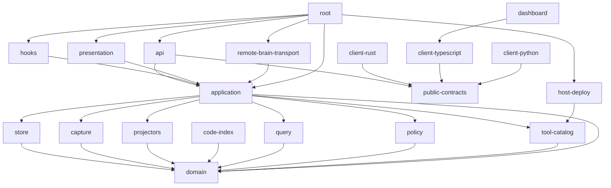

<!-- Generated from architecture-boundaries.toml; do not edit. -->
# V2 Dependency DAG

An arrow means “imports/depends on.” Transport nodes may cross only generated contracts and the application/domain/catalog boundary declared in the manifest. They may not import concrete store, query, policy, capture, projector, or code-index implementations.