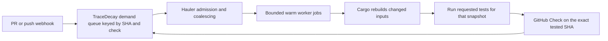

# TraceDecay CI folding experiment, September 28, 2026

Hauler can help, but the useful boundary is **before GitHub allocates a runner**.
An Action step cannot recover time already spent waiting for that runner. The
proposal is to admit a small number of warm workers, then feed them exact
source snapshots. Keep Cargo's own incremental build decisions; fold requests
and runner allocation, not the meaning of a passing test.

## Implementation scope

The CI implementation target is **ScriptedAlchemy/tracedecay only**. The
workflow, probe and measurements live in this repository. Other repositories
in the initial census below are background evidence; they receive no workflow
changes or scheduling integration. Cargo Hauler's compact CLI responses are
a separate requested improvement in the Cargo Hauler repository.

## Hosted rollout

The production change folds the eight existing Linux test partitions into six
worker jobs. `root-lib` runs with `root-sessions`, and `root-transport` runs
with `root-dashboard-api`. The remaining partitions each keep a worker.
Explicit memberships live beside the original Cargo selections in
`.github/linux-test-partitions.json`. Each selection still runs separately
with the same features and nextest policies, through Hauler.

The current run finishes while GitHub keeps the newest pending run for the
same ref. Linux workers start after the inexpensive repository gates pass.
Group timeout ceilings sum the previous member budgets. That preserves
headroom but is not a prediction of group duration.

Every partition writes its own JUnit report and a timing record. A failed
partition remains failed while the worker continues with its next member.
Cargo owns artifact freshness. The workers share no target directory across
jobs and do not reuse a test verdict from another commit.

The hosted baseline is [run 36379789956](https://github.com/ScriptedAlchemy/tracedecay/actions/runs/36379789956)
at `3e635b8a0e0d5c5fe259122e622d04787c38d389`. Its eight Linux test workers
consumed 157.8 runner-minutes. The slowest took 24.3 minutes. Most jobs queued
for two to five seconds. Clippy and six test partitions failed before this
change. `evals/ci-folding/hosted-baseline.json` retains job and step timings.
[Treatment run 36384828151](https://github.com/ScriptedAlchemy/tracedecay/actions/runs/36384828151)
at `3036ab39c015b3b1989e426fbf1a29c469e88627` completed the real suite.
All 13,653 test identities match the baseline. No test report is missing and
no new failed-test identity appeared. Nineteen baseline failures became 17;
two tests passed on this run. Clippy still reports its two existing findings.

| Hosted measure | Baseline | Folded workers |
| --- | ---: | ---: |
| Linux worker allocations | 8 | 6 |
| Linux busy runner-minutes | 157.77 | 129.38 |
| Slowest Linux worker, minutes | 24.27 | 26.93 |
| Linux aggregate verdict, minutes from workflow creation | 25.93 | 28.57 |
| Observed whole workflow, minutes | 33.30 | 28.57 |

Linux runner consumption fell 18.0%. The slowest worker grew 11.0%, and the
repository-gate dependency adds startup latency. Linux readiness is slower
on an uncongested account. The whole workflow happened to finish sooner,
but unrelated jobs also varied; that improvement cannot be attributed to
folding. This rollout buys runner capacity, not a proven lower Linux latency.

The paired workers both continued after their first member failed and passed
their second member. The root-sessions build fell from 966 seconds to
240.454 seconds. Root-dashboard-api build plus tests fell from 1,036 seconds
to 98.657 seconds. Cargo reused the common build outputs and compiled the
additional target. `evals/ci-folding/hosted-treatment.json` retains the hosted
jobs and per-partition evidence. Local framing measurements below remain a
separate experiment.

[PR #2443](https://github.com/ScriptedAlchemy/tracedecay/pull/2443) records the
independent review, rollout and manual hosted probe results.

## What was measured

The census found **1,376 authored PRs updated since September 14, including
1,246 created in that interval**, across 18 repositories. This is a recent
activity window, not all-time history. Daily searches avoid GitHub's 1,000
search-result cap.

| Repository | PRs updated | PRs created |
| --- | ---: | ---: |
| ScriptedAlchemy/tracedecay | 966 | 960 |
| ScriptedAlchemy/agent-bundle | 136 | 53 |
| ScriptedAlchemy/cargo-hauler | 104 | 80 |
| ScriptedAlchemy/grok-bot-cli | 52 | 52 |
| module-federation/core | 46 | 41 |
| ScriptedAlchemy/plugin-library | 18 | 18 |
| ScriptedAlchemy/movie-library | 14 | 14 |
| rstackjs/rsbuild-plugin-react-router | 10 | 9 |
| ScriptedAlchemy/effect-ts | 9 | 9 |
| web-infra-dev/rspack | 6 | 1 |
| vercel/next.js | 5 | 5 |
| ScriptedAlchemy/plugins | 2 | 2 |
| rstackjs/rstack-cli | 2 | 0 |
| ScriptedAlchemy/grafeo | 2 | 1 |
| lynx-family/lynx-stack | 1 | 0 |
| rstackjs/context | 1 | 0 |
| ScriptedAlchemy/effect-rstest | 1 | 1 |
| vercel/ncc | 1 | 0 |

For the ten discovered repositories under ScriptedAlchemy, the run census
contains **3,117 distinct workflow runs created September 21–28**. Detailed
Jobs API responses were collected for 1,312 runs: all but three of TraceDecay's
450 CI runs, plus recent activity in the other owned repositories. The sample
contains 11,972 distinct job records, including skipped and never-started jobs.
Eight of the fetched TraceDecay CI runs have no job records. Collection hit an
API rate limit before the remaining requested detail reads finished; missing
jobs are not counted as zero-duration work. External organizations appear in
the PR census but are not assumed to consume the ScriptedAlchemy runner pool.

The run indexes were collected around 04:35–04:42 UTC, and job detail reads
continued through 04:52 UTC. Thus an in-flight run's status can differ from its
later job states. Raw read-only snapshots are in `/tmp/hauler-ci-audit`; the
small replay input and aggregate measurements are retained beside the probe.

## The queue really did dominate

For completed, allocated jobs belonging to runs created September 26 onward:

| Repository | Jobs measured | Median enqueue-to-start | p95 | Longest |
| --- | ---: | ---: | ---: | ---: |
| TraceDecay | 3,179 | 4 seconds | 261 min | 320 min |
| agent-bundle | 45 | 165 min | 182 min | 228 min |
| cargo-hauler | 60 | 58 min | 223 min | 227 min |
| grok-bot-cli | 21 | 188 min | 222 min | 224 min |
| plugin-library | 7 | 190 min | 226 min | 226 min |

The low combined TraceDecay median conceals a sharp change: its CI jobs on
September 26 had a **129-minute median and 276-minute p95**; on September 27
the median was four seconds and p95 five seconds. The checked-out workflows
already removed automatic PR CI and moved expensive opt-ins to manual dispatch.
The data does not support claiming that today's remaining problem is still
uniformly a multi-hour runner queue.

Concrete examples:

- [cargo-hauler check](https://github.com/ScriptedAlchemy/cargo-hauler/actions/runs/36223969947/job/108354329478): waited 226.6 minutes, ran 3.2 minutes.
- [agent-bundle release verification](https://github.com/ScriptedAlchemy/agent-bundle/actions/runs/36218724003/job/108352902074): waited 228.2 minutes, ran 4.6 minutes.
- [plugin-library check](https://github.com/ScriptedAlchemy/plugin-library/actions/runs/36223783258/job/108353820267): waited 225.5 minutes, ran 24 seconds.
- [TraceDecay's worst sampled run](https://github.com/ScriptedAlchemy/tracedecay/actions/runs/36216567022): the Linux runtime job waited 320.1 minutes.

Wait is `job.started_at - job.created_at`, clamped at zero for timestamp skew;
it is an observed scheduling delay, not a measurement of GitHub's internal
queue stages. Duration is `completed_at - started_at`, excluding unfinished,
unallocated, and invalid timestamp rows. These are wall minutes per runner,
not billing data. Percentiles use rounded indices into the sorted observations.

## Repeated work and cancellation

TraceDecay's 450 CI runs ended as 203 failures, 179 cancellations, 67 successes,
and one still active in the run snapshot. The measured CI jobs occupied
77,493 runner-minutes. Jobs themselves ending cancelled account for 6,831
minutes; all jobs belonging to eventually cancelled runs account for 13,665
minutes. The latter includes successful partial work and is not a claim that
every minute was wasted.

There were only **11 additional CI runs repeating a workflow/head SHA pair**
across ten heads. Dispatch inputs can differ even within these pairs. Exact
SHA-result deduplication alone cannot remove most of this workload.

The local first-parent history contains 330 commits since September 21 at
`af722c0074d4152b97271d952e75f33d7e9bd112`: median seven changed files, p90 38,
against 6,593 tracked files at that head. The median is 0.106% of tracked files.
That supports the small-change observation, but a tiny edit to a shared
contract can still affect most tests; changed-file percentage is not a safe
test-skipping rule.

The existing eight Linux partitions duplicate workspace compilation. Five
root partitions select related graphs, but not identical features. In
particular, root-journeys adds search-eval, and the transport pair has
test-transport. Blindly unioning all their features changes coverage. The
current macOS grouping already demonstrates safe reuse at the same snapshot
for compatible selections. A prior all-in-one Linux build also had a much
longer critical path; simply replacing eight jobs with one cold job is not
the proposed fix.

Setup is not the principal compute cost: in the CI job sample, the named
`Run tests` steps consumed 32,365 minutes and builds of executables needed by
the tests 15,205 minutes. Checkout steps consumed 1,596 minutes and the pnpm
setup action 849 minutes. `Run tests` includes Cargo compilation, so these
figures do not separate compilation from execution.

There are real failures too. [Run 36372853178](https://github.com/ScriptedAlchemy/tracedecay/actions/runs/36372853178)
failed commit-message lint, Clippy, and tests; its transport partition ran 646
tests and reported two failures. Folding must preserve those failures. A cheap
lint failure currently does not stop the independent heavy jobs from starting;
putting cheap rejection checks before heavy admission is another concrete cut.

## What the proposed Hauler CI service does



1. Admission accepts demand only for TraceDecay. Use native repository
   concurrency for the initial bounded worker; a later multi-head controller,
   if justified by the full-suite experiment, is installed only on TraceDecay.
   Superseding a PR head removes that head's demand without killing a compiler
   still useful to other requests. Required checks remain pending until the
   exact requested work completes.
2. Dispatch a bounded worker cohort when needed. Each worker owns one checkout
   and target directory, keeps toolchain and dependencies warm, and drains
   requests matching its platform, toolchain, lockfile, features and profile.
   Finish the current snapshot before checking out the next. Existing Hauler
   handles duplicate/covered Cargo requests within that snapshot.
3. Initially run the requested tests on every different source snapshot.
   Cargo fingerprints reuse unchanged compilation. Sharing a completed test
   result requires identical source, command, environment and execution
   contract; a dependency graph alone cannot prove arbitrary build scripts or
   runtime file reads unchanged. Source-closure result caching is a later,
   separately proven optimization, not part of this experiment.
4. An isolated controller publishes each result through GitHub Checks against
   its exact SHA and scope. A worker workflow's own green status cannot stand
   in for other PR heads. Superseded heads are cancelled, never marked passed.
   Failures, worker loss and missing evidence cannot become success.

GitHub-hosted workers are still disposable jobs; the warmth lasts while one
job drains several requests, and replacement jobs begin cold. A persistent
self-hosted pool is a different deployment option, not a requirement. That
matters because TraceDecay currently enforces standard GitHub-hosted runners.
The controller must not run PR code or expose its App credentials to workers.
Untrusted fork code needs a separate isolated execution/cache domain. A
multi-head worker is initially suitable only for trusted maintainer code.

Do not share a mutable Cargo target across simultaneous worktrees: Hauler
already guards against stale-binary reuse from that arrangement. Do not change
the checkout while any leader or attached request still runs. Environment or
toolchain changes require a compatible fresh worker boundary. A warm worker
keeps caches and the broker alive; rustc and ordinary Rust tests are still
processes, not a general-purpose persistent test VM.

An Action can be the worker entrypoint, but cross-PR demand admission requires
the controller. [GitHub concurrency](https://docs.github.com/en/actions/how-tos/write-workflows/choose-when-workflows-run/control-workflow-concurrency)
already provides a useful smaller step: finish the running workflow and keep
only the latest pending run for the same group. That is repository/group
scoped, not account-wide scheduling. GitHub's [cache scope rules](https://docs.github.com/en/actions/reference/workflows-and-actions/dependency-caching)
also mean a cache made for one PR merge ref is not a general cache for other PRs.

## Tried: admission replay and actual warm builds

`evals/ci-folding/replay.py` replays 333 observed master-push arrivals. This is
a counterfactual with one fixed-duration service lane, no GitHub queue model,
no prediction of pass/fail, and no assumed warm-build speedup.

| Assumed suite duration | Cancel each push: starts / completions | Finish current, latest pending: starts / completions |
| --- | ---: | ---: |
| 20 min | 333 / 111 | 214 / 214 |
| 30 min | 333 / 75 | 174 / 174 |
| 60 min | 333 / 30 | 107 / 107 |

Finishing work produces more verdicts with fewer cold starts, but does not
automatically save compute: at 30 minutes, modelled busy time increases from
4,555 to 5,220 minutes because more suites finish. Warm compilation is the
second half of the proposal. This replay is not evidence that all 174 would
pass, and it skips superseded intermediate master commits.

`evals/ci-folding/warm.py` then ran the real `tracedecay-framing` library tests
through installed Hauler 0.9.14 and Rust 1.97.1 on Linux, using three pinned
first-parent commits. It used an owned temporary worktree, separate fresh
targets for the baseline and one sequential target for the warm run. Compiler
wrappers and Rust incremental compilation were disabled; Cargo's normal
artifact freshness was sufficient. Temporary checkouts, targets and the
experiment's private daemon were removed after the run.

| Commit | Fresh target | Warm target | Warm compilation | Tests |
| --- | ---: | ---: | ---: | ---: |
| `6ac95f2946` | 16.762 s | 13.122 s | 17 artifacts rebuilt | 6 passed |
| `6cb9b6286e` | 12.205 s | 1.184 s | 0 rebuilt, 17 fresh | 6 passed |
| `af722c0074` | 12.470 s | 1.143 s | 0 rebuilt, 17 fresh | 6 passed |
| Total | **41.437 s** | **15.449 s** | | **18 passed per mode** |

The final temporary snapshot gained an intentionally failing test. Cargo
rebuilt one artifact, reused 16, and returned exit 101 with six passing and one
failing test. Thus reuse did not turn changed failing source into a stale green.

The measured total speedup is 2.68×. This is one small crate unchanged by those
three commits, not the entire TraceDecay suite. The baseline includes cold
compilation of dependencies, unlike a perfect dependency-cache restore. The
first sample also includes broker startup. Neither runner boot/queue time nor
GitHub artifact transfer was measured. No full-suite speedup is inferred.
A repeat with the final probe took 26.756 seconds fresh versus 10.494 seconds
warm (2.55×), again reusing all 17 artifacts on subsequent snapshots and
rejecting the injected failure. Both measurement files are retained; host
load affects the absolute timings. Both runs cleaned up their private workers.
The measured reuse comes from Cargo itself. This experiment does not establish
an additional speedup over plain Cargo on the same warm worker; Hauler's
proposed contribution is admission, coalescing and routing work to those workers.

## Delivered and remaining

- A runnable composite experiment at `evals/ci-folding/action.yml` and manual
  `.github/workflows/ci-folding.yml` in TraceDecay. Manual dispatch measures
  the dispatched commit and its two first-parent predecessors, using this
  repository's existing dependency setup. It refuses changed dependency or
  toolchain inputs; the historical measurements remain pinned.
- The actual local probe, negative control, measurement JSON and admission
  replay with executable assertions.
- Compact agent-facing await responses: default 60 seconds, state/blockers
  and outcome in both text and JSON, no repeated logs or internal fingerprints.
  `result` still provides full diagnostic evidence. Shared-test warnings,
  failure codes, signals, prerequisites and stalled-leader identity remain.
- Status no longer duplicates in-flight tickets in its recent list.

On the same cancelled ticket, await text fell from 555 to 249 bytes (55%),
and JSON from 2,160 to 442 bytes (80%). These are measured byte sizes, not
tokenizer counts or a claim about prompt-cache hit rates. Successful settled
await output has no changing relative-age fields; repeated pending reads still
carry genuinely changing queue state. `await.request` is intentionally a
smaller public shape; consumers needing the old detailed record use `result`.

The six-worker Linux integration has completed its hosted treatment run.
The manual Action runs the separate warm-snapshot probe and publishes its
measurement artifact. Its hosted result is recorded on PR #2443. The demand
controller and multi-head check publisher below remain a design. Production
workers do not persist across workflow runs. Release workflows retain their
current behavior.

For the compact-await change released as Cargo Hauler 0.10.0, `pnpm run check`
passed artifact freshness, validation, build, typechecking, Effect diagnostics,
1,334 unit/integration/acceptance tests (one existing skip), 51 route tests
and three browser tests. Hosted checks also passed on Linux, macOS and Node 22. The timing-sensitive Cargo acceptance fixtures now
disable the operator's compiler wrappers so their build-script delays really
execute. Actionlint, replay assertions and Python syntax checks also passed.

Reproduce the local experiment after installing the source checkout's deps:

```sh
python3 evals/ci-folding/warm.py . \
  --head af722c0074d4152b97271d952e75f33d7e9bd112 --output /tmp/ci-folding.json
python3 evals/ci-folding/replay.py evals/ci-folding/arrivals.json
actionlint .github/workflows/ci-folding.yml
```

The source checkout's Cargo/pnpm locks, Cargo config and toolchain must match
all three snapshots. The probe refuses a mismatch instead of borrowing the
wrong installed dependencies. Both the composite Action and local probe need
`hauler`, Python 3 and the pinned Rust toolchain on PATH.
