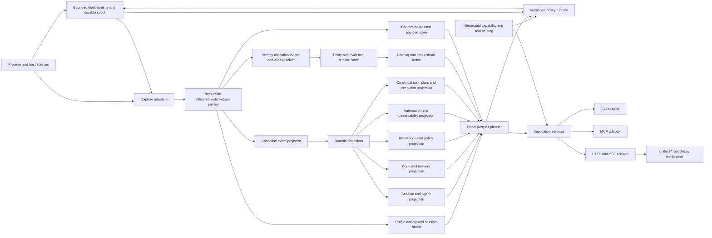

# TraceDecay Brain Rewrite and Product Redesign Implementation Plan

**Goal:** Defragment and rebuild TraceDecay as one elegant, scalable, extensible, local-first, cross-project intelligence system that can reconstruct, query, explain, visualize, replay, and improve the relationship between human intent, agent activity, code, Git, memory, policy, automation, cost, and outcomes.

**Architecture:** One logical “TraceDecay Brain” over federated physical stores: a profile catalog, a profile activity/session shard, project evidence/projection shards, immutable code-snapshot generations, and privacy-domain-scoped content-addressed payload stores. A Brain may remain entirely local or span enrolled machines through one fenced TraceDecay authority per mutable shard, semantic snapshots/event tails, verified replicas/caches, and the authenticated application/API protocol; SQLite/WAL files never cross a network filesystem. One capture/sanitization/observation boundary and stable identity/evidence model feed projections that are rebuildable within the retained evidence horizon. One typed query engine, one policy/replay runtime, one generated capability/host-integration catalog, and one application use-case layer serve thin CLI, optional MCP, official API/SDK, hook, dashboard, saved-view, lab, and generated Codex/Claude/Cursor bundle adapters. Skills plus CLI are the portable baseline; zero-to-three logical MCP facade registrations share one thin `tracedecay` integration binary, one private `tracedecayd` authority binary, one catalog, one authorization path, and one logical Brain.

**Tech Stack:** Rust workspace; standard host-local SQLite semantics through a storage trait, initially implemented with `rusqlite`, FTS5, and WAL; privacy-domain-scoped content-addressed blobs; optional local embeddings; Axum HTTP + SSE over authenticated HTTPS/mTLS for protected remote mode; React + TypeScript; the repository's existing Rsbuild/Rspack dashboard pipeline, changed only by a separate approved TraceDecay migration decision; the large-graph WebGL/Canvas stack selected by a current-and-10×-corpus renderer bakeoff rather than precommitted; ECharts for quantitative views unless the same visual-quality/performance gate rejects it; Canvas/WebGL + D3 scales for dense timelines; CodeMirror 6 for message/code/diff inspection. Tailscale is an optional connectivity profile, not a dependency; libSQL/Turso is evaluated prior art, not part of the first V2 default.

**External-evidence authority boundary:** a repository, tool, provider, workflow, UI, or architecture mentioned by a transcript, historical failure, research source, or conformance fixture is `Evidence`, `Fixture`, or `PriorArt`; its name, dependency, topology, and implementation do not become TraceDecay product authority. Promotion requires an explicit bounded TraceDecay decision that names the owner, behavior or dependency being adopted, local evidence, alternatives, compatibility and rollback. Hermes Kanban remains important prior art for the explicitly requested TraceDecay-native task graph and may be selectively ported, copied, or improved under source/license review, but neither whole-Hermes parity nor one historical Rspack/Rsbuild/React Router/provider topology governs unrelated host-neutral crates.

**Detailed execution plans:** [`tracedecay-v2/00-plan-set-index.md`](tracedecay-v2/00-plan-set-index.md) owns the per-crate, root-migration, frontend, dependency, PR-order, and cross-plan verification map.

Direct bounded-context authorities: [`01-domain-crate.md`](tracedecay-v2/01-domain-crate.md), [`03-capture-crate.md`](tracedecay-v2/03-capture-crate.md), [`04-projectors-crate.md`](tracedecay-v2/04-projectors-crate.md), [`05-query-crate.md`](tracedecay-v2/05-query-crate.md), [`06-policy-crate.md`](tracedecay-v2/06-policy-crate.md), [`07-hooks-crate.md`](tracedecay-v2/07-hooks-crate.md), [`08-tool-catalog-crate.md`](tracedecay-v2/08-tool-catalog-crate.md), [`09-application-crate.md`](tracedecay-v2/09-application-crate.md), [`11-dashboard-frontend.md`](tracedecay-v2/11-dashboard-frontend.md), [`12-root-compatibility-migration.md`](tracedecay-v2/12-root-compatibility-migration.md), and [`13-research-provenance-and-context-anchors.md`](tracedecay-v2/13-research-provenance-and-context-anchors.md). Plans 02 and 10 and cross-cutting plans 14–28 are linked at their owning sections and exhaustively indexed above; [`28-remote-multi-machine-shared-brain.md`](tracedecay-v2/28-remote-multi-machine-shared-brain.md) is normative for distribution.

## Global Constraints

- Local-first, single-user operation remains the default. No required network service or hosted database.
- Multi-machine operation is optional and transport-agnostic. Tailscale, another VPN, LAN, reverse proxy, or ordinary authenticated HTTPS/mTLS may provide reachability, but TraceDecay always enforces its own enrolled-node identity, grants, privacy, placement, and authority epochs.
- Exactly one fenced authority writes each mutable shard. Network-mounted SQLite/WAL, implicit multi-primary writes, last-write-wins state, and automatic cache promotion are prohibited.
- “One brain” is a unified logical model and product, not one failure-prone monolithic database.
- Every semantic responsibility has one canonical owner and generated/shared contract. V2 does not preserve parallel session/LCM, detector, query, scope, policy, status, error, command, renderer-state, or transport business-logic implementations.
- Compatibility/anti-corruption adapters are time-bounded migration code with owners, parity tests, retirement gates, and deletion PRs; they cannot become a permanent second architecture.
- Extensibility uses versioned typed SPIs and capability manifests with safety/resource constraints. New providers, detectors, projectors, rankers, policies, tools, and renderers plug into canonical pipelines rather than creating new stores/query stacks.
- `All` is the default product scope. Projects are filters and ownership/privacy boundaries, not separate dashboard products.
- No flag-day migration. V2 runs beside V1, imports and shadows it, proves parity, cuts over by bounded context, and retains rollback.
- Sanitized observations are append-only and preserve all non-secret source semantics within their declared retention horizon. Secret spans are never copied into the observation; optional raw forensic retention is isolated/encrypted/short-lived. A non-content tombstone/provenance skeleton survives retention or deletion.
- Derived data is versioned, provenance-bearing, rebuildable within the retained evidence horizon, and never silently treated as canonical.
- Every relationship says how TraceDecay knows it: observed, provider-declared, user-declared, derived-exact, inferred, or heuristic.
- Historical views never reconstruct hidden chain-of-thought. They show only provider-exposed reasoning summaries, user-visible rationale, actions, and evidence.
- No secret-classified content enters FTS, vector indexes, facts, fixtures, exports, logs, or committed test corpora.
- Every cross-project response reports searched, skipped, unavailable, stale, truncated, and redacted coverage.
- Every remote/cached response additionally reports authority epoch, placement generation, consistency mode, per-shard watermark/cache age, sync lag, and pending local observations separately from canonical state.
- `All` means the active TraceDecay profile by default. Additional profiles are federated only through explicit profile selection/collections and never mixed implicitly.
- Canonical provider transcripts live in a profile activity/session shard because a session may touch zero, one, or many projects. Project shards own scoped projections and locators, not duplicate canonical messages.
- Data migration and shadow parity are mandatory; stale live CLI/MCP/daemon/plugin protocols and obsolete tool names are not emulated after their domain cutover. Version mismatch fails with restart/update and the current replacement.
- V1 stores remain read-only from their domain's verified cutover until one full release of V2-default operation completes (the rollback/evidence window). Deletion is an explicit later operation, never part of migration.
- The plan PR contains only this master plan and its linked per-crate/frontend plan documents. Research exports remain untracked outside the repository.

---

## 1. Executive Decision

TraceDecay has accumulated the pieces of an agent intelligence system, but those pieces are organized as storage and transport islands. Code graph, sessions, LCM, memory, analytics, hints, automation, workflows, Git correlation, response handles, and dashboard plugins each have useful local capabilities, yet they cannot answer a single joined question such as:

> Starting from this user request, what did the parent agent and its subagents see, infer, retrieve, decide, invoke, change, test, commit, encounter in GitHub, teach TraceDecay, and affect downstream—and how certain is every link?

The redesign will make that question native.

The selected strategy is a strangler rewrite around five foundations:

1. **Canonical identity:** stable entities and aliases across providers, projects, worktrees, branches, sessions, messages, agents, code snapshots, symbols, facts, artifacts, and delivery systems.
2. **Immutable evidence:** observations, typed events, bitemporal relation assertions, provenance, confidence, sensitivity, and algorithm versions.
3. **Shared query platform:** one bounded `TraceQueryV1` AST and application-service layer used by every transport and UI.
4. **World-class investigation and experimentation product:** one concept-led evidence-cartography workbench with global scope/time/query state, stable profile atlas, composable graph lenses, Causal Loom replay player, precise Explorer, domain workspaces, and one hermetic branch/sweep/compare/minimize experiment cockpit shared by every lab.
5. **Convergence governance:** one owner/contract per concept, strict crate dependency direction, generated transport/client/catalog bindings, extension SPIs, architecture lint, complexity budgets, parity receipts, and mandatory retirement of superseded paths.

The rewrite will not copy every current table into a larger database or place every entity in a giant force graph. It will preserve physical isolation and use purpose-specific views over one evidence model.

## 2. Evidence Base

### 2.1 Live system snapshot

The audit was run on 2026-07-09/10 UTC from a clean worktree created from and repeatedly refreshed against `origin/master`; the accepted source base was refreshed on 2026-07-11 to `81fe404c00bfa1b6a3d1e33a9b3da61d77025cc4` at crate version 0.0.58. It includes merged #447–#452, with #452's Windows coverage merged before #451's release as required; draft plan PR #421 was the only open PR at the latest refresh. Early store/analytics snapshots used installed TraceDecay 0.0.44; the final original planning probes used installed 0.0.47, and the reconciliation audit used installed 0.0.52 before later source releases merged, so every runtime observation remains version-labeled rather than being silently upgraded to newer source semantics. During research, the live store continued ingesting sessions, so counts are timestamped snapshot values rather than timeless constants. The direct `project_list` snapshots before and after the early rebase both reported 25 repositories; concurrent audits observed 28–29 searched/registered scopes, reinforcing the requirement that inventories carry a timestamp, tool/runtime identity, catalog generation, runtime version, and watermark rather than presenting a drifting count as timeless.

| Signal | Observed evidence | Design consequence |
|---|---:|---|
| Registered repositories returned by the project-list snapshot | 25 | `All` must be a first-class scope with shard pruning and partial coverage. |
| Final doctor registry/watcher snapshot | 29 active watched roots; 179 profile-sharded registry entries; 12 orphan manifests; one stale missing-worktree row | Registry, watcher, store-manifest, and live-root inventory need one reconciled view with explicit populations, not separate timeless counts. |
| TraceDecay code graph | 38,510 selected-shard nodes, 74,602 edges, and 987 files in the final identity-conflict/storage receipt | Graph scale is locally tractable, but cross-project rendering requires clustering and level of detail. |
| Locally tracked TraceDecay branch graph stores | 14, commonly about 140–150 MB each in the inspected branch list | A physical database per branch multiplies nearly identical state; V2 needs immutable packed snapshots plus bounded overlays and ref pointers. |
| All-provider LCM native-message rows (V1 table named `raw`) | 418,346 at the final supported status snapshot | V2 sanitizes before persistence; timeline/search/export must be cursor-based, virtualized, and server-aggregated. |
| LCM summary nodes | 1,541 | Summaries are derived lineage artifacts, not a separate source of truth. |
| LCM estimated store tokens | 12,978,427 | Query budgets, payload externalization, and visible truncation are product requirements. |
| LCM compression ratio | 9.4:1 | Compression health is useful, but must link to exact source coverage and replay. |
| Hook calls | 59,618 | Hooks are a high-volume event stream and need cheap append paths. |
| All-scope analytics usage page | 10,000 capped events; 102 defined tools; 43 used tools at the frozen probe | Aggregate adoption and raw-event coverage must be separate: a capped event page cannot be presented as the whole population. |
| Installed MCP-equivalent TraceDecay tool names | 102 at the older frozen compatibility inventory; plan 21's generated audit at commit `9f7a1108` is the arbiter and counts 104 source MCP tool definitions with 103 installed at 0.0.47 | Capability exists but is hard to discover and scattered; one generated catalog must own use-case IDs and every transport binding. |
| Hints emitted | 1,182 | Hint policy needs replay, explanation, and outcome attribution. |
| Hint outcomes measured as acted | 3 | The current feedback loop is mostly unresolved and cannot support confident optimization. |
| Analytics event sample | merged PR #424 moves exact totals/tool/hint sections to DB-side aggregates and adds >10,000-event coverage while bounded raw-event lists remain separate | Raw lists need stable pagination and explicit caps; exact aggregates must execute before sampling, declare denominator/horizon/watermark, and never render a tail sample as the whole. |
| Analytics `message_count` under `--all` | 0 while LCM contained 388k+ rows | Missing denominators must be `unknown`, not misleading zero ratios. |
| Managed skills | 10 active | Skills, automation runs, adoption, and evidence belong in one observable lifecycle. |
| Automation-lane coverage | selected shard reports `automation_files=0`, while the conflicting legacy shard reports 3,470; automation config/runs fail at identity resolution before a legal lane can be selected | Profile/project scope and skipped/conflicting lanes must be explicit; zero in one selected shard is not proof that no automation evidence exists. |
| Memory/fact scope drift | an early project memory-status view showed 0 facts; the final selected shard had 17 while the preserved legacy shard had 129 | Memory scope and branch/project/profile/store ownership are currently easy to misread; zero in one lane is not a global absence claim. |
| Early fact-store search | failed with `file is not a database`; the final direct selected-shard MCP path worked while worktree CLI resolution still refused the identity split | Store routing, corruption isolation, partial results, and repair evidence must be visible per domain and resolved store. |
| Doctor on the same checkout | reported active DB integrity as healthy | Every response must identify the exact store/shard/runtime used; “healthy” cannot be ambiguous. |
| Project-list response | truncated without a retrieval handle | Structured APIs must paginate before renderer-level truncation. |

The final selected-versus-legacy refusal is a concrete migration fixture, not an abstract warning. The selected shard `proj_ceaa713e40fef2b2` was healthy with 38,510 nodes, 987 files, 17 facts, 2,003 sessions, 432,790 messages, 419,887 LCM rows, 14 branch stores, zero automation files, five payload files, and three response files. The preserved legacy shard `proj_b4a8bbe4953823c4` was also healthy with 36,596 nodes, 989 files, 129 facts, 4,129 sessions, 603,866 messages, 592,594 LCM rows, 197 branch stores, 3,470 automation files, 1,839 payload files, and four response files. Neither is a disposable duplicate. Until the #425 workflow or its V2 successor freezes, backs up, reconciles, verifies, and atomically cuts the identity markers over, every affected semantic tool must return both candidates and typed unavailable coverage rather than initialize, guess, or report a misleading empty lane.

### 2.2 Code-health snapshot

The final 0.0.53 code-health pass against exact `master` reported:

- Quality signal: **7,108 / 10,000** across 993 files.
- Acyclicity: **0.5067**, with 2,475 edges in nontrivial strongly connected components.
- Equality: **0.383**, with complexity Gini **0.617**; depth **1.0**; modularity **0.9966**; redundancy **0.9384**; coverage discipline **0.9998**.
- The design-structure matrix contained 5,017 file edges and 137 clusters; the largest cluster held 67 files. `src`, `src/dashboard`, `src/automation`, `src/extraction`, and `src/mcp/tools/handlers` had the largest boundary-edge populations.
- High fan-in included `src/automation/config.rs` (279 coupled files), `src/dashboard/graph_api.rs` (275), `src/dashboard/lcm_api.rs` (181), `src/global_db.rs` (121), and `src/storage.rs` (97). High fan-out included `src/mcp/server.rs` (46), `src/mcp/tools/handlers/info.rs` (41), `src/main.rs` (38), and `src/commands.rs` (35).
- Major production files remained 2,800–4,900 lines: `src/global_db.rs`, `src/mcp/tools/definitions.rs`, `src/sessions/lcm/query.rs`, `src/mcp/server.rs`, `src/migrate/hermes.rs`, and MCP session/info handlers.
- A bounded redundancy scan found 6,255 candidate pairs before ranking. Definite examples included C/C++ and GW-BASIC/MS-BASIC extractor methods, 15 copies of `visit_children`, Cline/Roo MCP install/uninstall functions, duplicated row string decoders, and duplicated YAML scalar parsing.
- The current workspace is one Rust package with 59 library modules, 416 `src/**/*.rs` files, and roughly 267k source lines. Physical package count did not prevent semantic fragmentation; V2 crate boundaries are justified only when they act as dependency/capability firewalls and replace more handwritten machinery than they add.

These are not merely file-size problems. They show that persistence, application logic, transport rendering, project routing, and policy decisions are not separated by stable interfaces.

### 2.3 User-intent evolution from LCM

The supported LCM export recovered tens of thousands of chronological `role=user` rows across more than one thousand sessions between 2026-06-28 and 2026-07-09. A separate human-authored subset is required because Claude protocol tool-result rows are also stored as `role=user`.

The evolution is coherent:

1. **Operational foundation:** daemon visibility, telemetry, background curation, skills, memory, and automation must be continuously runnable rather than manual curiosities.
2. **Self-introspection:** TraceDecay must inspect its own usage across projects and transcripts, measure whether agents use the right tools, and improve from real evidence.
3. **Finish-the-loop automation:** work should progress from discovery through code, verification, PR, merge, release, local upgrade, and post-release health, with explicit state at every step.
4. **Lossless agent history:** sessions, tool calls, reasoning summaries, goals, subagents, files, Git, and outcomes must remain queryable without relying on topical snippets.
5. **Adaptive guidance:** hints, skills, memory, and tool discovery should be contextual, quiet when irrelevant, measurable, explainable, and testable against historical messages.
6. **One global Brain:** the dashboard should stop reflecting storage silos and expose TraceDecay as one cross-project system with powerful visual investigation and replay interfaces.

Repeated durable requirements:

- Dogfood TraceDecay on TraceDecay using real work, not synthetic demonstrations alone.
- Preserve complete inspectable history and exact technical evidence.
- Navigate globally, then narrow to project/worktree/branch/session/agent/time.
- Connect intent, agent behavior, code, delivery, memory, policy, and outcome.
- Measure whether self-improvement mechanisms are actually adopted and helpful.
- Make every automation and policy decision debuggable and replayable.

### 2.4 Research limitation that becomes a product requirement

The current public LCM surface cannot enumerate every session or perform a match-all role query. `lcm_grep` requires a text query, caps results at 100, and can disclose capped sessions without offering a complete cursor. The research export therefore had to recursively bisect time windows, union token-prefix searches, discover session IDs, then page `lcm_load_session` by stable store cursor.

V2 must add:

- `list_sessions(scope, role, provider, time, cursor)`.
- `list_messages(scope, roles, kinds, provider, time, cursor)` with no text predicate.
- Exact enumeration/export of all authorized retained sanitized session records for JSONL/Parquet with manifest, counts, hashes, privacy coverage, and redaction report; provider raw source remains locatable but is not copied when secret/retention policy forbids it.
- Explicit separation of human-authored messages from provider protocol rows.
- A snapshot watermark so an export can prove completeness while live ingest continues.

The private research artifact set is stored outside Git at `/fast/tracedecay-redesign-research/`: 34,344 chronological native `role=user` records in `user-messages-chronological.jsonl` (SHA-256 `edfe67d6baf9fd87faa9fd49c443a777bbb838c3eb36a79106c06f18a161baff`), a 9,980-record best-effort human-authored derivation in `human-messages-chronological.jsonl` (SHA-256 `5afb40d25f3fc43b86d620b25daea94a0b4f33ffc4421b5bb20b6a550b8c3bcb`), `manifest.json` with hashes/counts/caveats, and `intent-evolution.md`. The directory is mode `0700` and every corpus, manifest, report, and helper file is mode `0600`. Each row's `content_hash` is SHA-256 of retained sanitized UTF-8 content, never a residual pre-redaction fingerprint. The broad corpus came from supported TraceDecay surfaces; the active parent contributes 47 direct prompts with explicit `codex_rollout_raw_fallback` provenance—the original 28, 11 from the first bounded refresh, and 8 from the final bounded refresh—and excludes three post-cutoff internal goal/environment context envelopes. The final user-message cutoff is 2026-07-11 01:04:10.875 UTC.

### 2.5 Git-tool discovery failure is product evidence

The redesign investigation itself exposed a failure in TraceDecay's guidance loop. The request explicitly concerned `master`, a new worktree, open PRs, branches, and prior implementation intent. The first pass still reached for generic shell/GitHub inspection and only used TraceDecay's semantic Git tools after the user challenged the omission. No hook hint routed the task toward the existing branch, PR-context, changelog, correlated-session, or workflow tools.

After correction, the TraceDecay Git surface added useful evidence:

- `branch_list` exposed the locally tracked branch graph inventory and its fallback/tracking state.
- `pr_context` summarized changed symbols and architectural impact for every open PR branch.
- `changelog` exposed commit-level semantic history, but returned a much broader merge-base range than the live GitHub changed-file view for some branches.
- On PR #410, `pr_context` agreed on 16 directly changed files and the merge base, yet labeled thousands of transitive/file-level symbols as modified and emitted an extremely broad affected-test list. Direct diff facts, dependency impact, candidate tests, and low-confidence module fan-out need separate sections, counts, evidence, and caps.
- `sessions_for` recovered correlated implementation sessions for the Hermes migration branch, but none for the legacy-store branch or the newly active PR #410 branch.
- `workflows` found no correlated workflow records for those branches. Absence must render as named capture/index/coverage state, not proof that no agent or workflow participated.
- The final refresh discovered PR #423 and correctly attempted `tracedecay tool pr_context` first, but both the explicit redesign worktree and explicit repository root failed before Git analysis with the preserved selected-versus-legacy identity cutover conflict. After #423 and Hermes profile consolidation #407 merged, the same TraceDecay-first attempt for new analytics PR #424 still failed on that conflict and required `gh pr view` plus bounded Git diff. This proves capability discovery alone is insufficient: a semantic Git tool must either route through an authorized healthy identity, return both candidates with a retryable exact selector, or produce a structured partial result that preserves the remote/Git facts it can still answer; an unrelated store-identity conflict must not erase all PR context.

The 0.0.52 publication re-audit exposed two additional routing classes. FM-112: an explicit linked-worktree selector resolved to the base checkout, semantic grep scanned zero files, and read rejected a file inside the requested worktree as escaping the incorrectly selected root. The CLI with an explicit project path succeeded. In the same worktree, `sessions_for` returned zero while message search recovered the prior authorized actor `agent-abf181084b74689f2`. FM-113: a later explicit CLI read selected an empty/conflicting eligible identity while `doctor` in the same CWD called legacy store `proj_a5b3d7e3ebe14ca7` healthy with no identity drift; the same read subsequently succeeded without exposing the catalog/identity transition that changed the answer. Code, Git, transcript, workflow, doctor, CLI, and MCP tools therefore cannot each reinterpret a repository/worktree selector independently, turn disagreement into empty/healthy, or change identities without a durable shared scope-resolution receipt.

Final 0.0.53 verification added FM-115–FM-117. An explicit worktree sync identified the live long-running daemon as the conflicting sync-lock owner and suggested lock deletion while read/status still called the index 1,339 minutes/22 hours stale and “refresh in progress” without an operation ID. A piped `tracedecay status` ignored `TERM=dumb` and `NO_COLOR=1` and emitted a large true-color half-block dashboard. Finally, staged `commit_context` aborted on an optional test-annotation row whose file was not a valid SQLite database instead of returning healthy Git/diff context with partial enrichment coverage. V2 therefore makes refresh an observable fenced operation rather than a daemon-lifetime file lock, makes interactive TUI rendering an explicit TTY capability while plain/JSON status remains bounded and deterministic, and isolates corrupt optional indexes so semantic Git tools retain their primary answer.

This is not merely operator error. V2 must make the right capability discoverable at the moment of need, explain when live remote state and local semantic state answer different questions, and measure when the user has to correct tool selection. Required consequences:

- A Git-intent classifier for branch, worktree, commit, diff, PR, review, checks, release, blame, and historical-intent requests.
- A generated tool catalog with compact task-to-tool routing hints, including when live GitHub state must be refreshed before semantic analysis.
- Reconciliation metadata: local ref/merge base/indexed commit, remote head/fetched-at, fallback state, changed-file universe, and named disagreement between remote and semantic results.
- Typed fallback chaining: preserve the attempted capability, explicit scope, selected/legacy candidate IDs, unavailable semantic domains, safe Git/remote fallback result, and one retrieval/operation anchor instead of forcing the agent to restart the investigation manually.
- One canonical scope-resolution receipt shared by code, Git, session, workflow, memory, and fact tools: requested path, canonical repository, exact worktree/branch/snapshot, resolved root, index commit/watermark, searched population, and named disagreement.
- Semantic Git results that distinguish `directly_changed`, `structurally_impacted`, `candidate_test`, and `context_only`; never describe fan-out expansion as a direct modification.
- A `missed_capability` outcome when a relevant tool was neither suggested nor used, and a `human_correction` event when the user redirects the workflow.
- Hint evaluation that credits useful silence but penalizes missing a high-confidence, high-value repository capability.

### 2.6 Current-master accepted changes

The plan treats merged rows below as required base semantics at accepted source base `81fe404c`; rows explicitly marked historical or superseded remain differential constraints. The 2026-07-11 refresh verified #447–#452 merged in dependency order and found only draft plan PR #421 open. The former local `fix/session-catchup-integrity` worktree is merged evidence, but its V1 mechanisms remain differential fixtures rather than V2 authority. Its measured N×M catch-up amplification, exact-database recovery race, semantic-frame chunk-boundary loss, invalid checkpoint success, curator starvation, and hint-rollup contradiction are FM-153–FM-159; #450/#452 reinforce FM-095/FM-160. V2 deliberately does not port handler-static singleflight, transcript fan-out, branch databases, sidecars, query-triggered ingestion, inherited mutation authority, or process-local lifecycle state. Implementation must not rediscover or regress accepted behavior:

| PR/status | Behavior | V2 consequence |
|---|---|---|
| `#405` merged — legacy identity-store adoption | Expands legacy identity-store discovery/adoption and lifecycle migration coverage. | Preserve aliases and adoption receipts in the catalog migration; never create a second canonical project because a legacy directory or hash moved. Import resolver fixtures into V2 identity/backfill conformance tests. |
| `#406` merged — corrupt database recovery sets | Preserves corrupt database families instead of overwriting/destroying forensic recovery inputs. | Detect non-SQLite/corrupt/torn stores before open, quarantine the whole WAL/SHM/database family, preserve a signed recovery set, keep healthy shards available, and make operation-specific repair plan/start/recover receipts auditable. |
| `#412` merged — safe daemon drain during upgrades | Serializes update/upgrade/doctor lifecycle, drains in-flight requests/background writers, checkpoints after writer stop, and preserves systemd/launchd stopped/disabled/masked state. | V2 needs one fenced lifecycle coordinator across daemon, store, watcher, updater, doctor, migration, backup, and service manager; no environment bypass or unconditional restart. |
| `#407` merged — Hermes user profile | Consolidates Hermes onto the user's active profile, removes Hermes-specific bridges/config/inventory, and migrates legacy Hermes project identities/facts. | Profile is the durable isolation boundary; Hermes is an actor/automation/tool identity inside it, not a parallel product silo. Plan 24 ports or improves Hermes Kanban into a native TraceDecay product rather than restoring a Hermes task service. Historical Hermes data remains import evidence, and Hermes may separately be an execution host through the common worker protocol. Migration must retain fact provenance and record moved identities without copying content across privacy domains silently. |
| `#410` merged — collapse copied subagent prompts | Preserves native transcript rows, but adds query-time parent-representative dedupe and `direct_user`/`subagent`/`tool_result` filters across message search, LCM, CLI, and MCP. | V2 must preserve sanitized native rows and explicit message-origin classification while offering representative/human views with hidden-copy counts and provenance. Import its eight-child regression corpus and never make UI dedupe an irreversible ingest rule. |
| `#411` merged — foreign-installation skills are info | Aligns doctor with the remove path so it does not prescribe `update` for project skill packages this installation refuses to delete. | Health/remediation uses one shared typed predicate with the command precondition; every finding declares owner, severity, safe action, whether automation can execute it, and proof that the advertised remediation is actually applicable. |
| `#413` merged — release v0.0.46; `#416` merged — release v0.0.47 | Packages the audited storage/runtime/session/doctor/tool fixes into published release versions. | Record actual merge/release/catalog/schema versions in compatibility/import manifests; architecture must not depend on release-PR file layout or infer availability from source only. |
| `#414` merged — `tracedecay_move_symbol` with impact report | Adds a semantic Git/code mutation capability after hardening against data loss and span defects. | Import its historical effect/safety/dry-run/receipt evidence, then expose operation-specific V2 edit inspect/commit/recovery through generated API/CLI/MCP parity, Git-intent routing, and current-versus-live-ref conformance; no tool may bypass sanitizer/scope/application authorization. |
| `#415` merged — release PR integrity guard | Adds CI enforcement around release PR integrity. | Release/publication is a generated-contract transaction: crate/package/API/SDK/catalog/schema/version artifacts must be mutually consistent and partial publication blocks. |
| `#417` merged — doctor identity split visibility | Surfaces identity split conflicts rather than hiding competing legacy/selected stores. | Identity/store reconciliation is a first-class inspect/plan/start/recover application workflow; status names both authorities, evidence, serving refusal, and exact next action without destructive guessing. Import the live convergence-probe fixture from plan 19. |
| `#418` merged — release v0.0.48 | Packages merged move-symbol, foreign-skill ownership, analytics, and split-store consolidation changes at merge `3567e31e`. | Record source commit, package version, tag/package/catalog/schema digests, and partial-publication state in compatibility manifests; source merge still does not prove a particular installed host was upgraded. |
| `#427`/`#429`/`#431`/`#433` merged — releases v0.0.49 through v0.0.52 | Package the accepted consolidation, hook-lifecycle, registry, and related fixes through tag commit `09080e80`; publication head later advanced through #438 to `3bea5ec7`. | Treat release PRs as versioned publication evidence only; bind installed-runtime observations to their own reported version/catalog/schema digests. |
| `#419` merged — race-safe `move_symbol` writes | Rejects destination symlink escapes and same-file/hard-link aliases, revalidates both source/destination snapshots, uses atomic sibling renames, and avoids clobbering concurrent rollback edits. | Every V2 edit command carries exact source/destination identities and versions, revalidates immediately before commit, uses race-safe filesystem primitives, preserves legal in-project symlinks, and records rollback conflicts rather than overwriting concurrent work. |
| `#420` merged — proxy MCP before opening local stores | Chooses the managed-daemon proxy before resolving/opening local stores; reconnects one daemon connection per request across socket/PID replacement without replaying writes; schema changes still require a new host MCP session/tools list. | Root composition resolves proxy/local authority before any store side effect, delegates config-gated init to the daemon, never replays an uncertain write, and advertises typed reconnect-versus-restart/tool-catalog-refresh requirements. |
| `#422` merged — refresh MCP tools after daemon generation change | Negotiates `tools.listChanged`, carries stable client-instance and catalog-version metadata across per-request proxy connections, notifies once per client per daemon generation including same-version restarts, treats initialize/tools-list as current, bounds dedupe without eviction, and distinguishes stale host from stale daemon. | Catalog generation is a first-class handshake/status value. Long-lived hosts refresh without duplicate notices, forged/unbounded client IDs cannot exhaust state, fresh list/initialize suppresses redundant delivery, and schema incompatibility still produces explicit restart/update rather than silent fallback. |
| `#423` merged — preserve FTS5 relevance direction | Replaces `1/(1+abs(rank))`, which reverses negated FTS5 BM25 magnitude, with a bounded direction-preserving transform; adds a real exact operational-evidence-vs-unrelated-V2-facts fixture plus rare-term, once-per-explicit-search counter, context-enrichment, and analytics assertions. | Treat the fix as accepted-base behavior and retain the pre-fix failure as a hard retrieval regression. Ranking contracts must name native score direction/scale, normalize monotonically, separate access/retrieval telemetry from relevance, prevent rich-get-richer feedback, and evaluate exact operational evidence against plausible high-trust plan/memory distractors across CLI/MCP/context surfaces. |
| `#424` merged — aggregate analytics sections before sampling | Computes exact event totals and DB-side tool/hint rollups before rendering, removes the generic latest-10,000 cap from those aggregates, adds project/time indexes, and tests a >10,000-event window. | Treat aggregate-before-sample as accepted-base behavior: registered V2 metrics must aggregate over their declared population before presentation caps, keep bounded raw-event drill-down separate, expose cap/denominator/watermark state, and share one query/view across MCP/dashboard/API. |
| `#425` merged — explicit split-store consolidation | Adds the historical V1 offline consolidation planning/execution workflow (commands currently named plan/apply) for two nonempty profile shards: canonical cross-platform store paths, frozen SQLite families, unsupported-holder refusal, write reservations, dual backup, deterministic confirmation under lock, restartable ledger/staging states, explicit table merge/rebuild/reject dispositions, collision accounting, remapped LCM source-edge preservation, exhaustive verification, marker/registry cutover only after proof, and doctor recovery. Final head `d3bb28b57bef6f7fa513ff4b0645ce5e31a97872` adds holder identity by file/inode on top of `12182510` canonical macOS paths and `82cfa9b9` LCM-edge remapping; merge is `de3d05dc8f7f75028d8721b7d65c487459c5f170`. Linux/macOS/build/format/clippy and other checks passed; the repository's existing Windows-shard failures remained red on both #425 and release #418 and are retained as base failures, not waived evidence. | Treat it as accepted V1 anti-corruption behavior and generalize it rather than creating another merger: V2 exposes operation-specific consolidation inspect/plan/start; both inputs remain immutable through planning/verification; holder identity is path-plus-file identity; every table and derived edge has a disposition; privacy scans and backup manifests gate publication; cutover is one fenced identity transaction; recovery never guesses from path or newest mtime. |
| `#426` merged — recover untracked branch graphs | Recovers branch graph databases whose metadata was absent instead of omitting or garbage-collecting the only branch graph evidence. | Branch artifacts are inventoried by verified file identity and content fingerprint as well as metadata; reconstruction is explicit, resumable, and preserves unmatched databases until ownership is proven (FM-104). |
| `#428` merged — preserve divergent session variants | Distinguishes exact duplicate sessions from same-ID sessions whose content diverges across consolidation inputs, preserves both divergent variants, and remaps dependent rows. | Identity reconciliation must compare canonical content/provenance, allocate stable variant identities when histories differ, and remap every dependent message, LCM, summary, and source edge rather than choosing one row by ID (FM-105). |
| `#430` merged — index consolidation-family lookups | Replaces repeated recursive JSON/source scans with materialized indexed lookup tables during consolidation and verifies production SQL plans. | Every migration family lookup has an owned normalized index, bounded complexity, query-plan regression tests, and restartable materialization; scale cannot depend on recursively rescanning manifests or source rows (FM-106). |
| `#432` merged — hooks honor lifecycle quiescence | Requires hooks to acquire the lifecycle lease before startup/config/store work, drains provider input while quiesced, and avoids agent/plugin installation side effects in the exclusive maintenance window. | Every capture ingress, including short-lived host hooks, participates in the same cross-process fence before composition; quiescence is a typed non-ingest outcome, never a hidden local-store fallback (FM-107). |
| `#434` merged — conflict-safe registry reconstruction | Classifies eligible manifests, refuses alias/path ownership conflicts, reconstructs registry state transactionally under lifecycle ownership, and leaves blocked evidence for doctor instead of resurrecting stale owners. | Catalog recovery is an idempotent proof workflow: no path/alias theft, no retired-manifest resurrection, no partial publication, and no inferred canonical owner from recency alone (FM-108). |
| `#435` merged — keep FTS repair out of search reads | Separates FTS-only damage from whole-database corruption and prevents ordinary search from mutating or repairing the index. | Query paths are side-effect free and return typed degraded coverage; explicit maintenance owns diagnosis, fencing, repair, verification, and receipts (FM-109). |
| `#436` merged — disable graph mmap across peer checkpoints | Disables graph SQLite memory mapping where peer processes can checkpoint and replace pages, covering mixed-page checkpoint behavior. | All peer-opened graph connections use compatible no-mmap safety settings until a generation protocol proves immutable mapping; checkpoint/consolidation tests include mixed page sizes and concurrent holders (FM-110). |
| `#437` merged — release v0.0.53 | Publication-only release merged as `273f50c0` after #439/#440 and packages their accepted behavior without adding a new architecture authority. | Bind source/package/tag/catalog/schema digests and checks to the release receipt; never infer that the locally installed runtime upgraded merely because the source release merged. |
| `#438` merged — restart-safe applied-manifest retirement | Validates and transactionally retires only proven schema-2 `Applied` source/target manifest owners under an exclusive lifecycle capability while leaving original shard data untouched and the destination canonical; final head `4f7b2b2c`, merge `3bea5ec7`. | Import restart-safe retirement as accepted anti-corruption behavior: retries are idempotent, ambiguous ownership fails closed with doctor evidence, registry rows and manifests change atomically, and V2 preserves the exact applied-ledger/retirement receipt (FM-111). |
| `#439` merged — derive orphan stores from registry reconstruction | Reuses the read-only registry-reconstruction preflight to count only manifests actually missing project/alias/store/scope/artifact rows, replacing incomplete token-accounting/path proxies; final head `de55e376`, merge `974d423b`. | Doctor, health, migration, and repair share one per-manifest typed diff and population. Complete registry rows never produce an orphan warning; a reported orphan links the exact missing rows and reconstruction plan (FM-114). |
| `#440` merged — isolate registry diff conflicts | Independently preflights each eligible reconstruction plan so one conflicting manifest does not hide missing rows in unrelated manifests; final head `7a56db8e`, merge `0dd1fd7d`. | Preserve each conflict, continue classifying every unrelated manifest, and expose per-manifest reconstruction/detection receipts through the shared catalog/doctor truth (FM-114). |
| `#441` merged — Hermes memory/context routing | Merged as `a1de60b8`; gates first-turn guidance, routes memory/LCM from the logical Hermes session workspace, preserves selector-bound handle retrieval, isolates cloned context-engine state, consolidates every Hermes host profile onto the user TraceDecay profile, and ships profile-level `user-memory.db`/`user-sessions.db` compatibility stores. | Preserve the behavior as V1 parity evidence while replacing its adapter-local mechanisms: host profile/config target is distinct from TraceDecay data profile; every invocation carries immutable session/workspace scope; singleton/clone state has explicit per-session versus process-shared ownership; non-code greetings produce useful silence; compatibility-handle retrieval preserves canonical scope/auth; projectless activity remains activity-owned while durable user facts use explicit `DeclaredScope::Profile`; active-project memory composes profile plus exact-project facts with provenance. PR 33 imports the shipped compatibility stores once into activity knowledge and retires them after parity (FM-138–FM-143). |
| `#443` merged — post-update integration recovery | Merged as `fcc92afd`; narrowly repairs generated prompt blocks whose exact owned preamble and END marker survive without START, refuses ambiguous ownership, distinguishes automatic reinstall warnings from explicit migration failure, and migrates only provably neutral legacy Hermes sessions to user scope while preserving unresolved memory. | Generate one ownership grammar for install/update/repair/uninstall; exact orphan recovery is allowed only with unique signed/generated evidence and all ambiguous states fail closed. Legacy projectless classification is evidence-based per session/source, never “path missing means user”; unscoped memory is retained unresolved rather than promoted. Automatic update may continue after a typed preserved-source warning, but integrity/copy/identity/partial failures keep the operation pending and explicit migration remains strict (FM-151–FM-152). |
| `#445` merged — projectless Hermes host routing | Merged as `49bc0805`; derives host-profile ownership from explicit/configured/installed plugin identity, resets provider home per session, treats the Hermes home itself as projectless, keeps registered descendant repositories routable, dispatches user-scoped LCM/message/memory calls without project CWD, and separates direct registry/read-only selector/mutating route classes. | V2 generates route classes from the canonical use-case catalog: host-profile ownership and runtime workspace are separate typed inputs; a host home is never a project merely because it is CWD; explicit user/profile scope clears project locators; registry discovery is unscoped; cross-project selectors are read-only unless a use case explicitly authorizes mutation; project-required operations fail with a typed registered-project requirement. The daemon/application resolver, not generated Python or MCP adapters, owns the rule and neutral execution context (FM-139/FM-141/FM-142). |
| `#442`/`#444`/`#446` merged — releases v0.0.54 through v0.0.56 | Latest release merge `e8883933` packages #441/#443/#445; the intermediate release merges preserve their rollout order. | Bind source/package/tag/catalog/schema digests and checks to separate release receipts; never infer that a locally installed runtime or running daemon upgraded merely because source/release PRs merged. |
| `#447` merged — catch-up and integrity hardening | Merged as `c86952cd`; provider-scopes and coalesces V1 catch-up, scans Hermes sources once, preserves shared memory stores during branch operations, checks checkpoint busy/incomplete results, scopes graph recovery markers more narrowly, and emits Codex's required lexical `[hooks.state]` parent. | Preserve the observed semantics and negative fixtures, not its V1 owners: V2 uses explicit daemon refresh operations, semantic-frame-safe capture cursors, exact shard/generation fences, classified checkpoint receipts, and no branch databases/sidecars. The V2 bundle emits hook definitions only; it may probe/import the lexical trust form but never generates or edits host trust state. |
| `#448` merged — user message scope and daemon shutdown | Merged as `2e06272d`; catches up selected-profile user messages, rejects/normalizes more route classes, detects provider-ambiguous session IDs, hardens Cursor/Hermes identity, and drains schedulers, clients, and Codex app-server process groups. | Make query reads side-effect free and report explicit refresh coverage; qualify native session lookup by profile/provider; reject every project selector in user scope; centralize descendant-process supervision and shutdown admission fencing. Preserve the V1 bugs around optimistic `catch_up_performed`, process-local singleflight, and direct handler DB opens as red fixtures. |
| `#449` merged — release v0.0.57 | Release merge `716fcf99` packages #447/#448. | Bind source/package/tag/catalog/schema digests to the release receipt; source publication still does not prove installed or running runtime state. |
| `#450` merged — secure lifecycle handoff and Windows migration recovery | Merge `3b9e42bb`, head `6a33ffe4`; Windows stops trusting owner-sidecar text, releases/reacquires the OS lock across post-update, non-Windows V1 inheritance validates live PID/start identity, holder scans harden transient errors, and unsupported Windows migration/service paths are explicitly gated while recovery coverage expands. | Preserve as FM-095/FM-160 fixtures, not final architecture: V2 freshly acquires the OS lock/epoch for every mutating process on every platform, makes platform capabilities typed, and forbids broad suite skips from satisfying migration parity. |
| `#452` merged — restore Windows consolidation coverage | Merge `fc89e8be`, head `757fdb79`; re-enables the complete platform-neutral consolidation suite on Windows while keeping only a scoped test-only offline-guard substitution; production holder discovery remains fail-closed unavailable. | Accepted FM-095 fixture: supported semantic lanes execute on every platform, unsupported production authority is a typed refusal, and test-only substitution cannot weaken production policy. |
| `#451` merged — release v0.0.58 | Merge `81fe404c`, head `c5625c9e`; packages #450/#452 after the required coverage merge. | Publication-only accepted evidence. Preserve source/package/tag/catalog/schema digests and dependency order; a release receipt still does not prove the installed/running runtime upgraded. |

PR `#409` was closed without merge and superseded by release PRs `#413`/`#416`; every row explicitly marked merged above is accepted history where applicable. Latest audited `origin/master` is `81fe404c00bfa1b6a3d1e33a9b3da61d77025cc4` at 0.0.58; #421 is the only open PR and is this draft plan. The plan branch is merged with that accepted base. The implementation lead refreshes open PRs, merge bases, changed files, checks, and TraceDecay semantic context immediately before each program phase. If GitHub and TraceDecay disagree, record both snapshots and reconcile index/ref freshness before changing the plan.

### 2.7 Historical failure inventory

The chronological message corpus, TraceDecay session search, semantic Git tools, and merged-PR history were mined for failures—not only desired features. [`tracedecay-v2/14-historical-failure-regression-matrix.md`](tracedecay-v2/14-historical-failure-regression-matrix.md) owns exact anchors and regression disposition. The recurring classes that shape V2 are:

| Historical failure pattern | Representative evidence | Required V2 invariant |
|---|---|---|
| Store damage under disk-full/process death | Live graph DB became non-SQLite data; #406 recovery sets | Preflight capacity, atomic staged publication, integrity before replace/open, whole-family quarantine, no destructive self-heal, kill/disk-full matrix. |
| Daemon/update/doctor concurrent I/O | #370 read-only doctor; #412 live WAL/background-writer upgrade race | Fenced lifecycle lease, drain/stop/checkpoint order, owned task registry, explicit service-state restoration, typed busy/unsafe refusal. |
| Repository/worktree/store identity drift | Renamed checkout fallback #269; persistent identity/worktree isolation #371; #405 | Canonical repository identity, durable aliases/adoption receipts, worktree/ref as views, conflict quarantine, no path-hash identity split. |
| Private append/lock races and platform semantics | #323 JSONL append locking; #328 Windows ledger handles; #399 private lock mode | One writer/lease owner, private creation at first syscall, cross-platform lock conformance, fsync/ack levels, bounded spool/retry. |
| Global backfill invalidation and process races | #374 process-safe sweep; #387 per-provider marker versions | Per-source/provider/parser checkpoints and generations; one adapter change cannot reparse every provider or reset unrelated offsets. |
| Missing or duplicated structured agent evidence | #325/#348/#350/#352/#372/#382/#383; #384 reasoning dedupe; #410 prompt copies | Complete sanitized-native observations plus typed origin/tool/reasoning/goal/Turn projection, versioned dedupe views, native expansion, provider conformance fixtures. |
| Session/Git attribution overclaim | #369/#376 produced-vs-observed; #397 merge-base; current `pr_context` impact inflation | Produced/observed/encountered/direct-change/impact/test/context are distinct evidence roles with freshness, confidence, caps, and abstention. |
| LCM/search noise, caps, and incomplete enumeration | #358 ranking noise; #361 over-match; #375 cap disclosure; this export required time/token bisection | List-all cursor APIs, origin/audience filters, visible caps/hidden counts, stable distributed cursors, rank explanations, exact export manifest. |
| Hook spam, wrong routing, trust, and weak outcomes | #319 compact steering; #331 trust drift; #336 host parity; #401 compiler trust; 1,182 hints but three acted | Versioned deterministic policy, compact capability routing, exact payload/replay, dedupe/budgets, trusted evidence classes, terminal/missed/corrected outcomes. |
| Tool/host discoverability and namespace drift | #330 dual MCP namespaces; #344 naming; #368 optional discovery; #400 Cursor showed only `graph`; this plan missed Git tools | Generated catalog and bindings, host capability handshake, one current name, high-confidence contextual routing, availability/fallback explanation, missed-capability feedback. |
| Doctor false positives and impossible remediation | Stale degraded Cursor logs #316; read-only mismatch #370; foreign-skill nag #411 | Findings and commands share predicates; health names exact store/owner/runtime; informational drift is not warning; every repair has an operation-specific inspect-or-plan, precondition, authorized start, and receipt. |
| Automation/self-improvement unsafe or low-value output | #295 output hardening; #338 retries/autonomy; #359 paraphrase dedupe | Evidence-bounded candidates, deterministic validation/policy, autonomous versioned effect/use/outcome/revision/recovery lineage, idempotent jobs, explicit autonomy configuration, and no per-item approval queue or unrecorded self-modification. |
| Memory corruption, scope, and extraction errors | #349 long fact mangling; current fact search opened non-database while doctor reported healthy | Immutable fact versions, scope-aware owner, exact source slices, integrity/routing identity in every response, quarantine/partial state, retrieval without hidden mutation. |
| Installer/plugin/upgrade drift across hosts | Marketplace/schema/cache/permission fixes #268/#273/#278/#303; release/asset/drift fixes #310–#313; branding #400 | Generated host manifests, schema conformance, installed-version/source identity, transactional install/update, current capability handshake, actionable failure without stale-client fallback. |
| Flaky/order-dependent/cross-platform tests | Windows/env/global-state/watcher/timeout fixes #204/#207/#255/#283/#285/#326/#334/#351/#393/#394; current libtest-only backfill failure; final merged-#424 CI run had all five Windows shards fail, with shard 1 exposing an unavailable `tracedecay_ast_grep_rewrite` hint route, lifecycle lock error 33, Hermes path-string mismatch, and a Linux/macOS-only service-install path exercised by a Windows update test (fresh run evidence, not attributed causally to #424's diff) | No process-global mutable test state, hermetic clocks/env/ports/stores, generated platform capability/route matrix, normalized path identities, typed lock/service support, nextest/libtest contract, deterministic shutdown, platform matrix, and failure-class quarantine rather than retries as proof. |
| Observability without denominators or retrieval handles | Empty analytics message count, 10k cap, unresolved hint outcomes, truncated project list | Every metric declares population, horizon, cap, source watermark, and unknown state; every truncation returns stable cursor/export/retrieval anchor. |

Compatibility lesson: non-disposable on-disk evidence must be migrated and retained for rollback, but V2 does **not** emulate stale running MCP/daemon/plugin clients or guess obsolete tool names. Protocol/catalog mismatch fails with an explicit restart/update/current replacement. Shadow adapters exist only inside the bounded migration and disappear at domain cutover.

### 2.8 Message-search quality probe

A small supported-surface replay compared exact, paraphrased, conceptual, and misspelled queries with `catch_up=false` so the new query would not immediately index itself. It is diagnostic evidence, not a statistically complete benchmark:

| Query class | Observed behavior | Design consequence |
|---|---|---|
| Exact rare phrase: disk-full/non-SQLite graph corruption | Correct human issue was returned, but after a prior tool command that contained the query text and a copied assistant delegation. | Penalize query/tool self-echo and copied protocol/delegation rows; group by source issue/session and prefer direct human/native evidence. |
| Paraphrase: volume ran out of space during indexing | Returned many topically related disk/build/cache failures, but the exact graph-store corruption case did not reach the top ten. | Lexical recall is useful but intent precision is weak; evaluate semantic/entity/reranking stages against labeled paraphrases. |
| Exact doctor/foreign-skill/remediation query | Found the correct issue/delegation/user rows at the top, plus implementation/review copies. | Preserve exact phrase/BM25 strength; representative clustering and origin/kind filters must remove duplicate workflow noise without losing sanitized-native expansion. |
| Paraphrased impossible-remediation query | Found implementation and review traffic, but mixed the exact issue with unrelated health/skill sessions. | Use entity/event/PR/session anchors and intent-aware reranking, not embeddings alone. |
| Conceptual nearby-agent/duplicate-work query | Found useful shared-worktree and parallel-agent cases, but also repeated identical results copied across sessions. | Add agent/work-claim graph retrieval, duplicate clusters, session diversity, and deliberate-redundancy labels. |
| Misspelled hint/subagent query | Found the current exact misspelled request, but this does not prove general typo tolerance. | Add character n-gram/fuzzy retrieval and a typo corpus; never infer quality from one self-match. |

Current message search is therefore useful for rare exact terms and high-recall forensic discovery, but not yet a reliable “best contextual answer” layer. V2 must benchmark a composed retrieval stack—lexical phrase/BM25, character fuzzy, entities, event/Git/agent graph, optional local dense representations, recency, duplicate clustering, and optional local reranking—then select the smallest stack that improves labeled metrics and latency. Embeddings are a candidate component, not a default claim of quality.

The final live audit made the temporal failure concrete. Broad all-registered searches returned 81K–311K semantic payloads behind expiring response handles and were frequently dominated by tool definitions/calls, current-query echoes, generated inventories, and copied session rows. TraceDecay context found one logical parent message replicated under twelve session/store IDs. More importantly, a retained `memory-ranking-supersession` fixture proves an obsolete exact “use npm” fact can still outrank the newer “use pnpm” correction; current message/LCM search has no general authority, correction, contradiction, supersession, or valid-time resolver. Current `message_search` is FTS/BM25 plus filters/downranking, while `lcm_grep` has distinct raw/summary and relevance/hybrid/recency semantics; raw BM25 scores are also compared across independent project shards without a shared calibration guarantee.

V2 therefore separates immutable message occurrences, evidence-backed logical-copy clusters, summary DAGs with exact source horizons, and temporal assertions with typed `corrects`/`replaces`/`contradicts`/`revokes` relations. Query mode is explicit: current, historical as-of, evolution, or forensic. Recency is an explained bounded feature, never a truth rule; direct human corrections, Git/check/command evidence, scope, validity, and authority decide current state, while uncertain conflicts expose both sides. Before promotion, at least 500 real query episodes and 5,000 human-grounded judgments span projects/providers, exact IDs, paraphrases, copies, summaries, corrections, cross-project work, no-answer/partial states, and task-context pollution. The source audit, twelve seed regressions, qrel schema, metrics, Search Quality Lab extension (folded into that lab, not a separate Search Lab), and cutover live in [`tracedecay-v2/23-session-lcm-temporal-retrieval-and-evaluation.md`](tracedecay-v2/23-session-lcm-temporal-retrieval-and-evaluation.md).

### 2.9 Cross-project, store, session, and code-graph scope probe

The Rspack/Rsbuild/React Router project family exposed a systemic failure rather than one missing search feature. In `session:019f42c9-623a-7cc0-95c1-f073eaa05a4d`, an agent concluded that Rsbuild/Rspack were not registered and fell back to installed packages. The user corrected this in `session:019f4323-f569-74c0-9988-ea3851d14fd7`: the projects existed, but the initial project list capped at 25 and `project_search "rsbuild rspack"` required one contiguous substring. `session:019f4325-57ef-7a53-b6a0-5c583c759301` isolated the single-`LIKE` root cause. Other historical cases include first-CWD Claude attribution, active-base-checkout PR/graph context when another worktree was intended, provider `project_key` acting as a public session boundary, missing-code-index hints suppressing healthy session/memory capabilities, stale/duplicate registry stores, and doctor reporting local/global scope inconsistently.

The supported surface currently compounds these problems: `message_search(project_scope="all_registered")` can return a stable session ID from another project, while `lcm_load_session` is active-project-only and rejects a project selector. A result that cannot be expanded exactly is not a usable global search contract.

V2 therefore has one typed scope plane across API, CLI, MCP, dashboard, hooks, and SDKs. Explicit repository/path/worktree/ref/PR/session targets never fall back to the active project. Provider keys and paths remain aliases/provenance; profile activity owns canonical session discovery, while project shards own scoped code/knowledge/delivery projections. Every federated response reports exact repository/worktree/ref/snapshot, searched/skipped/unavailable/stale/redacted coverage, rank/source evidence, and a location-independent retrieval reference. The complete architecture, Rspack/Rsbuild/React Router regression corpus, transport ergonomics, and implementation slices live in [`tracedecay-v2/16-cross-project-repository-worktree-scope.md`](tracedecay-v2/16-cross-project-repository-worktree-scope.md).

### 2.10 Secret/redaction architecture probe

TraceDecay has redaction components, but current behavior is fragmented and not a system guarantee. `src/sessions/lcm/raw.rs` can redact API-key assignments, bearer tokens, passwords, private keys, and sensitive JSON keys before LCM/session FTS projection, yet `ingest_config` defaults `sensitive_patterns_enabled` to `false`; production providers do not establish one mandatory policy. `src/memory/hygiene.rs` separately rejects secret-like fact content, but not every tag/entity/source/metadata field or V1 backfill. Provider/tool/session/hook/summary paths, response handles, backups, dashboard raw routes, logs/analytics, and already-derived FTS/vector/cache generations lack one complete enforcement and repair boundary. LCM status also reports `redaction.enabled` when any lossy row exists rather than whether protection is configured and coverage-complete.

The current planning corpus added a practical scanner lesson: four marker-only private-key matches were conservatively removed, while a permissive authenticated-URL scan over serialized JSON produced a cross-field false positive that disappeared when values were parsed and scanned independently. The plan set and sanitized private corpus then passed `gitleaks 8.30.1` with zero findings. This does not prove live TraceDecay stores are clean; no supported whole-profile retroactive audit currently exists.

V2 therefore has one mandatory, versioned, parse-before-scan sanitizer and taint-state contract before every persistent/searchable/output sink; optional short-lived encrypted quarantine; privacy-safe findings/markers; synthetic canary evaluation; and a retroactive containment/rotation/rebuild/backup/restore workflow. Exact current code gaps, primary research, product surfaces, test matrix, and PR slices live in [`tracedecay-v2/18-secret-detection-redaction-and-private-data-safety.md`](tracedecay-v2/18-secret-detection-redaction-and-private-data-safety.md).

## 3. Current Architecture and Why It Blocks the Product

### 3.1 Current physical and semantic islands

| Domain | Current primary shape | Disconnection |
|---|---|---|
| Project registry | Global tables for projects, aliases, stores, graph scopes, artifacts | Does not provide one canonical entity namespace for sessions, agents, code, facts, or delivery. |
| Code graph | Branch-scoped graph DBs with nodes, edges, files, vectors, fingerprints, redundancy, cache | Scope is implied by physical DB; edges lack provenance, confidence, validity, and snapshot identity. |
| Sessions | `sessions`, `session_messages`, turns, FTS, offsets | Provider IDs and project keys vary; tool/reasoning structure often remains JSON. |
| LCM | Duplicate raw-message projection, summary DAG, lifecycle, FTS, payload metadata | Copies session content and uses separate identity/query paths. |
| Git correlation | Session spans and commit-session relations | Stronger provenance than other domains, but links stop at session/commit granularity. |
| Workflows | Workflow runs and agents with string references | No enforced agent/session/artifact/code identity. |
| Memory | Facts, entities, banks, vectors, trust/feedback, FTS inside graph storage | Project knowledge inherits branch-graph lifecycle and mutable-row authority. |
| Hints/analytics | Durable analytics plus hook JSONL fallback | Outcomes, inputs, policy versions, exact payloads, and downstream actions are weakly joined. |
| Automation | JSON/JSONL config, ledgers, outcomes, proposals, skill files, artifact directories | Cannot be transactionally queried with sessions, policies, facts, or provenance. |
| Payloads | LCM payloads, response handles, automation artifacts use separate conventions | Hashing, retention, ownership, access, and GC are not uniform. |
| Dashboard | Shell plus separate Memory, LCM, Graph, Savings, Diagnostics, Settings plugins | Navigation follows stores/plugins, not investigations; no true All scope. |
| Query stacks | Graph DB APIs, LCM query module, memory scorer, dashboard SQL, MCP handlers | Ranking, pagination, filtering, error semantics, and scope differ by transport. |

### 3.2 Identity failures

- `project_id`, `project_key`, project hash, project path, repository path, alias path, and worktree path compete as identifiers.
- Sessions may be provider-qualified or bare text depending on table/API.
- Message IDs, `store_id`, row IDs, workflow IDs, run IDs, hint IDs, response handles, and summary nodes occupy unrelated namespaces.
- Code node IDs include file path, kind, name, and line. Moving a symbol changes its identity.
- Facts and entities use local mutable integer IDs.
- Branch/worktree/PR relationships are often stored as strings or inferred from time windows.

This makes joins heuristic and makes history brittle under moves, renames, rebases, force pushes, path aliases, transcript rewrites, and branch deletion.

### 3.3 Missing canonical events and provenance

TraceDecay currently normalizes enough to search and aggregate, but it does not retain one typed event vocabulary for:

- Human prompt, assistant response, visible reasoning summary, system/developer context, and content parts.
- Tool invocation, tool result, approval, failure, retry, cancellation, and latency.
- Parent/child agent creation, message, handoff, task, goal, and lifecycle.
- File read/edit/create/delete, patch, symbol change, diagnostic, test selection, test result, and build.
- Worktree/branch/ref observation, commit produced/observed, PR/check/review/release encounter.
- Hint evaluation, hint suppression, exact injected payload, memory injection, retrieval candidates, and measured outcome.
- Automation scheduling decision, skip, lock, run, artifact, curation candidate, validation, autonomy decision, automatic effect/recovery, and downstream adoption; historical/provider approvals remain evidence only.

Without those events, the timeline cannot distinguish observed facts from temporal coincidence or reconstruct what TraceDecay knew at a historical point.

### 3.4 Query fragmentation

Search currently exists as separate implementations for code FTS/vectors, session-message FTS, LCM raw/summary FTS, memory FTS/HRR, analytics, Git correlation, and automation files. Cross-project message search opens stores and merges results in application code without a stable distributed cursor or normalized rank explanation.

The V2 query platform must replace transport-specific query orchestration. MCP, CLI, and dashboard become adapters over the same typed use cases.

### 3.5 Dashboard gap

The current shell has six product tabs and one selected project. URL state mainly preserves the active tab. Useful capabilities exist inside individual plugins, but the system cannot:

- Search all entity types and projects in one query.
- Follow a prompt through parent agent, subagents, tools, code, tests, commits, PRs, hints, facts, and automation.
- Share or restore a full investigation state.
- Explain incomplete results, store selection, caps, ranking, or stale shards.
- Replay a historical message through the current hint/retrieval/ingest engine.
- Compare sessions, agents, policies, branches, snapshots, or time ranges.
- Switch a result among graph, timeline, table, matrix, chart, and inspector views.

Large frontend owners such as the LCM page, semantic map, association graph, settings panel, and graph canvas also combine data fetching, query state, rendering, and interaction behavior.

## 4. Alternatives Considered

### A. One monolithic profile database

**Advantages:** easy joins, one migration chain, one transaction boundary.

**Rejected because:** code graph rebuilds, transcript ingest, automation, memory, and dashboard reads would share contention and corruption blast radius. Backup, retention, privacy, and project deletion would become coarse. “One brain” does not require one file.

### B. Preserve current stores and add only an aggregate dashboard façade

**Advantages:** quickest visible All view and smallest initial code change.

**Rejected as target because:** it preserves duplicated IDs, N-store open/query/merge, inconsistent search semantics, missing provenance, and transport-specific business logic. It is useful only as a compatibility step.

### C. Central PostgreSQL/pgvector service

**Advantages:** strong concurrency, SQL federation, ANN, replication, team deployment.

**Rejected as default because:** it adds server operations, credentials, network failure, and an online dependency to a local developer tool. The logical contracts should permit a future server backend without requiring it.

### D. Unified logical model over federated embedded shards

**Selected.** A profile catalog coordinates project-owned event/evidence stores, immutable graph snapshots, and content-addressed payloads. Transactions remain local; outboxes and watermarks make cross-shard consistency explicit. This preserves local-first operation and bounded failure while enabling one query/product model.

## 5. Target System Architecture



### 5.1 Deployment boundary

V2 starts as one Rust binary with internal traits and ports for capture, projection, query, policy, and API. This avoids premature distributed-system overhead. Boundaries must allow a future daemon/query split without changing domain contracts.

### 5.2 Bounded contexts

1. **Capture:** source discovery, offsets, rewrite generations, hashing, parsing, redaction/classification, immutable observations.
2. **Identity Catalog:** profile, repository, project, checkout, worktree, branch/ref, provider, actor, agent instance, session, message, code snapshot, symbol lineage, aliases.
3. **Evidence Ledger:** canonical events, temporal relation assertions, provenance, confidence, sensitivity, algorithm versions.
4. **Agent Execution:** turns, messages, content parts, tool invocations/results, visible reasoning summaries, goals, parent/subagent trees, workflows, handoffs.
5. **Work Orchestration:** initiatives, immutable plan versions, canonical work items, typed dependency gates, assignments, executor routes, fenced leases/attempts, context packets, workspaces, handoffs, artifacts, acceptance, outcomes, and costs.
6. **Code Intelligence:** snapshots, files, symbol entities/occurrences, edges, diffs, diagnostics, tests, impact, ownership. [`tracedecay-v2/25-code-intelligence-indexing-crate.md`](tracedecay-v2/25-code-intelligence-indexing-crate.md) owns extraction, incremental reuse, and generation construction; root/capture owns watcher intake and projectors issue canonical build requests.
7. **Delivery:** Git refs, commits, worktrees, PRs, checks, reviews, releases, remotes, fetched-at state.
8. **Context Intelligence:** LCM summary DAG, compression decisions, context assembly, external payload lineage, replay.
9. **Knowledge:** versioned facts/claims, entities, decisions, contradictions, trust evidence, retrieval, feedback, curation.
10. **Policy Runtime:** hints, retrieval, routing, diagnostics, correlation, curation, scheduling, policy bundles, deterministic evaluations.
11. **Automation:** jobs, schedules, scheduler decisions, runs, agents, artifacts, curation candidates/autonomy decisions/effects/recovery, skills, outcomes, plus imported historical approval evidence.
12. **Observability and Accounting:** usage, latency, errors, caps, savings, cost, ingest/projection lag, data quality, privacy events. This context is owned by [`tracedecay-v2/26-observability-accounting-and-usage.md`](tracedecay-v2/26-observability-accounting-and-usage.md).
13. **Capability Catalog:** stable use-case definitions, transport/skill/hook/dashboard bindings, availability, safety, cost, discovery, compatibility, and generated inventories.
14. **Query and Projection:** `TraceQueryV1`, planners, read models, rankers, saved views, subscriptions, exports.
15. **Privacy Safety:** mandatory structured sanitizer, taint/sink eligibility, detector registry, protected quarantine, privacy scans/findings/remediation, and restore eligibility. This is one cross-cutting boundary owned by plans 01–04/18, not a detector reimplemented in each domain.

### 5.3 Hook, hint, and concurrent event-stream architecture

Hooks are latency-sensitive capture adapters, not miniature application servers. Their synchronous path is strictly bounded:

1. Parse the host notification into typed fields and run the mandatory bounded sanitizer; incomplete/timeout returns a blocked non-content receipt.
2. Normalize the sanitized hook request, allocate the source/session sequence, and append only eligible content plus an idempotent sanitization/observation receipt to a private spool or activity-shard journal.
3. Read one immutable policy/context snapshot selected by explicit watermarks.
4. Classify intent, generate candidates, apply relevance/dedupe/cooldown/token/privacy budgets, and render at most the allowed hint payload.
5. Append the evaluation/envelope receipt and acknowledge the host; slower enrichment/projectors run asynchronously.

The hot path performs no cross-project fan-out, embedding, repository indexing, network fetch, automation run, or long write transaction. Its p95 added wall time target is 10 ms for notification-only hooks and 25 ms for prompt-evaluation hooks on the reference corpus; timeout returns no hint plus a durable, non-content error receipt.

Ordering and concurrency contracts:

- Each provider artifact/source instance has a monotonic source sequence; each session/agent stream has a projected sequence. There is no invented total global order.
- Every observation carries occurred time, ingested time, source sequence, rewrite generation, and causation/correlation links. Late events are inserted without rewriting prior history.
- One bounded writer actor owns each SQLite shard connection. Concurrent agents enqueue append batches through a private spool; read services use short-lived read-only snapshot pools.
- The daemon is the only ordinary live process allowed to construct the V2 store factory, own mutable SQLite connections, checkpoint WAL, run query read pools, publish snapshots, or swap generations. CLI, MCP, hooks, dashboard, SDKs, automations, installers, and provider plugins call the daemon application service over authenticated local IPC or the protected HTTP API; they never open SQLite or fall back to an embedded writer/reader when the daemon is unavailable.
- WAL, busy timeout, queue depth, maximum batch bytes, maximum transaction duration, and checkpoint thresholds are explicit configuration with safe defaults and telemetry.
- Database snapshots/backups/branch evidence are transactionally consistent products, never filesystem clones: no copy, reflink, hard link, main-file-only archive, or DB-without-WAL family operation is legal on a live shard. A short writer-admission barrier spans embedded fence commit through acquisition and fence/head verification of the dedicated online-backup read snapshot; only then may writers resume above the pinned state. The reopened destination must contain the same fence before page/row-family manifests are derived. `VACUUM INTO` is legal only in drained exclusive maintenance at a stable fence. Verification then covers header/application/schema/page counts, integrity, file and parent fsync, and atomic manifest publication; an externally sampled watermark can never label snapshot bytes.
- Queue saturation applies tiered backpressure: coalesce rebuildable notifications, spill canonical observations durably, and reject/mark optional enrichment. It never silently drops prompts, tool events, approvals, edits, or outcomes.
- Idempotency is per source record. Projectors and outbox consumers are at-least-once and idempotent. Leases are fenced by generation; a crashed owner cannot resume writes after a new owner takes over.
- Readers receive vector watermarks and may request frozen, live, or eventual consistency. No read transaction survives UI think time or cursor pagination.
- Crash tests cover process death before/after spool fsync, observation commit, outbox commit, hint render, host acknowledgement, projector checkpoint, and WAL checkpoint.
- Corruption-resistance tests additionally race writes, readers, passive/TRUNCATE checkpoints, online backup/`VACUUM INTO`, generation publication, daemon restart, disk-full, short write, bit flip, truncation, and killpoints. They prove no architecture-induced corruption or committed-WAL omission; unavoidable media faults are detected before publication, quarantined as a whole DB/WAL/SHM family, and recovered from a verified snapshot without hiding healthy shards.

The hint engine is a deterministic, versioned policy pipeline:

`RequestFacts -> context snapshot -> intent categories -> capability candidates -> eligibility/privacy -> relevance -> repetition/cooldown -> token/latency budget -> rendered payload -> terminal outcome`

Every evaluation records policy bundle, classifier, tool catalog, project/index, memory/fact, skill, configuration, and prompt-template digests; candidate scores; suppressions and reasons; exact injected payload reference; latency; and terminal outcome. Outcomes distinguish acted, ignored, contradicted, duplicate, unavailable capability, unresolved, missed capability, human correction, and unknown observation horizon. Historical replay can use exact historical artifacts, current artifacts, or an explicit mixed comparison; missing artifacts make replay incomplete rather than approximate silently.

Parent/subagent spawn, delegation, message, handoff, join, interruption, goal, and completion are canonical events. Multiple agents may append concurrently, but shared branch/worktree/file impact is derived from evidence-bearing relations, not assumed from temporal overlap.

#### Incremental Context Scout

An optional daemon-side `IncrementalContextScout` consumes the canonical event outbox after capture/projectors and incrementally prepares context while a Turn evolves. It may use deterministic rules and, when the configured model gateway advertises an eligible capability, a low-latency model such as App Server Spark. The model proposes structured bounded exploration only; application authorization executes at most catalog-approved read-only message/LCM/memory/code/Git/delivery/coordination/task capabilities, and pure policy decides whether one anchored suggestion beats silence. Model/provider names, fallbacks, tools, scope, egress, budgets, and delivery modes come from the configuration/catalog handshake, never hardcoded daemon logic.

The scout emits a `SuggestionEnvelopeV1` addressed to an exact profile/thread/Turn/session/agent/logical-message tuple, with expiry, policy/config/catalog/model/index/watermark receipts, evidence and retrieval anchors, dedupe fingerprint, and host delivery policy. The hook hot path never waits for scout model/search/tool work; it performs only a bounded pending-envelope claim/revalidation/render within a 2 ms p95 target and returns no suggestion on contention, lateness, ambiguity, privacy failure, or weak relevance. Late/stale/superseded envelopes are not injected into another Turn. No suggestion is the default; one category gets at most an initial delivery and one evidence-strengthened escalation within hard per-Turn/session/token budgets.

Task/ticket/claim events are not global board broadcasts. A sibling change reaches a working agent only when a typed dependency, material work-claim overlap, blocker, handoff/context packet, or invalidated assumption connects it to the current task and exact Turn. Observatory, Causal Loom, Hint Lab, Settings, CLI/MCP/API/SDK, replay, evaluation, privacy, and phased cutover are specified in [`tracedecay-v2/22-incremental-context-scout-and-suggestion-envelopes.md`](tracedecay-v2/22-incremental-context-scout-and-suggestion-envelopes.md).

### 5.4 Generated capability and tool catalog

TraceDecay currently has substantial capability, but definitions are scattered across MCP schemas, CLI commands, skills, dashboard actions, provider hooks, and prose. V2 generates one versioned catalog from typed application use cases. Each capability declares:

- Stable capability/use-case ID, version, owner crate/domain, aliases, status, and replacement/deprecation.
- Inputs/outputs, scope kinds, entity/event kinds, read/mutate classification, side effects, idempotency, streaming/pagination, cost/latency class, and required freshness.
- Availability prerequisites: daemon, indexed project/ref, live remote refresh, credentials, provider/host support, protected-mode unlock, and permissions.
- Privacy/sensitivity behavior, audit events, and exactly one execution mode: read-only, direct commit, confirmed destructive, autonomous policy effect, resumable workflow, or internal host lifecycle. Curation never generates an item approval/apply binding.
- MCP tool, CLI command, HTTP route, dashboard command/panel, skill, and hook-intent mappings generated from the same definition.
- Examples and compact routing copy suitable for dynamic hints; catalog digests are part of policy replay.

The compatibility inventory must include every current capability family: project/registry/doctor/diagnostics; code search/context/grep/definition/call/path/impact/tests/health; branch list/search/diff, PR/commit/changelog, correlated sessions/workflows, Git refresh/fallback; sessions/LCM search/load/status/lifecycle/export; memory/facts/entities/feedback/curation; hints/analytics/usage/cost; automation/scheduler/runs/artifacts/proposals/skills; configuration/integrations/daemon/watch/index/migrate/repair/backup; query/render/response handles. The generated inventory, not a hand-maintained list, is the cutover authority.

Discovery is itself observable. For each eligible prompt, the policy runtime records capabilities considered, suggested, used, unavailable, or missed; whether a fallback was chosen; and user correction evidence. The dashboard exposes coverage/drift by intent category without turning every prompt into a noisy catalog advertisement.

The complete current surface and output audit lives in [`tracedecay-v2/21-cli-mcp-tool-surface-and-output-unification.md`](tracedecay-v2/21-cli-mcp-tool-surface-and-output-unification.md). Its generated inventory must cover all 104 source MCP tool definitions (103 installed at 0.0.47; 102 at the older frozen inventory — plan 21's generated audit at commit `9f7a1108` arbitrates these counts), the complete recursive top-level/nested/hidden CLI command tree, runtime capability filtering, every current dashboard route, every alias/allowlist/default/format/effect/error, and the installed-versus-source catalog digest; CLI and dashboard-route counts are frozen by that generated inventory, never hand-maintained numbers. One sealed typed application view feeds canonical JSON and a pure presentation model; MCP defaults to compact Markdown, CLI defaults to deterministic human output, machine formats are explicit, and no renderer traverses arbitrary JSON or silently drops fields.

### 5.4A Cross-host skills, commands, agents, hooks, and MCP bundles

`HostIntegrationManifestV1` is the sole semantic source for TraceDecay workflows, specialist roles, hook intents, lifecycle/capture mappings, context-delivery modes, executor capabilities, install components, capability requirements, fallbacks, and bindings. A pure `tracedecay-tool-catalog::host_bundles` compiler deterministically lowers it into unsigned Codex, Claude Code, Cursor, and Hermes `HostBundlePayloadV1`/plugin-overlay trees plus capability-difference and release-scan/conformance/provenance/SBOM inputs. PR 36R alone independently rebuilds, scans, conformance-tests, attests, signs, and publishes `HostBundleManifestV1`; neither payload nor signed envelope copies workflow, permission, task, hook-materiality, or tool semantics. Plan 09 owns authorized/idempotent install lifecycle operations, and one root-private deployment/probe/config adapter performs approved host effects with protected backups and ownership receipts. No host-bundle crate or second installer state machine is added.

Portable skills and generated CLI recipes are the default component and must complete every supported workflow with MCP absent. A host may additionally install any supported subset of the `context`, `work`, and explicitly privileged `operator` MCP facade companions. These are separate logical trust-boundary registrations, not separate server implementations. Every facade is bounded and correct when a client eagerly injects all enabled schemas; host-native deferred tool search is an optional optimization. Commands remain thin explicit aliases where the host needs them, rules/instructions stay short and scoped, hooks call one stdin dispatcher, and specialist agents receive explicit task/scope/worktree/retrieval-anchor handoffs. Host-specific capability, precedence, inheritance, cloud, trust, update, and packaging behavior is never inferred from another host. TraceDecay models each host as a composition of observer, context-provider, knowledge-steward, executor, and operator capabilities rather than one installed/not-installed flag or lowest-common-denominator score.

Cross-host continuity is a first-class product path. Work may begin in Claude, Codex, Cursor, or a Hermes CLI/gateway/background session and continue in another host only through a bounded, privacy-filtered, versioned context/handoff packet that preserves canonical intent, decisions, unresolved questions, exact scope, retrieval anchors, artifacts, task/lease state, budgets, and source watermarks. The receiving host reauthorizes current grants and records its own capability snapshot; it never inherits source-host permissions or receives the entire transcript. For every model-visible context delivery, TraceDecay records what was offered, selected, omitted, truncated, redacted, and delivered, then measures only observable downstream use/outcomes rather than claiming that delivery caused model behavior.

Official documentation and stock-host probes are evidence-dated and classified as documented, validated, or assumed. Unsupported/undocumented/version-gated surfaces are omitted with the same skill/CLI/API fallback and a checked difference, never emulated under a misleading native name. Installation, Settings, doctor, CLI, API, and Observatory expose package/component versions and digests, capability/probe state, trust, ownership, stale cache, MCP profile exposure, drift, restart/repair state, and operation history without leaking paths, config bodies, credentials, backups, or cache contents. The complete design and Codex/Claude/Cursor/Hermes source and stock-host matrices live in [`tracedecay-v2/27-cross-host-agent-plugin-bundles.md`](tracedecay-v2/27-cross-host-agent-plugin-bundles.md).

### 5.5 Agent proximity, work claims, and non-redundant coordination

TraceDecay should make agents lightly aware of nearby work without turning the hint engine into a chatty presence bot or a global lock manager. The canonical coordination objects are:

```text
AgentPresence(agent, session, parent, provider, host, profile, heartbeat, expires)
WorkClaimV1(agent, goal/task, repo, worktree, ref/PR, files/symbols/query/domain,
            read-or-write intent, planned artifact, safe summary, redundancy mode,
            status, version, started, heartbeat, expires, retrieval anchors)
```

`redundancy_mode` distinguishes accidental overlap from deliberate best-of-N, diverse review roles, paired/shared implementation, sequential handoff, and explicitly disjoint work. An advisory claim never grants write ownership. Existing store/file/Git/lifecycle leases remain the authority for mutations that require exclusion.

Agent-nearness is an evidence-scored query, not “same repo means warn”:

- Direct same task/goal/artifact or overlapping file/symbol write intent.
- Same worktree or branch with intersecting write/diagnostic/test/PR scope.
- Parallel worktrees with the same branch, PR, merge base, affected symbols/tests, or semantically overlapping research query.
- Parent/subagent/sibling/handoff relationships and declared disjoint scopes.
- Claim/presence freshness, current status, heartbeat/TTL, provider coverage, and uncertainty.

The dynamic hint is eligible only at a high-value boundary: session/subagent start, before a first edit/mutation, before expensive research/index/PR review, when a new high-overlap claim appears, or when either claim changes materially. It is suppressed for stale claims, low overlap, acknowledged overlap, declared intentional redundancy, already coordinated peers, and repeated unchanged overlap.

Compact example:

> Nearby work: 2 agents overlap `session-query / subagent dedupe`. Maxwell is reviewing hooks/catalog in this repo; Tesla is mapping Turn projection. Inspect `session:019f…` or run `nearby_agents`; coordinate only if your planned files overlap.

Payload rules:

- One deterministic safe summary line per relevant agent, normally at most 160 characters and at most two peers plus a hidden-count/inspect action.
- Stable agent/session/goal/work-claim/research anchor IDs; no full prompt, chain-of-thought, secret path, or private payload.
- Exact reason/overlap fields and source watermark available through inspector/tool, not dumped into the prompt.
- Dedupe key `(recipient_agent, overlap_signature, claim_versions, policy_bundle)`; one delivery until material change, acknowledgement, expiry, or configured cooldown.
- Actions: inspect context, message peer, request handoff, accept deliberate overlap, mark scopes disjoint, update/release claim, or mute this signature. Silence remains a successful outcome when no action is useful.

Analytics measures the opportunity funnel, not raw hint volume:

- Eligible overlap, suppressed reason, emitted/delivered, inspected, messaged, handed off, scopes split, deliberate redundancy confirmed, ignored, false positive, unresolved, expired.
- Subsequent duplicated reads/queries/edits/tests and conflicting writes by evidence class; “work avoided” is estimated/labeled, never asserted from temporal coincidence.
- Precision among judged high-overlap hints, useful-action rate, repeat rate, token/latency cost, first-useful-context time, and missed-overlap corrections.
- Breakdowns by same versus parallel worktree, provider, parent/sibling/unrelated agents, task type, read/write intent, and policy version.

Historical replay corpus:

- Current redesign parent session `019f4906-a411-7a11-ad3f-0d58deb0e847` and its anchored child sessions: mostly disjoint authored plans plus intentionally overlapping review passes; copied coordination events and missing parent tool-use IDs test false-positive resistance.
- PR #359 review wave child sessions `agent-ac3ce9b1ebf998cfb`, `agent-a245d2442cefc621d`, `agent-a96d21dc6391ceba8`, and `agent-a6661fd133491631c`: identical review prompts test deliberate ensemble labeling versus accidental duplication.
- Cursor shared-worktree session `ebc96a27-b046-4c88-865f-b38d76da9d2d`: many agents in one checkout test explicit file ownership, collision risk, and compact neighborhood summaries.
- Cursor coordination session `c48804a4-9c7f-4ce1-a771-95c3702654b2`: nine sibling agents with disjoint file ownership test that declared scopes suppress redundant warnings while preserving material conflict alerts.

The replay lab compares no-awareness, current policy, and candidate policy; shows every candidate/suppression/payload; and never writes a live claim, message, fact, counter, or hint outcome.

### 5.6 Unified multi-repository, project, and worktree scope plane

`ScopeSelectorV2` is a domain contract shared by every transport. It selects All, profile, saved project set, repository, project, checkout, worktree, branch/ref, commit/snapshot, PR, session, agent, workflow, initiative, plan, work item, execution attempt, executor, saved view, or collection; includes explicit freshness/partial/as-of policy; and resolves natural-language names, paths, remotes, and stable IDs through one application service.

Resolver invariants:

- Stable ID, exact path/remote/alias, token-aware terms, fuzzy candidates, and graph-related candidates are distinct explained channels.
- An explicit target either resolves or returns bounded candidates and one ready-to-retry request; it never runs against `current` instead.
- `current` is permitted only when the request supplies no target and is always rendered as the resolved project/worktree/ref/head.
- `project_key`, first/last CWD, path hashes, store directories, and graph filenames are internal aliases/evidence, not public identity.
- Repository/project/worktree/ref identity survives moves, renames, rebases, branch deletion, and checkout removal through temporal aliases and adoption receipts.
- Domain availability is independent: missing/stale code graph does not hide profile sessions, messages, facts, Git, automation, or registry tools.

Profile `activity.db` stores canonical provider sessions, Turns, messages, agents, and tool events once. Project/worktree attribution is a bitemporal relation per observation with evidence roles such as `produced_in`, `executed_in`, `queried`, `discussed`, and `observed`; a session may have zero, one, or many attributed repositories over time. Search and exact-load tools route global entity/retrieval IDs through the catalog rather than requiring the caller to select a store or change CWD.

Code federation selects one immutable graph generation per repository/worktree/ref snapshot, reports dirty/base/index drift, prunes shards with catalog statistics, and merges bounded results with per-repository diversity and source explanations. Cross-repository edges—dependency, plugin/host API, PR/base/head, fork/patch, generated artifact, benchmark/downstream, and session/agent evidence—are typed, versioned, and traversed only when requested or policy-authorized. All-scope never means “open every database and concatenate.”

The frozen Rspack/Rsbuild/React Router family is one named cross-repository regression slice inside a diverse synthetic/local corpus: one query must resolve the plugin, upstream API, bundler implementation, framework semantics, related worktrees/PRs, and downstream benchmark evidence without manual registry loops. Passing this slice never requires those live repositories, makes their package choices TraceDecay dependencies, or substitutes for provider-neutral multi-repository coverage. CLI common flags, MCP `scope`, HTTP schemas, generated SDK types, dashboard scope controls, distributed cursors, errors, and coverage metadata are generated or validated from the same contract. See [`tracedecay-v2/16-cross-project-repository-worktree-scope.md`](tracedecay-v2/16-cross-project-repository-worktree-scope.md).

### 5.7 System convergence, organization, and extensibility

The rewrite is complete only if it removes fragmentation rather than recreating it in new crates. The canonical flow is:

```text
source/provider -> classify/sanitize/capture -> observation journal -> identity/evidence
-> deterministic projectors -> query/search/graph -> policy/replay -> application use case
-> generated/thin CLI | MCP | API/SDK | hook | dashboard/lab adapter
```

Each arrow crosses one typed contract. No downstream layer reparses a provider payload, resolves a project independently, reruns a different secret detector, opens arbitrary storage, constructs its own ranking, infers remediation, or invents a transport-specific status/error. Cross-cutting metadata—scope, sensitivity/redaction, provenance, confidence, occurred/ingested/valid time, watermarks, coverage, capability/version, cost, authorization, retention—survives end to end.

The daemon is the sole ordinary database authority: every business/query request from CLI, MCP, dashboard, SDK, hook, or provider crosses the authenticated local/remote application protocol, and no client receives or opens a database path/handle. Strong local mode runs the private daemon/maintenance entry under a dedicated service identity whose state/WAL/backup/key roots deny client traversal while a service-owned socket/pipe grants connect-only access; a user-side source broker supplies registered transcript/repository evidence without broad daemon access to the user's home. Portable same-user mode is explicitly degraded. SQLite snapshots bind their exact watermark through a transaction-committed fence copied inside the pinned online-backup snapshot; main-file copying/reflinking and externally attached watermarks are forbidden.

Convergence rules:

- One canonical domain type/registry owns each identity, event, scope, predicate, capability, error, receipt, query, policy, and command semantic.
- One repository/application port owns each read/write use case. Store SQL, provider parsing, and transport rendering never leak across the boundary.
- One generator/contract IR emits CLI flags, MCP/HTTP schemas, OpenAPI/JSON Schema, SDK types, dashboard client types, tool/skill/hint metadata, docs, and compatibility inventory.
- One declarative registry substrate supplies stable ID/version/owner/schema/deprecation/canonical-digest machinery to the domain, capability, use-case, configuration, metric, error/status, and extension registries; each owner supplies semantics, not another loader, hasher, replacement engine, or drift harness.
- One projector runtime owns leases, checkpoints, gaps, dead letters, deterministic batch digests, lineage invalidation, rebuild, publication, and lag. Code, accounting, sessions, knowledge, and automation provide registered reducers/builders rather than new runners.
- One application operation substrate owns fenced epochs, heartbeat, CAS, idempotency, checkpoints, cancellation, progress, compensation boundaries, and receipts for migration, export, privacy repair, indexing, automation, and task execution. Domain-specific admission and state remain typed; there is no generic preview/apply framework.
- One hermetic experiment harness reuses that operation substrate for every lab's immutable create/run/status/cancel/resume/retry, branch, sweep, aligned trace/comparison, anchoring, and minimization. Evaluators contribute typed stages only; they receive no production write/counter/cache/lease ports and emit a resource-access receipt proving zero live effects.
- Provider/host integrations and language extractors are descriptor/query-pack driven. One canonical host-integration IR, one pure catalog-owned bundle compiler, one application lifecycle, and one root-private deploy/probe/config adapter replace copied manifests/installers; shared framing, traversal, result construction, and conformance harnesses replace per-host/per-language mechanics without hiding true differences.
- Every graph/timeline/metric use case lowers to shared sealed data plus `VisualizationEnvelopeV1<T>`, one thin `WorkspaceSlotFrame`, and typed renderer viewport/interaction/accessibility/fallback/export capabilities over a generated visual-semantic ontology; domain lenses add registered node/edge/lane/metric semantics, not endpoints, cursors, filters, legends, or UI transforms.
- Versioned SPIs admit providers, detectors, projectors, rankers, policies, tools, and renderers under explicit capability/safety/resource contracts. An extension cannot create an unregistered side store or bypass sanitization/scope/auth/audit.
- Physical sharding, graph generations, caches, workers, and future daemon/query separation scale behind stable ports without multiplying semantic models.
- Every temporary V1 adapter has a named owner, inbound/outbound contract, parity fixture, metrics, last-allowed phase, deletion PR, and CI rule preventing new call sites.
- Architecture lint enforces dependency direction, transport/store isolation, raw-string/SQL restrictions, schema/catalog bijections, public-type uniqueness, module/file complexity budgets, and zero orphan compatibility paths.
- A convergence scorecard tracks duplicate authorities, bypass call sites, direct SQL/store opens, schema drift, adapter call volume, parity gaps, extension conformance, large files/condition growth, and retired code/data.
- A negative-code ledger separates parity replacement from net-new product work and records handwritten/generated production lines, public items, packages, dependencies/features, duplicate-body clusters, tables, background workers, binary size, idle RSS, startup, clean/hot build time, and bytes/files retired. A compatibility slice cannot claim completion while its replacement increases handwritten parity code or leaves its duplicate machinery live without an expiring ADR.

The target is modular, not microservice-shaped: one Rust process initially, bounded crates and internal services, predictable names/layout, small reviewable modules, and few high-quality extension seams. New behavior should extend a registry/trait/predicate and inherit identity/scope/privacy/query/replay/observability behavior automatically. The complete current-to-target convergence matrix and retirement program live in [`tracedecay-v2/19-system-defragmentation-convergence-and-extensibility.md`](tracedecay-v2/19-system-defragmentation-convergence-and-extensibility.md).

### 5.8 Fully autonomous curation

Memory, fact, managed-skill, session-reflection, profile-learning, and related Hermes-style curation are continuous autonomous system behavior—not proposal inboxes awaiting human preview/approve/apply/rollback clicks. The canonical loop is:

```text
registered relevant change -> scope dirty frontier -> real quiescence/materiality
-> effective-input digest/admission -> generic operation -> evidence -> candidate
-> deterministic validation/policy -> transactional revalidation -> autonomous staged effect
-> use/outcome monitoring -> autonomous revise/recover/archive
```

- Each job version classifies its trigger as evidence-driven, time-driven, external-event, or manual and declares one input contract: relevant event/projection channels, scopes, materiality/quiet rules, ignored self-effects, dependency digests, and bounded version-change reevaluation policy. An evidence-driven job becomes dormant after `NoChange` until a declared relevant per-shard frontier advances; wall-clock due time cannot reopen it. A time-driven job treats time as an explicit input rather than smuggling cron into curation.
- A scheduler tick over an unchanged scope performs no broad store/session scan, creates no `automation_run`, calls no model/tool, and charges no work. The first unchanged decision opens one bounded, coalesced skip episode; later identical observations update its aggregate count/last-seen metric rather than append fake run rows. A new relevant frontier, authorized dependency reevaluation, retry transition, or material quiescence transition closes that episode.
- Quiescence requires a finalized Turn/session boundary, no relevant ingress for the minimum quiet interval, active-writer awareness, and a maximum debounce; unknown activity or partial coverage defers and can never be called idle. The launch boundary revalidates the sealed per-shard input manifest.
- Admission atomically compares the cursor/frontiers and unique effective-input digest, records the policy/admission receipt, and starts one generic fenced operation. The consumed frontier advances only after committed effects or legitimate terminal `NoChange`; late ingress remains pending. Retryable failure resumes the same operation/input under shared attempt/backoff/deadline/circuit semantics, deterministic poison input quarantines, and uncertain effects require reconciliation. `run-now` may shorten quiescence but cannot bypass identical-terminal-input dedupe or privacy/ownership/resource gates.
- No public curation-item command named preview, approve, reject, apply, install, or rollback exists.
- The policy runtime remains pure; an application-owned worker autonomously applies every eligible owned effect with exact expected versions, privacy/ownership/evidence/resource gates, idempotency, and audit receipts.
- Unsafe, weak, foreign-owned, secret-like, conflicting, or out-of-authority candidates are automatically rejected, deferred for evidence, protected, or quarantined; they do not become a needs-human queue.
- Operators control curation through versioned configuration, pause/resume/run-now, pin/protect/exclude, and feedback. The UI exposes history, reasons, staged scope, use/outcomes, and automatic recovery without making inspection a gate.
- Automatic recovery/revision is policy-driven and outcome-triggered. Historical V1/provider approval/rejection/apply events remain imported evidence but do not define the V2 workflow.
- Destructive non-curation administration—store deletion, migration, key destruction, external publication—retains its separate safety/confirmation contract.

The configuration system, including autonomy policy and the redactor/detector policy, is fully discoverable/editable in Settings and through generated navigable CLI commands; [`tracedecay-v2/20-configuration-control-plane.md`](tracedecay-v2/20-configuration-control-plane.md) owns the exact control-plane contract.

### 5.9 Canonical task/plan graph and multi-agent executor

TraceDecay owns one profile-level initiative/plan/work-item graph in the activity shard. A board is a saved authorized `TraceQueryV1` projection plus layout/grouping/policy; it is never a database, ownership boundary, dispatch selector, or source of task identity. The same work item may appear simultaneously in a project board, an agent slice, a repository view, a Kanban lane, a dependency DAG, a timeline, and an All initiative without copying its ID, dependencies, history, or authority.

This is a native TraceDecay Kanban/orchestration implementation sourced from a deliberate Hermes port-and-improve program—not an adapter that forwards task operations to Hermes. Proven Hermes algorithms, tests, schemas, and interaction patterns may be ported directly under pinned MIT provenance; incompatible pieces are behaviorally ported or replaced with stronger V2 designs. TraceDecay ships and operates the resulting scheduler, task graph, worker lifecycle, tools, and UI. Hermes remains optional only as an execution host or historical capture source.

The core entities remain separate: `Initiative`, `Plan`, immutable `PlanVersion`, versioned `WorkItem`, typed gating dependency, acceptance criterion, decision, assignment, `ExecutionAttempt`, fenced `TaskLease`, executor registration/route receipt, workspace binding, `ContextPacketManifest`, handoff, artifact, outcome, and cost. Task↔Thread/Session/Turn/Agent and task↔code/Git/PR relations are many-to-many, bitemporal, evidence-bearing links. A long thread may serve many tickets; one ticket may span many agents, sessions, repositories, worktrees, branches, and PRs.

Complex plans also need an agent-native bulk editing path. An authorized caller can freeze an explicit initiative/plan/query/saved-view selection and dependency closure into one private, expiring, sharded CommonMark workspace with a restricted YAML 1.2 frontmatter grammar. `manifest.md` pins owner/scope resolution, base plan/entity versions, schema/catalog/config/policy/access/sanitizer/content digests, closure, and expiry; plan/work-item files use stable IDs or local new-entity keys, keep graph/lifecycle/acceptance/assignment/model-route fields typed in frontmatter, and keep long objective/specification prose in Markdown bodies. Stable-ID fan-out supports very large graphs without one enormous JSON request, file, or directory.

The edit bundle is an operation artifact over the one task graph, never a draft-plan store, board database, second event stream, or filesystem-owned source of truth. Strict validation returns exact file and UTF-8 source spans; missing files/fields never imply deletion; semantic diff reports graph/gate/acceptance/route/readiness/critical-path/active-attempt impact; three-way rebase merges only disjoint semantics and emits explicit conflicts into a successor workspace. Final submit revalidates every pin and atomically CAS-commits all canonical versions/events/head changes or none. Export, staging, progress, cancellation, idempotency, receipts, sanitizer, contained paths, TTL, cleanup, and crash recovery reuse shared kernels. Successful submit purges raw workspace content and retains only versions/counts/digests/allocation/audit/anchor/cleanup receipts. A bundle may deliver the skill and CLI workflow without MCP; when MCP is enabled, the authorized `work`/orchestrator profile exposes the same operations. `context`, `work`, and `operator` are separate logical registration connections/packages but all launch the thin `tracedecay` integration binary and connect to the same private `tracedecayd` application authority, catalog, auth/audit path, and data root rather than spawning competing task/code/admin servers.

Execution rules:

- Gating edges form a validated DAG; informational/evidence relations may cycle but never unlock work. Readiness, critical path, slack, and dispatch derive from current plan versions, gates, schedules, budgets, acceptance, capabilities, and leases—not draggable status strings.
- Assignment names desired ownership. `WorkClaimV1` remains advisory proximity evidence. Only a compare-and-swap `TaskLease` with a monotonic fence epoch grants execution authority.
- Each attempt pins requested and actual host/provider/model/revision/reasoning effort, skills, tool-catalog generation, effect grants, privacy/egress class, workspace, token/cost/runtime budgets, retry policy, context packet, and deadlines. Codex, Claude, Cursor, Hermes, and custom executors implement one adapter SPI; none owns task truth.
- Lease acquisition revalidates task/plan revisions, dependency readiness, executor capacity, budget, exact repository/worktree/ref/snapshot, active authoritative reservations, and artifact/file/symbol/test overlap. Heartbeat is constant-cost. Completion/cancellation atomically revokes the lease and broker credentials. Late canonical writes and brokered effects from an old epoch are rejected even if its process remains alive; a non-preemptible external effect already in flight is quarantined as unknown, its replacement is blocked, and reconciliation must prove stop/receipt/compensation before requeue.
- A multi-repository attempt has one primary writable workspace unless an explicit coordinated multi-write capability is granted. User-owned dirty worktrees are preserved and block unsafe starts; branch, push, PR, merge, release, and external-message effects remain separately authorized workflows.
- Versioned context packets contain objective, constraints, acceptance, dependencies, parent handoffs, material sibling decisions/results, relevant prior failures, exact Thread/Turn and code/Git/PR anchors, scope/workspace versions, watermarks, query/config/catalog/policy/privacy digests, token budget, expiry, and explicit omissions. Workers never receive a global-board dump or arbitrary sibling prompts.
- Task materiality projectors emit a candidate only when a dependency, handoff, shared decision, direct workspace/artifact overlap, base/PR/check change, or authoritative sibling result can change the recipient's next action. Plan 22 addresses at most one compact, deduped suggestion to the exact active agent/Thread/Turn; boards never broadcast.
- Decomposition, routing, readiness, fairness, retry, circuit-breaking, packet selection, and materiality are pure replayable policies. Application services validate and apply their effects within configured authority. Models may propose schema-valid plans/routes/summaries but cannot widen scope, grants, budget, egress, tools, or destructive effects.
- During this V2 implementation program, substantive tickets are intentionally load-balanced across GPT-5.6-Sol and native Claude Code rather than assigned as Sol-only work. Until TraceDecay has a direct native-CLI task adapter, a Hermes/Sol profile may remain the fenced ticket lifecycle owner while `claude -p --model opus` performs a bounded acting implementation, analysis, or review lane through `ai-coding-agents`; the handoff records both participants and the exact candidate. Use a modest Claude bias where both routes are healthy, give Claude substantive first-pass work rather than token review, and require independent Sol/lead inspection and verification. Sol remains a full implementation lane and its changes receive an independent Claude or otherwise separate review. No worker self-approves, and native-CLI output alone never completes a ticket.

One frozen Rspack/Rsbuild/React Router historical fixture exercises a triage-to-verifier/synthesizer/integration DAG and an explicit Codex/Claude route partition, but neither that topology nor those providers is canonical product architecture. TraceDecay must support multiple valid provider-neutral DAG topologies while preserving cross-repository gates, canonical identity, independently leasable work, material handoffs, and focused or global views without copies. The named fixture proves the observed wrong-ambient-board, lost-dependency, already-complete dispatch, and stale-worker failures stay fixed. Full schemas, executor protocol, UI lenses, Orchestration Lab, Hermes evidence, migration, evals, and PR slices live in [`tracedecay-v2/24-canonical-task-plan-graph-and-multi-agent-executor.md`](tracedecay-v2/24-canonical-task-plan-graph-and-multi-agent-executor.md).

## 6. Canonical Identity and Evidence Contracts

### 6.1 `EntityRef`

Use a canonical UUIDv7 plus an entity-kind discriminator. SQLite row IDs never cross an API boundary. UUID allocation is durable data, not a projection: the immutable identity ledger is backed up and restored with the catalog/activity manifests. Exact source identities use deterministic namespaced IDs; ambiguous/resolved entities receive persisted UUIDv7 allocations that survive reimport and rebuild.

Required entity kinds:

- Profile, project, repository, remote, checkout, worktree, branch/ref, commit, tree, pull request, check, review, release.
- Provider, host instance, model, actor, agent instance, session/thread, workflow, run, turn, message, content part.
- Tool definition, tool invocation, tool result, approval, goal, task, handoff.
- Code snapshot, file identity, file occurrence, symbol identity, symbol occurrence, diagnostic, test, build.
- Fact, fact version, knowledge entity, decision, contradiction, retrieval, feedback.
- Policy bundle, policy evaluation, hint, automation job/run/artifact/skill, curation candidate, autonomy decision/effect/recovery.
- Query, saved view, annotation, export, payload blob.

### 6.2 `ObservationEnvelopeV1`

Every source adapter emits the same outer contract:

- Deterministic `observation_id` derived from source instance + artifact identity + rewrite generation + canonical source position. The privacy-domain/key-epoch-bound source fingerprint verifies collision/rewrite continuity but is not an ID input, so key rotation cannot mint duplicate observations; no unkeyed secret-content hash crosses the sanitizer.
- Source system, provider, host instance, artifact identity, rewrite generation, byte/row offset, sanitized output digest, keyed source fingerprint, and sanitization receipt.
- Schema version and parser version.
- Occurred time and ingested time; missing-time reason when unknown.
- Project/repository/worktree/session hints before canonical resolution.
- Sensitivity class, redaction/quarantine state, detector/policy/parser digests, and scan completeness.
- Typed sanitized payload discriminator and safe payload reference; protected secret refs use the isolated quarantine domain and never serialize to normal events/APIs.
- Idempotency key: source instance + artifact identity + rewrite generation + canonical source position; the separately stored keyed fingerprint must match under the current epoch or an explicit rotation-continuity proof.

Ingesting the same source twice must produce zero additional observations.

### 6.3 Canonical events

Observations project into immutable events. Corrections create superseding events; they do not rewrite history.

Each event carries:

- Canonical `event_id`.
- `kind`, schema version, occurred/ingested timestamps.
- Owning activity/project shard plus actor, session, run, and snapshot references when resolved; project attribution is zero-to-many evidence relations, never one implicit primary project.
- `correlation_id` for grouping and `causation_id` only when direct causation is supported.
- Source observation IDs and provenance ID.
- Payload reference; full attributes live in one content-addressed blob (`attrs_blob_id`), and registry-promoted attributes are additionally indexed through the store's `event_attr_index` tables (plan 02).
- Sensitivity and retention class.

### 6.4 `RelationAssertion`

All cross-domain edges use one evidence-bearing contract:

- Subject, predicate, object.
- Valid-from/valid-to and observed-from/observed-to.
- Evidence class: observed, provider-declared, user-declared, derived-exact, inferred, heuristic.
- Confidence and confidence rationale.
- Supporting observation/event IDs.
- Producing algorithm, model, parser, or resolver version.
- Scope and sensitivity.
- Supersession/tombstone state.

The UI must never label an inferred or heuristic relation “caused,” “created,” or “changed.” It uses “correlated,” “likely related,” or the exact evidence label.

### 6.5 Schema and predicate registry

Typed events and relations may preserve unknown provider JSON for forensic replay, but unknown fields never become query-semantic automatically. A versioned registry defines:

- Event/entity/relation kind and owning bounded context.
- Allowed subject/object kinds and inverse predicate.
- Cardinality and uniqueness rules.
- Required evidence class, provenance, confidence, and temporal fields.
- Promoted indexed attributes and their data types.
- Sensitivity and retention defaults.
- Compatible schema versions and migration/projector version.

Writes that violate the registry are quarantined with their original observation. Query builders and generated clients derive their legal predicates from the same registry.

### 6.6 Stable code identity

Separate logical symbols from snapshot occurrences:

- `SymbolEntity`: stable concept within a repository; no line number in its identity.
- `SymbolOccurrence`: file, range, signature, qualified name, visibility, and extractor version inside one code snapshot.
- `SymbolLineage`: evidence-bearing rename/move/split/merge/same-lineage assertions across snapshots.
- `CodeEdge`: snapshot-scoped source/target occurrences, kind, location, resolver version, confidence, provenance.

Ambiguous lineages remain separate candidate links. TraceDecay must prefer a visible uncertain relationship over a silent incorrect merge.

## 7. Physical Storage Design

### 7.1 `catalog.db` per profile

Owns the minimum metadata required to plan queries without opening every shard:

- Profiles, repositories, projects, aliases, checkouts, worktrees, remotes.
- Durable canonical-ID allocation ledger for profile/global identity classes and opaque entity locators; entity versions and source aliases remain in their owning shard.
- Shard registry, capabilities, schema versions, coarse sizes/time ranges/entity counts, health, and last watermark.
- Opaque cross-shard relation/event locators and nonsensitive aggregate rollups.
- Opaque saved-view/export IDs and manifests.
- Projection/outbox watermarks and migration receipts.

The catalog does not store message/query literals, annotations, payloads, sensitive alias values, or raw project content. Saved-view state and annotations live as encrypted saved-view/annotation content rows in the activity shard (plan 02), not a separate store; the catalog retains opaque IDs and safe locators.

### 7.2 `activity.db` per profile

Owns canonical provider activity that may relate to zero, one, or many projects:

- Transcript observations and canonical messages/content parts.
- Actors, agent instances, sessions, turns, tools/results, goals, workflows, and handoffs.
- Provider/host/model aliases and source offsets.
- Session-to-project/repository/worktree/branch/snapshot relation assertions with evidence.
- Cross-project policy evaluations, usage/accounting events, and activity search projection.
- Profile-scoped facts/memory, managed skills, policies, automation jobs/runs/artifacts, curation candidates, autonomy decisions/effects/outcomes/recovery, saved-view content, and annotations that do not belong to one repository privacy domain. Imported V1/provider proposal/approval/apply rows remain labeled historical evidence only.
- Outbox, projection watermarks, and retention horizon.

Project attribution is a relation, not a required `project_id` column on canonical transcripts. Generic chats remain first-class instead of being forced into a project store.

Profile memory and projectless activity are not synonyms. A durable preference or user-wide workflow invariant explicitly owned by `DeclaredScope::Profile` is eligible across authorized projects; a chat with no project relation is `DeclaredScope::ZeroProject` and is not automatically promoted or injected everywhere. Active-project recall is one explicit query composition over the profile root plus that exact project root, with scope provenance, independent versions/trust, contradiction/supersession relations, per-shard coverage, and no copied rows. A missing project therefore never selects an arbitrary shard, while a named host profile never becomes a TraceDecay data profile.

### 7.3 `project.db` per canonical repository/privacy domain

Owns canonical project evidence:

- Project/source observations, project entities/versions/aliases, relations, and activity locators.
- Scoped session/agent/workflow projections referencing canonical activity IDs, not copied message bodies.
- Git/delivery observations and relations.
- Project knowledge, facts, trust events, retrieval/feedback.
- Hints/policy evaluations and outcomes.
- Automation jobs, runs, artifacts, curation candidates/autonomy decisions/effects/recovery, skills, and imported historical approval evidence.
- Project-level search documents, representations, facets, and rollups.
- Transactional outbox and projector checkpoints.

Project memory moves here and no longer inherits branch graph lifecycle.

Ownership follows declared scope: profile/zero-project/cross-project knowledge, policy, skill, and automation data lives in `activity.db`; repository/project-scoped equivalents live in that privacy-domain `project.db`. Cross-scope reuse creates evidence relations and locators, never a silent copy or a fabricated primary project.

Projects, checkouts, worktrees, and monorepo subprojects are scoped views over a canonical repository shard; they are not alternative shard identities. Non-repository profiles and stricter retention/encryption boundaries use an explicit privacy-domain shard.

### 7.4 Immutable graph snapshot generations

Do not create one tiny SQLite file for every commit. Use packed immutable generations with deduplicated file/symbol content, a manifest mapping snapshot IDs to generation/overlay, bounded dirty overlays, background compaction, retention, and atomic generation swaps. Physically, a generation is a packed immutable SQLite Generation DB as defined by plan 02; plan 25 owns the indexing pipeline that builds generations. Benchmark the pack size/file-count threshold before fixing it in the storage ADR; the benchmark lands with PR 6C's staged/sealed pack implementation.

Graph generations own:

- File and symbol occurrences.
- Call/type/use/annotation edges.
- Diagnostics, tests, coverage/test-map data.
- Fingerprints, redundancy, complexity, dependency matrices.
- Rebuildable FTS/vector representations tied to extractor/version.

Branches and worktrees point to immutable snapshots or a snapshot plus bounded dirty overlay. The physical generation never substitutes for explicit snapshot identity in rows or APIs. The manifest sets maximum open generations, overlay depth, file count, and compaction triggers.

### 7.5 Privacy-domain content-addressed payload stores

Replace separate LCM payload, response-handle, and automation-artifact conventions with one service:

- `privacy/<privacy-domain-id>/blobs/<key-epoch>/<retention-class>/<prefix>/<blob-id>`; plan 02 §8 is the normative layout.
- Staged private write, hash/size verification, atomic rename, then reference publication.
- Keyed content IDs prevent equality leakage across encryption/retention domains; deduplication occurs only inside one domain.
- Blob metadata: MIME/schema, compression, sensitivity, encryption key ID, created time, retention class.
- `blob_refs`: owner, purpose, range, source, privacy/key domain, advisory refcount/protection state.
- Integrity scan, orphan grace, missing-ref quarantine, and idempotent GC.
- GC mark-and-sweeps from signed shard manifests and committed outboxes rather than trusting refcounts alone.
- Protected mode encrypts sanitized eligible payloads with a profile/project key; unsanitized/plaintext forensic bytes are never normal blob inputs.
- Secret-like forensic payloads do not use this normal content-addressed service. They use plan 02/18's `privacy/<privacy-domain-id>/protected/` object family plus `quarantine.db` append-only `Staged -> Attached | Retiring -> Retired` journal: random IDs, per-record encrypted keys, no deduplication, no normal backup/export/index access, and 24-hour default retention only for unreferenced staging.

### 7.6 Deferred analytical segments

Parquet/DuckDB is not part of the first V2 default. A later ADR may add rebuildable analytical segments only if measured SQLite aggregate projections miss a named performance gate. The vector/ANN index structure for `representations` is likewise a deferred ADR: PR 14A benchmarks candidates, and no ANN structure is fixed before its gate evidence.

### 7.7 Write ownership and consistency

- Each SQLite shard has one bounded writer actor. It owns the write connection, serializes short transactions, and exposes typed commands rather than a shared connection mutex.
- Hook/capture clients append through a private per-profile spool with `0600` files, length/checksum framing, fsync policy, maximum disk budget, and recovery scan. Canonical records are acknowledged only at their declared durability level.
- Read services use bounded read-only connection pools and SQLite snapshot transactions. They never wait behind background compaction/migration without returning an explicit busy/partial state.
- Capture owns observation appends.
- Identity service owns canonical IDs and aliases.
- Code-index library owns extraction, incremental reuse, and logical generation rows/digests; store owns physical graph generations, files, publication, and pointers; plan 04 owns the durable request/two-phase build/checkpoint workflow. Root/capture owns watcher intake, so plan 25 cannot create another intake or write-authority lane.
- Knowledge service owns fact/trust/version mutations.
- Automation service owns jobs/runs, curation candidates, autonomy decisions, transactional effects, outcomes, monitoring, and recovery. Provider tool approvals project into activity/tool evidence; legacy proposal/approval/apply rows are immutable imported evidence only and have no V2 action queue.
- Blob service owns files and refs.
- Each owner commits domain rows and an outbox record in one local transaction.
- Each shard exposes a monotonic outbox sequence. Consumers are at-least-once and idempotent by `(shard_id, sequence, projector_version)`.
- Catalog and projections consume outboxes idempotently and expose a vector watermark across involved shards.
- Dual capture never advances a V2 source offset unless the observation/outbox commit succeeds. V1 remains authoritative until the domain cutover freeze watermark.
- A cutover requires zero unexplained parity gaps and projection lag below two seconds for 24 hours; rollback restores V1 source-offset ownership from the migration receipt.
- Cross-shard queries report vector watermarks; there is no hidden distributed transaction.
- Backfills use leases, checkpoints, bounded batches, pause/resume, and idempotency keys.
- Writer commands expose queue time, transaction time, rows/bytes, retry class, and durable sequence. Overload thresholds are tested with many simultaneous parent/subagent streams.
- WAL checkpointing is coordinated with readers and backup manifests. Disk-full, permission, corruption, busy, process-death, and torn-spool paths have distinct typed errors and repair receipts.

### 7.8 Multi-machine authority and synchronization

Plan [`tracedecay-v2/28-remote-multi-machine-shared-brain.md`](tracedecay-v2/28-remote-multi-machine-shared-brain.md) is normative. One `BrainId` can contain standalone, authority, remote-client, read-replica, standby, and hybrid-placement nodes, but each mutable shard has exactly one current `StoreAuthorityId + AuthorityEpoch`. Remote clients submit sanitized observations and versioned commands through application use cases; they never open store files or write projections directly.

Hooks sanitize and durably spool locally without blocking on the network. Upload is idempotent by observation identity and digest; the authority acknowledges only after canonical commit. Read caches and replicas consume signed immutable snapshots and canonical tails, are watermark-bound and read-only, and are never backups or implicit authorities. Offline state distinguishes verified cache, pending local overlays, rejected/quarantined records, and unavailable canonical commands.

Repository identity spans machines through credential-free normalized remote evidence plus verified immutable Git object/commit/tree/ancestry evidence. Paths and `git-common-dir` identify node-local checkout/worktree aliases only. Fork, mirror, shallow, rewritten, grafted, replacement-object, and ambiguous cases produce candidates and adoption receipts rather than silent merge.

Remote reachability may use HTTPS/mTLS directly or an optional network such as Tailscale. TraceDecay enrollment, scoped grants, privacy sync classes, placement, revocation, and fencing remain authoritative. A later storage/replication engine must preserve these contracts and pass partition, split-brain, privacy, backup/restore, and deterministic-projection gates; it cannot bypass the application boundary.

## 8. Logical Schema

The exact migrations are produced in Phase 1, but the model is fixed by this plan.

### 8.1 Core logical families

Plan [`tracedecay-v2/02-store-crate.md`](tracedecay-v2/02-store-crate.md) §11 is the sole normative physical table/column/key/index/retention authority. This master fixes logical families and invariants only:

- canonical allocation, aliases, observations/provenance/sanitization receipts, entities/versions, events, relation assertions/evidence, source heads/gaps, outbox, projection leases/checkpoints/dead letters, commands, retrieval-anchor routes/records, and project-set versions;
- privacy-domain blob refs, protected-quarantine attachment saga/journal, holds, retention, backup/restore, migration/consolidation/registry/retirement receipts;
- registered configuration revisions/preparations/releases/activation members, research manifests/tagged subjects/anchors, retrieval-evaluation artifacts, scout suggestions, tasks/execution authority, and observability/accounting families.

Every logical ID/schema/reference above lowers losslessly through plan 02. A consumer plan may state required fields but cannot restate a competing SQL tuple, alias, or path.

### 8.2 Profile activity and agent/session projections

- Canonical activity includes threads/session variants, thread-session assertions, actors/agents, workflow runs, Turns, messages/content parts, provider-exposed reasoning, tools/results/approvals, goals, handoffs, coordination presence/claims, project/worktree/ref attribution, research/evaluation history, and the complete plan/task/executor journal.
- Accepted #428 semantics are mandatory: provider/native session ID is non-unique alias/collision evidence. A stable canonical session variant/source identity distinguishes divergent histories; message identity/order is keyed by canonical `session_id` plus native ordinal/source evidence, never `(provider, native_session_id[, ordinal])` alone.
- Provider tool approvals are activity evidence. V2 autonomous memory/skill/fact evolution uses candidates, policy/autonomy decisions, effects, outcomes, and recoveries—not a live approval queue.
- Canonical rows live in `activity.db`; project shards reference their IDs and evidence relations without copying transcript bodies. Large/private content remains in receipt-bound encrypted blobs.

### 8.3 Code and delivery projections

- `repositories`, `checkouts`, `worktrees`, `refs`, `commits`, `pull_requests`, `checks`, `reviews`, `releases`.
- `project_sets`, `repository_relations`, `checkout_aliases`, `worktree_aliases`, `snapshot_generations`, and `cross_repository_edges` support federated scope without store-path identity.
- `code_snapshots`, `files`, `file_occurrences`, `symbol_entities`, `symbol_occurrences`, `symbol_lineage`, `code_edges`.
- `file_changes`, `symbol_changes`, `diagnostics`, `tests`, `test_results`, `impact_assertions`.

### 8.4 Knowledge, policy, and automation projections

- `facts`, immutable `fact_versions`, `fact_relations`, `trust_events`, `retrieval_events`, `feedback_events`.
- `policy_bundles`, `policy_evaluations`, `hint_evaluations`, `retrieval_evaluations`, `correlation_evaluations`.
- `automation_jobs`, `automation_dirty_scopes`, `automation_scope_cursors`, `automation_admission_receipts`, `scheduler_decisions`, operation-backed `automation_runs`, `run_events`, `automation_artifacts`, `skill_versions`, `curation_candidates`, `autonomy_decisions`, `autonomous_effects`, `outcome_monitors`, `automatic_recoveries`, and imported `legacy_approval_events`. Dirty-frontier consumption, cursor advance, admission, and operation creation are one transaction; a no-relevant-change decision advances only the declared dependency cursor and never fabricates a run.

### 8.5 Search and representation projections

- `search_documents(owner_id, field, search_eligible_text, tokenizer_version, sanitization_receipt_id, sensitivity, source_watermark)`; repository conversion rejects unclassified/secret/unknown text.
- `representations(owner_id, kind, model, model_version, dimension, metric, normalization, sanitized_content_digest, sanitization_receipt_id)`.
- `facets(scope, time_bucket, kind, key, value, count, source_watermark)`.
- `rank_features(owner_id, lexical, semantic, recency, trust, graph, usage, version)`.

Read-only retrieval never increments counters inside the query transaction. Retrieval and feedback are explicit events so replay/debug queries do not change future ranking.

## 9. Query Platform

### 9.1 One `TraceQueryV1` AST

`TraceQueryV1` supports:

- Scope: All, project set, project, repository, checkout/worktree, branch/ref, snapshot/commit, session, agent, workflow, initiative, plan, work item, execution attempt, executor, saved view/collection.
- Scope resolution policy: exact/resolve/related, explicit-target refusal, freshness/partial/as-of limits, and activity-attribution role.
- Entity kinds and typed attribute predicates.
- Time: occurred, ingested, valid/as-of, absolute/relative, comparison interval.
- Text: phrase, prefix, field, language/tokenizer, lexical profile.
- Semantic similarity with representation/model constraints.
- Relation traversal: direction, kinds, evidence classes, confidence floor, depth, path/neighborhood.
- Git/code predicates: file, symbol, snapshot, changed-by, affected-by, test/diagnostic state.
- Provenance, provider, model, role, kind, sensitivity, retention, policy version.
- Facets, grouping, aggregation, projection fields, sort, stable page size.
- Explain and sampling/downsampling controls.

New operator families are added only through plan 19 §7.2's versioned query-operator SPI plus a `TraceQueryV1` schema revision; transports and projectors never introduce ad-hoc operators.

### 9.2 Planner

1. Resolve scope and permissions through the catalog.
2. Select shards from kind/time/scope/capability statistics.
3. Push filters, FTS, vectors, traversal, aggregation, and top-k into shards.
4. Enforce operator and total cost budgets before execution.
5. Normalize and merge scores with a declared ranking profile, initially reciprocal-rank fusion plus explicit feature weights.
6. Batch hydrate entities, provenance, and authorized payload slices.
7. Return a deterministic cursor containing per-shard high-watermarks, schema/ranking versions, sort cutoffs, and entity ID; never hold SQLite read transactions across pages.
8. Record a safe query-plan fingerprint and performance metrics without logging sensitive literals.

### 9.3 Query response contract

Every response contains:

- Canonical resolved `ScopeSelectorV2`, catalog/scope-set generation, exact repository/worktree/ref/snapshot labels, and whether `current` was defaulted.
- Query snapshot/watermark and query-plan ID.
- Entities/rows/edges plus typed field projection.
- Facets and aggregation metadata.
- Next cursor and exact truncation reason.
- Searched, skipped, stale, unavailable, incompatible, and redacted shards.
- Sanitization policy/detector generation, locked/quarantined/legacy-unscanned/unknown privacy coverage, and only authorized safe receipt refs.
- Timing by planner/operator/shard.
- Ranking feature explanation per result when requested.
- Provenance/evidence summary.
- Sampling/downsampling/level-of-detail declaration.
- Location-independent entity/retrieval refs that exact-load tools accept across project shards without CWD/store switching.

Cursor semantics:

- Cursor expiry is explicit and uses plan 20's `query.cursor.interactive_ttl`, default 15 minutes; export/bulk continuations use their catalog-declared job lifetime.
- Schema/ranking change, retention crossing a captured watermark, or incompatible shard replacement invalidates the cursor with a restart reason.
- A shard that becomes unavailable during resume yields named partial coverage and preserves other shard positions.
- Frozen queries exclude events above captured shard watermarks. Live queries use delta cursors with duplicate suppression and explicit gap/resync events.

### 9.4 Specialized services compiled from the same model

- Universal search.
- Entity batch hydration and inspector.
- Neighborhood/path/impact/affected-tests queries.
- Timeline lane/density/event queries.
- Session replay and as-of state.
- Hint/retrieval/ingest/correlation/policy evaluation.
- Saved views, annotations, comparisons, exports.
- Live snapshot + ordered delta stream over SSE.

### 9.5 Transport rules

- MCP handlers parse arguments, call application services, and render results. They contain no SQL, routing, ranking, policy, or migration logic.
- CLI calls the same services in-process or through the daemon.
- CLI/MCP/API/SDK/dashboard bindings decode the same generated request schema, call the same use case, and expose identical semantic rows/order/scope/coverage/freshness/errors/effects. They differ only in transport framing and checked presentation.
- MCP human output defaults to compact Markdown; `format=json` is canonical typed semantic data, not a JSON-RPC envelope containing rendered JSON text. CLI `--json` selects that same semantic representation; transport debugging is separate.
- Human renderers consume sealed typed views through the pure presentation boundary. No raw `serde_json::Value` renderer, silent depth/array compaction, appended notice text, handler-local limit, or irreversible `compacted_no_handle` path survives.
- Every collection uses deterministic ordering, an authenticated opaque cursor, returned/total semantics, applied byte/token budgets, and a resumable retrieval anchor for oversized eligible content. Missing-registry, empty, partial, stale, locked, redacted, and unavailable states retain stable outer shapes.
- One typed outcome maps application error code, retryability, CLI exit code, MCP `isError`, HTTP status, analytics outcome, notices, metrics, freshness, and provenance; command modules never infer failure from rendered text or exit successfully after a semantic error.
- HTTP V2 uses typed bounded endpoints, not GraphQL as the primary surface.
- TypeScript contracts are generated from Rust schemas/OpenAPI and checked for drift.
- V1 endpoints/tools may shadow V2 only before that domain's cutover. At cutover the current catalog/protocol becomes authoritative; stale clients receive a typed version/restart/update/replacement error instead of a behavioral fallback.

### 9.6 Message/session retrieval and real-world precision program

[`tracedecay-v2/15-search-quality-evaluation-and-retrieval-research.md`](tracedecay-v2/15-search-quality-evaluation-and-retrieval-research.md) owns general retrieval research/evaluation; [`tracedecay-v2/23-session-lcm-temporal-retrieval-and-evaluation.md`](tracedecay-v2/23-session-lcm-temporal-retrieval-and-evaluation.md) owns the current message/LCM source audit, occurrence/copy/summary lineage, temporal truth, context assembly, and session replay gates. V2 does not replace BM25 with embeddings. It exposes a versioned multi-stage pipeline whose components can be ablated:

1. Normalize Unicode, spelling variants, provider/tool aliases, code/Git identifiers, quoted phrases, and time/scope constraints without rewriting exact technical literals.
2. Generate independent candidates from phrase/BM25 FTS, character n-gram fuzzy matching, typed entity/event/goal/tool/Git indexes, session/agent/work-claim graphs, summaries with source coverage, optional privacy-safe local dense representations, and explicit recency.
3. Fuse declared retrievers with a deterministic profile such as reciprocal-rank fusion; retain every component rank/score and missing-feature state.
4. Cluster copied prompts, protocol/tool echoes, same-content variants, and summary/source lineage. Prefer a representative appropriate to requested audience/kind, preserve hidden counts, and expand to native rows exactly.
5. Apply diversity across sessions/projects/providers/agents while retaining exact phrase/entity hits. Penalize the current query/tool echo and inventory noise unless explicitly requested.
6. Optionally rerank a bounded top set with a versioned local cross-encoder or learned model only when measured gains justify latency/memory/privacy cost. Fall back deterministically.
7. Return rank explanation, matched fields/entities/relations, retriever contributions, cluster/representative reason, corpus/index/model versions, scope, caps, and coverage.

After candidate recall, a temporal resolver applies explicit answer mode—`Current`, `Historical { as_of }`, `Evolution`, or `Forensic`—plus validity, correction/supersession/conflict relations, evidence authority, and scope before final ranking. Current mode prefers a supported replacement over a stale exact predecessor and links the history; historical mode admits no future evidence; evolution ranks change points; forensic mode minimizes hiding. Summary nodes are derived navigation documents with exact source ranges/horizons and can never independently prove a claim.

The real-world evaluation corpus is sampled from the local registered-project store without committing private text:

- Stratify across projects, providers, time, human/direct-user/subagent/protocol origin, exact versus paraphrase versus typo versus conceptual query, Git/code/tool/memory/automation intent, old versus recent sessions, short versus long messages, and known-zero-result cases.
- Derive leakage-resistant queries from later human prompts that refer back to earlier evidence; candidates must come only from data available before the query timestamp.
- Add real successful retrievals, user corrections, reformulations, abandoned searches, branch/PR/session lookups, and hard negatives from same-project terminology.
- Pool candidates from every retriever/ablation, blind their source/order, and label exact relevance plus “useful first context,” duplicate/echo/protocol noise, privacy eligibility, and required evidence class. Measure annotator disagreement instead of forcing false certainty.
- Keep private judgments locally with stable message/session/research anchors; commit only secret-scanned synthetic/redacted fixtures and aggregate metrics.

Required offline metrics: Precision@1/3/5, Recall@10/20, MRR, nDCG@10, judged coverage, no-answer accuracy, duplicate/echo rate, project/provider/session diversity, first-useful rank/time, calibration, p50/p95 latency, peak memory, index size/build lag, and exact-query regression. Report macro averages and worst strata, not one global score.

Required shadow/online evidence: reformulation rate, result open/expand/copy/use, retrieval-to-tool/action continuation, explicit helpful/unhelpful label, time to useful context, abandonment, and user correction. These are evidence signals, not automatic relevance truth. Interleaving/A-B is opt-in, privacy-safe, reversible, and never changes a live agent's context silently.

Release selects a retrieval profile only if it beats the lexical baseline on predeclared primary metrics without violating exact technical recall, privacy, no-answer, latency, memory, or worst-project/provider gates. Dense, sparse-neural, reranker, and graph components remain removable adapters.

## 10. HTTP V2 Surface

HTTP V2 is an official supported public integration surface, not only a dashboard backend. Local-only remains the default: agents and developers may call it through authenticated loopback HTTP or a user-owned local socket, raw `curl`, or first-party Rust/TypeScript/Python SDKs. Protected remote shared-Brain mode may expose the same generated application/API contract through authenticated HTTPS with mTLS and enrolled-node grants; it adds no second API or transport-owned semantics. OpenAPI 3.1, JSON Schema, capability docs, examples, version/cutoff policy, direct-client discovery, conformance, and a hermetic sandbox are release artifacts. CLI and MCP share application/catalog semantics but do not loop through HTTP. Full ownership and rollout are specified in [`tracedecay-v2/17-official-public-api-and-sdks.md`](tracedecay-v2/17-official-public-api-and-sdks.md).

[`tracedecay-v2/10-api-crate.md`](tracedecay-v2/10-api-crate.md) §8 is the only normative route/method/operation-ID inventory. It is generated from the plan-08 capability catalog and plan-09 use-case registry, then consumed unchanged by OpenAPI, SDKs, MCP/CLI bindings, dashboard clients, conformance tests, and migration dispositions. This master plan intentionally does not maintain a competing exact route list.

The generated surface must cover these capability families completely:

- discovery, protocol/schema/catalog negotiation, auth/token lifecycle, health, coverage, configuration, diagnostics, privacy, migration, projections, and subscriptions;
- scope resolution, universal/typed search, entity hydration, graph/timeline queries, sessions/messages/replay, retrieval anchors/recipes, research provenance, exports, saved views, and annotations;
- agents/nearby work, coordination, initiatives, immutable plans, work items, offers, packets, attempts, leases, executors, scheduler, task events, manual attestations/reviews/decisions/exceptions/handoffs/reopen/reversal, and notifications;
- memory/knowledge, autonomous curation, skills, automation, evolution, policy, hint/scout delivery, historical replay, playgrounds, and every read/write search-quality evaluation artifact;
- Git/code/delivery, costs/accounting, Observatory operations, and every operation-specific maintenance/recovery workflow.

Every current writable dashboard workflow maps to one typed catalog command with idempotency, optimistic version checks, authorization, audit/effect receipts, and matching CLI/MCP/API/SDK/UI exposure. Destructive non-curation actions use operation-specific inspect/plan/start/recover contracts when meaningful. Autonomous curation remains internally revalidated and receipt-bearing without per-candidate preview/apply/rollback commands.

Every non-curation command has typed execution/result/audit schemas, idempotency, optimistic version checks, scope, required authorization, and domain parity tests; destructive commands add an operation-specific immutable plan and separately authorized start when meaningful. Autonomous curation effects are internal idempotent transactions with equivalent policy/config/version/audit/outcome receipts but no per-item command.

All mutations require idempotency keys, optimistic version checks, and an audit event. Destructive non-curation actions require confirmation/explicit execution when meaningful. Policy-eligible curation effects execute autonomously after transactional revalidation and never require explicit per-item apply.

HTTP security is mandatory. Bind only to loopback by default; mint a per-launch bearer/session token; enforce strict `Host` and `Origin`; use CSRF protection for browser mutations; ship a restrictive CSP; contain export paths; and never place sensitive query literals or entity payloads in URLs. Protected remote mode additionally requires HTTPS/mTLS, enrolled-node identity, scoped grants, revocation, placement, privacy, and authority-epoch enforcement before request dispatch.

SSE is scope-filtered and authorized. It uses `Last-Event-ID`/sequence cursors, finite replay retention, heartbeat, backpressure/coalescing, slow-client termination, ordered resume, and explicit gap/resync events. The browser keeps last-known-good data, displays last-updated/stale/offline state, reconnects with backoff, repairs gaps, and handles out-of-order deltas idempotently.

## 11. Product Information Architecture

### 11.1 Routes

- `/` — Brain / All.
- `/activity` — registered Triage preset over shared Explorer/Loom query and timeline components; no separate feature/data model.
- `/explore` — universal query, pivots, collections, compare, export.
- `/timeline` — Causal Loom timeline explorer.
- `/sessions`, `/sessions/:id`, and `/turns/:id`; thread and Turn collections are `threads`/`turns` graph lenses over shared investigation state.
- `/agents` and `/agents/:id`.
- `/coordination` — nearby-agent presence, work claims, overlap, and safe actions.
- `/work`, `/work/initiatives/:initiativeId`, `/work/plans/:planId/versions/:version`, `/work/tasks/:workItemId`, `/work/attempts/:attemptId`, `/work/offers/:offerId`, `/work/packets/:packetId`, `/work/executors`, `/work/scheduler`, `/work/edit-bundles/:editBundleId`, `/work/notifications`, and `/work/notifications/:notificationId`; all saved resources open at canonical `/saved/:viewId`.
- `/goals/:id`.
- `/workflows/:id`, `/automation/runs/:id`.
- `/code`, `/code/entities/:id`, and `/code/compare`.
- `/graphs/:lens`, a thin route preset into the shared Brain/Explorer graph slot, where legal saved lenses are `git`, `code`, `threads`, `turns`, `agents`, `tasks`, `plans`, `memory`, and `automation`; timeline is a Loom overlay, not a graph destination.
- `/knowledge`, `/knowledge/facts/:id`, `/knowledge/entities/:id`; `/knowledge` includes the complete authorized memory/relation inventory rather than a summary sample.
- `/delivery`, `/projects/:id`, `/projects/:id/branches/:branch`, `/pulls/:id`.
- `/automations`, `/automation/runs/:id`, `/skills`, `/skills/:id`, and `/evolution`.
- `/observatory` — health, ingest, storage, diagnostics, data quality, privacy.
- `/observatory/context-scout`.
- `/privacy`.
- `/costs` — tokens, latency, models, tools, savings, methodology.
- `/playgrounds/:lab` for `hints`, `retrieval`, `ingest`, `query`, `search-quality`, `scope-federation`, `correlation`, `coordination`, `orchestration`, `scheduler`, `memory`, `policy-diff`, and `privacy`; canonical `/evolution` supplies the fourteenth lab through the shared Lab composition.
- `/saved/:viewId`.
- `/settings` and `/settings/context-scout`.

Project pages are saved filtered views of the same product. They do not mount separate applications.

The persistent responsive workspace switcher groups the whole Brain into Brain, Investigate, Work, Operate, Labs, and Settings, with pinned/recent destinations. Command search complements navigation but is not the product map. Observatory observes/diagnoses; Settings configures/controls. Saved views and Evolution each have one canonical home; legacy `/work/views/:id`, `/playgrounds/evolution`, and `/graphs/timeline` are bounded migration redirects only.

### 11.2 Workbench shell

Desktop layout:

- Compact top command/status bar: global search, scope, time, live/frozen, compare, health, save/share/export.
- Left outline/filter/query rail.
- Dominant central visualization or table viewport.
- Right universal inspector with evidence, provenance, raw/normalized data, relationships, and actions.
- Optional bottom time brush/event-density rail.

The shell supports five bounded linked compositions over the same state: **Atlas** (stable whole-system map), **Trace** (Loom + transcript/code/diff), **Compare** (aligned A/B or baseline/variants), **Lab** (pipeline/branch/sweep experiment cockpit), and **Triage** (table/matrix + trend/neighborhood). Each has one to four typed slots; slots share snapshot, scope/time/query, selection, brush, coverage, inspector, and history. No renderer or feature owns a private filter/selection universe.

Mobile portrait:

- Visualization/evidence first.
- Command bar opens filter, outline, and inspector sheets.
- Committed selection survives sheet/panel changes.

Mobile landscape:

- First-class graph/timeline inspection mode.

### 11.3 Shared investigation state

One state model coordinates every workspace:

- Scope and project set.
- Time range, live/frozen state, as-of point, compare range.
- Query and facets.
- Selected and pinned entities/events/paths.
- Renderer/view mode, layout, camera/zoom, lane visibility.
- Registered workspace composition and bounded `GraphCompositionSpecV1` (primary lens, at most two overlays, explicit bridge kinds).
- Inspector tab and panel geometry.
- Ordered parent-linked scene trail for retracing, branching, narrating, sharing, and exporting an evidence story.
- Sampling/level-of-detail choices.

Persistence ownership is explicit:

- URL: nonsensitive scope IDs, time bounds, view mode, selected opaque entity IDs, and saved-view ID.
- Local preferences: panel widths/geometry, theme, density, recent nonsensitive views.
- IndexedDB: local drafts, bounded caches, and offline last-known-good data.
- Encrypted saved-view/annotation content rows in the activity shard (plan 02): saved queries with literals, annotations, collections, and protected views.
- Remote/shared saved view: only after classification/redaction and explicit share action.

Sensitive query text never enters a URL, browser history, analytics event, clipboard link, or catalog row. Browser back/forward traverses investigation states, not just tabs.

## 12. Brain / All View

The default question is:

> What is TraceDecay doing, learning, changing, and failing across all registered projects?

### 12.1 Semantic zoom

- **Level 0 — Profile:** projects/repositories as clusters; active initiatives/plans/tasks/attempts, sessions/agents/runs, blockers/leases/acceptance state; health; ingest lag; change, knowledge, automation, hint, and cost activity.
- **Level 1 — Project:** worktrees, branches, initiatives, plan versions, work items/dependencies, offers/packets/attempts/executors, sessions, workflows, automation, memory, code snapshots, and delivery.
- **Level 2 — Neighborhood:** selected entity plus typed, filtered evidence relations.
- **Level 3 — Evidence:** exact message, visible reasoning summary, tool event, diff, diagnostic, fact source, policy evaluation, artifact, or remote delivery record.

### 12.2 Layout modes

- Cluster/stress layout for cross-domain relationships.
- ELK layered layout for workflow/provenance DAGs.
- Radial distance-from-selection layout for impact/reachability.
- Adjacency matrix for dense topology.
- Searchable outline/table for precision and accessibility.

The server returns a versioned profile-atlas tile pyramid plus bounded neighborhoods: zoom bands with hysteresis, prefetch ring, fixed territory geometry, importance-ranked labels, aggregate-to-canonical identity mapping, parent/entry anchors, and generation lineage. Ordinary evidence snapshots update inside stable atlas geometry; a new atlas generation maps old anchors explicitly. The UI never tries to render “the whole brain” as a hairball. Positions remain stable across expansion/reload; dense communities may become node-link/matrix hybrids; aggregate edges may bundle, evidence-level edges do not.

Every aggregate tile returns a truthful contract: stable cluster ID, exact membership/count or declared sample, source denominator, aggregated edge counts by kind/evidence, uncertainty/coverage, child availability, expansion cursor, snapshot watermark, and layout/community algorithm version.

### 12.3 Default evidence

The default reading path is not an equal-weight card grid:

1. **First-scan claim:** a direct sentence describing the most consequential current activity or health issue, with scope/time/coverage.
2. **Central focal artifact:** recent active project/work/plan/task/attempt/workflow clusters linked to the selected event window, with blockers, leases, packet acceptance, and ownership visible before decorative topology.
3. **Subordinate evidence:** recent work/agent/code/delivery/knowledge/automation timeline aligned beneath the topology.
4. **Operational guardrail:** compact project × subsystem health strip with ingest/projection/privacy warnings.
5. **Feedback loop:** hint/tool/fact/skill/automation adoption and unresolved-outcome alerts.
6. **Resume:** ready/blocked/in-flight work, pending offers/reviews/decisions/handoffs, interrupted attempts, unfinished workflows, and saved investigations.

Desktop presents focal topology plus aligned timeline; mobile defaults to the first-scan claim, focused recent cluster, and single-lane activity, with health/feedback/resume in sheets. The default selection is the newest consequential event in the most recently active healthy-enough scope; if data is partial, health/coverage becomes the selection instead.

### 12.4 Graph-of-graphs lenses

The Brain is best understood as coordinated graph lenses over shared identity, time, scope, selection, and evidence—not one universal node/edge soup:

- **Git graph:** refs, worktrees, commits, trees, diffs, PRs, checks, reviews, releases, and encountered remotes.
- **Code graph:** repository snapshots, files, symbol lineages/occurrences, calls/types/uses, diagnostics, tests, ownership, and impact.
- **Thread graph:** sessions/threads, turns, messages, content/reasoning artifacts, context summaries, tools, goals, and workflow membership.
- **Agent graph:** actors, agent instances, parent/subagent creation, delegation, messages, handoffs, joins, interruptions, goals, and outcomes.
- **Task and plan graph:** initiatives, immutable plans/work-item versions, typed gates, acceptance, assignments, claims versus leases, attempts, executor routes, context packets, workspaces, artifacts, outcomes, critical path, and evidence links into every other graph.
- **Timeline graph:** occurred/ingested order, intervals, causation/correlation, concurrent lanes, late events, and as-of state.
- **Holographic memory graph:** facts/versions, entities, decisions, contradictions, source evidence, trust, retrieval, feedback, and curation.
- **Automation and skill graph:** jobs, schedules, Claude workflow runs, Codex goals, Hermes-style curator/reflector/skill-writer agents, candidates, artifacts, autonomy decisions, automatic effects, usage, outcomes, revisions/recovery, and clearly labeled historical approval/apply events.

A `Turn` is a first-class interval/entity, not just a message index. Per-provider Turn boundary rules — what opens and closes a Turn — are owned by plan 23 §3.3. It owns the user/agent exchange boundary and links the context visible at its start, provider-exposed reasoning artifacts, messages, tools/results, file/code evidence, goals, hints/memory/retrieval, costs, and state produced by its end. Provider-native meanings are preserved: a Claude workflow run, Codex goal, host thread, and TraceDecay automation run are related canonical entities, not flattened into one ambiguous “run.”

Selecting an entity in any lens keeps the same investigation state and reveals evidence-bearing cross-links into the others. Each lens has its own legal nodes, edges, layout, aggregation, and fallback table. The UI never implies that a memory-similarity edge, call edge, temporal correlation, and Git ancestry edge share the same semantics merely because all can be drawn as lines.

The graph-of-graphs is composable, not only switchable. `GraphCompositionSpecV1` permits one primary lens, at most two overlays, and explicit registered bridge kinds while preserving per-lens membership, edge vocabulary, evidence style, legend, and LOD. This supports typed Git → code → Turn → agent → task → memory paths without a universal edge soup or second combined-graph API.

## 13. Universal Explorer

- Search across projects, messages, sessions, agents, workflows, initiatives/plans/tasks/attempts/executors, code, Git/delivery, facts, skills, automation, diagnostics, hints, costs, and artifacts.
- “All memories” and “All skills/automation” are explicit cursor-paged kind presets over active-profile All scope. They enumerate every authorized fact/version, knowledge entity/version, decision, contradiction, relation, retrieval, feedback, automation job/run/artifact/candidate/decision/effect/recovery, skill/package/version/materialization, recorded use, and outcome with exact coverage—not only currently loaded rows.
- Text and structured query builder produce the same visible `TraceQueryV1`.
- Results pivot among table, timeline, graph, matrix, distribution, small multiples, and saved collection.
- Query Explain shows selected shards, pushed filters, budgets, ranking features, cache/projection use, stale/partial state, and timing.
- Command palette exposes existing MCP capabilities as guided query actions without requiring JSON copying.
- Every result opens the same universal inspector and can be added to a comparison or collection.
- Transcript/run→memory/skill and memory/skill→source/use/outcome traversal uses stable anchors and the same graph/table/timeline state; relation inspectors expose predicate, validity, evidence, confidence/trust inputs, and producer/version. No separate memory database or mandatory before/after graph is introduced.

## 14. Causal Loom Timeline

### 14.1 Coordinated lanes

- Human prompts and user-visible objectives.
- Assistant responses and provider-exposed reasoning summaries.
- Parent agent and spawned subagent lifecycles.
- Inter-agent messages, tasks, handoffs, goals, and plan updates.
- Tool calls, approvals, results, errors, retries, latency.
- Files, symbols, patches, diagnostics, builds, tests, affected-test selection.
- Worktrees, branches, commits, PRs, checks, reviews, releases.
- Hints, memory injection, retrieval, facts, feedback, policy decisions.
- Automation schedules, skips, runs, artifacts, curation candidates/autonomy decisions/automatic effects/recovery, plus labeled historical approval evidence.
- Tokens, context, compression, latency, cost, estimated savings.

### 14.2 Reading model

- Overview density strip for months/days/runs.
- Zoomable event waterfall for runs/turns/events.
- Virtualized transcript/code/diff inspector.
- Stable parent/subagent tree and lane ordering while zooming.
- Routine tool noise collapses; consequential events remain visible.
- Selecting a time window derives touched files/symbols/tests/commits/PRs/facts/hints/automations with evidence labels.

Lane level-of-detail rules are part of the API contract:

- Density bins report exact or sampled count, denominator, hidden-event count, source coverage, late-event count, and aggregation version.
- Consequential classes—human prompt, agent spawn/handoff, failed tool, file mutation, diagnostic/test failure, commit/PR/review/release, policy mutation, privacy event—remain discoverable at every zoom.
- Collapsing routine noise never removes it from counts or export; the UI shows hidden counts and expands deterministically.
- Late-arriving events are placed by occurred time and marked by ingested time; a frozen view never silently reorders.
- “Touched” means a direct structured event. Inferred affected entities appear separately with the producing impact algorithm/evidence.
- Interval selection includes events by explicit half-open time bounds and reports clipped events/lanes.

### 14.3 Causal lens

Render a bounded chain:

`context before → visible decision/rationale → action/tool → result → code/artifact → test/delivery → downstream impact`

Each connector carries its evidence class. Temporal proximity is not rendered as causation.

### 14.4 Time machine

Scrubbing reconstructs:

- Known project/worktree/branch/snapshot.
- Messages and visible context assembled so far.
- Fact/memory versions and retrieval candidates.
- Hint/policy bundle and config digest.
- Tool catalog and provider/host capabilities.
- Open goals/tasks/workflows and observed delivery state.

Replay has three labeled modes:

1. **Exact deterministic replay:** immutable snapshot manifest resolves the executable evaluator bundle plus exact config, candidate/index/memory/tool-catalog data.
2. **Recorded-result replay:** exact historical inputs/results can be inspected but the original evaluator is unavailable.
3. **Current best-effort rerun:** current evaluator runs against the closest available historical manifest and reports every substitution, tolerance, and nondeterministic component.

If an input or executable evaluator was not captured historically, the view marks it unavailable rather than substituting current state silently. Model-backed and embedding-dependent evaluations never claim byte-determinism unless the runtime/model artifact proves it.

The Loom includes a real replay player, not only an as-of slider. `ReplayFrameViewV1` binds one playhead to the current Turn/event, previous/next consequential anchors, before/after state, graph delta, transcript, code/diff, collaborator changes, impact wake, fidelity, and substitutions. Play/pause/speed and step-by-Turn/event/error/mutation/handoff keep every linked surface synchronized; reduced motion uses discrete frames. Any compatible canonical query can become a bounded pinned/grouped/searchable derived event/interval/counter lane with its own recipe and coverage, never a client-owned event order or count.

### 14.5 Follow and compare

- Follow one agent while retaining collaborator/delivery context.
- Compare two sessions, agents, branches, models, policy versions, or time ranges on aligned anchors.
- Impact ribbon groups files, symbols, tests, commits, PRs, facts, and automations by evidence class.
- Bookmark/annotate event ranges, copy deep link, save view, export JSON/Markdown/SVG/PNG.

### 14.6 Reasoning boundary

- Model `reasoning_artifacts(format=summary|analysis_text|structured|encrypted|unavailable)` only when the provider exposes the artifact to the user/host.
- Label each artifact by its actual format and visibility; never relabel analysis text as a summary.
- Encrypted/redacted/unavailable reasoning renders as a coverage marker.
- Exclude reasoning from embeddings and exports by default; use shorter default retention.

### 14.7 Deterministic export

Canvas/WebGL exports use a separate deterministic export scene: frozen query snapshot, fixed viewport/fonts/DPR/layout seed, static direct labels/keys/caveats, complete selection/coverage metadata, and no hover-only evidence. Export waits for an explicit render-ready signal and falls back to a server/SVG/table renderer when WebGL is unavailable. Desktop/mobile/export scenes have visual regression fixtures.

## 15. Domain Workspaces

### Work

- Initiative overview: objective, exact project/repository/worktree scope, current plan/version, budget, deadline, progress, critical-path interval, health, cost, coverage, outcomes, and related Goals/workflows/PRs/checks/releases.
- Coordinated plan outline and semantic-zoom graph-of-graphs, with immutable plan-version diff, nested subplans, fan-out/fan-in, gates, acceptance, handoffs, and affected active attempts.
- Edit as Markdown: start an explicitly scoped/base-pinned managed workspace, inspect file/shard inventory and expiry, open exact source-span diagnostics, compare semantic graph/readiness/critical-path/active-attempt impact, resolve rebase conflicts in a successor workspace, atomically submit, and verify the committed-version plus raw-workspace-cleanup receipt.
- Interchangeable Kanban, dependency DAG, critical path, timeline, causal, workload, executor-fleet, repository-work, agent-relevant, and All projections over one canonical selection; no board-local task copies.
- Task and attempt inspectors expose requested/actual Codex/Claude/Cursor/Hermes/custom routes, model/reasoning effort/tools/skills/grants, fenced lease status, context packet and omissions, workspace/ref/snapshot, Turns/tools/artifacts, retries/cancellation, acceptance, costs, provenance, and legal actions.
- Claim-overlap overlays distinguish authoritative writable-resource reservations from advisory claims and intentional parallel/ensemble work. They show evidence and freshness without leaking sibling prompts.
- Agents default to active task, parents/blockers, material siblings, decisions, acceptance, handoffs, packet entries, and workspace conflicts. Humans with authorization may widen to initiative or All explicitly.

### Sessions

- Complete session list and complete sanitized-native message enumeration, lossless for retained non-secret structure/semantics.
- Provider/model/role/kind/time/git/project filters.
- Turn graph and outline: start/end boundary, visible input/context, message/reasoning artifacts, tools/results, goals, hints/retrieval/memory, files/code, output state, cost, and coverage.
- Parent/subagent tree, Claude workflow runs, Codex goals, tools, code/delivery impact, context compression, cost.
- Raw/normalized/projection views with source offsets and hashes.

### Agents

- Actor and agent-instance topology.
- Parent/subagent trees, turn sequences, delegation, messages, handoffs/joins, goals, tool use, outcomes, failure/retry patterns.
- Cross-session/project patterns and model/provider comparisons.

### Code

- Repository/snapshot graph, symbol lineage, change history.
- Session/agent ownership overlays with evidence/confidence.
- Diff graph, dependency matrix, cycles/coupling, impact and affected-test overlays.
- Branch/commit/as-of slider and snapshot comparisons.

### Knowledge

- Complete cursor-paged All/project inventory of facts, fact versions, knowledge entities/versions, decisions, contradictions, and relation assertions with kind/state/tag/owner/source/trust/evidence/time/retention filters and exact coverage.
- Table, graph, timeline, similarity/matrix, and collection pivots share one query/snapshot; item/relation inspectors expose content/state, version/provenance, source Turns/runs, associations/evidence, trust, retrieval/use/feedback, conflicts/supersession, retention, holds, and deletion impact.
- Retrieval history, helpfulness/feedback, Hermes-style curator/reflection candidates, policy decisions/automatic effects, usage/outcomes, autonomous revision/recovery, supersession, deletion lineage.
- Similarity projection plus table/cluster alternatives.

### Delivery

- Worktrees, branches, commits, PRs, checks, reviews, releases, remotes.
- Evidence-linked agent activity and fetched-at/staleness metadata.
- Produced vs observed vs merely encountered delivery artifacts.

### Automations

- Complete cursor-paged inventories for jobs/schedules/runs/actors/artifacts/candidates/decisions/effects/recoveries/uses/outcomes and skills/packages/versions/materializations, with All/project/type/state/time/source/outcome filters and table/graph/timeline pivots.
- Run detail traverses source sessions/Turns → curator/session-reflector/skill-writer artifacts/candidates → validation/evaluation → autonomous decision/effect → memory/skill version → retrieval/injection/use → feedback/outcome → revision/recovery. Skill detail exposes authorized content/version diff, validation/loadability, target hosts, referenced capabilities, uses/outcomes, drift, and lineage.
- Agents, artifacts, candidates, validation, autonomy decisions, automatic effects, downstream adoption.
- Managed skills and memory are evolving product objects: evidence source → candidate → validation/eval → policy decision → autonomous materialization → injection/use → outcome → autonomous revision/recovery/archive.
- Skills lifecycle/version graph and effectiveness evidence, including curator/session-reflector/skill-writer lineage and exact artifacts.

### Observatory

- Ingest lag, rewrite/backfill state, parser coverage, identity conflicts.
- Shard/store health, migrations, projection lag, query latency, caps, partial results.
- Hook/hint/tool adoption, unresolved outcomes, malformed rows.

### Settings and configuration

- One generated registry covers every user-controllable non-secret file/flag/environment/default/provider/hook/daemon/search/storage/privacy/automation/API/UI setting; unregistered hidden controls block cutover.
- Navigate All/profile/project/repository/worktree/provider/host targets, search keys/modules/consumers/impact, edit every legal layer, and see default/desired/activated/effective/observed values with the full source/precedence chain.
- Redactor/detector/custom-rule/action/quarantine/retention/rescan controls are fully visible; the non-disableable safety floor is rendered as an effective constraint and cannot be weakened.
- Autonomous-curation schedule, authority, evidence/quality/privacy/resource/staging/monitoring/recovery policy is configurable globally/by legal scope; candidates never become item approval controls.
- History, diff, drift, validation, consumer acknowledgements, restart/new-session/rescan/reproject/reindex/migration impact, credential-reference availability, SSE progress, and safe import/export are first-class.
- `tracedecay config` provides the same tree/search/get/explain/set/unset/history/diff/status/watch/import/export surface for humans and agents; JSON/JSONL is explicit and deterministic.
- Storage growth, blob integrity/GC, retention, redaction/privacy events.
- Data quality coverage matrix across projects/providers/domains.

### Costs

- Tokens, latency, model/provider/tool usage, context/compression, costs, savings methodology.
- Every aggregate drills to sessions, events, models, hints, tools, and outcomes.
- Confidence ranges and missing-denominator state are explicit.

## 16. Replay and Debugging Playgrounds

All labs are evaluator configurations inside one experiment cockpit and distinguish requested replay mode from actual exact-deterministic, recorded-result, or current-best-effort fidelity. `ExperimentSpecV1` freezes source anchor/scene, manifest, baseline plus up to five variants, optional corpus/repetitions/typed sweep values, evaluators, and full wall/CPU/RSS/overlay/disk/network/output/FD/process/token/cost/egress budgets. One shared operation-backed run owns a bounded cohort of explicit variant × evaluator × corpus-case × repetition × sweep `ExperimentCellV1` coordinates. Cell-scoped `ReplayTraceV1` and paged `ReplayComparisonV1` cells align playheads across pipeline, graph, timeline, transcript/code/config/output diff, candidates, metrics, and explanation. Immutable experiments branch only through `ExperimentBranchRefV1`; variants do not create a second ancestry. Bounded sweeps/ablations, Pareto/regression views, canonical experiment/run/cell/stage/comparison/comparison-cell/reduction anchors, saved experiment views, annotations, redacted reproducibility bundles, and deterministic failure minimization work identically in every lab.

Every message, Turn, session, agent, tool, hint, fact, task, policy, code/Git entity, and saved selection can use a catalog-generated Fork to Playground action that preserves anchor, scope, as-of time, snapshot, versions, source scene, and backlink while exposing edits only as typed patches. The hermetic worker is a fresh versioned process with empty environment, closed inherited descriptors, no ambient credentials, verified read-only mounts, bounded overlay, frozen clock/RNG, brokered allowlisted model/network access, hard resource limits, and process-tree kill/reap. Its receipt records every open/denial/broker call/high-water mark/forced termination; terminal publication atomically requires a matching receipt, limits satisfied, and zero production effects. Lab artifacts may be persisted under the one retention/hold closure; live facts, hints, files, automation, claims, tasks, judgments, profiles, policies, findings, counters, and ranking state may not be mutated. The one `experiments.fixtures.promote` command remains separate and secret-scanned.

### 16.1 Hint Lab

Inputs:

- Any historical message/event/session position.
- Pasted synthetic provider event or committed redacted fixture.
- Historical or current project/worktree/branch/snapshot.
- Provider/host, engine version, policy/config bundle, time, memory/index snapshot.
- Executable evaluator artifact/digest; if unavailable, the lab disables exact historical execution and offers recorded-result inspection.

Outputs:

- Raw source reference and normalized hook input.
- Classifier/rule decision tree.
- Matched, rejected, suppressed, deduped, cooldown, escalation, and budget decisions.
- Candidate memory/tool/skill hints and component scores.
- Exact final injected payload.
- Token/latency/cost contribution.
- Downstream adoption/outcome when known.

Modes:

- As-submitted-then vs engine-now.
- Policy/config A/B.
- Branch/snapshot A/B.
- Provider/host A/B.
- Promote a redacted replay into a deterministic regression fixture after secret scanning and explicit confirmation.

### 16.2 Retrieval Lab

- Inspect lexical/entity/vector/recent candidates and every rank feature.
- Compare memory/index/model versions and scope.
- Explain exclusions, redactions, dedupe, trust/decay/usage effects.
- Run without recording retrieval counters.

### 16.3 Ingest Lab

- Provider source event → observation envelope → canonical events → projection rows.
- Show parser version, source position, privacy-domain-bound locator and keyed source fingerprint/key epoch, dedupe/idempotency, externalization, redaction, quarantine, and unresolved identity.
- Compare parser versions and promote sanitized fixtures.

### 16.4 Query Lab

- Visual builder and source `TraceQueryV1` editor.
- AST, cost estimate, selected shards, pushed filters, FTS/vector/traversal operations, merge/ranking, cursor, coverage.
- Compare planner/index/ranking versions and export equivalent CLI/MCP/HTTP requests.

### 16.5 Correlation Lab

- Inspect candidate session↔worktree↔branch↔commit↔PR↔code relations.
- Show evidence windows, exact supporting events, confidence features, conflicts, and alternative matches.
- Promote labeled cases into correlation evals.

### 16.6 Scheduler Lab

- Re-run schedule/lock/no-new-activity and imported legacy apply-policy decisions as-of a historical time.
- Show effective config source, input watermarks, skip reason, lease/lock owner, proposed work, and mutations that would occur.

### 16.7 Memory Lab

- Inspect fact candidates, secret/transience checks, duplicate/conflict candidates, entity extraction, trust changes, supersession, retrieval consequences, and deletion impact.

### 16.8 Policy Diff Lab

- Compare any two versioned hint, retrieval, routing, diagnostics, correlation, curation, or scheduling bundles over a saved corpus.
- Summarize changed decisions, regressions, wins, latency, token cost, and affected categories.

### 16.9 Evolution Studio

This is the product home for Hermes-style self-improvement across managed skills and memories, not a hidden automation side effect.

- Start from a bounded evidence collection: repeated user correction, missed capability, failed workflow, retrieval gap, automation outcome, diagnostics cluster, or explicitly selected sessions/turns.
- Inspect the curator/reflection/skill-writer agent graph, exact source evidence, generated candidate, validation/evals, similarity/deduplication, privacy/secret/transience checks, affected profiles/projects/providers, autonomous decision, staged effect, and observed outcomes.
- Compare skill/memory versions as structured and semantic diffs. Trace every version through candidate, validation, policy decision, autonomous materialization, injection/retrieval, observed use, terminal outcome, autonomous revision/recovery, archive, and deletion.
- Replay a candidate or applied version over a frozen historical corpus to explain changed hints/tool choices/outcomes, regressions, latency/token cost, and unknown observation horizons. Simulation is observational and never a gate for the live autonomous worker.
- Require autonomous application for every policy-eligible owned curation effect. Versioned configuration sets evidence/privacy/ownership/resource/staging/monitoring/recovery rules globally; no per-item human approval or apply action exists.
- Treat managed agent identities such as Hermes, memory curator, session reflector, and skill writer as actors with goals, turns, tools, artifacts, and outcomes visible in the same timeline and graph lenses.
- Surface stale, unused, contradictory, over-broad, self-referential, provider-mismatched, or repeatedly recovered skills/facts as autonomous decisions/history and policy-quality signals, not approval queues.

### 16.10 Coordination Lab

- Replay a historical parent/child/peer/worktree window using recorded presence/claims or reconstructed evidence; label unavailable fields and confidence.
- Show every nearby-agent candidate, scope intersection, freshness, redundancy mode, score, eligibility, suppression/dedupe/cooldown, exact compact payload, and proposed inspect/message/handoff/split/mute action.
- Compare no-awareness, recorded/current, and candidate policies over the same frozen events.
- Track whether the candidate would have duplicated a notice, exposed sensitive context, warned on intentional best-of-N, missed a write conflict, or provided a useful retrieval anchor.
- Promote secret-scanned cases into a labeled coordination corpus without publishing private task summaries.
- Never publish/modify a live claim, send a message, reserve a file, or record a hint outcome from the lab.

### 16.10A Orchestration Lab

- Replay initiative decomposition, plan-version validation, dependency/readiness, critical path, executor/provider/model/reasoning-effort eligibility, route ranking, fairness, retry/circuit breakers, context packet assembly, sibling materiality, claim/lease/fence races, cancellation, and effect reconciliation.
- Compare recorded versus current policy/config/catalog/model/index inputs, requested versus actual routes, packet omissions, costs, outcomes, and counterfactual executor choices with exact evidence/retrieval anchors.
- Include the Hermes wrong-board/copy/lost-dependency/already-complete/stale-worker regression and the multi-repository Rspack/Rsbuild/React Router Codex/Claude fan-out/fan-in fixture.
- Never claim, lease, schedule, spawn, send, consume budget, change a circuit breaker, publish a work item, or mutate analytics/curation; the application-level side-effect guard fails closed.

### 16.11 Search Quality Lab

- Run one query or a frozen multi-project corpus through lexical, phrase, fuzzy, entity/graph, dense, recency, fusion, clustering/diversity, and reranking stages independently or together.
- Show candidates per stage, component ranks/scores, matched fields/entities/relations, duplicate/echo cluster, audience/origin, exclusions, privacy, coverage, latency, and final explanation.
- Compare retrieval profiles and ablations on blinded local judgments with Precision@k, Recall@k, MRR, nDCG, no-answer accuracy, duplicate rate, first-useful rank/time, worst-stratum quality, latency, memory, and index lag.
- Build time-split queries from later real user prompts against earlier-only data to avoid hindsight leakage; preserve stable private research anchors, not committed text.
- Allow explicit relevance/noise/privacy labels and disagreement; lab reads do not mutate production usage/retrieval counters.
- Export an aggregate/redacted evaluation receipt and a separately confirmed safe regression fixture.

### 16.12 Privacy & Secret Safety Lab and Privacy Observatory

- Run only invalid synthetic canaries or already-sanitized minimal fixtures through structured parsing, decoded layers, detector rules, span merge, marker output, sink eligibility, policy versions, and latency/resource budgets.
- Compare current/candidate detector profiles and false-positive adjudication without displaying or accepting a live finding value.
- Observatory shows source/store/sink/detector coverage, sanitized/quarantined/legacy-unscanned/unknown counts, finding/remediation state, descendant rebuild graph, backup/restore eligibility, policy/rule versions, and scan progress.
- Finding cards contain safe class/reason/receipt/state only; no candidate preview, prefix/suffix, exact length, raw hash, source context, URL, header, query parameter, command, or low-cardinality fingerprint.
- Replay/lab reads never mutate findings, allowlists, facts, analytics, policy, quarantine, or serving projections. Mutation workflows use separate operation-specific plan/start authorization.

### 16.13 Scope/Federation Lab

- Replay `ScopeSelectorV2` resolution, candidate channels, shard planning/pruning, graph-generation snapshot selection, and distributed cursor assembly against frozen catalog/scope-set generations.
- Explain searched/skipped/unavailable/stale/redacted coverage, explicit-target refusals, and partial/stale policy decisions; compare resolver/planner/catalog versions.
- Include the Rspack/Rsbuild/React Router multi-repository regression corpus plus the moved-repo, duplicate-store, stale-registry, and same-name fixtures from plan 16.
- Export equivalent CLI/MCP/HTTP requests; lab reads never mutate the registry, catalog, claims, or scope-set membership.

## 17. Visualization System

The visual north-star hypothesis is **Evidence Cartography**: a quiet investigative instrument with stable atlas territories, temporal strata, causal threads, and focus/evidence halos. It must earn selection. Before production components or renderer dependencies freeze, the frontend workflow generates three complete high-fidelity directions against identical frozen dense/sparse/partial/error data and tests Brain L0–L3, Loom playback, Explorer, experiment cockpit, Atlas/Trace/Compare/Lab/Triage compositions, light/dark, desktop/mobile, and semantic transitions. The principal user selects one after critique/task walkthrough; typography, palette, icons/glyphs, containers, and motion come from its extraction ledger rather than generic defaults.

| Analytical question | Primary artifact | Renderer | Fallback |
|---|---|---|---|
| How is the whole system connected? | Stable profile-atlas semantic zoom plus adaptive node-link/matrix communities | winner of measured WebGL/Canvas renderer bakeoff + DOM/SVG labels | Outline, relationship table, adjacency matrix |
| How should cross-repository work decompose and execute? | Initiative graph-of-graphs with plan outline, dependency DAG, critical path, Kanban/workload/executor projections, and claim-overlap overlay | ELK + selected graph renderer + quantitative renderer + virtualized inspectors | Task/dependency/attempt table and nested plan outline |
| What spawned/produced what? | Workflow/provenance DAG | ELK layout + Canvas/SVG | Ordered event/relationship list |
| What happened over time? | Causal Loom lanes + density brush | Canvas/WebGL marks + D3 scales + virtualized DOM | Chronological table/transcript |
| What changed across code snapshots? | Code evolution graph + diff inspector | Layered graph + CodeMirror | File/symbol change table |
| What is affected? | Impact DAG + risk/test matrix | Canvas/SVG + table | Ranked affected entities/tests |
| Where is coupling concentrated? | Dependency structure matrix | Canvas/ECharts heatmap | Sorted coupling table |
| Which projects/subsystems are unhealthy? | Project × subsystem heatmap and sparklines | ECharts | Directly labeled table |
| Where is privacy coverage incomplete or remediation pending? | Source × sink × detector coverage/repair matrix and descendant DAG | ECharts + layered graph | Safe finding/coverage/remediation table without candidate content |
| How does knowledge evolve? | Fact provenance DAG, trust history, contradiction pairs | Graph + ECharts lines | Version/provenance table |
| How similar are facts/sessions/code entities? | Projection/cluster view | Canvas/WebGL | Nearest-neighbor table with scores |
| How do automations execute? | Scheduler swimlane/run waterfall/artifact lineage | ECharts + DAG | Run/artifact table |
| Are hints effective? | Outcome funnel, category matrix, unresolved horizon | ECharts | Exact counts with denominator state |
| Where do tokens/costs go? | Time series, heatmap, small multiples | ECharts | Precise ledger table |
| Is storage/data complete? | Growth lines, shard coverage matrix, lag histograms | ECharts | Store/shard status table |
| How are agents related? | Parent/subagent tree and handoff graph | ELK + selected graph renderer | Nested outline |
| What happened within an agent turn? | Turn graph linking context, reasoning artifact, tools, files, goals, and outcome | Layered Canvas/SVG + virtualized inspector | Ordered turn evidence table |
| How does Git history connect to work? | Commit/ref/PR graph with session/agent/code evidence overlays | selected graph renderer + ELK + diff inspector | Git history and correlation table |
| How do skills and memory improve? | Evidence/candidate/decision/version/use/outcome lineage | DAG + ECharts effectiveness trends | Versioned lifecycle ledger |
| Which agents are nearby or overlapping? | Work-claim neighborhood with same/parallel-worktree scope intersections | Layered graph + compact agent list | Exact claim/overlap/retrieval-anchor table |
| Why did message search rank this? | Retriever/reranker waterfall, duplicate clusters, metric comparison | ECharts + ranked result inspector | Per-stage candidate/score/label table |

Rules:

- No decorative 3D, particles, or animation. Motion represents activity, traversal, recency, or state transition.
- Essential values remain visible without hover. Hover previews; committed selection updates URL/history/inspector.
- Direct labels beat detached legends. Color is redundant with shape, line, icon, or text.
- DOM/SVG target: fewer than about 2,000 visible marks. Canvas for dense 2D. WebGL for genuinely large graph/timeline selections.
- Server clustering/aggregation precedes transfer. Viewport/time-window queries and worker-based layout avoid main-thread stalls.
- Brain layout caches key stable territory to profile-atlas generation rather than each evidence snapshot; other layouts remain deterministic by query snapshot. Expansion and ordinary refresh preserve object constancy; generation migration reports anchor lineage.
- Every graph has synchronized searchable outline, relationship list, selected-path text, and data export.
- Reduced motion freezes layouts after deterministic settle and replaces animation with static recency/state encodings.
- Every substantial visual has a checked-in mini-brief: analytical job/claim, data grain, encoding, interaction states, mobile continuation, URL/saved state, fallback, accessibility, export scene, QA fixture, and approved desktop/mobile concept contract.
- One catalog-generated visual-semantic ontology owns entity-family silhouette/glyph, scope contour, evidence ring, edge stroke/arrow, temporal/freshness, coverage/privacy texture, label priority/LOD, focus/selection/compare, icon meaning, and generated legends across graph/timeline/chart/table/inspector/export/accessibility. Feature-local encodings are forbidden. Contrast, grayscale, collision, and color-deficiency fixtures are required.
- One thin `WorkspaceSlotFrame` consumes `VisualizationEnvelopeV1<T>` and composes registered viewport, interaction, accessibility, fallback, and export capabilities; no universal god component switches across renderer behavior. Direct manipulation compiles through `query.compose_from_selection` into a visible `TraceQueryV1` delta; no renderer maintains a hidden filter.
- PR 26 runs a current-and-10× corpus renderer bakeoff before selecting Sigma/Graphology, deck.gl/custom typed-buffer WebGL, Canvas/worker, or another candidate. Update cost, GPU/JS memory, picking, overdraw, labels/collisions, LOD churn, context loss, bundle size, accessibility/export integration, and concept fidelity decide; losing prototypes/dependencies are deleted.
- Mobile portrait uses focused neighborhoods and one primary timeline lane with step-through controls; landscape enables coordinated graph/timeline. Tap/focus replaces hover, 44–48 px targets are required, pinch/wheel ownership and `touch-action` prevent scroll traps, and explicit zoom/reset/step controls provide gesture alternatives.
- Renderer throughput is not permission to show a hairball. The 50k graph benchmark means loaded/GPU-managed entities; labeled/interactive topology is capped by LOD, crossing/overlap/selection legibility budgets. Timeline benchmarks distinguish density marks from inspectable events.
- Visual release approval includes exact-state screenshots and motion/storyboards plus label/crossing/overdraw/layout-churn metrics, principal-user design approval, independent visualization/accessibility critique, time-to-first-correct-insight, false-causality rate, sampled/partial-state comprehension, lens disorientation, atlas recall, replay comprehension, task errors, and abandonment. Matching a weak concept is not success.

## 18. Frontend Architecture

### 18.1 Proposed packages

- `dashboard/app/` — route shell and composition root; `src/features/` owns product domains, `src/shared/` owns inspector/renderers/charts/code viewer, and `src/contracts/` contains UI-only aliases over the official generated client.
- `dashboard/packages/api-client/` — thin browser auth/bootstrap/CSRF binding over the one root `packages/tracedecay-client`; no generated schema copy.
- `dashboard/packages/data-client/` — query keys, snapshots, subscriptions, bounded offline cache, and capability gates.
- `dashboard/packages/query-state/` — URL/saved-view schema, codecs, selection/time/scope state.
- `dashboard/packages/design-system/` — tokens, typography, controls, panels, tables, empty/loading/stale/partial states.
- `dashboard/packages/testing/` — shared deterministic fixtures, rendering, accessibility, SSE, and clock helpers.

These are the only initial dashboard packages. Brain, Explorer, Work/Plans/Tasks/Executors, Sessions, Agents, Code, Knowledge, Delivery, Automations, Observatory, Costs, Playgrounds, inspector, renderers, charts, and code viewing stay inside `dashboard/app/src/{features,shared}`. Promote a module only after two independent production consumers and measured bundle/build benefit; ESLint boundaries provide ownership without package proliferation.

Keep the repository's existing Rsbuild/Rspack dashboard pipeline for V2 unless a separately approved migration proposal demonstrates a product need and passes the build, embedding, security, determinism, and rollback gates. Historical Rspack/Rsbuild/React Router and Vite discussions are retrieval and cross-project conformance evidence; they are not instructions to reopen TraceDecay's bundler choice. Record the current build boundary and migration criteria in the frontend-build ADR without manufacturing a comparison requirement.

### 18.2 Ownership rules

- Feature modules request typed read models; they never join raw endpoints in the browser.
- Query state is shared; renderer-local transient state is not global.
- Each renderer owns one canvas/WebGL instance and exposes selection/camera/accessibility adapters.
- Hidden views pause layout/render loops.
- Every feature has loading, empty, stale, partial, offline, incompatible, redacted, and error states.
- Each old plugin retains its existing read/write behavior until that domain's V2 query and command parity gate passes. It then redirects to V2 and retires independently; no blanket read-only downgrade.

## 19. Privacy, Security, and Retention

### 19.1 Sensitivity classes

- Metadata-only.
- Normal content.
- Sensitive content.
- Secret-like/quarantined.
- Reasoning.
- Redacted-derived.

### 19.2 Rules

- Local-only and no network upload by default.
- Managed files and blobs are private (`0600` where applicable), root-contained, and hash-verified.
- Classify/redact before FTS, vectors, facts, fixtures, or remote integration.
- External embeddings require per-scope consent; local embeddings are default.
- Raw originals are retained only when policy allows; protected mode encrypts blobs.
- Reasoning has opt-in capture, shorter default retention, and export/index exclusion by default.
- GitHub/remote delivery integration is read-only by default and repository-allowlisted.
- Exports include schema versions, source coverage, redaction report, hashes, and generation time.
- Deletion flow: create immutable descendant-impact retirement plan → separately authorize start → tombstone canonical entity → rebuild/remove projections → release blob refs → GC → retain non-content audit receipt.
- Legal/pinned holds prevent deletion and are visible in the retirement plan.

The privacy ADR committed before the observation journal fixes these initial defaults:

- Normal human/assistant message content: retained until explicit user policy/delete, preserving TraceDecay's local history mission.
- Provider-exposed reasoning artifacts: 30 days unless explicitly pinned; excluded from FTS, vectors, facts, shares, and exports by default.
- Secret-like/quarantined raw payload: 24 hours for local inspection, never indexed, then content deletion with tombstone.
- Reconstructable response handles/cache: 7 days.
- Raw analytics/hook telemetry: 180 days; nonsensitive aggregate rollups may persist.
- Reconstructable automation intermediates: 90 days unless pinned by a run/artifact policy.
- Tombstone/provenance skeleton and deletion audit receipt: retained without deleted content.
- Protected mode: optional for local V2 compatibility, mandatory before any non-loopback/team exposure. Key lives in the OS keyring; rotation rewraps per-domain keys; encrypted recovery export is required before destructive rotation.
- Locked store: metadata/coverage remains visible, payload/search projections stay unavailable and explicitly locked.
- Deletion SLA: canonical tombstone and FTS/vector removal within one minute; blob ref release immediately; physical blob GC after the 24-hour recovery grace.

Every response/export includes the evidence-retention watermark. Historical replay beyond retained inputs is explicitly incomplete.

### 19.3 Zero-secret ingress, indexing, fixture, and release gate

Secret detection is a mandatory boundary before any content becomes generally queryable or distributable. It combines versioned deterministic credential/key/token patterns, structured credential/config parsers, provider-native redaction markers, entropy checks with calibrated context, and user/project allow/deny rules. Scanner findings are data-classification inputs, not content to paste into logs or reports.

Hard invariant: secret or unadjudicated secret-like bytes never enter FTS, dense/learned-sparse representations, graph labels, summary DAG text, facts/memories, skills, hint context, query/rank features, caches/response handles, analytics, logs/traces/errors, cursors/anchors, dashboard/browser storage, source maps, fixtures/snapshots, examples/docs, exports/shares, eval/qrel corpora, or generated SDK/API artifacts. Secret detection runs before those sinks and again at every promotion/export/release boundary.

Raw-source handling:

- Lossless provider source remains provider-owned. TraceDecay stores only a privacy-domain-bound locator digest, keyed source fingerprint with key epoch, and source offset/position plus a redacted observation unless policy explicitly permits a protected forensic copy; no unkeyed source/content hash is persisted.
- A permitted secret-like forensic payload is encrypted inside a separate quarantine/key domain, never indexed/deduplicated outside that domain, mode-private, access-audited, and deleted after the initial 24-hour retention unless the user explicitly places a hold.
- Safe projections contain fixed redaction markers and span/reason receipts, never enough prefix/suffix material to reconstruct the secret.
- False-positive adjudication records rule/version/class and safe digest only; it does not copy the matched value. Allowlisting is narrow to an exact safe digest/context and cannot disable a rule profile-wide silently.

Fixture and Git gate:

- No database, store, transcript, provider payload, response cache, or user export is copied directly into a fixture or PR.
- Fixture promotion selects the minimum slice, structurally redacts it, substitutes synthetic identifiers/content, scans the slice plus manifest/generated snapshots/source maps, and records scanner versions/policy digest/zero-findings receipt.
- CI scans the staged diff, repository history introduced by the PR, archives, generated API/SDK/docs/frontend assets, test snapshots, and release packages with a pinned secret scanner plus TraceDecay's versioned classifier. A finding blocks commit/release until removed or narrowly adjudicated without exposing the value.
- Canary tests seed synthetic secret classes through every input and assert zero occurrences in every forbidden sink, including post-deletion/rebuild/backup/export paths.

Retroactive V1/V2 audit and repair:

1. Inventory every store, blob, payload cache, FTS table, representation segment, fact/skill/automation artifact, fixture, export, log, backup, and generated frontend/API/package artifact without rendering content.
2. Scan in the owning privacy domain; persist only safe finding class, entity/blob digest, detector version, owning domain, state, and remediation receipt.
3. Immediately prevent flagged content from query/hydration/export; show a redacted/quarantined coverage state.
4. Tombstone/redact canonical content, rebuild FTS/vector/summary/fact/graph/cache projections from redacted observations, release blob refs, rotate credentials when real exposure is confirmed, and invalidate exports/caches/anchors that could reveal content.
5. Scan backups and rollback stores before they are eligible for restore; an unsafe legacy store remains quarantined rather than becoming a compatibility source.
6. Verify zero canary/known-secret digest hits across all forbidden sinks and record unexplained/locked/unscanned coverage. “Zero findings” is never claimed when a domain was skipped.

Current planning evidence: `gitleaks 8.30.1` found zero findings in the plan set and sanitized private corpus. The first pass produced four marker-only private-key-rule findings across transcript rows; no complete key block or long key body was present. Parsed-value sanitization conservatively replaced 47 credential-shaped/marker/example occurrences in the user corpus and four assignment-shaped examples in the human subset. A permissive authenticated-URL alert over serialized JSON was reclassified as a cross-field false positive after parsed-field validation. Canonical corpus files were replaced with their sanitized versions, remain outside Git and mode `0600`, and are not committable fixtures.

## 20. Reliability and Operational Model

- Corrupt/missing/incompatible shards return named partial coverage, not silent omission or total dashboard failure.
- Catalog rebuilds from manifests and outboxes.
- Projections replay from immutable observations/events.
- FTS, vectors, rollups, and graph analyses rebuild independently.
- Blob doctor verifies hashes, references, permissions, missing files, and orphans.
- Shard quarantine keeps unaffected projects queryable.
- Backups consist of catalog manifest, project shard snapshots, graph snapshot manifests, and blob inventory.
- Recovery drills kill processes during observation commit, outbox commit, projection, blob staging, graph swap, migration, retention, and GC.
- Every migration has disk-space preflight: old data + new data + 25% headroom.

## 21. Observability

Record and expose:

- Every TraceDecay-owned log record carries the exact originating `ComponentVersion` and component/build identity. This is mandatory at emission for daemon, CLI, MCP, hook, provider integration, installer/updater, API/server, dashboard backend, automation, migration, remote-sync, crash, and test-harness logs; forwarding preserves the producer version instead of overwriting it with the collector version.
- Source discovery, offsets, rewrite generations, ingest rate/lag/errors/quarantine.
- Identity conflicts, unresolved aliases, ambiguous lineages.
- Outbox/projector lag, retries, dead letters, rebuild progress.
- Shard open/query latency, rows scanned/returned, FTS/vector candidates, merge time, cache hit, planner budget/cancellation.
- Store/WAL/blob size, integrity, missing/orphan refs, GC and retention.
- Hook synchronous latency, hint policy decisions, exact terminal state, adoption/outcome horizon.
- Tool, fact, skill, automation, and query adoption.
- Privacy classifications, redactions, locked content, denied export/integration.
- Migration receipts, parity gaps, rollback events.

Do not log sensitive query literals or payloads. Use safe query fingerprints and sampled `EXPLAIN QUERY PLAN` metadata. Log/diagnostic queries support exact-build/range/include/exclude/current-runtime-set/compatible-protocol predicates and report excluded plus legacy-unknown counts, so old-version evidence can be removed from a diagnostic view without being deleted or silently hidden.

## 22. Target Repository Structure

Create only the bounded crates that provide a real dependency, capability, optional-heavy-runtime, or public-package firewall; keep adapter-only code private to the root package. Move behavior only after parity. The current one-package baseline and proposed target are measured in PR 1; the V2 target is at most **11 Rust packages including root and the official Rust client**, not a quota to fill:

- `crates/tracedecay-domain/` — IDs, entities, observations, events, relations, scope, time, sensitivity, `TraceQueryV1`; no I/O.
- `crates/tracedecay-store/` — catalog/project/graph/blob repositories, migrations, transactions, outbox, backup/repair.
- `crates/tracedecay-capture/` — source contracts, provider adapters, classification/redaction, idempotent observation journal.
- `crates/tracedecay-projectors/` — identity, sessions, code/delivery, knowledge, policy, automation, observability projections.
- `crates/tracedecay-code-index/` — tree-sitter parser/query-pack registry, incremental reuse and extraction, packed graph-generation builds, symbol lineage, diagnostics/test-attribution mapping; root/capture owns watcher coalescing and generation files reference the plan-02 content-addressed blob store rather than embedding source bodies.
- `crates/tracedecay-query/` — planner, shard coordinator, FTS/vector/rank, graph/time operators, cursors, explain, exports.
- `crates/tracedecay-policy/` — versioned deterministic hint/retrieval/correlation/scheduler/memory evaluation.
- `crates/tracedecay-tool-catalog/` — generated capability definitions and MCP/CLI/HTTP/dashboard/skill/hint mappings plus the pure `host_bundles` compiler; no use-case implementation or host I/O.
- `crates/tracedecay-application/` — use cases and composition ports; no transport-specific rendering.
- `crates/tracedecay-client/` — official Rust client, pager/stream/operation helpers, generated public types.
- `packages/tracedecay-client/` — official TypeScript client for Node/browser-authorized use, independent of dashboard state.
- `python/tracedecay-client/` — official typed synchronous/asynchronous Python client.
- `docs/api/` and `tests/public_api_conformance/` — generated/curated public docs, recipes, authenticated explorer/sandbox, semantic/security/stream/SDK parity.
- Existing root crate — composition plus private bounded `src/v2/{hooks,presentation,api,host_deploy,remote_brain_transport}/` adapters for hook host wires, shared CLI/MCP human rendering, Axum HTTP/SSE/OpenAPI hosting, daemon/MCP/CLI, host probes and approved config/install/update/repair/uninstall effects, protected remote HTTPS/mTLS and semantic sync wire adaptation, and temporary V1 compatibility. These modules have independent architecture lints/tests but are not separately published crates because their only production consumer is root.

Dependency direction:

`domain ← store/capture/code-index/projectors/query/policy/tool-catalog ← application ← root adapter modules`

`domain + application view contracts ← root presentation/API/hook/remote-transport modules`; official Rust/TypeScript/Python clients consume generated API/catalog contracts, and the dashboard consumes the TypeScript client rather than importing server internals.

The private hook module may depend on domain policy request/receipt types, tool-catalog read models, capture, and narrow application ports; it may not depend on projectors, SQL repositories, dashboard code, or MCP rendering. The private presentation module may depend only on sealed application views, domain safe values, and catalog descriptors. The private API module may depend only on application/domain/catalog ports plus transport libraries. The private `remote_brain_transport` module may implement only HTTPS/mTLS listener/client, connection, stream, and semantic snapshot/tail wire adapters over application/API/client contracts; enrollment, authorization, placement, consistency, fencing, sync policy, and persistence remain in their canonical owners. Architecture lints enforce these module edges just as strictly as crate edges. `tracedecay-tool-catalog` describes capabilities but never calls them, preventing discovery metadata from becoming a second application layer.

Plan 19 owns one checked `architecture-boundaries.toml` manifest that generates the package/module DAG, owner map, forbidden imports, release waves, deletion obligations, and documentation fragments. Master/plan tables are explanatory projections, not independent topology registries. A new package requires two independent production consumers or a demonstrated dependency/capability/publication boundary, an ADR, measured build/runtime cost, and a deletion/merge alternative.

New bounded-context production files target at most 400 lines; 800 lines is the hard default ceiling requiring the plan-19 temporary waiver. They may not import dashboard or MCP transport layers.

## 23. Compatibility and Parity Matrix

Before cutover, generate a machine-readable inventory of:

- Every MCP tool, schema, annotation, renderer, mutation/read classification.
- Every CLI command/flag/output shape.
- Every HTTP/dashboard route and response.
- Every config key/environment override/default.
- Every provider/host integration, hook event, transcript source, and source offset.
- Every database table/index/trigger/schema version and sidecar file.
- Every retention, privacy, migration, backfill, doctor, repair, and export behavior.

Each item has one status: V1-only, V2-shadow, parity-proven, V2-default, migration-only, retired. Cutover fails on unexplained divergence.

The inventory includes frontend behavior, not only routes: every plugin view, filter, selection, drawer, URL parameter, keyboard path, export/action, empty/loading/stale/error state, and cross-view transition.

### 23.1 Current view-to-target ownership

| V1 surface | V2 owner | Required parity before retirement |
|---|---|---|
| Shell project selector and six tabs | Unified shell | Project selection, legacy-tab redirects, direct deep links, capability/error states, no lost writable action. |
| Holographic Inspector | Knowledge + universal inspector | Fact list/detail, trust history, provenance, filters, autonomous decision/effect/outcome history, pin/protect/exclude/config controls. |
| Holographic Semantic Map | Knowledge similarity view | Projection, selection, filters, score explanation, table fallback. |
| Holographic Graph | Knowledge provenance graph | Fact/entity links, neighborhood, inspector, evidence, bounded graph. |
| Holographic Similarity | Knowledge comparison | Similar/duplicate/conflict pairs, thresholds, exact scores, curation handoff. |
| Holographic Curation | Knowledge + Automations | Status, activity, runs, autonomy config, candidates, policy decisions, automatic effects/recovery, outcomes, oplog/audit; no per-item apply/reject. |
| LCM overview/recent sessions | Sessions + Observatory | Counts, providers, summaries, compression, health, exact scope/coverage. |
| LCM text search | Explorer + Sessions | FTS semantics, filters, paging, raw/summary provenance, export. |
| LCM session/node drawers | Causal Loom + inspector | Lossless replay, node/source expansion, payload coverage, deep links. |
| LCM timeline | Causal Loom | Current day/hour aggregates plus event lanes, LOD, source coverage. |
| LCM compression controls | Sessions + Policy/Scheduler labs | Preview/compress/boundary/status/doctor semantics and audit. |
| LCM payload health/GC | Observatory | Health, missing/orphan/tombstone detail, operation-specific GC plan/start, audit. |
| Code Graph overview/canvas | Code + Brain | Search, neighborhood, path, callers/callees, selection, layout, table/matrix fallback. |
| Code Graph path mode | Code/Explorer | Exact paths, edge kinds, snapshot scope, evidence and truncation. |
| Savings overview/ledger/sessions/models/pricing | Costs | Existing ranges/tables/diagnostics plus linked session/tool/hint/outcome evidence. |
| Code Diagnostics overview/settings/refresh | Observatory + Code | Diagnostics, language settings, refresh actions, mapped symbols/tests, errors. |
| Settings profile/project patches and hidden file/flag/env defaults | Settings + generated `tracedecay config` | Complete typed registry, target/layer/source/precedence, desired/effective/observed state, CAS patch, history/diff/drift, consumer ack, restart/new-session/rescan/reproject/reindex/migration impact, safe import/export, redactor floor, autonomy controls, and zero hidden/dashboard-only setting. |
| Automation jobs/scheduler | Automations | CRUD, run, pause/resume, locks/skips, effective config, audit. |
| Managed skills/candidates/artifacts | Automations + Knowledge | Lifecycle mutations, evidence, autonomy decisions/effects/recovery, validation, usage/outcomes, artifact inspection. |
| Analytics overview/hints/usage/underused | Observatory + Costs + Hint Lab | Exact counts/denominators/caps, drill-down, policy version, terminal outcomes. |

### 23.2 SPA and legacy-shell migration

- Axum serves history fallback for every V2 route and rejects asset-path fallthrough.
- Base path, embedded asset, CSP, code-splitting, cache, and source-map behavior is tested in standalone and host-wrapped dashboards.
- Legacy `?tab=` and plugin URLs redirect to equivalent V2 saved state.
- Old/new shells coexist behind a feature flag until direct reload, back/forward, deep link, and mutation parity pass.

## 24. Program Phases and Pull Request Sequence

Each PR below must be independently reviewable, backward-compatible unless explicitly a cutover, and accompanied by focused tests and a migration/parity receipt.

### Phase 0 — Truth, contracts, and safe corpora

Cross-cutting contract companions, in dependency order:

| PR | Contract locked |
|---|---|
| 4C | Typed configuration descriptors, layers, revisions, values, safety floors, activation and consumer acknowledgements (plan 20). |
| 4E | Initiative, immutable plan/work-item versions, gates, executor routes, fenced leases/attempts, context packets, artifacts/outcomes, and task views (plan 24). |
| 4F | Incremental scout trigger/checkpoint/model-plan/suggestion-address/envelope/delivery/outcome contracts (plan 22), consuming the canonical task refs from 4E. |
| 4G | Domain-owned host profile/instance/surface/install-scope identities, capability subject/snapshot/disposition, installed runtime/component refs, and acyclic digest/provenance contracts (plans 01/27). |
| 4H | `BrainId`, node/authority epochs, placements, causal frontiers, sync receipts/policies, and cross-node repository-identity proofs (plan 28). |

Lettered PR suffixes are stable identifiers ordered by dependency, not lexical order: PR 4B's privacy taint contracts intentionally precede the PR 4A prototype so no concept build renders unclassified real data.

#### PR 1: Architecture decision records

**Files:**

- Create `docs/architecture/v2/logical-brain.md`.
- Create `docs/architecture/v2/identity-and-evidence.md`.
- Create `docs/architecture/v2/storage-and-consistency.md`.
- Create `docs/architecture/v2/query-and-api.md`.
- Create `docs/architecture/v2/privacy-and-retention.md`.
- Create `docs/architecture/v2/dashboard-and-renderers.md`.
- Create `docs/architecture/v2/frontend-build-and-embedding.md`.
- Create `architecture-boundaries.toml` and its generated owner/DAG/release-policy views.

- [ ] Record selected and rejected alternatives from this plan.
- [ ] Lock the evidence vocabulary and no-hidden-reasoning rule.
- [ ] Lock compatibility, rollback, and V1 removal gates.
- [ ] Lock activity-vs-project shard ownership, deterministic identity allocation, privacy/key-domain blobs, graph generation packing, exact retention/encryption defaults, and cursor/SSE semantics.
- [ ] Lock canonical planes/owner matrix, package-admission decisions (including root-private hook/presentation/API/host-deployment/remote-Brain-transport adapters), the <=11-package ceiling, crate/module dependency DAG, extension tiers/SPIs, config/status/error governance, complexity and negative-code budgets, anti-corruption adapter contract, convergence scorecard, and deletion waves from plan 19.
- [ ] Record the existing Rsbuild/Rspack dashboard build and hermetic embedding boundary. Treat historical Rsbuild/Vite material as cross-project retrieval scenarios, not product authority; require a separate approved proposal before any bundler migration.
- [ ] Add architecture lint tests for dependency direction and transport isolation.
- [ ] Lock the hermetic-test-infrastructure contract from the §2.7 flaky-test row: no process-global mutable test state, hermetic clocks/env/ports/stores, declared nextest/libtest contract, deterministic shutdown, and platform matrix.

#### PR 2: Redacted golden corpus and manifest

**Files:**

- Create `tests/fixtures/v2/manifest.json`.
- Create redacted provider fixtures under `tests/fixtures/v2/providers/`.
- Create `tests/v2_corpus_suite/`.

- [ ] Cover every provider and source-record family, subagents, tools, reasoning summaries, goals, Git, rewrites, truncation, malformed/partial input, Unicode, missing timestamps, and secrets.
- [ ] Add secret scan and deterministic hash manifest.
- [ ] Prove fixtures preserve all intended non-secret structure/semantics after normalization, contain only synthetic/minimal-redacted content, and are safe to commit.
- [ ] Build the §26 benchmark harness: recorded reference-machine manifest and the 10× synthetic corpus generator that later performance gates cite.

#### PR 2A: Research provenance and durable context anchors

**Files:**

- Create V2 research-manifest, retrieval-anchor, and context-slice schemas.
- Create private-corpus validators and redacted aggregate report fixtures.

- [ ] Route every design assertion to stable session/message/Turn/agent/goal/Git/entity anchors plus bounded source slices; response handles are never the durable citation.
- [ ] Preserve parent/subagent authorship, research question, tool/query arguments, cutoff, searched/skipped coverage, and artifact hashes.
- [ ] Keep raw chronological user-message exports and private judgments outside Git with mode `0600`; commit only secret-scanned redacted/synthetic fixtures and aggregates.
- [ ] Publish the sanitized host-bundle evidence ledger: official URL/access date, pinned schema/repository commit and digest, license/copy disposition, host/surface/version, capability code, documented/validated/assumed state, bounded finding, conformance case/result, reviewer/expiry, sanitization receipt, and retrieval anchors. Assumed evidence cannot enable a release cell.
- [ ] Prove anchors survive project rename, worktree deletion, and shard routing through the catalog, or return explicit retained tombstones.

#### PR 2B: Synthetic secret corpus, sink inventory, and scan receipts

- Create invalid synthetic positive, realistic negative, serialized-envelope cross-field false-positive, and forbidden-sink canary corpora; never copy a real store/transcript/credential.
- Generate the complete source/store/index/prompt/output/cache/fixture/export/backup/release sink inventory and privacy manifest schema.
- Pin `gitleaks` for CI/offline differential scans plus one independent scanner; reports contain versions/classes/counts/coverage only and zero candidate values.
- Import current LCM/memory/remote/tool-preview/hook/handle/backup/dashboard regressions and plan-18 research anchors.

#### PR 3: V1 compatibility inventory generator

**Files:**

- Create `src/compatibility_inventory/`.
- Create `tests/fixtures/v2/v1-compatibility.json`.

- [ ] Generate tool/CLI/API/config/schema/sidecar/provider inventory.
- [ ] Generate store/table/writer/reader ownership, semantic-implementation and duplicate-body clusters, crate/module dependencies, public-item/package/dependency/binary/build/runtime/storage footprint, extension points, generated-binding drift, adapter ledger with delete-by PR, negative-code ledger, and baseline convergence scorecard.
- [ ] Import #425's split-store consolidation inventory: canonical paths, holder/reservation gates, both source families/backups, confirmation inputs, restartable ledger/staging states, table dispositions/collisions, remapped LCM source edges, marker/registry publication, and doctor recovery actions; assign one V2 owner and deletion gate to each.
- [ ] Fail CI when V1 surface changes without an inventory decision.
- [ ] Add human-readable parity report.
- [ ] Fail CI on an unowned store/table/public action, a second canonical semantic owner, an unregistered direct writer/query/scope/redaction/policy/status/error path, or an expired adapter.

#### PR 4: Domain contracts only

**Files:**

- Create `crates/tracedecay-domain/`.
- Modify workspace `Cargo.toml`.

- [ ] Implement UUIDv7 `EntityRef`, scope, temporal types, sensitivity, `ObservationEnvelopeV1`, canonical event, `RelationAssertion`, provenance, and `TraceQueryV1` types.
- [ ] Add JSON/schema round-trip, validation, forward-version rejection, causation-acyclicity, and interval property tests.

#### PR 4B: Privacy taint, sanitizer receipt, and sink-eligibility contracts

- Add sensitivity/detection/sanitization receipt/policy/keyed-fingerprint/marker/scan coverage/finding/remediation/quarantine types.
- Add `Unclassified` -> `Classified` -> `Sanitized` -> `CatalogSafe|SearchEligible|PromptEligible|ExportEligible|LogSafe` checked conversions and compile-fail dependency tests.
- Public markers/receipts reveal no candidate length, prefix/suffix, unkeyed hash, source excerpt, or cross-domain equality.

#### PR 4G: Domain host identity and capability-observation contracts

- Add only plan-01 domain contracts: opaque host profile/instance/surface/install-scope identity, open registry references, capability dispositions, explicit pre-install versus installed capability subjects, installed runtime/component refs, and acyclic snapshot/receipt digest coverage.
- Keep tool-catalog manifests, component sets, bundle payloads, package/workflow/skill/role/hook overlays, integration use cases, deployment views, host I/O, and release signing out of this PR; those begin at PR 22A or later.
- Add canonical-encoding/schema/unknown-field/duplicate-ID and pre-install/installed round-trip tests; prove a clean host can be probed without an installation receipt and no runtime/snapshot/receipt digest references itself.

#### PR 4A: Read-only workbench concept against V1 adapters

**Files:**

- Create `dashboard/v2-prototype/` and `src/dashboard/v2_compat_api/` behind a development-only flag.

- [ ] Generate three complete directions against the same frozen corpus, including unified shell, Brain L0–L3, Explorer, Causal Loom replay, experiment cockpit, five workspace compositions, dense/sparse/partial/error, light/dark, and desktop/mobile; record critique and principal-user selection before freezing typography/palette/icons/motion/renderer.
- [ ] Serve one real read-only historical investigation through V1 compatibility adapters.
- [ ] Validate information architecture, scope/time/selection, table fallback, mobile interaction, and evidence language with the user before storage/query contracts harden.
- [ ] Delete prototype-only shortcuts when the V2 vertical slice replaces them; preserve approved interaction/semantic contracts as fixtures.

### Phase 1 — Storage, capture, identity, and projections

Cross-cutting evidence-plane companions:

| PR | Durable owner/projection slice |
|---|---|
| 6E | Immutable configuration revisions, effective snapshots, activation manifests, encrypted value refs, history, and recovery (plan 20). |
| 6F | Scout work/checkpoint/suggestion/delivery repositories, coalescing, retention, and crash recovery (plan 22). |
| 6G | Activity-shard task graph repositories, idempotency, reservations, lease epochs, attempt transactions, saved-view definitions, backup/restore, and repair (plan 24). |
| 10D | Scout trigger/materiality/currentness/feedback safe projections and observability rollups (plan 22). |
| 10E | Current plan/work-item/readiness/dependency/critical-path/attempt/executor/workspace/packet/cost projections and cross-graph materiality (plan 24). |
| 10F | Canonical task-materiality projection integration using plan-24 task/dependency/claim/packet refs without copying task state (plan 22), after 10E publishes those canonical projections. |

#### PR 5: Catalog/project/blob store skeleton

- Create `crates/tracedecay-store/src/{catalog,project,graph,blob,migrations,manifest,integrity,backup}.rs`.
- [ ] Implement forward-only migrations, manifests, private permissions, open modes, integrity and backup/restore.
- [ ] Prove a corrupt project shard leaves catalog and other projects available.

#### PR 6A: Fenced observation journal, spool ingress, outbox, and commands

- Create transactional observation/outbox/source-head/checkpoint tables, bounded writer queues, and durable spool ingress.
- [ ] Implement atomic observation + outbox + source-head commit, fenced acknowledgements, gap/rewrite state, and idempotent command receipts.
- [ ] Prove double ingest is idempotent and kill-at-boundary is retry-safe.

#### PR 6B: Sanitized blob storage, protected quarantine, and key lifecycle

- Add privacy-domain sanitized blob staging/publication/GC plus isolated random-ID encrypted secret blobs, per-record DEK wrapping, OS-keyring profile KEK, first-syscall private I/O, access audit, TTL/holds, cryptographic deletion, and separately gated restore behavior.
- [ ] Unavailable/locked keyring fails closed to sanitized-only/drop; no plaintext temp/WAL/normal blob/backup/log fallback.

#### PR 6C: Packed immutable graph generations

- Add staged/sealed graph packs, overlay/compaction policy, immutable manifests, snapshot-to-generation mapping, atomic publication, pinned readers, orphan recovery, and bounded generation GC.
- [ ] A base checkout/ref/current graph can never replace the explicitly resolved worktree/snapshot/generation tuple.

#### PR 6D: Retention, integrity, backup/restore, startup recovery, and repair

- Add typed retention plan/start/holds, whole-store integrity manifests, consistent multi-shard backup/restore, disk preflight, startup recovery, and safe repair receipts.
- [ ] Kill/disk-full/corruption/restore matrices preserve the previous valid generation or yield explicit partial/quarantined state; no unsafe artifact becomes serving state.

#### PR 6H: Remote authority metadata and verified cache/replica persistence

- Persist authority/placement/membership/revocation, signed sync receipt/gap/conflict, cache/replica manifest, repository proof, and recovery/fencing receipt contracts in store-owned schemas. Do not add a network database driver or capture spool implementation.
- [ ] Reject network-mounted SQLite and stale authority epochs; prove cache/replica generations stay read-only and backup/restore retains wrapped recovery keys and authority history.

#### PR 7A: Capture crate, mandatory structured sanitizer, and provider conformance

- Create `crates/tracedecay-capture/` and the source adapter, deterministic identity, journal runner, quarantine, and replay contracts specified by plan 03.
- Implement parse-field-before-scan, built-in detector registry, bounded decoding, span merge/replacement, privacy-policy precedence, keyed fingerprints, safe markers/receipts, and fail-closed budgets.
- Make sanitized content the only observation-journal input before any provider shadow capture or V2 observation comparison; record metadata may strengthen but never disable the safety floor.
- Wrap one provider at a time behind shadow/differential capture; record source artifact/generation/offset/privacy-domain-keyed source fingerprint, sanitized-output digest, and sensitivity before projection while raw checksums remain transient/non-serializable.
- [ ] Differential-test V1 session rows and V2 observations only through receipt-bound sanitized envelopes.
- [ ] Test structured/malformed/encoded/chunked/Unicode/timeout/plugin/disk/process cases and every plan-18 secret class without real credentials.

#### PR 7B companion: Remote-safe sole capture spool

- Extend plan 03's one spool—not store—with AEAD/key-epoch frame headers, sync policy/placement binding, remote canonical acknowledgement retirement, grant/policy revalidation, bounded partition backoff, and exact pending/rejected states.
- [ ] Hooks never wait on connectivity; duplicate/reordered/crash-before-or-after-commit/ack replay yields one canonical observation set and no premature segment deletion.

#### PR 8: Identity and alias resolver

- Create repository/project/worktree/actor/session/message resolvers.
- [ ] Preserve ambiguity as candidate relations.
- [ ] Cover path aliases, moved repos, detached HEAD, rebases, force-pushes, rewritten transcripts, and provider collisions.

#### PR 8A: Canonical cross-project scope resolver

- Add `ScopeSelectorV2`, saved project sets, checkout/worktree/ref/snapshot identities, match evidence, explicit-target refusal, and typed ambiguity/retry errors.
- Implement exact, token-aware, alias/remote/path, fuzzy, and relationship-aware resolver channels with explanations and authorization filtering.
- Generate common CLI flags, MCP/HTTP schemas, and SDK types from the domain contract; prohibit public `project_key` and store-path identity.
- Import the Rspack/Rsbuild/React Router, moved-repo, duplicate-store, stale-registry, same-name, and main-versus-worktree fixtures.

#### PR 9: Evidence relation store

- Implement bitemporal assertions, evidence classes, confidence, provenance, and supersession.
- [ ] Add copy-lint tests preventing causal words for inferred/heuristic links.

#### PR 10: Projection framework

- Create `crates/tracedecay-projectors/`.
- [ ] Implement checkpoints, outbox consumption, versioning, bounded batches, pause/resume, atomic swap, lag metrics, and dead-letter quarantine.
- [ ] Prove rebuild determinism.

#### PR 10A: Privacy sink firewalls and descendant lineage

- Require sink-eligible types for session/FTS/representation/code/knowledge/policy/automation/analytics/cache projectors and record every derived descendant.
- Remove secret candidate previews from memory curation/status/doctor/analytics and equivalent inspection routes.
- [ ] One finding blocks/hydrates/rebuilds every descendant deterministically; synthetic canaries yield zero forbidden-sink bytes.

### Phase 2 — Query platform

Temporal-session companions extend the same `TraceQueryV1` path: PR 13D freezes the real temporal corpus/current baselines; 13E adds occurrence/logical-copy/Turn/thread/summary-horizon lineage; 14D adds temporal assertion resolution and intent-aware ranking; 15C replaces duplicate session/message/LCM assembly with one current/as-of/evolution/forensic service. None introduces a second search API or compares raw shard-local scores as a global rank.

#### PR 11: `TraceQueryV1` parser, validation, cost model, explain

- Create `crates/tracedecay-query/src/{ast,validate,cost,explain}.rs`.
- [ ] Add bounded operators and reject unbounded graph/timeline/export requests.

#### PR 12: Shard planner and stable distributed cursors

- Implement scope resolution, shard statistics/pruning, cancellation, partial coverage, normalized merge, and deterministic cursor resume.
- [ ] Test missing/corrupt/stale/incompatible shards and live ingest watermarks.

#### PR 12A: First end-to-end V2 vertical slice

- [ ] Choose Codex + one TraceDecay project + sessions/tools/subagents as the slice.
- [ ] Capture and backfill sanitized real observations into activity/project shards; no raw private corpus or secret-shaped production payload becomes a fixture.
- [ ] Resolve identity/evidence, project sessions/tools/subagents, query through `TraceQueryV1`, expose minimal HTTP, and render table/timeline/inspector in the prototype shell.
- [ ] Demonstrate one saved historical investigation, partial/privacy coverage, exact export manifest, and V1/V2 parity before continuing broad domain work.

#### PR 12B: Federated scope planning and globally routed retrieval

- Bind `ScopeSelectorV2`, catalog/scope-set generation, per-shard snapshots/watermarks, partial/stale policy, and globally routable entity/retrieval refs into the planner and cursor.
- Prove cross-project search result -> exact session/message/Turn/entity -> adjacent context -> source observation/export without CWD/store switching.
- Test one project, saved system, and All against unavailable, locked, corrupt, migrating, stale, unauthorized, and version-incompatible shards.

#### PR 12C: Privacy-aware query containment

- Enforce safe markers, authorized receipt refs, redacted/quarantined/legacy-unscanned/unknown coverage, cache invalidation, and sink eligibility in every search/graph/timeline/explain/export/exact-load path.
- [ ] An unsafe entity/shard cannot leak through ranking, facets/aggregates, graph traversal, cursor, response handle, saved view, or cross-shard merge.

#### PR 12D: Remote authority, replica, cache, and consistency routing

- Route logical scope through plan 28 placements to the current authority or a verified replica/cache under `ReadConsistencyV1`; bind placement/authority/cache/grant generations into cursor claims and coverage.
- [ ] Pass partitions, expiry/revocation, stale cache, pending-local overlays, promotion, cross-machine Git identity, cancellation, and mixed-placement cases without opening remote database files.

#### PR 13 series: Time-safe evaluation and precision-first lexical retrieval

- PR 13A builds the private real-prompt/qrel corpus, chronological cutoff/holdouts, pooling, labels, agreement, metrics, current baseline, and aggregate/redacted reports.
- PR 13B implements exact/phrase/fielded BM25, origin/audience/kind fields, query/tool self-echo penalty, representative clusters, hidden counts, and rank explanations.
- PR 13C adds bounded character fuzzy/typo/alias recall and MMR session/project/provider diversity.
- [ ] Preserve exact technical identifiers and achieve explained parity on V1 golden queries before changing defaults.

#### PR 14 series: Optional hybrid retrieval, graph expansion, and reranking

- PR 14A benchmarks the optional native FastEmbed code path defined by plan 31 through the sole release-excluded root-private benchmark/test adapter; it has no production route or publication authority. `JinaEmbeddingsV2BaseCode` is the primary code candidate and `GTELargeENV15Q` the required comparator, both pinned to an exact FastEmbed/runtime/model/tokenizer/chunker manifest and disabled until the frozen gates pass. Other retrieval research may record disabled evidence, but it creates no second production embedding runtime.
- PR 14B adds exact-tier-preserving RRF, bounded typed graph expansion, hard-negative mining, cross-project/provider/time holdouts, and per-component ablations over compatible immutable generations.
- PR 14C compares no rerank with native `BGERerankerV2M3` over at most the top 25 candidates and, separately, an explicit opt-in registered-model-assisted top-N rerank. The promoted FastEmbed embedding plus native BGE reranker is the no-external-process acceptance baseline. Model-assisted evaluation has independent privacy/egress/budget/deadline/cost gates, requested/actual-model receipts, no vector-generation authority, and byte-stable pre-rerank fallback.
- PR 14E, owned by plan 05 with plan 31's runtime constraints, turns only accepted profiles into a signed representation-artifact catalog and native TraceDecay lifecycle: private staged download/import, hash/signature/license verification, root-private FastEmbed session/cache management, config/application/tool surfaces, disk/RAM/device budgets, runtime leases, revocation/rebuild, eviction, offline behavior, and release publication. It also lands repository-wide architecture lint and negative fixtures proving FastEmbed is importable only by the root-private adapter and direct runtime alternatives are rejected. Search never downloads or loads a model inside query execution, and rejected profiles ship no dormant route.
- [ ] Sensitive content never leaves its privacy/key domain or enters an incompatible representation index.

Plan [`tracedecay-v2/31-native-fastembed-semantic-code-search.md`](tracedecay-v2/31-native-fastembed-semantic-code-search.md) is the cross-cutting semantic-code-search authority. It adds no crate and no transport alias: plan 25 owns deterministic code documents, plan 02 owns vector/artifact persistence, plan 05 owns ports/fusion/fallback, plan 09 owns lifecycle, the root-private adapter alone depends on FastEmbed, plan 20/25E owns generated controls, and plan 15/31J owns the frozen benchmark and product evaluation. Historical direct-ORT/Nomic/brute-force CodeGraph designs remain provenance and are superseded for V2 implementation.

#### PR 15: Graph/time/as-of operators

- Add neighborhood, path, impact, relation evidence filters, event windows, bitemporal/as-of state, and in-memory CSR acceleration for measured large analyses.

#### PR 16: All-scope aggregate projections

- Build project/day/kind/provider/model/tool/hint/automation/health/cost rollups with source watermarks.
- [ ] Never emit a numeric ratio when its denominator is unavailable.

### Phase 3 — Domain projections

Cross-cutting intelligence companions:

| PR | Integrated domain slice |
|---|---|
| 17C | Link canonical work/attempts to agents, Turns, goals, tools, code, Git/delivery, knowledge, automation, and exact scope evidence (plan 24). |
| 21A | Acceptance, handoffs, artifacts, outcomes, costs, context-packet lineage, retention, and downstream gate evidence (plan 24). |
| 22C | Generate the complete configuration registry, schemas, docs, Settings/CLI/MCP/API/SDK metadata, and legacy inventory drift gates (plan 20). |
| 22D | Generate scout model/tool/read eligibility, envelopes, observability, and host binding capabilities from the shared catalog (plan 22). |
| 22E | Generate task/executor query/control/lifecycle capability families, grant metadata, adapter protocol schemas, and conformance manifests (plan 24). |
| 22I | Extend the catalog IR and implement the pure deterministic Codex/Claude/Cursor host-bundle compiler, unsigned payloads, release-scan/signing inputs, capability-difference/conformance inputs, and golden package trees without host I/O (plan 27). |
| 23H | Pure scout exploration/ranking/silence/dedupe/budget/expiry policy and replay (plan 22). |
| 23I | Pure task decomposition, readiness, routing, fairness, retry/circuit-breaker, packet relevance, and sibling-materiality policy (plan 24). |

#### PR 17: Sessions and agents

- Project sessions, turns, messages, content parts, tools/results, reasoning summaries, goals, parent/subagent trees, workflows, and handoffs.
- [ ] Add complete cursor-based list/export APIs for all authorized retained sanitized rows plus human-vs-protocol classification, explicit privacy/retention omissions, and source locators.
- [ ] Backfill this domain immediately with manifests and shadow parity; do not defer real data until Phase 5.

#### PR 17A: Profile activity, temporal project attribution, and work claims

- Make profile activity the canonical session/message/Turn/agent/tool source; remove public query dependence on provider `project_key` and copied per-project transcript bodies.
- Project per-observation CWD/tool-workdir/explicit-query/worktree/ref evidence as `produced_in`, `executed_in`, `queried`, `discussed`, or `observed` relations with validity intervals and confidence.
- Add agent presence, work claims, redundancy mode, heartbeat/TTL, safe summary, overlap projection, handoff, acknowledgement, and stable research/retrieval anchors.
- [ ] Replay sessions moving across zero/one/many repositories, parent/subagents in parallel worktrees, copied prompts, first-CWD drift, deliberate ensemble review, disjoint scopes, and accidental overlap.

#### PR 18: Code snapshots and lineage

- Project snapshot-scoped files/symbols/edges, durable lineage, diffs, diagnostics, tests, and impact; plan 25 owns extraction/incremental generation while root/capture and projectors supply the one canonical trigger/build-request path.
- [ ] Differential-test V1 graph/search/impact/test-map results.
- [ ] Backfill this domain immediately with manifests and shadow parity.

#### PR 18A: Cross-repository graph federation

- Add compatible graph-generation selection for repository/worktree/ref/commit/dirty-overlay state, source/freshness explanations, cross-repository edge contracts, per-repository diversity, and bounded merge.
- [ ] Ship Rspack/Rsbuild/React Router upstream/plugin/downstream query fixtures and refuse to imply working-copy coverage from a base-commit-only index.

#### PR 18B–18F: Production code-intelligence builder

- Land `tracedecay-code-index` contracts/registry/extraction (18B), canonical capture/projector build-request consumption and deterministic incremental reuse (18C), packed generation schemas/build/publication inputs (18D), symbol lineage plus diagnostics/test attribution (18E), and V1 differential parity/scale/convergence evidence (18F), in plan-25 order. Watcher intake remains in root/capture.
- [ ] Prove generation files contain no source body bytes, every content reference resolves through the plan-02 privacy-domain blob store, unknown/pathological/redacted files degrade with explicit coverage, and current plus 10× envelopes meet memory/file-count/query gates.

#### PR 18G: Production code-index/projector integration

- After plan-02 PR 6C and PRs 18B–18F, adapt the real `CodeIndexBuilderV1` into PR 18's already-tested durable-request/build/short-publication workflow through the consumer-owned build-engine port and store-owned `CanonicalRowSinkV1` adapter. Parse/build/seal/fsync never hold the SQLite project writer.
- [ ] Retain the fake builder for projector framework tests; prove production generation publication is deterministic, privacy-domain typed, receipt-bound, and bisectable without a projector→implementation dependency cycle.

#### PR 19: Git and delivery

- Project worktrees, refs, commits, PRs, checks, reviews, releases, fetched-at state, and evidence-scored attribution.
- [ ] Backfill this domain immediately and validate correlation calibration before UI attribution.

#### PR 19A: Related-system and delivery graph

- Relate PR head/base, worktrees, forks, patches/backports, generated/published artifacts, support reproductions, synthetic benchmarks, and upstream/downstream repository project sets.
- [ ] Preserve direct change, produced, observed, encountered, impact, test candidate, and context-only evidence roles across repository boundaries.

#### PR 20: Knowledge

- Project immutable fact versions, entities, decisions, contradictions, trust/retrieval/feedback/curation and deletion lineage.
- [ ] Move memory ownership out of branch graph storage.
- [ ] Backfill facts/entities/trust/feedback with manifests and shadow parity.

#### PR 21: Automation and skills

- Import jobs, scheduler decisions, runs, artifacts, historical proposals/approvals/applies, skills, and outcomes; label them legacy/provider evidence, then project V2 autonomy decisions/effects/recovery. JSONL/files remain immutable export/compatibility sources.
- [ ] Preserve Claude workflows, Codex goals, and Hermes/curator/reflector/skill-writer identities and native semantics while projecting their shared agent/goal/run/artifact relations.
- [ ] Implement the fully autonomous managed skill/memory lifecycle from evidence through policy decision, transactional automatic effect, usage/outcome horizon, and automatic revision/recovery, including exact validation/config/installed-version receipts and proof that no per-item approval/apply queue exists.
- [ ] Backfill and reconcile this domain before its V2 mutations enable.

#### PR 22: Accounting and observability

- Project tokens, latency, model/tool usage, costs, savings methodology, hint/tool/fact/skill adoption, and data-quality signals with provenance; plan 26 owns this bounded context, including the metrics pipeline, denominator/unknown-population registry, savings methodology, per-capability adoption analytics, hint outcome rollups, and SLO monitors.
- [ ] Backfill with denominator/cap/source semantics and shadow current analytics.

#### PR 22F–22H: Registered accounting, versioned diagnostics, and projections

- Land accounting event/metric/SLO/savings/log contracts and generated descriptors (22F), store-owned normalized version/build/runtime-set/log persistence (22F-LS), then the root universal typed emitter plus application query/retention integration (22F-LE), denominator-safe ledgers/rollups/lag/data-quality/cap anchors (22G), and adoption, hint outcomes, SLO monitors, and recorded-baseline savings (22H), as specified by plans 02/26.
- [ ] Use plan 08's generated `SurfaceKind` everywhere; prove known/capped/partial/unknown denominators round-trip losslessly and replay/lab traffic cannot pollute live metrics.

#### PR 22A: Generated capability and tool catalog

- Create `crates/tracedecay-tool-catalog/` and compatibility-inventory code generation.
- Define the single `HostIntegrationManifestV1`, `HostBundleProjectionFacetV1`, `HostInstallSetV1`, host capability/difference registry, package/workflow/skill/role/hook overlay source IR, and exactly nine `integrations.*` use cases over PR 4G's domain refs.
- [ ] Import every existing MCP tool, CLI command, HTTP/dashboard action, skill, hook event, and configuration mutation with stable use-case ownership and parity state.
- [ ] Generate transport schemas, dashboard command metadata, compact hint-routing facts, documentation, and a catalog drift test from one source.
- [ ] Add Git-intent routing and live-remote-versus-semantic-local reconciliation fixtures, including the missed-tool correction from this planning session.

#### PR 22I: Generated cross-host bundle compiler

- Add `tracedecay-tool-catalog::host_bundles` and lower the PR 22A source IR into deterministic Codex, Claude Code, and Cursor core/facade artifact trees, unsigned payloads, source maps, omissions, capability differences, and conformance/signing/SBOM inputs.
- Generate twice and byte-compare; validate pinned official schemas; prove no output contains secrets, local paths, mutable cache state, copied semantic prose, binaries forbidden by a host marketplace, or an unregistered component ID.
- Keep probing, filesystem/config mutation, marketplace publication, install state, and process launch structurally unavailable to the compiler.

#### PR 22B: Privacy observability and remediation predicates

- Project safe scan/coverage/finding/state/performance/remediation/restore aggregates with minimum thresholds and no candidates/fingerprints.
- [ ] Privacy status/doctor and actual scan/remediation/restore commands share preconditions, owners, authorization, current detector/policy versions, and truthful unknown coverage.

#### PR 23 series: Versioned policy runtime

- Create `crates/tracedecay-policy/`.
- [ ] Implement deterministic hint, retrieval, routing, correlation, diagnostics, curation, scheduler, and memory evaluation contracts.
- [ ] Capture bundle/config/index/memory/tool-catalog digests needed for historical replay.
- [ ] Split bundle/runtime, replay, hints/routing, retrieval, correlation, scheduler/diagnostics/curation/memory, and headless labs into PR 23A–23G as specified by the policy-crate plan.

### Phase 4 — Shared application/API and new product

Cross-cutting official-product companions:

| PR | End-to-end product slice |
|---|---|
| 24I | Configuration resolver, direct commands, activation/ack/drift, generated HTTP/CLI/MCP/SDK bindings, and one semantic view model (plan 20). |
| 24L | Unified temporal session/message/LCM query/context application and generated public bindings (plan 23). |
| 24M | Canonical task/plan application use cases, authoritative scheduler, fairness, reservations, claims, heartbeats, completion, status, and doctor (plan 24). |
| 24N | Codex/Claude/Cursor/Hermes/custom executor adapters, exact workspace lifecycle, cancellation/reconciliation, and generated public transports (plan 24). |
| 24O | Incremental scout worker, bounded context explorer, optional capability-selected model gateway, cancellation/backpressure, and suggestion production after 24L/24M/24N (plan 22). |
| 24P | Exact host/Thread/Turn delivery handshake, claim/revalidation, one shared hint selector, acknowledgements, and terminal outcomes after 24O (plan 22). |
| 24Q | Application-owned host integration list/get/diff/status/install/update/repair/uninstall/verify lifecycle, root deployment/probe/config port, generated CLI/API/SDK bindings, operation polling, and ownership-safe compensation (plan 27). |
| 24R | Managed declarative task-graph bulk editing: strict sharded CommonMark/frontmatter export, source-span validation, semantic diff/rebase, atomic expected-version submit, contained cleanup, and generated operation surfaces (plan 24). This suffix is new and does not reuse existing 24D client/API or 25A dashboard-foundation ownership. |
| 25E | Complete Brain Settings workspace over the generated registry (plan 20). |
| 25F | Scout Observatory, queue/currentness/delivery/feedback views, and exact Turn timeline integration (plan 22). |
| 25G | Work workspace, initiative/plan/task/attempt inspectors, Kanban projection, dependency DAG, legal actions, and table parity (plan 24). |
| 25H | Integrations Settings workspace: package topology, capability-difference matrix, component/trust/version/drift/MCP exposure, restart/repair state, operation history, and accessible table/export parity (plan 27). |
| 30J | Observatory and Costs sealed data contracts, generated cross-surface bindings, source-event drill-down, denominator/cap/methodology visibility, and SSE deltas (plan 26). |
| 30K | Task timeline/causal/critical-path/workload/executor/repository/agent/All lenses and claim-overlap visualization, consuming PR 30J accounting contracts (plan 24). |
| 30L | Privacy workspace and Context Scout Observatory integration over the PR 25F read models (plan 11). |
| 31N–31Q | Configuration/autonomy extensions to existing Policy Diff/Scope evaluators (not another lab), scout/hints extension, temporal session/LCM extension to Search Quality (not a separate Search Lab), and the full Orchestration Lab with read-only side-effect guards (plans 20, 22, 23, 24). |

#### PR 24 series: Application services, HTTP V2, SSE, generated client, adapters

- PR 24A creates `crates/tracedecay-application/` use cases.
- PR 24B creates the bounded HTTP V2 base, security, capability, query, entity, and health endpoints.
- PR 24C adds SSE snapshot/delta/reconnect semantics.
- PR 24D generates and drift-tests the TypeScript client.
- PR 24E0 splits the root package into thin user/host-invoked `tracedecay` and private service-owned `tracedecayd`, implements dedicated Linux/macOS/Windows service identities, service-owned UDS/named-pipe ACLs, separate bounded read-only source and signed user-effect brokers, state/key ownership migration, service-manager-launched real-client denial probes, and fenced normal/dead-daemon maintenance entry. The integration binary links no TraceDecay store/application authority; ordinary CLI/MCP/dashboard operations require the daemon protocol, while only manifest/service lifecycle bootstrap and capture-owned offline hook/source spooling can precede it.
- PR 24E1–24E8 move one CLI/MCP domain per reviewable PR to mandatory daemon-client thin adapters.
- Companion PR 24D-API1 through 24D-API4 freeze the official contract IR, direct-agent discovery/scopes/anchors/errors, Graph-of-Graphs/replay schemas, public docs/explorer/sandbox, and whole-surface conformance.
- Companion PR 24D-SDK1 through 24D-SDK3 add first-party Rust, transport-independent TypeScript, and sync/async Python SDKs; PR 24E-API5 applies domain-by-domain current-binding cutoff.

#### PR 24F: Hook runtime and concurrent capture boundary

- Create private root `src/v2/hooks/` after the application hook port exists; replace host-specific direct writes through the generated `HostIntegrationManifest` and one installer/hook adapter engine.
- [ ] Implement normalized hook requests, durable spool/ack receipts, explicit latency/token/privacy budgets, bounded writer queues, backpressure tiers, and provider conformance tests.
- [ ] Replay concurrent parent/subagent/tool/edit streams with duplicates, gaps, rewrites, late records, busy readers, disk pressure, and kill points; prove no canonical event is silently lost.
- [ ] Ship per-provider shadow mode before changing injected hints.

#### PR 24G: Cross-project transport parity and official agent ergonomics

- Generate one `ScopeSelectorV2`, global retrieval reference, typed scope error, capability declaration, and one-step retry shape for official HTTP API, CLI, MCP, and SDKs.
- [ ] Prove natural-language repo/path/worktree/PR/session targets resolve in one request when unambiguous; an explicit target never falls back to the server CWD.
- [ ] Conformance-test Rspack/Rsbuild/React Router queries and All-search-to-exact-load across transports.

#### PR 24H: Privacy workflows across application, API, CLI, MCP, and SDKs

- Ship status/scan/findings/remediation-plan/start/verify/detector/quarantine use cases and official generated contracts.
- [ ] Direct-agent credentials are read-only and cannot access quarantine plaintext; every error/cursor/anchor/log/debug/display shape passes synthetic canaries.

#### PR 24Q: Host-integration application lifecycle and public controls

- Add application-owned `integrations.list|get|diff|status|install|update|repair|uninstall|verify`, authorization, idempotency, resumable operations, drift/restart state, and a narrow root deployment/probe/config port over PR 22I artifacts.
- Generate the exact `tracedecay integration list|show|diff|status|install|update|repair|uninstall|verify` CLI, admin-scoped HTTP/SDK contracts, operation polling, and hidden stdin-only host-event binding. Retire duplicate installer aliases rather than carrying parallel behavior.
- [ ] Prove crash compensation, foreign ownership preservation, protected backups, current-handshake binding, core-only/MCP-off operation, zero/one/many facades, no implicit operator, and zero host path/config/credential content in public views.

#### PR 24R: Managed declarative task-graph bulk editing

- Reuse the generic operation/export/import/idempotency/sanitizer/anchor/contained-workspace/cleanup kernels to emit deterministic ID-sharded CommonMark with strict YAML 1.2-subset frontmatter and signed schema/catalog/config locks; add no task-edit store, draft aggregate, parser service, job engine, upload protocol, or cleanup scheduler.
- [ ] Validate offline and authoritatively with exact UTF-8 spans; reject omission-as-delete, dangling/local-reference errors, cycles, illegal acceptance/assignment/model routes, active-attempt hazards, stale scope/base/schema/catalog/config/policy/access pins, archive/path attacks, and secrets before canonical mutation.
- [ ] Prove semantic diff and three-way rebase preserve graph meaning, conflicts create a successor workspace rather than YAML markers, final owner-shard submit commits every canonical version/event/head/ID allocation/receipt or none, exact retries are idempotent, and success/expiry/crash recovery leaves no retained raw workspace content.
- [ ] Generate product-level CLI/MCP/API/SDK/UI bindings from one catalog family; skills plus CLI remain complete without MCP, remote surfaces exchange contained artifact/resource refs rather than server paths, and plan 11/25G consumes the same diagnostics/diff/conflict/cleanup views.

#### PR 24S: Remote shared-Brain application and product contract

- Add the exact plan-08 `brain.*` family for join/leave, status/topology/nodes, placement, sync, replicas, backup, repository adoption/split, and positively fenced failover through application/API/SDK/CLI and the optional MCP operator component. Tailscale is an example endpoint profile only.
- [ ] Prove every binding is bijective, revocation/expiry closes access, promotion requires positive external fencing, and no database/WAL path or key material crosses the API.

#### PR 25: Unified shell and design system

- Create `dashboard/app/` and shared packages.
- [ ] Implement All scope, time/as-of/compare, secure URL/persistence state, command palette, universal inspector, status/coverage, saved views, Axum history fallback, legacy redirects, and shell coexistence.
- [ ] Keyboard, screen-reader, table parity, mobile portrait/landscape, reduced-motion, and direct-link tests are required in this PR, not deferred.
- Plan 20 PR 25E exclusively owns the complete generated Brain Settings workspace. Plan 11 PR 25D/30H references are limited to shared shell, activity, saved-view, and route-composition consumers; they do not own setting forms, registry semantics, or Settings cutover.
- PR 25I adds Brain Settings and Sync Observatory topology, placement, repository-correlation, lag/cache/spool/conflict, enrollment/grant, backup, restore, and failover views over PR 24S.

#### PR 25A: Dashboard generated-client consumption, build-boundary ADR, and application foundation

- Consume PR 24D's generated TypeScript client; retain the repository's existing Rsbuild/Rspack pipeline and document its build/embedding boundary; create one React root/router/provider shell, deterministic asset manifest, CSP/base-path/history fallback, and packaged-asset verification. A bundler migration is out of scope unless separately proposed and approved.
- [ ] Prove two clean builds are byte-identical, `/api` never falls through to the app shell, legacy shell coexistence is feature-gated, and no second hand-maintained HTTP client exists.

#### PR 25B: Investigation shell, All/system scope explorer, and coverage inspector

- Ship saved project systems, hierarchical repository/checkout/worktree/ref scope picker, same-name disambiguation, explicit focus/expand behavior, coverage/staleness/partial inspector, and deep-link persistence.
- [ ] Follow one agent across plugin worktree, upstream Rsbuild/Rspack queries, PR/branch, and benchmark repository without silently changing scope.

#### PR 25H: Cross-host Integrations workspace

- Ship `/settings/integrations` over the same generated client/views: host/package topology, component inventory, capability-difference matrix, documented/validated/assumed evidence, versions/digests, scope/owner/trust/update policy, stale cache, MCP facade/profile exposure, restart/repair/drift, conformance, and operation history.
- [ ] Support keyboard/table/export/mobile parity and exact operation/problem/anchor drill-down; never render a host path, config/backup body, credential, marketplace cache body, or unsupported capability as healthy.

#### PR 26: Shared renderer/LOD/export foundation and Observatory slice

- [ ] Run the current-and-10× renderer bakeoff, delete losing prototypes/dependencies, then implement one thin `WorkspaceSlotFrame`, typed renderer capability registry, generated visual-semantic ontology, linked per-slot composition/selection/query-delta contract, profile-atlas tiles, adaptive matrix, LOD, deterministic export scene, render-ready, and worker/layout infrastructure.
- [ ] Ship Observatory plus Brain's first-scan claim, health strip, matrix/table/aggregate charts; topology waits for PR 29.

#### PR 27: Universal Explorer

- Ship query builder/raw AST, facets, pivots, collections, compare, export, explain, and shareable state.
- [ ] Include keyboard/mobile/table/export/accessibility acceptance in the PR.

#### PR 28 series: Causal Loom

- PR 28A ships density and LOD contracts.
- PR 28B ships lanes, virtualized transcript, and inspector.
- PR 28C ships agent-follow, subagent tree, and evidence connectors.
- PR 28D ships impact ribbon and as-of state.
- PR 28E ships compare, annotation, deep links, and deterministic export.
- Every sub-PR includes keyboard/mobile/table/reduced-motion acceptance for its interaction.

#### PR 29: Code/evidence graph renderers

- Ship the coordinated Git, code, thread, agent, Turn, task, plan, holographic-memory, and automation/skill graph lenses using bounded `GraphCompositionSpecV1` overlays/bridges, stable profile atlas, WebGL topology, layered DAG, adaptive matrix, LOD APIs, outline/table parity, hit testing, and context-loss fallback. Timeline is the Causal Loom composition/overlay, not a `GraphLensV1` route.
- [ ] Add Brain topology only after renderer/aggregation contracts pass.

#### PR 30 series: Domain workspaces

- Ship Sessions, Agents, Code, Knowledge, Delivery, Automations, and Costs as separate reviewable PRs using shared contracts and inspector.
- Each workspace must pass its V1 behavior/action parity row plus mobile/accessibility/partial-state tests before redirecting the old plugin.

#### PR 31 series: Replay labs

- PR 31A first ships the one hermetic experiment/run/cell/trace/paged-comparison/branch/sweep/minimize/anchor/save/export cockpit and universal Fork to Playground mapping. No evaluator ships a lifecycle. Canonical ownership is: 31B Hint, 31C Retrieval, 31D Ingest, 31E Query, 31F Correlation, 31G Scheduler, 31H Memory, 31I Policy Diff (including configuration precedence/effect mode), 31J Search Quality/qrel review, 31K Coordination, 31L Scope/Federation (including configuration target-resolution mode), 31M Privacy & Secret Safety with synthetic values only, and 31Q Orchestration. Evolution is the fourteenth evaluator and ships with its PR 30G product workspace over 31A.
- PR 31O extends the existing Hint evaluator with Context Scout cases; PR 31P extends the existing Search Quality evaluator with plan 23's temporal corpus. They are not new labs. Exactly fourteen `LabKindV1` values exist; Configuration and Search are modes/extensions, not fifteenth/sixteenth lab kinds.
- Each PR includes exact/recorded/best-effort modes, aligned stages, hermetic side-effect receipt, accessibility, and safe fixture-promotion flow.

#### PR 32: Accessibility, responsive, export, visual QA

- [ ] Audit and polish the accessibility/responsive/export work already required in PRs 25–31.
- [ ] Complete cross-workspace desktop/mobile portrait/mobile landscape fixtures and interaction consistency.
- [ ] Complete manual keyboard, screen-reader, contrast, grayscale, reduced-motion, table parity, and deterministic visual regression signoff.
- [ ] Complete principal-user design approval, independent visualization/accessibility critique, transition/storyboard fidelity, collision/crossing/overdraw/layout-churn gates, and fixed-corpus comprehension/orientation trials; a concept-faithful but confusing screen fails.

### Phase 5 — Backfill, cutover, and retirement

Cross-cutting migration companions:

| PR | Migration/cutover/deletion slice |
|---|---|
| 33C | Inventory/import legacy configuration, preserve effective behavior intentionally, shadow resolution, and remove legacy readers after receipts (plan 20). |
| 33D | Import scout-relevant historical evidence only, reconstruct explicit gaps, and run no-delivery shadow suggestions (plan 22). |
| 33E | Import occurrence/copy/summary lineage, temporal assertions, and compare V1 message/LCM retrieval/context assembly (plan 23). |
| 33F | Import provider/Hermes/external task evidence without ambient-board adoption or automatic materialization; shadow task policies/packets/routes with no effects (plan 24). |
| 33G | Inventory, reindex/import/drop-with-receipt, parity-check, and disk-prove every V1 per-branch graph store (plan 25). |
| 33H | Import V1 analytics/hook evidence with exact dispositions, denominator unknowns, source parity, and idempotent accounting receipts (plan 26). |
| 35I | Cut session/message/LCM query and context assembly to the one temporal path (plan 23). |
| 35J | Enable exactly one scoped canonical scheduler/lease owner after old dispatch drains; prove multi-host rollback/reconciliation before expanding strata (plan 24). |
| 36R | Publish one signed component-atomic Codex/Claude/Cursor host release set, SBOM/license inventory, supported-host matrix, capability-difference/conformance reports, and stock-host install/update/repair/uninstall receipts (plans 12/27). |
| 37G–37J | Delete legacy configuration, scout/hint, session/LCM/search, board/current-selector/direct-DB/scheduler/output paths and require one final convergence inventory (plans 20, 22, 23, 24). |
| 37K | Delete only receipt-owned copied host installers/manifests/config fragments after the host rollback window; preserve all foreign/unmanaged caches, config, backups, unknown keys, and unproven files byte-for-byte (plans 12/27). |

#### PR 33: Resumable V1 backfill

- Reconcile the domain backfills already shipped with PRs 17–23 and import any remaining registry/sidecar data.
- PR 33S is the store-owned read-only importer/checkpoint/parity executor; PR 33S-2 is store cutover/rollback-window/deletion-proof support consumed by the root cutover sequence (plan 02). PR 33R is the root migration controller. Neither reuses reserved privacy slice PR 33A.
- PR 33R/33S generalizes #425 rather than nesting a second merger: freeze/reserve both nonempty sources, verify dual backups, revalidate deterministic confirmation, preserve remapped LCM source edges, account for every table/collision, resume every ledger state, and atomically publish marker/registry state only after exhaustive proof.
- PR 33I enrolls an existing local profile into a local or remote `BrainId`, correlates repositories/checkouts across nodes with verified Git proofs, publishes placements only after backup/privacy/version gates, and seeds caches/replicas from signed manifests. Retry is ledgered; no migration opens a remote SQLite file or silently merges an ambiguous fork.
- [ ] Import the 14 per-branch V1 graph stores (about 140–150 MB each) as immutable packed generations, or record a documented drop-with-receipt per store, following plan 25's migration slice with plan 12; record the disk math against the ≤ 2.25× migration amplification gate.
- [ ] Produce final whole-system manifests, counts, hashes, orphan/quarantine report, checkpoints, disk preflight, repair mode, and zero unexplained omissions.

#### PR 33A: Retroactive privacy audit, containment, rebuild, and restore gate

- Scan every serving/archive source, canonical/derived store, WAL/SHM/temp/spool, payload/handle/cache, fact/vector/summary/graph, analytics/log, fixture/export/package, backup/recovery/rollback artifact with complete safe coverage manifests.
- [ ] Block flagged descendants, guide credential rotation/revocation first, rebuild sanitized generations, retire old serving artifacts, invalidate exports/caches, rescan, and issue remediation/restore eligibility receipts.
- [ ] Cutover requires zero synthetic canary hits and zero unexplained serving unknowns; unsafe V1/backup stores remain quarantined/non-restorable.

#### PR 34: Shadow-query parity dashboard

- Compare V1/V2 queries, ranking, counts, paths, timeline order, memory, hints, and APIs on copied real stores.
- [ ] Block cutover on unexplained gaps.

#### PR 35: Bounded-context cutovers

- Cut over capture, sessions/activity, graph, knowledge, Git/delivery, policy/hints/hooks, automation/skills/accounting, then product reads independently, following plan 12's PR 35A–35H slice order exactly.
- Companion cutovers are sequenced explicitly: 35I (one temporal session/message/LCM path, plan 23) lands only after the sessions-context slice, and 35J (single canonical scheduler/lease owner, plan 24) lands only after the policy and automation slices; plan 12's route controller publishes every slice.
- [ ] Require feature flag, migration receipt, rollback drill, telemetry gate, and current-client/catalog handshake per context.

#### PR 36: V2 default and live-client cutoff

- Default dashboard/CLI/MCP to V2 services.
- Remove live V1 protocol/tool-name fallback for each cut-over domain; return explicit restart/update/current-replacement errors to stale clients.
- Keep V1 stores read-only for the rollback/evidence window; data retention is not client emulation.
- PR 36R publishes one signed host release set whose canonical integration manifest, unsigned bundle payloads, signed release manifests/attestations, runtime-resolved bundles, package/component digests, capability/difference/conformance reports, supported-host matrix, signatures, SBOM/licenses, secret-scan receipts, and marketplace locators bind one source/catalog digest. Multi-component publication is atomic or remains non-current.
- PR 36S enables protected multi-machine mode only after PR 33I enrollment/correlation migration and the partition, revocation, privacy, split-brain, backup/restore, RPO/RTO, cache, and cross-machine Git identity matrix passes.

#### PR 37: V1 archive and removal

- [ ] Require one full release of V2-default operation with parity/health gates satisfied.
- [ ] Export/archive before any explicit deletion.
- [ ] Remove storage/plugin/query internals only after rollback is no longer required.
- [ ] PR 37K removes copied host installers, semantic manifest copies, permission/tool lists, and owned config fragments only with exact receipt ownership and PR 36R parity; foreign marketplace/plugin caches, unmanaged packages, user/team/workspace config, backups, unknown fields, and unproven paths are preserved and reported.
- [ ] PR 37L removes legacy path-based remote/store routing and every temporary remote-authority compatibility route only after PR 36S; it never deletes foreign network/VPN configuration or user-managed certificates.
- [ ] Regenerate convergence inventory/scorecard; require zero live V1 routes/writers/readers, zero duplicate semantic authorities, zero obsolete names/config/docs/tests/dependencies, and no serving unscanned privacy descendant.
- [ ] PR 37 completes with zero live compatibility adapters; every waiver has an expiry that precedes PR 37, and expired waivers block CI (plan 19 §12.3/§16 state the same end state).

## 25. Verification Strategy

### Capture and migration

- Golden provider fixtures and copied real-store manifests.
- Ingest twice: zero duplicate canonical observations/events.
- Crash/kill at each transaction boundary: complete commit or safe retry.
- Counts, privacy-safe/keyed hashes, source offsets, timestamps, ordinals, authorized sanitized content, LCM DAG/source lineage, eligible payload/artifact digests, trust/feedback, sanitization receipts, and explicit secret/retention omissions.
- Rewrites, partial lines, missing files, missing timestamps, Unicode, large payloads, redaction, corruption, schema-forward incompatibility.

### Identity and evidence

- Property tests for aliases, bitemporal intervals, causation acyclicity, unresolved candidates.
- Labeled repository/worktree/session/message/symbol lineage corpus.
- Copy/visual tests for evidence-class language.

### Cross-host bundles and integrations

- Validate generated Codex, Claude Code, and Cursor artifacts against pinned official schemas/repos and stock supported host versions; classify every capability documented, validated, assumed, version-gated, absent, disabled, stale, or trust-pending.
- Generate twice and byte-compare; scan package trees for secrets, local paths, private fixtures/databases/transcripts, copied semantic drift, forbidden binaries, namespace collisions, and unsupported manifest fields.
- Run core-only/MCP-off and every supported zero/one/many facade set against eager-schema and deferred-search clients; the same use-case, view/problem, operation, anchor, and audit result must hold, with no implicit operator surface.
- Exercise user/project/team/workspace install scope as supported, trust, restart, stale cache, update, downgrade evidence, repair, crash compensation, uninstall, and state preservation. Only receipt-owned entries may change; foreign/unmanaged config/cache/backup content remains byte-identical.
- Replay parent/subagent tool inheritance, cloud/CLI/IDE differences, hook overlap/retry/fail-open/fail-closed, multi-root workspaces, namespace precedence, and unsupported-host fallbacks. A `readonly` label never masks inherited privileged MCP bindings.

### Query

- Differential V1/V2 golden queries.
- Deterministic pagination under equal scores and live ingest snapshot.
- Missing/stale/corrupt shard coverage.
- Lexical punctuation/CJK/emoji and hybrid ranking evals.
- Traversal/path/impact/as-of parity.
- Cost-limit, cancellation, timeout, and memory-bound tests.

### Policy and replay

- Identical input snapshot + bundle = identical decision/explanation digest.
- Historical-vs-current fixtures for hints, retrieval, ingest, correlation, scheduler, and memory.
- Secret/redaction corpus and read-only side-effect assertions.
- Outcome attribution horizon and unresolved-state tests.

### Task graph, multi-agent execution, and context packets

- Property/reference tests for immutable plan/work-item versions, typed gates, cycle witnesses, readiness, topological order, critical path/slack, acceptance, cancellation, replacement, and as-of reconstruction.
- Many-host CAS races for claim/heartbeat/expiry/revoke/cancel/complete at 2/8/64/256 contenders; assert one active lease, monotonic epochs, atomic terminal/release, zero stale worker artifacts/terminal writes, and explicit external-effect reconciliation.
- Codex/Claude/Cursor/Hermes/custom adapter conformance for registration, provider/model/reasoning effort, tool/effect grants, workspace binding, start/status/cancel/event cursor, packet hydration, actual-route receipts, partial telemetry, and secret/environment isolation.
- Rspack/Rsbuild/React Router fan-out/fan-in fixture: exact cross-repository scope, distinct worktrees, dependency preservation, verifier/synthesizer gates, Codex/Claude route partition, material sibling update, integration acceptance, and delivery evidence.
- Hermes-derived regressions: no ambient board authority, no task-copy repair, no lost dependencies, no dispatch of already-complete work, no stale worker after manual completion, and correct many-to-many task↔Thread/Turn relations.
- Context packet mandatory-entry recall, forbidden-entry leakage, temporal correctness, source/omission/digest/expiry coverage, token/latency, sibling-materiality precision, useful silence, and exact-addressee delivery.

### Product

- Contract tests for every entity/relation/query type and CLI/MCP/HTTP/UI semantic parity.
- E2E: URL restore, back/forward, saved views, cross-view synchronization, All/project scope, as-of/compare, export, stale/reconnect, partial stores, redactions.
- Data invariants before screenshots: counts, aggregation, path/impact membership, timeline order, provenance.
- Deterministic desktop/mobile visual fixtures with fixed fonts, time zone, layout seeds, DPR.
- Three complete concept directions on identical data, recorded principal-user selection, extraction/fidelity ledger, exact-state and transition/storyboard comparisons.
- Canvas/WebGL nonblank, profile-atlas object constancy, semantic-zoom/overlay/replay playback, hit testing, context loss, adaptive matrix/table fallback, label/crossing/overdraw/LOD-churn metrics.
- Automated accessibility plus manual keyboard/screen-reader/contrast/grayscale review.
- Independent visualization/accessibility critique plus human time-to-first-correct-insight, false-causality, partial/sampled-state comprehension, atlas recall, lens disorientation, replay comprehension, error/abandonment trials.
- Universal Fork to Playground and generic experiment branch/sweep/compare/minimize/save/export E2E with zero-live-effect/resource-budget receipt and stable experiment/run/cell/stage/comparison/reduction anchors.
- Mobile E2E: sheet open/apply/cancel/reset and return path; selection preservation; focused-neighborhood/single-lane adaptation; empty-click vs drag; tap/focus step-through; pinch/wheel scroll containment; keyboard-open viewport; 44–48 px targets; portrait/landscape rotation.
- Operational E2E: snapshot + SSE resume, disconnect/backoff, gap/resync, out-of-order/duplicate delta, stale-but-visible, partial/offline, low-bandwidth degradation, and URL/saved-view restore.
- Export E2E: Canvas/WebGL render-ready, fixed fonts/DPR/layout, static labels/keys/caveats, fallback renderer, and nonblank deterministic visual output.

### Recovery and operations

- Catalog rebuild, projection replay, FTS/vector rebuild, blob audit/GC, graph atomic swap, migration resume, shard quarantine, backup restore.
- Retention/deletion plan inspection and descendant purge verification.

## 26. Performance and Quality Gates

Record the reference machine and corpus in benchmark output. Test current scale and 10× scale: 100 projects, 5M messages/events, 1M symbols in a large project, hundreds of branches, large tool/reasoning payloads.

- Notification-only hook synchronous path p95 ≤ 10 ms total added wall time (no evaluation stage runs).
- Prompt-evaluation hook synchronous path p95 ≤ 25 ms total added wall time, with ≤ 14 ms in the evaluation stage (§5.3, plan 07's stage decomposition).
- Projected event visibility p95 ≤ 2 seconds.
- Ingest append p95 ≤ 20 ms excluding blob I/O.
- Scoped FTS p95 ≤ 150 ms at current scale.
- Current-registry-N top-k p95 ≤ 800 ms without opening irrelevant shards; benchmark output records N and the query watermark.
- At 10×, hot facets p95 ≤ 400 ms and text search p95 ≤ 750 ms on the recorded reference machine.
- Timeline first page p95 ≤ 200 ms current scale and ≤ 700 ms at 10×.
- Timeline zoom refinement p95 ≤ 300 ms; no request returns unbounded events.
- Entity neighborhood p95 ≤ 100 ms current scale; bounded two-hop p95 ≤ 500 ms at 10×.
- Backfill sustained throughput ≥ 10,000 messages/second excluding embeddings.
- Dashboard localhost first contentful paint ≤ 1.5 seconds.
- Local UI state response ≤ 100 ms excluding data fetch.
- Graph interaction ≥ 55 FPS at 50k loaded/GPU-managed nodes and 200k edges while LOD caps labeled/interactive topology by legibility budgets; larger results cluster.
- Timeline interaction ≥ 55 FPS at 250k density/LOD marks; inspectable event count remains bounded and declared.
- Ordinary Brain snapshot refresh moves unchanged atlas territories `0 px`; atlas-generation migration reports anchor lineage and stays within the approved mapped-territory displacement budget.
- Selected marks are never occluded; label collisions, edge/mark overdraw, crossings, and LOD-transition churn remain within the renderer-bakeoff baselines at current and 10× corpora.
- Peak query RSS ≤ 1.5 GB at 10× corpus; migration disk amplification ≤ 2.25× source data; WAL ≤ 1 GB per shard before checkpoint; catalog ≤ 5% of canonical content size; one query opens ≤ 32 shards concurrently; graph generation/overlay files ≤ 10,000 per profile after compaction; GC reclaims ≥ 95% of eligible bytes per scheduled pass.
- Retrieval gates are calibrate-then-lock relative gates, not absolute single-number targets: after the PR 13A corpus freeze, the lexical baseline's per-stratum metrics are locked; a candidate profile releases only if it beats the locked baseline on the predeclared primary metrics (§9.6) with no material worst-stratum regression, defined in plan 15 §7.1 as a worst-stratum nDCG@10 drop greater than max(2 points absolute, 5% relative) versus the locked baseline, or any no-answer-precision drop greater than 2 points.
- Repository/session/message alias precision ≥ 99.5% and recall ≥ 99%; abstention/conflict rates are reported and 100% of unresolved identities remain visible.
- Labeled symbol-lineage F1 ≥ 98%.
- Git/PR/code relation precision and recall are reported per evidence class; inferred confidence expected calibration error ≤ 0.05 on a labeled corpus, with mandatory abstention below the display threshold selected by the calibration set.
- WCAG 2.2 AA plus keyboard completion of every primary workflow.
- Mandatory runtime sanitizer meets the hook budget; async built-ins sustain the plan-18 reference throughput; timeout/incomplete scan fails closed.
- Synthetic secret corpus produces zero plaintext/candidate-digest bytes across every named store/index/prompt/output/cache/fixture/export/backup/restore/release sink.
- Task lease-acquisition transaction p95 ≤ 50 ms under ordinary load; heartbeat p95 ≤ 20 ms; no operation holds the SQLite writer across Git/process/network/model work.
- Ready/eligibility event to durable scheduler observation p95 ≤ 1 second, and eligible task to committed/delivered offer p95 ≤ 2 seconds when capacity is available; executor response time is reported separately and excluded.
- Accepted offer with prepared workspace/packet to committed adapter-start intent p95 ≤ 2 seconds; failed preparation, stale pins, safety reconciliation, or executor-controlled acceptance delay is visible and never counted as scheduler dispatch latency.
- Context packet assembly p95 ≤ 500 ms for cached ordinary packets and ≤ 2 seconds for bounded federated retrieval; mandatory content is never silently dropped to meet latency.
- Task/plan/attempt list p95 ≤ 200 ms at current scale; bounded dependency neighborhood/critical-path p95 ≤ 500 ms at 10×; All uses safe rollups and authorized lazy hydration.
- Lease, cancellation, retry, and fault corpora produce zero double-active leases, stale terminal commits, epoch regressions, unauthorized effects, or duplicate non-idempotent effects.
- Task-aware scout delivery meets plan-22 useful-silence, privacy, expiry, dedupe, token, interruption, and exact-Thread/Turn gates; hook wait remains ≤ 2 ms p95 for pending-envelope claim/revalidation.
- Architecture scorecard reports zero unowned duplicate semantic authorities, zero transport/direct-store bypasses, zero new compatibility-adapter call sites, and zero expired adapters at each cutover.
- Rust package count is <=11 including root and the official Rust client; hook/presentation/API/remote-Brain-transport remain private root modules unless a later ADR proves independent production consumers. Registered dependency duplicates and unregistered infrastructure engines are zero.
- For every parity-only bounded-context cutover, handwritten V2 production lines are lower than the retired V1 plus adapter lines; generated lines are reported separately and cannot hide generator complexity. Every exception has a measured, expiring ADR.
- Definite duplicate-body clusters longer than ten lines are zero across live V2 production paths unless a reviewed declarative/generated or performance-isolation exception names the owner. Shared host/install, extractor, registry, operation, projection, graph/timeline, and rendering machinery each have one implementation.
- Default binary size and idle RSS are <=1.25x the frozen V1 baseline, hot rebuild time <=1.25x, and clean build time <=1.5x on the recorded reference machine; optional heavy language/model/UI features remain feature- or route-gated and report their incremental cost.
- New bounded-context production files target ≤ 400 lines; 800 lines is the hard default ceiling and requires a temporary architecture waiver.

Frontend delivery budgets:

- Initial shell JavaScript ≤ 250 KiB gzip and CSS ≤ 80 KiB gzip.
- Heavy graph/timeline/editor renderers are lazy-loaded by route.
- First useful evidence ≤ 2 seconds at current scale; graph/timeline render-ready ≤ 3 seconds.
- Default query payload ≤ 1 MiB; larger authorized payloads page or stream.
- Layout workers produce a progressive result within 500 ms and never block the main thread over 50 ms.
- Mobile active-route heap ≤ 300 MiB and background views stop render/layout work.

Repeatable user-task gates on a fixed corpus, with zero correctness failures:

- Find an exact historical human prompt and prove export/source identity in ≤ 30 seconds.
- Follow a parent agent through subagents and direct code/test/commit/PR impact in ≤ 60 seconds.
- Inspect an inferred relation and locate its evidence/confidence/algorithm in ≤ 30 seconds.
- Replay one hint then-vs-now and explain the payload difference in ≤ 60 seconds.
- Compare two sessions and export complete evidence with coverage/caveats in ≤ 90 seconds.

## 27. Success Metrics

- Every registered project is visible from All with explicit shard health and freshness.
- Every captured message can be enumerated/exported without a text query.
- Every session can show parent/subagents, tools, visible reasoning summaries, code, tests, Git/delivery, hints, memory, automation, and cost when evidence exists.
- Every relation exposes provenance/evidence/confidence and never overstates causality.
- Every policy decision can be replayed against historical and current bundles.
- At least 90% of eligible hint evaluations receive a terminal `observed`, `unobserved`, or `unresolvable` classification within the configured horizon; false attribution stays below 1% on a labeled corpus. This measures outcome coverage, not whether agents obey hints.
- Tool/fact/skill/automation adoption metrics have correct denominators and drill to evidence.
- One query has consistent semantics across CLI, MCP, HTTP, dashboard, and export.
- One capability/use-case has consistent generated schemas/types/errors/receipts across CLI, MCP, official HTTP API, Rust/TypeScript/Python SDKs, dashboard, hooks, skills, and docs.
- Every persisted/searchable/output content entity has a complete sanitization receipt or explicit legacy-unscanned/quarantined/unknown state; serving unknown secret coverage is zero at cutover.
- Superseded session/LCM, detector, query, policy, status, error, command, transport-logic, and dashboard-model paths are removed according to the convergence retirement ledger.
- All primary views share scope, time, selection, inspector, URL, saved-view, and coverage state.
- One canonical initiative can span multiple repositories and expose any number of focused boards/agent slices without task copies, lost dependencies, or ambient dispatch scope.
- Every execution attempt records requested/actual executor/provider/model/reasoning effort/tools/skills/grants/workspace/packet/budget/cost and rejects stale fenced writes.
- Agents receive only temporally correct, authorized, materially relevant task context; sibling hints measurably prevent duplicate work without notifying unrelated agents or intentional ensembles.
- The Work workspace pivots one selection across plan outline, Kanban, DAG, critical path, timeline, causal, workload, executor, repository, agent, and All views with table/export/accessibility parity.
- V2 migration has complete manifests, explained parity, tested rollback, and no silent data loss.

## 28. Risk Register

| Risk | Mitigation |
|---|---|
| Scope explosion | Fixed bounded-context PR sequence; each PR ships one independently testable vertical slice. |
| Logical Brain becomes physical monolith | Catalog metadata-only rules and storage ownership tests. |
| Identity resolver silently merges history | Ambiguity defaults to separate entities plus reviewable candidate relations. |
| False causal narratives | Evidence vocabulary, confidence, copy lint, visual encodings, supporting-event inspector. |
| Sensitive messages/reasoning leak | Pre-index classification/redaction, protected blobs, short reasoning retention, export exclusion. |
| Fragmentation reappears behind new crates | <=11-package ceiling, root-private adapter modules, one generated architecture manifest, one canonical owner/contract per semantic, reuse/negative-code ledger, duplicate-body lint, generated bindings, bypass inventory, convergence scorecard, and mandatory adapter deletion PRs. |
| Reuse becomes a generic god layer | Reuse only stable mechanics (registry/encoding, projection, operation fencing, host descriptors, extractor traversal, slices/rendering); domain decisions stay in owner modules, consumer-owned ports remain narrow, and fan-in/public-item budgets block a `common` dumping ground. |
| Scanner false positive destroys evidence or exposes the candidate | Structured field scanning, synthetic negative corpus, privacy-safe fingerprint-only adjudication, read-only rule inspection/versioning, and operation-specific descendant-rebuild plan/start. |
| Secret deletion leaves WAL/vector/cache/backup copies or skips rotation | Immediate containment, rotation-first workflow, new sanitized generations, lifecycle-leased retirement, cryptographic quarantine deletion, restore rescan gate. |
| Query DSL becomes opaque | Visual builder, saved examples, explain plan, generated clients, bounded operators. |
| Hybrid ranking feels magical | Component scores, versions, evidence, deterministic lexical fallback, eval corpus. |
| All scope opens every store | Catalog statistics, projection rollups, shard pruning, budgets, partial coverage. |
| Boards fragment identity or leak ambient routing | One profile activity-shard task graph; boards are saved authorized queries only; mutation/dispatch always names canonical IDs, versions, and scope. |
| Large agent-authored plan edits become fragile CRUD loops or unsafe file imports | One managed, base/scope/pin-bound CommonMark/frontmatter bundle; strict source-span validation, stable IDs/local refs, no omission-delete, semantic diff/rebase, one atomic CAS submit, contained TTL/purge/crash receipts, and no second task store. |
| Autonomous multi-agent execution duplicates or corrupts work | CAS task revision, one fenced lease epoch, exact writable-resource reservations, idempotency, TTL/heartbeat, stale-write rejection, cancellation/effect reconciliation, and planned-parallel labeling. |
| Agents lack sibling context or receive noisy global context | Versioned recipient-specific packets plus materiality projection and plan-22 exact-addressee selector; explicit omissions, relevance evals, cooldown, budgets, and silence default. |
| Executor routing silently widens provider/model/tools/cost/privacy | Capability filter before ranking, explicit requested/actual route receipt, deny-wins grants, opaque credential refs, scope/residency/egress/budget floors, and no implicit fallback. |
| Cross-repository tasks use the wrong checkout/ref | `ScopeSelectorV2` plus immutable workspace binding, base commit/code snapshot, ownership/dirty/overlap checks, and no CWD/current-board fallback. |
| WebGL excludes accessibility | Synchronized outline/table/text, keyboard model, export, reduced motion. |
| Renderer sprawl | One renderer owner per artifact family and a shared selection/accessibility contract. |
| Dual systems drift | Immutable manifests, shadow capture/read, differential tests, migration receipts. |
| Projection rebuilds damage live work | Checkpoints, disk preflight, throttling, pause/resume, atomic swap, rollback. |
| Remote delivery state is stale | Fetched-at provenance, allowlist, refresh policy, stale badges. |
| Compatibility adapters preserve bad internals | Adapters depend only on V2 application contracts, never V1 storage types. |
| Live-store audits produce inconsistent counts | Snapshot watermarks and coverage metadata on every query/export. |

## 29. Explicit Non-Goals for the First V2 Default

- No required hosted TraceDecay service.
- No multi-tenant collaboration/authorization server; IDs and APIs remain tenant-ready.
- No automatic upload of transcripts, reasoning, code, or embeddings.
- No attempt to recover hidden model chain-of-thought.
- No giant unbounded graph of every entity.
- No generic project-management suite, board-local task database, board-as-authority workflow, or external tracker as canonical task truth.
- No LLM in the atomic claim/heartbeat path and no model/worker authority to widen scope, grants, budget, egress, or destructive effects.
- No global task broadcast or automatic exposure of all sibling prompts/boards to an executor.
- No required Neo4j, PostgreSQL, Elasticsearch, or cloud vector database.
- No simultaneous rewrite of every provider adapter before one vertical slice works.
- No deletion of V1 stores during backfill or first cutover.
- No writable remote GitHub/PR actions from the investigation UI in the initial V2 default.

## 30. Definition of Done

The redesign program is complete only when:

- All domains are queryable from `All` and narrowable by project/worktree/branch/snapshot/session/agent/workflow/time.
- The canonical observation/event/evidence model is authoritative for new writes.
- One mandatory sanitizer and sink-eligibility model is authoritative before all new writes, indexes, prompts, outputs, caches, fixtures, exports, and backups.
- V1 data is backfilled with complete manifests, hashes, counts, quarantine records, and explained parity.
- CLI, MCP, HTTP, dashboard, saved views, exports, and experiments/labs use the same application/query/operation contracts.
- One canonical initiative/plan/work-item graph, scheduler, lease authority, executor SPI, context-packet assembler, task query algebra, and generated public surface serve all projects and agent hosts; no board/current-project/direct-DB dispatch path remains.
- Large plan/initiative selections round-trip through the one managed declarative edit family with deterministic sharding, strict schema/source spans, explicit scope/base/pins, stable existing/local refs, no omission-delete, semantic graph diff/rebase, atomic all-or-none submit, cross-surface operation parity, private TTL/cleanup/crash recovery, and zero retained raw workspace content; no draft/task-edit store or second kernel exists.
- Codex, Claude, Cursor, Hermes, and custom executors pass the same fenced lifecycle/capability/workspace/cancellation conformance suite with truthful coverage and requested/actual route receipts.
- Kanban, plan outline, DAG, critical path, timeline, causal, workload, executor, repository, agent, and All task lenses are projections over identical canonical IDs/versions and meet table/accessibility/export/performance gates.
- Cross-repository task packets and material sibling suggestions preserve exact scope/anchors, prevent the named duplicate-work regressions, remain silent for irrelevant/intentional overlap, and never leak global-board context.
- The convergence inventory proves there is one canonical owner for every domain semantic, generated binding parity, no serving bypass, and every temporary V1/anti-corruption adapter is retired by its deletion gate.
- The architecture manifest proves <=11 Rust packages, zero unregistered infrastructure engines, no separately published root-only hook/presentation/API/remote-Brain-transport package, and one generated owner/DAG/release/deletion truth.
- The negative-code ledger proves every parity lane retired more handwritten code than it added, definite live duplicate-body clusters are eliminated or narrowly waived, shared host/extractor/registry/projection/operation/graph/rendering mechanisms have one implementation, and binary/RSS/build/dependency/table/worker budgets pass.
- Brain, Explorer, Causal Loom, domain workspaces, Observatory, Costs, and all replay evaluators meet functionality, accessibility, privacy, performance, approved-concept fidelity, visual comprehension, atlas-orientation, and hermetic experiment gates.
- Store selection, coverage, freshness, inference, redaction, caps, ranking, and query plans are visible and correct.
- Historical reasoning displays only captured provider-exposed summaries and respects retention/export policy.
- Every cutover has a proven rollback; V2 runs as default for one full release without unexplained parity gaps.
- V1 is archived before any explicit removal.
- TraceDecay can use its own evidence to answer whether its hints, tools, facts, skills, automations, queries, and UI actually help agents finish work.

## 31. Plan Self-Review Checklist

- [ ] Reconcile final LCM role=user and human-authored export counts, chronological order, session/provider coverage, and documented public-API gaps.
- [ ] Verify every current architecture/data/dashboard finding names a target contract or program PR.
- [ ] Verify all user-requested views—All/Brain, graphs/charts, agent reasoning/action timeline, code/subagent/branch/PR/impact linkage, hint replay, and additional labs—are covered.
- [ ] Verify the frontend plan requires three complete directions, principal-user selection, a generated visual ontology, stable profile atlas, bounded lens composition, linked workspace scenes, Causal Loom replay player, renderer bakeoff, perceptual/motion QA, and measured human comprehension—not only screenshot fidelity to a generic concept.
- [ ] Verify every playground uses one hermetic experiment/run/operation lifecycle with universal Fork to Playground, immutable branches, bounded sweeps/ablations, aligned stage traces, stable anchors, minimization, saved reproducibility, and a zero-production-effect receipt; no lab-specific run/status/cancel store or route remains.
- [ ] Verify the canonical task/plan graph supports multiple focused boards and cross-repository initiatives, explicit Codex/Claude executor partitions, typed dependencies, context packets, fenced concurrent runs, exact task↔Thread/Turn/code/Git/PR anchors, and task-aware useful-silence hints without a second scheduler or task store.
- [ ] Verify complex task graphs can be edited through a private, sharded, strict CommonMark/frontmatter bundle with exact scope/base/schema/catalog/config/policy/access pins, stable existing/local refs, no omission-delete, source-span errors, semantic diff/rebase, atomic submit, optional-MCP/CLI parity, and complete TTL/purge/crash receipts without a second draft/store/kernel.
- [ ] Verify physical storage remains federated while product/query semantics remain unified.
- [ ] Verify all plans describe one end-to-end source -> sanitizer/capture -> evidence -> projector -> query -> policy -> application -> thin-adapter flow with identical type names, ownership, versions, watermarks, errors, receipts, and PR order.
- [ ] Verify plans 18/19 cover every privacy sink and every fragmented authority/bypass, with explicit owners, extensions, scale behavior, retirement tasks, and deletion gates.
- [ ] Verify every proposed package passed admission, root-only adapters stayed modules, all topology/release views derive from one architecture manifest, and reuse/negative-code/footprint gates cannot be satisfied by moving code or generated bulk without deleting the replaced machinery.
- [ ] Verify every relationship can answer “how do you know?”
- [ ] Verify no hidden reasoning is reconstructed or retained/exported by default.
- [ ] Verify every visualization has a bounded data contract and nonvisual equivalent.
- [ ] Verify migration can resume, compare, cut over, roll back, archive, and preserve V1 behavior.
- [ ] Verify no placeholder language, contradictory decision, missing file ownership, or unexplained acceptance gap remains.
- [ ] Fetch `origin/master`, rebase if needed, rerun fresh verification, and confirm the PR diff contains only this plan.
