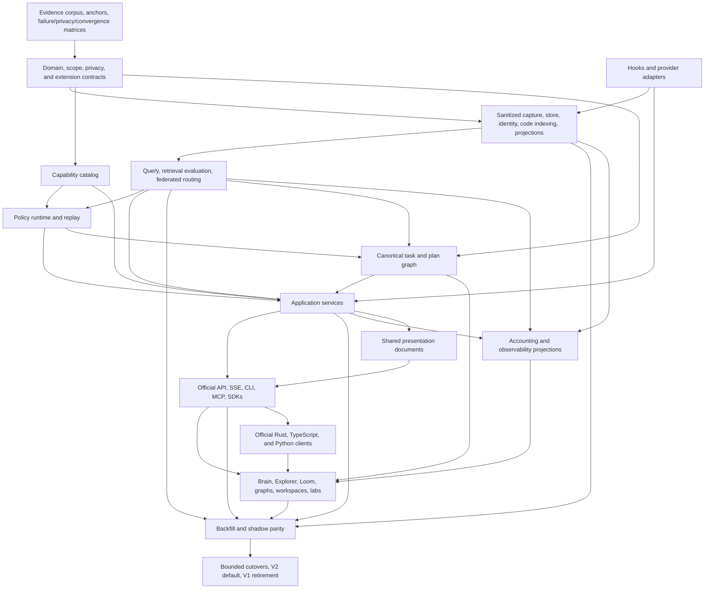

# TraceDecay V2 Rewrite Plan Set Index

**Status:** navigation and ownership index for the total-rewrite plan. This pull request contains plans plus the repo-local read-only execution helper at [`.codex/skills/executing-tracedecay-v2-plan`](../../../.codex/skills/executing-tracedecay-v2-plan/SKILL.md); it contains no product implementation.

**Canonical master plan:** [`../2026-07-09-tracedecay-brain-rewrite.md`](../2026-07-09-tracedecay-brain-rewrite.md). This tracked path is authoritative; there is intentionally no second `docs/architecture/tracedecay-v2-master-plan.md` copy that could drift.

**Accepted-base refresh:** audited `origin/master` at this edit is `e560005610ac296018c3a16b9e6bded90de0eff5` (merge #462; v0.0.63 release content `0532c767`). The accepted-change/base manifest extends the prior `81fe404c`/v0.0.58/#452 snapshot with these first-parent merges and dispositions:

- #453 (`8001a1f4`): runtime/CI hardening, Hermes projectless-compression routing, registry-based session-project resolution, cross-scope Turn correlation, fixture normalization, and dogfood launch fixes are captured by plans 12–14 and the capture/store/scope/transport/provider owners.
- #454 (`b1a3a13f`), #456 (`655296e4`), #458 (`2f3fac96`), #460 (`313d84c1`), and #462 (`e5600056`): v0.0.59–v0.0.63 release/package baselines are plan-12 publication inputs, not architecture.
- #455 (`41b2bdd4`): exclusive-maintenance deferral for live memory, replay identity during Hermes compression, compact hook routing, bounded daemon shutdown/teardown, installed-upstream Hermes layout, and CLI fallback documentation are plans 12–14 fixtures owned by store/capture/scope/host-lifecycle surfaces as applicable.
- #457 (`a01ac4d9`) and #459 (`227fad0b`): managed-skill export isolation and ownership protection are automation/store/migration fixtures; foreign ownership remains authoritative.
- #461 (`ab983634`): safe upgrade shutdown progress is a plan-12 lifecycle/release fixture.

Plans 12–14 and each affected owner must preserve or explicitly supersede these bounded behaviors in their accepted-change inventory before implementation. No merge name, host layout, or provider-specific fix becomes V2 architecture by appearing in this baseline.

**Audited source/design extension (`M`→`D`):** the evidence range ends at `f18f0f14b3e7e2da30eefd9f1ed88862c0d73e57` (`D`, `fix(architecture): enforce daemon-owned physical writers`), not at the moving checkout HEAD. `B..M` is 38 commits (28 non-merges, 10 PR merges); `M..D` is 50 commits (42 non-merges, eight merges), including all six `origin/master` reconciliation merges plus two foundation merges. The latter range is plan/architecture/governance work with no production `src/**` change and includes the canonical master plan and architecture generator. The canonical master plan remains product/PR-order authority; [`29-baseline-delta-audit.md`](29-baseline-delta-audit.md) is evidence-only. [`30-baseline-refresh-candidate-packet.md`](30-baseline-refresh-candidate-packet.md) is a temporary generated review packet and must be archived or deleted after accepted obligations are bound into owner PR slices and FM rows. The rejected packet commit `3ea0b842` and its remediation commit(s) are post-`D` review artifacts, not part of the audited source/design range and do not reopen it unless they change source/design evidence.

## 1. Intended outcome

TraceDecay V2 defragments and reconciles the product into one local-first “Brain” for human intent, agent/Turn/session activity, tools and visible reasoning summaries, code and diagnostics, Git/delivery, goals/workflows, memory/knowledge, hints/policy, automation/skills, usage/cost, health, privacy, and outcomes. It is not a dashboard skin over existing silos or a set of new crates that preserve duplicate semantics. The plan replaces the internal model, storage/query/policy/privacy architecture, public contracts, and product interface behind bounded parity/cutover/deletion gates.

Core product surfaces:

- All/Brain system view with semantic zoom and coordinated graph-of-graphs lenses.
- Universal Explorer with typed query, search, facets, pivots, compare, explain, collections, and export.
- Causal Loom timeline following an agent/Turn/session through tools, subagents, code, worktrees, commits, PRs, checks, memories, hints, and outcomes.
- Canonical Tasks workspace over one federated initiative/plan/task graph, with saved Kanban/DAG/timeline views, cross-repository work bundles, dependency/critical-path analysis, executor routing, advisory work claims, fenced leases/attempts, and versioned context packets.
- Git, code, thread, agent, Turn, timeline, holographic-memory, and automation/skill graph lenses with tables and accessible fallbacks.
- Hint, Retrieval, Search Quality, Coordination, Orchestration, Ingest, Query, Correlation, Scheduler, Memory, Policy Diff, Evolution, Scope/Federation, and Privacy & Secret Safety labs.
- One official contract shared by API, CLI, MCP, generated SDKs, dashboard, hooks, and tool discovery.
- An optional zero-to-three logical MCP registration component set (`context`, `work`, `operator`) backed by one implementation/binary/daemon/catalog, with negotiated lifecycle/capabilities, generated eager-safe tools/resources/templates/prompts/completions, structured content and resource links, progress/cancellation/task support, subscriptions/list-changed notifications, explicit roots/sampling/elicitation trust boundaries, stdio and Streamable HTTP transports, authentication, and host conformance; generated skills plus CLI remain the portable MCP-free baseline.
- Change-gated autonomous evolution: a registered relevant change dirties only affected scopes; quiescence/materiality and effective-input digest admission precede one generic operation; unchanged ticks perform no scan/model/run work and coalesce one skip episode instead of creating fake history.
- A transport-agnostic multi-machine Brain: local-only remains valid, while enrolled clients may share a fenced remote authority, verified read replicas/caches, and Git-correlated repositories over authenticated HTTPS/mTLS or an optional private network such as Tailscale. Network-mounted SQLite and implicit multi-primary writes are forbidden.

## 2. Plan documents and authority

| Plan | Authority |
|---|---|
| [`../2026-07-09-tracedecay-brain-rewrite.md`](../2026-07-09-tracedecay-brain-rewrite.md) | Product/architecture synthesis, invariants, complete system model, phases, PR order, global release gates. |
| [`01-domain-crate.md`](01-domain-crate.md) | Canonical identities, scope/time/evidence/provenance/event/query types and legal relations. |
| [`02-store-crate.md`](02-store-crate.md) | Catalog/activity/project/graph/blob physical storage, migrations, integrity, lifecycle, consistency, backup/repair. |
| [`03-capture-crate.md`](03-capture-crate.md) | Provider/source discovery, immutable observation capture, spools, offsets/generations, parsing, privacy classification. |
| [`04-projectors-crate.md`](04-projectors-crate.md) | Deterministic projections for identity, sessions/agents/Turns, code/Git, knowledge, policy, automation, accounting. |
| [`05-query-crate.md`](05-query-crate.md) | `TraceQueryV1`, scope/shard planner, list/export, search/rank, graph/time/as-of operators, cursors, explain, evaluation. |
| [`06-policy-crate.md`](06-policy-crate.md) | Versioned deterministic hint/retrieval/routing/correlation/curation/scheduler/diagnostic/memory policy and replay. |
| [`07-hooks-crate.md`](07-hooks-crate.md) | Root-private bounded host-hook boundary, durable spool/ack, provider envelopes, hint delivery, latency/privacy/token budgets. |
| [`08-tool-catalog-crate.md`](08-tool-catalog-crate.md) | Capability source of truth, use cases, names/bindings, discovery, current-version handshake, generated metadata/docs. |
| [`09-application-crate.md`](09-application-crate.md) | Transport-neutral use cases, query/command workflows, auth decisions, idempotency, remediation, composition ports. |
| [`10-api-crate.md`](10-api-crate.md) | Root-private Axum V2 boundary, HTTP/SSE envelopes, auth/security, OpenAPI/schema generation, adapters, generated core of the one official TypeScript client; dashboard binding stays thin. |
| [`11-dashboard-frontend.md`](11-dashboard-frontend.md) | Concept-led Evidence Cartography product; stable profile atlas, linked Atlas/Trace/Compare/Lab/Triage compositions, complete memory/skill/automation navigation in Brain and Explorer, Loom replay player, composable lenses, hermetic experiment cockpit, visual ontology/renderers/charts, accessibility/mobile/export, perceptual and comprehension gates. |
| [`12-root-compatibility-migration.md`](12-root-compatibility-migration.md) | Root binary/daemon/CLI/MCP composition and deployment/probe/config/service effect adapters; application-owned integration lifecycle execution; V1 data migration, cutover/rollback/retirement. |
| [`13-research-provenance-and-context-anchors.md`](13-research-provenance-and-context-anchors.md) | Research manifest, durable retrieval anchors, subagent context, corpus hashes/cutoff, source recovery, future implementation handoff. |
| [`14-historical-failure-regression-matrix.md`](14-historical-failure-regression-matrix.md) | Historical problem -> prevention owner -> visible detection/recovery -> cutover regression gate; 171 stable IDs (`FM-001` through `FM-171`) with no gaps; retired FM-168 remains an explicit corrected tombstone rather than an open obligation. The execution helper checks uniqueness/contiguity. |
| [`15-search-quality-evaluation-and-retrieval-research.md`](15-search-quality-evaluation-and-retrieval-research.md) | Real local precision corpus, primary retrieval research, hybrid pipeline, qrels/metrics/holdouts, shadow/online evaluation, Search Quality Lab. |
| [`16-cross-project-repository-worktree-scope.md`](16-cross-project-repository-worktree-scope.md) | Exceptional multi-repo/project/worktree/ref/store behavior, `ScopeSelectorV2`, routed retrieval, graph federation, CLI/MCP UX, Rspack/Rsbuild/React Router corpus. |
| [`17-official-public-api-and-sdks.md`](17-official-public-api-and-sdks.md) | Official direct-agent/public API, contract IR/OpenAPI/JSON Schema, stable IDs/errors/cursors/batch/SSE, Rust/TS/Python SDKs, docs/sandbox/conformance. |
| [`18-secret-detection-redaction-and-private-data-safety.md`](18-secret-detection-redaction-and-private-data-safety.md) | Mandatory structured sanitizer/taint boundary, detector registry, protected quarantine, sink firewalls, retroactive audit/remediation/restore, privacy UI/lab and secret canary gates. |
| [`19-system-defragmentation-convergence-and-extensibility.md`](19-system-defragmentation-convergence-and-extensibility.md) | Whole-system current-to-target convergence, one canonical owner per semantic, extension SPIs, scale/organization governance, anti-corruption adapter retirement, and architecture scorecard. |
| [`20-configuration-control-plane.md`](20-configuration-control-plane.md) | One typed configuration registry/resolver/history across Settings, CLI, MCP, API, SDKs, runtimes, and every subsystem, including visible redactor/privacy controls and autonomous-curation policy. |
| [`21-cli-mcp-tool-surface-and-output-unification.md`](21-cli-mcp-tool-surface-and-output-unification.md) | Exhaustive CLI/MCP/tool inventory and disposition; first-class MCP lifecycle, capabilities, resources/templates/prompts/completion, progress/cancellation/tasks, notifications/subscriptions, roots/sampling/elicitation boundaries, auth/transports/conformance; one generated binding taxonomy, sealed typed views, one root-private presentation module, canonical JSON, errors/exits, cursors/handles, and every-surface semantic parity. |
| [`22-incremental-context-scout-and-suggestion-envelopes.md`](22-incremental-context-scout-and-suggestion-envelopes.md) | Optional asynchronous daemon context scout, capability-selected Spark/model path, bounded read-only exploration, evidence-anchored suggestion envelopes, exact Thread/Turn delivery, silence/dedupe/privacy budgets, observability, replay, and hint integration. |
| [`23-session-lcm-temporal-retrieval-and-evaluation.md`](23-session-lcm-temporal-retrieval-and-evaluation.md) | Current message/LCM source audit, logical-copy and summary-DAG lineage, temporal truth/supersession, current/as-of/evolution/forensic retrieval, stable context assembly, real local qrels/replay, and the Search Quality Lab temporal extension. |
| [`24-canonical-task-plan-graph-and-multi-agent-executor.md`](24-canonical-task-plan-graph-and-multi-agent-executor.md) | Native TraceDecay port-and-redesign of Hermes Kanban: one profile-owned federated initiative/plan/task graph; boards as saved projections; cross-project work bundles; typed dependencies; multi-host executor routes; fenced attempts/leases; context packets; task-aware hints; graph-of-graphs UI; replay/evaluation. |
| [`25-code-intelligence-indexing-crate.md`](25-code-intelligence-indexing-crate.md) | Code extraction (tree-sitter parser registry), deterministic incremental reuse, immutable packed snapshot/generation builds, symbol lineage, diagnostics/test-attribution mapping, and V1 per-branch graph-store migration; root/capture owns watcher intake. |
| [`26-observability-accounting-and-usage.md`](26-observability-accounting-and-usage.md) | Usage/cost/savings accounting, ingest/projection lag, data-quality metrics, denominator/unknown-population semantics, cap/truncation telemetry with retrieval anchors, per-capability adoption analytics, hint outcome rollups, SLO monitors, and Observatory data contracts. |
| [`27-cross-host-agent-plugin-bundles.md`](27-cross-host-agent-plugin-bundles.md) | One host-neutral capability/workflow source IR and deterministic Codex, Claude Code, Cursor, and Hermes projections across observation, context delivery, memory/skills, commands/recipes, agents/roles, hooks, executor routes, cross-host handoffs, MCP companions, install/update/trust, capability differences, stock-host conformance, and legacy retirement. |
| [`28-remote-multi-machine-shared-brain.md`](28-remote-multi-machine-shared-brain.md) | Transport-agnostic remote/shared Brain topology; node enrollment, one fenced authority per shard, offline sanitized capture, replicas/caches, Git clone correlation, consistency/coverage, privacy/auth, backup/failover, API/CLI/MCP/UI, and multi-machine fault gates. |
| [`29-baseline-delta-audit.md`](29-baseline-delta-audit.md) | Evidence-only review artifact for exact audited endpoint `D`: verified `{B} ∪ (B..D)` baseline-delta evidence. It changes no plan and never overrides the master/owner plans. |
| [`30-baseline-refresh-candidate-packet.md`](30-baseline-refresh-candidate-packet.md) | Temporary generated candidate packet used only to review and route audit-29 evidence. It has no standing authority and is archived/deleted after accepted deltas are bound to canonical PR slices and FM rows. |
| [`31-native-fastembed-semantic-code-search.md`](31-native-fastembed-semantic-code-search.md) | Optional disabled-by-default native FastEmbed semantic code search: deterministic code representations, exact model/runtime pins, incremental vector generations, Jina/GTE/BGE evaluation, signed offline artifact lifecycle, bounded optional model-assisted reranking, lexical-preserving failure, generated surfaces, and rebuild-only migration. |

When documents overlap:

1. The master plan owns outcome, global constraints, dependency order, and cutover gates.
2. A numbered crate/surface plan owns implementation details in its boundary.
3. Plans 13–28 and 31 own cross-cutting evidence, regression, retrieval, scope, public-contract, privacy, convergence, configuration, tool/output, incremental-context, temporal-session, task/executor, code-indexing, observability/accounting, cross-host bundle, remote shared-Brain, and native semantic-code-search requirements; bounded crates must satisfy them rather than reimplement them. Plans 29–30 are evidence/review artifacts, not implementation authorities.
4. An implementation decision that changes a locked domain contract requires an ADR and coordinated plan update before code diverges.

### 2.1 Canonical V2 slice authority and bootstrap contract

The checked plan documents describe intent, but they are not themselves a dispatch queue. Before V2 implementation work is dispatched, an orchestrator MUST compile every declaring heading into one versioned `tracedecay.v2.slice-dag/v1` manifest. The manifest is keyed by a normalized slice ID and contains exactly one dispatchable `owner` record for each key. The master declaration, the numbered plan selected by this index, and any other declaring sections are merged into that owner; they never become sibling tasks merely because their prose differs.

Normalization is ASCII, case-insensitive, and deterministic:

1. Trim surrounding whitespace, remove one leading `PR` token plus following whitespace, uppercase ASCII letters, and remove whitespace around separators. A simple scalar has canonical form `PR <number><suffix>`, where `suffix` is empty or a sequence of ASCII letters/digits beginning with a letter, except that a dotted numeric sub-ID retains one dot (`12.1` -> `PR 12.1`). Leading zeroes are forbidden. A compound scalar has canonical form `PR <number><letter-suffix>-<component>` with exactly one identity-bearing ASCII hyphen: its base MUST have a non-empty letter-led suffix, and its component is either an uppercase letter run optionally followed by one canonical decimal tail (`[A-Z]+([1-9][0-9]*)?`) or one canonical decimal (`[1-9][0-9]*`). Thus `PR 22F-LE`, `PR 22F-LS`, `PR 24D-API1` through `PR 24D-API4`, `PR 24D-SDK1` through `PR 24D-SDK3`, `PR 24E-API5`, and `PR 33S-2` are scalar IDs, not ranges. Compound components are identity-bearing and the hyphen is retained.
2. A slash between two complete IDs is a multi-ID list separator (`28A/28B` -> `PR 28A`, `PR 28B`). A slash between a numeric stem and one suffix is an alternate scalar spelling (`28/A` -> `PR 28A`). More than one interpretation, an empty member, or a suffix that is not `[A-Z][A-Z0-9]*` is malformed.
3. A dotted letter suffix is an alternate scalar spelling (`4.E` -> `PR 4E`); a dotted numeric suffix is identity-bearing (`12.1` remains `PR 12.1`). Multiple dots and mixed dotted letter/numeric suffixes are malformed.
4. U+2013 EN DASH is always a range delimiter and never part of a scalar. For ASCII `-`, classification first tests the entire token against exactly three legacy simple-range productions: numeric (`35-37`), single-letter suffix under one numeric stem (`31A-31Q`), or numeric tail under the same letter stem (`24E0-24E8`). If none matches, the entire token is tested as one compound scalar under rule 1. This fixed precedence is required because `24E0-24E8` could otherwise resemble a decimal compound component; source order and prose never choose the interpretation. An ASCII token matching neither production is malformed. An en-dash range requires two complete scalar endpoints of the same shape and stem; it may also vary the final numeric tail of a compound letter component (`24D-API1–24D-API4`). Descending, mixed-stem, mixed-shape, abbreviated or missing endpoints, and more-than-1,000-member ranges are rejected rather than guessed.
5. A heading ending in `series` is not a dispatchable aggregate. `PR 13 series` is a companion declaration for already declared scalar members such as `PR 13A`, `PR 13B`, and `PR 13C`; its explicit member list MUST be present in the manifest. Unknown, empty, overlapping-with-conflicting-membership, or recursively defined series block publication.

Normative classification examples:

| Raw declaration | Canonical result |
|---|---|
| `pr 22f-le` | scalar `PR 22F-LE` |
| `PR 24D-API1` | scalar `PR 24D-API1` |
| `PR 33S-2` | scalar `PR 33S-2` |
| `PR 35-37` or `PR 35–37` | range `PR 35`, `PR 36`, `PR 37` |
| `PR 31A-31C` or `PR 31A–31C` | range `PR 31A`, `PR 31B`, `PR 31C` |
| `PR 24E0-24E2` | range `PR 24E0`, `PR 24E1`, `PR 24E2` (legacy range precedence) |
| `PR 24D-API1–24D-API4` | range `PR 24D-API1` through `PR 24D-API4` |

`PR 22F-`, `PR 22F-0`, `PR 22F--LE`, `PR 22F-le/`, `PR 24D-API01`, and `PR 35-API1` are malformed (empty/zero/empty component, malformed slash member, non-canonical decimal tail, and a compound attached to a suffixless base respectively). `PR 33S-2-4` is malformed, not an implied range or a multi-component scalar. A writer intending a range between compound IDs MUST use EN DASH and spell both complete endpoints, for example `PR 24D-API1–24D-API4`; ASCII `PR 24D-API1-24D-API4` and abbreviated `PR 24D-API1–4` are rejected as ambiguous/malformed rather than split inside a compound ID. `through` may describe ordering in prose but is not machine range syntax.

Text that merely mentions a normalized ID is an `incidental_reference`, not an owner or companion. A heading that declares one scalar/range member is a `declaration`. For each normalized ID, the numbered plan named by this index is the authoritative owner when it declares that ID; otherwise the master plan is owner only when the index explicitly assigns it. Zero owners, two candidate owners, or an owner path outside the plan set is a hard error. Other declarations become ordered `companions`; their acceptance criteria, source anchors, and constraints reconcile into the owner. Equivalent criteria deduplicate by canonical criterion digest. Non-equivalent criteria are both required. Contradictory criteria, phases, commit subjects, dependency kinds, or bounded-file rules are unresolved conflicts and block activation—source order never picks a winner. `phase` is the integer `0..5` of the master plan phase containing the scalar declaration; companions may repeat but not override it, and a scalar declared outside a master phase must carry one explicit phase assignment in the index or fail publication.

Inventory is a validation projection of this authority, never an independently inferred task graph. A validator MUST process one pinned source commit in this deterministic order:

1. Resolve the repository and ordered plan set from this index, then locate the pre-V2 execution state by the bootstrap locator below. A board/database is acceptable only after an explicit export to that located manifest; ambient board inspection is forbidden.
2. Scan every indexed file in `(path, start_line)` order. Classify each PR-shaped occurrence as `declaration`, `series`, or `incidental_reference`; retain its raw token and immutable source anchor before normalization. Invalid declaration syntax is an error, not an incidental mention.
3. Normalize and expand declaration IDs with rules 1–5. The located bootstrap manifest supplies the expected canonical key set during pre-V2 reconciliation; after cutover, the activated canonical graph supplies it. Resolve every normalized scalar against that explicit authority. Missing bootstrap input is already a typed failure under the locator below, never permission to derive the key set from prose. Ambient prose cannot add a key, owner, edge, phase, or dispatchable record; an incidental reference remains non-dispatchable unless a later authority revision explicitly promotes it to a declaration and changes the manifest generation.
4. Select exactly one owner from the indexed ownership rule, then attach declarations for the same key as ordered companions. Merge owner and companion constraints field by field. Canonicalize acceptance text for comparison only (Unicode NFC, LF newlines, trimmed lines, and each non-newline whitespace run folded to one ASCII space, with normative tokens preserved), digest it, collapse equivalent canonical criteria into one criterion with the union of sorted source anchors, and retain non-equivalent compatible criteria separately. Never collapse contradictory text or manufacture a compromise.
5. Validate required fields, owner, phase, commit subject, series membership, typed dependencies and payloads, anchors, digests, and idempotency keys. Resolve every dependency endpoint only through the canonical key set; ordering prose and incidental references are evidence, not edges. Run whole-graph cycle detection over gating edges after endpoint validation.
6. Compare the resulting IDs, edges, owner records, and digests with the located bootstrap manifest and candidate canonical graph, then enforce the reconciliation/cutover gate below. Emit records sorted by normalized ID and anchors sorted by `(path, start_line, end_line, block_sha256)` so repeated validation of identical inputs is byte-identical.

Every diagnostic has `severity`, stable `code`, `normalized_id` when available, source `path:start_line-end_line` plus `block_sha256`, raw token/value, violated rule, and a deterministic suggestion only when there is exactly one valid spelling. Errors reject the entire candidate and suppress dispatch: `missing_id` (a declaration has no explicit-authority key, or an explicit-authority key has no declaration), `malformed_id`, `ambiguous_id`, `missing_owner`, `conflicting_owners`, `conflicting_field`, `invalid_series`, `unresolved_dependency`, `invalid_phase`, `invalid_edge_type_or_payload`, `source_anchor_mismatch`, `digest_mismatch`, `idempotency_mismatch`, `duplicate_idempotency_key`, `reconciliation_mismatch`, and `cycle`. `conflicting_field` identifies its field in the violated-rule value; stale/missing anchors use `source_anchor_mismatch`. Warnings never alter canonical data or eligibility: `duplicate_description` for equivalent text whose anchors were merged, `compatible_companion_addition` for distinct non-conflicting criteria, and `incidental_reference` for an unpromoted mention. A warning that cannot prove equivalence or compatibility is upgraded to `conflicting_field`. Deduplicate byte-identical diagnostics, then report errors and warnings in separate arrays sorted by `(code, normalized_id-or-empty, path, start_line, end_line, block_sha256, raw_value, violated_rule)`; zero errors is necessary but not sufficient for dispatch because the matching cutover receipt is also required.

The machine-readable shape is normative at the field level (JSON is equivalent to this YAML example). Placeholder lines and text below are illustrative values, not assertions about the current source locations or dependency set:

```yaml
schema: tracedecay.v2.slice-dag/v1
graph_revision: 7
source_set_digest: sha256:<64-lowercase-hex>
slices:
  PR 4E:
    normalized_id: PR 4E
    owner:
      path: docs/plans/tracedecay-v2/24-canonical-task-plan-graph-and-multi-agent-executor.md
      heading: "<exact declaring heading>"
      anchor: {start_line: 2840, end_line: 2876, block_sha256: <64-lowercase-hex>}
    companions:
      - path: docs/plans/2026-07-09-tracedecay-brain-rewrite.md
        anchor: {start_line: 1810, end_line: 1818, block_sha256: <64-lowercase-hex>}
        role: companion
    incidental_references:
      - {path: docs/plans/tracedecay-v2/14-historical-failure-regression-matrix.md, line: 900}
    phase: 0
    commit_subject: "<exact reconciled conventional-commit subject>"
    acceptance:
      - criterion_id: PR-4E-AC-001
        text: "The normalized task graph rejects duplicate owners."
        source_anchors: ["owner", "companions[0]"]
    dependencies:
      - parent: PR 4C
        kind: requires_success
        source_anchors: ["<anchor that explicitly declares this edge>"]
    source_anchors:
      - {path: docs/plans/tracedecay-v2/00-plan-set-index.md, start_line: 36, end_line: 79}
    content_digest: sha256:<64-lowercase-hex>
    idempotency_key: v2-slice-owner/v1:PR%204E:sha256:<64-lowercase-hex>
series:
  PR 13 series: {members: [PR 13A, PR 13B, PR 13C]}
```

`dependencies[].kind` is one of `requires_success`, `requires_terminal`, `requires_artifact`, `requires_acceptance`, `requires_decision`, `requires_plan_outcome`, or `not_before`. Payload requirements follow plan 24 exactly: artifact, acceptance, decision, and plan-outcome edges carry their typed references/allowed values; terminal and not-before semantics carry the explicitly required terminal-set or timestamp fields in the edge schema even though the domain enum's discriminants are unit-like; success has no additional payload. Prose ordering and incidental references never create an edge. Each edge names known scalar IDs, rejects self-edges, and participates in whole-graph acyclicity when gating.

`content_digest` is lowercase SHA-256 over RFC 8785 canonical JSON of the fully reconciled owner record after normalization, excluding `content_digest`, `idempotency_key`, lifecycle status, attempts, and receipts. Source-anchor hashes are included, so changed source cannot reuse an old generation. `source_set_digest` uses the same encoding over sorted `(path, block_sha256)` pairs. `idempotency_key` is exactly `v2-slice-owner/v1:<percent-encoded-normalized-id>:<content_digest>` and is reused for every create/import/retry of that owner generation. A changed digest is a new generation; the previous generation is explicitly superseded, never mutated or duplicated.

Before the V2 canonical graph exists, a controller may locate exactly one bootstrap export in this precedence order: (1) an explicit command argument, (2) `TRACEDECAY_V2_EXECUTION_MANIFEST`, then (3) `<repo-root>/.tracedecay/v2-execution-manifest.json`. The repository root is the result of `git rev-parse --show-toplevel`; symlinks are resolved and the selected regular file must remain beneath that root unless it was supplied explicitly. The locator does not scan directories, boards, profiles, databases, CWD siblings, “current” links, recent tasks, or UI state. Multiple explicit values, an unreadable/non-regular file, schema mismatch, unknown repo identity, or no candidate returns a typed bootstrap failure and performs no dispatch or mutation.

Bootstrap completes only through one explicit reconciliation/cutover gate: validate schema and normalization; prove complete plan-inventory coverage and one owner per ID; verify every source anchor and both digests against the pinned Git commit; reconcile duplicates/series/companions; validate typed known edges and acyclicity; import with the stable keys; compare manifest IDs/edges/digests to the candidate canonical graph; record zero unresolved conflicts and zero extra dispatchable records; then atomically activate one graph revision and persist a receipt naming repository, source commit, manifest digest, candidate/activated graph revisions, counts, and validator version. Until that receipt exists and matches the active revision, all slices are non-dispatchable. After cutover, the canonical graph is the only dispatch authority; the bootstrap locator is reconciliation input only and can never silently recreate or override graph state.

Malformed or ambiguous input is fail-closed and diagnostic: report the source path/line, raw token, violated rule, and deterministic suggested spelling when one exists; do not drop a declaration, coerce an edge, choose an owner, truncate a range, or publish a partial graph.

Execution follows checked PR/TDD slices, current repository instructions, and whatever orchestration tools are available at implementation time. No optional named agent skill is a dependency of this plan set. The repo-local `executing-tracedecay-v2-plan` skill is an optional parser/checklist aid: its inventory output is never completion or dependency authority without Git/review/test/task evidence.

## 3. Reading paths

### Architecture lead

1. Master sections 1–9, 18–24.
2. Plans 01, 02, 05, 06, 09, and 12.
3. Plans 13–28 and 31 as non-negotiable evidence/scope/API/privacy/convergence/task-execution/code-indexing/observability/host-integration/remote-authority/native-semantic-search gates.

### Storage and migration implementer

1. Plans 01–04.
2. Plan 12.
3. Plan 14 storage/identity/durability rows.
4. Plan 16 registry/activity/routing sections.
5. Plan 25 for code extraction, incremental indexing, and V1 per-branch graph-store migration.
6. Plan 28 for authority placement, replication units, offline spool, backup/failover, and the prohibition on remote SQLite files.
7. Plan 31 for immutable model-pinned vector generations, rebuild-only migration, and machine-local model-cache boundaries.

### Search/query implementer

1. Plans 01, 04, and 05.
2. Plans 15 and 23 in full.
3. Plan 16 federated planner/search-to-retrieval requirements.
4. Plan 13 for exact private anchor recovery.
5. Plan 31 in full for the only native semantic-code-search runtime/profile/evaluation path.

### Hint/hook/tool implementer

1. Plans 06–09.
2. Master sections 5.3–5.5 and 16.
3. Plans 21–22 and 31 for generated surfaces, the asynchronous context-scout/delivery boundary, and the separately gated model-assisted rerank purpose.
4. Plan 14 hint/tool/remediation rows.
5. Plans 15–16 and 23 for search precision, nearby agents, temporal truth, and scope behavior.

### API/SDK implementer

1. Plans 01, 05, 08, 09, 10, 17, and 31.
2. Plan 16 for selector/routing semantics.
3. Plans 12 and 27 for cutover/current-client and generated host-bundle rules.

### Dashboard/product implementer

1. Master sections 11–18.
2. Plan 11 in full.
3. Plans 15–17, 27, and 31 for labs, All/system scope, explanations, official client contracts, host integration visibility, and semantic-code-search controls/diagnostics.
4. Plan 14 dashboard/API/observability regressions.
5. Plan 26 for usage/cost/savings accounting and Observatory data contracts.

### Test/evaluation lead

1. Plans 13–16, 22–28, and 31.
2. Every plan’s Definition of Done and verification sections.
3. Master phase/PR gates and SLO section.

### Convergence/maintainability lead

1. Plan 19 in full and the master convergence/phase sections.
2. Plans 01–12 boundary/input/output/dependency/retirement sections.
3. Plans 14 and 18 for historical bypass/privacy regressions.
4. Generated compatibility/capability/schema inventories and architecture scorecard.

### Configuration/control-plane lead

1. Plan 20 in full plus plans 01, 02, 08–12, 17–19, and 31.
2. Every current config file/flag/env/default/dashboard/provider/hook/daemon setting inventory.
3. Redactor/privacy floor, credential references, autonomous-curation policy, generated Settings/CLI/MCP/API parity, and activation/ack/drift gates.

### CLI/MCP/output lead

1. Plan 21 in full plus plans 08–10, 12, 17–20, 27, and 31.
2. The generated recursive CLI inventory and all 104 source MCP definitions, including hidden, conditional, aliased, runtime-filtered, and unavailable bindings.
3. Typed-view, Markdown-default MCP, explicit canonical JSON/NDJSON, error/exit, cursor/retrieval-anchor, stdout/stderr, safe-rendering, and cross-transport parity gates.

### Task graph and multi-agent execution lead

1. Plan 24 in full plus plans 01, 02, 04–06, 08–10, 16–17, 20–23, and 26.
2. Plan 13 PR 2A owns the pinned Hermes source/test/UI provenance ledger; plan 24 owns and consumes its file-level `direct_port`/`behavioral_port`/`redesign`/`drop` dispositions and source-to-test/license requirements. Plans 13–14 retain the wrong-board, copied-task, lost-dependency, already-complete-dispatch, and stale-worker evidence/regressions.
3. Canonical identity, multi-project declared scope, typed dependency edges, versioned context packets, executor capability routes, advisory work claims versus authoritative fenced leases/attempts, budget/effect grants, task-aware hints, board projections, and replay gates.

### Code-intelligence implementer

1. Plan 25 in full plus plans 01–05, 12, 14, 16, 18, 19, and 31.
2. Parser/grammar registry, capture-sanitized payload references and projector-issued build requests, deterministic incremental reuse, packed generations/overlays, symbol lineage, diagnostics/test attribution, V1 graph-store dispositions, and 10× scale gates; root/capture watcher intake is not duplicated here.

### Observability/accounting implementer

1. Plan 26 in full plus plans 01–06, 08–12, 15, 20–24, and 27.
2. Generated surface vocabulary, denominator-safe metric descriptors/rollups, cap/truncation anchors, adoption and hint outcomes, SLOs, pricing/savings methodology, replay exclusion, Observatory contracts, and V1 analytics receipts.

### Cross-host integration and plugin-bundle lead

1. Plan 27 in full plus plans 07–13, 17–21, 24, and 26.
2. Preserve one canonical `HostIntegrationManifestV1`, one pure `tracedecay-tool-catalog::host_bundles` compiler, one application lifecycle, and one root-private deployment/probe/config adapter.
3. Validate stock Codex, Claude Code, Cursor, and Hermes behavior independently across their CLI/IDE/cloud/gateway/background surfaces; skills+CLI must work with MCP absent, every enabled facade must be eager-safe, cross-host handoffs must reauthorize scope/grants, and every undocumented or host-specific difference stays explicit.

### Remote shared-Brain implementer

1. Plan 28 in full plus plans 01–05, 09–12, 16–18, 20–21, 26, and 31.
2. Preserve one fenced authority per mutable shard, semantic replication through the application/API boundary, local-only SQLite/WAL families, explicit consistency/coverage, and transport-independent node authorization.
3. Validate cross-machine Git identity, offline idempotency, revocation, privacy classes, replica/cache lag, backup/restore, standby promotion, and old-authority fencing before remote mode releases.

## 4. Locked architectural decisions

- Start as one Rust binary with bounded internal crates/ports; allow later daemon/query split without changing contracts. The workspace is capped at 11 Rust packages including root and the official Rust client. Root-only hook, presentation, API, host-deployment, and remote-Brain transport adapters remain private `src/v2` modules with import lints rather than published crates. Production files target at most 400 lines; 800 lines is the hard default ceiling and requires a temporary plan-19 waiver.
- Checked `architecture-boundaries.toml` is the source authority for owners, allowed imports, package admission, release/deletion order, and plan/document links; its DAG/policy/document reports are generated. A new package needs two real production consumers or a demonstrated dependency/capability/publication firewall, an ADR, and a concrete merger/deletion alternative.
- Reuse one narrow domain registry/canonical-encoding substrate, one projection runtime, one fenced application operation substrate, one scheduler kernel, one `HostIntegrationManifestV1`, one graph/timeline slice pipeline, one page/problem/presentation pipeline, and one saved-view lifecycle. Share mechanics without erasing typed domain meaning.
- Replacement work is accepted only with a `reuse-dispositions.json` decision and negative-code/footprint receipt. At parity, handwritten replacement code must be smaller than the live V1 plus adapters it deletes; generated output, packages, dependencies/features, tables/indexes, workers, files, binary/RSS/startup/build time, and stored bytes are reported separately and cannot hide growth.
- External transcript, project, repository, host-store, and tool examples enter the plan only as `Evidence`, `Fixture`, or `PriorArt`. Promotion requires an explicit TraceDecay decision record naming the bounded behavior or dependency, owner, reason, supporting evidence, and rollback; external names, paths, layouts, and topology never silently become product architecture or conformance authority.
- Use one profile catalog, one canonical profile activity journal/projection, project/privacy-domain shards, immutable packed graph generations, and privacy-domain content-addressed blobs.
- SQLite/rusqlite is the physical engine local to each authority/replica host. Multi-machine sharing uses the official authenticated application/API protocol and semantic snapshots/tails; database files/WAL are never network-mounted or exposed. libSQL/Turso remains evaluated prior art, not an initial dependency.
- Local, remote-authority, cached-client, read-replica, standby, and hybrid-placement modes share one `BrainId`; exactly one fenced authority may write a mutable shard. Tailscale is an optional connectivity profile, never an architectural or authorization dependency.
- Capture immutable sanitized-native observations before canonical projection; retain keyed source fingerprints/offsets/parser versions and unknown sanitized fields. Sanitize-before-persist is mandatory; no raw source hash of secret-bearing content is stored.
- Run one mandatory parse-before-scan sanitizer before the observation journal; secret plaintext never reaches general stores/indexes/outputs, while optional protected raw retention is isolated/encrypted/short-lived.
- Model bitemporal evidence relations and confidence/provenance; never convert correlation into causal language silently.
- Provider-visible reasoning summaries may be retained according to sensitivity/retention; hidden chain-of-thought is neither captured nor reconstructed.
- Sessions/agents/Turns live canonically in profile activity. Repository/project/worktree attribution is temporal evidence, not one provider key.
- `ScopeSelectorV2` is shared across every surface. Explicit targets never fall back to current CWD/project/ref.
- Search is hybrid and measured: exact/phrase/BM25 first, bounded fuzzy/entity/graph/dense/learned-sparse/rerank channels only when they improve labeled gates.
- Retrieval IDs route globally to exact retained evidence; expiring response handles are never sole citations.
- Hooks remain bounded and local: no synchronous federated fan-out, embeddings, indexing, automation, or long writes.
- Hints optimize useful action and useful silence, not volume; nearby-agent hints are compact, evidence-scored, deduped, and non-authoritative.
- Tool/capability definitions generate CLI/MCP/API/dashboard/skill/hint bindings and drift tests from one catalog.
- One extended `HostIntegrationManifestV1` is the semantic source for portable workflows and host projections. The pure catalog-owned compiler emits unsigned Codex/Claude/Cursor/Hermes `HostBundlePayloadV1` or plugin-overlay trees and deterministic difference/release inputs; PR 36R alone rebuilds, scans, conformance-tests, attests, signs, and publishes `HostBundleManifestV1`. Neither representation contains copied behavior. `HostInstallSetV1` selects optional core skills+CLI plus zero-to-three logical MCP facade companions, all backed by the same installed TraceDecay binary/daemon/catalog.
- Every playground evaluator reuses one hermetic experiment/run/operation lifecycle, immutable branch/sweep/trace/comparison/anchor/minimization contract, and zero-production-effect receipt; no lab-specific runner, status store, or transport route exists.
- Application services own behavior; transports are thin adapters and frontend uses generated client types.
- Official API is supported, versioned, documented, locally authenticated, bounded, and usable directly by agents through Rust/TypeScript/Python SDKs.
- All/Brain is the product default; project views are zoomed scopes inside one system.
- Every visualization consumes one generated visual-semantic ontology and `VisualizationEnvelopeV1<T>` through a thin `WorkspaceSlotFrame` plus typed renderer capabilities, has table/outline/export/accessibility parity and explicit evidence/coverage semantics, and passes concept, legibility, object-constancy, perceptual, and human-comprehension gates.
- Replay evaluators have zero production effects. The shared experiment operation persists only immutable artifacts and explicitly granted model/egress cost; it cannot contaminate analytics, facts, claims, policies, hints, caches/counters, leases, or live coordination.
- Fact/memory/managed-skill/profile curation is fully autonomous under versioned configuration: deterministic validation/policy -> transactional effect -> outcome monitoring -> automatic revision/recovery. No per-item preview/approve/apply/rollback queue exists; UI/CLI provide configuration, pause/resume/run-now, pin/protect/exclude, feedback, and history.
- Migrate and retain non-disposable V1 data for rollback; do not emulate stale running clients, old protocol behavior, or obsolete tool names after cutover.
- One canonical owner/contract exists for identity, scope, privacy, capture, projection, query, policy, capability, application, and transport semantics; compatibility adapters have deletion PRs and cannot accept new call sites.
- One generated typed configuration registry and application resolver owns every user-controllable non-secret setting, precedence rule, effective source, impact, history, and runtime acknowledgement. All settings—including redactor/privacy and autonomous-curation policy—are navigable/editable in Brain Settings and generated CLI; secrets remain opaque references and the safety floor cannot be weakened.
- One generated capability/binding manifest owns every CLI/MCP/API/SDK/dashboard/hook/skill name, request/default/scope/effect/output/error contract, help entry, availability state, and compatibility cutoff. MCP defaults to compact Markdown, machine callers request canonical typed JSON/NDJSON explicitly, and all human renderers consume sealed typed views rather than raw JSON.
- The optional daemon Context Scout consumes canonical Turn/task/agent events asynchronously, performs only catalog-authorized bounded reads, optionally uses a capability-selected model such as Spark, and emits at most one evidence-anchored suggestion to an exact Thread/Turn through the shared hint selector. Hooks never wait for its model/tools; useful silence, privacy, expiry, dedupe, and replay gates dominate recall.
- Session/LCM retrieval distinguishes immutable occurrences, logical copies, summaries, and temporal assertions. Recency is one explained intent feature, not truth; explicit later corrections/supersession and authority determine current answers, historical/as-of replay has zero future leakage, and uncertain conflicts remain visible.
- One profile-owned federated initiative/plan/task graph is canonical. It is a native TraceDecay product informed by Hermes Kanban prior art, selectively porting/copying proven bounded behavior where approved and redesigning it where V2 can do better—not an adapter to a Hermes task service and not whole-Hermes parity. Before a specific direct or behavioral port moves, Plan 13 PR 2A pins its exact upstream/local commit, file spans, tests, license notice, and `direct_port|behavioral_port|redesign|drop` disposition; unrelated host-neutral implementation does not wait for a whole-Hermes ledger. Boards are canonical `TraceQueryV1` plus layout/grouping/policy projections; they never create or copy task identity, dependencies, advisory claims, attempts, leases, or authority. A task may appear in any number of project, repository, worktree, agent, executor, timeline, Kanban, DAG, or initiative views.
- Executor selection is explicit and typed: host/provider/model/reasoning effort, tool and effect grants, privacy/egress class, cost/time budgets, retry/concurrency policy, and availability resolve to an immutable route receipt. Codex, Claude, Cursor, Hermes, and future executors are adapters, not task owners.
- The V2 implementation board itself uses mixed substantive lanes: load-balance GPT-5.6-Sol and native Claude Code with a modest Claude bias while both are healthy. Where Hermes lacks a direct Claude profile, Sol owns ticket lifecycle and supervises bounded native `claude -p --model opus` work through `ai-coding-agents`; record both participants, independently verify every candidate, and never count an optional Claude mention or self-review as mixed execution.
- Every dispatched attempt acquires one compare-and-swap `TaskLeaseV1` with TTL/heartbeat, artifact/worktree overlap set, idempotency key, and unforgeable fence proof. `WorkClaimV1` is advisory nearby-work evidence only. Completion/cancellation revokes stale lease authority; dependency readiness comes only from current canonical edges.
- Versioned context packets bind task revision, scope, dependency outcomes, exact Thread/Turn anchors, code/Git/PR state, relevant advisory work claims and the authoritative attempt/lease, retrieval/config versions, source watermarks, visibility policy, budget, and digest. Agents receive only materially relevant, recipient-authorized sibling summaries; neither boards nor long threads become implicit context.
- `tracedecay-code-index` is the sole production owner of code extraction, grammar registration, incremental reuse, generation construction, lineage, and diagnostic/test attribution. Root/capture owns watcher intake and emits canonical observations; projectors issue canonical build requests. The indexer has no second watcher queue, scope resolver, scheduler, or source-body store. Packed generations reference plan-02 privacy-domain blobs.
- Metric definitions, surface codes, denominators, caps, horizons, pricing/savings methods, and SLOs are registered/versioned contracts. `unknown`, `partial`, and `capped` never render as known zero, and observability cannot create a second event/accounting path.

## 5. Dependency and implementation order



Arrows in this diagram are data-flow/build-order edges, not the package dependency DAG; the root-private hooks module reaches storage only through capture's spool and narrow application ports (master section 22).

No broad V2 rewrite lands as one PR. Use the master plan’s Phase 0–5 sequence and sub-PRs. The first end-to-end vertical slice proves one provider/project session/tool/subagent investigation through capture -> identity -> projection -> query -> API -> timeline/table/inspector before broad domain expansion.

Before any implementation dispatch, import every declared PR/slice heading into one activated canonical task graph. Consolidate master, numbered-owner, and companion declarations under one slice ID without discarding their source hashes; assign exactly one numbered-plan authority; encode every prerequisite explicitly; attach complete acceptance, bounded files, lane, independent-review, remediation/successor-review, integration, and receipt requirements; then validate complete inventory coverage, source-hash freshness, owner/companion consistency, known endpoints, and acyclicity. Prose references and document order are never inferred as edges. The repo-local execution skill validates an exported graph/ledger and computes next-ready only after these gates; the export and live statuses remain operational state outside Git.

Architecture manifests distinguish **semantic producers** from the sole **physical writer**. Capture and projectors may produce sanitized frames, projection commands, or outbox work, but only the daemon/store authority opens mutable SQLite and commits physical writes; generated owner/DAG views must never label a producer as a database writer.

## 6. Phase gates

### Phase 0 — truth and contracts

- Cross-cutting companion contracts land in dependency order `4C → 4E → 4F`: configuration and shared policy refs, then canonical task/executor refs, then task-aware context-scout envelopes. Privacy-taint contract 4B still precedes the read-only 4A concept as specified by the master plan.
- ADRs lock logical architecture, evidence language, scope/store ownership, privacy/retention, API/query/cursor semantics, frontend rendering, and stale-client cutoff.
- Typed configuration descriptor/layer/activation contracts are locked (master PR 4C), and the configuration inventory maps the frozen-schema subset of public files/flags/envs/toggles/defaults to typed descriptors or marks them read-only/non-configurable with rationale; complete registry generation and generated Settings/CLI/MCP/API schemas land with PR 22C in Phase 3.
- Redacted corpus and private manifest are reproducible and secret-scanned.
- Research anchors route to exact context or explicit tombstone.
- Synthetic secret corpus/sink inventory and system convergence inventory are complete; no private transcript/store becomes a fixture.
- V1 compatibility inventory is generated and CI detects drift.
- Read-only V1-backed product concept validates Brain/Explorer/Loom interaction before hardening contracts.

### Phase 1 — durable evidence plane

- Observation ingest is idempotent and crash/disk-full safe.
- Mandatory sanitizer/taint types and protected quarantine are fail-closed before journal/store/projector use.
- Catalog identity survives moves/worktrees/renames and preserves ambiguity.
- Project/activity/blob/graph storage passes integrity, backup/restore, permission, writer, and fault matrices.
- Projections are deterministic, versioned, rebuildable, lag-visible, and dead-letter safe.

### Phase 2 — query and retrieval plane

- Scope resolution, shard pruning, partial/stale coverage, global routing, and stable distributed cursors pass.
- Privacy containment prevents unsafe entities/shards from search/graph/ranking/cursors/exports and reports unknown coverage.
- Exact/phrase/BM25 and V1 parity pass before optional representations/rerankers.
- Real chronological/project/provider holdouts, qrels, metrics, resource gates, and no-answer behavior are frozen.
- Search results load exact evidence across project boundaries.

### Phase 3 — domain intelligence

- Sessions/agents/Turns/tools/goals/workflows and temporal project attribution backfill with parity.
- Code snapshots/lineage, cross-repo graph, Git/delivery, knowledge, automation/skills, accounting, tool catalog, policy, nearby-agent claims, and replay inputs backfill with evidence manifests.
- Merged/open PR semantics named in the master/failure matrix are fixtures, not assumptions.
- Initiative/plan/task identities, dependencies, declared cross-repository scope, executor routes, advisory claims, fenced attempts/leases, context packets, outcomes, and task-to-Thread/Turn/code/Git/PR relations backfill into the canonical graph without board-local copies.
- Wrong-board recovery, dependency preservation, duplicate-work suppression, already-complete artifact detection, stale-run fencing, and recipient-scoped task hints pass transcript-derived replay fixtures.

### Phase 4 — official product

- Application, HTTP/SSE, API contracts, CLI/MCP, the one official TypeScript client plus thin dashboard binding, Rust/Python SDKs, docs/sandbox, and exports pass semantic conformance.
- Brain Settings and `tracedecay config` expose the complete registry/effective-source/history/impact/drift model, including all privacy/redactor and autonomy controls, with generated MCP/API/SDK parity.
- Privacy status/scan/remediation/verify and convergence/capability status share application contracts; the Privacy & Secret Safety Lab uses synthetic values only.
- Brain/All, Observatory, Explorer, Loom, graphs, workspaces, and labs pass desktop/mobile/accessibility/table/export/partial-state acceptance.
- Authorized heterogeneous multi-repository workflows complete without manual registry/store choreography, implicit CWD/provider partitioning, or a required live checkout.
- One initiative can decompose work across at least three repositories, assign independently bounded task sets to at least two authorized executor routes, display each set as focused boards or one dependency graph, and keep every worker current through versioned packets and material task-aware suggestions.
- The frozen Rspack/Rsbuild/React Router scenario remains one named regression slice in the diverse corpus; its live repositories, stores, and provider routes are optional and non-gating.

### Phase 5 — migration and retirement

- Resumable backfill manifests account for every retained, skipped, quarantined, redacted, and deleted entity; the per-entity disposition schema is defined in plan 12.
- Retroactive privacy audit/rotation-first remediation/rebuild/restore gates account for every sink/backup; superseded V1/parallel paths have verified deletion receipts.
- Shadow parity has no unexplained gaps and stable projection lag.
- Every bounded-context cutover has feature flag, receipt, rollback drill, telemetry gate, and current-client/catalog handshake.
- V1 data remains read-only for the declared rollback/evidence window (until one full release of V2-default operation completes, per master PR 37 and plan 12); PR 37 completes with zero live compatibility adapters, every waiver has an expiry that precedes PR 37, expired waivers block CI, and obsolete names are removed.

## 7. Evidence and privacy boundary

Private research corpus:

- `/fast/tracedecay-redesign-research/user-messages-chronological.jsonl`
- `/fast/tracedecay-redesign-research/human-messages-chronological.jsonl`
- `/fast/tracedecay-redesign-research/manifest.json`
- `/fast/tracedecay-redesign-research/intent-evolution.md`
- `/fast/tracedecay-redesign-research/README.md`

These files are deliberately outside the repository and mode `0600`. Plan 13 records cutoff, hashes, limitations, retrieval recipes, and subagent/session anchors. Never copy raw private transcript content or private relevance judgments into an implementation PR. Promote only minimal redacted/synthetic fixtures and aggregate reports after secret scanning.

## 8. Plan-maintenance protocol

Before implementing any slice:

1. Fetch current master and open PR state.
2. Resolve the slice’s research anchors and check for newer corrections/fixes.
3. Reconcile TraceDecay indexed Git/code context with live Git/GitHub state.
4. Identify failure-matrix rows and merged/open-PR behavior that the slice owns.
5. Freeze the exact schema/capability/compatibility delta in the PR.
6. Write historical/regression/fault/conformance tests first.
7. Update plan/ADR only when evidence changes a locked decision; record rejected alternatives.
8. Publish migration/parity/benchmark/privacy receipts with the slice.

## 9. Whole-program definition of done

- [ ] A person can understand TraceDecay as one Brain from the default All view.
- [ ] An agent can discover and call the right capability through CLI, MCP, or official API without namespace/store/project choreography.
- [ ] One stable selector and retrieval-ID system works across every repository, project, worktree, ref, provider, domain, transport, and retained historical object.
- [ ] A Causal Loom investigation follows agent/Turn/session intent through subagents, tools, visible reasoning summaries, code, Git, PRs, hints, memories, automations, costs, and outcomes.
- [ ] Graph-of-graphs lenses are interactive, explainable, bounded, accessible, responsive, and backed by exact tables/exports.
- [ ] Search and hints have real local precision/recall/no-answer/repetition/latency/resource evaluations across many projects and providers.
- [ ] Nearby agents can discover overlapping work compactly without prompt leakage, spam, false ownership, or suppression of deliberate parallel review.
- [ ] Hint/search/coordination/scope/policy behavior can be replayed safely against exact historical inputs and candidate versions.
- [ ] Every non-secret configuration is discoverable/explainable/editable at legal scopes through Settings and navigable CLI, every runtime acknowledges the exact effective digest, redactor controls cannot weaken the floor, and no hidden config/default path survives.
- [ ] Knowledge, memories, and managed skills have evidence -> candidate -> validation/policy -> autonomous effect -> use/outcome -> autonomous revision/recovery/archive lineage, with no per-item human gating.
- [ ] Every output reports coverage, freshness, provenance, limits, uncertainty, and source class truthfully.
- [ ] Every historical failure class has prevention, visible detection, recovery, and a deterministic/probabilistic cutover gate.
- [ ] One sanitizer protects every source/sink and one convergence scorecard proves duplicate authorities/bypasses/adapters are removed, not renamed.
- [ ] No non-disposable evidence is silently lost, duplicated as authority, mis-scoped, or destroyed during migration.
- [ ] Stale clients and obsolete tool names fail explicitly after cutover; data rollback does not become indefinite protocol compatibility.
- [ ] Final V2 default and V1 retirement occur only after aggregate verification is stable, not after one flaky pass.
