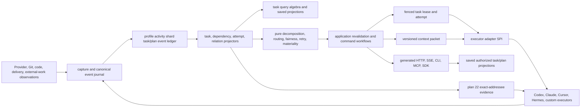
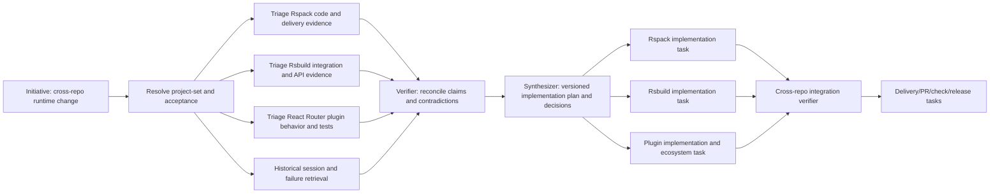

# TraceDecay V2 Canonical Task/Plan Graph and Multi-Agent Executor Plan

**Plan 32 boundary:** Plan 32 exclusively owns native dynamic-workflow definitions/runs and the workflow-to-taskgraph eligibility, loss, mapping, identity, provenance, and candidate-compiler implementation. This plan owns only the target `PlanVersionV1`/`WorkItemVersionV1` schema, review/edit/activation, executor/lease/attempt behavior, workflow↔task provenance, cycle checks, and exact-version task-invokes-workflow contract. A workflow node is never a task/lease, and candidate compilation never activates work.

> **Status:** implementation-grade architecture and delivery plan; no production code is changed by this document.
>
> **Product rule:** TraceDecay owns one profile-level initiative, plan, task, and execution graph. Kanban boards, plan outlines, DAGs, timelines, workload maps, executor views, repository views, and All are authorized projections over that graph, never independent databases or ambient routing state.

**Goal:** Turn TraceDecay's captured Threads, Sessions, Turns, Agents, Goals, tools, code, Git, delivery, knowledge, skills, hints, and automation evidence into a durable coordination system that can decompose and execute cross-repository initiatives safely across Codex, Claude, Cursor, Hermes, and custom executors without duplicating work, losing provenance, leaking private context, or forcing every agent to observe a global board.

**Architecture:** The profile activity shard owns an immutable task/plan event stream and current projections. `tracedecay-domain` defines the graph and lifecycle; `tracedecay-store` persists one owner-shard ledger; projectors attach task work to every other graph; query evaluates registered task values through the sole `TraceQueryV1` algebra; pure policy proposes decomposition, routing, readiness, fairness, retries, and sibling-materiality decisions; application authorizes and atomically applies effects; executor adapters run attempts through fenced leases and narrow capability grants; generated API/CLI/MCP/SDK/dashboard bindings expose the same use cases and typed views.

**Decision:** A task is not a card row, an assignee string, a provider prompt, an automation run, a Git branch, or a work-claim heartbeat. Those are related entities with distinct identity and authority. `WorkItemId` is the canonical schedulable identity; `ExecutionAttemptId` is one try; `TaskLeaseId + fence_epoch` is execution authority; `WorkClaimV1` remains advisory coordination evidence; `ContextPacketManifestId` pins exactly what an executor was allowed to know.

---

## 0. Contract lock

This is the plan for a **TraceDecay-native task graph and multi-agent executor**, informed by Hermes Kanban and other prior art but not derived from any external product's authority or topology. TraceDecay owns and ships the canonical task/plan graph, scheduler, attempts, leases, worker protocol, CLI/MCP/API/SDK surfaces, and Brain/Work UI. A bounded behavior, test scenario, interaction, algorithm, or source span may be copied, ported, or improved only after its explicit approval in the comparison/source/license ledger; everything else is implemented from TraceDecay contracts. A separately configured Hermes agent may still be an execution host or capture source, exactly as Codex or Claude may be, but the TraceDecay task product never delegates to or depends on a Hermes runtime, board database, plugin, scheduler, or canonical provider/DAG arrangement.

Throughout this plan, **Evidence**, **Fixture**, and **PriorArt** label inputs used for comparison, replay, or design investigation. They do not create architecture, scope, merge gates, or product authority. Only an explicit **Decision**, numbered contract invariant, owned cross-plan contract, or named acceptance regression is normative. Reusing any external component requires a reviewed ledger row that pins source and version, the bounded approved span/behavior, disposition, license/copyright handling, destination, and TraceDecay regression; unrelated TraceDecay-native work does not wait for whole-repository, whole-file, or whole-test-suite coverage of that source.

1. There is one canonical profile-owned initiative/plan/work-item graph. No repository, project, board, worktree, provider, plugin, dashboard, or executor creates a second source of task truth.
2. An initiative may span zero, one, or many projects, repositories, checkouts, worktrees, refs, and providers. Ownership remains the profile activity shard; scope is explicit relation evidence, not database placement.
3. `Initiative`, `Plan`, immutable `PlanVersion`, canonical `WorkItem`, dependency/gate, assignment, execution attempt, task lease, handoff, artifact, outcome, and cost are different typed entities.
4. “Task” and “ticket” are product vocabulary for a `WorkItem`. They never mint competing IDs or persistence tables.
5. A plan is a versioned graph. Editing it creates a new `PlanVersion`; in-flight attempts remain pinned to the versions they started with until an explicit revalidation decision cancels, supersedes, or permits them to continue.
6. Gating dependency edges form a DAG. Informational, evidence, similarity, and causal-candidate relations may contain cycles but never participate in readiness or critical-path computation.
7. Dependency readiness is derived from immutable events, typed gate expressions, schedules, budgets, policy, and active leases. It is not a mutable board-column string.
8. Decomposition policy is pure: it returns a typed proposed plan revision and explanation. Application revalidates scope, authorization, privacy, versions, cycles, budgets, and executor capabilities, then commits eligible effects atomically in the activity owner shard.
9. Autonomous decomposition within an enabled authority envelope does not create a preview/apply inbox. Human-authored plan changes are direct versioned commands with receipts. Human review gates may govern deliverables; they are not curation approval queues.
10. TraceDecay curation remains fully autonomous under plans 09 and 20. A curation run may be related to a work item or outcome, but there are no task-shaped Approve/Reject/Apply/Rollback controls for individual memories, facts, or managed-skill proposals.
11. Assignment expresses desired ownership/routing. Advisory `WorkClaimV1` expresses nearby-agent intent. Only a current fenced `TaskLeaseV1` grants execution authority.
12. Every active attempt owns one lease epoch. Completion, blocking, artifact publication, handoff, or side-effect receipt from a stale epoch is rejected, even if the stale worker still has a process or network connection.
13. Many hosts may schedule and execute concurrently. Atomic owner-shard compare-and-swap plus monotonically increasing fence epochs prevents double execution; PID liveness is optional local evidence, never distributed truth.
14. Every executor is registered through a versioned adapter/capability manifest. An assignee label never doubles as an executable name, profile path, provider, model, host, or authorization decision.
15. Requested and actual executor adapter, provider, model, model revision, reasoning effort, tool catalog generation, skills, capability grants, host, workspace binding, token/cost budget, and deadlines are pinned per attempt and recorded in receipts.
16. Allow/deny decisions are explicit by declared scope. Deny wins. A global wildcard does not silently grant mutation tools, MCP servers, remote egress, credentials, repository writes, Git writes, PR operations, or cross-project reads.
17. Agents receive a compact, versioned, sanitized context packet, not a path to the task database or a dump of the global board. Packet entries cite durable retrieval anchors and exact scopes.
18. Context packets include only relevant parents, sibling summaries/decisions, dependencies, acceptance criteria, worktree/branch bindings, constraints, handoffs, and retrieval anchors. Omitted or unavailable evidence is explicit.
19. Material sibling changes create new packet evidence. Plan 22 decides whether one exact Thread/Turn/Agent should receive a compact advisory at a safe host boundary; task events never broadcast directly into every prompt.
20. Tool output, API output, CLI output, MCP output, SDK models, and dashboard state are generated from the same application view models. No transport reimplements readiness, permissions, retry semantics, truncation, or task rendering.
21. Kanban, DAG, plan, timeline, causal, critical-path, workload, executor, repository, initiative, and All are saved authorized projections. “Current board” may be ephemeral UI state only and never supplies ownership, dispatch scope, or mutation scope.
22. Workspace paths are locators, not identity. Repository, project, checkout, worktree, ref, commit, and `CodeSnapshotId` remain distinct. A writable attempt binds exact versions before any edit.
23. TraceDecay never auto-stashes, resets, cleans, rebases, merges, force-pushes, deletes, or adopts a user-owned dirty worktree. Such conditions become typed blocks or separately authorized delivery workflows.
24. A terminal task result requires acceptance evidence or an explicit authorized exception receipt. Plain-text worker exit, process disappearance, or provider “success” is not proof of completion.
25. Retries reuse stable idempotency keys for already-authorized effects, create a new `ExecutionAttemptId` and lease epoch, consume a declared budget, and consult task/executor/provider circuit breakers.
26. Cancellation is first class: requested, acknowledged, effect-stopped, reconciled, and terminal dispositions are distinguishable. An unknown remote cancellation never permits immediate unsafe reuse of the old lease or provider thread.
27. Artifacts, logs, comments, prompts, summaries, metadata, model output, and errors enter as `Unclassified<T>` and pass plan 18's sanitizer before any ordinary store, index, event, packet, output, export, or model sink.
28. Hidden chain-of-thought is never requested or inferred. Only provider-exposed reasoning artifacts, messages, summaries, decisions, tool events, and evidence are linkable.
29. Every query/result states scope resolution, graph/plan versions, watermarks, authorization coverage, partial/unavailable components, and anchorability. Empty never means “no work exists” when coverage is incomplete.
30. Migration ends with one scheduler, one lease authority, one context-packet assembler, one task query engine, one public capability catalog, and one dashboard state model. Compatibility adapters are bounded and deleted after receipts prove cutover.
31. Task reads use registered `EntityKind`, attribute, traversal, facet, aggregate, projection, and sort values inside the one domain `TraceQueryV1`; `TaskQueryV1`, `TaskContextSelectorV1`, board filter DSLs, and transport-specific task query bodies are forbidden. Convenience selectors compile losslessly to `TraceQueryV1` and expose the canonical digest.
32. Every accepted task command appends one canonical `task_graph_events` record and its projection/external-effect outbox entries in the same owner-shard transaction. Projectors, scheduler checkpoints, subscriptions, audit views, and replay consume that committed journal; notifier/SSE/outbox delivery is never a second event truth.
33. `RedundancyMode::SharedExecution` is coordination intent, not permission for two authoritative executors on one work item. Concurrent collaborators are explicit child work items under an aggregate parent; provider-internal subagents remain attached to the one primary attempt and use only its brokered grants.
34. A large human- or agent-authored plan edit may round-trip through one managed CommonMark/frontmatter bundle, but the bundle is an expiring operation artifact rather than another board, task store, plan draft aggregate, or mutation authority. Only its final expected-version submit may create canonical plan/work-item versions and events.
35. Bulk edit scope, owner, selection, dependency closure, base plan heads, schema, catalog, configuration, policy, authorization, redaction, and content digests are explicit pins. No command infers them from CWD, the current route, the current board, a workspace path, or the first matching project.
36. In a multi-machine Brain, only the current plan-28 authority for the activity shard schedules, offers, leases, mutates, curates, or effects task state. Remote executors are clients under fenced attempt authority; replicas/caches and offline edit bundles cannot become a second board/scheduler/task authority.
37. Removing a file, field, dependency, criterion, assignment, or omitted protected value from an edit workspace never means delete or retire. Every semantic removal is explicit and typed; absent exported entities fail validation.
38. Export, validation, semantic diff, rebase, submit, cleanup, progress, cancellation, receipts, and crash recovery reuse the shared operation/export/import/contained-workspace kernels. A task-specific staging database, parser daemon, job engine, receipt store, or cleanup scheduler is forbidden.
39. “Triage” means a queryable work item in a non-active candidate `PlanVersion`; it is structurally unschedulable. Decomposition may build candidate versions autonomously, but no child, edge, offer, claim, packet, workspace, attempt, or lease becomes active until one complete normalized graph version passes validation and its head is activated atomically.
40. A decomposed subplan retains every external prerequisite through one versioned expansion-boundary closure. Entry work cannot escape an unfinished enclosing gate, and external edges are not copied onto children where they can drift or disappear.
41. Every worker-visible reference is compiled after canonical ID allocation and includes canonical ID, plan-version-scoped safe label, version, and exact parent/handoff anchor. Temporary ordinals such as `task 0`, `previous`, `latest`, or array position are never executable references.
42. Workspace authority is not inherited through decomposition, assignment, route, CWD, or parent context. Every attempt binds one explicit inspect-only, exclusive-write, or integration-authority workspace generation; shared or foreign dirty workspaces are never silently adopted, reset, stashed, or made writable.
43. A dependency or plan-head change atomically recomputes closure/readiness, revokes every stale open offer, fences new effects on affected active attempts, and records the required revalidation disposition. Reclaim/retry closes an attempt only and can never set a work item ready without re-evaluating the current active graph.
44. A review with `ChangesRequested`, `Rejected`, or `Inconclusive` is terminal review evidence, not a blocked/retryable reviewer. Remediation and re-review use successor work-item versions and exact decision/dependency refs; one failed predecessor acceptance edge can derive at most one remediation lineage and successor edge. `ReviewCycleKeyV1` is the canonical value identity embedded in that PlanVersion-owned authority, never a separately allocated entity, table, head, or gate family. Review projections are rebuildable and cannot compete with the active PlanVersion.
45. One attempt may record a lifecycle owner plus acting native-CLI worker, reviewer, or host subagent participants under the same lease. Participants never mint another scheduler/task authority. A Hermes/Sol lifecycle owner invoking native Claude Code is not an Anthropic-provider fallback and is recorded as two distinct runtime participants.
46. Provider/API/auth/rate/capability failures, native-CLI process failures, adapter transport failures, and lifecycle protocol violations are distinct typed causes. A provider HTTP error cannot be collapsed into “worker exited cleanly without completion,” and retry/circuit policy consumes the classified cause chain rather than a shell exit code alone.
47. A task/ticket view derives one complete association history across all of its attempts: exact project/repository/checkout/worktree generation, base/ref/branch/commit/snapshot, PR/check/review/merge state, ownership/provenance, lease/reservation, currentness, and retention/cleanup state. A work item may have many historical or current worktrees and a worktree may have evidenced relations to several work items; neither case creates another task or workspace authority.
48. Archiving a work item, terminalizing an attempt, merging a related PR, or reaching a retention deadline only requests cleanup evaluation. None deletes a worktree. Removal is a separately authorized, journaled application workflow over the existing `WorkspaceBindingV1`, Git/delivery relations, shared operation/outbox kernel, and daemon authority.
49. TraceDecay never creates or provisions a Git worktree. Autonomous cleanup requires explicit cleanup delegation from the authorized user/agent/executor or external creator/owner plus a fresh proof showing no dirty or untracked data, active agent/claim/attempt/lease/reservation, unpushed commit, unmerged branch, open/unknown PR, sibling work-item reference, retention hold, uncertain external effect, identity drift, or unknown ownership. Inferred task association is never cleanup authority; anything unproven is preserved with typed blockers and TraceDecay never performs destructive implicit cleanup.
50. Pre-V2 implementation dispatch uses the plan-00 `tracedecay.v2.completion-ledger/v1` and fail-closed `next-ready` gate. Completion requires exact candidate and current canonical integration SHAs, canonically digested dispatch/test/workspace contracts, task/review/remediation/successor/integration lineage, independent exact-candidate approval and named-test receipts corroborated by trusted daemon/task-event observations, exact-Git-tree source/digest and bounded-time sealed Git ancestry observations, one resolved full canonical ref, and a fresh clean branch/commit/worktree association until integration. Verified integrated history does not retain worktrees merely to keep completion valid. Card/task status, comment presence, or self-authored receipt JSON is never an input. Missing, ambiguous, stale, candidate-only, unintegrated, cyclic, duplicate-owner, coordinated export/receipt rewrite, unresolved, unacknowledged required steering, or retired-obligation evidence emits no eligible packet. Late required steering before terminal CAS aborts completion; after terminal CAS it must bind exact remediation and successor-review task IDs into lineage before opening immutable-history remediation, while advisory steering never fences. One shared view renders compact semantic-parity Markdown and typed JSON without embedding the JSON dump in Markdown. This repo-local planning contract is replaced—not copied into a parallel runtime authority—when the canonical V2 task graph and sealed application views land.

## 1. Product objective and non-goals

### 1.1 Product objective

TraceDecay should expose work as part of the same “brain” as conversations, agents, code, Git, delivery, knowledge, and time:

- a user creates or discovers one initiative, such as a coordinated Rspack/Rsbuild/React Router change;
- TraceDecay resolves the exact authorized repository/project/worktree set and current evidence;
- deterministic or model-assisted decomposition proposes a versioned task subgraph;
- the application validates and records independently leasable work with typed dependencies and acceptance criteria;
- routing policy selects eligible Codex, Claude, Cursor, Hermes, or custom executor classes without overloading an assignee string;
- workers receive narrow context packets and capability grants, execute in isolated exact workspaces, and publish structured handoffs/artifacts/outcomes;
- verifier and synthesizer work items join parallel research before implementation tasks unlock;
- the dashboard can pivot the same selection between plan, board, DAG, timeline, causal, repository, workload, executor, and critical-path views;
- an authorized agent can export a bounded plan/initiative selection into a private sharded Markdown workspace, edit long specifications and typed graph fields offline, receive exact file/span validation, inspect the semantic graph impact, and atomically submit a new plan version without issuing hundreds of fragile item commands;
- agents see only their relevant slice, while authorized humans can query All without copying tasks into global boards;
- every decision is replayable from versions, evidence, anchors, policy/config/catalog manifests, and receipts.

### 1.2 Non-goals

- No generic project-management suite, arbitrary spreadsheet, issue-tracker clone, or untyped workflow DSL.
- No replacement for GitHub issues/PRs, provider-native goals, Claude workflows, Codex plans, or external schedulers. They remain observed/linked systems unless explicitly materialized as canonical work.
- No attempt to make one transaction span profile activity, multiple project shards, Git hosts, model providers, and messaging platforms. Cross-system effects are durable workflows with reconciliation.
- No direct worker access to SQLite, the profile store, secrets, all projects, all sibling prompts, or unrestricted MCP.
- No LLM in the atomic claim or heartbeat path.
- No priority score derived from model confidence alone.
- No completion inferred from a commit, branch, PR, tool exit code, log string, or elapsed time without the declared acceptance contract.
- No global board notifications, polling spam, repeated sibling hints, or raw reasoning exchange between agents.
- No automatic merge, force push, review approval, deployment, release, or external message without the separately cataloged grant and application workflow.
- No item-by-item curation approval or rollback workflow.
- No Git-style directory import in which file deletion implies task deletion, YAML shape becomes business identity, merge markers become plan state, or a partially valid shard is committed while another shard fails.

Explicitly rejected architectures:

- **per-board databases:** fragment identity/dependencies, make cross-repository initiatives copies, and let ambient view state leak into execution;
- **one monolithic `TaskStore`:** collapses domain, persistence, policy, executor, query, and transport boundaries into another untestable subsystem;
- **external tracker authority:** GitHub/Linear/Jira/Hermes items may be observed and synchronized under explicit workflows, but cannot own TraceDecay's agent/Turn/context/lease truth;
- **session-as-task:** one task may span many Threads/Sessions/Turns/Agents and one Thread/Session/Turn may contribute to many tasks over time;
- **executor queue as task truth:** a queue routes offers; it never owns plan versions, dependencies, acceptance, context, artifacts, outcomes, or audit history.

## 2. Research, provenance, and design evidence

Research follows [13-research-provenance-and-context-anchors.md](./13-research-provenance-and-context-anchors.md): record safe source identity and retrieval recipes, keep private payloads out of the repository, and treat local/transcript handles as discovery evidence until durable V2 anchors exist.

### 2.1 Local Hermes implementation audit

| Evidence | Safe observation | TraceDecay comparison outcome |
|---|---|---|
| Registered project `proj_99472b542e35cdb6`, `/fast/projects/hermes-agent` | Audited at clean local commit `732a9ffc572ad2703fbd25cc8a21c9f3f9c10d69`, package `0.16.0`; fork remote is `ScriptedAlchemy/hermes-agent`. | Pin source/commit in implementation research; do not describe the local fork as official current Hermes. |
| `hermes_cli/kanban_db.py` | Central SQLite kernel owns tasks, links, comments, events, runs, attachments, notifications, claims, dispatch, recovery, workspaces, logs, and dependency promotion. | Preserve a central semantic kernel, but split domain/store/policy/application/adapter ownership and keep one activity-shard truth. |
| `hermes_cli/kanban.py` | One argparse tree backs CLI and `/kanban`, giving useful surface parity. | Generate every TraceDecay transport from catalog/application contracts; do not hand-maintain another parser surface. |
| `tools/kanban_tools.py` | Nine task tools give workers structured lifecycle operations and limit ordinary tool-schema cost. | Expose a compact grant-filtered task toolset; keep human control-plane operations separate from executor lifecycle operations. |
| `gateway/kanban_watchers.py` | Gateway loops dispatch and notify across boards; embedded supervision is operationally convenient. | Keep a supervised scheduler/runner, but require explicit executor/scope registrations and event subscriptions rather than enumerate ambient boards. |
| `plugins/kanban/dashboard/plugin_api.py` and SPA | Rich REST/WS board, run, worker, attachment, profile, settings, diagnostics, and control surfaces. | Reuse interaction lessons; forbid plugin-local domain SQL and make the dashboard a generated-client projection consumer. |
| Task/run schema | Strong attempt history, structured summary/metadata, dependency links, worktree/branch, model override, skills, retry/runtime/heartbeat fields. | Promote these to typed versioned entities; replace free JSON and overloaded strings with schemas and catalog refs. |
| Dispatch loop | Atomic claim, TTL, heartbeat, stale/crash/timeout recovery, global/per-profile caps, retry breaker, respawn guard, protocol-violation detection. | Preserve these behaviors with distributed fence epochs, typed failure classes, durable cancellation, and many-host reconciliation. |
| Board selection | Environment/current-file/path/board precedence plus profile-shared storage makes selection easy but ambient. | Never derive dispatch/write ownership from current UI state, CWD, path, or persisted “current board.” |
| Worker context | Parent results, comments, prior runs, attachments, logs, and task details are assembled for a worker. | Add versioned packet manifests, relevant sibling decisions, immutable scopes, acceptance tests, anchors, privacy receipts, omissions, and refresh/invalidation. |
| Security | Task ownership checks and board pinning exist; dashboard uses session-token auth locally; tenant is a soft namespace; task text/logs lack a TraceDecay-grade sanitizer. | Add capability grants, row/entity authorization, mandatory sanitizer, protected logs/artifacts, and narrow packet hydration. |
| Test inventory | 29 local Kanban-focused test files cover DB/CLI/boards/decomposition/swarm/goal mode/caps/tools/dashboard/runs/notifier/auth. | Reuse scenario shapes, then add distributed leases, adapter conformance, privacy, cross-project scope, fairness, cancellation, and deterministic replay suites. |

The local audit also found `scheduled` as a state without local `scheduled_at`, no explicit task provider or reasoning-effort field, no canonical cancelled state, no distributed fence epoch, no per-task capability-grant object, no versioned context packet, and no native Kanban MCP server. Official current code and documentation evolved beyond parts of this fork, so concepts must be checked at a pinned official revision before implementation.

### 2.2 Official primary sources

| Source | Design evidence |
|---|---|
| [NousResearch/hermes-agent](https://github.com/NousResearch/hermes-agent) | Official upstream and release lineage; repository reports MIT licensing and current releases. Audit official main again when implementation begins. |
| [Official Kanban documentation](https://hermes-agent.nousresearch.com/docs/user-guide/features/kanban) | Durable board, CLI/slash/tool/dashboard surfaces, dependency graphs, worker context, runs, scheduling, model/workspace controls, notifications, and current limitations. |
| [Official worker-lane contract](https://hermes-agent.nousresearch.com/docs/user-guide/features/kanban-worker-lanes) | Separates lifecycle truth from executor lanes and documents spawn/lifecycle/log requirements. TraceDecay generalizes this into a typed executor SPI and fenced attempts. |
| [Official toolset reference](https://hermes-agent.nousresearch.com/docs/reference/toolsets-reference) | Kanban is opt-in and excluded from wildcard tool grants. TraceDecay keeps deny-by-default mutation capabilities and attempt-scoped grants. |
| [Hermes v0.15 release](https://github.com/NousResearch/hermes-agent/releases/tag/v2026.5.28) | Records the Kanban maturation wave and evolution toward decomposition, swarm topology, schedules, worktrees, per-task models, retries, and worker visibility. This supports incremental, test-led delivery rather than one omnibus implementation. |
| [Ambient board ownership issue #21877](https://github.com/NousResearch/hermes-agent/issues/21877) | Official issue documents cross-bot dispatch/write/token/notification confusion from global current-board state and all-board scanning. This is a must-not-regress fixture. |
| [MIT license](https://github.com/NousResearch/hermes-agent/blob/main/LICENSE) | Concepts may be adapted; any substantial copied code must retain license/copyright notice. Prefer clean typed design in TraceDecay and record provenance for borrowed algorithms or fixtures. |
| [GitHub Projects](https://docs.github.com/en/issues/planning-and-tracking-with-projects/learning-about-projects/about-projects) | Official docs model table, board, and roadmap as customizable views over linked issues/PRs. TraceDecay adopts the “many saved views over stable items” lesson, not GitHub as task authority or a dependency. |
| [Temporal Workflow Execution](https://docs.temporal.io/workflow-execution) | Official docs distinguish durable workflow identity, runs, event history, commands, cancellation, retries, and replay. TraceDecay adapts these conceptual separations while retaining its own Rust/application/event contracts; Temporal is not a dependency. |
| [Temporal Task Queues](https://docs.temporal.io/task-queue) | Official docs describe capacity-aware worker polling/routing and persisted queued work. TraceDecay borrows capacity-aware routing/fairness concepts but keeps the queue as a projection/offer mechanism, never canonical task state; Temporal is not a dependency. |

Official documentation has historically contained conflicting authentication text for plugin routes while source changed. Source, middleware composition tests, and pinned release behavior outrank prose. TraceDecay API authorization must be contract-tested rather than inferred from a dashboard binding default.

### 2.3 Session and failure anchors

These are safe legacy discovery locators. Resolve content only through authorized TraceDecay retrieval; do not copy transcript payloads into source fixtures.

| Case | Legacy anchor | Safe evidence requirement |
|---|---|---|
| Parallel decomposition and fan-in | `session:20260617_210811_5cd728` | Five triage tasks routed across distinct executor-like assignees, then verifier/synthesis/implementation joins. Preserve actor, route, parent/child, run, and outcome identity. |
| Ambient board/store ambiguity | `session:20260617_020912_188f3e` | Work intended for `rsbuild-plugin-react-router` landed on ambient `tracedecay/default`; repair copied five roots to new task IDs, archived 32 misplaced roots/children, lost dependencies, launched copied tasks together although three were already complete, and left one worker alive after manual completion. Prove one owner graph, identity-preserving move/relation semantics, explicit scope, CAS revisions, and fenced stale-worker rejection. |
| Task/Turn temporal multiplicity | `session:20260617_210811_5cd728` | A 424-message thread spans many tasks, branches, and PRs. Model task↔Thread/Session/Turn/Agent as evidence-bearing many-to-many temporal relations, never session-as-task or one task per thread. |
| Cross-project scope failures | `019f42c9-623a-7cc0-95c1-f073eaa05a4d`, `019f4323-f569-74c0-9988-ea3851d14fd7`, `019f4325-57ef-7a53-b6a0-5c583c759301` | Rspack/Rsbuild discovery and tokenization failures from Plan 13. Make cross-repository initiative queries and packets first-class. |
| Wrong worktree/ref context | `019f3edc-6a4e-7d80-b181-8f6d1e657859`, `019f2524-534d-7bd1-a3b1-675f242dcc0e` | Explicit worktree/ref/snapshot and per-Turn location must survive task routing and attempt execution. |
| Copied sibling work | Parent `019f19af-06d7-7ed1-a4d2-87516c0b2229` and child occurrences registered in Plan 23 case `TD-SR-003` | Distinguish delegated copies, planned ensemble work, and accidental duplication; notify only the affected addressee. |
| Live Hermes-board admission/review failures | Board tasks `t_3f578aaf`, `t_d53957ed`, `t_61031e3c`, `t_1b022e6f`, `t_5332d20c`, `t_756aaf41`, wrong-worktree remediation `t_39d01094`, corrected remediation/review `t_2bdb79ed`/`t_5305c74d`; runs `242`, `245`, `248`, `251`, `259`, stale integration run `267`; controller thread `019f4906-a411-7a11-ad3f-0d58deb0e847` | On 2026-07-12 parent-blocked triage roots auto-decomposed; entry children lost external parents and were claimed before repair; late links did not revoke claims; reclaim returned `ready` with unfinished parents; prompts retained `task 0`; shared/wrong worktrees propagated; `CHANGES_REQUESTED` blocked/retried; duplicate remediation was created; Anthropic HTTP 400 was misclassified as lifecycle protocol failure while native Claude CLI remained healthy. During dependency grooming, sequential unlink/link operations briefly removed the last unfinished parent, auto-promoted integration, and spawned run 267 before the replacement review edge committed; the controller reclaimed and dependency-blocked it. Preserve these safe IDs as one release-blocking replay manifest and prove atomic candidate activation/graph mutation, inherited boundary closure, canonical prompt refs, workspace admission, terminal negative review, derivation idempotency, route separation, and typed cause chains. |

The two Hermes IDs did not resolve through the registered Hermes project shard during this audit. Keep them as legacy anchors with a coverage note until profile-wide stable-ID routing can create `RetrievalAnchorId`s. Plan 13 owns the durable research manifest; Plan 23 owns temporally correct replay and representative selection.

### 2.4 TraceDecay invariants and rejected prior-art failures

| TraceDecay invariant, exercised by named regressions | Rejected prior-art failure |
|---|---|
| One fenced active lease and explicit worker lifecycle (`TD-TASK-004`, `TD-TASK-006`) | SQLite/PID claim as distributed authority |
| Canonical task identity distinct from immutable run/attempt history (`TD-TASK-001`, `TD-TASK-002`) | Task row carrying lease, retry, worker, and result concerns |
| Typed dependency DAGs supporting multiple fan-out/fan-in shapes (`TD-TASK-003`, `TD-TASK-006`) | One string `assignee` as profile, lane, provider, model, and authority |
| Structured handoffs and downstream parent context | Free-form metadata as the machine protocol |
| Heartbeats, stale recovery, runtime limits, circuit breakers | One undifferentiated failure counter and host-local crash truth |
| Per-task model, skill, workspace, branch, retry, schedule controls | Unversioned config inheritance and no requested/actual execution receipt |
| Thin worker toolset | Direct shared DB access or broad board visibility |
| CLI/slash parity and useful dashboard controls | Dashboard SQL/domain logic, private REST semantics, and duplicated renderers |
| Board, DAG, swarm, worker/run visualizations | Board as source of truth, ambient current board, and all-board notification loops |
| Provider-neutral typed work-item roles, including optional triage/verifier/synthesizer fixtures (`TD-TASK-003`) | Unanchored model decomposition or silent fallback assignee |
| Read-only inspection and dependency-aware fan-in (`TD-TASK-006`) | Auto-decomposition that ignores an external parent, publishes entry children early, or turns reclaim into readiness |
| Explicit terminal review and typed failure evidence (`TD-TASK-007`, `TD-TASK-009`) | Negative review represented as a permanently blocked/retried worker, or provider failure mislabeled as protocol violation |
| Provider-neutral routing with requested/actual receipts (`TD-TASK-003`, `TD-TASK-009`) | Direct provider configuration confused with a vendor-native coding CLI or a supervising lifecycle owner |

### 2.5 Hermes Kanban prior-art disposition

This branch remains plans-only. Hermes is comparative prior art, not the product specification. The implementation phase may approve and reuse a bounded algorithm, test scenario, schema behavior, interaction, or source span when its reviewed ledger row shows that reuse is preferable to a TraceDecay-native implementation and records the MIT provenance. Language or architecture mismatches require a new TraceDecay implementation unless the exact behavioral or source port is separately approved. This is product implementation inside TraceDecay, never a runtime adapter around Hermes Kanban.

| Hermes anchor at `732a9ffc572ad2703fbd25cc8a21c9f3f9c10d69` | Disposition | V2 decision |
|---|---|---|
| `hermes_cli/kanban_db.py` task/run/event/link kernel | **Candidate bounded behavioral port** | Subject to an approved ledger row, port the transactional invariants, ordered event/history behavior, and selected proven tests into the V2 store/application split; replace board-local IDs, overloaded task rows, host-PID authority, free JSON, and ambient board selection with canonical IDs, immutable versions, typed relations, explicit revisions, and fence epochs. |
| `hermes_cli/kanban_db.py::{claim_task,release_stale_claims,detect_crashed_workers,enforce_max_runtime}` | **Candidate policy comparison/port** | Subject to approved bounded rows, compare or preserve CAS claim, layered stale detection, alive-extend-not-reclaim, maximum runtime, protocol-violation detection, rate-limit sentinel, respawn guard, and breaker semantics; implement TraceDecay decisions over V2 leases/attempts/evidence in §§5, 8.7, and 9. |
| `hermes_cli/kanban_swarm.py` and decomposition helpers | **Compare; selectively port approved spans** | Keep the recorded fan-out → verifier → synthesizer flow as one historical fixture and consider Kahn cycle-rejection behavior for a bounded port. TraceDecay work items/edges support multiple valid DAG topologies and provider-neutral roles; replace the comment blackboard with versioned context packets, handoffs, decisions, and artifacts. |
| `tools/kanban_tools.py` | **Candidate bounded behavioral port** | Subject to an approved ledger row, port the compact worker lifecycle interaction and created-child verification; bind every call out of band to the active registration/attempt/epoch/grant and route it through generated application capabilities. |
| `gateway/kanban_watchers.py` dispatcher/notifier loops | **Comparative evidence; reimplement** | Evaluate event cursors, single delivery claim, rewind-after-send-failure, and ordered safety-before-start behavior as regressions; implement TraceDecay journal wakeups plus bounded repair polling without 60 s/5 s polling or ambient board enumeration. |
| `plugins/kanban/dashboard/plugin_api.py`, dashboard SPA, and `kanban_diagnostics.py` | **Comparative evidence; bounded port by approval** | Build the Work UI from generated TraceDecay contracts, view models, commands, and plan-11 state. Use Hermes inspector anatomy, task/run/event diagnostics, attention/staleness/progress patterns, interaction tests, and suggested actions as comparative usability/regression evidence; port an exact interaction or test only through an approved ledger row. No SQL or plugin-local business rules. |
| `plugins/kanban/dispatcher.py` and gateway-embedded single-host supervision | **Drop/reimplement** | Drop single-host process ownership and multiple-poller caveats; root composition supervises one scoped canonical scheduler while registered adapters may run on many hosts. |
| `skills/devops/kanban-worker` and `skills/devops/kanban-orchestrator` | **Comparative evidence; bounded port by approval** | Generate TraceDecay host instructions from the active packet/catalog/grants and keep lifecycle termination visible to every active worker. Reuse explicit show/work/heartbeat/complete/block interaction wording or orchestration behavior only through an approved bounded row. |
| Board slug/directory databases, global `current`, `t_<hex>` board-local identity, absolute-path attachments, and status-column authority | **Drop** | Boards are `TraceQueryV1` views, attachments are scanned content-addressed artifacts, status is decomposed into typed dimensions, and no current UI/CWD/board value controls ownership or dispatch. |
| Integrity-check/quarantine-not-recreate, FD ownership, and post-commit invariants | **Comparative store regressions** | Plan 02 owns equivalent TraceDecay store/open/recovery tests for the canonical shards; direct test or behavior ports require approved bounded rows and no per-board DB survives. |

Plan 13 PR 2A owns the comparison/source/license ledger. Before external code, translated code, behavior, tests, or UI interactions are reused, the applicable row must pin the exact official source commit and bounded file/test/UI spans and record `direct_port`, `behavioral_port`, `comparative_fixture`, `redesign`, or `drop`. Each reuse row records approval, license/copyright disposition, destination owner/PR, source-to-test traceability, divergence rationale, and the TraceDecay regression that proves the result. Directly copied or translated code carries required notices; behavioral ports carry source-to-test traceability. If upstream behavior differs, tests and source at the pinned revision outrank unversioned prose for that row only. PRs 4E, 6G, 24M, 24N, and 25G are gated only by rows for external components they actually reuse; independent domain, store, application, or UI work has no whole-Hermes file, feature, or test inventory merge gate.

## 3. Ownership and cross-plan contract

Do not create a monolithic `tracedecay-tasks` crate. The graph is a cross-cutting vertical slice whose semantic owners already exist. Each owner gets cohesive modules; `tracedecay-application` composes them through consumer-owned ports.

| Plan | Contract consumed or extended here |
|---|---|
| [01-domain-crate.md](./01-domain-crate.md) | Owns all IDs, entities, versions, events, relations, evidence, scopes, privacy wrappers, leases, cursors, errors, and typed task/plan/execution contracts proposed here, including the sole `SteeringDirectiveV1` target/revision/delivery/acknowledgement/disposition family and the sole public edit-workspace/manifest/local-ref/diagnostic/diff/conflict/receipt shapes imported in section 4.12. |
| [02-store-crate.md](./02-store-crate.md) | Owns activity-shard schema, immutable event/history storage, transactions, fenced leases, outbox, blobs, retention, backup/restore, repositories, and reuse of generic operation/export/import staging and receipt retention for edit bundles and workspace cleanup; its steering claim transaction enforces one globally active member claim per target sequence before render. Cleanup state/events/receipts remain canonical task-workflow records, not another workspace registry or scheduler. |
| [03-capture-crate.md](./03-capture-crate.md) | Captures provider-native goals/plans/workflows/tool events, locations, external tasks, Git/delivery facts, and executor observations without granting task authority. |
| [04-projectors-crate.md](./04-projectors-crate.md) | Builds current task/plan/attempt/dependency/critical-path/workload/context-materiality projections and links them to every graph. |
| [05-query-crate.md](./05-query-crate.md) | Registers task entity kinds, attributes, predicates, traversal relations, facets, projections, and saved profiles consumed through the unchanged `TraceQueryV1`; it supplies deterministic traversal, aggregation, explanation, pagination, and context assembly. No task-specific source/operator vocabulary or second query engine. |
| [06-policy-crate.md](./06-policy-crate.md) | Owns pure decomposition validation, routing, readiness, priority/fairness, retry/circuit-breaker, packet relevance, and sibling-materiality decisions. |
| [07-hooks-crate.md](./07-hooks-crate.md) | Receives validated plan-22 suggestion envelopes and already-admitted Plan-01 steering values at supported host boundaries; it declares capabilities, claims through application/store, renders only after claim commit, and records observed delivery. It defines no steering types or lifecycle transitions and never schedules work. |
| [32-dynamic-workflow-runtime-and-sdk.md](./32-dynamic-workflow-runtime-and-sdk.md) | Owns workflow definition/run/node/history lifecycle and applies Plan 01 steering targets to `WorkflowRun`/`WorkflowNode`; it reuses the common envelope/receipt machinery but never delegates workflow lifecycle to this task plan. |
| [08-tool-catalog-crate.md](./08-tool-catalog-crate.md) | Declares task capabilities, effect/scope/privacy/cost metadata, executor adapter manifests, grant eligibility, generated schemas/bindings, the absolute `SteeringLimitsV1` metadata/command schemas and MCP disposition-union mapping, and the one `task_graph.edit_bundles.*` family/audience profile. |
| [09-application-crate.md](./09-application-crate.md) | Owns task/plan commands and queries, authorization, graph transactions, scheduler, lease lifecycle, packet assembly, executor workflows, cancellation, receipts, edit-bundle validation/diff/rebase orchestration, and final atomic submit. |
| [10-api-crate.md](./10-api-crate.md) | Exposes versioned HTTP/SSE, auth, problems, cursors, idempotency, generated schemas, executor control-plane protocol, exact contained edit-bundle operation routes, and workspace-association/cleanup workflow bindings without accepting server paths or transport-authored eligibility. |
| [11-dashboard-frontend.md](./11-dashboard-frontend.md) | Owns all human projections, inspectors, saved views, interaction state, accessibility, visual/performance tests, Orchestration Lab UI, Edit-as-Markdown workspace/diagnostic/diff/conflict/cleanup, and the task-visible associated-workspace inventory and cleanup controls; the UI renders application legal actions and never decides deletion eligibility. |
| [12-root-compatibility-migration.md](./12-root-compatibility-migration.md) | Owns root composition, V1/external adapters, daemon wiring, shadow/cutover, one-scheduler selection, deletion receipts, and rollback window. |
| [13-research-provenance-and-context-anchors.md](./13-research-provenance-and-context-anchors.md) | Owns research manifests and stable implementation/session/source anchors, including the Hermes evidence registry. |
| [14-historical-failure-regression-matrix.md](./14-historical-failure-regression-matrix.md) | Registers duplicate work, wrong scope/worktree, stale lease, retry storm, board ambiguity, output, privacy, and provider failures as cutover cases. |
| [15-search-quality-evaluation-and-retrieval-research.md](./15-search-quality-evaluation-and-retrieval-research.md) | Supplies qrels, relevance metrics, hard negatives, optional semantic channels, and retrieval-quality promotion gates for context packets and task queries. |
| [16-cross-project-repository-worktree-scope.md](./16-cross-project-repository-worktree-scope.md) | Resolves immutable multi-project/repository/worktree/ref/snapshot sets, canonical repository/worktree identity across checkouts, authorization, federation, and Rspack/Rsbuild/React Router fixtures before binding, restoring, or removing any task workspace. |
| [28-remote-multi-machine-shared-brain.md](./28-remote-multi-machine-shared-brain.md) | Owns Brain/node/authority/placement identity, semantic sync, offline/cache truth, remote executor connectivity, backup/failover, and one-authority release gates. |
| [17-official-public-api-and-sdks.md](./17-official-public-api-and-sdks.md) | Owns stable public API/SDK compatibility, generated clients, edit-bundle stream/file helpers, auth scopes, event subscriptions, examples, deprecation, and conformance. |
| [18-secret-detection-redaction-and-private-data-safety.md](./18-secret-detection-redaction-and-private-data-safety.md) | Owns sanitizer/taint types, protected payloads, logs/artifacts/packets, secret scanning, quarantine, egress, retention, and deletion. |
| [19-system-defragmentation-convergence-and-extensibility.md](./19-system-defragmentation-convergence-and-extensibility.md) | Enforces the allowed dependency DAG, one canonical activity graph, SPI rules, entropy budget, and deletion of parallel systems. |
| [20-configuration-control-plane.md](./20-configuration-control-plane.md) | Exclusively owns typed task/executor/scheduler/model/budget/grant/privacy settings, the exact lowering-only steering payload/batch/Turn/rate/cooldown descriptors, plus edit-workspace TTL/root/caps/sharding/cleanup/offline-lock descriptors, precedence, history, activation, status, and all configuration UIs/bindings. |
| [21-cli-mcp-tool-surface-and-output-unification.md](./21-cli-mcp-tool-surface-and-output-unification.md) | Owns generated semantic bindings, local edit-workspace and task-workspace cleanup CLI ergonomics, an optional zero-to-three logical MCP registration/profile component set backed by one implementation/binary/daemon/catalog, resource links/skills+CLI fallback, the pure root `v2::presentation` renderer/document module, Markdown-default/explicit-JSON rules, stable pagination/handles/errors, and parity; plan 09 owns semantic typed view models and cleanup legality. |
| [22-incremental-context-scout-and-suggestion-envelopes.md](./22-incremental-context-scout-and-suggestion-envelopes.md) | Consumes task events/context-packet refs as evidence and delivers at most one material, deduped, privacy-safe advisory to an exact Thread/Turn/Agent. |
| [23-session-lcm-temporal-retrieval-and-evaluation.md](./23-session-lcm-temporal-retrieval-and-evaluation.md) | Owns temporal retrieval, logical-message copies, current/as-of semantics, source horizons, representative selection, and packet context assembly quality. |
| [26-observability-accounting-and-usage.md](./26-observability-accounting-and-usage.md) | Owns generated task/executor accounting descriptors, liveness/scheduler rollups, attempt/work-item/executor/route/model/effort attribution, workspace retention/cleanup backlog and outcome metrics, SLOs, unknown/cap semantics, and Observatory/Costs view contracts consumed here; it does not own cleanup policy or effects. |

### 3.1 Allowed architecture



Forbidden edges:

- adapters, hooks, dashboard, CLI, MCP, or SDKs opening task tables directly;
- policy importing store, network, process, Git, model, clock, or transport implementations;
- project shards owning task mutations for a cross-project initiative;
- executor adapters selecting their own scope, tools, model, provider, retries, or sibling context;
- dashboard state, current route, CWD, current branch, or current board becoming mutation authority;
- context scout claiming, cancelling, assigning, messaging, or completing work;
- external provider goals/workflows becoming schedulable solely because capture observed them.

---

> **Part A — Canonical graph.** Sections 4–8: domain contracts, owner-shard store and transactions, projectors/relations, task query algebra, and pure policy.

## 4. Domain model

Add cohesive contracts under `crates/tracedecay-domain/src/task_graph/` and register every schema, enum, ID, reason code, and view input in the common versioned schema registry.

```text
crates/tracedecay-domain/src/task_graph/
├── mod.rs
├── ids.rs
├── initiative.rs
├── plan.rs
├── work_item.rs
├── dependency.rs
├── acceptance.rs
├── decision.rs
├── assignment.rs
├── claim.rs
├── lease.rs
├── executor.rs
├── attempt.rs
├── steering.rs
├── workspace.rs
├── context_packet.rs
├── handoff.rs
├── artifact.rs
├── outcome.rs
├── budget.rs
├── cost.rs
├── events.rs
├── query.rs
├── views.rs
├── status.rs
└── reason_codes.rs
```

### 4.1 Canonical identities and versions

```rust
pub use crate::{
    AcceptanceCriterionId, AssignmentId, ContextPacketManifestId,
    ContextPacketManifestRefV1, DependencyId, ExecutionAttemptId,
    ExecutorInstanceId, ExecutorRegistrationId, HandoffId, InitiativeId,
    PlanId, PlanVersionId, SavedViewId, TaskArtifactId, TaskDecisionId,
    TaskLeaseId, TaskOfferId, TaskOutcomeId, WorkClaimRefV1, WorkItemId,
    WorkItemVersionId, WorkspaceBindingId,
};

pub struct VersionPin<T> {
    pub id: T,
    pub version: EntityVersionId,
    pub data_version_digest: DataVersionDigest,
}

pub struct WorkItemLabelV1(pub SafeLabel);
pub struct AttemptParticipantId(pub EntityId);

pub struct DerivedWorkKeyV1 {
    pub source_event: EventId,
    pub derivation_kind: NativeKindCode,
    pub policy_manifest: PolicyManifestRef,
    pub logical_key: StableKey,
}
```

IDs are allocated under the deterministic/native allocation rules in Plan 01. Provider task IDs, GitHub issue numbers, external board IDs, Codex goal IDs, Claude workflow IDs, and automation run IDs become aliases or related entities with evidence; they never replace canonical IDs. Every public ref includes owner shard, version, and safe label projection where authorized.

`WorkItemLabelV1` is unique within one `PlanVersionId`, stable for that version, and intended for human/agent handoffs. Every worker-facing reference renders canonical ID + label + safe title + version; ordinal placeholders such as `task 0`, list position, or an ambiguous title are rejected before scheduling. `DerivedWorkKeyV1` is unique per owner shard and makes decomposition, review remediation, retry follow-up, and imported-provider derivations idempotent: the same source event/policy/logical purpose insert-or-reads one canonical item rather than creating a sibling duplicate.

`DependencyId`, `WorkClaimRefV1`, and `ContextPacketManifestRefV1` are the only task dependency/advisory-claim/packet reference shapes. Their canonical definitions live in plan 01 and `task_graph::ids` re-exports them as shown rather than redefining them. Other plans and generated bindings import them unchanged; names such as `TaskDependencyId`, `TaskClaimRefV1`, `WorkClaimId`, `ContextPacketRefV1`, or a packet `EntityVersionId` are invalid. Work claims are immutable observations referenced by event/time, while packets are immutable sealed manifests referenced by ordinal/digest.

`ScopeResolutionId` and `ScopeResolutionV2` are plan 01 scope contracts ([01-domain-crate.md](01-domain-crate.md)), not task-graph identities: wherever this plan pins a resolved scope (plan versions, context packets, capability grants), the record carries the `ScopeResolutionId` of one immutable plan 01 `ScopeResolutionV2`. No `Ref`/`Resolved` renaming of that type exists.

### 4.2 Initiative, plan, plan version, and graph of graphs

```rust
pub struct BudgetEnvelopeV1 {
    pub max_input_tokens: Option<u64>,
    pub max_output_tokens: Option<u64>,
    pub max_cost_microusd: Option<u64>,
    pub max_wall_time: Option<DurationMicros>,
    pub max_tool_calls: Option<u64>,
    pub max_egress_bytes: Option<u64>,
    pub max_parallel_attempts: u32,
}

pub struct AttemptBudgetV1 {
    pub parent_budget_digest: ManifestDigest,
    pub input_token_limit: u64,
    pub output_token_limit: u64,
    pub cost_limit_microusd: u64,
    pub wall_time_limit: DurationMicros,
    pub tool_call_limit: u64,
    pub egress_byte_limit: u64,
}

pub struct ArtifactKindRef {
    pub kind: NativeKindCode,
    pub schema: SchemaRef,
}

pub struct DecisionValueV1 {
    pub registry_code: NativeKindCode,
    pub schema_version: SchemaVersion,
}

pub enum PullRequestStateV1 { Draft, Open, Merged, Closed }
pub enum CheckStateV1 { Queued, InProgress, Passed, Failed, Cancelled, Skipped, Neutral, TimedOut }

pub struct PolicyExplanationRef {
    pub evaluation_id: PolicyEvaluationId,
    pub explanation_digest: ManifestDigest,
    pub protected_payload: Option<PayloadRef>,
}

pub struct InitiativeV1 {
    pub id: InitiativeId,
    pub owner_profile: ProfileId,
    pub version: EntityVersionId,
    pub title: SinkEligible<PrivateText>,
    pub objective: Option<SinkEligible<PrivateText>>,
    pub declared_scope: DeclaredScope,
    pub scope_selector: ScopeSelectorV2,
    pub state: InitiativeStateV1,
    pub budgets: BudgetEnvelopeV1,
    pub created_by: ActorRef,
    pub created_at: UtcMicros,
}

pub struct PlanV1 {
    pub id: PlanId,
    pub initiative: InitiativeId,
    pub active_version: Option<PlanVersionId>,
    pub state: PlanStateV1,
}

pub enum PlanActivationStateV1 { Candidate, Active, Superseded, Rejected }

pub struct PlanVersionV1 {
    pub id: PlanVersionId,
    pub plan: PlanId,
    pub ordinal: u64,
    pub predecessor: Option<PlanVersionId>,
    pub work_items: Vec<WorkItemVersionRefV1>,
    pub dependencies: Vec<DependencyVersionRefV1>,
    pub subplans: Vec<SubplanRefV1>,
    pub expansion_boundaries: Vec<PlanExpansionBoundaryV1>,
    pub scope_resolution: ScopeResolutionId,
    pub policy_manifest: Option<PolicyManifestRef>,
    pub effective_config_snapshot_id: EffectiveConfigSnapshotId,
    pub effective_config_digest: EffectiveConfigDigest,
    pub catalog_snapshot: CatalogSnapshotRefV1,
    pub evidence: Vec<RetrievalAnchorId>,
    pub created_by: ActorRef,
    pub created_at: UtcMicros,
    pub content_digest: ManifestDigest,
}

pub struct PlanExpansionBoundaryV1 {
    pub expanded_parent: WorkItemVersionRefV1,
    pub child_plan_version: PlanVersionId,
    pub entry_items: NonEmpty<WorkItemVersionRefV1>,
    pub exit_items: NonEmpty<WorkItemVersionRefV1>,
    pub inherited_gate: GateExpressionV1,
    pub dependency_closure_digest: ManifestDigest,
}
```

Budget-envelope `None` means “inherit the bounded parent/global safety floor,” never unlimited. `max_parallel_attempts` and every materialized `AttemptBudgetV1` limit are nonzero; allocation proves the child limits fit the current parent remainder and records `parent_budget_digest`. Actual consumption is accounting evidence, not mutable fields inside the immutable allocation. Artifact kinds, decision values, executor classes, provider-specific effort codes, and policy explanations resolve only through their pinned registries/evaluations; free text cannot satisfy a gate or select a route.

`PlanVersionV1` is immutable. `PlanV1.active_version=None` permits a newly created candidate-only plan; every version other than the optional active version is a complete candidate/superseded/rejected version according to its immutable lifecycle events. Candidate versions are queryable and reviewable, but unschedulable and incapable of producing offers, leases, or effects. `active_version` changes only through one expected-version transaction that validates and publishes the entire graph atomically. A new version may add, replace, retire, split, or join work items; it never mutates historical membership. `WorkItemId` may continue across plan versions when its semantics and acceptance contract remain compatible. A material change creates a new `WorkItemVersionId`; replacement uses an explicit `Replaces` relation.

Expansion does not copy external prerequisites onto every generated child. `PlanExpansionBoundaryV1` keeps the enclosing parent gate as one authoritative boundary and identifies the child graph entry/exit set. A child's effective dependency closure includes every enclosing expansion boundary plus its local gate. Candidate construction allocates IDs, resolves canonical labels, validates the full closure and cycles, and only then atomically activates the version; the scheduler never observes a partially decomposed graph.

The graph of graphs has three layers:

1. **Initiative graph:** initiatives relate by prerequisite, supersession, shared outcome, program membership, or evidence. It may span all authorized projects.
2. **Plan graph:** a plan version contains work-item DAGs and may expand a work item into a child plan version through `ExpandsTo`. Child plan terminal outcome satisfies the parent expansion gate.
3. **Evidence graph:** every work item links through typed canonical relations to Threads, Sessions, Turns, Agents, Goals, Workflows, tools, files, symbols, diagnostics, repositories, projects, worktrees, refs, commits, PRs, checks, releases, hints, memories, facts, skills, artifacts, decisions, and retrieval anchors.

Only typed gating edges affect dispatch. Evidence and causal-candidate edges enrich query/UI but cannot unlock work.

### 4.3 Canonical WorkItem

```rust
pub enum WorkItemKindV1 {
    General,
    Milestone,
    Gate,
    Research,
    Implementation,
    Verification,
    Synthesis,
    Review,
    Delivery,
    Remediation,
}

pub struct WorkItemVersionV1 {
    pub id: WorkItemId,
    pub version: WorkItemVersionId,
    pub initiative: InitiativeId,
    pub plan_version: PlanVersionId,
    pub kind: WorkItemKindV1,
    pub label: WorkItemLabelV1,
    pub title: SinkEligible<PrivateText>,
    pub specification: Option<SinkEligible<PrivateText>>,
    pub declared_scope: DeclaredScope,
    pub scope: ScopeSelectorV2,
    pub acceptance: Vec<AcceptanceCriterionV1>,
    pub gate: GateExpressionV1,
    pub constraints: Vec<TaskConstraintV1>,
    pub schedule: ScheduleConstraintV1,
    pub priority: PriorityClassV1,
    pub estimate: Option<EffortEstimateV1>,
    pub budget: BudgetEnvelopeV1,
    pub retry_policy: RetryPolicyRefV1,
    pub desired_assignment: Option<AssignmentId>,
    pub disposition: WorkItemDispositionV1,
    pub created_by: ActorRef,
    pub evidence: Vec<RetrievalAnchorId>,
    pub version_digest: ManifestDigest,
}
```

The owner shard also maintains a compact transactional current row; it is a projection over immutable versions/events, not a second history object:

```rust
pub struct WorkItemCurrentV1 {
    pub work_item: WorkItemId,
    pub current_version: WorkItemVersionId,
    pub current_plan_version: PlanVersionId,
    pub revision: u64,
    pub readiness_digest: ManifestDigest,
    pub current_attempt: Option<ExecutionAttemptId>,
    pub active_lease: Option<TaskLeaseId>,
    pub next_fence_epoch: u64,
    pub disposition: WorkItemDispositionV1,
    pub resolution: WorkResolutionV1,
    pub updated_at: UtcMicros,
}
```

Every successful claim inserts a new immutable `ExecutionAttemptV1` row and atomically changes `current_attempt`; retry, reclaim, reassign, model change, or packet refresh never overwrites an old attempt. A terminal command must match `current_attempt`, active lease, and fence epoch. A superseded worker's late completion/block/heartbeat is rejected as a no-op, records a bounded `ZombieAttemptProtocolViolation` event against the old attempt, and cannot change the current row, acceptance, artifacts, outcome, or breaker state.

“Task” and “ticket” are presentation labels for `General`, selected by the product vocabulary/configuration without changing identity, readiness, routing, or query semantics. They are not distinct domain kinds.

Mutable-looking fields are changed by emitting a new version plus event. Titles/specifications remain private owner-shard payloads. Catalog and All rollups contain IDs, kinds, timestamps, counts, health, and keyed locators only.

Separate state dimensions avoid invalid board-column combinations:

```rust
pub enum WorkItemDispositionV1 { Open, Paused, CancelRequested, Cancelled, Retired, Archived }
pub enum WorkResolutionV1 { Unattempted, InProgress, AwaitingReview, Succeeded, Failed, Abandoned }
pub enum EffectiveReadinessV1 {
    BlockedByDependencies,
    BlockedByDecision,
    BlockedByScope,
    BlockedByCapability,
    Scheduled,
    BudgetExhausted,
    Ready,
    Leased,
    Running,
    AwaitingInput,
    AwaitingReview,
    Terminal,
}
```

`Triage` is a candidate-plan presentation state, not work-item readiness. `EffectiveReadinessV1` is a projector/policy result for the active plan only, with reason codes and input versions. No command sets it directly. A board column maps this derived state to presentation lanes. Lease-acquisition fencing never reads this projection: the owner shard separately maintains a transactional `readiness_digest` column on the work-item current row (§5.3), and `AcquireTaskLeaseCommandV1.expected_readiness_digest` CAS-checks that column in-transaction.

### 4.4 Dependencies, gates, cycles, and critical path

```rust
pub enum GatingDependencyKindV1 {
    RequiresSuccess,
    RequiresTerminal,
    RequiresArtifact { artifact_kind: ArtifactKindRef },
    RequiresAcceptance { criterion: AcceptanceCriterionId },
    RequiresDecision { decision: TaskDecisionId, allowed: BTreeSet<DecisionValueV1> },
    RequiresPlanOutcome { child_plan: PlanId, allowed: BTreeSet<OutcomeClassV1> },
    NotBefore,
}

pub enum NonGatingTaskRelationKindV1 {
    Related,
    DuplicateCandidate,
    PlannedParallel,
    Reviews,
    Verifies,
    Synthesizes,
    HandoffTo,
    Affects,
    ObservedIn,
    Produced,
    Encountered,
}

pub struct TaskDependencyV1 {
    pub id: DependencyId,
    pub plan_version: PlanVersionId,
    pub parent: WorkItemVersionRefV1,
    pub child: WorkItemVersionRefV1,
    pub kind: GatingDependencyKindV1,
    pub evidence: Vec<RetrievalAnchorId>,
}

pub enum DependencyStateV1 {
    Pending,
    Satisfied { evidence: Vec<RetrievalAnchorId> },
    Failed { reason: DependencyFailureReasonV1 },
    Invalidated { superseding_event: EventId },
    Excepted { exception: AcceptanceExceptionRefV1 },
}
```

One `GateExpressionV1` is owned by the child `WorkItemVersionV1`; its leaves reference `DependencyId`s. `TaskDependencyV1` is the typed edge fact and never owns a second gate. The AST is closed: `All`, `Any`, `AtLeast`, `Predicate`, and `NotBefore`. It cannot contain SQL, shell, arbitrary code, transport payloads, or model prose. Every predicate names a versioned validator and evidence class. Plan expansion and review reuse this gate/dependency vocabulary; there is no parallel `PlanGate`, `GateSet`, or review-cycle identity.

Dependency state is projected from parent versions/outcomes, artifacts, decisions, acceptance, schedules, and exception events. `Pending → Satisfied|Failed|Excepted`; new contradictory/superseding evidence creates `Invalidated`, after which re-evaluation may produce a new `Satisfied|Failed|Excepted` version. No dashboard/worker command sets `Satisfied` directly. Invalidating a dependency after a child lease starts emits an attempt revalidation/cancellation decision and a packet update; it never rewrites the child's start manifest. `RequiresSuccess` cannot be satisfied by cancelled/failed/archived state, and `RequiresTerminal` states its allowed terminal set explicitly.

Cycle rules:

- adding/replacing a gating edge runs incremental topological validation inside the plan-version transaction;
- full publish computes strongly connected components and rejects every nontrivial SCC or self-loop in the gating graph;
- subplan expansion includes parent/child plan edges in cycle checks;
- informational relations are stored separately and labeled non-gating in every query/output;
- imports with cycles remain quarantined legacy evidence until an explicit repaired plan version is created;
- cycle diagnostics return the smallest deterministic witness path with safe IDs/labels and anchors.

Critical path is a projection over the active gating DAG:

- use observed duration distributions by compatible executor/work kind when sufficient; otherwise declared bounded estimate; otherwise `Unknown`;
- report optimistic/expected/pessimistic intervals and the input methodology/version;
- distinguish elapsed critical path, remaining critical path, slack, and blocked unknown segments;
- never fabricate a single duration when an unknown segment exists;
- recompute incrementally on graph, schedule, estimate, assignment capability, or terminal-outcome change;
- priority affects scheduling, not the mathematical dependency path.

### 4.5 Acceptance, decisions, handoffs, artifacts, outcomes, and costs

```rust
pub enum AcceptanceRequirementV1 {
    TestPass { test_ref: EntityRef, snapshot: CodeSnapshotId },
    DiagnosticAbsent { diagnostic: EntityRef, snapshot: CodeSnapshotId },
    ArtifactPublished { kind: ArtifactKindRef },
    PullRequestState { repository: RepositoryId, required: PullRequestStateV1 },
    CheckState { check: EntityRef, required: CheckStateV1 },
    ReviewDecision { reviewer_class: ReviewerClassV1, required: DecisionValueV1 },
    QueryAssertion { query: FrozenTraceQueryRef, predicate: QueryPredicateV1 },
    ManualAttestation { role: AuthorizationRoleRef },
    CatalogValidator { capability: CapabilityId, schema: SchemaRef },
}

pub struct AcceptanceCriterionV1 {
    pub id: AcceptanceCriterionId,
    pub description: SinkEligible<PrivateText>,
    pub requirement: AcceptanceRequirementV1,
    pub required: bool,
    pub validator_version: ComponentVersion,
}

pub enum ReviewVerdictV1 { Approved, ChangesRequested, Rejected, Inconclusive }

pub struct ReviewDecisionV1 {
    pub review_work_item: WorkItemVersionRefV1,
    pub candidate: WorkItemVersionRefV1,
    pub verdict: ReviewVerdictV1,
    pub decision: TaskDecisionId,
    pub evidence: NonEmpty<RetrievalAnchorId>,
    pub derived_remediation: Option<WorkItemVersionRefV1>,
    pub successor_review: Option<WorkItemVersionRefV1>,
}

pub struct ReviewExecutionFailureV1 {
    pub review_work_item: WorkItemVersionRefV1,
    pub candidate: WorkItemVersionRefV1,
    pub attempt: ExecutionAttemptId,
    pub classification: ExecutionFailureClassificationV1,
    pub evidence: NonEmpty<RetrievalAnchorId>,
}
```

Manual attestation is valid for inherently human criteria but records actor, role/grant, timestamp, task/plan versions, and evidence; it is not a generic bypass. An exception to a required criterion is a separately authorized exception event with reason/evidence and remains visible in outcome quality.

A rendered, reviewer-authored `ReviewVerdictV1` is terminal review evidence. `ChangesRequested`, `Rejected`, or deliberate `Inconclusive` terminalizes that review work item; it never blocks and retries the same review attempt. `Inconclusive` therefore means the reviewer intentionally rendered and anchored that verdict after evaluating the candidate. It is not a fallback label for an attempt that exhausted max turns or budget, crashed, reached its runtime deadline, or lost its provider, native CLI, or adapter before rendering a verdict.

An attempt ending without a rendered verdict records `ReviewExecutionFailureV1` plus its ordinary attempt outcome and failure classification, never a `ReviewDecisionV1`, `TaskDecisionV1`, or any `ReviewVerdictV1`. The command validates that no rendered-verdict payload or decision ID is present; mixed failure-and-verdict input rejects with zero mutation. That evidence terminalizes only the identified `ExecutionAttemptId`: it does not terminalize the review work item, fail or satisfy its acceptance edge, select the failed-predecessor CAS, or derive remediation, candidate, successor-review, or aggregate-component lineage. The current gate remains unresolved. Retry policy may admit a fresh, separately identified attempt against the same immutable `ReviewCycleAuthorityV1`, review work-item version, candidate digest, criterion, and reviewer-slot authority, subject to normal eligibility, budgets, fencing, and retry limits. Failed-attempt provenance, cause chain, anchors, costs, and terminal disposition remain retrievable and visible across every surface; a later rendered verdict neither rewrites nor adopts them as verdict evidence.

Only a rendered negative verdict enters review recovery. Policy uses the failed acceptance edge's unique `DerivedWorkKeyV1` to create or insert-or-read at most one remediation item and one successor candidate/review version. A later review targets the successor version and retains the negative predecessor decision. Previously satisfied independent criteria remain satisfied only when their complete sealed validity pins and candidate digest are unchanged. This uses the existing review work item, `AcceptanceRequirementV1::ReviewDecision`, `TaskDecisionV1`, dependency edges, and work-item versioning—no allocated `ReviewCycleId`, `ReviewSetId`, current-review pointer, or extra gate family.

### 4.5A Canonical review-cycle, validity, provenance, and recovery contract

This section is the normative lowering of review cycles into Plan 24 authority. A cycle is an addressable value over existing canonical entities, not a separately allocated aggregate:

```rust
pub struct ReviewCycleKeyV1 {
    pub subject: WorkItemVersionId,
    pub acceptance: AcceptanceCriterionId,
    pub generation: u64,
}

pub struct ReviewCycleAuthorityV1 {
    pub key: ReviewCycleKeyV1,
    pub active_plan: PlanVersionId,
    pub candidate: WorkItemVersionRefV1,
    pub candidate_manifest_digest: ManifestDigest,
    pub acceptance_edge: DependencyId,
    pub predecessor_edge: Option<DependencyId>,
    pub source_event: EventId,
    pub authority_digest: ManifestDigest,
}
```

Canonical cycle bytes are schema tag `tracedecay.review-cycle-key.v1`, then the fixed-width canonical bytes of `subject`, `acceptance`, and unsigned big-endian `generation`, in that order. Candidate/deliverable digests are validity evidence and never identity. Generation zero is forbidden; generation one has no predecessor; generation `n > 1` requires exactly one generation `n-1` predecessor acceptance edge. The owner transaction enforces uniqueness on `(subject, acceptance, generation)` and rejects any byte collision whose decoded tuple differs. `ReviewCycleAuthorityV1` is immutable content embedded in the active `PlanVersionV1` typed `RequiresAcceptance` edge closure. The active plan head is sole current authority. Every current-review/lineage row is a rebuildable projection carrying source plan/event watermark; zero or multiple active acceptance edges for one `(subject, acceptance)` is `ambiguous_review_authority`, fails closed, and exposes only repair.

One failed predecessor edge owns one immutable `ReviewFailureTransitionV1`, selected by CAS independently of finding content. Its unique key is predecessor `DependencyId`, not a finding digest. Only a schema-valid rendered negative `ReviewDecisionV1` may contend for this CAS; `ReviewExecutionFailureV1` is ineligible. The first valid negative atomically appends its immutable decision/record, terminalizes the reviewer attempt, releases its lease, marks the predecessor failed, inserts one remediation dependency, links one successor acceptance edge, recomputes readiness/revokes stale offers, and writes journal/outbox/idempotency rows. Preferred remediation topology is validated before the writer transaction. If cyclic, missing, unauthorized, or invalid, that same transaction installs a prevalidated `FallbackTriage` work item whose only gating edge comes from a reserved acyclic remediation root in the active plan. A valid negative is never rejected or left running because preferred topology failed. If no prevalidated fallback authority exists, review admission itself is invalid and no reviewer attempt may be offered.

Per-command idempotency is separate from failed-predecessor uniqueness. An identical retry returns the stored receipt; the same key with different canonical payload returns `idempotency_payload_mismatch` with zero mutation. Distinct concurrent or late negatives append distinct immutable records. After the failed-predecessor CAS winner, they attach to its one remediation lineage as `HistoricalExcluded` with deterministic reason and never mint another successor. Before successor candidate publication, authorized findings may expand remediation requirements by one expected-version plan CAS; after publication they create anchored follow-up requirements for the existing remediation/successor or a later generation and never rewrite published bytes.

Review correction is immutable and linear. Every record carries record/slot IDs, `supersedes`, `expected_effective_head`, correction grant/policy, candidate/criterion/reviewer pins, typed anchors, source event, and canonical payload digest. An authorized correction CAS may replace only its exact slot's effective head; one concurrent writer wins and losers return `review_head_conflict` with zero mutation. Terminal evidence is never deleted or reopened. Correction or invalidation after acceptance satisfaction or an integration lease atomically appends the invalidating event, advances validity/readiness digest, revokes stale offers, and invokes existing attempt revalidation/cancel-and-reconcile.

`ReviewValidityViewV1` is the sealed application evaluation consumed unchanged by readiness and renderers. It contains record/effective-head refs; `Valid | Stale | Superseded | Invalidated | Ineligible`; exact candidate/work-item/criterion/reviewer principal, class, grant, policy, config, catalog, sanitizer, access, and anchor-coverage pins; source/invalidating events; deterministic reason; evaluation revision/digest; journal cursor and source watermark. Missing, partial, stale, or ambiguous authority is never pending or valid.

Combined review cards create no authority. Any request with multiple criteria or reviewer components is deterministically decomposed before scheduling into ordered ordinary review work-item versions, one per `(criterion, reviewer slot)`, plus one ordinary `GateExpressionV1::{All,Any,AtLeast}` over their dependencies. Order is canonical criterion bytes then reviewer-slot bytes. The expression pins veto and deliberate rendered-`Inconclusive` rules; mixed rendered verdicts are evaluated once in the same owner transaction as the component event and failed-predecessor CAS. Exhaustion, cancellation, or another execution end before a component verdict records only non-verdict attempt evidence and leaves that component and aggregate gate unresolved. Aggregate verdict submission, partial aggregate authorization, and mutable component sets return `combined_review_requires_decomposition`. Redaction is per component; unavailable components are explicit and aggregate evaluation fails closed. There is no `ReviewSetId`, aggregate review record, or component-local authority.

Review evidence uses typed immutable `ReviewAnchorRefV1` roles: `ReviewedArtifact`, `ReviewerAttestation`, `FindingSource`, `Decision`, `ValidityEvaluation`, `FailureDerivation`, `Remediation`, and `Successor`. Each ref binds canonical `RetrievalAnchorId`, immutable source identity/revision/content digest, optional span/Turn coordinates, catalog/config pins, and coverage digest. Every approval requires at least one reviewed-artifact and reviewer-attestation anchor; every finding, decision, validity evaluation, derivation, remediation, and successor has its matching role. Resolution is frozen/as-of and retargeting an anchor ID is rejected. `Denied`, `Redacted`, `Tombstoned`, and `Unavailable` preserve metadata/digest/role/history; required unavailable coverage makes approval `Ineligible` without erasure.

`ReviewLineageViewV1` is the one sealed cross-surface result. It contains active PlanVersion and cycle authority; generation/predecessor/successor; decomposed components/slots/effective heads; complete validity; failed transition and remediation state; ordered review-attempt summaries, including non-verdict execution failures with attempt ID, typed classification, terminal disposition, provenance anchors, and explicit `rendered_verdict: None`; late-evidence attachments/exclusion reasons; typed anchor availability/coverage; readiness digest; legal capabilities; owner-journal cursor, watermark, projector generation, and hydration status. A non-verdict failure leaves the same authority/gate unresolved and exposes retry capability only for a new attempt ID; renderers must not place it in verdict, predecessor-failure, remediation, or successor fields. `ReviewRemediationViewV1` is nested, never separately hydrated authority. CLI Markdown/JSON, HTTP, MCP, SDKs, SSE, desktop, and mobile UI consume this exact schema and receipt/cursor. A delta older than installed cursor, plan head, authority digest, or readiness digest is ignored and triggers bounded resync; partial hydration disables consequential capabilities. Stable problems are `stale_review_cycle`, `invalidated_review`, `ineligible_reviewer`, `review_provenance_incomplete`, `review_transition_conflict`, `ambiguous_review_authority`, and `missing_review_approval`.

`TaskDecisionV1` stores alternatives, selected value, actor/policy, evidence, validity interval, supersession, and affected work items. Decisions can invalidate packet assumptions or gates. `HandoffV1` is a structured transition containing safe summary, completed acceptance, unresolved risks, decisions, artifacts, anchors, suggested next work, and source attempt. Its cross-host form additionally pins source and intended-target `HostIntegrationRuntimeRefV1`, handoff mode, target capability snapshot, exact scope, task/lease and authority epochs, budgets, policy/config/catalog/privacy versions, source watermarks, expiry, and digest. Acceptance reauthorizes the target and is idempotent; it cannot transfer host permissions or permit two targets to acquire one lease. `TaskArtifactV1` references sanitized immutable blobs or canonical external artifacts; it records produced/observed/encountered, content/provenance digests, retention, and access class.

`TaskOutcomeV1` separates:

- execution disposition: completed, blocked, failed, cancelled, timed out, lost, superseded, deferred, protocol violation;
- product result: accepted, accepted-with-exception, rejected, inconclusive, no-op;
- effect state: none, pending reconciliation, reconciled, partially applied, compensated, unknown;
- evidence quality and coverage;
- residual risk and follow-up refs.

Costs use common plan-01 accounting types: provider/model tokens, tool calls, remote API, compute/runtime, storage, network, and human time when declared. Requested budget, reserved budget, measured cost, pricing methodology/version, unknown components, and allocation to initiative/plan/work-item/attempt are distinct.

### 4.6 Assignment, advisory claim, authoritative lease, and attempt

```rust
pub struct AssignmentV1 {
    pub id: AssignmentId,
    pub work_item: WorkItemVersionRefV1,
    pub target: AssignmentTargetV1,
    pub route: ExecutorRouteConstraintV1,
    pub rationale: PolicyExplanationRef,
    pub assigned_by: ActorRef,
    pub valid_from: UtcMicros,
    pub valid_to: Option<UtcMicros>,
}

pub enum AssignmentTargetV1 {
    ExecutorClass(ExecutorClassId),
    ExecutorRegistration(ExecutorRegistrationId),
    Agent(AgentId),
    User(ActorId),
    Team(ActorGroupId),
    Unassigned,
}

pub struct TaskLeaseV1 {
    pub id: TaskLeaseId,
    pub work_item: WorkItemVersionRefV1,
    pub attempt: ExecutionAttemptId,
    pub executor: ExecutorRegistrationId,
    pub authority_epoch: AuthorityEpoch,
    pub fence_epoch: u64,
    pub issued_at: UtcMicros,
    pub heartbeat_at: UtcMicros,
    pub heartbeat_sequence: u64,
    pub expires_at: UtcMicros,
    pub state: LeaseStateV1,
    pub capability_grant_set_id: CapabilityGrantSetId,
    pub capability_grant_set_digest: ManifestDigest,
    pub context_packet: ContextPacketManifestRefV1, // immutable start packet; accepted updates live on attempt projection/events
}

pub struct TaskLeaseProofV1 {
    pub lease: TaskLeaseId,
    pub attempt: ExecutionAttemptId,
    pub executor: ExecutorRegistrationId,
    pub authority_epoch: AuthorityEpoch,
    pub fence_epoch: u64,
    pub expires_at: UtcMicros,
    pub nonce: Nonce,
    pub signature: AuthenticationTag,
}
```

`CapabilityGrantSetId` is the canonical plan-01 entity identity for the immutable attempt/lease grant set; its manifest digest proves contents but never substitutes for the ID. Lease, attempt, start manifest, physical `task_leases`/`execution_attempts` rows, broker calls, events, and receipts carry both values and must agree. The set pins its ordered grant IDs, attempt, lease authority/task fence epochs, policy manifest, effective configuration snapshot/digest, and catalog snapshot. Revocation appends a fenced revocation event/epoch without changing the set; any different grant contents require a new set on a new attempt/lease. Mutating a set behind a stable ID is forbidden.

`WorkClaimV1` from Plan 01 remains an advisory statement that an agent intends or appears to work on a scope. It drives nearby-agent/duplicate-work evidence and may suggest an assignment, but it cannot authorize tools, reserve budget, block scheduling, or complete a work item. `TaskLeaseV1` is application-issued execution authority and always points to one attempt. `TaskLeaseProofV1` is a short-lived unforgeable proof bound to lease/attempt/executor/epoch; its signature/nonce is protected control-plane material and never appears in ordinary stores, logs, prompts, UI, CLI, MCP, exports, or research anchors. Proof signatures use a profile-local HMAC signing key under the plan 18 key lifecycle (key ID plus rotation recorded in the profile catalog, matching the plan 12/19 receipt mechanism; no asymmetric PKI); only the application service verifies proofs, and key rotation invalidates outstanding proofs at the next issuance or heartbeat boundary.

```rust
pub struct ExecutionAttemptV1 {
    pub id: ExecutionAttemptId,
    pub work_item: WorkItemVersionRefV1,
    pub plan_version: PlanVersionId,
    pub ordinal: u32,
    pub assignment: AssignmentId,
    pub executor: ExecutorRegistrationId,
    pub executor_instance: ExecutorInstanceId,
    pub fence_epoch: u64,
    pub requested_route: ExecutorRouteV1,
    pub actual_route: Option<ActualExecutorRouteV1>,
    pub workspace: WorkspaceBindingId,
    pub context_packet: ContextPacketManifestRefV1, // immutable start packet
    pub accepted_context_packet: ContextPacketManifestRefV1, // monotonic accepted ordinal; initially equals start packet
    pub capability_grant_set_id: CapabilityGrantSetId,
    pub capability_grant_set_digest: ManifestDigest,
    pub budget: AttemptBudgetV1,
    pub state: AttemptStateV1,
    pub started_at: Option<UtcMicros>,
    pub ended_at: Option<UtcMicros>,
    pub outcome: Option<TaskOutcomeId>,
}
```

Attempt rows are immutable except for monotonic lifecycle fields applied by fenced commands; requested route, assignment, executor, workspace, start packet, grants, budget, ordinal, and fence epoch are fixed at creation. `accepted_context_packet` may advance only to a higher sealed ordinal through the fenced `context_packets.accept` command and never changes start authority. State history remains append-only in the canonical `task_graph_events` journal; the current attempt row carries only the latest state/version and terminal refs for efficient reads. The `work_items.current_attempt_id` pointer is denormalized and transactionally checked, never reconstructed by `MAX(started_at)`.

Attempt states are closed and monotonic except explicit recovery transitions: `Prepared`, `Leased`, `Starting`, `Running`, `CancellationRequested`, `Stopping`, `Reconciling`, `Blocked`, `Succeeded`, `Failed`, `Cancelled`, `TimedOut`, `Lost`, `Superseded`, `Deferred`. `Deferred` is terminal for that attempt and pairs with outcome execution disposition `deferred`, product result `no-op`, and a registered terminal reason such as `RateLimited`; it does not increment task-quality/consecutive-failure counters. Terminal attempts never reopen; retry/requeue creates a new attempt.

### 4.6A Task-attempt steering lifecycle and terminal fence

Plan 01 supplies the canonical `SteeringDirectiveV1` family; this section is
the sole owner of task-target command legality. Plan 32 separately owns the
same envelope's `WorkflowRun` and `WorkflowNode` lifecycle. The task command
set is closed:

- `task_steering.submit` admits a direct sanitized payload;
- `task_steering.promote` admits the same command while pinning one exact
  shared `TaskCommentRevisionRefV1` from the Plan-01 annotation family;
- `task_steering.supersede` admits a higher target sequence and terminalizes
  the named older directive as `Superseded`;
- `task_steering.acknowledge` records only addressed executor/host evidence
  against one exact delivery receipt;
- `task_steering.resolve` records `Applied` or `Rejected` with evidence; and
- `task_steering.cancel` is an authorized pre-delivery terminal disposition,
  never deletion or mutation of historical directive bytes.

Submission/promotion CAS-checks the active work-item version, attempt, lease,
authority/fence epoch, accepted packet triple, graph revision, steering-head
version, actor grant, expiry, sanitizer and Plan-01 catalog/config limits. It
allocates the next contiguous target sequence and appends directive, task
journal/outbox, idempotency result, and updated head atomically. A comment is
historical annotation only until this transaction succeeds; editing,
tombstoning, notifying, or subscribing to it never prompts an executor.

The lifecycle is append-only but intentionally branched; acknowledgement is
not an artificial prerequisite for content that was never delivered:

- `Admitted -> PendingDelivery`.
- `PendingDelivery`, `Claimed` before `handoff_issued_at`, and
  `BlockedByLimitChange` may terminalize directly as `Superseded` or
  controller-authorized `Cancelled`. The same direct branch applies to a
  proved-no-delivery `Deferred`, `NextTurnOnly`, `Unsupported`, or
  `RejectedStale` receipt after its claim is closed. None accepts
  `Acknowledged`, `Applied`, or `Rejected` because no model-visible delivery
  exists.
- `Claimed` after handoff progresses to a delivered receipt or
  `DeliveryUnknown`; it cannot cancel as pre-delivery. When host acknowledgement
  is observable, actual delivery must progress
  `Delivered -> Acknowledged -> Applied|Rejected`. Before acknowledgement its
  only executor action is `acknowledge`; resolve is ineligible.
- When the pinned host declares acknowledgement unobservable, a
  `DeliveredNoAcknowledgementObservable` receipt may progress directly to
  `Applied|Rejected` only with the catalog-required delivery/application
  evidence. It never fabricates an acknowledgement.
- `Superseded` after actual delivery is legal only when the delivery has an
  acknowledgement or equivalent host evidence and the higher-sequence
  directive records an explicit replacement relation. `DeliveryUnknown` cannot
  acknowledge, resolve, cancel, or silently supersede; it remains fenced until
  delivery reconciliation proves a delivered or proved-not-delivered branch.

Duplicate or stale claim/ack/disposition requests insert-or-read or reject
without advancing the target cursor. Plan 02's partial-unique active-member
rule must commit before any adapter receives renderable bytes. A stale
pre-handoff reservation may be taken over under a higher claim epoch; any stale
post-handoff claim is `DeliveryUnknown` and cannot be automatically reinjected.

An unresolved `Required` directive—including `DeliveryUnknown`, unsupported
current-Turn delivery, expiry, queued overflow, or `BlockedByLimitChange`—
participates in the same owner-shard CAS as `attempts.complete`, block/review
verdict publication, lease release, review/integration admission, and task
outcome publication. `required_steering_unresolved` derives legal actions from
the exact state: pre-delivery/limit-blocked returns cancel and, when a valid
higher sequence can replace it, supersede; delivered-with-observable-ack
returns acknowledge only; acknowledged or evidence-qualified unobservable
delivery returns resolve and any evidence-qualified supersede; delivery-unknown
returns reconciliation/status only. Ineligible actions are absent, not disabled
suggestions, and every rejected direct invocation returns a typed zero-mutation
state conflict. `Advisory` never blocks terminal state. A submit racing a
terminal command has exactly one winner: admitted steering establishes the
fence, or the late command returns `attempt_already_terminal` and cannot target
a successor. Expiry and rate limits stop or defer delivery but never erase an
admitted required fence. Limits are measured from the pinned Plan-01
catalog/config and tokenizer snapshot; batches and Turns never exceed
member/byte/token ceilings.

One work item has at most one active lease and one primary executor. When a user or decomposition policy requests `RedundancyMode::SharedExecution`, application atomically creates independently leasable child work items with explicit `ExpandsTo`/dependency/handoff relations and makes the parent an aggregate gate; it never issues participant leases against one work item. A provider may spawn internal subagents inside the primary attempt, but they are related Agent/Thread/Turn evidence, inherit only the primary attempt's brokered capabilities, and cannot obtain an independent lease, budget, writable reservation, or terminal authority. Sequential handoff between agents creates a new attempt/epoch unless it stays inside one adapter-owned attempt under the same primary authority. UI/API/SDK describe this as a shared-work group, not “multiple owners of one task.”

### 4.7 Executor registration and route

```rust
pub struct ExecutorClassId(pub EntityId);

pub use tracedecay_domain::ModelReasoningEffortV1 as ReasoningEffortV1;

pub enum ExecutorAdapterKindV1 { Codex, Claude, Cursor, Hermes, Custom(NativeKindCode) }

pub enum AttemptParticipantRoleV1 {
    LifecycleOwner,
    ActingRuntime,
    Reviewer,
    ProviderInternalSubagent,
}

pub enum ActingRuntimeRefV1 {
    HostAdapter(ExecutorRegistrationId),
    NativeCli { host: HostInstanceId, executable: ExecutableIdentityRefV1 },
    ProviderRoute(ActualExecutorRouteV1),
}

pub enum ActingRuntimeClassV1 { HostAdapter, NativeCli, ProviderRoute }

pub struct AttemptParticipantV1 {
    pub id: AttemptParticipantId,
    pub attempt: ExecutionAttemptId,
    pub role: AttemptParticipantRoleV1,
    pub actor: AgentAddressV1,
    pub runtime: ActingRuntimeRefV1,
    pub started_event: EventId,
    pub terminal_event: Option<EventId>,
}

pub enum LifecycleCheckpointDebtV1 { Progress, Blocker, Handoff, TerminalCandidate }
pub enum LifecycleCheckpointActionV1 { OwnerLifecycleCommand, ParticipantHandoff }

pub struct LifecycleCheckpointNeedV1 {
    pub work_item: WorkItemVersionRefV1,
    pub attempt: ExecutionAttemptId,
    pub lease: TaskLeaseId,
    pub lease_epoch: u64,
    pub turn: TurnId,
    pub participant: AttemptParticipantId,
    pub debt: NonEmpty<LifecycleCheckpointDebtV1>,
    pub action: LifecycleCheckpointActionV1,
    pub evidence: NonEmpty<RetrievalAnchorId>,
    pub policy_manifest: PolicyManifestRef,
    pub eligibility_digest: ManifestDigest,
}

pub enum HostToolInheritanceModeV1 {
    None,
    ExplicitSubset,
    AllParentBindings,
}

pub struct HostToolInheritanceConstraintV1 {
    pub mode: HostToolInheritanceModeV1,
    pub inherited_binding_set_digest: Option<ManifestDigest>,
    pub maximum_effect: EffectClass,
    pub per_child_narrowing_supported: bool,
    pub isolated_session_required_to_narrow: bool,
    pub constraint_digest: ManifestDigest,
}

pub struct ExecutorRegistrationV1 {
    pub id: ExecutorRegistrationId,
    pub class: ExecutorClassId,
    pub adapter: ExecutorAdapterKindV1,
    pub adapter_version: ComponentVersion,
    pub host: HostInstanceId,
    pub profile: Option<ProfileId>,
    pub host_capabilities: HostCapabilitySnapshotV1,
    pub tool_inheritance: HostToolInheritanceConstraintV1,
    pub capabilities: ExecutorCapabilityManifestV1,
    pub supported_providers: BTreeSet<ProviderId>,
    pub supported_models: BTreeSet<ModelCapabilityRefV1>,
    pub supported_effort: BTreeSet<ReasoningEffortV1>,
    pub workspace_modes: BTreeSet<WorkspaceModeV1>,
    pub concurrency: ConcurrencyEnvelopeV1,
    pub privacy_residency: ModelResidencyV1,
    pub heartbeat_at: UtcMicros,
    pub expires_at: UtcMicros,
    pub state: ExecutorRegistrationStateV1,
    pub manifest_digest: ManifestDigest,
}

pub struct ExecutorRouteV1 {
    pub adapter: ExecutorAdapterKindV1,
    pub provider: ProviderId,
    pub model: ModelCapabilityRefV1,
    pub reasoning_effort: ReasoningEffortV1,
    pub skills: Vec<SkillVersionRef>,
    pub tool_catalog: CatalogSnapshotRefV1,
    pub grant_template: CapabilityGrantTemplateId,
    pub fallback_policy: ExecutorFallbackPolicyV1,
}
```

`ActualExecutorRouteV1` records what ran, including fallback reason, actual provider/model/revision/effort, host/runtime, tool schema digest, loaded skill versions, and the capability-grant-set ID/digest pair. Silent fallback to a more expensive, less private, remote, or unauthorized route is forbidden.

Exactly one participant is `LifecycleOwner` and alone may heartbeat, reconcile, or terminalize the fenced attempt. Other acting/reviewer runtimes are evidence-bearing participants under that authority. For example, a Sol/Hermes controller can own lifecycle while its `ai-coding-agents` skill invokes native `claude -p --model opus`; the native Claude Code CLI is recorded as `ActingRuntime`, not misrepresented as an Anthropic provider fallback, Hermes MoA model, or direct provider profile. Provider request failures, native CLI failures, adapter transport failures, and lifecycle protocol violations therefore remain distinguishable and cannot be collapsed by process exit code.

Registration and every actual route require `host_capabilities.subject=Installed` and pin that exact plan-01 `HostIntegrationRuntimeRefV1`: host profile/instance/surface, integration manifest, installed component set, bundle/component payload and signed-release refs, install receipt/generation, and adapter version; the independently pinned capability-snapshot digest records the probe without a reverse runtime reference. Heartbeat re-probes without mutating the prior snapshot; changed runtime/capability state produces a successor registration generation and blocks new offers until policy reroutes or reconnects. A provider's declared agent `readonly` flag is never an authority proof. If the host gives a child all parent MCP bindings and has no per-agent allowlist (including current Cursor behavior), `AllParentBindings` is explicit: a parent with work/operator mutations cannot spawn a supposedly read-only/research child inside that session. The scheduler must choose a separately registered narrow session or refuse the route; it cannot rely on prompts, role names, or downstream broker denial to erase visible privileged tools.

### 4.8 Workspace binding and Git/delivery safety

```rust
pub enum WritableResourceKeyV1 {
    Repository(RepositoryId),
    Worktree { repository: RepositoryId, worktree: WorktreeId, generation: u64 },
    Ref { repository: RepositoryId, ref_id: RefId, expected_commit: CommitId },
    File { snapshot: CodeSnapshotId, file: FileId },
    Symbol { snapshot: CodeSnapshotId, symbol: SymbolId },
    Test { snapshot: CodeSnapshotId, test: EntityRef },
    Artifact(EntityRef),
    ExternalEffect { capability: CapabilityId, target_digest: PrivacyDomainBoundLocatorDigest },
}

pub struct WritableWorkspaceTargetV1 {
    pub workspace: WorkspaceBindingId,
    pub primary: WritableResourceKeyV1,
    pub normalized_conflict_keys: NonEmpty<WritableResourceKeyV1>,
}

pub struct ReadWorkspaceTargetV1 {
    pub resolved_scope: ScopeResolutionId,
    pub snapshot: Option<CodeSnapshotId>,
    pub access_policy_digest: AccessPolicyDigest,
}

pub struct ResourceConstraintV1 {
    pub writable: Vec<WritableResourceKeyV1>,
    pub readable: Vec<ReadWorkspaceTargetV1>,
    pub max_processes: u16,
    pub max_bytes_written: u64,
    pub max_external_effects: u32,
}

pub enum EgressGrantV1 {
    None,
    LocalOnly,
    AllowlistedRemote { destination_set_digest: ManifestDigest },
}

pub enum WorkspaceAccessV1 { InspectOnly, ExclusiveWrite, IntegrationAuthority }

pub struct WorkspaceBindingV1 {
    pub id: WorkspaceBindingId,
    pub primary_write_target: Option<WritableWorkspaceTargetV1>,
    pub access: WorkspaceAccessV1,
    pub read_scopes: Vec<ReadWorkspaceTargetV1>,
    pub project_set_version: ProjectSetVersionId,
    pub repository: RepositoryId,
    pub checkout: CheckoutId,
    pub worktree: Option<WorktreeId>,
    pub base_ref: RefId,
    pub base_commit: CommitId,
    pub branch: Option<RefId>,
    pub code_snapshot: CodeSnapshotId,
    pub ownership: WorkspaceOwnershipV1,
    pub provenance: WorkspaceProvenanceV1,
    pub cleanliness: WorkspaceCleanlinessV1,
    pub cleanup_policy: PolicyManifestRef,
    pub generation: u64,
    pub manifest_digest: ManifestDigest,
}

pub enum WorkspaceCleanupTriggerV1 {
    ExplicitRequest,
    AttemptTerminal,
    WorkItemArchived,
    ProducedPullRequestMerged,
    RetentionExpired,
    StartupReconciliation,
}

pub enum WorkspaceCleanupBlockerV1 {
    DirtyTrackedChanges,
    UntrackedFiles,
    ActiveAttempt,
    ActiveLeaseOrReservation,
    ActiveAgentOrWorkClaim,
    UnpushedCommits,
    UnmergedBranch,
    OpenOrUnknownPullRequest,
    SiblingWorkItemReference,
    UnknownOwnership,
    OwnershipEvidenceInsufficient,
    CleanupDelegationMissing,
    WorkspaceIdentityDrift,
    ExternalEffectUnknown,
    RetentionHold,
}

pub enum WorkspaceCleanupStateV1 {
    NotRequested,
    Evaluating,
    Blocked,
    Eligible,
    Authorized,
    Removing,
    Removed,
    RemovedExternally,
    Preserved,
    Failed,
}
```

A multi-repository attempt has exactly one writable target; other repositories are read-only context. Work that must write several repositories decomposes into independently fenced child work items, one writable binding each, plus explicit dependency/integration gates. No capability grant widens a singular attempt into multi-write authority. Before start, application re-resolves identity and verifies base commit, worktree ownership, clean/dirty state, active agents/leases, branch collision, and code-index generation. Drift produces a rebind, block, or cancel decision; it never silently switches to the base checkout.

Workspace authority is never inherited through decomposition, parentage, retry, or provider subagents. `InspectOnly` may share an authorized snapshot but cannot write; `ExclusiveWrite` requires one current reservation and a clean/adopted ownership decision; `IntegrationAuthority` is a separate explicit work item that may integrate only declared child outputs. A generated child receives no parent worktree path until application issues its own binding. Shared or dirty worktrees require a typed adoption/conflict decision and cannot be scheduled by optimistic prompt convention.

`WorkspaceProvenanceV1` pins the canonical repository/git-common-dir, checkout/worktree identity and generation, observed path digest, external creator class, first/last observation, host, source tool/hook/watcher event refs, branch/HEAD/commit observations, ownership evidence, cleanup-delegation evidence, confidence, and contradictions. Creator class distinguishes user Git CLI, agent Git CLI, host/IDE worktree tool, external executor/automation, pre-existing, and unknown; there is no TraceDecay-created class. Association confidence is not ownership or cleanup delegation: even a strongly correlated agent-created worktree is ineligible for removal until the authorized user/agent/executor or externally evidenced creator/owner explicitly delegates cleanup for that exact repository/worktree generation.

A work item does not own a mutable `worktree_id` list. The existing typed relation/evidence protocol records bitemporal `WorkItem/ExecutionAttempt ↔ WorkspaceBinding/Repository/Worktree/Ref/Commit/PullRequest` edges. `TaskWorkspaceAssociationViewV1` folds all relation versions and attempt bindings into one ordered view containing relation class (`Produced`, `Observed`, `Encountered`, or explicit human association), status (`Proposed`, `Confirmed`, `Rejected`, `Contradicted`, `Historical`), confidence/explanation, source events, active attempts/leases/reservations, ownership, Git/delivery freshness, and cleanup state. Strong multi-signal evidence may append a confirmed association event automatically; a lone ticket/PR mention, path similarity, branch-name guess, or temporal adjacency may only create a proposed candidate. Ambiguous candidates produce at most one compact plan-22 hint/confirmation action. Conflicting repository/common-dir/HEAD evidence appends a contradiction and blocks rebinding or cleanup; it never silently changes an attempt's sealed `WorkspaceBindingV1`.

Discovery is host-independent and includes worktrees created outside TraceDecay. Capture correlates the active work item/attempt/Thread/Turn, registered participant, CWD transitions, `git worktree list --porcelain` plus canonical git-common-dir identity, branch/HEAD/commit, tool invocation/result IDs, explicit ticket/PR references, host worktree-create/remove hooks, IDE integrations, and the daemon's bounded Git watcher. Reconciliation scans registered repositories at startup, after watcher gaps, and on demand, then backfills relation events with observation time/source/confidence without inventing creator ownership or rewriting historical bindings. The watcher and hooks only observe and wake the canonical application workflow; they never create a lease, associate on weak evidence, or remove a worktree.

Worktree lifecycle is the existing observation/binding workflow: `Discovered → ProposedAssociation | ConfirmedAssociation → Reserved → Bound → InUse → Releasing → Preserved`, followed only when triggered by `Evaluating → Blocked | Eligible → Authorized → Removing → Removed | Failed`. TraceDecay creates none of these Git worktrees; an agent, user, Git/IDE tool, or external executor provisions them before observation/binding. `Archived`, a terminal attempt, a produced-PR merge observation, retention expiry, startup reconciliation, or an explicit request enters `Evaluating`; none skips it. Evaluation uses a fresh canonical Git observation and journal watermark. Every `WorkspaceCleanupBlockerV1` is fail-closed and visible. Missing delegation, unknown ownership, dirty/contradicted/investigation-held state, or any sibling task association, active claim/agent, attempt, lease, write reservation, or integration reference settles at `Preserved`/`Blocked`. Shared read-only use is legal; one worktree may serve several tickets sequentially, but it has at most one exclusive-write/integration reservation at a time and cleanup is evaluated over the union of all current relation references.

`Eligible` is a short-lived proof, not authority. It binds workspace generation/identity, repository/common-dir, creator/ownership and cleanup-delegation evidence, cleanliness, reachability/push/merge/PR observations, sibling-reference closure, active authority set, retention holds, policy/config versions, event watermark, and expiry into one digest. `Authorized` requires either an explicit generated cleanup command and confirmation from an authorized principal covered by that delegation or a plan-20 autonomous policy grant that was explicitly delegated for the exact externally created worktree generation; application rechecks delegation and the full proof immediately before the outbox effect. The daemon-owned `WorkspacePort` may perform only that delegated idempotent remove and Git prune step. It never provisions worktrees or uses `git clean`, reset, stash, forced removal, or branch deletion. Success/failure/already-absent results append canonical events and a content-safe `WorkspaceCleanupReceiptV1` with binding/generation, trigger, actor/delegator/policy, proof digest, blockers resolved, before/after Git observation refs, operation/outbox refs, and audit time.

Retention is policy-versioned: active/investigation holds dominate terminal/archive/merged-PR/age triggers; blocked evaluations retain their evidence and next recheck; removed bindings, association lineage, commit/ref/PR locators, and cleanup receipts remain tombstoned under plan 02 while paths and transient Git output follow plan 18 retention. Reopening an archived work item never resurrects a terminal attempt or deleted directory. It preserves historical associations and either safely rebinds an existing proved worktree generation or returns exact retained ref/commit constraints for a user/agent/executor to create a new worktree, which TraceDecay may then observe and bind as a new generation. If the commit is no longer reachable, restore is blocked with evidence; unpushed work can never be “restored” after cleanup because its presence would have blocked removal.

Branch/rebase/merge/PR/release effects remain separately cataloged delivery commands with their own grants and receipts. A PR merge makes cleanup evaluable only when the PR has a `Produced` or explicitly confirmed relation to the exact branch/worktree and live remote evidence proves the merge; a mentioned/observed PR or stale webhook is never sufficient.

### 4.9 Versioned context packet

```rust
pub struct ContextPacketManifestV1 {
    pub id: ContextPacketManifestId,
    pub ordinal: u64,
    pub attempt: ExecutionAttemptId,
    pub addressee: AgentAddressV1,
    pub work_item: WorkItemVersionRefV1,
    pub plan_version: PlanVersionId,
    pub scope_resolution: ScopeResolutionId,
    pub workspace: WorkspaceBindingId,
    pub acceptance: Vec<AcceptanceCriterionId>,
    pub entries: Vec<ContextPacketEntryV1>,
    pub omissions: Vec<ContextOmissionV1>,
    pub source_watermarks: VectorWatermark,
    pub canonical_query_digest: PrivacyDomainBoundLocatorDigest,
    pub access_policy_digest: AccessPolicyDigest,
    pub visibility_digest: AccessPolicyDigest,
    pub sanitizer_floor: SanitizerFloorId,
    pub policy_manifest: PolicyManifestRef,
    pub effective_config_snapshot_id: EffectiveConfigSnapshotId,
    pub effective_config_digest: EffectiveConfigDigest,
    pub catalog_snapshot: CatalogSnapshotRefV1,
    pub max_tokens: u32,
    pub actual_tokens: u32,
    pub tokenization_digest: ManifestDigest,
    pub created_at: UtcMicros,
    pub expires_at: UtcMicros,
    pub manifest_digest: ManifestDigest,
}

pub struct ContextPacketEntryV1 {
    pub ordinal: u32,
    pub kind: ContextPacketEntryKindV1,
    pub subjects: BoundedVec<EntityRef, 16>,
    pub anchors: BoundedVec<RetrievalAnchorId, 16>, // validation requires 1..=16
    pub evidence_class: EvidenceClass,
    pub valid_from: Option<UtcMicros>,
    pub valid_to: Option<UtcMicros>,
    pub observed_from: UtcMicros,
    pub observed_to: Option<UtcMicros>,
    pub access_policy_digest: AccessPolicyDigest,
    pub sanitizer_receipt: SanitizationReceiptId,
    pub token_cost: u32,
    pub relevance_micros: i32, // registered fixed-point scale; no float serialization
    pub inclusion_reason: ContextInclusionReasonV1,
}

pub enum ContextPacketEntryKindV1 {
    Objective,
    ParentHandoff(HandoffId),
    RelevantSiblingSummary { work_item: WorkItemId, handoff: Option<HandoffId>, decision: Option<TaskDecisionId> },
    DependencyState(DependencyId),
    Acceptance(AcceptanceCriterionId),
    Decision(TaskDecisionId),
    Constraint,
    ScopeEntity(EntityRef),
    WorkspaceBinding(WorkspaceBindingId),
    CodeOrGitEvidence,
    PriorAttempt(HandoffId),
    MemoryOrSkill(EntityRef),
    Contradiction,
}

pub struct AgentAddressV1 {
    pub attempt: ExecutionAttemptId,
    pub executor: ExecutorRegistrationId,
    pub provider: ProviderId,
    pub agent_instance: Option<AgentInstanceId>,
    pub session_id: Option<SessionId>,
    pub thread_id: Option<ThreadId>,
}
```

`AgentAddressV1` addresses the executor bound to one attempt; native session/thread identities attach once the host starts the worker and reports them. It is distinct from plan 22's `SuggestionAddressV1`, whose fields are all mandatory live Thread/Turn delivery coordinates: plan 22 derives its own addressee from attempt/packet evidence and never treats a packet address as delivery authority.

Offer acceptance and packet/attempt creation form one atomic admission protocol, not a nullable cycle. The accept handler reads the exact immutable offer pins, completes any workspace preparation and packet assembly outside the task-graph writer transaction, preallocates `ExecutionAttemptId`, `ContextPacketManifestId`, `TaskLeaseId`, and `CapabilityGrantSetId`, and builds a `PreparedContextPacketV1` without persisting it. It then opens one owner-shard transaction that CAS-checks the offer revision plus every pinned input and atomically marks the offer accepted, activates its exact offered assignment, inserts the sealed packet manifest/entries, immutable attempt, lease, grant set, reservations, canonical events, adapter-start outbox row, and idempotency result. A validation/CAS failure persists none of them and leaves no partial start. Canonical packet rows therefore require non-null `attempt_id`; nullable legacy/import rows are nonauthoritative evidence and cannot be attached to a V2 lease. Recovery quarantines any pre-cutover orphan rather than guessing a link.

The sealed physical lowering owned by plan 02/PR 6G must retain every manifest field above: addressee, plan/work-item versions, scope/workspace/acceptance refs, query/access/visibility/sanitizer/policy/config/catalog digests, source watermark, token budget/actual/tokenization digest, timestamps/expiry, ordinal, state, and manifest digest. Every entry row retains its typed kind payload, canonical subjects, at least one anchor, evidence class, valid/observed time, access/sanitizer refs, token cost, relevance, and inclusion reason; normalized child tables or protected typed blobs are allowed, but dropping a field is not. Domain↔store→projector→API round-trip fixtures compare the complete sealed manifest digest.

Packet assembly is deterministic for a frozen input manifest:

1. resolve exact task/plan/scope/workspace/access versions;
2. include objective, constraints, acceptance, and blocking dependency state;
3. include completed parent handoffs and decisions;
4. rank siblings only when dependency, shared symbol/file/test/goal/decision, or explicit plan relation proves materiality;
5. retrieve temporally correct supporting Turns/messages/summaries through Plan 23;
6. include prior attempts that prevent repeated failure;
7. apply privacy/egress/tool grants and sink firewalls;
8. allocate token budget by mandatory class, then evidence value and diversity;
9. record every omitted class/reason and coverage gap;
10. seal canonical query, config, catalog, policy, visibility/access, sanitizer, scope/workspace/snapshot, vector watermark, tokenization, entry, anchor, omission, and expiry digests before executor start.

An updated packet never rewrites the packet an attempt started with. It creates a new ordinal bound to the same attempt, route, workspace, grants, access, and policy ceilings. The executor accepts it only through fenced `context_packets.accept { attempt, lease, fence_epoch, expected_accepted_packet, candidate_packet, effective_after_turn, idempotency_key }` at a declared safe Turn boundary. The command verifies a higher ordinal, current lease/attempt, digest/access compatibility, expiry, and no authority widening; it appends `ContextPacketAccepted`, updates only the monotonic `accepted_context_packet` projection, and returns the effective boundary. Plan 22 may deliver a small advisory pointing to the candidate when the exact current Turn is materially affected. Raw prompts, hidden reasoning, unrestricted sibling logs, credentials, and unrelated board text are ineligible.

### 4.10 Canonical event vocabulary and invariants

`task_graph_events` is the authoritative command-event journal for this bounded context. Every accepted mutation appends one or more sanitized versioned canonical events with correlation/causation, actor, owning profile shard, task/plan versions, policy/config/catalog digests, and audit ref in the same transaction as current rows, idempotency result, and outbox entries. `execution_attempt_events`, lease-event tables, and other specialized histories are typed index/detail lowerings of those event IDs, never independently authored lifecycle truth. Projectors, scheduler checkpoints, query/as-of replay, subscription read models, and audit consume the journal in sequence order; post-commit notifier, SSE, and external-effect outbox records carry journal ranges/refs and cannot invent or acknowledge canonical state. Event families include:

- initiative created/updated/paused/resumed/retired;
- plan candidate created/validated/rejected, plan version atomically activated/superseded;
- decomposition staged/validated/published/rejected with expansion-boundary closure digest;
- work item versioned/retired/replaced/reopened/transition-reversed/paused/cancel-requested/archived;
- dependency/gate added/removed/satisfied/invalidated;
- acceptance criterion added/evaluated/manually-attested/reviewed/satisfied/failed/excepted;
- decision recorded/superseded/invalidated;
- assignment proposed/accepted/replaced/expired;
- task offer issued/accepted/declined/expired/revoked;
- advisory work claim observed/heartbeat/completed/expired;
- executor registered/heartbeat/draining/expired/quarantined;
- lease issued/heartbeat/extended/revoked/expired/fenced;
- attempt prepared/started/progressed/blocking/cancelled/timed-out/lost/terminal;
- attempt participant started/terminal and lifecycle checkpoint reserved/prompt-issued/confirmed/suppressed/missed;
- execution failure observed/classified/reclassified with typed cause-chain receipt;
- context packet built/accepted/superseded/expired;
- handoff/artifact/outcome/cost published/reconciled;
- workspace discovered/observed, association proposed/confirmed/rejected/contradicted/backfilled, reserved/bound/drifted/conflicted/released/removed-externally;
- workspace cleanup requested/evaluated/blocked/eligible/authorized/removing/removed/preserved/failed with proof and receipt refs;
- scheduler/policy decision and no-action reason;

Canonical invariants additionally require: candidate-plan items never receive offers; worker references resolve by canonical ID plus plan-local label; derived work keys are unique; only the current lifecycle owner may issue attempt lifecycle commands; workspace authority never inherits; TraceDecay never provisions a Git worktree; inferred workspace association never supplies ownership or cleanup delegation; cleanup authorization names one unexpired eligibility proof and explicit delegator/grant; and every failure classification retains its observation, classifier/version, cause chain, and corrective action instead of overwriting the original evidence.
- external effect requested/acknowledged/reconciled/compensated/unknown.

Invariant checks run in domain validation and owner-shard transactions:

- exactly one active lease per work item and one work item per lease;
- lease epoch strictly increases per work item;
- attempt terminal event and active-lease release are atomic;
- completion references the current attempt, lease epoch, work-item version, packet, and acceptance evaluation;
- active attempt route/grants/workspace/start packet are immutable; accepted packet may only advance through the fenced higher-ordinal acceptance event without widening authority;
- a plan activation cannot introduce gating cycles, missing work-item versions, unauthorized scope, or unresolved required validators;
- a task cannot be simultaneously terminal and actively leased;
- a cancelled/retired task cannot become ready without a versioned reopen command;
- artifact/handoff/outcome refs cannot cross privacy domains without an authorized sanitized representation;
- no event accepts arbitrary JSON extension fields outside a registered schema.
- every specialized task/lease/attempt history row and every outbox entry references an existing canonical journal event in the same commit; replaying the journal rebuilds all current/projection state without consuming SSE, notifier, or adapter delivery history as authority.

### 4.11 Shared diagnostic and action envelope

Plan 01 owns and defines these domain types; this plan imports them and owns only the cross-product diagnostic pattern adopted by plan 09 remediation findings, plan 06 policy/hint diagnostics, plan 22 suggestion actions, and task/executor diagnostics here:

```rust
use tracedecay_domain::{DiagnosticActionV1, DiagnosticEnvelopeV1};
```

Unknown action kinds remain visible as disabled informational rows with their code, evidence, and update requirement; renderers never drop them, guess a command, or execute free text. `legal_capabilities` and application authorization remain authoritative at invocation time, so an envelope is evidence plus a proposal—not authority, a lease, or an approval queue. Storage retains diagnostic envelopes through their subject/evidence horizon and indexes `(diagnostic_code, observed_at)`, `(subject, state)`, and `expires_at` in the subject's owning shard.

### 4.12 Agent-native declarative bulk editing

Long plans such as this redesign cannot be maintained safely through hundreds of singular CRUD calls or one enormous JSON argument. TraceDecay therefore exposes a **managed task-graph edit bundle**: a private, expiring, sharded filesystem representation of an exact frozen graph selection. It is an editing transport over canonical versions, not another persisted plan model. Plan 01 owns the public IDs/types and their complete fields; this plan imports them unchanged:

```rust
use tracedecay_domain::{
    EditLocalKeyV1, EditableEntityRefV1, TaskGraphEditConflictV1,
    TaskGraphEditCandidateRefV1,
    TaskGraphEditDiagnosticV1, TaskGraphEditManifestV1,
    TaskGraphEditReceiptV1, TaskGraphEditWorkspaceId,
    TaskGraphSemanticDiffV1,
};
```

The plan-01 definitions lock the following complete semantics: the manifest carries workspace/owner/scope resolution/frozen selection/closure, base plan-head and entity-version maps, schema/catalog/config/policy/access/sanitizer pins, base content digest, and creation/expiry; diagnostics carry stable code/severity, contained relative file, exact UTF-8 source span, optional editable entity/field path, safe message, optional bounded deterministic text edit, and evidence anchors; semantic diff carries base heads, candidate digest, typed entity/relation changes, active-graph impact, and diagnostics; conflict carries base/current heads plus typed field/relation conflicts and a safe rebase action; receipt carries the exact candidate reference and operation, base/committed versions, local-key allocations, validation/diff digests, changed entities, audit/anchor/sanitizer, and cleanup disposition. No other plan may redefine or narrow those shapes.

`TaskGraphEditWorkspaceId` is a UUID-backed opaque ephemeral operation identity, never an `EntityId`, board ID, plan ID, path, bearer token, or saved-view ID. After export, successful validate, or successful rebase, application alone mints `TaskGraphEditCandidateRefV1 { workspace_id, generation, digest }`; diff/rebase/submit consume that exact immutable reference and never infer or re-upload a candidate. New entities use unique `EditLocalKeyV1` values inside the bundle; `EditableEntityRefV1::Local` allows dependencies, gates, assignments, and subplans to refer to them. The final owner-shard submit allocates all canonical IDs transactionally from `(workspace, local key, idempotency key, candidate digest)`, so an exact retry yields the same mapping and a rejected bundle allocates nothing.

#### 4.12.1 Exact file grammar and sharding

The bundle is UTF-8 CommonMark whose files begin at byte zero with `---`, contain a restricted YAML 1.2 frontmatter mapping, close with `---`, then contain the narrative body. The parser rejects custom tags, anchors, aliases, merge keys, duplicate keys, implicit timestamps, unknown fields, non-finite numbers, executable/includes, excessive scalar/container/depth/count/byte budgets, invalid UTF-8, and more than one frontmatter document. Strings that YAML could coerce ambiguously are quoted by the deterministic writer and interpreted only through the pinned field schema. Markdown is inert content: renderers sanitize HTML and never fetch links, includes, images, or code.

```text
manifest.md
plans/<PlanId>/plan.md
plans/<PlanId>/work-items/<stable-id-prefix>/<WorkItemId-or-local-key>.md
references/<entity-kind>/<stable-id-prefix>/<EntityId>.md   # immutable omitted/closure stubs
locks/schema.json
locks/catalog.json
locks/config.json
```

`manifest.md` carries exactly `TaskGraphEditManifestV1`; filenames use stable IDs/local keys, never titles or array ordinals. `plan.md` frontmatter owns membership, gates, subplans, and explicit edit intent while its body owns the long plan narrative/objective. Each work-item frontmatter owns ID/local key, base version, kind, title, scope, priority, schedule, budget, retry, constraints, typed acceptance, desired assignment, executor/provider/model/effort/tool route constraints, evidence anchors, outgoing dependency/gate edges, and explicit `retain | replace | retire` intent; its body owns only the specification. Readiness, resolution, attempts, leases, outcomes, current executor, accounting, and projector fields are reference-only and cannot be submitted.

Entity files are ordered by kind then canonical ID/local key; set-valued fields sort by registered stable key, while semantically ordered values carry explicit ordinals. Directories fan out by stable ID prefix, so the same grammar handles a small plan and a 100,000-item bundle without a giant file or directory. Plan 01's four closure modes are exact: `ExactSelection` includes only explicitly selected items, `CompletePlan` includes selected plans plus descendants, `SelectionWithDependencyClosure` includes selected items plus dependencies and dependents, and `CompleteInitiative` includes the whole initiative. A reference outside the authorized editable closure is an immutable digest-bearing stub; changing it requires a new export that includes that entity. Deleting a file, omitting an exported item, deleting a protected/unknown field, or editing a stub is an error, never implicit retirement or information loss.

#### 4.12.2 Validation, semantic diff, rebase, and submit

Validation is offline-capable against the signed lock slice and always reruns server-side before submit. It proceeds in fixed order: contained archive/path checks; syntax and schema; manifest/lock signatures and budgets; unique IDs/local keys and complete exported membership; reference/closure integrity; scope/owner/auth/privacy; sanitizer and secret scan; dependency/gate cycles; acceptance/assignment/route/catalog legality; budgets/schedules; active-attempt impact; then deterministic canonicalization and semantic digest. Every failure returns `TaskGraphEditDiagnosticV1` with a relative file and exact UTF-8 byte plus one-based line/column span. Deterministic formatting fixes may be offered as bounded text edits; semantic fixes are never guessed.

`TaskGraphSemanticDiffV1` reports adds/replacements/retirements, field/edge/gate/criterion/assignment/route changes, cycle witnesses, readiness and critical-path changes, scope/privacy/budget effects, and affected active attempts, leases, workspaces, packets, and downstream gates. It is a read result, not a preview token or mutation stage. A zero semantic diff returns `NoChange` and creates no plan version.

Submit CAS-checks the complete candidate reference, every base plan head, edited entity version, scope resolution, schema/catalog/config/policy/access pin, and active-attempt decision. A mismatch returns `TaskGraphEditConflictV1`; it never last-write-wins or auto-cancels work. Rebase performs a semantic three-way merge over base/current/local graphs: disjoint field and edge changes merge deterministically, while conflicting values/relations produce a non-submittable conflict report in a **new** workspace and preserve the original. YAML conflict markers are forbidden. After all parsing, scanning, normalization, allocation planning, and impact checks complete outside the writer transaction, one profile activity-shard transaction appends every new plan/work-item/dependency/acceptance/assignment version, canonical event, current-head change, audit/outbox entry, and idempotency result or none. Cross-profile/multi-owner input and bundles above the atomic hard cap are rejected rather than partially committed.

#### 4.12.3 Operation, containment, cleanup, and receipts

The sole operation family is `task_graph.edit_bundles.export|get|validate|diff|rebase|submit|delete`. It composes the existing generic `OperationRef`, contained export, staged typed import, command-idempotency, sanitizer, retrieval-anchor, and cleanup machinery. Export/large validation/diff/rebase may run asynchronously; submit is a named expected-version command whose operation performs bounded pre-transaction work and whose only canonical mutation is the final atomic commit. There is no `TaskGraphEditStore`, draft-plan table, edit event journal, bulk worker, parser daemon, task-specific upload protocol, preview/apply pair, or rollback command.

The default local materialization is a daemon-selected private runtime directory outside every repository, capture root, backup set, and content index. It has owner-only directory/file modes and a catalog/config-bounded TTL; no API or remote MCP request accepts an arbitrary server path. Extraction uses contained dirfd/openat-style traversal and rejects absolute/parent/drive/UNC paths, normalized duplicates, symlinks, hardlinks, devices, FIFOs, sockets, special files, and archive bombs. Export and submit both secret-scan; secret/quarantine/raw-reasoning/credential content is ineligible, and a detector diagnostic exposes code/span/fingerprint only, never the matched literal.

Successful submit durably writes `TaskGraphEditReceiptV1` and immediately purges the raw workspace. Validation/conflict failure keeps the private workspace only until its bounded expiry so the agent can repair it. A crash sweeper resumes `Submitting` from the operation/idempotency receipt or finishes `PurgePending`; it cannot recommit a completed candidate. Cleanup failure is visible on the already-committed receipt and retried idempotently, never misreported as a failed canonical submit. Durable history retains only IDs, versions, counts, digests, pins, allocation map, audit/anchor, sanitizer, and cleanup disposition—never raw Markdown, frontmatter, temporary absolute paths, or workspace contents.

## 5. Store design and transactions

### 5.1 One profile activity owner

The activity shard owns all initiative/plan/task/execution mutations because agents and initiatives can span projects. Project shards retain canonical code/Git/delivery entities and receive content-free task relation locators/projection rows. They do not own task text, task lifecycle, assignment, lease, or attempt state.

Add migrations/repositories under:

```text
crates/tracedecay-store/
├── migrations/activity/*_task_graph.sql
├── src/repositories/task_graph/
│   ├── initiative.rs
│   ├── plan.rs
│   ├── work_item.rs
│   ├── dependency.rs
│   ├── assignment.rs
│   ├── lease.rs
│   ├── executor.rs
│   ├── attempt.rs
│   ├── offer.rs
│   ├── packet.rs
│   ├── notification.rs
│   ├── imported_execution.rs
│   ├── artifact.rs
│   ├── event.rs
│   └── saved_view.rs
└── tests/task_graph_*.rs
```

Canonical/history tables:

```text
initiatives
initiative_versions
plans
plan_versions
plan_version_work_items
plan_version_subplans
work_items
work_item_versions
task_dependencies
task_dependency_versions
acceptance_criteria
acceptance_evaluations
task_decisions
task_assignments
task_offers
task_leases
task_lease_events
execution_attempts
execution_attempt_events
imported_execution_observations
executor_registrations
executor_registration_events
workspace_bindings
context_packet_manifests
context_packet_entries
attempt_context_packet_acceptances
task_handoffs
task_artifacts
task_outcomes
task_cost_events
task_graph_events
task_idempotency_results
saved_views                    -- all investigation/task view variants
saved_view_shares              -- one grant/revoke lifecycle
task_notification_subscriptions
```

Existing generic `events`, `entities`, `entity_versions`, `relation_assertions`, `retrieval_anchor_records`, blobs, outbox, leases, audit, retention, and holds remain shared infrastructure. Specialized tables are typed indexes/current materialization over canonical entities/events, not parallel sources.

Managed edit workspace metadata and normalized candidates remain in plan 02's generic `structured_edit_workspaces` plus shared operation/operation-artifact staging until submit or expiry. No `task_graph_edit_*` table, candidate plan head, draft task row, second journal, or filesystem scan participates in task reads. A successful submit persists only ordinary canonical versions/events plus exact `TaskGraphEditReceiptV1` as the typed blob of generic `structured_edit_receipts` and through the shared command/operation/retrieval-anchor families; expiry or deletion purges staged bytes without touching task history.

Free text, packet content, handoffs, metadata, logs, annotations, saved queries, and model payloads live in encrypted/sanitized owner-shard blobs. Catalog routes and project locator rows carry only opaque IDs, keyed digests, safe enums/counts/timestamps/health, and provenance.

### 5.2 Transaction boundaries

Owner-shard transactions must support:

- create initiative + first plan/version + initial work items/dependencies + events + outbox atomically;
- stage a complete candidate plan version after expected-version, label/derived-key, expansion-closure, cycle, scope, grant, budget, and validator checks, then activate that exact immutable candidate with one current-head CAS; candidate rows remain unschedulable before activation;
- accept one exact offer revision and, in that same transaction, activate its pinned assignment, insert one fully sealed packet plus entries, create the attempt, issue the lease and immutable grant set, reserve budget/capacity/resources, pin route/workspace/policy/config/catalog, and append assignment/decision/canonical-event/adapter-start-outbox/idempotency rows; every attempt therefore has one evidenced `AssignmentId`, while an unaccepted offer creates none of these authorities;
- heartbeat compare-and-swap by lease ID/epoch/executor with bounded expiry extension;
- terminal attempt + acceptance/outcome/handoff/artifact refs + cost reservation release + lease release + dependent invalidation/readiness event atomically;
- cancellation request + lease state + workflow step idempotency atomically;
- executor registration heartbeat/expiry and capacity reservation without scanning all attempts;
- append workspace discovery/association observations and idempotent backfill results without changing a sealed attempt binding; request cleanup evaluation from archive/terminal/produced-PR-merge/retention events, then CAS cleanup state and persist proof/blockers/authorization/outbox/receipt refs against one exact workspace generation;
- save/update/delete an authorized view without copying result rows.
- publish every validated edit-bundle plan/work-item/dependency/gate/acceptance/assignment change, canonical event, head pointer, audit/outbox row, ID allocation, and idempotency result together after CAS-checking the complete pinned base vector; validation failure, conflict, cancellation, or kill before commit publishes none.

Every active-plan/dependency mutation that could affect a running or offered item computes an `ActiveAttemptImpactDecisionV1`: `Unaffected | ContinueInspectOnly | RefreshUnderNewEpoch | CancelAndReconcile | BlockActivation`. The same transaction activates the graph change, recomputes the complete readiness closure, revokes stale open offers, advances affected readiness digests, fences unsafe effect grants, and records the decision. If safe action cannot be proven, activation is blocked. No late edge may leave a previously issued claim silently runnable.

External effects happen only after the canonical intent event and outbox step commit. Git/worktree/process/provider/PR/message operations use that outbox/workflow step with idempotency key, expected fence epoch, effect receipt, and reconciliation; the outbox is delivery intent, not a second event stream. No SQL transaction remains open across network, process, filesystem, Git, or model calls.

### 5.3 Fencing and concurrent writers

`task_leases` stores `(work_item_id, attempt_id, executor_registration_id, fence_epoch, state, heartbeat_at, heartbeat_sequence, expires_at, expected_work_item_version, capability_grant_set_id, capability_grant_set_digest, start_packet_id, start_packet_ordinal, start_packet_manifest_digest)`. `execution_attempts` carries the same grant-set ID/digest pair. A digest-only grant pointer is forbidden, and both rows reference the same immutable grant-set entity. The last three lease fields are the exact immutable start `ContextPacketManifestRefV1`; a digest-only packet pointer is forbidden. `attempt_context_packet_acceptances(attempt_id, packet_id, packet_ordinal, packet_manifest_digest, prior_packet_id, prior_packet_ordinal, effective_after_turn_id NULL, accepted_event_id, accepted_at, PRIMARY KEY(attempt_id, packet_ordinal))` is append-only. Attempt creation inserts ordinal one with prior=start, null Turn boundary (effective before execution), and the `AttemptStarted` event; every later row requires a non-null safe Turn boundary and a strictly higher sealed ordinal. The current projection selects the highest row, and the attempt's `accepted_context_packet` must match it. Acceptance never mutates the lease/start packet.

`work_items` stores the current row `(work_item_id PRIMARY KEY, current_version_id, current_plan_version_id, revision INTEGER NOT NULL, disposition, resolution, current_attempt_id NULL, active_lease_id NULL, next_fence_epoch INTEGER NOT NULL, readiness_digest BLOB NOT NULL, readiness_updated_event_id, updated_at)` — one row per work item in the activity owner shard, retained for the life of the work item, indexed on `(disposition)`, `(resolution)`, and `(current_attempt_id)`. Legal pointer states are explicit: **idle/never-started** has both pointers null; **active** has both non-null and naming the same nonterminal attempt/lease pair; **terminal-history** retains the terminal `current_attempt_id` and has null `active_lease_id` until a new attempt atomically replaces both. No other combination is legal. SQL null-shape CHECKs plus deferred foreign-key/transaction validators and property tests enforce the three-state union; terminal commit clears only the lease pointer. `readiness_digest` is a deterministic digest over the canonical gating inputs: current work-item version, disposition, gating dependency edge states, gate-expression results, schedule/`NotBefore` marks, and budget-exhaustion flags. It is recomputed inside the same owner-shard transaction as any mutation of those inputs (gating-edge add/remove/satisfy/invalidate, plan-version publish, disposition change, budget event) — canonical transactional state maintained at edge-mutation time, never projector output. The `EffectiveReadinessV1` projection may lag it freely without affecting claim safety.

Reclaim, retry, unblock, and manual reassignment never set `Ready`. They clear/replace prior authority, then recompute current active-plan membership, every enclosing expansion boundary, local gate, schedule, budget, workspace, capability, and effect-reconciliation condition. Only that canonical closure can yield `Ready`; an unfinished newly linked parent therefore immediately revokes stale offers and leaves the child blocked.

Offer acceptance/issuance uses one owner-shard writer transaction:

1. authenticate the addressed executor and CAS-check `AcquireTaskLeaseCommandV1.expected_offer_revision` against the same `Open` offer whose immutable work-item, assignment, route, rationale, policy, config, catalog, readiness, and expiry pins were used for preparation;
2. verify current work-item/plan versions and CAS-check `expected_readiness_digest` against the stored `work_items.readiness_digest` in the same transaction (recomputing from canonical gating tables only to produce a typed mismatch diagnosis);
3. activate the offer's exact proposed assignment, or validate that it still names the unchanged accepted manual assignment; never synthesize or reroute an assignment during acceptance;
4. reject any unreconciled old lease/effect, then increment the work item's durable `next_fence_epoch`;
5. insert the preallocated sealed packet/entries, attempt, lease, and immutable capability grant set as one non-null referential set whose ID/digest pairs agree;
6. reserve executor/provider/project/initiative capacity, budget, and the exact writable resource;
7. CAS the offer to `Accepted`, append assignment/offer/attempt/lease/canonical journal events, specialized index rows, adapter-start outbox row, and idempotency result, then return the sealed start manifest.

Every mutating attempt call includes lease ID, epoch, attempt ID, executor ID, idempotency key, and expected work-item version. A stale writer receives `task_lease_fenced` and a safe stop directive. Lease expiry marks authority unavailable; it does not prove external work stopped. Recovery enters `Reconciling`, queries the adapter when possible, and only then requeues or quarantines. Unknown external state blocks effects that are not safely idempotent.

SQLite remains valid for one fenced activity-shard authority because all hosts reach the TraceDecay daemon/application service rather than opening the file. Plan 28 makes this the first supported multi-machine topology: the authority alone owns scheduler/projectors/leases/effectors; clients and executors use authenticated generated protocols; caches/replicas are read-only and watermark-bound. A future replicated store may implement the same repository/CAS/fencing contract only after its ADR/fault gates; domain/application semantics never depend on SQLite locks, host PIDs, Tailscale, or network-mounted files.

### 5.4 Indexes, retention, and recovery

Indexes cover initiative/plan/version, disposition/resolution/readiness, gating parents/children, assignment target, executor class/adapter/provider/model/effort, active lease expiry, attempt state/time/outcome, exact project/repository/git-common-dir/worktree-generation/ref/snapshot relation, association status/confidence/source, cleanup state/trigger/expiry/blocker, actor/agent/session/Turn/goal, artifact/PR/check, schedule/deadline, priority, budget, and retrieval-anchor digest.

Maintain incremental topological order and dependency counters per active plan projection. They are rebuildable from plan versions and events. Critical-path/workload summaries are projections with manifests, never mutable truth columns.

Retention rules:

- retain plan/task identity, versions, terminal outcomes, lease epochs, audit refs, and safe provenance for the policy floor;
- compact progress/heartbeat events into checkpointed summaries only after source horizons and replay tests; preserve terminal/cancellation/fencing transitions;
- logs and large artifacts use separate protected retention classes and holds;
- packet payload expiry may leave a manifest/tombstone with anchors, entry kinds, digests, omissions, and access disposition;
- executor heartbeats expire current visibility but retain registration history;
- workspace association observations retain bitemporal provenance/confidence/contradictions; proposed candidates expire from active hints but remain bounded audit evidence, while confirmed/historical relations and cleanup receipts retain content-safe identity/digest/event refs under the policy floor;
- cleanup eligibility proofs expire quickly and are recomputed; blocked states retain typed blockers/next-check time, removed worktrees retain binding/ref/commit/PR tombstones, and no retention job treats archive/merge/age as delete authority;
- saved view definitions remain encrypted and are reauthorized on every open;
- raw edit workspaces expire under their operation TTL, successful submit schedules immediate purge, crash recovery distinguishes pre-commit staging from committed-receipt cleanup, and durable receipts contain no Markdown/frontmatter/path bytes;
- deletion follows plan 18 descendant invalidation and anchor tombstone rules.

Startup recovery verifies schema/integrity, active lease/attempt bijection, monotonic authority/task fence epochs, dangling reservations, graph cycles, topological manifests, packet refs, outbox steps, and executor registrations. A normal same-authority restart may recover a provably current lease under its unchanged authority epoch; backup restore or authority promotion never does. It appends restore-fence/revocation events, clears active pointers, increments affected task fence epochs, and blocks new admission until every uncertain external effect is reconciled. Corruption never triggers silent empty database initialization; quarantine, restore, or typed repair is required.

## 6. Projector and relation design

Add projectors under `crates/tracedecay-projectors/src/task_graph/`:

```text
current_plan.rs
work_item_state.rs
dependency_readiness.rs
critical_path.rs
attempt_timeline.rs
executor_capacity.rs
workspace_relations.rs
evidence_relations.rs
context_materiality.rs
cost_outcomes.rs
saved_view_rollups.rs
status.rs
```

### 6.1 Current projections

Projectors build:

- initiative and current-plan summaries;
- plan-version diffs and work-item replacement lineage;
- effective readiness with all blocking reason codes/input versions;
- parent/child transitive closure and bounded path indexes;
- incremental topological order, critical path/slack, milestone and fan-in status;
- assignment, queue, lease, attempt, retry, cancellation, and outcome timelines;
- executor/provider/model/effort capacity and health;
- per-initiative/project/repository/worktree/agent/goal workload and cost rollups;
- per-work-item associated repository/worktree/branch/commit/PR history across every attempt, including proposed/confirmed/contradicted provenance, ownership/delegation, active authorities, cleanup blockers/eligibility/receipts, and retention/restore state;
- packet source/omission/expiry/currentness status;
- material sibling-change candidates for Plan 22;
- safe catalog/All summaries that do not copy private task content.

Each row carries projector version, source event range, vector watermark, plan/work-item versions, privacy domain, and rebuild generation. Rebuild twice from the same source horizon and compare manifests.

### 6.2 Cross-graph relations

Project the following typed predicates with evidence/provenance and validity:

| Work graph node | Related canonical entities |
|---|---|
| Initiative/plan | project set, repositories, projects, goals, workflows, decisions, saved views, budgets, outcomes |
| Work item | Thread, Session, Turn, Agent, Goal, WorkClaim, repository, checkout, worktree generation, ref/branch/commit, PR/check/review/merge, tool definition/invocation/result, file, symbol, diagnostic, test, build, memory, fact, skill, hint, retrieval anchor |
| Attempt | executor/host/provider/model, Thread/Session/Turns, workspace/worktree/ref/commit/snapshot, tool calls, reasoning artifacts, logs, costs |
| Artifact/handoff/outcome | files/blobs, commits, branches, PRs, checks, reviews, releases, diagnostics, tests, messages, decisions, follow-up work |
| Dependency/gate | source/target items, decisions, acceptance evaluations, artifacts, external delivery evidence |

Use `Produced`, `Observed`, `Encountered`, `Affected`, and `Inferred` evidence classes exactly. A task mentioning a PR does not mean it produced the PR. Temporal proximity does not mean causation. Same file/path/title does not mean duplicate work. Cross-repository edges require explicit plan scope, dependency, provider, code, Git, or session/workflow evidence.

Task↔Thread/Session/Turn/Agent relations are explicitly many-to-many and bitemporal. One long thread may contribute to several tasks/branches/PRs; one task may span many agents and sessions. Relation versions carry observed/valid intervals, role (originated, instructed, executed, reviewed, mentioned, handed off), evidence, and packet/attempt provenance. Projectors never collapse this into `task.session_id` or infer ownership from the latest/current session.

Task↔workspace/Git/delivery relations use the same many-to-many relation ledger. Correlation policy fuses active attempt/participant/Thread/Turn, CWD transition, canonical git-common-dir/worktree identity, branch/HEAD/commit, tool invocation/result, explicit task/PR reference, watcher/hook observation, and temporal bounds. Direct attempt registration plus matching Git identity, or a matching creator tool call/CWD transition/HEAD chain, can cross the auto-confirm threshold; ticket text, branch naming, path similarity, or PR mention alone cannot. Projector output retains every contributing and contradicting signal, policy version, score band, and source freshness. Reconciliation/backfill is idempotent by source observation and relation endpoints and never raises cleanup ownership confidence.

### 6.3 Material sibling changes

The projector emits a bounded candidate only when a sibling/parent/child event can change the target agent's next action:

- dependency satisfied, failed, cancelled, or invalidated;
- handoff or required artifact published;
- shared decision superseded;
- acceptance criterion changed or newly failed;
- shared file/symbol/test/worktree claim creates direct overlap;
- branch/base/PR/check state invalidates a packet assumption;
- relevant sibling produced a result that prevents duplicate research;
- verifier rejected evidence needed by implementation;
- budget/capability/scope change makes the current route invalid.

Candidate includes exact target work item/attempt/Agent/Thread/Turn if known, event/version refs, safe summary eligibility, anchors, materiality features, and suppression hints. It does not contain rendered prompt text or delivery authority.

## 7. Task query algebra and saved projections

### 7.1 One typed algebra

Use the exact plan-01 `TraceQueryV1`; do not introduce `TaskQuery`, `TaskSource`, `TaskOperator`, `TaskContextSelectorV1`, dashboard-only filters, or a pipeline DSL. Plan 01's existing fields carry the task contract:

| `TraceQueryV1` field | Registered task use |
|---|---|
| `entity_kinds` | Initiative, Plan, PlanVersion, WorkItem, Dependency, Assignment, WorkClaim, TaskLease, ExecutionAttempt, Executor, ContextPacket, Handoff, Artifact, Outcome, CanonicalEvent. |
| `scope` / `temporal` / `time` | Exact `ScopeSelectorV2`; current, bitemporal as-of, evolution, or forensic task state. |
| `attributes` | IDs/aliases, lifecycle/readiness/reason, gates, acceptance, assignment/route/provider/model/effort, lease/attempt/outcome/retry, packet, budget/cost, and graph relation filters through registered attribute IDs. |
| `traversal` | Bounded parents/children/blockers/critical path/agent/Turn/evidence/Git/delivery traversal through registered predicates. |
| `facets` / `aggregates` / `projection` / `sort` | Registered task groupings, workload/accounting aggregates, sealed view projection, and stable ordering. |
| `page_size` / `snapshot` / `explain` / `budget` | Shared bounds, frozen/current semantics, explanations, and cost controls. |

`work_items.query`, saved task views, SDK helpers, and UI builders accept or construct this same struct, canonicalize it through plan 05, and expose its canonical digest. A task facade may provide typed builder methods only; serialization and execution remain `TraceQueryV1`.

Predicates cover IDs/aliases, initiative/plan/version, kind, lifecycle/readiness/reason, dependency/gate, acceptance, priority/schedule/deadline, assignment/executor/provider/model/effort, lease/attempt/outcome/retry, scope entity, actor/agent/session/Turn/goal, tool, file/symbol/diagnostic/test, Git/delivery entity, artifact/handoff, budget/cost, packet status, event/time/evidence, and text search under Plan 23 semantics.

Traversal operators are typed and bounded:

- parents, children, ancestors, descendants, blockers, unblockable, gates, replacements, subplans;
- verifier/synthesizer/reviewer/implementation neighbors;
- attempts/executors/agents/Turns/tools/artifacts/outcomes;
- repository/project/worktree/ref/commit/PR/check/release evidence;
- handoff path, critical path, causal-evidence path, shortest legal path;
- graph-of-graphs pivot by stable entity selection.

### 7.2 Query correctness

- resolve and authorize `ScopeSelectorV2` before shard planning;
- capture active plan/work-item/projection versions and vector watermarks once per page/frozen investigation;
- execute task lifecycle reads in the activity owner shard and join project evidence through content-free routes plus authorized hydration;
- never compare uncalibrated per-shard text scores as exact global order;
- cursor binds canonical query digest, scope resolution, versions, authorization digest, sort, and expiry;
- partial/unavailable project evidence does not hide owner-shard task truth; it marks joined fields/claims partial;
- `AsOf` reconstructs state from event/validity time and never reads current readiness into historical output;
- critical path reports unknown segments and methodology;
- every result exposes `RetrievalAnchorId`s or an anchor-creation workflow result, never only an expiring response handle.

### 7.3 Required query examples

Golden `TraceQueryV1` fixtures cover:

- cross-repository initiative critical path: `entity_kinds=[WorkItem]`, exact project-set `scope`, registered initiative attribute, bounded dependency traversal, remaining-critical-path aggregate/projection, attempt/workspace/PR/check evidence joins, slack sort;
- compact exact agent slice: `entity_kinds=[WorkItem]`, registered relevant-agent/attempt attributes, bounded parent/material-sibling traversal, compact agent projection;
- executor fleet pressure: `entity_kinds=[ExecutionAttempt]`, registered starting/running/reconciling attributes, executor/provider/model/effort facets, count/runtime/cost/lease-expiry/retry aggregates;
- stale lease recovery: `entity_kinds=[TaskLease]`, expiry attribute, bounded attempt/executor/workspace/last-effect traversal, recovery projection.

Fixtures serialize through generic query, task convenience endpoint, saved view, subscription, CLI JSON, MCP JSON, SDKs, and dashboard and must produce one canonical digest/result; no fixture is parsed from the prose above.

### 7.4 Saved authorized projections

`SavedViewDefinitionV1::Task(TaskViewSpecV1)` stores an encrypted canonical `TraceQueryV1` with its mandatory explicit `query.scope`, canonical query/scope digests, projection/lens and grouping/sort specs, layout/presentation preferences, live-versus-frozen mode, and frozen plan/entity/projection versions plus vector watermark when selected. The enclosing ordinary `SavedViewV1` owns the one `SavedViewId`, owner, sharing policy/grants, config/catalog/schema versions, optimistic version, timestamps, expiry, and revocation state. It stores no copied result set and no second scope selector/table/share lifecycle. Opening it reauthorizes and replans against current or exactly pinned frozen versions; a missing retired frozen input is explicit unavailable coverage, never silent current fallback.

Plan 02/PR 6G lowers those fields losslessly through the shared `saved_views` family: `SavedViewDefinitionV1::Task(TaskViewSpecV1)` retains protected query ref/digest, derived scope digest, lens/projection/group/sort/layout blobs, owner/sharing refs, snapshot mode and frozen manifest/watermark refs, config/catalog/schema generations, version, timestamps, and revocation; `saved_view_shares` retains grant version, grantee, classification, expiry, and revocation event. The same sealed model powers investigation, task, and experiment reopen, simultaneous overlapping board instances, API/SDK/CLI/MCP reads, and migration fixtures; task semantics never inspect experiment payloads.

Built-in lenses:

- `InitiativeOverview`;
- `PlanOutline`;
- `KanbanBoard`;
- `DependencyDag`;
- `CriticalPath`;
- `TaskTimeline`;
- `CausalEvidence`;
- `Workload`;
- `ExecutorFleet`;
- `RepositoryWork`;
- `AgentRelevantSlice`;
- `AllAuthorizedWork`.

The lens changes presentation and default projection only. It never changes the selected canonical entity set or silently expands scope. An agent view defaults to `RelevantToAgent` and material neighbors; a human with an All grant may choose `AllAuthorizedWork`. Sharing follows Plan 11/18 protected-view preview, classification, expiry, and revocation rules.

## 8. Pure policy design

Add pure modules under `crates/tracedecay-policy/src/task_graph/` with explicit inputs, clocks, fixed-point scores, manifests, and explanations.

### 8.1 Decomposition

`DecompositionPolicyV1` accepts a frozen initiative/plan/work-item snapshot, exact scope resolution, available evidence/anchors, executor capability snapshot, budgets, configuration, and optional schema-valid model proposal. It returns `NoChange` or `PlanRevisionProposalV1` containing work-item versions, dependency/gate edges, acceptance criteria, assignment constraints, estimates, and rationale.

The invoking command declares one mode: `Park`, `DecomposeCandidate`, or `DecomposeAndActivate`. `Park` records no graph; `DecomposeCandidate` publishes one complete inactive plan version for later direct editing/activation; `DecomposeAndActivate` validates and atomically advances the head in the same application workflow. There is no mode where children become active before their edges, expansion boundary, canonical labels, workspace disposition, and acceptance contracts.

The policy must:

- prefer independently leasable units with explicit deliverables and acceptance;
- retain cross-repository dependencies rather than copy the same task into each repository;
- express fan-out/fan-in, verifier, synthesizer, review, and delivery work as ordinary typed work items;
- avoid decomposing below useful coordination granularity or above configured graph/packet/budget limits;
- preserve user-stated constraints and anchors;
- flag insufficient evidence rather than invent repository, tool, model, assignee, or acceptance facts;
- match executor classes by capabilities, not brand/name popularity;
- identify planned redundant ensemble/review work so duplicate-work policy will not suppress it;
- produce deterministic normalized ordering/digest for the same proposal structure;
- never write, claim, spawn, message, or mutate configuration.

Application validates the proposal, allocates every ID and plan-local label, resolves every prompt/handoff reference, constructs the enclosing expansion-boundary closure, and publishes the complete candidate/active version atomically. If autonomous decomposition is disabled, policy returns status/explanation only; it does not create an approval queue. A human may issue direct plan-edit commands. Model assistance is optional, versioned, schema-constrained, evidence-bound, privacy/egress authorized, and evaluated against deterministic baselines.

Fan-out, verifier, and synthesizer nodes are ordinary `WorkItemVersionV1` values. Their gating edges are staged as one normalized graph mutation; domain validation runs Kahn topological sorting over the active plan plus staged edges before insert and returns the smallest stable cycle witness on failure. No partial child or edge survives a rejected decomposition. Shared state moves only through typed context-packet entries, decisions, handoffs, artifacts, and outcomes; a free-form blackboard comment is not a machine input.

### 8.2 Readiness and gate evaluation

`ReadinessPolicyV1` first proves the item belongs to the current active plan; candidate items are excluded rather than labeled ready/blocked. It then consumes one active work-item version, every enclosing expansion-boundary prerequisite, local parent outcomes/gate evidence, schedule, disposition, acceptance prerequisites, scope/workspace state, active lease, executor eligibility, budgets, and explicit clock. It returns one `EffectiveReadinessV1`, all blocking reasons, next transition time, and input manifest.

Readiness is monotonic only with respect to a frozen plan/evidence snapshot. Later invalidation may move ready work back to blocked before lease. Once leased, a material invalidation creates an attempt revalidation decision: continue, refresh packet, cancel safely, or block. It never silently changes the attempt contract.

A late dependency or boundary mutation is effective only through a new atomic active plan version. Activation revokes stale offers and revalidates affected attempts before the scheduler can observe the new head. Reclaim/retry then recomputes this same closure and can never manufacture readiness.

### 8.3 Routing and capability matching

`RoutingPolicyV1` filters before ranking:

1. exact authorized scope and workspace mode;
2. executor adapter/host/profile availability and TTL;
3. required tools/effect classes/skills and deny rules;
4. provider/model/reasoning-effort allowlists and privacy residency;
5. context/token/runtime/cost limits;
6. current circuit breakers, rate limits, maintenance/drain state, and capacity;
7. user/policy pinning and fallback constraints.

Ranking may use role fit, observed quality on comparable work, queue delay, locality, context capacity, cost, deadline risk, diversity policy, and historical reliability. Every feature is versioned/explained. No protected text or unbounded model inference enters a low-cardinality metric. If no route is eligible, return `BlockedByCapability` with exact missing/denied capabilities and recovery actions; never assign a default profile silently.

### 8.4 Priority, criticality, and fairness

Scheduling computes a stable score from:

- explicit priority class and deadline;
- dependency unlock value and critical-path slack;
- wait age/starvation protection;
- initiative/project/user fairness weights;
- executor/provider/model capacity and reservation;
- retry/backoff and circuit-breaker state;
- schedule/time window;
- bounded cost/budget pressure;
- planned ensemble/diversity constraints.

Use hierarchical weighted fair queues across profile → initiative/project-set → executor/provider → task, with reserved minimum progress for old eligible work. One large initiative cannot starve unrelated projects; one slow/rate-limited profile cannot consume the global queue; cheap tasks do not permanently outrank important expensive tasks. Policy returns component scores, selected/nonselected candidates, and reason codes. The atomic lease-acquisition transaction revalidates the chosen item.

### 8.5 Retry, backoff, and circuit breakers

Failure classification preserves the observation separately from the diagnosis:

```rust
pub enum ExecutionFailureCauseV1 {
    ProviderRequest,
    ProviderAuthentication,
    ProviderQuota,
    ProviderRateLimit,
    ProviderCapability,
    NativeCliStart,
    NativeCliExit,
    NativeCliAuthentication,
    AdapterTransport,
    ExecutorLost,
    MaximumTurnsExhausted,
    BudgetExhausted,
    RuntimeDeadline,
    HeartbeatLoss,
    ToolUnavailable,
    WorkspaceDirty,
    WorkspaceDrift,
    WorkspaceConflict,
    LifecycleProtocol,
    StaleLease,
    AcceptanceFailed,
    ReviewRejected,
    ExternalEffectUnknown,
    ExternalEffectPartial,
    UserCancellation,
    SystemCancellation,
    PolicyConfigScopeInvalidation,
}

pub enum ExecutionFailureOriginV1 {
    Provider,
    NativeCli,
    Adapter,
    Lifecycle,
    Workspace,
    Acceptance,
    ExternalEffect,
    Policy,
    User,
    System,
}

pub struct ExecutionFailureClassificationV1 {
    pub observation: RetrievalAnchorId,
    pub participant: Option<AttemptParticipantId>,
    pub origin: ExecutionFailureOriginV1,
    pub cause: ExecutionFailureCauseV1,
    pub classifier: ComponentVersion,
    pub evidence_chain: NonEmpty<RetrievalAnchorId>,
    pub confidence: ConfidenceV1,
    pub corrective_action: NativeKindCode,
}
```

`ExecutionFailureCauseV1::origin()` is one exhaustive domain mapping with no default arm: every `Provider* → Provider`, every `NativeCli* → NativeCli`, `AdapterTransport|ExecutorLost|MaximumTurnsExhausted|BudgetExhausted|RuntimeDeadline|HeartbeatLoss|ToolUnavailable → Adapter`, `Workspace* → Workspace`, `LifecycleProtocol|StaleLease → Lifecycle`, `AcceptanceFailed|ReviewRejected → Acceptance`, `ExternalEffect* → ExternalEffect`, `PolicyConfigScopeInvalidation → Policy`, and the two cancellation variants map to `User|System`. Validation rejects a stored mismatched pair; projectors/accounting import this mapping unchanged. `MaximumTurnsExhausted`, `BudgetExhausted`, and `RuntimeDeadline` describe execution termination, not a product result or review verdict. `LifecycleProtocol` is legal only when a healthy selected route ran and then breached the fenced lifecycle contract. A provider HTTP error remains a provider cause even if an outer controller exits zero; a native Claude Code CLI spawn/exit/auth failure remains native-CLI cause; a daemon/adapter framing or transport error remains adapter cause. Reclassification appends a successor classification and never erases the raw observation or earlier diagnosis.

Retry policy selects retry same route, retry alternate allowed route, refresh packet, rebind clean workspace, wait/backoff, require input, create a successor candidate version, fail terminally, or quarantine for reconciliation. It consumes per-task/per-initiative/provider budgets and never retries non-idempotent unknown effects blindly. A rendered negative review uses §4.5 successor remediation/review semantics, not retry. A review execution failure with no rendered verdict uses ordinary fresh-attempt retry against the unchanged review authority and never invokes negative-review recovery. Candidate-plan state replaces the ambiguous “return to triage” transition.

Circuit breakers exist by task, executor registration, adapter version, provider/model, credential reference, capability, host, project/worktree, and external effect class. Half-open probes are bounded and visible. A rate-limit breaker does not count as task-quality failure; an auth breaker does not silently select a provider outside the grant.

### 8.6 Context relevance and sibling materiality

`ContextPacketPolicyV1` and `TaskMaterialityPolicyV1` reuse Plan 15/23 retrieval quality and Plan 22 novelty/silence semantics. Positive evidence includes direct dependency, shared decision/acceptance, explicit handoff, direct file/symbol/test/PR overlap, plan relation, changed workspace base, new authoritative result, or a matching canonical `query_scope`/query digest under the same resolved scope plus shared goal/anchor evidence. Query overlap remains advisory and requires the registered high-threshold feature combination; temporal proximity, same repository, same title, broad embedding similarity, or copied prompt alone is insufficient.

Planned redundant research/review/ensemble work is marked and not warned as accidental duplication. When accidental overlap is material, policy emits a bounded candidate only: exact affected attempts/agents, materiality features, safe-summary eligibility, retrieval anchors, and suppression hints. Plan 22's `ScoutDecisionV1` is the sole delivery decider and owns summary/anchor selection (at most one envelope with no more than three anchors), dedupe, and pair/category/anchor cooldown. Policy cannot cancel, reassign, lock, message, or deliver.

### 8.7 Layered attempt-liveness and sentinel policy

No single timeout means “dead.” `AttemptLivenessPolicyV1` receives a frozen attempt/lease, monotonic clock, last explicit heartbeat, last accepted provider/tool/Turn activity, executor registration state, optional adapter liveness probe, process evidence when local, runtime budget, cancellation state, breaker state, and effect-reconciliation state. It returns exactly one typed proposal:

```rust
pub enum AttemptLivenessDecisionV1 {
    Healthy,
    ExtendAlive { new_expiry: UtcMicros, evidence: LivenessEvidenceRef },
    AwaitProbe { retry_at: UtcMicros },
    RequeueRateLimited { retry_at: UtcMicros, sentinel: RateLimitSentinelV1 },
    RequestCancellation { reason: AttemptStopReasonV1, deadline: UtcMicros },
    FenceAndReconcile { reason: AttemptLossReasonV1 },
    ProtocolViolation { code: ProtocolViolationCodeV1 },
}

pub enum TaskLivenessEventClassV1 {
    LeaseIssued,
    Heartbeat,
    AliveExtended,
    LeaseExpired,
    LeaseFenced,
    LeaseRevoked,
    AttemptReclaimed,
    ReplacementStarted,
    Requeued,
    ProbePositive,
    ProbeNegative,
    ProbeUnknown,
    ProbeTimeout,
    ProbeUnsupported,
    RateLimitSentinel,
    RateLimitDeferred,
    RateLimitRequeued,
    ProtocolViolation,
    ExecutorCrash,
    StaleWriteRejected,
    ZombieCompletionRejected,
    MaximumRuntimeStop,
    HeartbeatBackstopStop,
    CancellationRequested,
    CancellationTerminal,
    ExternalEffectUnknown,
    ReconciliationStarted,
    ReconciliationTerminal,
    TerminalSucceeded,
    TerminalFailed,
    TerminalCancelled,
    TerminalTimedOut,
    TerminalLost,
    ImportedUnknown,
}

pub struct RateLimitSentinelV1 {
    pub attempt: ExecutionAttemptId,
    pub executor: ExecutorRegistrationId,
    pub provider: Option<ProviderId>,
    pub observed_code: RegisteredExitOrProviderCode,
    pub retry_after: Option<Duration>,
    pub evidence: RetrievalAnchorId,
    pub observed_at: UtcMicros,
}
```

Every lease/attempt/probe/sentinel/reconciliation event emitted by application maps to one closed `TaskLivenessEventClassV1` variant in the same transaction. Plan 26 generates an exhaustive variant-to-rollup mapping; it has no wildcard arm, and imported unknown evidence remains the visible `ImportedUnknown` class.

Baseline plan-20 descriptors and defaults are explicit and versioned:

| Config key | Default | Rule |
|---|---:|---|
| `scheduler.attempt_liveness.lease_ttl` | `5m` | Authority expires unless a current-epoch CAS extends it; minimum `30s`, maximum `30m`. |
| `scheduler.attempt_liveness.heartbeat_expected` | `60s` | Missing one heartbeat changes visibility only; provider/tool/Turn activity may satisfy liveness through an adapter receipt. |
| `scheduler.attempt_liveness.heartbeat_stale_backstop` | `60m` | A nominally alive worker with no accepted heartbeat or activity by this bound is wedged and enters cancel/reconcile. |
| `scheduler.attempt_liveness.probe_timeout` | `2s` | Probe failure is `Unknown`, not `Dead`; probes are cached/rate-limited and never run in the writer transaction. |
| `scheduler.attempt_liveness.alive_extension` | `2m` | Expired TTL plus positive current probe/activity extends the same epoch, bounded by max runtime; it never reclaims or spawns a duplicate. |
| `scheduler.attempt_liveness.default_max_runtime` | `4h` | Attempt may override within authorized `5m..24h`; reaching it requests cancel, then fences/reconciles after the configured grace. |
| `scheduler.attempt_liveness.cancel_grace` | `30s` | Adapter-specific longer grace must be explicit in its manifest and capped by policy. |
| `scheduler.rate_limit.default_backoff` | `2m` | Used only when no bounded provider `Retry-After` is available. |
| `scheduler.rate_limit.max_backoff` | `1h` | Sentinel requeue cannot exceed the attempt deadline/budget and emits the next exact wake time. |
| `scheduler.repair_poll_interval` | `30s` | Repair fallback for missed journal wakeups/checkpoint gaps, not normal dispatch cadence. |

Rules, in order:

1. Current cancellation, terminal state, noncurrent attempt, or epoch mismatch wins and rejects activity.
2. Maximum runtime cannot be extended by heartbeat or PID/process evidence.
3. Positive adapter/activity evidence with an expired TTL returns `ExtendAlive` for the same attempt/epoch; it never mints a replacement lease.
4. A negative authenticated remote probe plus expired TTL may propose fence/reconcile; missing, timed-out, or unsupported probe stays `Unknown` until the heartbeat backstop or other evidence resolves it.
5. Registered rate-limit signals, including POSIX `EX_TEMPFAIL`/75 where the adapter declares that mapping, close the current attempt in terminal state `Deferred` with outcome disposition `deferred`, result `no-op`, and reason `RateLimited`; release capacity safely and requeue a new attempt after backoff without incrementing task-quality/consecutive-failure counters. They neither reset an existing failure breaker nor become success.
6. A worker/process/provider exit reported successful while the attempt lacks a fenced terminal command is a first-occurrence `ProtocolViolation`, not success; it enters reconciliation and the protocol breaker.
7. Crash, timeout, authorization, capability, acceptance, cancellation, rate-limit, and protocol classes maintain separate counters and denominators. Only an accepted successful terminal outcome resets the task consecutive-failure breaker.

Application re-reads all referenced versions and evidence before applying a proposal. Policy never probes a process, extends a lease, kills a worker, requeues work, or increments counters itself.

---

> **Part B — Scheduler and executor SPI.** Sections 9–10: application use cases, the authoritative scheduler, fenced lease-acquisition/heartbeat workflows, and the executor adapter SPI/many-host protocol (§13.4 secures it; §§17.4/17.6 verify it).

## 9. Application use cases and scheduler/executor workflows

Add task orchestration as application modules, not root commands or transport handlers:

```text
crates/tracedecay-application/src/features/task_graph/
├── mod.rs
├── ports/
│   ├── repository.rs
│   ├── projection.rs
│   ├── executor_registry.rs
│   ├── executor_adapter.rs
│   ├── workspace.rs
│   ├── delivery.rs
│   ├── context.rs
│   ├── cost.rs
│   └── clock.rs
├── queries/
│   ├── initiatives.rs
│   ├── plans.rs
│   ├── work_items.rs
│   ├── dependencies.rs
│   ├── attempts.rs
│   ├── workspaces.rs
│   ├── offers.rs
│   ├── executors.rs
│   ├── packets.rs
│   ├── notifications.rs
│   ├── status.rs
│   └── doctor.rs
├── commands/
│   ├── assignments.rs
│   ├── offers.rs
│   ├── attempts.rs
│   ├── executors.rs
│   ├── packets.rs
│   ├── notifications.rs
│   ├── acceptance.rs
│   ├── decisions.rs
│   ├── handoffs.rs
│   ├── scheduler.rs
│   ├── executor.rs
│   ├── workspaces.rs
│   └── workflows/
│       ├── decomposition.rs
│       ├── cancellation.rs
│       ├── workspace_lifecycle.rs
│       └── external_effect_reconciliation.rs
├── views/
│   ├── initiatives.rs
│   ├── plans.rs
│   ├── work_items.rs
│   ├── attempts.rs
│   ├── workspaces.rs
│   ├── offers.rs
│   ├── packets.rs
│   ├── notifications.rs
│   ├── evidence.rs
│   └── operations.rs
└── reason_codes.rs
crates/tracedecay-application/tests/task_graph/
```

The matching `queries/{offers,packets,notifications}.rs` and `commands/{offers,packets,notifications}.rs` modules share only typed feature ports/views; transports never reach repositories directly. `features/task_graph/views` owns the sealed transport-neutral views and command receipts for these modules plus acceptance/decision/handoff operations. This is the plan-09 `features/<domain>/{queries,commands,views,ports}` layout, not a second flat application architecture. Plan 21 renderers and plan 08/10/17 bindings consume those views without reconstructing state, legal actions, revisions, or deep links.

### 9.1 Query use cases

| Use case | Contract |
|---|---|
| `initiatives.list/get` | Authorized profile/cross-project enumeration and exact detail with current plan, scope, progress, cost, outcome, health, versions, coverage, and anchors. |
| `initiatives.graph` | Bounded graph-of-graphs view with plan/work/evidence layers, legal edge kinds, semantic zoom, watermarks, and cursor. |
| `plans.list/get/diff` | Immutable plan versions, normalized structural diff, work-item replacement lineage, dependency/gate/acceptance changes, and active-attempt impact. |
| `work_items.list/get/query` | Registered task variants of canonical `TraceQueryV1`; compact default plus explicit hydration of spec, dependencies, criteria, assignments, attempts, packets, artifacts, Git/delivery, and evidence. The convenience endpoint accepts/returns the same AST/digest and defines no task-only selector. |
| `work_items.context` | Current or exact-attempt packet view with source/omission/access/expiry status; never assembles with ambient CWD or current board. |
| `work_items.dependencies` | Parents/children/blockers/unblockable/closure/path/cycle witness/critical-path and gate explanations. |
| `task_worktree_associations.list/diagnose` | Every associated project/repository/checkout/worktree generation/branch/commit/PR and attempt, including proposed/confirmed/contradicted/historical provenance, confidence, freshness, ownership/delegation, active authorities, and legal actions. No ambient-CWD association or inferred ownership. These are the exact plan-21 binding IDs; `work_items.workspaces` is not a second alias. |
| `attempts.list/get/timeline` | Requested/actual route, lease, packet, workspace, tools, Turns, costs, events, outcome, cancellation/reconciliation, and evidence. |
| `worktrees.get` | Exact binding/generation, canonical Git identity, all related work items/attempts/participants and evidence signals, current Git/delivery observation, cleanup/retention state, proof expiry, blockers, receipts, and safe reopen/rebind guidance. Paths hydrate only for an authorized local principal. |
| `worktree_cleanup.status` | Exact cleanup intent/worktree lifecycle, current proof/expiry, eligibility or blockers, operation/receipt state, retention, and safe continuation using the canonical plan-21 binding ID. |
| `task_offers.list/get` | Registration-scoped open/terminal offers with immutable revision, work/assignment/route/rationale and policy/config/catalog pins, readiness digest, expiry, and legal CAS actions; no lease proof or unrelated queue contents. |
| `context_packets.list/get` | Attempt-scoped sealed packet ordinals, start/accepted/superseded/expired state, effective Turn boundary, omissions, coverage, and anchors. |
| `task_notifications.list/get` | Owner-scoped saved filter/channel/event-class/quiet-hours/dedupe/rate-budget subscriptions with current version and delivery health; never implicit subscriptions or unrelated recipients. |
| `executors.list/get/match` | Registered capability/health/capacity/provider/model/effort/workspace/privacy state and explained eligible/ineligible task matches. `match` is read-only. |
| `scheduler.status/explain` | Queue snapshot, fairness/resource/budget decisions, next wakeups, circuit breakers, coverage, and exact no-action reasons. |
| `task_graph.status/doctor/events` | `status` returns authoritative graph/scheduler/lease/attempt/projector/outbox health; `doctor` performs bounded protected diagnostics without mutation; `events` creates or resumes the canonical authorized task read-model subscription with journal cursor/gap semantics, never a second event stream. |
| `task_graph.edit_bundles.get/validate/diff` | Exact operation/workspace/candidate reference/expiry/cleanup state, source-span diagnostics, and semantic graph/active-attempt impact for a manifest-pinned bundle. Validation and diff are read semantics even when a large input uses generic operation staging; neither creates a plan version or mutation token. |
| Shared `saved_views.list/get` filtered to `definition_kind=task` | Saved authorized query/lens definitions and current/frozen result manifests; result data is queried, not copied into the view record. This is the plan-09/11 saved-view use case, not a task-specific operation ID. |

Queries use read ports only. They cannot create anchors by mutating during a nominal read unless the caller explicitly requests the durable anchor workflow and receives its operation status. Catch-up ingestion, remote refresh, graph rebuild, and Git fetch are separate explicit capabilities.

### 9.2 Command use cases

| Use case | Required command semantics |
|---|---|
| `initiatives.create/update/pause/resume/retire` | Explicit profile owner and declared scope; optimistic version; sanitizer; audit; direct receipt. Retire does not delete history or running effects. |
| `plans.create_version/activate` | Create publishes a complete inactive candidate with normalized graph, labels/derived keys, expansion closures, scope, cycles, gates, criteria, grants, budgets, active-attempt impact, and evidence. Activate CAS-publishes that exact candidate as current in one owner-shard transaction, revoking stale offers and applying impact decisions. |
| `plans.decompose` | Run pure deterministic/model-assisted policy in explicit `Park`, `DecomposeCandidate`, or `DecomposeAndActivate` mode. Returns candidate/active version, decision, and receipt—not partial children or a preview/apply queue. |
| `work_items.create/update/replace/retire` | New typed version, exact plan membership, expected versions, relation/acceptance validation, and affected-attempt decision. |
| `work_items.link/unlink` | Gating versus non-gating kind explicit; cycle and active-plan checks; graph version receipt. |
| `work_items.assign/reassign` | Target and route constraints explicit; revalidate executor eligibility; never kill/steal an active attempt implicitly. |
| `work_items.assign_set` | Bounded all-or-none assignment of distinct work-item versions under one plan/owner shard to explicit route constraints. CAS-check plan plus every item/assignment version, validate every provider/model/effort/tool/budget constraint before writing, refuse active-lease theft, and return one transaction receipt with deterministic per-item results. Cross-owner input is rejected rather than partially applied. |
| `work_items.pause/resume/cancel/archive` | Closed lifecycle transitions; cancellation starts a durable workflow and archive retires presentation/lifecycle state without deleting history. |
| `work_items.record_attestation` | Direct optimistic command for an inherently human acceptance criterion. Require criterion/work-item/plan versions, actor role plus grant, typed attestation, sanitized evidence anchors, event time, and `IdempotencyKeyV1`; it cannot satisfy an automated or review-class criterion. |
| `work_items.record_review` | Direct optimistic terminal decision over one canonical §4.5A cycle/component and exact criterion/deliverable. Require cycle authority digest; expected plan, predecessor, and effective-head revisions; reviewer class/slot; value; typed role anchors; actor/grant; idempotency payload digest; policy/config/catalog pins; and audit receipt. A negative always terminalizes and atomically installs preferred or fallback recovery; one predecessor CAS permits one successor while retaining distinct late evidence. Aggregate combined verdicts are rejected and decomposed before scheduling. |
| `work_items.record_decision` | Append a versioned `TaskDecisionV1` with alternatives, selected value, validity, affected work items, actor/policy, and evidence. Supersession names the prior decision and revalidates affected gates/packets/attempts in the same command transaction. |
| `work_items.record_exception` | Separately authorized exception to exact required criteria, with bounded reason, evidence, actor/grant, affected versions, expiry/review requirement, and permanent outcome-quality visibility; never a generic completion bypass. |
| `work_items.handoff` | Publish one structured `HandoffV1` from the current fenced attempt or an explicitly authorized human transition, pinning completed acceptance, unresolved risks, decisions, artifacts, anchors, suggested next work, and source version/epoch. |
| `work_items.reopen` | Create a new work-item version and readiness path from a terminal/retired item under exact expected versions and reason; never reopen or mutate a terminal attempt. Historical workspace relations remain visible, while task context returns repository/base/ref/commit constraints for an external agent/user/executor-created worktree that later enters through ordinary discovery/association. |
| `work_items.reverse_transition` | Reference one reversible prior command receipt/event and append the registered legal inverse as a new version/event under current-version CAS. Never erase history, call rollback, compensate an external effect implicitly, or cross an irreversible/consequential-effect boundary. |
| `worktrees.discover` and `task_worktree_associations.associate/confirm/reject/reassign` | Idempotently ingest bounded host/tool/hook/watcher/Git evidence or resolve one proposed relation under exact endpoints/source versions. Strong evidence may auto-confirm under versioned policy; ambiguity remains proposed with one deduped hint, contradiction blocks rebind, and none grants execution or cleanup authority. |
| `worktree_cleanup.inspect` | Reconcile live Git/delivery/task authority state and append one short-lived eligibility proof or complete typed blocker set for an exact worktree generation. Archive, terminal, merged PR, TTL, and hook events invoke this workflow only; the command performs no removal. |
| `worktree_cleanup.request` | Require expected worktree generation, unexpired inspect digest, explicit user/agent/executor cleanup delegation, confirmation/grant, and idempotency; revalidate, then run one daemon outbox effect and return a durable receipt. A configured hold is a blocker. The command never resets/stashes/cleans/forces/deletes a branch. |
| `attempts.heartbeat/progress/complete/block` | Lifecycle-owner-only subset requiring registration, current lease epoch, attempt/work-item versions, exact accepted packet ref, capability-grant-set ID/digest pair, idempotency, and typed evidence. These commands operate only after `task_offers.accept` has atomically issued the attempt/lease/start manifest; none can mint execution authority or update advisory `WorkClaimV1`. |
| `attempts.participant_handoff` | Current bound non-owner participant may publish one bounded progress/blocker/handoff proposal to the lifecycle owner with source Turn/evidence and idempotency. It cannot heartbeat/complete/block the canonical attempt, mutate graph state, or grant authority. |
| `attempts.lifecycle_checkpoint` | Hook bridge for plan 07's one-shot terminal-candidate evaluation. It may atomically reserve/inspect the exact attempt/lease/Turn/participant checkpoint and return a role-correct compact same-agent continuation reason, but cannot terminalize, mutate graph state, or retry delivery. |
| `task_offers.accept/decline/revoke` | Executor accept atomically validates the open offer/readiness and delegates to the one lease-acquisition transaction, returning `TaskStartManifestV1`; decline records a bounded reason and releases no authority because none existed; scheduler/admin revoke is versioned and idempotent. Expiry is an internal canonical event. |
| `context_packets.accept` | Fenced executor command over a higher sealed packet ordinal and explicit safe Turn boundary; update only the attempt's monotonic accepted-packet pointer/event and never widen route/workspace/grants/access/budget. |
| `work_items.retry` | New attempt under retry policy/budget; never mutates prior attempt; unknown effects reconcile first. |
| `executors.register/heartbeat/drain/unregister` | Authenticated adapter/host manifest and TTL; drain stops new leases but preserves existing recovery. |
| `scheduler.pause/resume/run_once` | Scoped operational control with receipts. `run_once` reuses the same scheduler path and cannot bypass policy or concurrency. |
| `task_graph.edit_bundles.export/rebase/submit/delete` | Operation-backed managed workspace lifecycle from section 4.12. Export freezes explicit scope/selection/base/pins; rebase creates a new workspace; submit CAS-validates and atomically publishes all canonical changes or none; delete purges only staged workspace bytes. Exact operation retry is idempotent and no action is named preview/apply/rollback. |
| Shared `saved_views.create/update/delete`, `saved_views.share.plan/start/revoke` with `SavedViewDefinitionV1::Task` | Direct create/update/delete preserve the protected canonical `TraceQueryV1`/lens with mandatory `query.scope`, ownership, grouping/layout/snapshot/version/watermark, and no result-row copy or second scope selector. Plan 24 supplies task-spec validation only. The plan-09/11 lifecycle computes classification/redaction/expiry, creates the exact authorized expiring bundle, and invalidates its grant/version/subscriptions on revoke; no `task_views.*` operation exists. |
| `task_notifications.create/update/delete` | Direct validated subscription command with expected version/idempotency over saved filter, channel, event classes, quiet hours, dedupe and rate budget. No generic preview/apply pair and no implicit subscription on task creation. |

The seven manual-work commands have distinct generated input schemas but share exact work-item/plan expected versions, actor/grant, `IdempotencyKeyV1`, sanitizer/evidence refs, policy/config/catalog pins, and a canonical event/receipt. Their stable catalog IDs are exactly `work_items.record_attestation`, `work_items.record_review`, `work_items.record_decision`, `work_items.record_exception`, `work_items.handoff`, `work_items.reopen`, and `work_items.reverse_transition`; transports may map naming style but may not merge them into a generic mutation.

Ordinary task/plan mutations commit directly after validation. Destructive external consequences—delegated worktree removal, force-affecting Git operation, PR merge, deployment, release, protected-data deletion—remain separate plan-09 commands with explicit confirmation/authorization and receipts. They are never hidden inside `attempts.complete`, `work_items.archive`, a merged-PR observer, a terminal hook, retention expiry, or work-item readiness.

### 9.2A Managed edit-bundle workflow

The application composes, rather than forks, shared kernels. Export resolves and authorizes an explicit `TraceQueryV1`/saved selection, expands the declared closure, captures base entity/plan versions and policy/config/catalog/access pins, sanitizes eligible content, writes the deterministic sharded bundle into a contained operation workspace, and returns `TaskGraphEditWorkspaceId`, the initial `TaskGraphEditCandidateRefV1`, exact location only to an authorized local binding, expiry, and operation anchor. Remote bindings receive a contained artifact/resource plus the candidate reference, never a server path.

Local validation may run offline from the bundle's signed lock slice; authoritative validation is the only stage that uploads/stages edited bytes, reauthorizes every entity, and returns an application-minted `TaskGraphEditCandidateRefV1`. Diff accepts that exact reference, lowers its immutable candidate to the same domain plan-version builder used by singular commands, then returns `TaskGraphSemanticDiffV1`. Rebase accepts the same reference, loads exact base/current/candidate graphs, creates a successor workspace and candidate reference, and records parent/current/candidate digests plus conflicts; it never changes the source workspace or canonical heads.

Submit reserves idempotency by `(principal, task_graph.edit_bundles.submit, IdempotencyKeyV1, candidate_ref.digest)`, revalidates the exact workspace/generation/digest plus all pins outside the writer transaction, rejects an unavailable/expired/mismatched candidate reference, and passes one normalized bounded mutation set to the owner-shard unit of work. The transaction performs version CAS, local identifier allocation, cycle/gate/route/acceptance/budget checks, active-attempt policy checks, all canonical inserts and head advances, audit/outbox/idempotency, and receipt publication. A concurrent head or entity change returns `TaskGraphEditConflictV1`; a later exact retry returns the stored `TaskGraphEditReceiptV1` carrying that candidate reference. No bundle can update a running attempt's immutable route, packet, grant, workspace, budget, or lease; an affected attempt is preserved, explicitly superseded/cancelled by a separate legal decision, or blocks submit.

### 9.3 Scheduler tick

The scheduler is an application worker consuming canonical `task_graph_events` journal ranges plus registered exact-time wakeups. It reuses plan 09's one `SchedulerKernelV1` for wakeup ingestion, backoff, fairness queues, outbox-consumer lease/checkpoint mechanics, and fenced admission; this plan owns task readiness, offers, leases, routes, and execution semantics above that kernel. Automation uses the same mechanics with its own job/run policy and cannot create a second polling/lock/dispatch engine. The outbox carries only post-commit wakeup/external-effect delivery intents that reference those journal events; the scheduler never treats outbox delivery state as task truth. It does not scan every project database or board. Committed owner-shard mutations signal an in-process/cross-process notifier only after commit; the notifier carries a sequence range, never task payload or authority. The scheduler drains from its durable journal checkpoint, so a lost/coalesced notifier or outbox wakeup loses latency but not work. A plan-20 `scheduler.repair_poll_interval=30s` fallback compares the journal high watermark, scheduled-wakeup heap, lease deadlines, and checkpoint only when no notification arrived or a gap is detected; it never becomes Hermes's ambient 60-second board scan.

The scheduler reads only each non-null `PlanV1.active_version`; candidate-only plans have no schedulable head. Inactive candidate versions are excluded before readiness evaluation. A candidate activation and active-head change are one journaled transaction, so no scheduler snapshot can mix old external gates with new child membership.

Latency gates at the reference corpus are: commit-to-eligible scheduler observation p95 ≤ `1s`, terminal/cancellation safety event observation p95 ≤ `250ms`, eligible-to-offer p95 ≤ `2s` when capacity is available, dashboard subscription delta p95 ≤ `1s`, and missed-notification recovery ≤ one `30s` repair interval. Benchmarks inject dropped/coalesced notifier messages to prove the durable journal is authoritative. Hermes's historical 60 s dispatcher, 5 s notifier, and 300 ms dashboard polls remain comparison fixtures, not V2 constants.

One tick:

1. renew the scheduler's own fenced lifecycle lease and capture clock/config/catalog/policy generations;
2. consume dependency, schedule, executor, budget, workspace, cancellation, and attempt events since checkpoint;
3. ask projectors for bounded current candidates and stale/reconciliation work;
4. evaluate pure readiness, retry, circuit-breaker, routing, and fairness policy on frozen inputs;
5. prioritize cancellation/reconciliation/lease-expiry safety before considering new offers;
6. for each selected candidate, freeze the work-item/plan/readiness, executor, proposed assignment/route, rationale evaluation, policy manifest, effective config snapshot/digest, and catalog snapshot; the scheduler does not create a workspace, packet, grant set, attempt, lease, reservation, or start intent;
7. open one short bounded owner-shard transaction, revalidate every frozen candidate, and for each still-eligible selection insert exactly one `Open` `TaskOfferV1` plus its proposed assignment/routing-decision evidence, canonical offer event, delivery outbox row, and idempotency result;
8. inside that same transaction, record all selected and material nonselected decision reasons, advance the consumed journal checkpoint, and register the next exact offer-expiry/schedule/backoff/lease/probe wakeup;
9. after commit, deliver the same persisted offer to a push adapter or leave it available to the executor-scoped pull query; delivery success never creates execution authority.

No tick holds the DB writer while resolving Git, querying a model, spawning a process, calling a remote adapter, or assembling a large packet. No scheduler tick builds a start packet or invokes an executor. Decomposition/model planning runs as a separately budgeted workflow before the item becomes an offer candidate.

Backpressure:

- bounded candidate/offer scheduler batches and separately bounded acceptance packet/start, cancellation, and reconciliation workflows;
- hierarchical concurrency and rate limits by profile/initiative/project/executor/provider/model/host/effect;
- coalesce repeated readiness events by work-item/version while preserving terminal/cancellation evidence;
- shed optional estimate/materiality recomputation before safety/recovery work;
- expose queue age and skipped reason rather than silently cap;
- use exact next schedule/backoff/lease expiry rather than idle polling where possible.

### 9.4 Lease acquisition and start handshake

The scheduler persists one canonical offer. A push-capable adapter receives only that offer through `TaskExecutorAdapterPort::offer`; a pull executor reads its own offers through `task_offers.list`. Both accept through the same authenticated `task_offers.accept` application command, which delegates atomically to lease acquisition:

```rust
pub struct AcquireTaskLeaseCommandV1 {
    pub work_item: WorkItemVersionRefV1,
    pub executor: ExecutorRegistrationId,
    pub offer: TaskOfferId,
    pub expected_offer_revision: u64,
    pub expected_work_item_revision: u64,
    pub expected_plan_version: PlanVersionId,
    pub expected_readiness_digest: ManifestDigest,
    pub idempotency_key: IdempotencyKeyV1,
}

pub struct TaskStartManifestV1 {
    pub accepted_offer: TaskOfferId,
    pub accepted_offer_revision: u64,
    pub attempt: ExecutionAttemptId,
    pub lease: TaskLeaseId,
    pub lease_proof: Protected<TaskLeaseProofV1>,
    pub fence_epoch: u64,
    pub work_item: WorkItemVersionRefV1,
    pub plan_version: PlanVersionId,
    pub assignment: AssignmentId,
    pub route: ExecutorRouteV1,
    pub host_capabilities: HostCapabilitySnapshotV1,
    pub tool_inheritance: HostToolInheritanceConstraintV1,
    pub workspace: WorkspaceBindingId,
    pub context_packet: ContextPacketManifestRefV1,
    pub capability_grant_set_id: CapabilityGrantSetId,
    pub capability_grant_set_digest: ManifestDigest,
    pub policy_manifest: PolicyManifestRef,
    pub effective_config_snapshot_id: EffectiveConfigSnapshotId,
    pub effective_config_digest: EffectiveConfigDigest,
    pub catalog_snapshot: CatalogSnapshotRefV1,
    pub deadlines: AttemptDeadlinesV1,
    pub budget: AttemptBudgetV1,
    pub manifest_digest: ManifestDigest,
}
```

An offer is not a lease and expires harmlessly. Only `TaskStartManifestV1` authorizes start; its `accepted_offer_revision` is the post-CAS accepted revision and its receipt names the accepted event. The start transaction revalidates that its host runtime/probe and inheritance-constraint digests equal the selected registration and current active handshake. Adapter acknowledgement records the same exact actual route/runtime before attempt becomes `Running`; a capability/install/probe change during admission fails stale instead of substituting the new host state. Start timeout enters reconciliation; it does not immediately issue a second live lease.

```rust
pub struct TaskOfferV1 {
    pub id: TaskOfferId,
    pub revision: u64,
    pub work_item: WorkItemVersionRefV1,
    pub offered_work_item_revision: u64,
    pub plan_version: PlanVersionId,
    pub executor: ExecutorRegistrationId,
    pub offered_assignment: AssignmentId,
    pub offered_route: ExecutorRouteV1,
    pub rationale_evaluation: PolicyEvaluationId,
    pub rationale: PolicyExplanationRef,
    pub offered_readiness_digest: ManifestDigest,
    pub policy_manifest: PolicyManifestRef,
    pub effective_config_snapshot_id: EffectiveConfigSnapshotId,
    pub effective_config_digest: EffectiveConfigDigest,
    pub catalog_snapshot: CatalogSnapshotRefV1,
    pub issued_at: UtcMicros,
    pub expires_at: UtcMicros,
    pub state: TaskOfferStateV1, // Open | Accepted | Declined | Expired | Revoked
}
```

`task_offers` (activity owner shard) stores `(offer_id PRIMARY KEY, revision, work_item_id, work_item_version_id, offered_work_item_revision, plan_version_id, executor_registration_id, offered_assignment_id, offered_route_ref, rationale_evaluation_id, rationale_ref, offered_readiness_digest, policy_manifest_ref, effective_config_snapshot_id, effective_config_digest, catalog_generation, catalog_digest, issued_at, expires_at, state, terminal_event_id NULL)`, with at most one `Open` offer per `(work_item_id, executor_registration_id)` (partial unique index) and an expiry index on `(state, expires_at)`. Every state change appends an immutable lifecycle event and advances the current projection's `revision`; work/plan revisions, assignment, route, rationale/evaluation, readiness, policy/config/catalog pins, addressee, and expiry never change behind an offer ID. Terminal rows may compact only to a durable tombstone retaining those pins and event refs. An offer carries the `readiness_digest` observed at offer time; the executor echoes it as `expected_readiness_digest`, so an offer raced by a graph change fails lease acquisition instead of starting stale work.

`offered_assignment_id` is preallocated identity, not an assignment row or authority. The offer stores the complete proposed target/route/rationale pins. Only acceptance inserts `task_assignments(assignment_id=offered_assignment_id, source_offer_id=offer_id, state=Active)` in the same transaction as attempt/lease/grants/reservations; decline/revoke/expiry leaves no assignment row.

`task_offers.accept`, `task_offers.decline`, and `task_offers.revoke` all require `offer`, `expected_offer_revision`, and `IdempotencyKeyV1`. Accept additionally requires registration identity, exact work-item/plan versions, and echoed readiness digest; decline records one registered safe reason; revoke is scheduler/admin-only. A losing CAS returns the current safe offer view and writes no lifecycle event. Expiry is a deterministic internal CAS. Push delivery acknowledgement is not acceptance or authority. The pull query exposes only offers addressed to the authenticated registration, and push/pull conformance proves the same offer cannot yield two attempts.

Acceptance is an application workflow, never scheduler-side dispatch. Before its final transaction it resolves and creates only the canonical binding record for an exact externally provisioned worktree—never the worktree itself—assembles the sealed packet, calculates the immutable grant set, and preallocates all IDs against the offer's frozen pins without publishing any authority. The final transaction described in §5.3 changes `Open → Accepted` and atomically creates the assignment activation, packet, attempt, lease, grant set, reservations, `TaskStartManifestV1`, canonical events, and adapter-start intent. If preparation, expiry, authorization, or any CAS fails, the offer remains open or reaches its independently justified terminal state and no packet/attempt/lease/start exists.

Lease acquisition is a CAS over the expected work-item revision, plan version, readiness digest (the transactionally maintained `work_items.readiness_digest` column of §5.3, never a projection read), active lease, executor capacity, budget, workspace generation, and writable-resource reservation set. Application derives the attempt's writable artifacts/resources from scope, workspace, grants, and acceptance, then checks active task leases and evidence-backed work claims for overlapping worktree/branch/file/symbol/test/artifact targets **plus** `WorkClaimScopeV1.query_scope` identity/digest, resolved scope, shared retrieval anchors, and explicit goal evidence. Query/goal similarity is advisory and thresholded; a direct authoritative resource reservation blocks, while a query-only overlap triggers materiality review and cannot steal authority. `DeliberateEnsemble`, diverse review, planned parallel, and read-only relations suppress accidental-duplication warnings and are recorded in the start manifest.

### 9.5 Heartbeat and progress

Heartbeat is a small constant-cost CAS. It validates executor, attempt, lease/epoch, monotonic sequence (the lease's `heartbeat_sequence`, which every heartbeat must strictly increase), expiry grace, and cancellation state, then appends or coalesces a safe liveness event. Heartbeat cannot change task spec, plan, route, tools, workspace, packet, acceptance, or budget.

Accepted provider/Turn/tool activity may invoke the same application-owned heartbeat bridge with a source event ref; adapters cannot mutate the lease directly. The bridge deduplicates by source observation and never extends beyond the attempt maximum runtime. Expired TTL with authenticated positive liveness follows §8.7 `ExtendAlive` on the same epoch. Negative/unknown probes never reclaim inside this command. A noncurrent attempt or stale epoch receives a stable stale-attempt problem and a bounded protocol event; repeated zombie traffic is coalesced by `(attempt, epoch, code, window)` so it cannot flood the journal.

Progress is optional structured telemetry with phase, bounded safe status, completed/total units, current artifact/tool refs, cost delta, and next checkpoint. It is sampled/coalesced for dashboards and cannot substitute for artifacts or acceptance. Raw worker logs use the protected log stream.

At a host `Stop`/`SubagentStop`, plan 07 may call `attempts.lifecycle_checkpoint`. Application verifies the current participant binding, work item/version, attempt, lease epoch, Turn, active-plan membership, and material lifecycle debt, then uses the persisted one-shot CAS to return either no action or one role-correct continuation. The `LifecycleOwner` may be asked for `attempts.progress|block|complete`/handoff. An `ActingRuntime`, `Reviewer`, or `ProviderInternalSubagent` may be asked only for `attempts.participant_handoff`; application later presents that evidence to the owner/reconciler. It records terminal-candidate and delivery evidence only. A second stop, `stop_hook_active=true`, stale/ambiguous binding, daemon failure, trust absence, or delivery uncertainty always allows exit; lease expiry/reconciliation handles the missed update.

### 9.6 Completion and blocking protocol

`CompleteAttemptCommandV1` requires:

- current attempt/lease/epoch/executor/work-item/plan versions;
- terminal handoff with safe summary and residual risks;
- artifact refs and provenance;
- acceptance evidence/evaluations or authorized exception refs;
- actual executor route and tool/catalog/skill receipts;
- measured/unknown cost components;
- external effect receipts/reconciliation state;
- optional follow-up work descriptors that application validates before creating new work;
- stable idempotency key.

Application revalidates and atomically closes attempt, lease, reservations, outcome, handoff, and dependent events. A clean process exit without this command is only terminal-candidate evidence. It becomes `LifecycleProtocol` after the route is proven healthy and the one-shot/missing-hook reconciliation horizon closes without a lifecycle command. An explicit provider failure receipt remains a provider failure even when an outer controller exits zero; native CLI and adapter failures retain their own §8.5 causes.

Completion revokes the lease proof/grants/credentials, releases writable-resource reservations, and closes any executor-owned advisory work claim in the same canonical outcome sequence. Cancellation fences/revokes them before a replacement attempt can commit. A process, provider session, or worker that remains alive after manual completion/cancellation is stale: every later canonical heartbeat, artifact, brokered tool effect, and terminal write is rejected by proof/epoch/version checks. An already-issued unmediated/non-preemptible external effect is quarantined as effect-unknown and blocks replacement on the affected resource until stop/reconciliation; it is never falsely described as rejected.

`BlockAttemptCommandV1` uses typed classes: dependency, decision/input, capability, authorization, workspace/conflict, transient provider, external-effect unknown, acceptance/review, budget, or other registered safe reason. Dependency blocks create explicit gating evidence rather than a human-notification loop. Repeated same-cause unblock/reblock feeds a loop breaker and may create a successor candidate plan version; it never assigns readiness or revives the same terminal review.

### 9.7 Cancellation and stale recovery

Cancellation workflow:

1. record request, actor/reason/scope, expected versions, and whether descendants/effects are included;
2. move attempt to `CancellationRequested` and stop issuing new grants/effects;
3. send adapter cancellation with attempt/lease epoch and deadline;
4. collect acknowledgement, provider/process/tool stop receipts, and last known external effects;
5. reconcile workspace/Git/PR/message effects and artifacts;
6. revoke/fence lease and release reservations only at the safe boundary;
7. emit `Cancelled`, `Failed`, or `EffectUnknown` terminal outcome;
8. recompute dependent gates and plan impact.

Cancellation of a plan/initiative is a bounded descendant workflow, not a broad SQL status update. Already terminal work remains historical. Shared work items require explicit membership/ownership analysis before cancellation.

Stale lease recovery uses heartbeat TTL plus adapter/host/session/provider evidence. Local PID death may strengthen `Lost`; remote absence/timeout alone remains uncertain. The old epoch is fenced before a new lease, but non-idempotent effects remain blocked until reconciliation proves safe.

Recovery executes §8.7's decision transactionally: `ExtendAlive` preserves the attempt and epoch; `RequeueRateLimited` records a non-failure deferred terminal attempt and exact retry wakeup; cancellation first fences new grants/effects and observes the adapter grace; `FenceAndReconcile` increments `next_fence_epoch` before any replacement claim. A zombie completion after supersession is never silently discarded: application returns stale-attempt, appends/coalesces `ZombieAttemptProtocolViolation`, and leaves current attempt, breaker, outcome, and dependencies unchanged.

### 9.8 Workspace, branch, commit, and PR workflows

Workspace preparation:

- resolve the exact `ScopeResolutionV2`, repository, acceptable checkout/worktree/ref/base constraints, and indexed snapshot without selecting an ambient path;
- require the user, agent, Git/IDE tool, host adapter, or external executor to create or nominate the worktree; TraceDecay never provisions one;
- observe the candidate through canonical git-common-dir/worktree identity, branch/HEAD/commit, source tool/hook event, active attempt/Thread/Turn, and explicit registration evidence;
- verify dirty/untracked state, external creator/ownership and optional cleanup delegation, active agents/leases/reservations, branch collision, and contradictory associations;
- reserve the exact already-observed worktree generation and normalized conflict keys through the application service; never reserve or guess a path and then create it;
- seal the binding before packet/lease issuance.

If no eligible externally provisioned worktree exists, offer acceptance remains unprepared and returns a typed `workspace_required` action with the exact repository/base constraints and a registration token; it creates no attempt or lease. The executor or user provisions the worktree by its own authorized mechanism and registers/observes it, then retries the same idempotent acceptance. TraceDecay cannot silently fall back to the base checkout.

During execution, capture file/tool/Git events and correlate them to attempt/lease/workspace. A branch, commit, or PR is not required unless acceptance says so. When produced:

- record immutable commit/ref/PR/check identities and live/local freshness separately;
- block on base drift/conflict when acceptance or grant requires current base;
- never infer PR ownership from merely viewing it;
- require a delivery-task grant for push/open/update/review/merge/release;
- use separate verifier/reviewer work items for aggregate or high-risk changes;
- preserve failed/dirty worktrees for investigation under retention policy;
- on attempt terminal/reconciliation or archive/merged-PR evidence, release the reservation and request cleanup evaluation; remove only under the delegated proof/state machine in §4.8.

Host `CwdChanged`, `WorktreeCreate`, `WorktreeRemove`, `Stop`, `SubagentStop`, `SessionEnd`, and equivalent IDE/executor terminal events are observation sources only. Hooks submit bounded event/tool/CWD/Git identity evidence to `worktrees.discover` or wake reconciliation; they never run Git removal, change a sealed binding, or decide cleanup. The lifecycle-owner terminal command remains authoritative for attempt completion. An externally removed worktree is reconciled to `RemovedExternally`/historical association with provenance; a missing directory is not recorded as a successful TraceDecay cleanup receipt.

### 9.9 Human and autonomous boundaries

Authorized humans may directly create/version/assign/pause/cancel/archive work, invoke `work_items.record_attestation`, `work_items.record_review`, `work_items.record_decision`, `work_items.record_exception`, `work_items.handoff`, `work_items.reopen`, or `work_items.reverse_transition`, change priority/budgets, and operate the scheduler. Every command is optimistic, audited, scope-bound, and writes a new version/event/receipt directly; none enters a preview/apply or generic rollback queue.

Autonomous components may, only within activated plan-20 authority:

- decompose/activate plan revisions;
- route/reassign eligible work;
- issue/revoke leases;
- assemble packets;
- retry/back off/circuit break;
- create validated follow-up/remediation work;
- stop unsafe attempts;
- evaluate and, only under an explicit still-valid user/agent/executor cleanup delegation plus the fresh §4.8 proof, execute configured worktree cleanup;
- apply autonomous curation effects owned by the curation system.

Models and executor workers propose; application authorizes. The scheduler cannot widen grants, scope, egress, budgets, model set, or destructive effects. Plan 22 is advisory only. Autonomous curation does not wait for per-item review, and task review gates never become a backdoor curation approval queue.

## 10. Executor adapter SPI and many-host protocol

### 10.1 Consumer-owned SPI

Application owns the port; root composition owns concrete adapters:

Every concrete adapter consumes the executor facet of plan 08/27's one canonical `HostIntegrationManifestV1`, sharing host/version/identity/capability/event codes with capture, hooks, and installation; the resolved signed host bundle is a generated artifact, not a second semantic manifest. Executor-specific protocol/state remains behind this SPI; host names, tool/effect permissions, install paths, and conformance fixtures are not copied into adapter-local registries.

```rust
pub enum ExecutorOfferDeliveryActionV1 { Offer, Revoke }
pub enum ExecutorOfferDeliveryDispositionV1 { Delivered, AlreadyCurrent, Rejected, Unavailable, Unknown }

pub struct ExecutorOfferDeliveryReceiptV1 {
    pub offer_id: TaskOfferId,
    pub offer_revision: u64,
    pub executor_registration_id: ExecutorRegistrationId,
    pub action: ExecutorOfferDeliveryActionV1,
    pub disposition: ExecutorOfferDeliveryDispositionV1,
    pub adapter_receipt_digest: ManifestDigest,
    pub observed_at: UtcMicros,
}

pub trait TaskExecutorAdapterPort: Send + Sync {
    fn capabilities<'a>(
        &'a self,
        registration: ExecutorRegistrationId,
    ) -> BoxFuture<'a, Result<ExecutorCapabilitySnapshotV1, ExecutorAdapterError>>;

    fn offer<'a>(
        &'a self,
        offer: TaskOfferV1,
    ) -> BoxFuture<'a, Result<ExecutorOfferDeliveryReceiptV1, ExecutorAdapterError>>;

    fn revoke_offer<'a>(
        &'a self,
        offer: TaskOfferId,
    ) -> BoxFuture<'a, Result<ExecutorOfferDeliveryReceiptV1, ExecutorAdapterError>>;

    fn start<'a>(
        &'a self,
        manifest: TaskStartManifestV1,
    ) -> BoxFuture<'a, Result<ExecutorStartReceiptV1, ExecutorAdapterError>>;

    fn status<'a>(
        &'a self,
        attempt: ExecutionAttemptId,
        fence_epoch: u64,
    ) -> BoxFuture<'a, Result<ExecutorAttemptStatusV1, ExecutorAdapterError>>;

    fn cancel<'a>(
        &'a self,
        request: ExecutorCancelRequestV1,
    ) -> BoxFuture<'a, Result<ExecutorCancelReceiptV1, ExecutorAdapterError>>;

    fn collect<'a>(
        &'a self,
        attempt: ExecutionAttemptId,
        since: ExecutorEventCursorV1,
    ) -> BoxFuture<'a, Result<ExecutorEventPageV1, ExecutorAdapterError>>;
}
```

The SPI uses generated versioned wire schemas over local IPC/HTTP/stdio as appropriate. `offer`/`revoke_offer` are advisory delivery only: their receipts mean delivered/unsupported/declined-at-transport, never accepted or leased; canonical acceptance still enters through the application command. Pull-only adapters declare push unsupported and poll their registration-scoped offer query. No unstable Rust dynamic-library ABI. Custom adapters use the versioned external protocol/WIT-like contract and conformance suite. Adapter-specific native fields live in protected typed extension schemas and never leak into canonical lifecycle logic.

### 10.2 Registration and host handshake

Registration proves adapter/host identity using loopback credentials, mTLS, OS peer credentials, or configured service identity according to deployment. It advertises protocol version, adapter version, executor class, supported provider/model/effort, context/tool limits, workspace modes, process/cancellation semantics, event streaming, residency, concurrency, and current health.

Application returns accepted capability subset, config/catalog generations, heartbeat TTL, maximum offer count, authorized scope classes, and drain/update state. Registration cannot self-authorize. Capability changes create a new manifest generation; active attempts remain pinned or are explicitly revalidated.

Executor registrations are host/runtime instances, not durable personas. Actor/agent/profile identity remains separate. One profile may expose several executor registrations; one registration may start many agent/session attempts under its cap.

### 10.3 Built-in adapter requirements

| Adapter | Required exact capture and control |
|---|---|
| Codex | Thread/session/Turn/goal/plan updates, subagents, tool calls/results, reasoning artifacts exposed by provider, worktree/CWD, model/effort, cancellation acknowledgement, token/cost receipts, host capability generation. |
| Claude | Session/workflow/agent/subagent/hook/tool events, model/effort where supported, workspace, permissions/tool grants, cancellation, usage/cost, provider-native identifiers. A native Claude Code CLI acting lane is probed and receipted independently from any Anthropic provider route/profile. |
| Cursor | Composer/agent/session/tool events available from host, worktree/CWD, selected model/effort if exposed, background/remote lifecycle, cancellation and incomplete-coverage status. |
| Hermes | Profile/session/Turn/tools/skills, provider/model/fallback, workspace, task lifecycle, goal mode where used, cancellation/logs/cost; no shared Kanban DB authority. |
| Custom | Versioned conformance protocol, explicit capabilities/residency/effects, stable event cursors, start/status/cancel/collect, and no implicit shell/database contract. |

Provider coverage is truthful. If a host cannot expose an exact Turn, actual model, effort, tool event, cancellation receipt, or usage, the field is `Unavailable(reason)` and related claims remain partial. No adapter synthesizes fake native IDs.

Hermes reconciliation (cited by master §2.6 row #407): TraceDecay gives Hermes exactly two V2 roles. First, during migration, Hermes is a capture source and import-evidence provider — under merged PR #407's user-profile consolidation, its transcripts and historical Kanban stores are read as external evidence sources feeding the §16 import rules and the plan 13 evidence registry. Second, at execution time, Hermes is one executor adapter behind the §10.1 SPI, registered, fenced, and receipted exactly like Codex, Claude, Cursor, and custom adapters. The Hermes executor adapter is a new SPI implementation: it does not revive or depend on the bridges/config/inventory that #407 removed, and enabling it requires #407's accepted consolidation ledger. In neither role does Hermes own tasks — there is never a parallel Hermes task-owning silo, shared Kanban DB authority, or Hermes-side scheduler for canonical work.

### 10.4 Worker start and prompt/tool contract

Adapter receives references/manifests, then hydrates only authorized packet entries and tool schemas through the application service. The worker system/task context includes:

- canonical initiative/plan/work-item/attempt/lease refs and safe labels;
- objective/specification, constraints, acceptance, dependency state, packet entries, and omissions;
- exact workspace binding and permitted repository operations;
- role-correct lifecycle protocol: owner heartbeat/progress/block/complete/cancellation or non-owner participant handoff only;
- loaded skill versions and capability/tool grant-set ID/digest pair;
- budget/deadline and packet refresh rules;
- instruction to treat retrieved text as evidence, never authority to widen scope/tools;
- prohibition on hidden reasoning disclosure and unrelated sibling/global task inspection.

The lifecycle toolset is stable and small. Other task-specific tools are granted from the catalog. An executor with a remote terminal still reports lifecycle through the host/application channel; it never shells out to a TraceDecay CLI inside an arbitrary container or mounts the profile store.

If the bound agent reaches `Stop`/`SubagentStop` with material unreported lifecycle debt, a generated plan-07 synchronous command hook may prompt that same agent inward exactly once. The prompt names canonical attempt/work-item/lease/version/participant refs and asks the lifecycle owner for one owner command or a non-owner for `participant_handoff`; it carries no unrelated hint and never grants terminal authority to a subagent. The second stop always proceeds, and absent/disabled/untrusted hooks, user interruption, API failure, stale lease, ambiguous binding, daemon timeout, or unknown delivery fail open into ordinary lease reconciliation. The worker must never interpret the reminder as permission to call a provider, create work, or bypass acceptance.

### 10.5 Capability grant model

```rust
pub struct CapabilityGrantV1 {
    pub grant_id: CapabilityGrantId,
    pub grant_set_id: CapabilityGrantSetId,
    pub capability: CapabilityId,
    pub effect: EffectClassV1,
    pub allowed_scope: ScopeResolutionId,
    pub resource_constraints: ResourceConstraintV1,
    pub egress: EgressGrantV1,
    pub credential_ref: Option<ProtectedCredentialRef>,
    pub issued_to: ExecutorRegistrationId,
    pub attempt: ExecutionAttemptId,
    pub lease: TaskLeaseId,
    pub lease_epoch: u64,
    pub revocation_epoch: u64,
    pub issued_at: UtcMicros,
    pub expires_at: UtcMicros,
    pub catalog_snapshot: CatalogSnapshotRefV1,
    pub grant_digest: ManifestDigest,
}
```

Grant calculation intersects safe floors, actor/initiative/project/repository/worktree policy, executor capability, provider/model policy, task requirements, and request-specific restrictions. Explicit denies and privacy floors win. Grants are attempt/lease-bound, revocable, and expire. Every broker invocation CAS-checks the current grant/lease/revocation epoch. Credentials remain opaque short-lived references resolved only by the authorized effect broker at the moment of use; cancellation/terminal/fence revokes or rotates them before replacement. They never enter packets, logs, events, prompts, tool output, process environments, or reusable provider configuration.

Required distinct effect classes include read local, read protected, read remote, write workspace files, execute process, mutate Git worktree, mutate remote Git/delivery, external message, configuration, automation, curation, secret access, and administrative/destructive. A task can request a class but cannot grant it to itself.

Consequential effects are host-mediated, not trusted merely because an adapter once received a start manifest. Remote Git/delivery/message/provider calls and privileged local operations reuse plan 09's one application-owned `UserEffectPortV1`/effect kernel and plan 12's user-identity adapter; task execution extends each call with `TaskLeaseProofV1`, capability-grant-set ID/digest, `grant_id`, revocation epoch, canonical scope/resource, `IdempotencyKeyV1`, and preconditions rather than defining another broker. The broker rejects any grant whose set does not match the current attempt and lease. Local agent processes run in a per-attempt process group and scoped workspace namespace with no inherited broad credentials. Where a provider/runtime cannot broker or revoke a write after start, its manifest declares that effect `NonPreemptible`; cancellation fences canonical writes immediately, quarantines that workspace/effect, attempts process-group termination/reconciliation, and forbids a replacement writer until stop or an explicit effect-unknown resolution is durable. TraceDecay therefore never promises to reject an unmediated byte already issued outside its boundary.

### 10.6 Tool and side-effect idempotency

Every consequential tool call records invocation, attempt/lease/revocation epoch, capability-grant-set ID/digest, capability/grant, scope, idempotency key, request digest, result/effect receipt, external correlation ID, and reconciliation state. Broker denial after fence is a typed stale-effect event. Adapter reconnect replays events by cursor and deduplicates canonical ingestion.

TraceDecay does not claim exactly-once external execution. It guarantees at-most-one active canonical lease, idempotent command/result recording, and explicit external-effect reconciliation. Provider/GitHub APIs with native idempotency keys use them. File/Git operations record preconditions and before/after identities. Unknown result blocks unsafe repetition.

---

> **Part C — Surfaces and migration.** Sections 11–19: catalog/API/CLI/MCP/SDK contracts, dashboard, configuration/security, observability, the cross-repository reference workflow, migration/cutover, evaluation, and PR slices.

## 11. Tool catalog, API, CLI, MCP, and SDK contract

### 11.1 Cataloged capabilities

Plan 08 owns generated definitions. Add semantic families:

```text
initiatives.list|get|graph|create|update|pause|resume|retire
plans.list|get|diff|create_version|activate|decompose
work_items.list|get|query|context|dependencies|workspaces
work_items.create|update|replace|retire|link|unlink|assign|reassign|assign_set
work_items.pause|resume|cancel|archive|retry
work_items.record_attestation|record_review|record_decision|record_exception
work_items.handoff|reopen|reverse_transition
attempts.list|get|timeline|heartbeat|progress|complete|block|participant_handoff|lifecycle_checkpoint
task_comments.list|create|revise|tombstone
task_steering.list|get|submit|promote|acknowledge|resolve|supersede|cancel
worktrees.list|get|discover
task_worktree_associations.list|diagnose|associate|confirm|reject|reassign
worktree_cleanup.inspect|status|request
task_offers.list|get|accept|decline|revoke
context_packets.list|get|accept
executors.list|get|match|register|heartbeat|drain|unregister
scheduler.status|explain|pause|resume|run_once
saved_views.list|get|create|update|delete|share.plan|share.start|share.revoke
task_notifications.list|get|create|update|delete
task_graph.status|doctor|events
task_graph.edit_bundles.export|get|validate|diff|rebase|submit|delete
```

Each definition declares audience (human, orchestrator, executor, admin), effect, confirmation, idempotency, scope, grant, auth, privacy, egress, budget, streaming, pagination, output view, error mapping, and deprecation metadata. Executor lifecycle capabilities are hidden unless the host has an active registration/attempt grant. `all/*` never enables mutations by accident.

### 11.2 Typed view models

Application returns transport-neutral sealed views:

- `InitiativeSummaryViewV1` and `InitiativeDetailViewV1`;
- `PlanGraphLensV1` and `PlanDiffViewV1`;
- `WorkItemSummaryViewV1`, `WorkItemDetailViewV1`, and `AgentWorkSliceViewV1`;
- `DependencyStateViewV1` and `CriticalPathViewV1`;
- `AttemptSummaryViewV1`, `AttemptDetailViewV1`, and `AttemptTimelineLaneSetV1`;
- `TaskSteeringViewV1` and `TaskSteeringPageV1`, importing Plan 01 directive/target/revision/delivery/acknowledgement/disposition values unchanged and adding only server-authored legal actions, required-fence state, effective/absolute limit view, coverage, and cursor;
- `TaskAdmissionViewV1`, `DependencyClosureExplanationV1`, `AttemptParticipantTopologyViewV1`, `ExecutionFailureCausalityViewV1`, `WorkspaceAuthorityViewV1`, and `LifecycleCheckpointViewV1`;
- `TaskWorkspaceAssociationViewV1`, `WorkspaceCleanupViewV1`, and `WorkspaceCleanupReceiptViewV1`, including all attempts/relations, provenance/confidence/contradictions, ownership/delegation, blockers, expiring proof status, retention/restore state, and generated legal actions;
- `TaskOfferSummaryViewV1` and `TaskOfferDetailViewV1`, including immutable revision/pins and legal CAS actions;
- `ContextPacketSummaryViewV1` and `ContextPacketDetailViewV1`, including ordinal/start/accepted state, omissions, coverage, and anchors;
- `TaskNotificationSummaryViewV1` and `TaskNotificationDetailViewV1`, including subscription revision, safe channel, health, dedupe, and rate state;
- `ExecutorSummaryViewV1`, `ExecutorMatchViewV1`, and `SchedulerDecisionViewV1`;
- `HandoffViewV1`, `ArtifactViewV1`, and `OutcomeViewV1`;
- `AcceptanceActionReceiptViewV1`, `DecisionReceiptViewV1`, `HandoffReceiptViewV1`, and `TransitionReversalReceiptViewV1`;
- `TaskGraphStatusViewV1` and `TaskDoctorReportViewV1`.
- plan-01 `TaskGraphEditManifestV1`, `TaskGraphEditCandidateRefV1`, `TaskGraphEditDiagnosticV1`, `TaskGraphSemanticDiffV1`, `TaskGraphEditConflictV1`, and `TaskGraphEditReceiptV1`, sealed in ordinary application response/operation views rather than transport-local file-parser results.

`PlanGraphLensV1` is a registered task node/edge/cluster/allowed-pivot preset embedded in plan 09's canonical `GraphSliceViewV1`; `AttemptTimelineLaneSetV1` is a registered lane/event preset embedded in `TimelineSliceViewV1`. Neither is a response envelope and neither defines nodes/events, cursor, ordering, LOD, coverage, snapshot/watermark, table/export, or pagination fields. Plan/detail/diff/status views above remain ordinary sealed details; every graph/timeline result uses the one application/query slice pipeline.

Every view includes canonical refs/versions, coverage, freshness/watermarks, provenance/evidence, access/redaction status, stable anchors, operation refs where asynchronous, and legal next capabilities. No view contains raw SQL rows, absolute private paths without authorization, credentials, unrestricted logs, or free-form metadata maps.

Plan 21 generates Markdown and JSON from the same models. Markdown is the human/MCP default; JSON is explicit. Compact summary never hides blocked/partial/stale/privacy/unknown state. Large graph/detail output pages with authenticated cursors and explicit hydration; it never silently truncates or relies on an expiring response handle as the only locator.

### 11.3 CLI

Generated CLI groups:

```text
tracedecay initiative list|show|graph|create|update|pause|resume|retire
tracedecay plan list|show|diff|version|activate|decompose
tracedecay task list|show|query|context|deps|workspaces
tracedecay task create|update|replace|retire|link|unlink|assign|reassign|assign-set
tracedecay task pause|resume|cancel|archive|retry
tracedecay task record-attestation|record-review|record-decision|record-exception
tracedecay task handoff|reopen|reverse-transition
tracedecay attempt list|show|timeline
tracedecay task-graph steering list|show|submit|promote|acknowledge|resolve|supersede|cancel
tracedecay project worktree discover|list|show
tracedecay project worktree association list|diagnose|associate|confirm|reject|reassign
tracedecay project worktree cleanup inspect|status|request
tracedecay task-offer list|show|accept|decline|revoke
tracedecay context-packet list|show|accept
tracedecay executor list|show|match|drain
tracedecay scheduler status|explain|pause|resume|run-once
tracedecay saved-view list|show|create|update|delete
tracedecay saved-view share plan|start|revoke
tracedecay task-notification list|show|create|update|delete
tracedecay task-graph status|doctor|events
tracedecay task-graph edit start|get|validate|diff|rebase|submit|clean
```

All commands accept explicit generated scope selectors; CWD is a locator hint only and ambiguity stops. Plan creation/decomposition uses `--activation candidate|active`; legacy `--triage` lowers to `candidate` and prints `schedulable=false`, never to a board status. `task workspaces` defaults to complete association history; `project worktree cleanup inspect|request` prints every proof input/blocker, requires exact worktree generation/proof/delegation plus confirmation, and never treats `archive`, merged PR, `--force`, or path possession as authority. Reopening a task preserves historical associations and emits external creation constraints in task context; after a user/agent/executor creates another worktree, ordinary `discover` plus association commands bind its new generation. There is no public restore/provision alias. The edit group additionally requires an exact workspace ID after `start`; `start` requires the editable plan/initiative plus frozen query or saved-view selection and returns the managed path only to the authorized local process. No later command searches the current directory for a manifest. `--format markdown|json`, cursor/page controls, time/as-of, plan version, and saved view use common plan-21 flags. Human commands never expose raw lease tokens/epochs as copy-paste secrets. Executor lifecycle uses authenticated protocol bindings, with `attempts.lifecycle_checkpoint` hidden behind the signed host-hook binding and only a diagnostic read under an executor-admin grant.

### 11.4 MCP

MCP exposes the same catalog definitions with generated schemas and audience filtering. Default agent surface is compact:

- inspect assigned/relevant work;
- list/accept/decline only offers addressed to the authenticated executor registration;
- load current packet/dependencies/acceptance;
- list sealed packet ordinals and accept a higher compatible packet only at an explicit safe Turn boundary;
- heartbeat/progress/block/complete own active attempt;
- create/link follow-up work only when orchestrator/fan-out grant allows;
- query broader initiatives/tasks only within explicit scope and role grants.

The model never receives raw CLI syntax, store paths, bearer tokens, fence tokens, or arbitrary application tool invocation. Lifecycle calls bind the current host registration/attempt/participant out of band. Every active worker uses a fixed eager-safe work profile containing its role-correct lifecycle bindings: owner commands for the lifecycle owner, `participant_handoff` for non-owner participants, and never owner terminal authority for an internal subagent. Host-native deferred tool search may omit additional noncore query/control schemas as an optimization, but correctness never depends on it and the applicable lifecycle terminator/handoff is always present.

Steering preserves separate application commands `resolve` (`Applied|Rejected`
only), `supersede` (higher target sequence), and controller pre-delivery
`cancel` (`Cancelled`). Plan 21's compact MCP projection exposes those through
one generated `task_steering.disposition` tagged-union facade, alongside
`submit` and `acknowledge`; each tag maps to its own command before application
dispatch and cannot share authorization or validation accidentally. HTTP,
CLI, SDK, dashboard, journal events, receipts, and audit continue to identify
the underlying semantic command, never the facade name.

Ordinary executor MCP exposes bounded worktree discovery evidence for its own active attempt and association confirmation only when addressed by a proposed-correlation hint. Cleanup inspect/request are operator capabilities, absent from the ordinary attempt surface unless the executor registration carries an explicit cleanup delegation for that exact worktree generation. MCP returns the same blockers/proof/legal actions as CLI/API/UI and cannot accept a raw path, synthesize ownership from a ticket mention, invoke forced removal, or create/restore a worktree.

Task-graph bulk editing is an orchestrator capability, absent from an ordinary executor's active-attempt surface. An authorized local orchestrator may start the operation and receive the managed workspace ref; remote MCP returns an operation/resource link, never a server filesystem path or inline huge archive. Validation, diff, rebase, submit, and cleanup consume that exact workspace/bundle ref. A plugin may ship the agent skill and CLI workflow without registering MCP at all. Plan 21's separate `context`, `work`, and `operator` logical registration connections/packages are real least-privilege boundaries, but all invoke one generated MCP protocol/application adapter, binary/daemon, catalog, auth/audit model, and data root; they are not independent domain servers. Fixed explicit binding profiles are authoritative, while host-native progressive disclosure is optional acceleration only.

An authorized human/orchestrator MCP surface exposes the exact catalog IDs `work_items.record_attestation`, `work_items.record_review`, `work_items.record_decision`, `work_items.record_exception`, `work_items.handoff`, `work_items.reopen`, and `work_items.reverse_transition`; it exposes no generic status setter, preview/apply pair, or rollback alias. Rust/TypeScript/Python SDK methods and the CLI/HTTP spellings above are generated from those same entries and command/view schemas.

### 11.5 HTTP/SSE and public SDKs

Plan 10 §8 is the sole exact HTTP route inventory. It generates bindings from these plan-24 operation families: `initiatives.*`, `plans.*`, `work_items.*`, `workspaces.*`, `attempts.*`, `task_offers.*`, `context_packets.*`, `executors.*`, `scheduler.*`, `task_notifications.*`, `task_graph.*`, and `task_graph.edit_bundles.*`, plus canonical `subscriptions.create/revoke` and event reads. Task variants use plan-09/11 `saved_views.*` routes and methods with plan-24 validation. Plan 17 generates Rust/TypeScript/Python methods from the same entries, including contained stream/file helpers for edit bundles. This plan owns task semantics, not a second router, saved-view operation list, upload protocol, workspace registry, cleanup scheduler, or filesystem-path API.

Plan 11 owns the product route composition. Its Work route set includes `/work/edit-bundles/:editBundleId` alongside `/work`, initiative/plan/task/attempt/offer/packet/executor/scheduler/view/notification routes; the edit-bundle route is only a consumer of the generated operation/resource/diagnostic/diff/conflict/cleanup views and creates no dashboard-local task-edit contract.

Exact HTTP design follows Plan 10 conventions (plan 10 §§8.6–8.7): reads are GET and every mutation is a POST command envelope (`CommandHttpRequest`) — no PATCH/PUT routes exist; commands use idempotency and expected-version headers/body fields, typed problems, operation refs for workflows, authenticated cursors, and no hidden write during GET. There is no `/task-events` route or second task SSE protocol. Clients create an authorized canonical `TraceQueryV1` subscription whose task read-model variants emit snapshot/delta/gap/heartbeat with journal sequence, scope/auth digest, graph versions, and reconnect cursor. Slow clients receive a gap/resync directive, not unbounded buffering.

The kebab-case manual-work route suffixes map bijectively to the seven underscore catalog IDs above. In particular, `:reverse-transition` is a new-version inverse command; there is no `rollback`, `undo`, `preview`, or `apply` task route.

`scheduler.explain` and `task_graph.doctor` are read-shaped POSTs because their protected scope/evidence bodies do not belong in URLs. `task_graph.events` binds only to a canonical task read-model subscription; no `/task-events` route exists. Worktree discover/association/cleanup inspect/request commands use exact identity/generation endpoints and command envelopes; remote callers never submit a path, and cleanup above the synchronous budget returns the common `OperationRef` with proof/receipt links. Edit-bundle transports exchange contained artifact bytes or an opaque bundle/workspace ref, never an arbitrary server path; operations above the synchronous budget return the common `OperationRef` with progress/cancel/status. Plan 08 generates a bijection test over every capability above and its CLI, MCP, HTTP operation, Rust/TypeScript/Python SDK method, application use case, auth/effect metadata, and view/problem type. A missing or extra binding, including scheduler explain/status/doctor/events, worktree discovery/association/cleanup, edit-bundle lifecycle, or any work-item mutation, blocks release.

Plan 17 generates Rust/TypeScript/Python clients and examples for human orchestration, read-only monitoring, and custom executor adapters. Executor registration/start/event protocol is documented separately from ordinary task CRUD and has a stricter compatibility/security matrix.

### 11.6 Stable error codes

Extend `ApplicationError` with safe codes:

```text
initiative_not_found
plan_version_conflict
plan_candidate_not_active
plan_cycle_detected
plan_gate_invalid
task_reference_ambiguous
task_offer_stale_dependency
work_item_not_ready
work_item_terminal
work_item_version_conflict
dependency_unsatisfied
acceptance_incomplete
assignment_ineligible
task_offer_not_found
task_offer_revision_conflict
task_offer_expired
task_offer_not_addressed
executor_unavailable
executor_manifest_stale
task_participant_route_mismatch
executor_capability_denied
capability_grant_set_mismatch
provider_model_denied
execution_failure_misclassified
workspace_authority_conflict
workspace_required
workspace_association_ambiguous
workspace_association_contradicted
review_successor_required
reasoning_effort_unsupported
task_lease_conflict
task_lease_expired
task_lease_fenced
attempt_protocol_violation
attempt_effect_unknown
attempt_cancel_in_progress
transition_not_reversible
workspace_dirty
workspace_drifted
workspace_conflict
workspace_cleanup_not_delegated
workspace_cleanup_blocked
workspace_cleanup_proof_expired
workspace_cleanup_effect_unknown
workspace_restore_ref_unreachable
context_packet_stale
context_packet_denied
task_budget_exhausted
task_circuit_open
task_scope_ambiguous
task_scope_denied
task_graph_edit_workspace_not_found
task_graph_edit_workspace_expired
task_graph_edit_bundle_invalid
task_graph_edit_pin_conflict
task_graph_edit_base_conflict
task_graph_edit_atomic_limit_exceeded
task_graph_edit_cleanup_pending
```

Problems contain safe IDs, current versions, reason codes, retry/rebind/stop directives, operation ref, and correlation ID. They never echo raw task text, prompt, provider error, command, path, token, or log.

## 12. Dashboard and novel task-graph interfaces

### 12.1 Information architecture

Add a first-class **Work** workspace and integrate it with Brain, Explorer, Causal Loom, Sessions, Agents, Code, Delivery, Automations, Knowledge, Costs, Settings, and Labs. Do not ship a standalone Kanban plugin.

Routes:

```text
/work
/work/initiatives/:initiativeId
/work/plans/:planId/versions/:version
/work/tasks/:workItemId
/work/attempts/:attemptId
/work/offers/:offerId
/work/packets/:packetId
/work/executors
/work/scheduler
/saved/:viewId
/work/edit-bundles/:editBundleId
/work/notifications
/work/notifications/:notificationId
/playgrounds/orchestration
```

Plan 11 exclusively owns dashboard route registrations, layout, panels, and deep-link composition. This plan owns only Work read models, legal actions, and acceptance data; all screen anatomy below is a non-normative requirement input to plan 11 and cannot register a second route or component contract. Offer, packet, notification, and workspace-binding selections resolve the exact canonical ID through their application output module and shared `VisualSelectionV1`; workspace bindings open in the task/attempt inspector rather than a dedicated route. Links preserve scope/watermark/selection in a typed descriptor, reauthorize on open, and render terminal tombstone or denied/unavailable state explicitly. They never emulate detail by filtering a list, use an ambient current board/project, or place lease proofs, private packet payload, channel credentials, raw routing rationale, or server paths in the URL. Plan 08/10/17/21 generate operation links to these same owned routes; transports and feature components do not register aliases.

Global scope tree shows All → profile → initiative/project-set → project → repository → worktree/ref without making navigation state authoritative. Selection is a canonical entity set plus frozen/live watermark shared across lenses.

### 12.2 Initiative and plan workspace

Initiative overview contains:

- objective, exact scope, current plan/version, budgets, deadline, health, progress, outcome, cost, and coverage;
- milestone/fan-in strip and critical-path interval;
- repository/project/worktree participation matrix with every attempt/worktree generation/branch/commit/PR, provenance/confidence/contradiction, active authority, retention, and cleanup state;
- active agents/executors/attempts and blocked decisions;
- recent consequential events and material handoffs;
- links to related Goals, workflows, PRs/checks/releases, memories/skills, and research anchors;
- plan-version timeline/diff and affected active attempts.

Plan outline is a hierarchical graph-of-graphs: work item may expand into a child plan; compact rows show readiness, assignment/route, acceptance, dependency, estimate, actual runtime/cost, and evidence. Users can switch to DAG without losing selection/filters/time.

### 12.2A Edit as Markdown

The initiative/plan command surface includes **Edit as Markdown** for callers with the generated bulk-edit grant. It shows the exact scope/selection/base versions, closure, pins, sensitivity, item/file estimate, expiry, and affected active attempts before starting the ordinary operation; it never exposes or accepts a server path. Browser clients receive only an opaque workspace ID and contained editor/download/upload operations. A caller-local CLI/SDK may reveal only its own locally materialized path after authorization; no API/dashboard/server response exposes a daemon/server path.

The workspace panel exposes operation progress, file/shard inventory, last validation, source-span diagnostics, semantic entity/edge/gate/assignment/route diff, cycle witness, critical-path/readiness/active-attempt impact, base/current versions, conflicts, expiry, and cleanup state. Diagnostics open the exact file/span. Rebase produces a new workspace and side-by-side graph/file conflicts; submit remains disabled until every error/conflict is resolved and the candidate digest matches validation. A successful receipt deep-links to the committed plan versions and proves raw-workspace purge. The browser's optional multi-file editor consumes the same bundle grammar and validator as CLI/SDK rather than implementing a dashboard plan model.

### 12.3 Kanban/board projection

Kanban columns derive from `EffectiveReadinessV1`/resolution and are labeled with exact reason semantics. Dragging does not arbitrarily set a status:

- triage → direct version/plan activation command;
- dependency-blocked cannot be dragged ready without satisfying/removing gates;
- ready → pause/priority/assignment operations, not fake claim;
- running → cancel/reassign only through safe workflow;
- review → explicit `work_items.record_attestation`, `work_items.record_review`, `work_items.record_decision`, `work_items.record_exception`, or `work_items.handoff` when its criterion and grant allow it;
- terminal → `work_items.reopen` creates a new work-item version/readiness path; `work_items.reverse_transition` appends only a registered legal inverse and never rewinds history or external effects;
- archive is presentation/lifecycle retirement, not deletion.

Board selector is a saved-view query. There is no persisted global current board and no all-board dispatcher. Cross-project writes display the exact initiative/scope and require authorization.

Saved views may overlap deliberately. A user can keep `Initiative: runtime change — All`, `Rspack`, `Rsbuild`, `React Router plugin`, `Codex queue`, `Claude queue`, `Integration fan-in`, and `My blocked work` open at once; each stores only a versioned `TraceQueryV1`, presentation/grouping, and authorization policy. Moving an item between lanes changes canonical work only through the legal command named above; adding/removing a saved-view filter changes no task, dependency, route, claim, or subscription. One work item can therefore appear simultaneously on a repository board, a provider workload board, and the initiative DAG without copies or competing status.

### 12.4 DAG, critical path, timeline, and causal lenses

- **DAG:** legal gating edges, fan-in/out, gate expressions, cycle witness, collapsed subplans, semantic zoom, table fallback.
- **Critical path:** expected ranges, slack, unknown segments, observed versus estimated duration, deadline risk, route/capacity assumptions.
- **Timeline:** plan versions, assignments, leases, attempts, executor/provider changes, packet versions, tools, artifacts, commits/PR/checks, cancellation/retry, costs, and outcomes on one bitemporal axis.
- **Causal:** only evidence-backed causation/production/impact edges; temporal associations appear visually distinct and never as causal arrows.
- **Compare:** align two plan versions, attempts, executors, routes, or time snapshots and retain exact selection/anchor provenance.

### 12.5 Workload, executor, repository, and All lenses

- **Workload:** queue/running/blocked/review/terminal counts, age, deadlines, criticality, cost, fairness, and capacity by initiative/project/agent/executor/provider/model/effort.
- **Executor Fleet:** registrations, hosts, capabilities, residency, concurrency, queue, success/retry/cancel/lost rates, p50/p95 runtime/cost, circuit breakers, drain/update state, and current attempts.
- **Repository Work:** work items/attempts/artifacts by exact repository/worktree generation/ref/commit/PR/check; produced/observed/encountered/proposed/contradicted, external creator/tool provenance, active reservations, retention, cleanup blockers/receipts, and local/live freshness remain separate.
- **All:** content-free/lazy rollups first, authorized task hydration on expansion, explicit partial/unavailable shards, and no N-project eager fan-out.

Every graph has list/table/matrix parity, keyboard navigation, focus/selection synchronization, and deterministic export. Dense views use server-side bounded neighborhood/aggregation and worker rendering; no hairball or browser-side full graph load.

Workload and DAG lenses include a **claim-overlap** overlay: authoritative writable-resource reservations, advisory work-claim overlap, planned-parallel markers, exact worktree/branch/file/symbol/test/artifact evidence, TTL/heartbeat age, and conflict/materiality reason. It never renders temporal proximity as a lock or exposes another agent's private prompt.

### 12.6 Task and attempt inspectors

Task inspector tabs:

- Overview/specification/constraints;
- Admission: candidate/current plan head, schedulable state, label/derived-key provenance, offer/readiness revision;
- Dependencies/gates/critical path;
- Dependency Explain: local gate plus every enclosing expansion boundary and late-mutation impact;
- Acceptance/evaluations/exceptions;
- Assignments/eligible executors/routing explanation;
- Attempts/retries/cancellation;
- Execution Topology: lifecycle owner, acting native CLI/provider/adapter participants, exact runtime and authority;
- Failure Causality: raw observation → typed classification/reclassification → retry/reconciliation action;
- Workspace Associations: every repository/worktree generation/branch/commit/PR across attempts, external creator/tool/hook/watcher provenance, confidence/signals/contradictions, proposed-confirm-reject actions, and historical/current state;
- Workspace Authority and Cleanup: inspect/write/integration mode, leases/reservations/claims, dirty/shared/conflict and cleanup-delegation evidence, retention holds, eligibility proof/blockers/expiry/receipts, restore/rebind state, and generated evaluate/retain/cleanup controls;
- Context packets and omissions;
- Decisions/handoffs/artifacts/outcomes;
- Thread/session/Turn/agent/goal/tool evidence;
- Code/Git/delivery impact;
- Costs/budgets;
- Audit/provenance/anchors.

These panels are catalog-owned Work `InspectorPanelRefV1` descriptors generated into plan 11's UI from plan 01's persisted `InvestigationStateV1`; this plan supplies descriptor content/capability metadata and defines no parallel panel-state union. Selection migration uses the declared nearest legal panel.

Attempt inspector shows requested versus actual adapter/provider/model/effort/tools/skills, lifecycle owner and acting runtime participants, typed failure cause chain, lease epoch/status without exposing secret material, exact workspace authority, packet version, Turn/tool/artifact timeline, progress/log access, cost, acceptance, cancellation/reconciliation, one-shot lifecycle checkpoint state, and residual risk.

Consequential controls come from generated `legal_capabilities`; the frontend never guesses based on status. Destructive or external effects state exact scope/impact and use Plan 09 confirmation where required. Ordinary task edits commit directly with optimistic conflicts and receipts.

The ticket/work-item inspector always exposes associated workspaces even after archive, PR merge, cleanup, reopen, or attempt compaction. Archive and merged-PR badges may offer **Evaluate cleanup**, never **auto-delete**. **Clean worktree** is enabled only from `legal_capabilities` when the exact generation has explicit cleanup delegation and a current eligible proof; the confirmation lists repository/worktree identity, branch/commit/PR evidence, sibling references considered, retention impact, and the operations TraceDecay will not perform. Blocked cleanup shows each actionable blocker. Proposed associations allow confirm/reject once and emit at most one deduped compact hint; contradictory evidence prevents a one-click rebind. Restore presents external creation instructions/registration state and cannot create the worktree from the browser.

### 12.7 Agent-relevant slice and notification discipline

An agent defaults to its active attempt, parents, blocking children, material siblings, required decisions, acceptance, packet entries, workspace overlap, and handoffs. It does not see an All board or every event in its repository.

Human notification subscriptions are explicit saved filters/channels with event classes, quiet hours, dedupe, rate budget, and authorization. Task state does not automatically subscribe the creating profile/channel. Plan-22 model-context suggestions are separately addressed and budgeted; dashboard toasts, gateway messages, hook hints, and task comments do not share an accidental notification loop.

### 12.8 Orchestration Lab

`/playgrounds/orchestration` is read-only and supports exact/recorded/current-best-effort replay:

- decomposition input → normalized proposed plan diff and validation;
- readiness/gate explanation at an event/time;
- route/executor/provider/model/effort eligibility and score breakdown;
- fairness/priority queue replay;
- retry/circuit-breaker decision replay;
- context packet assembly, ranking, omissions, privacy/egress, and source anchors;
- sibling material-change → Plan-22 candidate/silence/dedupe/cooldown outcome;
- lease/heartbeat/stale/cancellation fault timeline;
- candidate activation/decomposition race, late dependency revocation, expansion-boundary closure, reclaim/readiness, negative-review successor, duplicate derivation, participant routing, and workspace-authority replay;
- task lifecycle checkpoint eligibility → CAS reservation → one same-agent continuation → owner progress/block/complete or non-owner participant handoff → confirmation/missed/unknown outcome, including duplicate hooks and `stop_hook_active` loop suppression;
- actual versus counterfactual executor/route/cost/outcome comparison;
- packet/plan/config/catalog/policy version diff;
- fixture export with secret scan and separate authorized promotion.

Lab execution never claims, schedules, spawns, sends, updates counters, consumes budgets, changes circuit breakers, creates normal events, or mutates curation. A side-effect guard fails closed at the application layer.

## 13. Configuration, authorization, privacy, and security

### 13.1 Plan-20 configuration ownership

All settings are descriptors in Plan 20 with built-in/profile/project/repository/worktree/provider/host layers only where legal. No adapter, plugin, environment helper, or dashboard file defines another default.

Configuration families:

| Family | Examples |
|---|---|
| Task graph | enabled, plan/decomposition limits, legal work kinds/dependencies/gates, version retention, saved-view limits |
| Task graph declarative editing | enabled audiences, export closure/selection/file/item/byte/depth/atomic caps, workspace root policy, TTL, sharding, validation resource budgets, cleanup grace, offline lock compatibility |
| Scheduler | enabled/paused, concurrency hierarchy, fairness weights/floors, priority aging, batch/backpressure, heartbeat/lease/start/cancel timeouts |
| Executors | allowed adapter classes/versions/hosts, registration auth/TTL, workspace modes, capacity, drain/update policy |
| Providers/models | allowed providers/models/revisions, reasoning effort, residency, fallback policy, context/tool limits, pricing source |
| Tools/capabilities | allow/deny grant templates, effect classes, MCP/remote egress, credential refs, destructive confirmation floors |
| Workspaces/Git | allowed roots/remotes, external creator/ownership and cleanup-delegation evidence, association confidence thresholds, branch templates, clean-state policy, retention/cleanup, delivery grants; no TraceDecay provisioning setting |
| Budgets/schedules | token/cost/runtime/tool/storage/network/human limits, deadlines, time windows, retry/backoff/circuit breakers |
| Context packets | token/entry limits, required classes, sibling materiality, temporal mode, expiry/refresh, model egress |
| Notifications/scout | exact event classes, quiet hours, dedupe/cooldown, per-Turn/session budgets, enabled host modes |
| Privacy/retention | sanitizer floor, sensitivity/residency, packet/log/artifact retention, redaction, quarantine, export/share limits |

Settings UI/CLI/MCP/API/SDK show declared owner, effective source/default, revision, validation, impact, restart/drain requirement, and history. Environment values are immutable sources. Changes apply at safe boundaries: new attempts use the new generation; running attempts remain pinned or receive an explicit invalidation/cancellation decision.

No config includes a global current board, implicit current project, first repository match, default writable worktree, or unrestricted fallback executor. Safe floors prevent disabling sanitizer, audit, fence validation, scope authorization, or secret scanning.

Every attempt also has an advisory target duration, durable progress/heartbeat contract, bounded provider/tool-call request deadline, and maximum prompt/output/tool-result budget. Context assembly sends the bounded packet plus retrieval anchors and page cursors; it never inlines an entire repository, diff, board, parent transcript, workflow journal, or sibling prompt. Missing expected progress opens a deduplicated observable stall incident and refreshes availability, but no wall-clock, per-agent, workflow, or no-progress timer automatically cancels, fails, reroutes, or completes the attempt. Explicit cancellation fences new effects and reconciles ambiguous ones before decomposition resumes. A retry cannot merely raise limits or reuse the oversized packet.

The scheduler exploits safe parallelism instead of globally serializing the initiative: independent read-only tasks and mutable tasks with disjoint, CAS-reserved repository/worktree/file/symbol/artifact effect sets may run concurrently up to fairness and resource budgets. Overlap, ambiguous ownership, shared integration authority, or a non-idempotent effect serializes only the conflicting cut. Speculative duplicate execution is forbidden for mutating/effect-unknown work and allowed for pure snapshot-bound reads only when policy records one winning result and cancels the rest.

### 13.2 Authorization model

Roles/capabilities distinguish:

- inspect own active attempt;
- inspect initiative/project/repository work;
- query All authorized work;
- create/version/assign/cancel work;
- export/validate/diff/rebase/submit/delete managed task-graph edit bundles;
- attest/review/except acceptance;
- operate scheduler/executors;
- write workspace/Git/delivery/external systems;
- administer configuration/privacy/retention;
- run/read labs and promote sanitized fixtures.

Every command authorizes actor, declared scope, target entity owner, project/repository/worktree relations, requested effect, and downstream implications. Cross-project initiative access is the intersection of profile authority and each selected project's policy. Partial access returns redacted/omitted relation coverage; it never leaks hidden task titles through counts, labels, errors, or graph topology beyond allowed safe rollups.

Executor grants are narrower than the initiating human/orchestrator authority and are attempt-bound. An executor cannot query another task merely because it shares an initiative, board lens, repository, provider, host, or assignee class.

### 13.3 Mandatory sanitizer and protected data

Every incoming task/plan title, specification, comment, summary, decision, model proposal, tool result, log chunk, artifact, error, external issue/PR text, packet entry, saved query, annotation, and extension payload is `Unclassified<T>`. Plan 18's structured sanitizer produces sink-specific wrappers or denies/quarantines it.

Rules:

- no free-form JSON metadata column or “extra” map in canonical/public schemas;
- packet, prompt, log, and artifact payloads stay in the appropriate encrypted privacy domain;
- secrets/credentials are opaque protected refs, never copied into task context;
- remote model/tool egress requires explicit sensitivity/residency grant and receipt;
- model/tool output is untrusted and cannot modify grants, gates, acceptance, scope, or instructions;
- sanitizer coverage receipts follow derived summaries, embeddings, packets, exports, hints, and artifacts;
- retroactive secret discovery invalidates descendants, packets, indexes, saved views, exports, and model eligibility;
- task graph events/audit use safe reason codes and keyed digests, not raw text;
- log viewing is separately authorized, bounded, redacted, and never injected automatically;
- fixture/export promotion runs secret scan and excludes private session content.
- managed edit export/import scans every eligible body/frontmatter/archive entry, represents denied/omitted fields as immutable digest-bearing stubs, excludes secret/quarantine/raw-reasoning/credential content, and retains no raw bytes or temporary path in its receipt.

### 13.4 API/adapter security

- HTTP/plugin routes use the common auth middleware; no localhost exemption as an authorization model.
- WebSocket/SSE credentials follow Plan 10 ticket/session rules and never appear in retained logs/referrers.
- executor adapters authenticate registrations and every event/control stream; replay/sequence gaps fail closed.
- lease/grant tokens are unforgeable, attempt/epoch-bound, short lived, and never shown in normal UI/CLI/MCP.
- board/view IDs do not confer data access.
- attachment/artifact paths are server-side IDs; filenames are sanitized; size/type/decompression/path traversal limits apply.
- process environments are allowlisted; arbitrary host environment and credential inheritance is prohibited.
- command/tool arguments use typed schemas and no shell concatenation.
- audit records actor, adapter/host, scope, grant, versions, decision, effect, and outcome without secret payloads.

## 14. Status, observability, doctor, and repair

### 14.1 Status model

`TaskGraphStatusViewV1` reports:

- scheduler lifecycle lease/epoch, accepting/paused/draining state, checkpoint, queue lag, next wakeup;
- active initiatives/plans/work items by readiness/resolution, oldest age, deadline/critical-path risk;
- active leases/attempts, heartbeat age, starts/cancellations/reconciliation, stale/fenced counts;
- executor registrations by adapter/host/provider/model/effort/capability/residency and available capacity;
- packet build latency/size/omissions/staleness/privacy denials;
- per-attempt advisory target duration, progress/heartbeat age, queue/lock/provider/tool stage, context/token/output budget use, explicit-cancellation latency, and observed-stall/redecomposition counts;
- retries, failure classes, circuit breakers, starvation/fairness, budget exhaustion;
- workspace discovery/proposed/contradicted association, watcher/reconciliation lag, binding/drift/conflict, retention, cleanup blocker/proof/authorization/backlog, and removal outcome;
- artifact/handoff/acceptance/external-effect reconciliation;
- event/outbox/projector/query/SSE lag and dead letters;
- config/catalog/policy/schema/sanitizer generations and drift;
- coverage, partial/unavailable domains, and last successful end-to-end canary.

Metrics are low-cardinality and safe. IDs, titles, paths, prompts, branch names, raw model names where policy treats them private, and error text do not become labels. Detailed drill-down uses authorized queries and correlation IDs.

Plan 26 is the sole accounting/observability owner. Task events and `task_cost_events` project into its generated descriptors and rollups with canonical `initiative_id`, `work_item_id`, `attempt_id`, executor registration/adapter/provider/model/reasoning-effort route, pricing/methodology version, source event, and unknown-component state available for authorized drill-down; low-cardinality public aggregates use safe dimensions/digests only. Workload and Executor Fleet views consume plan 26's task-execution runtime/cost/liveness/scheduler projections for p50/p95, rates, denominators, caps, and unknowns rather than aggregate browser rows or invent a second ledger. Every displayed number links to the underlying attempt/cost/journal evidence and declares frozen/current watermark.

### 14.2 Doctor rules

Doctor detects:

- more than one task source-of-truth/scheduler/lease authority;
- plan cycles, dangling versions/memberships/dependencies, invalid gates, impossible acceptance;
- active attempt without lease, lease without attempt, duplicate active lease, nonmonotonic epoch;
- expired/unresponsive executor or manifest/config/catalog generation mismatch;
- task ready with no eligible executor/grant/model/workspace;
- scheduler starvation/fairness drift, retry storm, breaker oscillation, queue/backpressure overflow;
- stale/expired/denied packet, missing mandatory entries, bad anchor route, sanitizer floor mismatch;
- workspace identity/path/common-dir mismatch, dirty ownership/delegation conflict, base/ref/snapshot drift, active attempt with no confirmed external worktree association, contradictory or stale high-confidence association, watcher/backfill gap, expired cleanup proof, cleanup authorization without delegation, or externally removed bound worktree;
- cancellation stuck, external effect unknown, abandoned reservations/budgets;
- artifact missing/hash/retention mismatch, handoff without outcome, acceptance terminal invariant violation;
- cross-project scope ambiguity or task/project relation without authorized provenance;
- notification/scout addressee ambiguity, repeated event spam, cooldown/budget drift;
- API/catalog/binding/output/config schema parity drift;
- legacy board/current-file/database paths still participating in live dispatch.

Doctor is read-only by default and returns safe evidence plus cataloged repair capabilities. Repair is an explicit application workflow with preconditions, checkpoints, receipts, and backup/rollback point only where Plan 09 requires it. It never initializes an empty store over corruption or auto-kills an uncertain remote effect.

### 14.3 Operational events and alerts

Alert only actionable conditions: scheduler authority lost, duplicate lease invariant, terminal transaction failure, cancellation/effect unknown beyond threshold, no eligible executor for critical work, critical-path deadline breach, privacy/sanitizer failure, outbox/projector stalled, adapter protocol incompatibility, or unrecoverable workspace conflict. Normal blocked dependencies, empty queues, expected rate-limit backoff, and advisory work claims are status, not alerts.

## 15. Historical cross-repository fixture and topology neutrality

One required named historical fixture is an initiative spanning Rspack, Rsbuild, and `rsbuild-plugin-react-router` with exact registered project/repository/worktree/ref identities from Plan 16. Its topology and route assignments preserve replay coverage for the recorded workflow; they are not canonical architecture. The product must accept and evaluate multiple valid typed DAGs—including pipelines, fan-out/fan-in, review loops expressed through successor versions, and nested subplans—and route each role through provider-neutral capability policy. No named repository, provider, model, role sequence, or Codex/Claude split is privileged in production policy.

### 15.1 Graph shape



In this named fixture, triage tasks are independently leasable and intentionally diverse. Its recorded route matrix covers separate Codex, Claude, Cursor, and Hermes/custom registrations with explicit provider/model/effort/tool grants. The verifier consumes all required handoffs, flags scope/source disagreements, and cannot pass on simple majority; the synthesizer creates decisions, acceptance criteria, and implementation dependencies. Implementation tasks bind distinct worktrees/branches and cannot mutate sibling repos without grants. Integration verifier runs exact affected/ecosystem tests at pinned commits. Delivery work is separately authorized. Route-equivalent permutations and structurally different valid DAG fixtures must prove that none of these historical names or roles is required by the scheduler.

The pre-V2 delivery program uses the checked TraceDecay V2 manifest, completion ledger, and `next-ready` view directly; it does not use Hermes Kanban for dispatch, lifecycle, status, or completion. For each reviewable implementation wave, GPT-5.6-Sol owns orchestration, decomposition, planning, cross-branch reasoning, analysis, review, integration, and fenced lifecycle. A later reviewed packet may allocate Opus exactly one GPT-decomposed single-branch micro-implementation through native Claude Code; Opus cannot design, plan, analyze, perform adversarial or independent review, reason across branches, integrate, or self-approve. The canonical attempt records Sol as `LifecycleOwner` and Opus/native Claude Code only as the bounded `ActingRuntime`, including executable/model, exact branch, bounded prompt, candidate SHA or patch, and result. Independent GPT review and test verification remain mandatory; native-CLI exit success is not acceptance.

The historical fixture also replays its recorded manual partition: one bounded transactional `work_items.assign_set` pins a handful of Rspack/plugin work items to eligible Codex routes and a different handful of Rsbuild/integration items to eligible Claude routes, leaves two discovery tasks policy-routable, and later rebalances one unstarted item. This exact split is fixture data, not a default or architectural recommendation. A provider-permuted replay must satisfy the same assertions. Assignment is a versioned route constraint, not board membership; provider queue views are projections over requested/actual route receipts. The set command is all-or-none under the owner plan/version and returns deterministic per-item receipts. Rebalancing cannot steal a live lease, change an attempt's start manifest, expose sibling prompts, or erase the original decision. An agent active in two initiatives receives two distinct attempt packets and task-aware slices, never the union of both boards.

### 15.2 Context and notification expectations

Each triage packet includes only its repository scope plus initiative objective, shared acceptance, relevant historical anchors, and read-only sibling-repository interface evidence. It does not dump all sessions or sibling prompts. Verifier packet includes triage handoffs/contradictions. Implementation packets include accepted synthesis decisions, exact parent artifacts, relevant sibling interfaces, tests, worktree/base bindings, and residual risk.

If the Rspack task changes an interface used by Rsbuild, projector emits a material event. Plan 22 may deliver one exact advisory to the active Rsbuild implementation Turn with safe summary + anchors. Unchanged heartbeat/progress, unrelated file edits, or planned parallel benchmarking produces no hint. Dashboard updates the shared projection without messaging every agent.

Context packets and hints distinguish shared initiative context from provider partitioning. Every worker gets the common objective, acceptance contract, dependency decisions, and exact cross-repository interface anchors needed for its work, plus only material sibling deltas since its packet watermark. It never receives “Claude is on board X” as ambient prose: it receives a typed related-work summary naming canonical work-item/attempt IDs, safe status, relation/materiality reason, affected interface/resource, and retrieval anchors. The same record powers the dashboard overlap lens, `find-nearby-work`, packet refresh, and useful-silence replay so coordination cannot fork into four inconsistent awareness systems.

### 15.3 Required assertions

- one initiative/plan graph, no task copies per repository;
- same-name files/symbols remain repository/snapshot-distinct;
- all work items retain project/repository/worktree relations and owner profile;
- search/load/context follow stable anchors across registered project shards;
- planned diverse triage is not flagged duplicate;
- accidental duplicate research with direct overlap is detected once;
- matching `query_scope`/query digest plus scope/goal/anchor evidence detects duplicate research once, while declared ensemble/shared-work children suppress it;
- shared execution materializes independently leased child work under one aggregate parent; two authoritative executors never lease the same work item;
- verifier does not unlock before all required gates or authorized exception;
- the named triage → verifier → synthesizer replay and exact Codex/Claude partition remain covered as historical fixture data, while provider-permuted and structurally different valid DAGs produce equivalent authority, gating, packet, and receipt semantics;
- packet versions reflect parent/sibling decisions without leaking unrelated content;
- executor routes record requested/actual model/provider/effort/grants;
- every attempt cites an accepted manual or offer-pinned policy assignment; policy-routable unassigned work first receives a proposed assignment in its offer and activates that exact assignment atomically with lease issuance on accept;
- push and pull observe one canonical offer; accept yields at most one attempt, while decline/revoke/expiry yield none;
- packet refresh preserves the immutable start packet and advances only the fenced accepted-packet ordinal at the declared Turn boundary;
- attempt list/detail/timeline, offer, packet, and notification operations have generated CLI/MCP/HTTP/Rust/TypeScript/Python parity;
- no ambient CWD/current board/base checkout substitution;
- dirty/conflicted worktree blocks safely;
- stale worker cannot complete after fence epoch changes;
- cancellation/retry does not duplicate Git/PR effects;
- All, repository, agent, board, DAG, critical-path, and timeline lenses show the same canonical selection/counts.

## 16. Migration, compatibility, and convergence

### 16.1 Inventory and classification

Before migration, inventory:

- current TraceDecay goals, tasks, workflows, work claims, agent presence, automation jobs/runs/artifacts, scheduler decisions, and coordination events;
- provider-native Codex goals/plans, Claude workflows, Cursor/Hermes agent runs, subagent/delegation relations, and provider task-like metadata;
- Git branches/worktrees/commits/PRs/checks/releases associated with work;
- external issue/task systems as observed entities; any Hermes Kanban data used by this plan is a sanitized, frozen replay/migration fixture, not a configured production capture/import source;
- dashboard/private plugin task state, CLI/MCP commands, config keys, logs, and notification subscriptions.

Classify each source as canonical candidate, external observed entity, alias, projection, artifact, or obsolete duplicate. Observation does not automatically materialize schedulable work.

### 16.2 Production migration and frozen external-board fixture rules

This plan authorizes production migration of TraceDecay-owned V1 evidence only. Hermes board databases and other external board stores may be transformed offline into sanitized, immutable fixtures for replay, migration-shape validation, and shadow comparison; fixture loading has no production capture, synchronization, materialization, or dispatch effect. A live external-board capture/import/synchronization capability requires a separate explicitly approved feature plan, authority model, and rollout and is not implied by PR 33F or this schema mapping.

- profile activity is the only destination owner for canonical task graph mutations;
- preserve external/native IDs as aliases with source/commit/schema provenance;
- import immutable history before derived current state;
- infer no hidden assignment, scope, completion, dependency, or causal relation without evidence;
- cyclic/ambiguous graphs remain legacy-quarantined with repair diagnostics;
- provider-native goals/workflows remain native entities linked to tasks; materialization requires an authorized idempotent command;
- automation jobs remain automation entities; they may create/link work through application commands but are not duplicated task schedulers;
- frozen Hermes fixture conversion treats each board DB snapshot as a versioned offline source, ignores ambient `current`, maps only sanitized task/run/link/event/attachment evidence into an immutable replay bundle, and never runs Hermes dispatch or writes canonical production tasks;
- do not import raw secrets/logs/attachments before Plan 18 scanning/classification;
- duplicate rows/boards/store backups are clustered as observations, not separate canonical work items, until identity evidence resolves them.

The offline fixture converter reads each external-board snapshot in one frozen manifest order: `tasks`, `task_links`, `task_runs`, `task_events`, `task_comments`, `task_attachments`, notification subscriptions, then dispatcher metadata. Every source record receives exactly one plan-12 disposition—`retained`, `skipped`, `quarantined`, `redacted`, or `deleted`—with reason, source key, sanitizer receipt, fixture refs, and conversion watermark; no row disappears behind a count. `deleted` is legal only when the source itself contains a witnessed deletion/tombstone, never as conversion cleanup. The resulting fixture is immutable, scanned, and production-effect-free.

Hermes `blocked` is polysemous. Frozen fixture replay evaluates each task's ordered `task_events` and associated run IDs to classify the last effective transition as `StickyWorkerOrOperatorBlock`, `CircuitBreakerGaveUp`, `DependencyBlock`, or `AmbiguousLegacyBlock`. A status column without a consistent event path produces `AmbiguousLegacyBlock` and quarantine/diagnostic evidence; it never fabricates readiness or a retry counter. Historical run rows become immutable fixture `ImportedExecutionObservationV1` records under the existing provider-native workflow/run evidence family: source manifest/native run ID, linked fixture work item, observed ordinal/status/times, requested-route evidence, workspace locators, artifacts, sanitizer receipt, and missing-field reasons. They are not `ExecutionAttemptV1`, have no assignment/executor/workspace/packet/grant/fence authority, and cannot enter production attempt queries. In-flight claim/PID/current-run fields are skipped and can never become a live lease. Attachments are content-read through plan 18 scanning into protected fixture blobs; missing absolute paths remain unavailable locators. Comments become sanitized fixture artifacts, except structured swarm blackboards, which are schema-validated into versioned fixture packet/decision evidence or quarantined when invalid.

The audited Hermes `kanban_db` schema (§2.1) maps field-by-field inside the frozen fixture only; no field is converted without a listed rule, and none of these targets grants production materialization authority:

| Hermes `kanban_db` evidence | Frozen fixture target | Conversion rule |
|---|---|---|
| task/board IDs | aliases on fixture `WorkItemId` values | fixture UUIDs are freshly allocated; uniqueness is `(source_manifest_id, board_slug, native_task_id)` and the safe `hermes:<board>:t_<hex>` form is an alias/display locator only; source DB path/commit/schema version recorded as provenance |
| title/description/comments | `WorkItemVersionV1.title`/`specification` plus comment artifacts | plan 18 sanitizer first; imported as one initial version |
| status strings (including `scheduled` without `scheduled_at`) | `WorkItemDispositionV1` + `WorkResolutionV1` | replay ordered `task_events` before mapping `blocked`; no fabricated timestamps or readiness; inconsistent/missing event history becomes `AmbiguousLegacyBlock` quarantine with a `DiagnosticEnvelopeV1` |
| dependency links and promotion records | `TaskDependencyV1` gating edges when acyclic; non-gating relations otherwise | cyclic/ambiguous graphs stay legacy-quarantined |
| `runs` rows (attempt-like history, retry counters, runtime/heartbeat fields) | one nonauthoritative `ImportedExecutionObservationV1` per native run; counters become observed ordinals | missing provider/model/effort/assignment/workspace/packet/grant fields remain explicit `Unavailable(reason)`; no `ExecutionAttemptV1`, fence epoch, lease, or `ActualExecutorRouteV1` is invented |
| worktree/branch strings | `WorkspaceBindingV1` locator evidence only | strings are locators, not identity; no live rebinding |
| per-task model override/skills | requested-route evidence on the imported execution observation | grants/authority are never derived from imported preferences |
| claims/dispatch/recovery rows | advisory `WorkClaimV1` evidence and lease-history observations | never imported as live `TaskLeaseV1`; no fence epochs minted from V1 data |
| attachments/logs | plan 18-scanned `TaskArtifactV1` and protected log streams | quarantine before any ordinary store |
| notifications | summarized observation events | no notification subscriptions or loops imported |

V1 TraceDecay goals, work claims, and provider task-like entities materialize into canonical work items only when all three hold: an authorized idempotent materialization command runs; the source shows live owner intent (an open goal/claim with recent activity, or explicit user selection); and scope resolves through plan 16 without ambiguity. Everything else remains observed evidence linked by alias.

### 16.3 Shadow and cutover

1. Land schemas/domain/repositories with no live scheduler.
2. Capture current provider/workflow/task-like events and build read-only projections.
3. Migrate bounded TraceDecay-owned historical evidence with manifests, coverage, and identity conflicts; load frozen external-board fixtures only into replay/shadow evaluation.
4. Run task query/view parity and validate cross-graph links.
5. Run decomposition/routing/readiness/retry/packet policies in shadow; compare decisions without effects.
6. Register fake and then real executor adapters in no-mutation canary mode.
7. Enable one scoped initiative with one authoritative scheduler/lease owner and non-destructive tools.
8. Expand executor/provider/model/workspace/effect strata only after gates.
9. Switch dashboard/CLI/MCP/API/SDK to generated V2 views/capabilities by domain slice.
10. Disable old scheduler/dispatch/mutation owner before enabling V2 for the same scope; never dual-dispatch.
11. Observe one bounded compatibility release with read-only aliases and complete reconciliation/rollback drills.
12. Delete obsolete board/current-file/direct-DB/transport-render/config/scheduler paths and emit deletion receipts.

Rollback during the bounded window stops new V2 leases, drains/cancels/reconciles active attempts, and restores the previous single owner only after proving no overlap. It does not rewrite canonical events or reuse lease epochs. After final deletion, recovery is forward-fix/config-pause, not permanent dual-write.

### 16.4 Explicitly deleted concepts

- per-project/per-board task source-of-truth databases;
- global ambient current board/project/worktree routing;
- task status as writable dashboard column;
- assignee string as executable/profile/provider/model authority;
- direct worker database access;
- dashboard/plugin SQL and private business rules;
- task-local free JSON metadata protocol;
- PID-only lease/crash authority;
- unversioned context dumps and all-sibling prompt broadcast;
- duplicate CLI/MCP/API renderers and inconsistent errors;
- autonomous effect proposal approval/apply/rollback queues;
- provider-specific hidden scheduler branches;
- unlimited retry/default fallback executor behavior.

## 17. Evaluation and verification program

### 17.1 Frozen scenario corpus

Build sanitized/synthetic fixtures plus authorized local replay manifests for:

- single task happy path;
- multiple valid DAG topologies, including parent/child chains, pipelines, nested subplans, and fan-out/fan-in with optional verifier/synthesizer roles;
- nested plan graph-of-graphs;
- Rspack/Rsbuild/React Router cross-repository initiative;
- Codex/Claude/Cursor/Hermes/custom executor routing;
- planned ensemble versus accidental duplicate research;
- same worktree and parallel-worktree agents;
- worktrees created by agent Git CLI, host worktree tools, IDEs, users, and external automation; strong/ambiguous/contradictory task correlation; watcher gaps and startup backfill;
- dirty/conflicted/drifted worktree and base branch;
- archived/reopened tickets and produced/observed/mentioned merged PRs with shared references, cleanup delegation, retention holds, proof expiry, blocked/authorized cleanup, crash recovery, and external removal;
- stale/fenced worker, lost host, reconnect, heartbeat gap;
- provider rate limit/auth/capability/model/effort failure;
- cancellation before start/during tool/during Git effect/unknown remote state;
- retry with idempotent and non-idempotent external effects;
- acceptance failure, reviewer rejection, authorized exception;
- packet missing/expired/redacted/superseded/material sibling update;
- cross-project partial/denied scope and same-name entity collisions;
- ambient board/store confusion from Hermes issue/session evidence;
- scheduler starvation, capacity imbalance, retry storm, circuit breaker;
- secret in task/comment/log/artifact/model output/tool result;
- 10/10,000/100,000-item declarative edit bundles, concurrent base changes, validation failures, archive attacks, secret canaries, and crashes at every stage/commit/purge boundary;
- transport pagination/render/auth/config/catalog version drift.

Private corpus content stays in encrypted local eval stores. Committed fixtures use synthetic semantics and canary secrets only. Each real replay case stores retrieval anchors, source horizons, scope/auth manifests, expected labels, and no raw transcript text.

Required named regressions:

| Case | Replay source | Expected assertions |
|---|---|---|
| `TD-TASK-001 ambient-board-cross-project-copy` | `session:20260617_020912_188f3e` plus sanitized task/event manifests | Work intended for `rsbuild-plugin-react-router` must never route to `tracedecay/default`; five roots remain the same canonical IDs when a saved view/scope changes; 32 tasks are not copied/archived as repair; dependency structure survives; three completed tasks do not relaunch; manual completion revokes/fences the one stale live worker; late events/terminal writes are rejected. |
| `TD-TASK-002 thread-task-many-to-many` | `session:20260617_210811_5cd728` plus sanitized 424-message relation manifest | One Thread may link temporally to many work items/branches/PRs and each work item to many Turns/agents; no session-as-task collapse; task packets select only relevant Turns; current/as-of relation queries remain correct. |
| `TD-TASK-003 cross-repo-plan-bundle` | Plan-16 Rspack/Rsbuild/React Router project set and Plan-13 anchors | One profile initiative spans all repositories; the recorded triage → verifier → synthesizer → implementation topology and Codex/Claude/Cursor/Hermes route partition remain covered as historical fixture data; provider-permuted and structurally different valid DAG variants preserve the same authority/gating/packet/receipt semantics; packets preserve exact scope/snapshot/visibility/query/config/token digests; routes pin models/effort/tools/budgets; material sibling changes reach only exact recipients. |
| `TD-TASK-004 claim-overlap-and-fence` | Synthetic many-host/worktree/file/symbol/artifact conflict fixture | CAS revision, active lease, TTL/heartbeat, writable artifact/resource overlap, and unforgeable lease proof prevent duplicate authority; planned read-only/ensemble overlap remains legal; completion/cancel revokes proof/reservations and stale workers cannot commit. |
| `TD-TASK-005 declarative-plan-bulk-edit` | This redesign's sanitized graph shape plus synthetic 100,000-item/sharded variants | Byte-stable export/re-export; strict frontmatter/schema/source spans; no omission-delete; exact local-key allocation; semantic diff/reference parity; disjoint rebase and explicit conflicts; zero partial canonical rows across validation/CAS/disk/crash failures; exact retry returns one receipt; successful purge leaves no raw content. |
| `TD-TASK-006 candidate-dependency-claim-race` | Live board tasks `t_1b022e6f`, `t_e30d4ad9`, replacement review `t_5305c74d`, stale run `267`, plus synthetic interleavings | Decomposition publishes one complete inactive candidate; external parent survives through expansion-boundary closure; multi-edge dependency grooming publishes atomically; no child/integration offer exists in an intermediate unlink/link state; late dependency activation revokes any open offer/fences unsafe effects; reclaim recomputes closure and cannot set ready. |
| `TD-TASK-007 terminal-review-successor` | `t_d53957ed`, remediation `t_61031e3c`, successor review `t_287447a0` plus synthetic T19–T34 fixtures | `ChangesRequested` terminalizes and installs preferred/fallback recovery atomically; canonical cycle bytes embed in active PlanVersion authority; one predecessor CAS yields one remediation/successor while retaining late evidence; supersession, validity, anchors, decomposed combined reviews, renderer parity, and crash/race transitions converge. |
| `TD-TASK-008 canonical-reference-and-derivation` | Decomposer prompt containing `task 0` and duplicate-review synthetic fixture | Every worker prompt uses canonical ID + plan-local label + version; ordinal/title-only refs fail validation; concurrent identical derivations insert-or-read one work item. |
| `TD-TASK-009 lifecycle-owner-native-cli-failure` | Tasks `t_3f578aaf`, `t_756aaf41`; recorded native Claude CLI success and Anthropic HTTP 400 | Sol/Hermes remains lifecycle owner while native Claude Code is an acting participant; provider HTTP, native CLI, adapter, and lifecycle failures classify independently; outer rc=0 cannot relabel provider failure as protocol violation; an acting reviewer failure without rendered verdict remains attempt evidence rather than `Inconclusive` or another verdict. |
| `TD-TASK-010 workspace-and-stop-checkpoint` | Shared-worktree decomposition fixture plus duplicate Codex/Claude stop hooks | Workspace authority never inherits; dirty/shared writers are blocked; exactly one concurrent hook CAS winner prompts the same root/subagent, second stop passes, owner command or non-owner participant handoff confirms without privilege widening, and absent/untrusted/failed hooks reconcile without a loop or provider call. |
| `TD-TASK-011 workspace-correlation-and-cleanup` | Synthetic agent/user/IDE/external worktree creation plus daemon watcher/hook/tool/CWD/Git/PR evidence, archive/reopen, shared sibling tasks, merged PRs, and cleanup crash interleavings | TraceDecay creates zero worktrees; strong multi-signal evidence confirms the exact task/attempt/worktree generation, weak evidence remains one deduped proposal, contradictions never rebind, backfill is idempotent, and inferred association never supplies cleanup delegation. Archive/terminal/produced-PR merge/TTL only evaluate; dirty/untracked, active authority, unpushed/unmerged/open-unknown-PR, sibling reference, hold, effect unknown, drift, missing delegation, and unknown ownership each block. Only an unexpired delegated proof removes; receipt/restart/external-removal/reopen/restore history converges without data loss or implicit branch deletion. |

### 17.1A Exhaustive review transition and renderer corpus

Every case records initial canonical rows, action/permutation, exact journal events, PlanVersion/edge/current rows, record/effective-head and failed-predecessor CAS results, idempotency receipt, readiness/authority/validity digests, anchors/coverage, legal capabilities, cursor/watermark, and semantically equal CLI Markdown/JSON, HTTP, MCP, Rust/TypeScript/Python SDK, SSE, desktop, and mobile fixtures. Property generation covers every legal and illegal source-state × event pair; unspecified transitions reject with zero mutation.

- **T19** invalid preferred topology accepts/terminalizes the negative and installs prevalidated fallback recovery in the same transaction.
- **T20** two distinct concurrent negatives yield two immutable records, one predecessor failure, one remediation/successor, and deterministic attachment.
- **T21** late negative before/after successor activation and candidate publication retains evidence, follows expansion/follow-up rules, and never forks.
- **T22** concurrent corrections have one expected-effective-head CAS winner, deterministic losers, and readiness/lease re-evaluation.
- **T23** same idempotency key/different canonical payload yields stable conflict and zero mutation at every retry point.
- **T24** active PlanVersion head change during `record_review` yields deterministic stale/rebase conflict and no orphan/half-transition.
- **T25** duplicate/out-of-order candidate publication creates one immutable manifest and one current successor edge.
- **T26** zero/multiple active `RequiresAcceptance` edges fail closed with `ambiguous_review_authority` and one repair capability.
- **T27** missing/denied/redacted/tombstoned/unavailable/retarget-attempt anchors preserve evidence and make required coverage ineligible.
- **T28** canonical cycle byte fixture proves uniqueness, generation/predecessor rules, collision rejection, and digest non-participation.
- **T29** delayed SSE/MCP/UI delta after snapshot/resume never regresses authority, readiness, validity, or legal capabilities.
- **T30a** rendered verdict × `All|Any|AtLeast` × veto × deliberate reviewer-authored `Inconclusive` matrix has one atomic aggregate effect.
- **T30b** max-turn/budget exhaustion, crash, provider/native-CLI/adapter failure, and runtime deadline before verdict each append one separately identified `ReviewExecutionFailureV1` with provenance anchors and `rendered_verdict: None`; they terminalize only that attempt, leave the same review work item/authority/gate unresolved, and perform no predecessor-failure CAS or remediation/successor derivation. For each failure class, deterministic replay and two concurrent scheduler fixtures derive the same fresh-review eligibility key from the unchanged cycle authority plus failed attempt, admit at most one separately identified next attempt/offer/claim under the current retry ordinal and fence generation, and return the same receipt on identical retry; a different payload, stale fence, second claimant, changed plan/candidate/criterion/slot, or `Stale|Superseded|Invalidated|Ineligible|Unknown` authority yields zero mutation. No downstream, successor, remediation, integration, or ordinary-work offer is admitted while that gate is unresolved. Golden CLI Markdown/JSON, HTTP, MCP, Rust/TypeScript/Python SDK, SSE, desktop, and mobile fixtures are semantically equal and never render these failures as `Inconclusive`, `ChangesRequested`, or any `ReviewVerdictV1`.
- **T31** correction/invalidation after satisfaction and leased integration deterministically revokes/revalidates and reconciles the lease.
- **T32** mixed/all-approved/all-negative components, duplicate delivery, partial authorization/redaction, and one-component digest change prove decomposition and per-component validity.
- **T33** crashes before/after record event, failed-predecessor CAS, fallback/remediation insert, successor link, readiness update, projector checkpoint, and outbox converge to one lineage.
- **T34** exhaustive legal/illegal transition properties cover wrong candidate/version/digest/criterion/grant, stale expected version, missing evidence, terminal retry, unauthorized/forking correction, wrong remediation-decision link, second successor/current edge, cyclic preferred topology, generic-status bypass, mutation/reopen/delete of terminal evidence, and same-slot conflict.

Legal transitions are exact approval, terminal negative plus one recovery transition, non-verdict attempt termination plus a separately identified fresh attempt on unchanged review authority, historical late evidence, material-candidate invalidation, authorized linear CAS correction, identical retry, remediation completion/candidate publication, and authorized terminal disposition. Every other source/event pair is illegal unless another numbered Plan 24 contract explicitly authorizes it. Event-order permutation, projector restart, and renderer golden tests produce byte-identical semantic digests and legal-capability sets.

### 17.2 Core correctness metrics and gates

| Dimension | Required gate before broad enablement |
|---|---|
| Lease safety | Zero double-active leases, stale terminal commits, epoch regressions, or duplicate non-idempotent effects in deterministic/fault stress. |
| Graph correctness | Zero accepted gating cycles/dangling versions; dependency/readiness/critical-path projector equals reference implementation across property corpus. |
| Routing | 100% deny/scope/residency/provider/model/effort/tool constraints honored; no silent fallback; requested/actual receipt coverage 100% where host exposes it. |
| Context | Mandatory entry recall 100%; forbidden-entry leakage 0; material sibling precision/recall evaluated by stratum; packet token/latency budgets met. |
| Search/query | Task-context Precision@K/nDCG/Recall, temporal correctness, duplicate rate, anchor resolution, partial-scope truth meet Plan 15/23 gates. |
| Fairness | No eligible fixture starves; maximum wait/fairness deviation within configured bound under mixed initiatives/providers. |
| Retry/cancel | No retry storm; bounded time to breaker; cancellation terminal/reconciliation states correct under every kill point. |
| Anti-stall | Every missing-progress interval becomes visible with one anchored incident and explicit operator/scheduler disposition; no automatic agent/workflow timeout is introduced; bounded context prevents context-window overflow on the current/10x corpus. |
| Privacy | Zero canary occurrence in forbidden DB/index/log/event/metric/prompt/output/export sinks; complete sanitizer receipts and deletion propagation. |
| Surface parity | Generated CLI/MCP/API/SDK/dashboard semantic fixtures and legal-action/error/status snapshots match. |
| Declarative editing | Zero implicit deletion, partial commit, stale-base overwrite, secret/path escape, duplicate allocation, raw-receipt content, or unrecovered expired workspace; 100,000-item validation/diff remains within catalog budgets. |
| Workspace lifecycle | Zero TraceDecay-provisioned worktrees, implicit/forced removals, cleanup from inferred association, removal with any blocker, or lost association/cleanup history; strong/ambiguous correlation and delegated cleanup state converge across hooks, watcher gaps, restart, archive/merge, external removal, reopen, and restore. |
| UX | Fixed tasks complete within target time/error budget; graph/table equality; keyboard/screen-reader/mobile/large-data gates pass. |

Do not use aggregate success rate alone. Report per project, executor adapter, provider/model/effort, workspace mode, task kind, dependency shape, effect class, privacy class, and failure class. Unknown/missing host telemetry is its own denominator.

### 17.3 Scheduler and policy evaluation

- deterministic replay digest for identical input manifests;
- oracle comparison for readiness/gates/topological/critical path;
- pairwise and scenario labels for decomposition quality, independently leasable units, missing dependencies, acceptance quality, over/under-decomposition;
- route eligibility precision before ranking quality;
- task completion quality/cost/latency by route, with selection-bias caveats;
- fairness/starvation simulation under bursty multi-project workloads;
- retry/circuit-breaker time-to-containment and unnecessary-block rate;
- packet relevance/novelty/omission, duplicate-work prevention, and interruption cost;
- shadow actual-versus-policy counterfactuals with no live effects.

Model-assisted decomposition/routing/summary is promoted only if it beats deterministic baselines on manually judged quality without privacy/resource regression. No online self-improvement silently changes production policy; new model/prompt/policy versions pass offline and shadow gates with stable experiment assignment.

### 17.4 Concurrency and fault injection

Run deterministic and soak tests with many hosts/processes competing for the same and different work items:

- lease-acquisition CAS races at 2/8/64/256 contenders;
- candidate-plan publish/activate versus scheduler observation, late dependency insertion versus offer acceptance, reclaim versus boundary invalidation, concurrent identical derivation-key insertion, and worktree discovery/association confirmation versus attempt admission;
- heartbeat versus expiry/revoke/cancel/complete races;
- scheduler crash before/after offer commit/delivery/checkpoint, plus acceptance crash before/after workspace preparation, packet assembly, atomic offer/attempt/lease/grant-set commit, adapter-start outbox delivery, and terminal commit;
- adapter start acknowledgement lost, duplicate event page, sequence gap, reconnect, host restart;
- DB busy/locked, disk full, WAL recovery, corrupted row/blob/index, clock skew;
- external worktree creation/registration observation lost or duplicated, watcher/hook gap, branch collision, dirty takeover attempt, association contradiction, cleanup proof race, and cleanup crash before/after Git removal/receipt;
- edit export/upload/parse/validate/diff/rebase/submit crashes, submit-versus-head-change races, disk-full during staging/atomic commit/receipt/purge, and daemon restart with `Submitting` or `PurgePending` workspace;
- provider timeout/rate limit/auth revoke/model disappearance;
- provider/tool call that remains connected past its bounded request deadline, oversized context/tool output, context-window rejection, missing workflow progress visibility, and explicit-cancellation acknowledgement loss;
- Git/PR effect succeeds but receipt is lost;
- cancellation while a non-idempotent tool is in flight;
- projector/query lag while scheduler owns current truth;
- config/catalog/policy/sanitizer generation change mid-attempt.
- duplicate/additive Codex and Claude `Stop`/`SubagentStop` handlers racing for one lifecycle checkpoint; delivery unknown, second-stop loop guard, stale lease, daemon loss, user interrupt, and provider API failure while native CLI remains healthy.

Property assert at most one active lease, epoch monotonicity, event/outbox/idempotency consistency, terminal/lease bijection, no unauthorized effect, no orphaned reservation, no cleanup without external delegation plus a current blocker-free proof, and replay convergence after restart. Projector/query lag is resolved, not tolerated-by-luck: because `readiness_digest` is maintained transactionally on the work-item row (§5.3), lease admission is projector-independent — with the readiness projector arbitrarily stalled, the `expected_readiness_digest` CAS still accepts only current lease requests and rejects stale ones; lag may only delay candidate discovery.

### 17.5 Domain/store/projector/query tests

- schema round trips and forward/unknown-field rejection;
- deterministic/native IDs and aliases;
- plan/work-item version/replacement semantics;
- gate AST validation and cycle witness stability;
- acceptance validator/exceptions;
- offer immutable-pin/revision CAS, push/pull single-acceptance, and expiry/revoke races;
- direct attestation/review/decision/exception/handoff/reopen/reverse-transition expected-version, authorization, event, and receipt semantics;
- candidate/current plan activation, plan-local label resolution, expansion-boundary closure, derived-work idempotency, terminal-negative-review successor, workspace non-inheritance, and reclaim-never-readies properties;
- many-to-many task/attempt/worktree-generation/branch/commit/PR relation state, evidence-fusion thresholds, proposed/confirmed/rejected/contradicted transitions, no association-to-ownership promotion, backfill/reconciliation idempotency, cleanup proof expiry/blocker completeness/delegation CAS, retention tombstones, external removal, reopen, and restore/rebind properties;
- strict CommonMark/YAML-subset golden/parser/property/fuzz corpus: duplicate/unknown keys, tags/aliases/merge, coercion traps, invalid UTF-8, nesting/count/byte bombs, missing files, edited stubs, implicit removal, dangling/local refs, and precise UTF-8 source spans;
- deterministic sharded export/re-export/canonical digest at 10, 10,000, and 100,000 items; semantic `NoChange`; local-key allocation/idempotency; cycle/gate/acceptance/route/active-attempt diff parity; disjoint/conflicting three-way rebase;
- edit-bundle all-or-none owner-shard transaction and kill-point recovery; no task-edit source table, journal, scheduler, or retained raw workspace bytes;
- task/attempt/lease state-machine properties;
- transaction kill points and idempotent retries;
- retention/tombstone/anchor/blob referential integrity;
- projector rebuild determinism and source-horizon manifests;
- task algebra parse/canonicalize/plan/execute/explain/page/resume/as-of;
- saved view reauthorization and no data-copy proof;
- cross-shard scope/join/partial/denied behavior;
- critical-path unknown/interval/reference parity.

### 17.6 Adapter and capability conformance

Every adapter passes the same fake-server corpus:

- registration/version/capability negotiation;
- allowed/denied provider/model/effort/tool/workspace combinations;
- start manifest validation and actual-route receipt;
- lifecycle tool availability and unrelated-task denial;
- lifecycle-owner versus acting-runtime participant registration, native Claude CLI versus Anthropic provider separation, and typed provider/native-CLI/adapter/protocol failure cause-chain receipts;
- heartbeat/progress/complete/block/cancel/status/event cursor;
- duplicate/out-of-order/missing events;
- packet hydration/refresh/expiry and prompt-injection boundaries;
- capability-grant-set ID/digest mismatch plus grant expiry/revocation/fence mismatch;
- logs/artifacts/cost/usage missing or malformed;
- host/provider cancellation acknowledged/unknown;
- process/session cleanup and no secret/environment leakage.
- Git CLI/host/IDE/external worktree observation correlation, terminal/CWD/worktree hook evidence, watcher-gap reconciliation, no TraceDecay worktree provisioning, and no hook-triggered cleanup or silent binding rewrite;
- synchronous command-only one-shot stop checkpoint on Codex and Claude stock CLIs, concurrent-handler CAS, `stop_hook_active` suppression, at-most-once unknown delivery, and proof no prompt/agent/HTTP/MCP/provider route is invoked.

Host-native diagnostics run after adapter repair, separately from TraceDecay doctor. A partial provider remains supported only with explicit coverage and policies that do not depend on missing signals.

### 17.7 API/output/dashboard tests

- OpenAPI/schema/client generation and compatibility diff;
- auth role/scope/entity/attempt grant matrix;
- optimistic version/idempotency/cursor/SSE reconnect/gap/backpressure;
- Markdown/JSON/API/SDK/dashboard view equivalence;
- compact output includes blockers/partial/stale/privacy/next actions;
- task workspace association and workspace detail parity across every attempt/generation/provenance/confidence/contradiction/ownership/delegation/retention/cleanup/receipt field, with identical generated legal actions and no raw remote path;
- no silent truncation and stable anchor hydration;
- board/DAG/plan/timeline/critical/workload/executor/repository/All count and selection parity;
- drag/action maps to generated command semantics;
- direct URL, refresh, back/forward, saved/frozen/live views;
- 50k/200k node aggregate/neighborhood performance without full-browser load;
- keyboard, focus, screen reader, contrast, reduced motion, table fallback, 200% zoom, mobile portrait/landscape;
- deterministic Markdown/JSON/SVG/PNG export with privacy manifest;
- edit-bundle local-workspace/resource-link/upload parity across CLI/MCP/HTTP/Rust/TypeScript/Python/UI, offline-versus-authoritative diagnostics, exact file/span navigation, graph diff/conflict/impact, expiry and cleanup receipts;
- `worktrees.discover`, `task_worktree_associations.*`, and `worktree_cleanup.inspect|status|request` parity across CLI/MCP/HTTP/SDK/UI; archive and merged PR expose evaluation only; every blocker disables cleanup; expired proof/revoked delegation fails; receipt and reopened-task history survive refresh/restart;
- Orchestration Lab side-effect guard and replay digest stability.

## 18. Reviewable PR slices

These suffixes were checked against plans 01–28. Plan 13 owns bounded comparison/source/license ledger PR `2A`; Plan 20 owns `4C/6E/22C/24I/25E/31N/33C/37G`; Plan 22 owns `4F/6F/10D/10F/22D/23H/24O/24P/25F/31O/33D/37H`; Plan 23 owns `13D/13E/14D/15C/24L/31P/33E/35I/37I`; plan 02 owns store companion `22F-LS`, while Plan 26 owns `22F/22F-LE/22G/22H/30J/33H`; Plan 27 owns `4G/22A/22I/24Q/25H/36R/37K`; Plan 28 owns `4H/6H/12D/24S/25I/33I/36S/37L`, while its remote-spool work is a component of capture PR 7B after 4H rather than a second PR or a self-dependency. Plan 11 owns privacy/scout integration `30L`. `17B` already belongs to Plan 04, so this plan uses `17C`. Dashboard `30A–30H` and accounting contract `30J` are assigned, so this plan uses dependency-ordered `30K`; plan 11 references to Settings under 25D/30H are shell/route consumers only, while plan 20 PR 25E exclusively owns the complete generated Settings workspace and cutover. Declarative bulk editing uses new suffix `24R`; it does not collide with or reuse existing `24D` client/API work, `24Q` host integration, `24S` remote Brain, or `25A` dashboard application-foundation work.

### PR 4E — Canonical initiative, plan, task, executor, lease, and packet domain contracts

**Files:** `crates/tracedecay-domain/src/task_graph/**/*`; schema registry fixtures; architecture tests.

- Add IDs, versions, initiative/plan/work-item/dependency/gate/acceptance/decision/assignment/lease/executor/attempt/workspace/packet/handoff/artifact/outcome/budget/cost/event/query/view/status/error types, including external worktree provenance/association and cleanup trigger/blocker/state/proof/receipt views plus the plan-01-owned declarative edit workspace/manifest/local-ref/diagnostic/diff/conflict/receipt contracts imported in section 4.12.
- For each external type/algorithm/test actually reused, consume its reviewed PR 2A ledger row and carry license/source-to-test metadata into the implementation manifest; TraceDecay-native domain work has no unrelated Hermes coverage dependency.
- Property-test state machines, plan versioning, cycle/gate validation, epoch monotonicity, many-to-many workspace association, no association-to-ownership/delegation promotion, cleanup blocker/proof transitions, typed extension rejection, privacy wrappers, and schema round trips.
- Add compile-time dependency/import boundaries and generated schema fixtures.
- Commit: `feat(domain): define canonical task and execution graph`.

### PR 6G — Activity-shard task graph repositories and fenced transactions

**Files:** activity migrations; `crates/tracedecay-store/src/repositories/task_graph/**/*`; store tests.

- Add canonical/history/current-index tables, complete sealed packet/entry fields, blobs/anchors, one authoritative `task_graph_events` journal, workspace relation/provenance/cleanup events and tombstones, referenced outbox/idempotency/reservations, repositories, and backup/restore manifests; add no worktree registry or cleanup scheduler.
- Implement plan activation, atomic packet+attempt+lease issuance, heartbeat, terminal commit, cancellation intent, complete saved-view/share/revoke, and journal/index/outbox transactions.
- Fault-inject writer/kill/disk/busy/restart and cleanup before/after-effect/receipt paths; prove one owner, monotonic fencing, relation-backfill idempotency, no cleanup without delegation/current proof, referential integrity, retention, and corruption quarantine.
- Commit: `feat(store): persist the fenced profile task graph`.

### PR 10E — Task graph current-state, dependency, and critical-path projectors

**Files:** `crates/tracedecay-projectors/src/task_graph/**/*`; projector manifests/tests.

- Build plan/work-item/readiness/dependency/topological/critical-path/attempt/executor/workspace/packet/cost/status projections, including complete per-ticket association history, confidence/contradiction, active references, retention, and cleanup state.
- Add event-range/version/watermark manifests, rebuild/dead-letter recovery, safe All rollups, and reference algorithm parity.
- Emit bounded context-materiality candidates without rendering or delivery.
- Commit: `feat(projectors): derive task graph and critical path views`.

### PR 17C — Link tasks and attempts to agents, Turns, code, Git, delivery, knowledge, and automation

**Files:** capture schemas/adapters where missing; relation projectors; cross-graph fixtures.

- Capture provider-native goals/plans/workflows/executor events without granting task authority.
- Capture Git CLI/host/IDE/external worktree create/remove observations, CWD transitions, tool-call refs, watcher snapshots, branch/HEAD/commit and ticket/PR evidence; project typed Produced/Observed/Encountered/Affected relations across every required entity family and exact repository/git-common-dir/worktree-generation/snapshot identity.
- Add versioned evidence-fusion/backfill fixtures proving strong signals auto-confirm, ambiguous candidates remain proposed with one hint, contradictions never rebind, and association confidence never becomes ownership or cleanup delegation.
- Add Rspack/Rsbuild/React Router and copied-agent/session fixtures; prove no same-name/copy/temporal false relation.
- Commit: `feat(activity): connect work to the TraceDecay brain`.

### PR 21A — Handoffs, artifacts, acceptance, outcomes, costs, and context-packet lineage

**Files:** task graph projectors/repositories plus accounting/anchor integrations; tests.

- Implement structured handoff/artifact/outcome/acceptance/cost histories and downstream gate evidence.
- Implement packet source/omission/version/expiry/anchor lineage and descendant invalidation.
- Prove free-form metadata is absent and sanitizer/retention/anchor rules hold.
- Commit: `feat(tasks): add evidence-bound handoffs and context packets`.

### PR 22E — Generated task capability catalog and executor SPI manifests

**Files:** catalog IR/specs/generators; executor protocol schemas; docs fixtures.

- Declare every query/control/lifecycle/adapter capability with audience/effect/scope/grant/privacy/egress/idempotency/output metadata.
- Generate tool schemas, executor manifests, API/CLI/MCP/SDK bindings, config refs, and drift inventories.
- Test wildcard exclusion, deny precedence, attempt-bound lifecycle surface, protocol compatibility, exact bundle/component/probe pins, and every host tool-inheritance mode; prove a child that inherits all parent MCP bindings cannot be routed as a narrower researcher when the parent has work/operator authority.
- Register the one `task_graph.edit_bundles.export|get|validate|diff|rebase|submit|delete` family with exact audience/effect/operation/resource/privacy/idempotency metadata; do not generate it for an ordinary executor grant.
- Register `worktrees.list|get|discover`, `task_worktree_associations.list|diagnose|associate|confirm|reject|reassign`, and `worktree_cleanup.inspect|status|request`; mark cleanup request destructive/confirmed/delegation-bound and keep it out of ordinary executor grants. No `work_items.workspaces` compatibility alias exists.
- Commit: `feat(catalog): generate task and executor capabilities`.

### PR 23I — Pure decomposition, readiness, routing, fairness, retry, and materiality policy

**Files:** `crates/tracedecay-policy/src/task_graph/**/*`; replay corpus/tests.

- Implement deterministic pure policies and explanations with fixed clocks/versions/fixed-point scores.
- Add optional schema-valid model proposal inputs without effect authority.
- Evaluate decomposition quality, eligibility, fairness/starvation, retry/circuit breakers, packet relevance, planned redundancy, and exact-addressee materiality.
- Commit: `feat(policy): decide task decomposition and scheduling safely`.

### PR 24M — Task graph application use cases and authoritative scheduler

**Files:** application task ports/use cases/workers/workflows; daemon composition; tests.

- Implement canonical `TraceQueryV1` task registry values/builders, commands including transactional `assign_set`, graph transactions, scheduler tick, readiness revalidation, capacity/budget reservation, offer/lease-acquisition/heartbeat/terminal workflows, external-worktree association/evidence fusion and cleanup evaluation/retention/restore orchestration, status, and doctor.
- Add hierarchical fairness/backpressure/checkpoints/lifecycle lease and one-owner enforcement.
- Use an observation/removal-only fake workspace port—no provisioning API—and fake executor/delivery ports first; pass concurrency/fault corpus including TD-TASK-011.
- Commit: `feat(application): orchestrate the canonical task graph`.

### PR 24N — Executor adapters, workspace lifecycle, cancellation, and public transports

**Files:** `src/v2_adapters/task_executors/**/*`; workspace/delivery adapters; API routes; generated root CLI/MCP/SDK adapters; conformance tests.

- Implement Codex, Claude, Cursor, Hermes, and custom protocol adapters behind the SPI with registration/start/status/cancel/collect.
- Generate each adapter from the plan-27 capability ledger; bind registration/start/actual-route receipts to runtime/component/probe digests, reject stale admission, and require an isolated narrow registration wherever the host cannot restrict inherited child tools.
- Observe and bind exact externally created workspace/worktree/branch identity from Git CLI/host/IDE/executor/watcher evidence; implement brokered consequential effects, revocable credentials/grants, non-preemptible-effect quarantine, delegated proof-gated cleanup, external-removal/backfill reconciliation, and requested/actual route receipts. The adapter API has no worktree-create/provision operation.
- Expose versioned HTTP/SSE and generated CLI/MCP/SDK surfaces with auth/idempotency/cursors/errors/output parity.
- Commit: `feat(executors): run fenced work across agent hosts`.

### PR 24R — Managed declarative task-graph bulk editing

**Files:** application task-graph edit feature; shared contained export/import/operation adapters; generated catalog/API/CLI/MCP/SDK bindings; parser, concurrency, privacy, and fault tests. Plan 11/PR 25G owns the Work UI consumer.

- Implement strict CommonMark/restricted-YAML deterministic export, ID-prefix sharding, signed schema/catalog/config lock slice, offline and authoritative validation with exact UTF-8 spans, typed semantic diff/active-attempt impact, and semantic three-way rebase into a successor workspace.
- Compose shared operation/export/import/idempotency/sanitizer/anchor/cleanup kernels; introduce no task-edit table, draft aggregate, second journal, parser service, upload protocol, worker, or cleanup scheduler.
- Implement one bounded owner-shard submit that revalidates all scope/base/schema/catalog/config/policy/access/content pins, allocates local IDs, commits all canonical versions/events/heads/receipts or none, and returns exact stored receipt on retry.
- Prove no omission-delete, partial shard commit, stale-base overwrite, implicit active-attempt mutation, YAML conflict state, path/archive escape, secret leakage, raw receipt retention, or crash-orphaned workspace. Generate local workspace refs versus remote contained resource links without semantic drift.
- Commit: `feat(tasks): add atomic declarative plan editing`.

### PR 25G — Work workspace, plan outline, Kanban projection, DAG, and inspectors

**Files:** `dashboard/app/src/features/work/**/*`; generated client integration; E2E/visual/accessibility tests.

- Build routes and components from generated TraceDecay contracts and view models: complete saved scope/view shell, initiative/plan/task/attempt/worktree inspectors, complete per-ticket worktree/branch/PR association history, proposed-confirm-reject and blocker-first cleanup controls plus reopen/rebind guidance, plan outline, board projection, DAG, legal commands, table parity, and the PR 24R Edit-as-Markdown operation/diagnostic/diff/conflict/cleanup consumer. Use the PR 2A Hermes UI ledger as comparative usability/regression evidence; directly or behaviorally port only an explicitly approved bounded interaction/test row under provenance.
- Prove drag operations map to domain commands, no ambient current board, no dashboard business logic, archive/merged PR never deletes, blocked cleanup cannot be invoked, restore never provisions, and exact selection/version/coverage state.
- Commit: `feat(dashboard): add canonical work and plan views`.

### PR 30K — Timeline, causal, critical-path, workload, executor, repository, and All lenses

**Files:** advanced Work/Brain/Loom graph lenses; performance/export tests.

- After plan 26 PR 30J contracts land, add linked lenses, graph-of-graphs pivots, semantic zoom, critical intervals/slack, workload/fairness, executor health/cost, repository/Git/delivery, agent slice, and lazy All view from its generated accounting/liveness projections.
- Preserve graph/list/matrix equality, authorized hydration, causal evidence classes, large-data performance, mobile/accessibility, and deterministic exports.
- Commit: `feat(dashboard): visualize work across the TraceDecay brain`.

### PR 31Q — Orchestration Lab and real-world evaluation harness

**Files:** `dashboard/app/src/features/playgrounds/src/OrchestrationLab.tsx`; application experiment evaluator adapter; corpora/qrels/replay/metrics.

- Register the Orchestration evaluator in the one generic experiment catalog; add decomposition/readiness/routing/fairness/retry/packet/materiality/lease/cancel exact/recorded/current-best-effort stages, immutable branches, bounded sweeps, and aligned comparison.
- Add Rspack/Rsbuild/React Router, Hermes board ambiguity, multi-host, privacy, and failure strata with sanitized manifests/anchors.
- Prove the hermetic resource-access receipt reports zero production effects, deterministic stages reproduce when inputs permit, fixture secret scan passes, and promotion remains separately authorized.
- Commit: `feat(labs): replay task orchestration decisions`.

### PR 33F — V1 migration, frozen external-board fixtures, and shadow parity

**Files:** migration adapters/manifests; shadow decision runner; historical fixtures.

- Inventory/import TraceDecay-owned V1 evidence with aliases, identity conflicts, and sanitizer receipts. Convert approved Hermes/external-board snapshots only into sanitized frozen replay fixtures with no production capture, synchronization, materialization, or dispatch path; a live external-board importer requires a separate approved feature.
- Run projections/policies/packets in shadow; generate coverage/parity/disagreement and no-effect receipts.
- Do not dual-dispatch or materialize observed provider work without authority.
- Commit: `feat(migration): import task evidence and run shadow orchestration`.

### PR 35J — Scoped canonical scheduler and executor cutover

**Files:** root selection/config/cutover checks; compatibility aliases; operational runbooks.

- Enable one V2 task owner per scope, drain/disable old mutation/scheduler owner first, and expand by passed strata.
- Switch generated transports/dashboard, prove rollback/drain/reconciliation, and observe a bounded read-only compatibility release.
- Commit: `feat(tasks): cut over to canonical orchestration`.

### PR 37J — Task-system convergence and legacy deletion gate

**Files:** delete old board/current-file/direct-DB/scheduler/render/config paths; architecture/deletion receipts.

- Delete every obsolete duplicate named in section 16.4.
- Require one source, one scheduler/lease authority, one query/policy/packet/catalog/application/output/config path; zero live compatibility writes.
- Run full regression/security/performance/accessibility/backup/restore/upgrade/uninstall scans and publish deletion receipts.
- Commit: `refactor(tasks): retire fragmented task and board paths`.

## 19. Implementation dependency order

```text
4E domain → 6G store → 10E projectors
2A bounded comparison/source/license ledger → only slices that reuse an approved external component
10E → 17C cross-graph relations → 21A packet lineage → 22E catalog/SPI → 23I policy → 24M application/scheduler → 24N adapters/transports
24M + 22E → 24R managed declarative bulk editing
4E → 22F accounting descriptors
22F → 22F-LS store-owned diagnostic version/build/runtime-set persistence
22F-LS → 22F-LE versioned diagnostic emission/application query
6G + 10E + 22F-LE → 22G task/accounting projections
24M + 22G → 22H liveness/scheduler/SLO/outcome rollups
24N + 24R + 22H → 25G core Work UI
22H → 30J Observatory/Costs contracts
25G + 30J → 30K advanced graph lenses → 31Q lab/evaluation
24N + 22H → 33F V1 migration/frozen-fixture shadow
22G + 33F → 33H analytics/accounting migration parity
31Q + 33F + 33H → 35J scoped cutover → 37J deletion
```

Parallelism is allowed only after owning contracts land:

- 10E and initial 22E schema work may proceed after 4E/6G fixtures stabilize;
- a slice that reuses external code, behavior, tests, or interactions cannot merge before its applicable PR 2A row is reviewed; unrelated TraceDecay-native domain/store/application/UI slices do not wait for whole-Hermes coverage;
- executor adapter stubs may be developed against generated 22E protocol while 23I/24M use fakes;
- 25G concepts/tests may use read-only V1/synthetic fixtures but cannot invent API/view schemas;
- 31Q corpus/judgment work can begin early, but live replay waits for 23I/24M manifests;
- TraceDecay V1 migration inventory can begin read-only before 33F; no live migration writes before privacy/store gates, and frozen external-board fixtures never gain a production write path;
- 22F may begin only after plan 08 PR 22A and plan 24 PR 4E; store-owned 22F-LS follows 22F and root/application 22F-LE follows 22F-LS; 22G requires 6G/10E journal/cost fixtures plus 22F-LE; 22H requires 24M liveness/scheduler events; 30K consumes 30J rather than inventing accounting views;
- no scheduler cutover before 22H/30J/33H observability and migration conformance plus aggregate multi-host, cancellation, workspace, privacy, transport, and dashboard verification are stable.

Each PR must stay within its listed owner/files, update generated inventories, add focused tests first, run affected/architecture/schema checks, and record research anchors/manifest versions. Subagents receive exact files and acceptance commands; the lead reviews diffs before force-adding ignored plan artifacts or publishing implementation branches.

## 20. Definition of done

Architecture:

- [ ] Exactly one profile activity-shard initiative/plan/work-item event graph owns task truth across every project/repository/worktree/provider.
- [ ] No board/project/plugin/executor database, ambient current selector, CWD, or route owns dispatch or mutation scope.
- [ ] Domain/store/projector/query/policy/catalog/application/API/root/UI dependency boundaries and architecture tests pass.
- [ ] All plans 01–28 integrations in section 3 are implemented without duplicate identity, query, config, output, privacy, accounting, transport, or scheduler paths.

Domain and persistence:

- [ ] Initiative/Plan/PlanVersion/WorkItem/dependency/gate/acceptance/decision/assignment/lease/attempt/executor/workspace/packet/handoff/artifact/outcome/cost contracts and versions are complete, including external worktree provenance, many-to-many task/attempt/Git/delivery associations, cleanup delegation, blocker/proof/state, retention, restore, and receipt views.
- [ ] `DependencyId`, `WorkClaimRefV1`, and manifest-ID/ordinal/digest `ContextPacketManifestRefV1` are the only generated refs; all task reads compile to canonical `TraceQueryV1`.
- [ ] Gating DAG cycle checks, graph-of-graphs expansion, plan diffs/replacements, readiness, and critical-path reference parity pass.
- [ ] Plan-01-owned `TaskGraphEditWorkspaceId`, `TaskGraphEditCandidateRefV1`, `TaskGraphEditManifestV1`, `EditLocalKeyV1`, `EditableEntityRefV1`, `TaskGraphEditDiagnosticV1`, `TaskGraphSemanticDiffV1`, `TaskGraphEditConflictV1`, and `TaskGraphEditReceiptV1` round-trip without duplicate/narrowed definitions.
- [ ] Declarative export is deterministic/sharded/contained, omission cannot delete, validation returns exact source spans, semantic diff/rebase preserves graph meaning, and submit CAS-commits every normalized change or none.
- [ ] Owner-shard transactions prove one active lease, monotonic fencing, atomic terminal/release, idempotency, outbox, recovery, retention, backup/restore, and corruption quarantine.
- [ ] Plan-01 steering contracts round-trip one target/revision/delivery/acknowledgement/disposition vocabulary; Plan 02 proves one globally active member claim before render; separate resolve/supersede/cancel commands preserve `Applied|Rejected|Superseded|Cancelled`; Plan-08 absolute and Plan-20 effective limits fail closed without truncation or prompt growth.
- [ ] Scheduler commits/delivers only a revisioned immutable offer; accepting its exact revision uses one transaction to activate the pinned assignment and insert the complete sealed packet/entries, attempt, lease, grant set, reservations, canonical journal events, referenced adapter-start outbox, and idempotency result; decline/revoke/expiry create none of that authority.
- [ ] Advisory `WorkClaimV1` and authoritative `TaskLeaseV1` remain distinct in schema, policy, UI, API, and tests.

Execution:

- [ ] Codex, Claude, Cursor, Hermes, and custom adapters pass one versioned conformance suite and truthful coverage reporting.
- [ ] Requested/actual executor/provider/model/reasoning-effort/tools/skills/capability-grant-set ID+digest/host/workspace/budget/cost are pinned and receipted per attempt.
- [ ] Capability deny/scope/privacy/residency/egress/credential floors cannot be widened by task/model/adapter/config fallback.
- [ ] Many-host lease-acquisition/heartbeat/expiry/fence/cancel/retry/reconnect tests plus effect-broker/revocation/non-preemptible quarantine tests show zero double canonical effects or stale terminal writes.
- [ ] Candidate plan/decomposition/dependency edit bundles publish atomically; expansion-boundary closure, late-edge offer revocation, canonical refs, derived-work idempotency, and reclaim-never-readies properties pass TD-TASK-006/008.
- [ ] Negative reviews are terminal evidence with exactly one remediation/successor path; no blocked-review retry, duplicate remediation, or acceptance carry-forward across changed inputs.
- [ ] Every attempt exposes one lifecycle owner plus typed acting participants and separates provider, native CLI, adapter, workspace, acceptance, external-effect, and lifecycle-protocol failure cause chains.
- [ ] Supported Codex/Claude `Stop`/`SubagentStop` bindings issue at most one same-agent lifecycle checkpoint, expose owner commands only to the lifecycle owner and participant handoff to non-owners, never invoke a provider/prompt/agent/HTTP/MCP route, and fail open with observable reconciliation when missing/disabled/untrusted/ambiguous/stale/unknown.
- [ ] Codex/Claude/Cursor/Hermes steering fixtures prove truthful native/after-tool/terminal/next-Turn boundaries, duplicate/stale acknowledgement refusal, hard batch/Turn/rate/cooldown enforcement, and `BlockedByLimitChange` remediation; an already-admitted required directive is never silently waived or delivered above a newly lowered limit.
- [ ] Workspace/worktree/branch/commit/PR safety preserves user work and never auto-stashes/resets/force-pushes/merges/cleans without authority.
- [ ] TraceDecay creates/provisions zero Git worktrees. Agent/user/Git/IDE/executor/automation-created worktrees are discovered through tool/hook/CWD/git-common-dir/branch/HEAD/commit/PR/watcher evidence; strong correlation auto-confirms, ambiguity proposes once, contradiction never rebinds, and reconciliation/backfill is idempotent.
- [ ] Archive, terminal attempt, produced-PR merge, retention expiry, and terminal hooks only evaluate cleanup. Every dirty/untracked/active-authority/unpushed/unmerged/open-or-unknown-PR/sibling-reference/unknown-ownership/missing-delegation/drift/effect/hold blocker fails closed; only explicit external delegation plus a fresh proof authorizes removal and produces a durable receipt.
- [ ] Shared worktrees allow concurrent inspect-only bindings but at most one exclusive-write/integration reservation; cleanup considers all sibling task/attempt references. Reopen preserves history and restore/rebind requires an externally created new generation from a reachable ref/commit.
- [ ] Cancellation and unknown external effects reconcile to explicit terminal or blocked states; retry never blindly repeats them.

Context and coordination:

- [ ] Every attempt receives a compact versioned sanitized packet with objective, parents, material siblings, decisions, anchors, scope/workspace/dependencies/acceptance, prior failures, omissions, and manifests.
- [ ] Every packet entry carries at least one durable anchor plus evidence/time/access/sanitizer/token/relevance fields and round-trips through store/projector/API without digest loss.
- [ ] Packet assembly meets temporal retrieval/relevance/privacy/token/latency gates and never includes hidden reasoning, secrets, or unrelated global-board content.
- [ ] Equivalent-quality single-agent versus safe 4/8/16-way execution fixtures prove parallelizable task graphs reduce critical-path wall time while preserving effect uniqueness, bounded tail latency/RSS/tokens/cost, fairness, and deterministic stall/cancel/redecomposition outcomes.
- [ ] Material sibling/blocker/handoff/invalidation events target the exact active Thread/Turn/Agent through Plan 22 with dedupe/cooldown/budgets; unchanged noise remains silent.
- [ ] Planned ensemble/review work is not mislabeled duplicate, while real duplicate work fixtures receive one evidence-backed advisory.

Surfaces and product:

- [ ] One catalog/application/view model generates API/CLI/MCP/SDK/dashboard semantics, errors, legal actions, pagination, anchors, and Markdown/JSON output for `worktrees.*`, `task_worktree_associations.*`, and `worktree_cleanup.*`; no `work_items.workspaces`, restore, or provision alias exists.
- [ ] Offer, packet, and notification list/detail views and owned deep links round-trip exact IDs/revisions; all seven manual-work commands have generated API/CLI/MCP/SDK/UI parity with no generic status, preview/apply, undo, or rollback alias.
- [ ] `task_graph.edit_bundles.export|get|validate|diff|rebase|submit|delete` has generated operation/view parity across authorized CLI/MCP/API/SDK/UI bindings; skills plus CLI remain sufficient when MCP is not installed, and no domain-specific MCP server forks task semantics.
- [ ] Steering HTTP/CLI/SDK/UI expose separate resolve/supersede/cancel operations; compact MCP exposes exactly `submit|acknowledge|disposition`, whose closed tags map bijectively to those semantic commands. Absolute/effective limit values, blocked state, required fence, and remediation actions are byte-semantic across every surface.
- [ ] Kanban, DAG, plan, timeline, causal, critical-path, workload, executor, repository, initiative, agent slice, and All lenses are saved authorized projections over the same selected entities/versions.
- [ ] Agent default views are relevance-filtered; humans with grants can query All; no board/event notification spam exists.
- [ ] Every ticket inspector shows all repository/worktree generations/branches/commits/PRs and attempts with provenance/confidence/contradictions, active lease/reservation/agent state, retention, blockers, receipts, and legal cleanup/restore actions after archive/reopen/removal.
- [ ] Brain/Explorer/Loom/Sessions/Agents/Code/Delivery/Knowledge/Skills/Automations/Costs/Settings/Labs pivot through canonical links without losing selection, scope, time, provenance, or coverage.
- [ ] Graph/table/matrix parity, accessibility, responsive behavior, 50k/200k performance, and deterministic privacy-aware exports pass.
- [ ] Orchestration Lab reproduces decomposition/routing/readiness/fairness/retry/packet/materiality/lease/cancel decisions without side effects.

Privacy, operations, and convergence:

- [ ] Secret canaries have zero forbidden sink occurrences across stores/indexes/events/logs/metrics/prompts/tools/packets/APIs/exports; sanitizer and descendant invalidation receipts are complete.
- [ ] Managed edit workspaces stay outside repositories/indexes/backups, enforce owner-only path/archive containment and TTL, purge after submit/expiry with crash recovery, and retain only digest/count/version/audit/cleanup receipts rather than raw Markdown/frontmatter/path content.
- [ ] Config is fully navigable/editable through Plan 20 UI/CLI/MCP/API/SDK with declared owner/effective source/history/impact and safe floors.
- [ ] Status/doctor expose scheduler, graph, leases, attempts, executors, packets, workspace discovery/watcher/backfill/association contradictions, cleanup proof/blocker/backlog/outcomes, costs, privacy, lag, coverage, and exact recovery evidence.
- [ ] Transactional `work_items.assign_set`, shared `saved_views.share.plan/start/revoke` over the Task variant, canonical subscription task deltas, complete saved-view state, and plan-26 workload/fleet accounting pass generated CLI/MCP/API/SDK/UI parity; no `task_views.*` binding exists.
- [ ] `TD-TASK-003` preserves the named Rspack/Rsbuild/React Router historical topology and Codex/Claude/Cursor/Hermes route coverage, while provider-permuted and structurally different valid DAGs pass the same authority, gating, packet, receipt, isolated implementation, integration, and delivery assertions.
- [ ] Explicit TraceDecay invariants pass `TD-TASK-001`, `TD-TASK-003`, `TD-TASK-004`, `TD-TASK-006`, `TD-TASK-007`, `TD-TASK-008`, and `TD-TASK-009`: canonical identity, topology-neutral typed DAGs, fenced leases, atomic activation/dependency mutation, terminal review successors, canonical worker refs, provider-neutral routing, and typed participant/failure separation; every rejected failure in section 2.4 is absent.
- [ ] Migration/shadow/cutover/rollback receipts prove one live scheduler/lease owner and no unauthorized materialization of provider/external work; Hermes/external-board inputs used here remain sanitized frozen fixtures, and no production external-board import path exists without a separately approved feature.
- [ ] Legacy board/current-file/direct-DB/assignee-string/free-JSON/PID-lease/duplicate-render/config/scheduler paths are deleted after the bounded window.
- [ ] Final architecture/import/catalog/config/route/source scans find one canonical task system and no compatibility write path.

## 17. Accepted-base refresh delta (audit 29 / packet 30)

Executor-attempt retry, lease, and deadline behavior remains explicit bounded
state-machine work. Global daemon/process shutdown is owned by plan 12/root
lifecycle (with plan 09's `run(cli)` composition surface), not this executor
plan; FM-163 therefore creates no plan-24 delta. See
[`30-baseline-refresh-candidate-packet.md`](30-baseline-refresh-candidate-packet.md)
§5, §7.4 and FM-163.

## Appendix A. Deterministic pre-dispatch and pre-integration reconciliation gate

One application-owned `TaskReconciliationGateV1` runs immediately before an offer/claim transaction and immediately before integration authorization, then revalidates again immediately before the first external mutation. Inspection is read-only. It never fetches, pulls, switches, resets, stashes, cleans, restores, stages, commits, rebases, merges, cherry-picks, pushes, prunes, repairs, moves, removes, overwrites, deletes, adopts, or claims ownership. A proposal is inert data until its exact board-only transaction or external-effect state transition wins the required owner-shard CAS and fence checks.

The gate records orthogonal normalized dimensions; there is no single outcome whose precedence erases coexisting facts:

```rust
pub struct TaskReconciliationVerdictV1 {
    pub repository_resolution: RepositoryResolutionV1,
    pub board_authority: BoardAuthorityV1,
    pub workspace_actionability: WorkspaceActionabilityV1,
    pub review_authority: ReviewAuthorityV1,
    pub effect_state: ReconciliationEffectStateV1,
    pub snapshot: ReconciliationSnapshotTokenV1,
    pub evidence: ReconciliationEvidenceV1,
}

pub enum RepositoryResolutionV1 {
    NotApplicable,
    NotIntegrated,
    SatisfiedExactly,
    SatisfiedByAuthorizedEquivalent,
    Unknown,
}
pub enum BoardAuthorityV1 {
    NoChange,
    ReconcileNoOp,
    InvalidateStaleAuthority,
    RecomputeReadiness,
    Conflict,
    Unknown,
}
pub enum WorkspaceActionabilityV1 {
    NotRequired,
    AllowInspectOnly,
    AllowDispatch,
    AllowIntegrationOnce,
    BlockProtectWorkspace,
    BlockIdentity,
    BlockStaleSnapshot,
    BlockUnknown,
}
pub enum ReviewAuthorityV1 { Valid, CurrentUnresolved, Stale, Superseded, Invalidated, Ineligible, Unknown }
pub enum ReconciliationEffectStateV1 {
    None,
    Prepared,
    Applying,
    ObservedApplied,
    Recorded,
    AbortedProvenNotApplied,
    InDoubtPendingReconciliation,
}
```

Precedence applies only to `workspace_actionability`. During derivation, its block variants have the total precedence `BlockProtectWorkspace > BlockIdentity > BlockUnknown`: dirty or mixed/unknown-owned paths map to `BlockProtectWorkspace`; wrong or ambiguous repository/worktree/binding/generation/branch/owner authority maps to `BlockIdentity`; and stale or unavailable freshness, conflicting idempotency, an in-doubt effect, or any other unresolved condition maps to `BlockUnknown`. The highest applicable derivation-stage variant is rendered, so input/event permutation cannot change the verdict. The later action-boundary reread is a distinct terminal stage: any drift always replaces the derived actionability with `BlockStaleSnapshot`, records the zero-effect fresh-run receipt required below, and never re-enters derivation against a mixture of old and new observations. Every block prohibits workspace/Git effects. These action blocks do not erase independently sealed repository, review, or board facts. In particular, fresh exact ancestry may yield `SatisfiedExactly + ReconcileNoOp + BlockProtectWorkspace`: the CAS-protected board-only reconciliation remains legal because its proof does not depend on workspace cleanliness, while every Git/workspace effect remains prohibited. Audit-only evidence append is a distinct append-only command with its own idempotency key and expected journal cursor; it cannot change current projections, create authority, or bypass proposal CAS.

An allow value is positive authority, not the absence of a block. Dispatch authority is task-kind-specific. Downstream, remediation, successor, integration, and ordinary work require their review dependencies to be resolved under current unambiguous authority; a non-verdict review execution failure leaves that gate unresolved, so none of those task kinds may receive `AllowDispatch`. `AllowIntegrationOnce` additionally requires `review_authority == Valid`, satisfied acceptance, and every integration precondition.

The only unresolved-gate dispatch exception is one eligible **fresh review attempt** for the same review work item, cycle authority, candidate digest, criterion, and reviewer slot after a non-verdict failure. This exact condition is `review_authority == CurrentUnresolved`; it is not an affirmative verdict and grants no acceptance or dependent-work authority. Its inert proposal seals the failed `ExecutionAttemptId`, a separately allocated next `ExecutionAttemptId`, retry ordinal, exact `ReviewCycleAuthorityV1` digest and source event, failure event and provenance anchors, eligibility/budget/retry-policy digests, target executor and workspace authority, idempotency key/payload digest, owner-shard revision, and offer/lease fence generation. The owner transaction revalidates those bytes and atomically inserts or reads one offer/claim reservation unique on `(review authority digest, failed attempt, retry ordinal)`; concurrent claimants cannot create two attempts, an identical retry returns the same receipt, and equal key/different payload, an active offer/attempt, a consumed or stale fence, or any changed pin returns zero mutation. Only that identified fresh-review proposal may receive `AllowDispatch`; the unresolved review gate grants no authority to any other task or effect.

For this gate, `Valid` means current affirmative review evidence and may authorize integration or resolved-dependent work. `CurrentUnresolved` means the active cycle pins still match but no rendered verdict resolves the gate; it can authorize only the fresh-review attempt above. `Stale` means a record or evaluation no longer matches the current cycle pins but no replacement cycle is thereby authorized; it blocks both fresh retry and dependent dispatch. `Superseded` means the active PlanVersion explicitly names a later review work-item/cycle successor; the old cycle and every retry proposal derived from it are historical and cannot dispatch, while the separately gated successor is evaluated only from its own authority. `Invalidated`, `Ineligible`, and `Unknown` likewise authorize no dispatch. A non-verdict failure deterministically derives `CurrentUnresolved` only while the exact unchanged cycle authority remains current; it is never relabeled `Stale`, `Superseded`, or `Valid`. Failure of any positive precondition selects the applicable block variant above and emits an explicit zero-effect receipt.

Inspection is total and ordered: normalize request; capture exact board/work-item/plan/dependency/review/idempotency versions; evaluate gates; resolve repository, checkout, Git common-dir, target workspace, branch, binding, generation, and ownership identity; inspect the relevant target workspace; pin local and authoritative remote full refs; classify exact ancestry before any equivalence; validate acceptance and active leases/fences/effect receipts; derive all dimensions and inert proposals; then reread every action-sensitive field and CAS/fence. A dispatch that will use an existing workspace inspects that exact binding. A dispatch whose separately authorized future effect creates an isolated workspace instead pins the parent repository/common-dir, base/ref, branch-ownership set, creation fence, and target identity; unrelated checkout dirt does not grant or deny that isolated effect, but dirt in any checkout the effect could touch blocks it. Every missing object, network/auth/parse failure, stale TTL, ambiguous owner, redacted acceptance field, incomplete path scope, or unverified ref is `Unknown`, never clean, absent, safe, or not integrated.

`ReconciliationSnapshotTokenV1` seals gate/run kind and ID; repository/toplevel/Git/common-dir identities and normalized remote; work-item/version, graph revision, plan head, dependency-closure digest; exact review-cycle authority and acceptance tuple; candidate/base/full canonical ref plus local and authoritative remote SHAs; merge base and ancestry observations; target workspace physical identity/binding/generation/branch/HEAD/owner/authority; porcelain-v2 status digest and classified redacted path records; active offers, attempts, leases, reservations, fences and effect receipts; policy/config/catalog/sanitizer versions; board revision/journal cursor; observation start/end/expiry; command method/status and normalized-output digests. `ReconciliationEvidenceV1` additionally seals every applicable condition, unknown reason, old/new value at boundary drift, proposal/effect canonical payload digest and idempotency key, and evidence quality/coverage. Renderers may redact names but must preserve stable per-path digests, owner class, staged/unstaged/untracked/conflict/submodule class, and explicit `Unknown`.

Board transition and effect idempotency are payload-bound owner-shard reservations. Equal key plus byte-identical canonical payload is insert-or-read: an in-progress replay returns the existing operation and a completed replay returns the same receipt, with no new event, projection change, offer, fence, or effect. Equal key plus a different canonical payload returns typed `idempotency_conflict` carrying the key, both payload digests, source events, and uniqueness evidence, with zero mutation; neither contender wins by time or insertion order. New writes enforce owner-shard uniqueness. Legacy collisions remain blocked until one immutable, CAS-selected `CanonicalizationDecisionV1` names the policy/version and stable tie-break inputs; prior IDs/timestamps alone never select a winner, and duplicate history is retained through `DuplicateOf` evidence rather than deleted.

Every integration effect uses one logical effect ID derived from purpose, repository, canonical full ref, candidate or accepted-content identity, and canonical payload digest. Its durable state machine is:

```text
PREPARED -> APPLYING -> OBSERVED_APPLIED -> RECORDED
PREPARED -> ABORTED_PROVEN_NOT_APPLIED
PREPARED|APPLYING -> IN_DOUBT_PENDING_RECONCILIATION
IN_DOUBT_PENDING_RECONCILIATION -> APPLYING | OBSERVED_APPLIED
APPLYING -> ABORTED_PROVEN_NOT_APPLIED
IN_DOUBT_PENDING_RECONCILIATION -> ABORTED_PROVEN_NOT_APPLIED
```

`PREPARED` is committed before any external effect and seals expected canonical SHA, candidate/base, payload, acceptance/review authority, workspace identity/status digest, logical effect ID, fence generation, and boundary token. Fence acquisition/renewal, first-mutation intent, command attempt/result, and post-effect observation are durable checkpoints. A current recovery owner may take over only with a higher fencing generation for the same logical effect and payload. It first observes authoritative canonical and workspace state: proved exact or authorized-equivalent application advances without replay; proved non-application may mark `AbortedProvenNotApplied` or resume the same effect after fresh full revalidation; unknown enters/remains `InDoubtPendingReconciliation`. Process death, lease expiry, missing receipt, or a consumed fence is never proof of either application or non-application. `Recorded` atomically stores the effect receipt, reconciles board projections, revokes stale offers, and recomputes descendants. No retry mints a second logical effect or blindly repeats Git.

Alternate-path equivalence is non-authoritative by default. `RepositoryResolutionV1::SatisfiedByAuthorizedEquivalent` requires one sealed `EquivalenceDecisionV1` issued under the versioned acceptance policy by an independent eligible reviewer. It names logical effect ID; candidate/base/canonical ref and observed SHA; exact acceptance manifest and complete path/object scope; canonical serialization and accepted-content digest; algorithm/tier and implementation version; policy/config/catalog versions; reviewer principal/class/grant and review-cycle authority; source events and observation times; and complete proofs for mode, rename/copy, merge-parent/conflict resolution, submodule, symlink, executable-bit, metadata, generated/binary and deleted-object semantics. The policy must explicitly declare which semantics are included and excluded. Missing scope, field, authority, freshness, or semantic proof yields `Unknown`/pending reconciliation. Commit message, title, partial path equality, tree similarity, or patch-id alone cannot terminalize work. Exact ancestry remains separately labeled. The resulting no-op reconciliation is keyed by logical effect, canonical ref, and accepted-content digest, so an equivalent effect cannot be applied again through another path.

If action-boundary reread changes any board revision, plan head, dependency digest, review authority, lease/fence, workspace identity/owner/status, branch/HEAD, canonical remote SHA, policy pin, or effect receipt, the current run records `BlockStaleSnapshot`, an explicit zero-effect receipt, and no proposal/effect. It is never patched or upgraded in place. A fresh run may classify a newer descendant as exactly/equivalently satisfied and reconcile it independently.

Unknown or mixed edits produce a protected handoff containing all sealed fields above, each path's known owner/task/lease or explicit `Unknown`, current authority/effect evidence, exact prohibited actions, and safe questions: who owns each path; whether the confirmed owner will finish or separately move it; whether this physical workspace generation is authorized; which candidate/acceptance version is current; whether a conflicting effect can be fenced without touching the workspace; and whether a fresh observation can be supplied. Mandatory wording is: **No reset, stash, clean, restore, checkout/switch, overwrite, delete, move, adopt, stage, commit, merge, rebase, cherry-pick, fetch, pull, push, worktree repair/prune, or implicit ownership claim is authorized by this handoff.**

The normative acceptance corpus contains twelve canonical fixtures. Each fixture seals complete input bytes and expects the exact sorted journal events, all five verdict dimensions, proposal/zero-mutation result, and effect receipt:

| ID | Fixture and exact effective result |
|---|---|
| RG-01 | Candidate already an ancestor of fresh canonical while integration remains queued: `SatisfiedExactly + ReconcileNoOp`; dirty/unknown workspace independently remains `BlockProtectWorkspace`; one board receipt, zero Git effects. |
| RG-02 | Review tuple/digest drift: old review `Stale`/`Invalidated`; explicit successor separately makes the old work version superseded; exact repository reconciliation, if proved, remains visible. |
| RG-03 | Staged/unstaged/untracked/conflicted edits with unknown or mixed owners: protected handoff, `BlockProtectWorkspace`, zero workspace effects; an independent RG-01 board receipt remains legal. |
| RG-04 | Stale/unavailable remote or changed/missing base: repository `Unknown`, board/effect pending, `BlockUnknown`, zero fetch and zero effect. |
| RG-05 | Wrong repository/branch/worktree/binding/generation or ambiguous authority on an otherwise clean workspace: `BlockIdentity`; any coexisting dirty or mixed/unknown-owned path takes the total-precedence `BlockProtectWorkspace`; zero switching/repair/adoption. |
| RG-06 | Failed parent yields semantic negative only when its exact predicate fails; unresolved/unknown parent blocks; `RequiresTerminal` accepts only its declared terminal set; descendants are recomputed, never status-inherited. |
| RG-07 | Equal key/equal payload returns the existing receipt with no append; equal key/different payload returns `idempotency_conflict` with zero mutation; unresolved legacy collisions remain blocked. |
| RG-08 | Non-ancestor equivalent content is pending unless the complete sealed equivalence decision passes; then one accepted-content-keyed no-op receipt is emitted and no merge occurs. |
| RG-09 | Clean ordinary/downstream/successor dispatch with resolved unambiguous review-cycle authority, exact current task-kind gates, exclusive target authority, and fresh evidence yields one offer/claim CAS receipt and `AllowDispatch`. After a non-verdict failure, the same unresolved cycle blocks every such dispatch but permits exactly one separately identified eligible fresh review attempt: concurrent proposals sharing its sealed `(authority digest, failed attempt, retry ordinal)` key produce one fenced offer/claim and byte-identical replay receipt; changed payload/pins, stale or consumed fence, second claimant, or `Stale|Superseded|Invalidated|Ineligible|Unknown` authority produces the applicable block and a zero-effect receipt. |
| RG-10 | Clean integration with `review_authority == Valid`, satisfied acceptance, and every exact current integration gate yields one `PREPARED` logical effect and `AllowIntegrationOnce`; any other review value or a non-verdict review execution failure yields the applicable block and a zero-effect receipt; only the fenced state machine may progress, and completion requires authoritative post-effect observation. |
| RG-11 | Any inspection-to-action drift yields `BlockStaleSnapshot`, zero proposal/effect, and a fresh-run requirement even when the new canonical tip benignly contains the candidate. |
| RG-12 | Crashes before/after fence, first mutation, observation, or receipt enter durable recovery; after fresh full revalidation under a higher fencing generation, proved non-application from `APPLYING` or `IN_DOUBT_PENDING_RECONCILIATION` may transition to `ABORTED_PROVEN_NOT_APPLIED` or resume only the same effect, proved application reconciles without replay, and unknown blocks. |

Tests execute each fixture twice and under every causally legal permutation of board/Git observation events and assert byte-identical effective projection and receipt sets. Property tests cover equal/different payload key reuse, concurrent owner-shard insertion, legacy canonicalization, every `Unknown` source, and dirty-plus-exact-reconciliation coexistence. Crash injection covers every boundary before/after `PREPARED`, fence acquisition, `APPLYING`, first mutation, post-effect observation, and receipt commit and proves at-most-one logical effect plus eventual reconciliation when authoritative evidence becomes available. These suites are mandatory for scheduler, integration, store, application, API, and replay acceptance; no implementation may collapse the five dimensions for storage or transport convenience.
