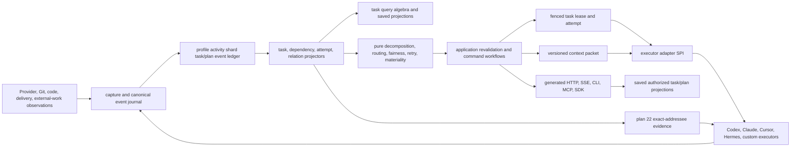
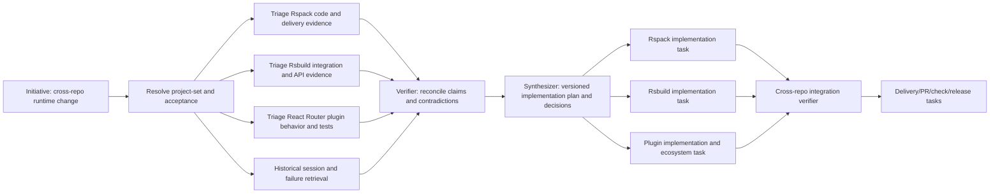

# TraceDecay V2 Canonical Task/Plan Graph and Multi-Agent Executor Plan

> **Status:** implementation-grade architecture and delivery plan; no production code is changed by this document.
>
> **Product rule:** TraceDecay owns one profile-level initiative, plan, task, and execution graph. Kanban boards, plan outlines, DAGs, timelines, workload maps, executor views, repository views, and All are authorized projections over that graph, never independent databases or ambient routing state.

**Goal:** Turn TraceDecay's captured Threads, Sessions, Turns, Agents, Goals, tools, code, Git, delivery, knowledge, skills, hints, and automation evidence into a durable coordination system that can decompose and execute cross-repository initiatives safely across Codex, Claude, Cursor, Hermes, and custom executors without duplicating work, losing provenance, leaking private context, or forcing every agent to observe a global board.

**Architecture:** The profile activity shard owns an immutable task/plan event stream and current projections. `tracedecay-domain` defines the graph and lifecycle; `tracedecay-store` persists one owner-shard ledger; projectors attach task work to every other graph; query evaluates registered task values through the sole `TraceQueryV1` algebra; pure policy proposes decomposition, routing, readiness, fairness, retries, and sibling-materiality decisions; application authorizes and atomically applies effects; executor adapters run attempts through fenced leases and narrow capability grants; generated API/CLI/MCP/SDK/dashboard bindings expose the same use cases and typed views.

**Decision:** A task is not a card row, an assignee string, a provider prompt, an automation run, a Git branch, or a work-claim heartbeat. Those are related entities with distinct identity and authority. `WorkItemId` is the canonical schedulable identity; `ExecutionAttemptId` is one try; `TaskLeaseId + fence_epoch` is execution authority; `WorkClaimV1` remains advisory coordination evidence; `ContextPacketManifestId` pins exactly what an executor was allowed to know.

---

## 0. Contract lock

This is the plan for a **native TraceDecay port-and-redesign of Hermes Kanban**, not a Hermes adapter. TraceDecay owns and ships the canonical task/plan graph, scheduler, attempts, leases, worker protocol, CLI/MCP/API/SDK surfaces, and Brain/Work UI. For each Hermes component, implementation must choose and document one of three paths: port the proven behavior or code under its MIT provenance, rebuild it against V2 contracts while preserving its regression corpus, or replace it with a demonstrably better TraceDecay design. A separately configured Hermes agent may still be an execution host or capture source, exactly as Codex or Claude may be, but the TraceDecay Kanban/task product never delegates to or depends on a Hermes runtime, board database, plugin, or scheduler.

1. There is one canonical profile-owned initiative/plan/work-item graph. No repository, project, board, worktree, provider, plugin, dashboard, or executor creates a second source of task truth.
2. An initiative may span zero, one, or many projects, repositories, checkouts, worktrees, refs, and providers. Ownership remains the profile activity shard; scope is explicit relation evidence, not database placement.
3. `Initiative`, `Plan`, immutable `PlanVersion`, canonical `WorkItem`, dependency/gate, assignment, execution attempt, task lease, handoff, artifact, outcome, and cost are different typed entities.
4. “Task” and “ticket” are product vocabulary for a `WorkItem`. They never mint competing IDs or persistence tables.
5. A plan is a versioned graph. Editing it creates a new `PlanVersion`; in-flight attempts remain pinned to the versions they started with until an explicit revalidation decision cancels, supersedes, or permits them to continue.
6. Gating dependency edges form a DAG. Informational, evidence, similarity, and causal-candidate relations may contain cycles but never participate in readiness or critical-path computation.
7. Dependency readiness is derived from immutable events, typed gate expressions, schedules, budgets, policy, and active leases. It is not a mutable board-column string.
8. Decomposition policy is pure: it returns a typed proposed plan revision and explanation. Application revalidates scope, authorization, privacy, versions, cycles, budgets, and executor capabilities, then commits eligible effects atomically in the activity owner shard.
9. Autonomous decomposition within an enabled authority envelope does not create a preview/apply inbox. Human-authored plan changes are direct versioned commands with receipts. Human review gates may govern deliverables; they are not curation approval queues.
10. TraceDecay curation remains fully autonomous under plans 09 and 20. A curation run may be related to a work item or outcome, but there are no task-shaped Approve/Reject/Apply/Rollback controls for individual memories, facts, or managed-skill proposals.
11. Assignment expresses desired ownership/routing. Advisory `WorkClaimV1` expresses nearby-agent intent. Only a current fenced `TaskLeaseV1` grants execution authority.
12. Every active attempt owns one lease epoch. Completion, blocking, artifact publication, handoff, or side-effect receipt from a stale epoch is rejected, even if the stale worker still has a process or network connection.
13. Many hosts may schedule and execute concurrently. Atomic owner-shard compare-and-swap plus monotonically increasing fence epochs prevents double execution; PID liveness is optional local evidence, never distributed truth.
14. Every executor is registered through a versioned adapter/capability manifest. An assignee label never doubles as an executable name, profile path, provider, model, host, or authorization decision.
15. Requested and actual executor adapter, provider, model, model revision, reasoning effort, tool catalog generation, skills, capability grants, host, workspace binding, token/cost budget, and deadlines are pinned per attempt and recorded in receipts.
16. Allow/deny decisions are explicit by declared scope. Deny wins. A global wildcard does not silently grant mutation tools, MCP servers, remote egress, credentials, repository writes, Git writes, PR operations, or cross-project reads.
17. Agents receive a compact, versioned, sanitized context packet, not a path to the task database or a dump of the global board. Packet entries cite durable retrieval anchors and exact scopes.
18. Context packets include only relevant parents, sibling summaries/decisions, dependencies, acceptance criteria, worktree/branch bindings, constraints, handoffs, and retrieval anchors. Omitted or unavailable evidence is explicit.
19. Material sibling changes create new packet evidence. Plan 22 decides whether one exact Thread/Turn/Agent should receive a compact advisory at a safe host boundary; task events never broadcast directly into every prompt.
20. Tool output, API output, CLI output, MCP output, SDK models, and dashboard state are generated from the same application view models. No transport reimplements readiness, permissions, retry semantics, truncation, or task rendering.
21. Kanban, DAG, plan, timeline, causal, critical-path, workload, executor, repository, initiative, and All are saved authorized projections. “Current board” may be ephemeral UI state only and never supplies ownership, dispatch scope, or mutation scope.
22. Workspace paths are locators, not identity. Repository, project, checkout, worktree, ref, commit, and `CodeSnapshotId` remain distinct. A writable attempt binds exact versions before any edit.
23. TraceDecay never auto-stashes, resets, cleans, rebases, merges, force-pushes, deletes, or adopts a user-owned dirty worktree. Such conditions become typed blocks or separately authorized delivery workflows.
24. A terminal task result requires acceptance evidence or an explicit authorized exception receipt. Plain-text worker exit, process disappearance, or provider “success” is not proof of completion.
25. Retries reuse stable idempotency keys for already-authorized effects, create a new `ExecutionAttemptId` and lease epoch, consume a declared budget, and consult task/executor/provider circuit breakers.
26. Cancellation is first class: requested, acknowledged, effect-stopped, reconciled, and terminal dispositions are distinguishable. An unknown remote cancellation never permits immediate unsafe reuse of the old lease or provider thread.
27. Artifacts, logs, comments, prompts, summaries, metadata, model output, and errors enter as `Unclassified<T>` and pass plan 18's sanitizer before any ordinary store, index, event, packet, output, export, or model sink.
28. Hidden chain-of-thought is never requested or inferred. Only provider-exposed reasoning artifacts, messages, summaries, decisions, tool events, and evidence are linkable.
29. Every query/result states scope resolution, graph/plan versions, watermarks, authorization coverage, partial/unavailable components, and anchorability. Empty never means “no work exists” when coverage is incomplete.
30. Migration ends with one scheduler, one lease authority, one context-packet assembler, one task query engine, one public capability catalog, and one dashboard state model. Compatibility adapters are bounded and deleted after receipts prove cutover.
31. Task reads use registered `EntityKind`, attribute, traversal, facet, aggregate, projection, and sort values inside the one domain `TraceQueryV1`; `TaskQueryV1`, `TaskContextSelectorV1`, board filter DSLs, and transport-specific task query bodies are forbidden. Convenience selectors compile losslessly to `TraceQueryV1` and expose the canonical digest.
32. Every accepted task command appends one canonical `task_graph_events` record and its projection/external-effect outbox entries in the same owner-shard transaction. Projectors, scheduler checkpoints, subscriptions, audit views, and replay consume that committed journal; notifier/SSE/outbox delivery is never a second event truth.
33. `RedundancyMode::SharedExecution` is coordination intent, not permission for two authoritative executors on one work item. Concurrent collaborators are explicit child work items under an aggregate parent; provider-internal subagents remain attached to the one primary attempt and use only its brokered grants.

## 1. Product objective and non-goals

### 1.1 Product objective

TraceDecay should expose work as part of the same “brain” as conversations, agents, code, Git, delivery, knowledge, and time:

- a user creates or discovers one initiative, such as a coordinated Rspack/Rsbuild/React Router change;
- TraceDecay resolves the exact authorized repository/project/worktree set and current evidence;
- deterministic or model-assisted decomposition proposes a versioned task subgraph;
- the application validates and records independently leasable work with typed dependencies and acceptance criteria;
- routing policy selects eligible Codex, Claude, Cursor, Hermes, or custom executor classes without overloading an assignee string;
- workers receive narrow context packets and capability grants, execute in isolated exact workspaces, and publish structured handoffs/artifacts/outcomes;
- verifier and synthesizer work items join parallel research before implementation tasks unlock;
- the dashboard can pivot the same selection between plan, board, DAG, timeline, causal, repository, workload, executor, and critical-path views;
- agents see only their relevant slice, while authorized humans can query All without copying tasks into global boards;
- every decision is replayable from versions, evidence, anchors, policy/config/catalog manifests, and receipts.

### 1.2 Non-goals

- No generic project-management suite, arbitrary spreadsheet, issue-tracker clone, or untyped workflow DSL.
- No replacement for GitHub issues/PRs, provider-native goals, Claude workflows, Codex plans, or external schedulers. They remain observed/linked systems unless explicitly materialized as canonical work.
- No attempt to make one transaction span profile activity, multiple project shards, Git hosts, model providers, and messaging platforms. Cross-system effects are durable workflows with reconciliation.
- No direct worker access to SQLite, the profile store, secrets, all projects, all sibling prompts, or unrestricted MCP.
- No LLM in the atomic claim or heartbeat path.
- No priority score derived from model confidence alone.
- No completion inferred from a commit, branch, PR, tool exit code, log string, or elapsed time without the declared acceptance contract.
- No global board notifications, polling spam, repeated sibling hints, or raw reasoning exchange between agents.
- No automatic merge, force push, review approval, deployment, release, or external message without the separately cataloged grant and application workflow.
- No item-by-item curation approval or rollback workflow.

Explicitly rejected architectures:

- **per-board databases:** fragment identity/dependencies, make cross-repository initiatives copies, and let ambient view state leak into execution;
- **one monolithic `TaskStore`:** collapses domain, persistence, policy, executor, query, and transport boundaries into another untestable subsystem;
- **external tracker authority:** GitHub/Linear/Jira/Hermes items may be observed and synchronized under explicit workflows, but cannot own TraceDecay's agent/Turn/context/lease truth;
- **session-as-task:** one task may span many Threads/Sessions/Turns/Agents and one Thread/Session/Turn may contribute to many tasks over time;
- **executor queue as task truth:** a queue routes offers; it never owns plan versions, dependencies, acceptance, context, artifacts, outcomes, or audit history.

## 2. Research, provenance, and design evidence

Research follows [13-research-provenance-and-context-anchors.md](./13-research-provenance-and-context-anchors.md): record safe source identity and retrieval recipes, keep private payloads out of the repository, and treat local/transcript handles as discovery evidence until durable V2 anchors exist.

### 2.1 Local Hermes implementation audit

| Evidence | Safe observation | Required design response |
|---|---|---|
| Registered project `proj_99472b542e35cdb6`, `/fast/projects/hermes-agent` | Audited at clean local commit `732a9ffc572ad2703fbd25cc8a21c9f3f9c10d69`, package `0.16.0`; fork remote is `ScriptedAlchemy/hermes-agent`. | Pin source/commit in implementation research; do not describe the local fork as official current Hermes. |
| `hermes_cli/kanban_db.py` | Central SQLite kernel owns tasks, links, comments, events, runs, attachments, notifications, claims, dispatch, recovery, workspaces, logs, and dependency promotion. | Preserve a central semantic kernel, but split domain/store/policy/application/adapter ownership and keep one activity-shard truth. |
| `hermes_cli/kanban.py` | One argparse tree backs CLI and `/kanban`, giving useful surface parity. | Generate every TraceDecay transport from catalog/application contracts; do not hand-maintain another parser surface. |
| `tools/kanban_tools.py` | Nine task tools give workers structured lifecycle operations and limit ordinary tool-schema cost. | Expose a compact grant-filtered task toolset; keep human control-plane operations separate from executor lifecycle operations. |
| `gateway/kanban_watchers.py` | Gateway loops dispatch and notify across boards; embedded supervision is operationally convenient. | Keep a supervised scheduler/runner, but require explicit executor/scope registrations and event subscriptions rather than enumerate ambient boards. |
| `plugins/kanban/dashboard/plugin_api.py` and SPA | Rich REST/WS board, run, worker, attachment, profile, settings, diagnostics, and control surfaces. | Reuse interaction lessons; forbid plugin-local domain SQL and make the dashboard a generated-client projection consumer. |
| Task/run schema | Strong attempt history, structured summary/metadata, dependency links, worktree/branch, model override, skills, retry/runtime/heartbeat fields. | Promote these to typed versioned entities; replace free JSON and overloaded strings with schemas and catalog refs. |
| Dispatch loop | Atomic claim, TTL, heartbeat, stale/crash/timeout recovery, global/per-profile caps, retry breaker, respawn guard, protocol-violation detection. | Preserve these behaviors with distributed fence epochs, typed failure classes, durable cancellation, and many-host reconciliation. |
| Board selection | Environment/current-file/path/board precedence plus profile-shared storage makes selection easy but ambient. | Never derive dispatch/write ownership from current UI state, CWD, path, or persisted “current board.” |
| Worker context | Parent results, comments, prior runs, attachments, logs, and task details are assembled for a worker. | Add versioned packet manifests, relevant sibling decisions, immutable scopes, acceptance tests, anchors, privacy receipts, omissions, and refresh/invalidation. |
| Security | Task ownership checks and board pinning exist; dashboard uses session-token auth locally; tenant is a soft namespace; task text/logs lack a TraceDecay-grade sanitizer. | Add capability grants, row/entity authorization, mandatory sanitizer, protected logs/artifacts, and narrow packet hydration. |
| Test inventory | 29 local Kanban-focused test files cover DB/CLI/boards/decomposition/swarm/goal mode/caps/tools/dashboard/runs/notifier/auth. | Reuse scenario shapes, then add distributed leases, adapter conformance, privacy, cross-project scope, fairness, cancellation, and deterministic replay suites. |

The local audit also found `scheduled` as a state without local `scheduled_at`, no explicit task provider or reasoning-effort field, no canonical cancelled state, no distributed fence epoch, no per-task capability-grant object, no versioned context packet, and no native Kanban MCP server. Official current code and documentation evolved beyond parts of this fork, so concepts must be checked at a pinned official revision before implementation.

### 2.2 Official primary sources

| Source | Design evidence |
|---|---|
| [NousResearch/hermes-agent](https://github.com/NousResearch/hermes-agent) | Official upstream and release lineage; repository reports MIT licensing and current releases. Audit official main again when implementation begins. |
| [Official Kanban documentation](https://hermes-agent.nousresearch.com/docs/user-guide/features/kanban) | Durable board, CLI/slash/tool/dashboard surfaces, dependency graphs, worker context, runs, scheduling, model/workspace controls, notifications, and current limitations. |
| [Official worker-lane contract](https://hermes-agent.nousresearch.com/docs/user-guide/features/kanban-worker-lanes) | Separates lifecycle truth from executor lanes and documents spawn/lifecycle/log requirements. TraceDecay generalizes this into a typed executor SPI and fenced attempts. |
| [Official toolset reference](https://hermes-agent.nousresearch.com/docs/reference/toolsets-reference) | Kanban is opt-in and excluded from wildcard tool grants. TraceDecay keeps deny-by-default mutation capabilities and attempt-scoped grants. |
| [Hermes v0.15 release](https://github.com/NousResearch/hermes-agent/releases/tag/v2026.5.28) | Records the Kanban maturation wave and evolution toward decomposition, swarm topology, schedules, worktrees, per-task models, retries, and worker visibility. This supports incremental, test-led delivery rather than one omnibus implementation. |
| [Ambient board ownership issue #21877](https://github.com/NousResearch/hermes-agent/issues/21877) | Official issue documents cross-bot dispatch/write/token/notification confusion from global current-board state and all-board scanning. This is a must-not-regress fixture. |
| [MIT license](https://github.com/NousResearch/hermes-agent/blob/main/LICENSE) | Concepts may be adapted; any substantial copied code must retain license/copyright notice. Prefer clean typed design in TraceDecay and record provenance for borrowed algorithms or fixtures. |
| [GitHub Projects](https://docs.github.com/en/issues/planning-and-tracking-with-projects/learning-about-projects/about-projects) | Official docs model table, board, and roadmap as customizable views over linked issues/PRs. TraceDecay adopts the “many saved views over stable items” lesson, not GitHub as task authority or a dependency. |
| [Temporal Workflow Execution](https://docs.temporal.io/workflow-execution) | Official docs distinguish durable workflow identity, runs, event history, commands, cancellation, retries, and replay. TraceDecay adapts these conceptual separations while retaining its own Rust/application/event contracts; Temporal is not a dependency. |
| [Temporal Task Queues](https://docs.temporal.io/task-queue) | Official docs describe capacity-aware worker polling/routing and persisted queued work. TraceDecay borrows capacity-aware routing/fairness concepts but keeps the queue as a projection/offer mechanism, never canonical task state; Temporal is not a dependency. |

Official documentation has historically contained conflicting authentication text for plugin routes while source changed. Source, middleware composition tests, and pinned release behavior outrank prose. TraceDecay API authorization must be contract-tested rather than inferred from a dashboard binding default.

### 2.3 Session and failure anchors

These are safe legacy discovery locators. Resolve content only through authorized TraceDecay retrieval; do not copy transcript payloads into source fixtures.

| Case | Legacy anchor | Safe evidence requirement |
|---|---|---|
| Parallel decomposition and fan-in | `session:20260617_210811_5cd728` | Five triage tasks routed across distinct executor-like assignees, then verifier/synthesis/implementation joins. Preserve actor, route, parent/child, run, and outcome identity. |
| Ambient board/store ambiguity | `session:20260617_020912_188f3e` | Work intended for `rsbuild-plugin-react-router` landed on ambient `tracedecay/default`; repair copied five roots to new task IDs, archived 32 misplaced roots/children, lost dependencies, launched copied tasks together although three were already complete, and left one worker alive after manual completion. Prove one owner graph, identity-preserving move/relation semantics, explicit scope, CAS revisions, and fenced stale-worker rejection. |
| Task/Turn temporal multiplicity | `session:20260617_210811_5cd728` | A 424-message thread spans many tasks, branches, and PRs. Model task↔Thread/Session/Turn/Agent as evidence-bearing many-to-many temporal relations, never session-as-task or one task per thread. |
| Cross-project scope failures | `019f42c9-623a-7cc0-95c1-f073eaa05a4d`, `019f4323-f569-74c0-9988-ea3851d14fd7`, `019f4325-57ef-7a53-b6a0-5c583c759301` | Rspack/Rsbuild discovery and tokenization failures from Plan 13. Make cross-repository initiative queries and packets first-class. |
| Wrong worktree/ref context | `019f3edc-6a4e-7d80-b181-8f6d1e657859`, `019f2524-534d-7bd1-a3b1-675f242dcc0e` | Explicit worktree/ref/snapshot and per-Turn location must survive task routing and attempt execution. |
| Copied sibling work | Parent `019f19af-06d7-7ed1-a4d2-87516c0b2229` and child occurrences registered in Plan 23 case `TD-SR-003` | Distinguish delegated copies, planned ensemble work, and accidental duplication; notify only the affected addressee. |

The two Hermes IDs did not resolve through the registered Hermes project shard during this audit. Keep them as legacy anchors with a coverage note until profile-wide stable-ID routing can create `RetrievalAnchorId`s. Plan 13 owns the durable research manifest; Plan 23 owns temporally correct replay and representative selection.

### 2.4 Preserve and reject

| Preserve from Hermes | Reject or redesign |
|---|---|
| Atomic claim and explicit worker lifecycle | SQLite/PID claim as distributed authority |
| Task versus run/attempt history | Task row carrying lease, retry, worker, and result concerns |
| Dependency DAG and fan-out/fan-in patterns | One string `assignee` as profile, lane, provider, model, and authority |
| Structured handoffs and downstream parent context | Free-form metadata as the machine protocol |
| Heartbeats, stale recovery, runtime limits, circuit breakers | One undifferentiated failure counter and host-local crash truth |
| Per-task model, skill, workspace, branch, retry, schedule controls | Unversioned config inheritance and no requested/actual execution receipt |
| Thin worker toolset | Direct shared DB access or broad board visibility |
| CLI/slash parity and useful dashboard controls | Dashboard SQL/domain logic, private REST semantics, and duplicated renderers |
| Board, DAG, swarm, worker/run visualizations | Board as source of truth, ambient current board, and all-board notification loops |
| Triage, verifier, synthesizer patterns | Unanchored model decomposition or silent fallback assignee |

### 2.5 Hermes Kanban heritage disposition

This branch remains plans-only. The implementation phase performs a file-and-feature-level port assessment, preserves the recorded MIT provenance, and is allowed to port algorithms, tests, schemas, interaction flows, and suitable source directly when that produces the strongest TraceDecay implementation. Language or architecture mismatches may require a behavior-preserving Rust/React/TypeScript port; known weaknesses are deliberately redesigned. This is product implementation inside TraceDecay, never a runtime adapter around Hermes Kanban.

| Hermes anchor at `732a9ffc572ad2703fbd25cc8a21c9f3f9c10d69` | Disposition | V2 decision |
|---|---|---|
| `hermes_cli/kanban_db.py` task/run/event/link kernel | **Port and improve** | Port the transactional invariants, ordered event/history behavior, and proven tests into the V2 store/application split; replace board-local IDs, overloaded task rows, host-PID authority, free JSON, and ambient board selection with canonical IDs, immutable versions, typed relations, explicit revisions, and fence epochs. |
| `hermes_cli/kanban_db.py::{claim_task,release_stale_claims,detect_crashed_workers,enforce_max_runtime}` | **Port as policy, reimplement as transactions** | Preserve CAS claim, layered stale detection, alive-extend-not-reclaim, maximum runtime, protocol-violation detection, rate-limit sentinel, respawn guard, and breaker semantics; implement them over V2 leases/attempts/evidence in §§5, 8.7, and 9. |
| `hermes_cli/kanban_swarm.py` and decomposition helpers | **Port and improve** | Port fan-out → verifier → synthesizer topology, decomposition tests, and Kahn cycle rejection as ordinary typed work items/edges; replace the comment blackboard with versioned context packets, handoffs, decisions, and artifacts. |
| `tools/kanban_tools.py` | **Port and improve** | Port the compact worker lifecycle surface and created-child verification; bind every call out of band to the active registration/attempt/epoch/grant and route it through generated application capabilities. |
| `gateway/kanban_watchers.py` dispatcher/notifier loops | **Reimplement** | Preserve event cursors, single delivery claim, rewind-after-send-failure, and ordered safety-before-start work; replace 60 s/5 s polling and ambient board enumeration with journal wakeups plus bounded repair polling. |
| `plugins/kanban/dashboard/plugin_api.py`, dashboard SPA, and `kanban_diagnostics.py` | **Port interactions; rebuild data boundary** | Port useful inspector anatomy, task/run/event diagnostics, attention/staleness/progress patterns, interaction tests, and structured suggested actions; use the generated V2 client, shared `DiagnosticEnvelopeV1`, saved projections, SSE deltas, and plan-11 UI state. No SQL or plugin-local business rules. |
| `plugins/kanban/dispatcher.py` and gateway-embedded single-host supervision | **Drop/reimplement** | Drop single-host process ownership and multiple-poller caveats; root composition supervises one scoped canonical scheduler while registered adapters may run on many hosts. |
| `skills/devops/kanban-worker` and `skills/devops/kanban-orchestrator` | **Port and generalize** | Port explicit show/work/heartbeat/complete/block and orchestration responsibilities; generate host instructions from the active packet/catalog/grants and keep lifecycle termination visible to every active worker. |
| Board slug/directory databases, global `current`, `t_<hex>` board-local identity, absolute-path attachments, and status-column authority | **Drop** | Boards are `TraceQueryV1` views, attachments are scanned content-addressed artifacts, status is decomposed into typed dimensions, and no current UI/CWD/board value controls ownership or dispatch. |
| Integrity-check/quarantine-not-recreate, FD ownership, and post-commit invariants | **Port as store regressions** | Plan 02 owns equivalent store/open/recovery tests for the canonical shards; no per-board DB survives. |

Plan 13 PR 2A owns the implementation heritage ledger. Before code moves it must pin the exact official and local Hermes commit/file/test/UI spans and record `direct_port`, `behavioral_port`, `redesign`, or `drop` for every audited subsystem, including backend algorithms/schema tests, worker lifecycle tools, dashboard components/interactions, and diagnostics. Each row records license/copyright disposition, destination owner/PR, source-to-test traceability, divergence rationale, and the regression that proves the replacement is at least as strong. Directly copied or translated code carries required notices; behavior-preserving ports carry source-to-test traceability. If upstream behavior differs, tests and source at the pinned revision outrank unversioned prose. PRs 4E, 6G, 24M, 24N, and 25G may prototype against fixtures but cannot merge implementation until their applicable PR 2A ledger rows are reviewed.

## 3. Ownership and cross-plan contract

Do not create a monolithic `tracedecay-tasks` crate. The graph is a cross-cutting vertical slice whose semantic owners already exist. Each owner gets cohesive modules; `tracedecay-application` composes them through consumer-owned ports.

| Plan | Contract consumed or extended here |
|---|---|
| [01-domain-crate.md](./01-domain-crate.md) | Owns all IDs, entities, versions, events, relations, evidence, scopes, privacy wrappers, leases, cursors, errors, and typed task/plan/execution contracts proposed here. |
| [02-store-crate.md](./02-store-crate.md) | Owns activity-shard schema, immutable event/history storage, transactions, fenced leases, outbox, blobs, retention, backup/restore, and repositories. |
| [03-capture-crate.md](./03-capture-crate.md) | Captures provider-native goals/plans/workflows/tool events, locations, external tasks, Git/delivery facts, and executor observations without granting task authority. |
| [04-projectors-crate.md](./04-projectors-crate.md) | Builds current task/plan/attempt/dependency/critical-path/workload/context-materiality projections and links them to every graph. |
| [05-query-crate.md](./05-query-crate.md) | Registers task entity kinds, attributes, predicates, traversal relations, facets, projections, and saved profiles consumed through the unchanged `TraceQueryV1`; it supplies deterministic traversal, aggregation, explanation, pagination, and context assembly. No task-specific source/operator vocabulary or second query engine. |
| [06-policy-crate.md](./06-policy-crate.md) | Owns pure decomposition validation, routing, readiness, priority/fairness, retry/circuit-breaker, packet relevance, and sibling-materiality decisions. |
| [07-hooks-crate.md](./07-hooks-crate.md) | Receives only validated plan-22 suggestion envelopes and bounded task lifecycle signals at supported host boundaries; it never schedules or claims work. |
| [08-tool-catalog-crate.md](./08-tool-catalog-crate.md) | Declares task capabilities, effect/scope/privacy/cost metadata, executor adapter manifests, grant eligibility, generated schemas, and bindings. |
| [09-application-crate.md](./09-application-crate.md) | Owns task/plan commands and queries, authorization, graph transactions, scheduler, lease lifecycle, packet assembly, executor workflows, cancellation, and receipts. |
| [10-api-crate.md](./10-api-crate.md) | Exposes versioned HTTP/SSE, auth, problems, cursors, idempotency, generated schemas, and executor control-plane protocol. |
| [11-dashboard-frontend.md](./11-dashboard-frontend.md) | Owns all human projections, inspectors, saved views, interaction state, accessibility, visual/performance tests, and Orchestration Lab UI. |
| [12-root-compatibility-migration.md](./12-root-compatibility-migration.md) | Owns root composition, V1/external adapters, daemon wiring, shadow/cutover, one-scheduler selection, deletion receipts, and rollback window. |
| [13-research-provenance-and-context-anchors.md](./13-research-provenance-and-context-anchors.md) | Owns research manifests and stable implementation/session/source anchors, including the Hermes evidence registry. |
| [14-historical-failure-regression-matrix.md](./14-historical-failure-regression-matrix.md) | Registers duplicate work, wrong scope/worktree, stale lease, retry storm, board ambiguity, output, privacy, and provider failures as cutover cases. |
| [15-search-quality-evaluation-and-retrieval-research.md](./15-search-quality-evaluation-and-retrieval-research.md) | Supplies qrels, relevance metrics, hard negatives, optional semantic channels, and retrieval-quality promotion gates for context packets and task queries. |
| [16-cross-project-repository-worktree-scope.md](./16-cross-project-repository-worktree-scope.md) | Resolves immutable multi-project/repository/worktree/ref/snapshot sets, authorization, federation, and Rspack/Rsbuild/React Router fixtures before any task effect. |
| [17-official-public-api-and-sdks.md](./17-official-public-api-and-sdks.md) | Owns stable public API/SDK compatibility, generated clients, auth scopes, event subscriptions, examples, deprecation, and conformance. |
| [18-secret-detection-redaction-and-private-data-safety.md](./18-secret-detection-redaction-and-private-data-safety.md) | Owns sanitizer/taint types, protected payloads, logs/artifacts/packets, secret scanning, quarantine, egress, retention, and deletion. |
| [19-system-defragmentation-convergence-and-extensibility.md](./19-system-defragmentation-convergence-and-extensibility.md) | Enforces the allowed dependency DAG, one canonical activity graph, SPI rules, entropy budget, and deletion of parallel systems. |
| [20-configuration-control-plane.md](./20-configuration-control-plane.md) | Exclusively owns typed task/executor/scheduler/model/budget/grant/privacy settings, precedence, history, activation, status, and all configuration UIs/bindings. |
| [21-cli-mcp-tool-surface-and-output-unification.md](./21-cli-mcp-tool-surface-and-output-unification.md) | Owns generated semantic bindings, the pure `tracedecay-presentation` renderer/document model, Markdown-default/explicit-JSON rules, stable pagination/handles/errors, and parity; plan 09 owns semantic typed view models. |
| [22-incremental-context-scout-and-suggestion-envelopes.md](./22-incremental-context-scout-and-suggestion-envelopes.md) | Consumes task events/context-packet refs as evidence and delivers at most one material, deduped, privacy-safe advisory to an exact Thread/Turn/Agent. |
| [23-session-lcm-temporal-retrieval-and-evaluation.md](./23-session-lcm-temporal-retrieval-and-evaluation.md) | Owns temporal retrieval, logical-message copies, current/as-of semantics, source horizons, representative selection, and packet context assembly quality. |
| [26-observability-accounting-and-usage.md](./26-observability-accounting-and-usage.md) | Owns generated task/executor accounting descriptors, liveness/scheduler rollups, attempt/work-item/executor/route/model/effort attribution, SLOs, unknown/cap semantics, and Observatory/Costs view contracts consumed here. |

### 3.1 Allowed architecture



Forbidden edges:

- adapters, hooks, dashboard, CLI, MCP, or SDKs opening task tables directly;
- policy importing store, network, process, Git, model, clock, or transport implementations;
- project shards owning task mutations for a cross-project initiative;
- executor adapters selecting their own scope, tools, model, provider, retries, or sibling context;
- dashboard state, current route, CWD, current branch, or current board becoming mutation authority;
- context scout claiming, cancelling, assigning, messaging, or completing work;
- external provider goals/workflows becoming schedulable solely because capture observed them.

---

> **Part A — Canonical graph.** Sections 4–8: domain contracts, owner-shard store and transactions, projectors/relations, task query algebra, and pure policy.

## 4. Domain model

Add cohesive contracts under `crates/tracedecay-domain/src/task_graph/` and register every schema, enum, ID, reason code, and view input in the common versioned schema registry.

```text
crates/tracedecay-domain/src/task_graph/
├── mod.rs
├── ids.rs
├── initiative.rs
├── plan.rs
├── work_item.rs
├── dependency.rs
├── acceptance.rs
├── decision.rs
├── assignment.rs
├── claim.rs
├── lease.rs
├── executor.rs
├── attempt.rs
├── workspace.rs
├── context_packet.rs
├── handoff.rs
├── artifact.rs
├── outcome.rs
├── budget.rs
├── cost.rs
├── events.rs
├── query.rs
├── views.rs
├── status.rs
└── reason_codes.rs
```

### 4.1 Canonical identities and versions

```rust
pub struct InitiativeId(pub EntityId);
pub struct PlanId(pub EntityId);
pub struct PlanVersionId(pub EntityVersionId);
pub struct WorkItemId(pub EntityId);
pub struct WorkItemVersionId(pub EntityVersionId);
pub struct DependencyId(pub EntityId);
pub struct AcceptanceCriterionId(pub EntityId);
pub struct TaskDecisionId(pub EntityId);
pub struct AssignmentId(pub EntityId);
pub struct TaskOfferId(pub EntityId);
pub struct TaskLeaseId(pub EntityId);
pub struct ExecutionAttemptId(pub EntityId);
pub struct ExecutorRegistrationId(pub EntityId);
pub struct ExecutorInstanceId(pub EntityId);
pub struct WorkspaceBindingId(pub EntityId);
pub struct ContextPacketManifestId(pub EntityId);
pub struct HandoffId(pub EntityId);
pub struct TaskArtifactId(pub EntityId);
pub struct TaskOutcomeId(pub EntityId);
pub struct SavedTaskViewId(pub EntityId);

pub struct VersionPin<T> {
    pub id: T,
    pub version: EntityVersionId,
    pub data_version_digest: DataVersionDigest,
}

pub struct WorkClaimRefV1 {
    pub claim: EntityRef,
    pub observed_event: EventId,
    pub observed_at: UtcMicros,
}

pub struct ContextPacketManifestRefV1 {
    pub packet_id: ContextPacketManifestId,
    pub ordinal: u64,
    pub manifest_digest: ManifestDigest,
}
```

IDs are allocated under the deterministic/native allocation rules in Plan 01. Provider task IDs, GitHub issue numbers, external board IDs, Codex goal IDs, Claude workflow IDs, and automation run IDs become aliases or related entities with evidence; they never replace canonical IDs. Every public ref includes owner shard, version, and safe label projection where authorized.

`DependencyId`, `WorkClaimRefV1`, and `ContextPacketManifestRefV1` are the only task dependency/advisory-claim/packet reference shapes. Their canonical definitions live in plan 01; the matching forms above are an integration excerpt, not a second owner. Other plans and generated bindings import them unchanged; names such as `TaskDependencyId`, `TaskClaimRefV1`, `WorkClaimId`, `ContextPacketRefV1`, or a packet `EntityVersionId` are invalid. Work claims are immutable observations referenced by event/time, while packets are immutable sealed manifests referenced by ordinal/digest.

`ScopeResolutionId` and `ScopeResolutionV2` are plan 01 scope contracts ([01-domain-crate.md](01-domain-crate.md)), not task-graph identities: wherever this plan pins a resolved scope (plan versions, context packets, capability grants), the record carries the `ScopeResolutionId` of one immutable plan 01 `ScopeResolutionV2`. No `Ref`/`Resolved` renaming of that type exists.

### 4.2 Initiative, plan, plan version, and graph of graphs

```rust
pub struct BudgetEnvelopeV1 {
    pub max_input_tokens: Option<u64>,
    pub max_output_tokens: Option<u64>,
    pub max_cost_microusd: Option<u64>,
    pub max_wall_time: Option<DurationMicros>,
    pub max_tool_calls: Option<u64>,
    pub max_egress_bytes: Option<u64>,
    pub max_parallel_attempts: u32,
}

pub struct AttemptBudgetV1 {
    pub parent_budget_digest: ManifestDigest,
    pub input_token_limit: u64,
    pub output_token_limit: u64,
    pub cost_limit_microusd: u64,
    pub wall_time_limit: DurationMicros,
    pub tool_call_limit: u64,
    pub egress_byte_limit: u64,
}

pub struct ArtifactKindRef {
    pub kind: NativeKindCode,
    pub schema: SchemaRef,
}

pub struct DecisionValueV1 {
    pub registry_code: NativeKindCode,
    pub schema_version: SchemaVersion,
}

pub enum PullRequestStateV1 { Draft, Open, Merged, Closed }
pub enum CheckStateV1 { Queued, InProgress, Passed, Failed, Cancelled, Skipped, Neutral, TimedOut }

pub struct PolicyExplanationRef {
    pub evaluation_id: PolicyEvaluationId,
    pub explanation_digest: ManifestDigest,
    pub protected_payload: Option<PayloadRef>,
}

pub struct InitiativeV1 {
    pub id: InitiativeId,
    pub owner_profile: ProfileId,
    pub version: EntityVersionId,
    pub title: SinkEligible<PrivateText>,
    pub objective: Option<SinkEligible<PrivateText>>,
    pub declared_scope: DeclaredScope,
    pub scope_selector: ScopeSelectorV2,
    pub state: InitiativeStateV1,
    pub budgets: BudgetEnvelopeV1,
    pub created_by: ActorRef,
    pub created_at: UtcMicros,
}

pub struct PlanV1 {
    pub id: PlanId,
    pub initiative: InitiativeId,
    pub current_version: PlanVersionId,
    pub state: PlanStateV1,
}

pub struct PlanVersionV1 {
    pub id: PlanVersionId,
    pub plan: PlanId,
    pub ordinal: u64,
    pub predecessor: Option<PlanVersionId>,
    pub work_items: Vec<WorkItemVersionRefV1>,
    pub dependencies: Vec<DependencyVersionRefV1>,
    pub subplans: Vec<SubplanRefV1>,
    pub gates: Vec<PlanGateV1>,
    pub scope_resolution: ScopeResolutionId,
    pub policy_manifest: Option<PolicyManifestRef>,
    pub effective_config_snapshot_id: EffectiveConfigSnapshotId,
    pub effective_config_digest: EffectiveConfigDigest,
    pub catalog_snapshot: CatalogSnapshotRefV1,
    pub evidence: Vec<RetrievalAnchorId>,
    pub created_by: ActorRef,
    pub created_at: UtcMicros,
    pub content_digest: ManifestDigest,
}
```

Budget-envelope `None` means “inherit the bounded parent/global safety floor,” never unlimited. `max_parallel_attempts` and every materialized `AttemptBudgetV1` limit are nonzero; allocation proves the child limits fit the current parent remainder and records `parent_budget_digest`. Actual consumption is accounting evidence, not mutable fields inside the immutable allocation. Artifact kinds, decision values, executor classes, provider-specific effort codes, and policy explanations resolve only through their pinned registries/evaluations; free text cannot satisfy a gate or select a route.

`PlanVersionV1` is immutable. `PlanId.current_version` changes only through one expected-version command. A new version may add, replace, retire, split, or join work items; it never mutates historical membership. `WorkItemId` may continue across plan versions when its semantics and acceptance contract remain compatible. A material change creates a new `WorkItemVersionId`; replacement uses an explicit `Replaces` relation.

The graph of graphs has three layers:

1. **Initiative graph:** initiatives relate by prerequisite, supersession, shared outcome, program membership, or evidence. It may span all authorized projects.
2. **Plan graph:** a plan version contains work-item DAGs and may expand a work item into a child plan version through `ExpandsTo`. Child plan terminal outcome satisfies the parent expansion gate.
3. **Evidence graph:** every work item links through typed canonical relations to Threads, Sessions, Turns, Agents, Goals, Workflows, tools, files, symbols, diagnostics, repositories, projects, worktrees, refs, commits, PRs, checks, releases, hints, memories, facts, skills, artifacts, decisions, and retrieval anchors.

Only typed gating edges affect dispatch. Evidence and causal-candidate edges enrich query/UI but cannot unlock work.

### 4.3 Canonical WorkItem

```rust
pub enum WorkItemKindV1 {
    General,
    Milestone,
    Gate,
    Research,
    Implementation,
    Verification,
    Synthesis,
    Review,
    Delivery,
    Remediation,
}

pub struct WorkItemVersionV1 {
    pub id: WorkItemId,
    pub version: WorkItemVersionId,
    pub initiative: InitiativeId,
    pub plan_version: PlanVersionId,
    pub kind: WorkItemKindV1,
    pub title: SinkEligible<PrivateText>,
    pub specification: Option<SinkEligible<PrivateText>>,
    pub declared_scope: DeclaredScope,
    pub scope: ScopeSelectorV2,
    pub acceptance: Vec<AcceptanceCriterionV1>,
    pub constraints: Vec<TaskConstraintV1>,
    pub schedule: ScheduleConstraintV1,
    pub priority: PriorityClassV1,
    pub estimate: Option<EffortEstimateV1>,
    pub budget: BudgetEnvelopeV1,
    pub retry_policy: RetryPolicyRefV1,
    pub desired_assignment: Option<AssignmentId>,
    pub disposition: WorkItemDispositionV1,
    pub created_by: ActorRef,
    pub evidence: Vec<RetrievalAnchorId>,
    pub version_digest: ManifestDigest,
}
```

The owner shard also maintains a compact transactional current row; it is a projection over immutable versions/events, not a second history object:

```rust
pub struct WorkItemCurrentV1 {
    pub work_item: WorkItemId,
    pub current_version: WorkItemVersionId,
    pub current_plan_version: PlanVersionId,
    pub revision: u64,
    pub readiness_digest: ManifestDigest,
    pub current_attempt: Option<ExecutionAttemptId>,
    pub active_lease: Option<TaskLeaseId>,
    pub next_fence_epoch: u64,
    pub disposition: WorkItemDispositionV1,
    pub resolution: WorkResolutionV1,
    pub updated_at: UtcMicros,
}
```

Every successful claim inserts a new immutable `ExecutionAttemptV1` row and atomically changes `current_attempt`; retry, reclaim, reassign, model change, or packet refresh never overwrites an old attempt. A terminal command must match `current_attempt`, active lease, and fence epoch. A superseded worker's late completion/block/heartbeat is rejected as a no-op, records a bounded `ZombieAttemptProtocolViolation` event against the old attempt, and cannot change the current row, acceptance, artifacts, outcome, or breaker state.

“Task” and “ticket” are presentation labels for `General`, selected by the product vocabulary/configuration without changing identity, readiness, routing, or query semantics. They are not distinct domain kinds.

Mutable-looking fields are changed by emitting a new version plus event. Titles/specifications remain private owner-shard payloads. Catalog and All rollups contain IDs, kinds, timestamps, counts, health, and keyed locators only.

Separate state dimensions avoid invalid board-column combinations:

```rust
pub enum WorkItemDispositionV1 { Open, Paused, CancelRequested, Cancelled, Retired, Archived }
pub enum WorkResolutionV1 { Unattempted, InProgress, AwaitingReview, Succeeded, Failed, Abandoned }
pub enum EffectiveReadinessV1 {
    Triage,
    BlockedByDependencies,
    BlockedByDecision,
    BlockedByScope,
    BlockedByCapability,
    Scheduled,
    BudgetExhausted,
    Ready,
    Leased,
    Running,
    AwaitingInput,
    AwaitingReview,
    Terminal,
}
```

`EffectiveReadinessV1` is a projector/policy result with reason codes and input versions. No command sets it directly. A board column maps this derived state to presentation lanes. Lease-acquisition fencing never reads this projection: the owner shard separately maintains a transactional `readiness_digest` column on the work-item current row (§5.3), and `AcquireTaskLeaseCommandV1.expected_readiness_digest` CAS-checks that column in-transaction.

### 4.4 Dependencies, gates, cycles, and critical path

```rust
pub enum GatingDependencyKindV1 {
    RequiresSuccess,
    RequiresTerminal,
    RequiresArtifact { artifact_kind: ArtifactKindRef },
    RequiresAcceptance { criterion: AcceptanceCriterionId },
    RequiresDecision { decision: TaskDecisionId, allowed: BTreeSet<DecisionValueV1> },
    RequiresPlanOutcome { child_plan: PlanId, allowed: BTreeSet<OutcomeClassV1> },
    NotBefore,
}

pub enum NonGatingTaskRelationKindV1 {
    Related,
    DuplicateCandidate,
    PlannedParallel,
    Reviews,
    Verifies,
    Synthesizes,
    HandoffTo,
    Affects,
    ObservedIn,
    Produced,
    Encountered,
}

pub struct TaskDependencyV1 {
    pub id: DependencyId,
    pub plan_version: PlanVersionId,
    pub parent: WorkItemVersionRefV1,
    pub child: WorkItemVersionRefV1,
    pub kind: GatingDependencyKindV1,
    pub gate: GateExpressionV1,
    pub evidence: Vec<RetrievalAnchorId>,
}

pub enum DependencyStateV1 {
    Pending,
    Satisfied { evidence: Vec<RetrievalAnchorId> },
    Failed { reason: DependencyFailureReasonV1 },
    Invalidated { superseding_event: EventId },
    Excepted { exception: AcceptanceExceptionRefV1 },
}
```

`GateExpressionV1` is a closed typed AST: `All`, `Any`, `AtLeast`, `Predicate`, and `NotBefore`. It cannot contain SQL, shell, arbitrary code, transport payloads, or model prose. Every predicate names a versioned validator and evidence class.

Dependency state is projected from parent versions/outcomes, artifacts, decisions, acceptance, schedules, and exception events. `Pending → Satisfied|Failed|Excepted`; new contradictory/superseding evidence creates `Invalidated`, after which re-evaluation may produce a new `Satisfied|Failed|Excepted` version. No dashboard/worker command sets `Satisfied` directly. Invalidating a dependency after a child lease starts emits an attempt revalidation/cancellation decision and a packet update; it never rewrites the child's start manifest. `RequiresSuccess` cannot be satisfied by cancelled/failed/archived state, and `RequiresTerminal` states its allowed terminal set explicitly.

Cycle rules:

- adding/replacing a gating edge runs incremental topological validation inside the plan-version transaction;
- full publish computes strongly connected components and rejects every nontrivial SCC or self-loop in the gating graph;
- subplan expansion includes parent/child plan edges in cycle checks;
- informational relations are stored separately and labeled non-gating in every query/output;
- imports with cycles remain quarantined legacy evidence until an explicit repaired plan version is created;
- cycle diagnostics return the smallest deterministic witness path with safe IDs/labels and anchors.

Critical path is a projection over the active gating DAG:

- use observed duration distributions by compatible executor/work kind when sufficient; otherwise declared bounded estimate; otherwise `Unknown`;
- report optimistic/expected/pessimistic intervals and the input methodology/version;
- distinguish elapsed critical path, remaining critical path, slack, and blocked unknown segments;
- never fabricate a single duration when an unknown segment exists;
- recompute incrementally on graph, schedule, estimate, assignment capability, or terminal-outcome change;
- priority affects scheduling, not the mathematical dependency path.

### 4.5 Acceptance, decisions, handoffs, artifacts, outcomes, and costs

```rust
pub enum AcceptanceRequirementV1 {
    TestPass { test_ref: EntityRef, snapshot: CodeSnapshotId },
    DiagnosticAbsent { diagnostic: EntityRef, snapshot: CodeSnapshotId },
    ArtifactPublished { kind: ArtifactKindRef },
    PullRequestState { repository: RepositoryId, required: PullRequestStateV1 },
    CheckState { check: EntityRef, required: CheckStateV1 },
    ReviewDecision { reviewer_class: ReviewerClassV1, required: DecisionValueV1 },
    QueryAssertion { query: FrozenTraceQueryRef, predicate: QueryPredicateV1 },
    ManualAttestation { role: AuthorizationRoleRef },
    CatalogValidator { capability: CapabilityId, schema: SchemaRef },
}

pub struct AcceptanceCriterionV1 {
    pub id: AcceptanceCriterionId,
    pub description: SinkEligible<PrivateText>,
    pub requirement: AcceptanceRequirementV1,
    pub required: bool,
    pub validator_version: ComponentVersion,
}
```

Manual attestation is valid for inherently human criteria but records actor, role/grant, timestamp, task/plan versions, and evidence; it is not a generic bypass. An exception to a required criterion is a separately authorized exception event with reason/evidence and remains visible in outcome quality.

`TaskDecisionV1` stores alternatives, selected value, actor/policy, evidence, validity interval, supersession, and affected work items. Decisions can invalidate packet assumptions or gates. `HandoffV1` is a structured transition containing safe summary, completed acceptance, unresolved risks, decisions, artifacts, anchors, suggested next work, and source attempt. `TaskArtifactV1` references sanitized immutable blobs or canonical external artifacts; it records produced/observed/encountered, content/provenance digests, retention, and access class.

`TaskOutcomeV1` separates:

- execution disposition: completed, blocked, failed, cancelled, timed out, lost, superseded, deferred, protocol violation;
- product result: accepted, accepted-with-exception, rejected, inconclusive, no-op;
- effect state: none, pending reconciliation, reconciled, partially applied, compensated, unknown;
- evidence quality and coverage;
- residual risk and follow-up refs.

Costs use common plan-01 accounting types: provider/model tokens, tool calls, remote API, compute/runtime, storage, network, and human time when declared. Requested budget, reserved budget, measured cost, pricing methodology/version, unknown components, and allocation to initiative/plan/work-item/attempt are distinct.

### 4.6 Assignment, advisory claim, authoritative lease, and attempt

```rust
pub struct AssignmentV1 {
    pub id: AssignmentId,
    pub work_item: WorkItemVersionRefV1,
    pub target: AssignmentTargetV1,
    pub route: ExecutorRouteConstraintV1,
    pub rationale: PolicyExplanationRef,
    pub assigned_by: ActorRef,
    pub valid_from: UtcMicros,
    pub valid_to: Option<UtcMicros>,
}

pub enum AssignmentTargetV1 {
    ExecutorClass(ExecutorClassId),
    ExecutorRegistration(ExecutorRegistrationId),
    Agent(AgentId),
    User(ActorId),
    Team(ActorGroupId),
    Unassigned,
}

pub struct TaskLeaseV1 {
    pub id: TaskLeaseId,
    pub work_item: WorkItemVersionRefV1,
    pub attempt: ExecutionAttemptId,
    pub executor: ExecutorRegistrationId,
    pub fence_epoch: u64,
    pub issued_at: UtcMicros,
    pub heartbeat_at: UtcMicros,
    pub heartbeat_sequence: u64,
    pub expires_at: UtcMicros,
    pub state: LeaseStateV1,
    pub capability_grant_set_id: CapabilityGrantSetId,
    pub capability_grant_set_digest: ManifestDigest,
    pub context_packet: ContextPacketManifestRefV1, // immutable start packet; accepted updates live on attempt projection/events
}

pub struct TaskLeaseProofV1 {
    pub lease: TaskLeaseId,
    pub attempt: ExecutionAttemptId,
    pub executor: ExecutorRegistrationId,
    pub fence_epoch: u64,
    pub expires_at: UtcMicros,
    pub nonce: Nonce,
    pub signature: AuthenticationTag,
}
```

`CapabilityGrantSetId` is the canonical plan-01 entity identity for the immutable attempt/lease grant set; its manifest digest proves contents but never substitutes for the ID. Lease, attempt, start manifest, physical `task_leases`/`execution_attempts` rows, broker calls, events, and receipts carry both values and must agree. The set pins its ordered grant IDs, attempt, lease/epoch, policy manifest, effective configuration snapshot/digest, and catalog snapshot. Revocation appends a fenced revocation event/epoch without changing the set; any different grant contents require a new set on a new attempt/lease. Mutating a set behind a stable ID is forbidden.

`WorkClaimV1` from Plan 01 remains an advisory statement that an agent intends or appears to work on a scope. It drives nearby-agent/duplicate-work evidence and may suggest an assignment, but it cannot authorize tools, reserve budget, block scheduling, or complete a work item. `TaskLeaseV1` is application-issued execution authority and always points to one attempt. `TaskLeaseProofV1` is a short-lived unforgeable proof bound to lease/attempt/executor/epoch; its signature/nonce is protected control-plane material and never appears in ordinary stores, logs, prompts, UI, CLI, MCP, exports, or research anchors. Proof signatures use a profile-local HMAC signing key under the plan 18 key lifecycle (key ID plus rotation recorded in the profile catalog, matching the plan 12/19 receipt mechanism; no asymmetric PKI); only the application service verifies proofs, and key rotation invalidates outstanding proofs at the next issuance or heartbeat boundary.

```rust
pub struct ExecutionAttemptV1 {
    pub id: ExecutionAttemptId,
    pub work_item: WorkItemVersionRefV1,
    pub plan_version: PlanVersionId,
    pub ordinal: u32,
    pub assignment: AssignmentId,
    pub executor: ExecutorRegistrationId,
    pub executor_instance: ExecutorInstanceId,
    pub fence_epoch: u64,
    pub requested_route: ExecutorRouteV1,
    pub actual_route: Option<ActualExecutorRouteV1>,
    pub workspace: WorkspaceBindingId,
    pub context_packet: ContextPacketManifestRefV1, // immutable start packet
    pub accepted_context_packet: ContextPacketManifestRefV1, // monotonic accepted ordinal; initially equals start packet
    pub capability_grant_set_id: CapabilityGrantSetId,
    pub capability_grant_set_digest: ManifestDigest,
    pub budget: AttemptBudgetV1,
    pub state: AttemptStateV1,
    pub started_at: Option<UtcMicros>,
    pub ended_at: Option<UtcMicros>,
    pub outcome: Option<TaskOutcomeId>,
}
```

Attempt rows are immutable except for monotonic lifecycle fields applied by fenced commands; requested route, assignment, executor, workspace, start packet, grants, budget, ordinal, and fence epoch are fixed at creation. `accepted_context_packet` may advance only to a higher sealed ordinal through the fenced `context_packets.accept` command and never changes start authority. State history remains append-only in the canonical `task_graph_events` journal; the current attempt row carries only the latest state/version and terminal refs for efficient reads. The `work_items.current_attempt_id` pointer is denormalized and transactionally checked, never reconstructed by `MAX(started_at)`.

Attempt states are closed and monotonic except explicit recovery transitions: `Prepared`, `Leased`, `Starting`, `Running`, `CancellationRequested`, `Stopping`, `Reconciling`, `Blocked`, `Succeeded`, `Failed`, `Cancelled`, `TimedOut`, `Lost`, `Superseded`, `Deferred`. `Deferred` is terminal for that attempt and pairs with outcome execution disposition `deferred`, product result `no-op`, and a registered terminal reason such as `RateLimited`; it does not increment task-quality/consecutive-failure counters. Terminal attempts never reopen; retry/requeue creates a new attempt.

One work item has at most one active lease and one primary executor. When a user or decomposition policy requests `RedundancyMode::SharedExecution`, application atomically creates independently leasable child work items with explicit `ExpandsTo`/dependency/handoff relations and makes the parent an aggregate gate; it never issues participant leases against one work item. A provider may spawn internal subagents inside the primary attempt, but they are related Agent/Thread/Turn evidence, inherit only the primary attempt's brokered capabilities, and cannot obtain an independent lease, budget, writable reservation, or terminal authority. Sequential handoff between agents creates a new attempt/epoch unless it stays inside one adapter-owned attempt under the same primary authority. UI/API/SDK describe this as a shared-work group, not “multiple owners of one task.”

### 4.7 Executor registration and route

```rust
pub struct ExecutorClassId(pub EntityId);

pub enum ReasoningEffortV1 {
    Minimal,
    Low,
    Medium,
    High,
    Maximum,
    ProviderSpecific(NativeKindCode),
}

pub enum ExecutorAdapterKindV1 { Codex, Claude, Cursor, Hermes, Custom(NativeKindCode) }

pub struct ExecutorRegistrationV1 {
    pub id: ExecutorRegistrationId,
    pub class: ExecutorClassId,
    pub adapter: ExecutorAdapterKindV1,
    pub adapter_version: ComponentVersion,
    pub host: HostInstanceId,
    pub profile: Option<ProfileId>,
    pub capabilities: ExecutorCapabilityManifestV1,
    pub supported_providers: BTreeSet<ProviderId>,
    pub supported_models: BTreeSet<ModelCapabilityRefV1>,
    pub supported_effort: BTreeSet<ReasoningEffortV1>,
    pub workspace_modes: BTreeSet<WorkspaceModeV1>,
    pub concurrency: ConcurrencyEnvelopeV1,
    pub privacy_residency: ModelResidencyV1,
    pub heartbeat_at: UtcMicros,
    pub expires_at: UtcMicros,
    pub state: ExecutorRegistrationStateV1,
    pub manifest_digest: ManifestDigest,
}

pub struct ExecutorRouteV1 {
    pub adapter: ExecutorAdapterKindV1,
    pub provider: ProviderId,
    pub model: ModelCapabilityRefV1,
    pub reasoning_effort: ReasoningEffortV1,
    pub skills: Vec<SkillVersionRef>,
    pub tool_catalog: CatalogSnapshotRefV1,
    pub grant_template: CapabilityGrantTemplateId,
    pub fallback_policy: ExecutorFallbackPolicyV1,
}
```

`ActualExecutorRouteV1` records what ran, including fallback reason, actual provider/model/revision/effort, host/runtime, tool schema digest, loaded skill versions, and the capability-grant-set ID/digest pair. Silent fallback to a more expensive, less private, remote, or unauthorized route is forbidden.

### 4.8 Workspace binding and Git/delivery safety

```rust
pub enum WritableResourceKeyV1 {
    Repository(RepositoryId),
    Worktree { repository: RepositoryId, worktree: WorktreeId, generation: u64 },
    Ref { repository: RepositoryId, ref_id: RefId, expected_commit: CommitId },
    File { snapshot: CodeSnapshotId, file: FileId },
    Symbol { snapshot: CodeSnapshotId, symbol: SymbolId },
    Test { snapshot: CodeSnapshotId, test: EntityRef },
    Artifact(EntityRef),
    ExternalEffect { capability: CapabilityId, target_digest: PrivacyDomainBoundLocatorDigest },
}

pub struct WritableWorkspaceTargetV1 {
    pub workspace: WorkspaceBindingId,
    pub primary: WritableResourceKeyV1,
    pub normalized_conflict_keys: NonEmpty<WritableResourceKeyV1>,
}

pub struct ReadWorkspaceTargetV1 {
    pub resolved_scope: ScopeResolutionId,
    pub snapshot: Option<CodeSnapshotId>,
    pub access_policy_digest: AccessPolicyDigest,
}

pub struct ResourceConstraintV1 {
    pub writable: Vec<WritableResourceKeyV1>,
    pub readable: Vec<ReadWorkspaceTargetV1>,
    pub max_processes: u16,
    pub max_bytes_written: u64,
    pub max_external_effects: u32,
}

pub enum EgressGrantV1 {
    None,
    LocalOnly,
    AllowlistedRemote { destination_set_digest: ManifestDigest },
}

pub struct WorkspaceBindingV1 {
    pub id: WorkspaceBindingId,
    pub primary_write_target: Option<WritableWorkspaceTargetV1>,
    pub read_scopes: Vec<ReadWorkspaceTargetV1>,
    pub project_set_version: ProjectSetVersionId,
    pub repository: RepositoryId,
    pub checkout: CheckoutId,
    pub worktree: Option<WorktreeId>,
    pub base_ref: RefId,
    pub base_commit: CommitId,
    pub branch: Option<RefId>,
    pub code_snapshot: CodeSnapshotId,
    pub ownership: WorkspaceOwnershipV1,
    pub cleanliness: WorkspaceCleanlinessV1,
    pub generation: u64,
    pub manifest_digest: ManifestDigest,
}
```

A multi-repository attempt has exactly one writable target; other repositories are read-only context. Work that must write several repositories decomposes into independently fenced child work items, one writable binding each, plus explicit dependency/integration gates. No capability grant widens a singular attempt into multi-write authority. Before start, application re-resolves identity and verifies base commit, worktree ownership, clean/dirty state, active agents/leases, branch collision, and code-index generation. Drift produces a rebind, block, or cancel decision; it never silently switches to the base checkout.

Worktree lifecycle is an application workflow with `Requested → Reserved → Created/Adopted → Bound → InUse → Releasing → Preserved/Removed/Failed`. User-created or dirty worktrees default to `Preserved`. TraceDecay-created disposable worktrees may be removed only after no active lease/agent, artifact retention, Git safety checks, and a durable cleanup receipt. Branch/rebase/merge/PR/release effects remain separately cataloged delivery commands with their own grants and receipts.

### 4.9 Versioned context packet

```rust
pub struct ContextPacketManifestV1 {
    pub id: ContextPacketManifestId,
    pub ordinal: u64,
    pub attempt: ExecutionAttemptId,
    pub addressee: AgentAddressV1,
    pub work_item: WorkItemVersionRefV1,
    pub plan_version: PlanVersionId,
    pub scope_resolution: ScopeResolutionId,
    pub workspace: WorkspaceBindingId,
    pub acceptance: Vec<AcceptanceCriterionId>,
    pub entries: Vec<ContextPacketEntryV1>,
    pub omissions: Vec<ContextOmissionV1>,
    pub source_watermarks: VectorWatermark,
    pub canonical_query_digest: PrivacyDomainBoundLocatorDigest,
    pub access_policy_digest: AccessPolicyDigest,
    pub visibility_digest: AccessPolicyDigest,
    pub sanitizer_floor: SanitizerFloorId,
    pub policy_manifest: PolicyManifestRef,
    pub effective_config_snapshot_id: EffectiveConfigSnapshotId,
    pub effective_config_digest: EffectiveConfigDigest,
    pub catalog_snapshot: CatalogSnapshotRefV1,
    pub max_tokens: u32,
    pub actual_tokens: u32,
    pub tokenization_digest: ManifestDigest,
    pub created_at: UtcMicros,
    pub expires_at: UtcMicros,
    pub manifest_digest: ManifestDigest,
}

pub struct ContextPacketEntryV1 {
    pub ordinal: u32,
    pub kind: ContextPacketEntryKindV1,
    pub subjects: BoundedVec<EntityRef, 16>,
    pub anchors: BoundedVec<RetrievalAnchorId, 16>, // validation requires 1..=16
    pub evidence_class: EvidenceClass,
    pub valid_from: Option<UtcMicros>,
    pub valid_to: Option<UtcMicros>,
    pub observed_from: UtcMicros,
    pub observed_to: Option<UtcMicros>,
    pub access_policy_digest: AccessPolicyDigest,
    pub sanitizer_receipt: SanitizationReceiptId,
    pub token_cost: u32,
    pub relevance_micros: i32, // registered fixed-point scale; no float serialization
    pub inclusion_reason: ContextInclusionReasonV1,
}

pub enum ContextPacketEntryKindV1 {
    Objective,
    ParentHandoff(HandoffId),
    RelevantSiblingSummary { work_item: WorkItemId, handoff: Option<HandoffId>, decision: Option<TaskDecisionId> },
    DependencyState(DependencyId),
    Acceptance(AcceptanceCriterionId),
    Decision(TaskDecisionId),
    Constraint,
    ScopeEntity(EntityRef),
    WorkspaceBinding(WorkspaceBindingId),
    CodeOrGitEvidence,
    PriorAttempt(HandoffId),
    MemoryOrSkill(EntityRef),
    Contradiction,
}

pub struct AgentAddressV1 {
    pub attempt: ExecutionAttemptId,
    pub executor: ExecutorRegistrationId,
    pub provider: ProviderId,
    pub agent_instance: Option<AgentInstanceId>,
    pub session_id: Option<SessionId>,
    pub thread_id: Option<ThreadId>,
}
```

`AgentAddressV1` addresses the executor bound to one attempt; native session/thread identities attach once the host starts the worker and reports them. It is distinct from plan 22's `SuggestionAddressV1`, whose fields are all mandatory live Thread/Turn delivery coordinates: plan 22 derives its own addressee from attempt/packet evidence and never treats a packet address as delivery authority.

Offer acceptance and packet/attempt creation form one atomic admission protocol, not a nullable cycle. The accept handler reads the exact immutable offer pins, completes any workspace preparation and packet assembly outside the task-graph writer transaction, preallocates `ExecutionAttemptId`, `ContextPacketManifestId`, `TaskLeaseId`, and `CapabilityGrantSetId`, and builds a `PreparedContextPacketV1` without persisting it. It then opens one owner-shard transaction that CAS-checks the offer revision plus every pinned input and atomically marks the offer accepted, activates its exact offered assignment, inserts the sealed packet manifest/entries, immutable attempt, lease, grant set, reservations, canonical events, adapter-start outbox row, and idempotency result. A validation/CAS failure persists none of them and leaves no partial start. Canonical packet rows therefore require non-null `attempt_id`; nullable legacy/import rows are nonauthoritative evidence and cannot be attached to a V2 lease. Recovery quarantines any pre-cutover orphan rather than guessing a link.

The sealed physical lowering owned by plan 02/PR 6G must retain every manifest field above: addressee, plan/work-item versions, scope/workspace/acceptance refs, query/access/visibility/sanitizer/policy/config/catalog digests, source watermark, token budget/actual/tokenization digest, timestamps/expiry, ordinal, state, and manifest digest. Every entry row retains its typed kind payload, canonical subjects, at least one anchor, evidence class, valid/observed time, access/sanitizer refs, token cost, relevance, and inclusion reason; normalized child tables or protected typed blobs are allowed, but dropping a field is not. Domain↔store→projector→API round-trip fixtures compare the complete sealed manifest digest.

Packet assembly is deterministic for a frozen input manifest:

1. resolve exact task/plan/scope/workspace/access versions;
2. include objective, constraints, acceptance, and blocking dependency state;
3. include completed parent handoffs and decisions;
4. rank siblings only when dependency, shared symbol/file/test/goal/decision, or explicit plan relation proves materiality;
5. retrieve temporally correct supporting Turns/messages/summaries through Plan 23;
6. include prior attempts that prevent repeated failure;
7. apply privacy/egress/tool grants and sink firewalls;
8. allocate token budget by mandatory class, then evidence value and diversity;
9. record every omitted class/reason and coverage gap;
10. seal canonical query, config, catalog, policy, visibility/access, sanitizer, scope/workspace/snapshot, vector watermark, tokenization, entry, anchor, omission, and expiry digests before executor start.

An updated packet never rewrites the packet an attempt started with. It creates a new ordinal bound to the same attempt, route, workspace, grants, access, and policy ceilings. The executor accepts it only through fenced `context_packets.accept { attempt, lease, fence_epoch, expected_accepted_packet, candidate_packet, effective_after_turn, idempotency_key }` at a declared safe Turn boundary. The command verifies a higher ordinal, current lease/attempt, digest/access compatibility, expiry, and no authority widening; it appends `ContextPacketAccepted`, updates only the monotonic `accepted_context_packet` projection, and returns the effective boundary. Plan 22 may deliver a small advisory pointing to the candidate when the exact current Turn is materially affected. Raw prompts, hidden reasoning, unrestricted sibling logs, credentials, and unrelated board text are ineligible.

### 4.10 Canonical event vocabulary and invariants

`task_graph_events` is the authoritative command-event journal for this bounded context. Every accepted mutation appends one or more sanitized versioned canonical events with correlation/causation, actor, owning profile shard, task/plan versions, policy/config/catalog digests, and audit ref in the same transaction as current rows, idempotency result, and outbox entries. `execution_attempt_events`, lease-event tables, and other specialized histories are typed index/detail lowerings of those event IDs, never independently authored lifecycle truth. Projectors, scheduler checkpoints, query/as-of replay, subscription read models, and audit consume the journal in sequence order; post-commit notifier, SSE, and external-effect outbox records carry journal ranges/refs and cannot invent or acknowledge canonical state. Event families include:

- initiative created/updated/paused/resumed/retired;
- plan version created/activated/superseded/rejected-by-invariant;
- work item versioned/retired/replaced/reopened/transition-reversed/paused/cancel-requested/archived;
- dependency/gate added/removed/satisfied/invalidated;
- acceptance criterion added/evaluated/manually-attested/reviewed/satisfied/failed/excepted;
- decision recorded/superseded/invalidated;
- assignment proposed/accepted/replaced/expired;
- task offer issued/accepted/declined/expired/revoked;
- advisory work claim observed/heartbeat/completed/expired;
- executor registered/heartbeat/draining/expired/quarantined;
- lease issued/heartbeat/extended/revoked/expired/fenced;
- attempt prepared/started/progressed/blocking/cancelled/timed-out/lost/terminal;
- context packet built/accepted/superseded/expired;
- handoff/artifact/outcome/cost published/reconciled;
- workspace reserved/bound/drifted/conflicted/released;
- scheduler/policy decision and no-action reason;
- external effect requested/acknowledged/reconciled/compensated/unknown.

Invariant checks run in domain validation and owner-shard transactions:

- exactly one active lease per work item and one work item per lease;
- lease epoch strictly increases per work item;
- attempt terminal event and active-lease release are atomic;
- completion references the current attempt, lease epoch, work-item version, packet, and acceptance evaluation;
- active attempt route/grants/workspace/start packet are immutable; accepted packet may only advance through the fenced higher-ordinal acceptance event without widening authority;
- a plan activation cannot introduce gating cycles, missing work-item versions, unauthorized scope, or unresolved required validators;
- a task cannot be simultaneously terminal and actively leased;
- a cancelled/retired task cannot become ready without a versioned reopen command;
- artifact/handoff/outcome refs cannot cross privacy domains without an authorized sanitized representation;
- no event accepts arbitrary JSON extension fields outside a registered schema.
- every specialized task/lease/attempt history row and every outbox entry references an existing canonical journal event in the same commit; replaying the journal rebuilds all current/projection state without consuming SSE, notifier, or adapter delivery history as authority.

### 4.11 Shared diagnostic and action envelope

Plan 01 owns and defines these domain types; this plan imports them and owns only the cross-product diagnostic pattern adopted by plan 09 remediation findings, plan 06 policy/hint diagnostics, plan 22 suggestion actions, and task/executor diagnostics here:

```rust
use tracedecay_domain::{DiagnosticActionV1, DiagnosticEnvelopeV1};
```

Unknown action kinds remain visible as disabled informational rows with their code, evidence, and update requirement; renderers never drop them, guess a command, or execute free text. `legal_capabilities` and application authorization remain authoritative at invocation time, so an envelope is evidence plus a proposal—not authority, a lease, or an approval queue. Storage retains diagnostic envelopes through their subject/evidence horizon and indexes `(diagnostic_code, observed_at)`, `(subject, state)`, and `expires_at` in the subject's owning shard.

## 5. Store design and transactions

### 5.1 One profile activity owner

The activity shard owns all initiative/plan/task/execution mutations because agents and initiatives can span projects. Project shards retain canonical code/Git/delivery entities and receive content-free task relation locators/projection rows. They do not own task text, task lifecycle, assignment, lease, or attempt state.

Add migrations/repositories under:

```text
crates/tracedecay-store/
├── migrations/activity/*_task_graph.sql
├── src/repositories/task_graph/
│   ├── initiative.rs
│   ├── plan.rs
│   ├── work_item.rs
│   ├── dependency.rs
│   ├── assignment.rs
│   ├── lease.rs
│   ├── executor.rs
│   ├── attempt.rs
│   ├── offer.rs
│   ├── packet.rs
│   ├── notification.rs
│   ├── imported_execution.rs
│   ├── artifact.rs
│   ├── event.rs
│   └── saved_view.rs
└── tests/task_graph_*.rs
```

Canonical/history tables:

```text
initiatives
initiative_versions
plans
plan_versions
plan_version_work_items
plan_version_subplans
work_items
work_item_versions
task_dependencies
task_dependency_versions
acceptance_criteria
acceptance_evaluations
task_decisions
task_assignments
task_offers
task_leases
task_lease_events
execution_attempts
execution_attempt_events
imported_execution_observations
executor_registrations
executor_registration_events
workspace_bindings
context_packet_manifests
context_packet_entries
attempt_context_packet_acceptances
task_handoffs
task_artifacts
task_outcomes
task_cost_events
task_graph_events
task_idempotency_results
saved_task_views
task_view_shares
task_notification_subscriptions
```

Existing generic `events`, `entities`, `entity_versions`, `relation_assertions`, `retrieval_anchor_records`, blobs, outbox, leases, audit, retention, and holds remain shared infrastructure. Specialized tables are typed indexes/current materialization over canonical entities/events, not parallel sources.

Free text, packet content, handoffs, metadata, logs, annotations, saved queries, and model payloads live in encrypted/sanitized owner-shard blobs. Catalog routes and project locator rows carry only opaque IDs, keyed digests, safe enums/counts/timestamps/health, and provenance.

### 5.2 Transaction boundaries

Owner-shard transactions must support:

- create initiative + first plan/version + initial work items/dependencies + events + outbox atomically;
- publish a new plan version after expected-version, cycle, scope, grant, budget, and validator checks;
- accept one exact offer revision and, in that same transaction, activate its pinned assignment, insert one fully sealed packet plus entries, create the attempt, issue the lease and immutable grant set, reserve budget/capacity/resources, pin route/workspace/policy/config/catalog, and append assignment/decision/canonical-event/adapter-start-outbox/idempotency rows; every attempt therefore has one evidenced `AssignmentId`, while an unaccepted offer creates none of these authorities;
- heartbeat compare-and-swap by lease ID/epoch/executor with bounded expiry extension;
- terminal attempt + acceptance/outcome/handoff/artifact refs + cost reservation release + lease release + dependent invalidation/readiness event atomically;
- cancellation request + lease state + workflow step idempotency atomically;
- executor registration heartbeat/expiry and capacity reservation without scanning all attempts;
- save/update/delete an authorized view without copying result rows.

External effects happen only after the canonical intent event and outbox step commit. Git/worktree/process/provider/PR/message operations use that outbox/workflow step with idempotency key, expected fence epoch, effect receipt, and reconciliation; the outbox is delivery intent, not a second event stream. No SQL transaction remains open across network, process, filesystem, Git, or model calls.

### 5.3 Fencing and concurrent writers

`task_leases` stores `(work_item_id, attempt_id, executor_registration_id, fence_epoch, state, heartbeat_at, heartbeat_sequence, expires_at, expected_work_item_version, capability_grant_set_id, capability_grant_set_digest, start_packet_id, start_packet_ordinal, start_packet_manifest_digest)`. `execution_attempts` carries the same grant-set ID/digest pair. A digest-only grant pointer is forbidden, and both rows reference the same immutable grant-set entity. The last three lease fields are the exact immutable start `ContextPacketManifestRefV1`; a digest-only packet pointer is forbidden. `attempt_context_packet_acceptances(attempt_id, packet_id, packet_ordinal, packet_manifest_digest, prior_packet_id, prior_packet_ordinal, effective_after_turn_id NULL, accepted_event_id, accepted_at, PRIMARY KEY(attempt_id, packet_ordinal))` is append-only. Attempt creation inserts ordinal one with prior=start, null Turn boundary (effective before execution), and the `AttemptStarted` event; every later row requires a non-null safe Turn boundary and a strictly higher sealed ordinal. The current projection selects the highest row, and the attempt's `accepted_context_packet` must match it. Acceptance never mutates the lease/start packet.

`work_items` stores the current row `(work_item_id PRIMARY KEY, current_version_id, current_plan_version_id, revision INTEGER NOT NULL, disposition, resolution, current_attempt_id NULL, active_lease_id NULL, next_fence_epoch INTEGER NOT NULL, readiness_digest BLOB NOT NULL, readiness_updated_event_id, updated_at)` — one row per work item in the activity owner shard, retained for the life of the work item, indexed on `(disposition)`, `(resolution)`, and `(current_attempt_id)`. Legal pointer states are explicit: **idle/never-started** has both pointers null; **active** has both non-null and naming the same nonterminal attempt/lease pair; **terminal-history** retains the terminal `current_attempt_id` and has null `active_lease_id` until a new attempt atomically replaces both. No other combination is legal. SQL null-shape CHECKs plus deferred foreign-key/transaction validators and property tests enforce the three-state union; terminal commit clears only the lease pointer. `readiness_digest` is a deterministic digest over the canonical gating inputs: current work-item version, disposition, gating dependency edge states, gate-expression results, schedule/`NotBefore` marks, and budget-exhaustion flags. It is recomputed inside the same owner-shard transaction as any mutation of those inputs (gating-edge add/remove/satisfy/invalidate, plan-version publish, disposition change, budget event) — canonical transactional state maintained at edge-mutation time, never projector output. The `EffectiveReadinessV1` projection may lag it freely without affecting claim safety.

Offer acceptance/issuance uses one owner-shard writer transaction:

1. authenticate the addressed executor and CAS-check `AcquireTaskLeaseCommandV1.expected_offer_revision` against the same `Open` offer whose immutable work-item, assignment, route, rationale, policy, config, catalog, readiness, and expiry pins were used for preparation;
2. verify current work-item/plan versions and CAS-check `expected_readiness_digest` against the stored `work_items.readiness_digest` in the same transaction (recomputing from canonical gating tables only to produce a typed mismatch diagnosis);
3. activate the offer's exact proposed assignment, or validate that it still names the unchanged accepted manual assignment; never synthesize or reroute an assignment during acceptance;
4. reject any unreconciled old lease/effect, then increment the work item's durable `next_fence_epoch`;
5. insert the preallocated sealed packet/entries, attempt, lease, and immutable capability grant set as one non-null referential set whose ID/digest pairs agree;
6. reserve executor/provider/project/initiative capacity, budget, and the exact writable resource;
7. CAS the offer to `Accepted`, append assignment/offer/attempt/lease/canonical journal events, specialized index rows, adapter-start outbox row, and idempotency result, then return the sealed start manifest.

Every mutating attempt call includes lease ID, epoch, attempt ID, executor ID, idempotency key, and expected work-item version. A stale writer receives `task_lease_fenced` and a safe stop directive. Lease expiry marks authority unavailable; it does not prove external work stopped. Recovery enters `Reconciling`, queries the adapter when possible, and only then requeues or quarantines. Unknown external state blocks effects that are not safely idempotent.

SQLite remains valid for a single activity-shard authority if all hosts reach the daemon/application service rather than opening the file. A future replicated store may implement the same repository/CAS contract; domain/application semantics do not depend on SQLite locks or host PIDs.

### 5.4 Indexes, retention, and recovery

Indexes cover initiative/plan/version, disposition/resolution/readiness, gating parents/children, assignment target, executor class/adapter/provider/model/effort, active lease expiry, attempt state/time/outcome, exact project/repository/worktree/ref/snapshot relation, actor/agent/session/Turn/goal, artifact/PR/check, schedule/deadline, priority, budget, and retrieval-anchor digest.

Maintain incremental topological order and dependency counters per active plan projection. They are rebuildable from plan versions and events. Critical-path/workload summaries are projections with manifests, never mutable truth columns.

Retention rules:

- retain plan/task identity, versions, terminal outcomes, lease epochs, audit refs, and safe provenance for the policy floor;
- compact progress/heartbeat events into checkpointed summaries only after source horizons and replay tests; preserve terminal/cancellation/fencing transitions;
- logs and large artifacts use separate protected retention classes and holds;
- packet payload expiry may leave a manifest/tombstone with anchors, entry kinds, digests, omissions, and access disposition;
- executor heartbeats expire current visibility but retain registration history;
- saved view definitions remain encrypted and are reauthorized on every open;
- deletion follows plan 18 descendant invalidation and anchor tombstone rules.

Startup recovery verifies schema/integrity, active lease/attempt bijection, monotonic epochs, dangling reservations, graph cycles, topological manifests, packet refs, outbox steps, and executor registrations. Corruption never triggers silent empty database initialization; quarantine, restore, or typed repair is required.

## 6. Projector and relation design

Add projectors under `crates/tracedecay-projectors/src/task_graph/`:

```text
current_plan.rs
work_item_state.rs
dependency_readiness.rs
critical_path.rs
attempt_timeline.rs
executor_capacity.rs
workspace_relations.rs
evidence_relations.rs
context_materiality.rs
cost_outcomes.rs
saved_view_rollups.rs
status.rs
```

### 6.1 Current projections

Projectors build:

- initiative and current-plan summaries;
- plan-version diffs and work-item replacement lineage;
- effective readiness with all blocking reason codes/input versions;
- parent/child transitive closure and bounded path indexes;
- incremental topological order, critical path/slack, milestone and fan-in status;
- assignment, queue, lease, attempt, retry, cancellation, and outcome timelines;
- executor/provider/model/effort capacity and health;
- per-initiative/project/repository/worktree/agent/goal workload and cost rollups;
- packet source/omission/expiry/currentness status;
- material sibling-change candidates for Plan 22;
- safe catalog/All summaries that do not copy private task content.

Each row carries projector version, source event range, vector watermark, plan/work-item versions, privacy domain, and rebuild generation. Rebuild twice from the same source horizon and compare manifests.

### 6.2 Cross-graph relations

Project the following typed predicates with evidence/provenance and validity:

| Work graph node | Related canonical entities |
|---|---|
| Initiative/plan | project set, repositories, projects, goals, workflows, decisions, saved views, budgets, outcomes |
| Work item | Thread, Session, Turn, Agent, Goal, WorkClaim, tool definition/invocation/result, file, symbol, diagnostic, test, build, memory, fact, skill, hint, retrieval anchor |
| Attempt | executor/host/provider/model, Thread/Session/Turns, workspace/worktree/ref/commit/snapshot, tool calls, reasoning artifacts, logs, costs |
| Artifact/handoff/outcome | files/blobs, commits, branches, PRs, checks, reviews, releases, diagnostics, tests, messages, decisions, follow-up work |
| Dependency/gate | source/target items, decisions, acceptance evaluations, artifacts, external delivery evidence |

Use `Produced`, `Observed`, `Encountered`, `Affected`, and `Inferred` evidence classes exactly. A task mentioning a PR does not mean it produced the PR. Temporal proximity does not mean causation. Same file/path/title does not mean duplicate work. Cross-repository edges require explicit plan scope, dependency, provider, code, Git, or session/workflow evidence.

Task↔Thread/Session/Turn/Agent relations are explicitly many-to-many and bitemporal. One long thread may contribute to several tasks/branches/PRs; one task may span many agents and sessions. Relation versions carry observed/valid intervals, role (originated, instructed, executed, reviewed, mentioned, handed off), evidence, and packet/attempt provenance. Projectors never collapse this into `task.session_id` or infer ownership from the latest/current session.

### 6.3 Material sibling changes

The projector emits a bounded candidate only when a sibling/parent/child event can change the target agent's next action:

- dependency satisfied, failed, cancelled, or invalidated;
- handoff or required artifact published;
- shared decision superseded;
- acceptance criterion changed or newly failed;
- shared file/symbol/test/worktree claim creates direct overlap;
- branch/base/PR/check state invalidates a packet assumption;
- relevant sibling produced a result that prevents duplicate research;
- verifier rejected evidence needed by implementation;
- budget/capability/scope change makes the current route invalid.

Candidate includes exact target work item/attempt/Agent/Thread/Turn if known, event/version refs, safe summary eligibility, anchors, materiality features, and suppression hints. It does not contain rendered prompt text or delivery authority.

## 7. Task query algebra and saved projections

### 7.1 One typed algebra

Use the exact plan-01 `TraceQueryV1`; do not introduce `TaskQuery`, `TaskSource`, `TaskOperator`, `TaskContextSelectorV1`, dashboard-only filters, or a pipeline DSL. Plan 01's existing fields carry the task contract:

| `TraceQueryV1` field | Registered task use |
|---|---|
| `entity_kinds` | Initiative, Plan, PlanVersion, WorkItem, Dependency, Assignment, WorkClaim, TaskLease, ExecutionAttempt, Executor, ContextPacket, Handoff, Artifact, Outcome, CanonicalEvent. |
| `scope` / `temporal` / `time` | Exact `ScopeSelectorV2`; current, bitemporal as-of, evolution, or forensic task state. |
| `attributes` | IDs/aliases, lifecycle/readiness/reason, gates, acceptance, assignment/route/provider/model/effort, lease/attempt/outcome/retry, packet, budget/cost, and graph relation filters through registered attribute IDs. |
| `traversal` | Bounded parents/children/blockers/critical path/agent/Turn/evidence/Git/delivery traversal through registered predicates. |
| `facets` / `aggregates` / `projection` / `sort` | Registered task groupings, workload/accounting aggregates, sealed view projection, and stable ordering. |
| `page_size` / `snapshot` / `explain` / `budget` | Shared bounds, frozen/current semantics, explanations, and cost controls. |

`work_items.query`, saved task views, SDK helpers, and UI builders accept or construct this same struct, canonicalize it through plan 05, and expose its canonical digest. A task facade may provide typed builder methods only; serialization and execution remain `TraceQueryV1`.

Predicates cover IDs/aliases, initiative/plan/version, kind, lifecycle/readiness/reason, dependency/gate, acceptance, priority/schedule/deadline, assignment/executor/provider/model/effort, lease/attempt/outcome/retry, scope entity, actor/agent/session/Turn/goal, tool, file/symbol/diagnostic/test, Git/delivery entity, artifact/handoff, budget/cost, packet status, event/time/evidence, and text search under Plan 23 semantics.

Traversal operators are typed and bounded:

- parents, children, ancestors, descendants, blockers, unblockable, gates, replacements, subplans;
- verifier/synthesizer/reviewer/implementation neighbors;
- attempts/executors/agents/Turns/tools/artifacts/outcomes;
- repository/project/worktree/ref/commit/PR/check/release evidence;
- handoff path, critical path, causal-evidence path, shortest legal path;
- graph-of-graphs pivot by stable entity selection.

### 7.2 Query correctness

- resolve and authorize `ScopeSelectorV2` before shard planning;
- capture active plan/work-item/projection versions and vector watermarks once per page/frozen investigation;
- execute task lifecycle reads in the activity owner shard and join project evidence through content-free routes plus authorized hydration;
- never compare uncalibrated per-shard text scores as exact global order;
- cursor binds canonical query digest, scope resolution, versions, authorization digest, sort, and expiry;
- partial/unavailable project evidence does not hide owner-shard task truth; it marks joined fields/claims partial;
- `AsOf` reconstructs state from event/validity time and never reads current readiness into historical output;
- critical path reports unknown segments and methodology;
- every result exposes `RetrievalAnchorId`s or an anchor-creation workflow result, never only an expiring response handle.

### 7.3 Required query examples

Golden `TraceQueryV1` fixtures cover:

- cross-repository initiative critical path: `entity_kinds=[WorkItem]`, exact project-set `scope`, registered initiative attribute, bounded dependency traversal, remaining-critical-path aggregate/projection, attempt/workspace/PR/check evidence joins, slack sort;
- compact exact agent slice: `entity_kinds=[WorkItem]`, registered relevant-agent/attempt attributes, bounded parent/material-sibling traversal, compact agent projection;
- executor fleet pressure: `entity_kinds=[ExecutionAttempt]`, registered starting/running/reconciling attributes, executor/provider/model/effort facets, count/runtime/cost/lease-expiry/retry aggregates;
- stale lease recovery: `entity_kinds=[TaskLease]`, expiry attribute, bounded attempt/executor/workspace/last-effect traversal, recovery projection.

Fixtures serialize through generic query, task convenience endpoint, saved view, subscription, CLI JSON, MCP JSON, SDKs, and dashboard and must produce one canonical digest/result; no fixture is parsed from the prose above.

### 7.4 Saved authorized projections

`SavedTaskViewV1` stores an encrypted canonical `TraceQueryV1` with its mandatory explicit `query.scope`, canonical query/scope digests, projection/lens and grouping/sort specs, layout/presentation preferences, owner, sharing policy/grants, live-versus-frozen mode, frozen plan/entity/projection versions plus vector watermark when selected, config/catalog/schema versions, optimistic view version, timestamps, and revocation state. It stores no copied result set and no second scope selector. Opening it reauthorizes and replans against current or exactly pinned frozen versions; a missing retired frozen input is explicit unavailable coverage, never silent current fallback.

Plan 02/PR 6G lowers those fields losslessly: `saved_task_views` retains protected query ref/digest, derived scope digest, lens/projection/group/sort/layout blobs, owner/sharing refs, snapshot mode and frozen manifest/watermark refs, config/catalog/schema generations, version, timestamps, and revocation; `task_view_shares` retains grant version, grantee, classification, expiry, and revocation event. The same sealed model powers reopen, simultaneous overlapping board instances, API/SDK/CLI/MCP reads, and migration fixtures.

Built-in lenses:

- `InitiativeOverview`;
- `PlanOutline`;
- `KanbanBoard`;
- `DependencyDag`;
- `CriticalPath`;
- `TaskTimeline`;
- `CausalEvidence`;
- `Workload`;
- `ExecutorFleet`;
- `RepositoryWork`;
- `AgentRelevantSlice`;
- `AllAuthorizedWork`.

The lens changes presentation and default projection only. It never changes the selected canonical entity set or silently expands scope. An agent view defaults to `RelevantToAgent` and material neighbors; a human with an All grant may choose `AllAuthorizedWork`. Sharing follows Plan 11/18 protected-view preview, classification, expiry, and revocation rules.

## 8. Pure policy design

Add pure modules under `crates/tracedecay-policy/src/task_graph/` with explicit inputs, clocks, fixed-point scores, manifests, and explanations.

### 8.1 Decomposition

`DecompositionPolicyV1` accepts a frozen initiative/plan/work-item snapshot, exact scope resolution, available evidence/anchors, executor capability snapshot, budgets, configuration, and optional schema-valid model proposal. It returns `NoChange` or `PlanRevisionProposalV1` containing work-item versions, dependency/gate edges, acceptance criteria, assignment constraints, estimates, and rationale.

The policy must:

- prefer independently leasable units with explicit deliverables and acceptance;
- retain cross-repository dependencies rather than copy the same task into each repository;
- express fan-out/fan-in, verifier, synthesizer, review, and delivery work as ordinary typed work items;
- avoid decomposing below useful coordination granularity or above configured graph/packet/budget limits;
- preserve user-stated constraints and anchors;
- flag insufficient evidence rather than invent repository, tool, model, assignee, or acceptance facts;
- match executor classes by capabilities, not brand/name popularity;
- identify planned redundant ensemble/review work so duplicate-work policy will not suppress it;
- produce deterministic normalized ordering/digest for the same proposal structure;
- never write, claim, spawn, message, or mutate configuration.

Application validates the proposal and commits an eligible new plan version in one owner-shard transaction. If autonomous decomposition is disabled, policy returns status/explanation only; it does not create an approval queue. A human may issue direct plan-edit commands. Model assistance is optional, versioned, schema-constrained, evidence-bound, privacy/egress authorized, and evaluated against deterministic baselines.

Fan-out, verifier, and synthesizer nodes are ordinary `WorkItemVersionV1` values. Their gating edges are staged as one normalized graph mutation; domain validation runs Kahn topological sorting over the active plan plus staged edges before insert and returns the smallest stable cycle witness on failure. No partial child or edge survives a rejected decomposition. Shared state moves only through typed context-packet entries, decisions, handoffs, artifacts, and outcomes; a free-form blackboard comment is not a machine input.

### 8.2 Readiness and gate evaluation

`ReadinessPolicyV1` consumes one active work-item version, parent outcomes, gate evidence, schedule, disposition, acceptance prerequisites, scope/workspace state, active lease, executor eligibility, budgets, and explicit clock. It returns one `EffectiveReadinessV1`, all blocking reasons, next transition time, and input manifest.

Readiness is monotonic only with respect to a frozen plan/evidence snapshot. Later invalidation may move ready work back to blocked before lease. Once leased, a material invalidation creates an attempt revalidation decision: continue, refresh packet, cancel safely, or block. It never silently changes the attempt contract.

### 8.3 Routing and capability matching

`RoutingPolicyV1` filters before ranking:

1. exact authorized scope and workspace mode;
2. executor adapter/host/profile availability and TTL;
3. required tools/effect classes/skills and deny rules;
4. provider/model/reasoning-effort allowlists and privacy residency;
5. context/token/runtime/cost limits;
6. current circuit breakers, rate limits, maintenance/drain state, and capacity;
7. user/policy pinning and fallback constraints.

Ranking may use role fit, observed quality on comparable work, queue delay, locality, context capacity, cost, deadline risk, diversity policy, and historical reliability. Every feature is versioned/explained. No protected text or unbounded model inference enters a low-cardinality metric. If no route is eligible, return `BlockedByCapability` with exact missing/denied capabilities and recovery actions; never assign a default profile silently.

### 8.4 Priority, criticality, and fairness

Scheduling computes a stable score from:

- explicit priority class and deadline;
- dependency unlock value and critical-path slack;
- wait age/starvation protection;
- initiative/project/user fairness weights;
- executor/provider/model capacity and reservation;
- retry/backoff and circuit-breaker state;
- schedule/time window;
- bounded cost/budget pressure;
- planned ensemble/diversity constraints.

Use hierarchical weighted fair queues across profile → initiative/project-set → executor/provider → task, with reserved minimum progress for old eligible work. One large initiative cannot starve unrelated projects; one slow/rate-limited profile cannot consume the global queue; cheap tasks do not permanently outrank important expensive tasks. Policy returns component scores, selected/nonselected candidates, and reason codes. The atomic lease-acquisition transaction revalidates the chosen item.

### 8.5 Retry, backoff, and circuit breakers

Failure taxonomy:

- spawn/start failure;
- executor lost/unhealthy;
- transient provider/network/rate limit;
- authentication/authorization denied;
- model/capability/tool unavailable;
- runtime deadline/heartbeat loss;
- workspace dirty/drift/conflict;
- protocol violation/stale lease;
- acceptance failure/reviewer rejection;
- external effect unknown/partial;
- user/system cancellation;
- policy/config/scope invalidation.

Retry policy selects retry same route, retry alternate allowed route, refresh packet, rebind clean workspace, wait/backoff, require input, return to triage, fail terminally, or quarantine for reconciliation. It consumes per-task/per-initiative/provider budgets and never retries non-idempotent unknown effects blindly.

Circuit breakers exist by task, executor registration, adapter version, provider/model, credential reference, capability, host, project/worktree, and external effect class. Half-open probes are bounded and visible. A rate-limit breaker does not count as task-quality failure; an auth breaker does not silently select a provider outside the grant.

### 8.6 Context relevance and sibling materiality

`ContextPacketPolicyV1` and `TaskMaterialityPolicyV1` reuse Plan 15/23 retrieval quality and Plan 22 novelty/silence semantics. Positive evidence includes direct dependency, shared decision/acceptance, explicit handoff, direct file/symbol/test/PR overlap, plan relation, changed workspace base, new authoritative result, or a matching canonical `query_scope`/query digest under the same resolved scope plus shared goal/anchor evidence. Query overlap remains advisory and requires the registered high-threshold feature combination; temporal proximity, same repository, same title, broad embedding similarity, or copied prompt alone is insufficient.

Planned redundant research/review/ensemble work is marked and not warned as accidental duplication. When accidental overlap is material, policy emits a bounded candidate only: exact affected attempts/agents, materiality features, safe-summary eligibility, retrieval anchors, and suppression hints. Plan 22's `ScoutDecisionV1` is the sole delivery decider and owns summary/anchor selection (at most one envelope with no more than three anchors), dedupe, and pair/category/anchor cooldown. Policy cannot cancel, reassign, lock, message, or deliver.

### 8.7 Layered attempt-liveness and sentinel policy

No single timeout means “dead.” `AttemptLivenessPolicyV1` receives a frozen attempt/lease, monotonic clock, last explicit heartbeat, last accepted provider/tool/Turn activity, executor registration state, optional adapter liveness probe, process evidence when local, runtime budget, cancellation state, breaker state, and effect-reconciliation state. It returns exactly one typed proposal:

```rust
pub enum AttemptLivenessDecisionV1 {
    Healthy,
    ExtendAlive { new_expiry: UtcMicros, evidence: LivenessEvidenceRef },
    AwaitProbe { retry_at: UtcMicros },
    RequeueRateLimited { retry_at: UtcMicros, sentinel: RateLimitSentinelV1 },
    RequestCancellation { reason: AttemptStopReasonV1, deadline: UtcMicros },
    FenceAndReconcile { reason: AttemptLossReasonV1 },
    ProtocolViolation { code: ProtocolViolationCodeV1 },
}

pub enum TaskLivenessEventClassV1 {
    LeaseIssued,
    Heartbeat,
    AliveExtended,
    LeaseExpired,
    LeaseFenced,
    LeaseRevoked,
    AttemptReclaimed,
    ReplacementStarted,
    Requeued,
    ProbePositive,
    ProbeNegative,
    ProbeUnknown,
    ProbeTimeout,
    ProbeUnsupported,
    RateLimitSentinel,
    RateLimitDeferred,
    RateLimitRequeued,
    ProtocolViolation,
    ExecutorCrash,
    StaleWriteRejected,
    ZombieCompletionRejected,
    MaximumRuntimeStop,
    HeartbeatBackstopStop,
    CancellationRequested,
    CancellationTerminal,
    ExternalEffectUnknown,
    ReconciliationStarted,
    ReconciliationTerminal,
    TerminalSucceeded,
    TerminalFailed,
    TerminalCancelled,
    TerminalTimedOut,
    TerminalLost,
    ImportedUnknown,
}

pub struct RateLimitSentinelV1 {
    pub attempt: ExecutionAttemptId,
    pub executor: ExecutorRegistrationId,
    pub provider: Option<ProviderId>,
    pub observed_code: RegisteredExitOrProviderCode,
    pub retry_after: Option<Duration>,
    pub evidence: RetrievalAnchorId,
    pub observed_at: UtcMicros,
}
```

Every lease/attempt/probe/sentinel/reconciliation event emitted by application maps to one closed `TaskLivenessEventClassV1` variant in the same transaction. Plan 26 generates an exhaustive variant-to-rollup mapping; it has no wildcard arm, and imported unknown evidence remains the visible `ImportedUnknown` class.

Baseline plan-20 descriptors and defaults are explicit and versioned:

| Config key | Default | Rule |
|---|---:|---|
| `scheduler.attempt_liveness.lease_ttl` | `5m` | Authority expires unless a current-epoch CAS extends it; minimum `30s`, maximum `30m`. |
| `scheduler.attempt_liveness.heartbeat_expected` | `60s` | Missing one heartbeat changes visibility only; provider/tool/Turn activity may satisfy liveness through an adapter receipt. |
| `scheduler.attempt_liveness.heartbeat_stale_backstop` | `60m` | A nominally alive worker with no accepted heartbeat or activity by this bound is wedged and enters cancel/reconcile. |
| `scheduler.attempt_liveness.probe_timeout` | `2s` | Probe failure is `Unknown`, not `Dead`; probes are cached/rate-limited and never run in the writer transaction. |
| `scheduler.attempt_liveness.alive_extension` | `2m` | Expired TTL plus positive current probe/activity extends the same epoch, bounded by max runtime; it never reclaims or spawns a duplicate. |
| `scheduler.attempt_liveness.default_max_runtime` | `4h` | Attempt may override within authorized `5m..24h`; reaching it requests cancel, then fences/reconciles after the configured grace. |
| `scheduler.attempt_liveness.cancel_grace` | `30s` | Adapter-specific longer grace must be explicit in its manifest and capped by policy. |
| `scheduler.rate_limit.default_backoff` | `2m` | Used only when no bounded provider `Retry-After` is available. |
| `scheduler.rate_limit.max_backoff` | `1h` | Sentinel requeue cannot exceed the attempt deadline/budget and emits the next exact wake time. |
| `scheduler.repair_poll_interval` | `30s` | Repair fallback for missed journal wakeups/checkpoint gaps, not normal dispatch cadence. |

Rules, in order:

1. Current cancellation, terminal state, noncurrent attempt, or epoch mismatch wins and rejects activity.
2. Maximum runtime cannot be extended by heartbeat or PID/process evidence.
3. Positive adapter/activity evidence with an expired TTL returns `ExtendAlive` for the same attempt/epoch; it never mints a replacement lease.
4. A negative authenticated remote probe plus expired TTL may propose fence/reconcile; missing, timed-out, or unsupported probe stays `Unknown` until the heartbeat backstop or other evidence resolves it.
5. Registered rate-limit signals, including POSIX `EX_TEMPFAIL`/75 where the adapter declares that mapping, close the current attempt in terminal state `Deferred` with outcome disposition `deferred`, result `no-op`, and reason `RateLimited`; release capacity safely and requeue a new attempt after backoff without incrementing task-quality/consecutive-failure counters. They neither reset an existing failure breaker nor become success.
6. A worker/process/provider exit reported successful while the attempt lacks a fenced terminal command is a first-occurrence `ProtocolViolation`, not success; it enters reconciliation and the protocol breaker.
7. Crash, timeout, authorization, capability, acceptance, cancellation, rate-limit, and protocol classes maintain separate counters and denominators. Only an accepted successful terminal outcome resets the task consecutive-failure breaker.

Application re-reads all referenced versions and evidence before applying a proposal. Policy never probes a process, extends a lease, kills a worker, requeues work, or increments counters itself.

---

> **Part B — Scheduler and executor SPI.** Sections 9–10: application use cases, the authoritative scheduler, fenced lease-acquisition/heartbeat workflows, and the executor adapter SPI/many-host protocol (§13.4 secures it; §§17.4/17.6 verify it).

## 9. Application use cases and scheduler/executor workflows

Add task orchestration as application modules, not root commands or transport handlers:

```text
crates/tracedecay-application/src/
├── ports/task_graph/
│   ├── repository.rs
│   ├── projection.rs
│   ├── executor_registry.rs
│   ├── executor_adapter.rs
│   ├── workspace.rs
│   ├── delivery.rs
│   ├── context.rs
│   ├── cost.rs
│   └── clock.rs
├── use_cases/task_graph/
│   ├── initiatives.rs
│   ├── plans.rs
│   ├── work_items.rs
│   ├── dependencies.rs
│   ├── assignments.rs
│   ├── attempts.rs
│   ├── offers.rs
│   ├── executors.rs
│   ├── packets.rs
│   ├── notifications.rs
│   ├── acceptance.rs
│   ├── decisions.rs
│   ├── handoffs.rs
│   ├── views.rs
│   ├── status.rs
│   └── doctor.rs
├── outputs/task_graph/
│   ├── initiatives.rs
│   ├── plans.rs
│   ├── work_items.rs
│   ├── attempts.rs
│   ├── offers.rs
│   ├── packets.rs
│   ├── notifications.rs
│   ├── evidence.rs
│   └── operations.rs
├── workers/task_scheduler.rs
├── workers/task_executor.rs
├── workflows/task_decomposition.rs
├── workflows/task_cancellation.rs
├── workflows/workspace_lifecycle.rs
├── workflows/external_effect_reconciliation.rs
└── tests/task_graph/
```

`offers.rs`, `packets.rs`, and `notifications.rs` each own both their query and command handlers; transports never reach repositories directly. `outputs/task_graph` owns the sealed transport-neutral views and command receipts for these modules plus acceptance/decision/handoff operations. Plan 21 renderers and plan 08/10/17 bindings consume those outputs without reconstructing state, legal actions, revisions, or deep links.

### 9.1 Query use cases

| Use case | Contract |
|---|---|
| `initiatives.list/get` | Authorized profile/cross-project enumeration and exact detail with current plan, scope, progress, cost, outcome, health, versions, coverage, and anchors. |
| `initiatives.graph` | Bounded graph-of-graphs view with plan/work/evidence layers, legal edge kinds, semantic zoom, watermarks, and cursor. |
| `plans.list/get/diff` | Immutable plan versions, normalized structural diff, work-item replacement lineage, dependency/gate/acceptance changes, and active-attempt impact. |
| `work_items.list/get/query` | Registered task variants of canonical `TraceQueryV1`; compact default plus explicit hydration of spec, dependencies, criteria, assignments, attempts, packets, artifacts, Git/delivery, and evidence. The convenience endpoint accepts/returns the same AST/digest and defines no task-only selector. |
| `work_items.context` | Current or exact-attempt packet view with source/omission/access/expiry status; never assembles with ambient CWD or current board. |
| `work_items.dependencies` | Parents/children/blockers/unblockable/closure/path/cycle witness/critical-path and gate explanations. |
| `attempts.list/get/timeline` | Requested/actual route, lease, packet, workspace, tools, Turns, costs, events, outcome, cancellation/reconciliation, and evidence. |
| `task_offers.list/get` | Registration-scoped open/terminal offers with immutable revision, work/assignment/route/rationale and policy/config/catalog pins, readiness digest, expiry, and legal CAS actions; no lease proof or unrelated queue contents. |
| `context_packets.list/get` | Attempt-scoped sealed packet ordinals, start/accepted/superseded/expired state, effective Turn boundary, omissions, coverage, and anchors. |
| `task_notifications.list/get` | Owner-scoped saved filter/channel/event-class/quiet-hours/dedupe/rate-budget subscriptions with current version and delivery health; never implicit subscriptions or unrelated recipients. |
| `executors.list/get/match` | Registered capability/health/capacity/provider/model/effort/workspace/privacy state and explained eligible/ineligible task matches. `match` is read-only. |
| `scheduler.status/explain` | Queue snapshot, fairness/resource/budget decisions, next wakeups, circuit breakers, coverage, and exact no-action reasons. |
| `task_graph.status/doctor/events` | `status` returns authoritative graph/scheduler/lease/attempt/projector/outbox health; `doctor` performs bounded protected diagnostics without mutation; `events` creates or resumes the canonical authorized task read-model subscription with journal cursor/gap semantics, never a second event stream. |
| `task_views.list/get` | Saved authorized query/lens definitions and current/frozen result manifests; result data is queried, not copied into the view record. |

Queries use read ports only. They cannot create anchors by mutating during a nominal read unless the caller explicitly requests the durable anchor workflow and receives its operation status. Catch-up ingestion, remote refresh, graph rebuild, and Git fetch are separate explicit capabilities.

### 9.2 Command use cases

| Use case | Required command semantics |
|---|---|
| `initiatives.create/update/pause/resume/retire` | Explicit profile owner and declared scope; optimistic version; sanitizer; audit; direct receipt. Retire does not delete history or running effects. |
| `plans.create_version/activate` | Validate normalized graph, versions, scope, cycles, gates, criteria, grants, budgets, active-attempt impact, and evidence. Activation is one owner-shard transaction. |
| `plans.decompose` | Run pure deterministic/model-assisted policy and autonomously commit an eligible version within enabled authority. Returns version/decision/receipt, not a preview/apply proposal queue. |
| `work_items.create/update/replace/retire` | New typed version, exact plan membership, expected versions, relation/acceptance validation, and affected-attempt decision. |
| `work_items.link/unlink` | Gating versus non-gating kind explicit; cycle and active-plan checks; graph version receipt. |
| `work_items.assign/reassign` | Target and route constraints explicit; revalidate executor eligibility; never kill/steal an active attempt implicitly. |
| `work_items.assign_set` | Bounded all-or-none assignment of distinct work-item versions under one plan/owner shard to explicit route constraints. CAS-check plan plus every item/assignment version, validate every provider/model/effort/tool/budget constraint before writing, refuse active-lease theft, and return one transaction receipt with deterministic per-item results. Cross-owner input is rejected rather than partially applied. |
| `work_items.pause/resume/cancel/archive` | Closed lifecycle transitions; cancellation starts a durable workflow and archive retires presentation/lifecycle state without deleting history. |
| `work_items.record_attestation` | Direct optimistic command for an inherently human acceptance criterion. Require criterion/work-item/plan versions, actor role plus grant, typed attestation, sanitized evidence anchors, event time, and `IdempotencyKeyV1`; it cannot satisfy an automated or review-class criterion. |
| `work_items.record_review` | Direct optimistic reviewer decision over one criterion/deliverable version. Require declared reviewer class, selected registered value, evidence, actor/grant, expected versions, and audit receipt; rejection/changes-required stays explicit. |
| `work_items.record_decision` | Append a versioned `TaskDecisionV1` with alternatives, selected value, validity, affected work items, actor/policy, and evidence. Supersession names the prior decision and revalidates affected gates/packets/attempts in the same command transaction. |
| `work_items.record_exception` | Separately authorized exception to exact required criteria, with bounded reason, evidence, actor/grant, affected versions, expiry/review requirement, and permanent outcome-quality visibility; never a generic completion bypass. |
| `work_items.handoff` | Publish one structured `HandoffV1` from the current fenced attempt or an explicitly authorized human transition, pinning completed acceptance, unresolved risks, decisions, artifacts, anchors, suggested next work, and source version/epoch. |
| `work_items.reopen` | Create a new work-item version and readiness path from a terminal/retired item under exact expected versions and reason; never reopen or mutate a terminal attempt. |
| `work_items.reverse_transition` | Reference one reversible prior command receipt/event and append the registered legal inverse as a new version/event under current-version CAS. Never erase history, call rollback, compensate an external effect implicitly, or cross an irreversible/consequential-effect boundary. |
| `attempts.heartbeat/progress/complete/block` | Executor-only lifecycle subset requiring registration, current lease epoch, attempt/work-item versions, exact accepted packet ref, capability-grant-set ID/digest pair, idempotency, and typed evidence. These commands operate only after `task_offers.accept` has atomically issued the attempt/lease/start manifest; none can mint execution authority or update advisory `WorkClaimV1`. |
| `task_offers.accept/decline/revoke` | Executor accept atomically validates the open offer/readiness and delegates to the one lease-acquisition transaction, returning `TaskStartManifestV1`; decline records a bounded reason and releases no authority because none existed; scheduler/admin revoke is versioned and idempotent. Expiry is an internal canonical event. |
| `context_packets.accept` | Fenced executor command over a higher sealed packet ordinal and explicit safe Turn boundary; update only the attempt's monotonic accepted-packet pointer/event and never widen route/workspace/grants/access/budget. |
| `work_items.retry` | New attempt under retry policy/budget; never mutates prior attempt; unknown effects reconcile first. |
| `executors.register/heartbeat/drain/unregister` | Authenticated adapter/host manifest and TTL; drain stops new leases but preserves existing recovery. |
| `scheduler.pause/resume/run_once` | Scoped operational control with receipts. `run_once` reuses the same scheduler path and cannot bypass policy or concurrency. |
| `task_views.create/update/delete`, `task_views.share.plan`, `task_views.share.start`, `task_views.share.revoke` | Direct create/update/delete preserve the protected canonical `TraceQueryV1`/lens with mandatory `query.scope`, ownership, grouping/layout/snapshot/version/watermark, and no result-row copy or second scope selector. Share plan computes classification/redaction/expiry and a confirmation digest without disclosure; start creates the exact authorized expiring bundle; revoke invalidates its grant/version and active subscriptions without deleting the owner view. |
| `task_notifications.create/update/delete` | Direct validated subscription command with expected version/idempotency over saved filter, channel, event classes, quiet hours, dedupe and rate budget. No generic preview/apply pair and no implicit subscription on task creation. |

The seven manual-work commands have distinct generated input schemas but share exact work-item/plan expected versions, actor/grant, `IdempotencyKeyV1`, sanitizer/evidence refs, policy/config/catalog pins, and a canonical event/receipt. Their stable catalog IDs are exactly `work_items.record_attestation`, `work_items.record_review`, `work_items.record_decision`, `work_items.record_exception`, `work_items.handoff`, `work_items.reopen`, and `work_items.reverse_transition`; transports may map naming style but may not merge them into a generic mutation.

Ordinary task/plan mutations commit directly after validation. Destructive external consequences—worktree deletion, force-affecting Git operation, PR merge, deployment, release, protected-data deletion—remain separate plan-09 commands with explicit confirmation/authorization and receipts. They are never hidden inside `attempts.complete` or inferred from work-item readiness.

### 9.3 Scheduler tick

The scheduler is an application worker consuming canonical `task_graph_events` journal ranges plus registered exact-time wakeups. The outbox carries only post-commit wakeup/external-effect delivery intents that reference those journal events; the scheduler never treats outbox delivery state as task truth. It does not scan every project database or board. Committed owner-shard mutations signal an in-process/cross-process notifier only after commit; the notifier carries a sequence range, never task payload or authority. The scheduler drains from its durable journal checkpoint, so a lost/coalesced notifier or outbox wakeup loses latency but not work. A plan-20 `scheduler.repair_poll_interval=30s` fallback compares the journal high watermark, scheduled-wakeup heap, lease deadlines, and checkpoint only when no notification arrived or a gap is detected; it never becomes Hermes's ambient 60-second board scan.

Latency gates at the reference corpus are: commit-to-eligible scheduler observation p95 ≤ `1s`, terminal/cancellation safety event observation p95 ≤ `250ms`, eligible-to-offer p95 ≤ `2s` when capacity is available, dashboard subscription delta p95 ≤ `1s`, and missed-notification recovery ≤ one `30s` repair interval. Benchmarks inject dropped/coalesced notifier messages to prove the durable journal is authoritative. Hermes's historical 60 s dispatcher, 5 s notifier, and 300 ms dashboard polls remain comparison fixtures, not V2 constants.

One tick:

1. renew the scheduler's own fenced lifecycle lease and capture clock/config/catalog/policy generations;
2. consume dependency, schedule, executor, budget, workspace, cancellation, and attempt events since checkpoint;
3. ask projectors for bounded current candidates and stale/reconciliation work;
4. evaluate pure readiness, retry, circuit-breaker, routing, and fairness policy on frozen inputs;
5. prioritize cancellation/reconciliation/lease-expiry safety before considering new offers;
6. for each selected candidate, freeze the work-item/plan/readiness, executor, proposed assignment/route, rationale evaluation, policy manifest, effective config snapshot/digest, and catalog snapshot; the scheduler does not create a workspace, packet, grant set, attempt, lease, reservation, or start intent;
7. open one short bounded owner-shard transaction, revalidate every frozen candidate, and for each still-eligible selection insert exactly one `Open` `TaskOfferV1` plus its proposed assignment/routing-decision evidence, canonical offer event, delivery outbox row, and idempotency result;
8. inside that same transaction, record all selected and material nonselected decision reasons, advance the consumed journal checkpoint, and register the next exact offer-expiry/schedule/backoff/lease/probe wakeup;
9. after commit, deliver the same persisted offer to a push adapter or leave it available to the executor-scoped pull query; delivery success never creates execution authority.

No tick holds the DB writer while resolving Git, querying a model, spawning a process, calling a remote adapter, or assembling a large packet. No scheduler tick builds a start packet or invokes an executor. Decomposition/model planning runs as a separately budgeted workflow before the item becomes an offer candidate.

Backpressure:

- bounded candidate/offer scheduler batches and separately bounded acceptance packet/start, cancellation, and reconciliation workflows;
- hierarchical concurrency and rate limits by profile/initiative/project/executor/provider/model/host/effect;
- coalesce repeated readiness events by work-item/version while preserving terminal/cancellation evidence;
- shed optional estimate/materiality recomputation before safety/recovery work;
- expose queue age and skipped reason rather than silently cap;
- use exact next schedule/backoff/lease expiry rather than idle polling where possible.

### 9.4 Lease acquisition and start handshake

The scheduler persists one canonical offer. A push-capable adapter receives only that offer through `TaskExecutorAdapterPort::offer`; a pull executor reads its own offers through `task_offers.list`. Both accept through the same authenticated `task_offers.accept` application command, which delegates atomically to lease acquisition:

```rust
pub struct AcquireTaskLeaseCommandV1 {
    pub work_item: WorkItemVersionRefV1,
    pub executor: ExecutorRegistrationId,
    pub offer: TaskOfferId,
    pub expected_offer_revision: u64,
    pub expected_work_item_revision: u64,
    pub expected_plan_version: PlanVersionId,
    pub expected_readiness_digest: ManifestDigest,
    pub idempotency_key: IdempotencyKeyV1,
}

pub struct TaskStartManifestV1 {
    pub accepted_offer: TaskOfferId,
    pub accepted_offer_revision: u64,
    pub attempt: ExecutionAttemptId,
    pub lease: TaskLeaseId,
    pub lease_proof: Protected<TaskLeaseProofV1>,
    pub fence_epoch: u64,
    pub work_item: WorkItemVersionRefV1,
    pub plan_version: PlanVersionId,
    pub assignment: AssignmentId,
    pub route: ExecutorRouteV1,
    pub workspace: WorkspaceBindingId,
    pub context_packet: ContextPacketManifestRefV1,
    pub capability_grant_set_id: CapabilityGrantSetId,
    pub capability_grant_set_digest: ManifestDigest,
    pub policy_manifest: PolicyManifestRef,
    pub effective_config_snapshot_id: EffectiveConfigSnapshotId,
    pub effective_config_digest: EffectiveConfigDigest,
    pub catalog_snapshot: CatalogSnapshotRefV1,
    pub deadlines: AttemptDeadlinesV1,
    pub budget: AttemptBudgetV1,
    pub manifest_digest: ManifestDigest,
}
```

An offer is not a lease and expires harmlessly. Only `TaskStartManifestV1` authorizes start; its `accepted_offer_revision` is the post-CAS accepted revision and its receipt names the accepted event. Adapter acknowledgement records actual route/runtime before attempt becomes `Running`. Start timeout enters reconciliation; it does not immediately issue a second live lease.

```rust
pub struct TaskOfferV1 {
    pub id: TaskOfferId,
    pub revision: u64,
    pub work_item: WorkItemVersionRefV1,
    pub offered_work_item_revision: u64,
    pub plan_version: PlanVersionId,
    pub executor: ExecutorRegistrationId,
    pub offered_assignment: AssignmentId,
    pub offered_route: ExecutorRouteV1,
    pub rationale_evaluation: PolicyEvaluationId,
    pub rationale: PolicyExplanationRef,
    pub offered_readiness_digest: ManifestDigest,
    pub policy_manifest: PolicyManifestRef,
    pub effective_config_snapshot_id: EffectiveConfigSnapshotId,
    pub effective_config_digest: EffectiveConfigDigest,
    pub catalog_snapshot: CatalogSnapshotRefV1,
    pub issued_at: UtcMicros,
    pub expires_at: UtcMicros,
    pub state: TaskOfferStateV1, // Open | Accepted | Declined | Expired | Revoked
}
```

`task_offers` (activity owner shard) stores `(offer_id PRIMARY KEY, revision, work_item_id, work_item_version_id, offered_work_item_revision, plan_version_id, executor_registration_id, offered_assignment_id, offered_route_ref, rationale_evaluation_id, rationale_ref, offered_readiness_digest, policy_manifest_ref, effective_config_snapshot_id, effective_config_digest, catalog_generation, catalog_digest, issued_at, expires_at, state, terminal_event_id NULL)`, with at most one `Open` offer per `(work_item_id, executor_registration_id)` (partial unique index) and an expiry index on `(state, expires_at)`. Every state change appends an immutable lifecycle event and advances the current projection's `revision`; work/plan revisions, assignment, route, rationale/evaluation, readiness, policy/config/catalog pins, addressee, and expiry never change behind an offer ID. Terminal rows may compact only to a durable tombstone retaining those pins and event refs. An offer carries the `readiness_digest` observed at offer time; the executor echoes it as `expected_readiness_digest`, so an offer raced by a graph change fails lease acquisition instead of starting stale work.

`offered_assignment_id` is preallocated identity, not an assignment row or authority. The offer stores the complete proposed target/route/rationale pins. Only acceptance inserts `task_assignments(assignment_id=offered_assignment_id, source_offer_id=offer_id, state=Active)` in the same transaction as attempt/lease/grants/reservations; decline/revoke/expiry leaves no assignment row.

`task_offers.accept`, `task_offers.decline`, and `task_offers.revoke` all require `offer`, `expected_offer_revision`, and `IdempotencyKeyV1`. Accept additionally requires registration identity, exact work-item/plan versions, and echoed readiness digest; decline records one registered safe reason; revoke is scheduler/admin-only. A losing CAS returns the current safe offer view and writes no lifecycle event. Expiry is a deterministic internal CAS. Push delivery acknowledgement is not acceptance or authority. The pull query exposes only offers addressed to the authenticated registration, and push/pull conformance proves the same offer cannot yield two attempts.

Acceptance is an application workflow, never scheduler-side dispatch. Before its final transaction it resolves/creates the exact safe workspace binding, assembles the sealed packet, calculates the immutable grant set, and preallocates all IDs against the offer's frozen pins without publishing any authority. The final transaction described in §5.3 changes `Open → Accepted` and atomically creates the assignment activation, packet, attempt, lease, grant set, reservations, `TaskStartManifestV1`, canonical events, and adapter-start intent. If preparation, expiry, authorization, or any CAS fails, the offer remains open or reaches its independently justified terminal state and no packet/attempt/lease/start exists.

Lease acquisition is a CAS over the expected work-item revision, plan version, readiness digest (the transactionally maintained `work_items.readiness_digest` column of §5.3, never a projection read), active lease, executor capacity, budget, workspace generation, and writable-resource reservation set. Application derives the attempt's writable artifacts/resources from scope, workspace, grants, and acceptance, then checks active task leases and evidence-backed work claims for overlapping worktree/branch/file/symbol/test/artifact targets **plus** `WorkClaimScopeV1.query_scope` identity/digest, resolved scope, shared retrieval anchors, and explicit goal evidence. Query/goal similarity is advisory and thresholded; a direct authoritative resource reservation blocks, while a query-only overlap triggers materiality review and cannot steal authority. `DeliberateEnsemble`, diverse review, planned parallel, and read-only relations suppress accidental-duplication warnings and are recorded in the start manifest.

### 9.5 Heartbeat and progress

Heartbeat is a small constant-cost CAS. It validates executor, attempt, lease/epoch, monotonic sequence (the lease's `heartbeat_sequence`, which every heartbeat must strictly increase), expiry grace, and cancellation state, then appends or coalesces a safe liveness event. Heartbeat cannot change task spec, plan, route, tools, workspace, packet, acceptance, or budget.

Accepted provider/Turn/tool activity may invoke the same application-owned heartbeat bridge with a source event ref; adapters cannot mutate the lease directly. The bridge deduplicates by source observation and never extends beyond the attempt maximum runtime. Expired TTL with authenticated positive liveness follows §8.7 `ExtendAlive` on the same epoch. Negative/unknown probes never reclaim inside this command. A noncurrent attempt or stale epoch receives a stable stale-attempt problem and a bounded protocol event; repeated zombie traffic is coalesced by `(attempt, epoch, code, window)` so it cannot flood the journal.

Progress is optional structured telemetry with phase, bounded safe status, completed/total units, current artifact/tool refs, cost delta, and next checkpoint. It is sampled/coalesced for dashboards and cannot substitute for artifacts or acceptance. Raw worker logs use the protected log stream.

### 9.6 Completion and blocking protocol

`CompleteAttemptCommandV1` requires:

- current attempt/lease/epoch/executor/work-item/plan versions;
- terminal handoff with safe summary and residual risks;
- artifact refs and provenance;
- acceptance evidence/evaluations or authorized exception refs;
- actual executor route and tool/catalog/skill receipts;
- measured/unknown cost components;
- external effect receipts/reconciliation state;
- optional follow-up work descriptors that application validates before creating new work;
- stable idempotency key.

Application revalidates and atomically closes attempt, lease, reservations, outcome, handoff, and dependent events. A successful provider/process exit without this command becomes `ProtocolViolation`; policy decides whether to retry, block, or fail.

Completion revokes the lease proof/grants/credentials, releases writable-resource reservations, and closes any executor-owned advisory work claim in the same canonical outcome sequence. Cancellation fences/revokes them before a replacement attempt can commit. A process, provider session, or worker that remains alive after manual completion/cancellation is stale: every later canonical heartbeat, artifact, brokered tool effect, and terminal write is rejected by proof/epoch/version checks. An already-issued unmediated/non-preemptible external effect is quarantined as effect-unknown and blocks replacement on the affected resource until stop/reconciliation; it is never falsely described as rejected.

`BlockAttemptCommandV1` uses typed classes: dependency, decision/input, capability, authorization, workspace/conflict, transient provider, external-effect unknown, acceptance/review, budget, or other registered safe reason. Dependency blocks create explicit gating evidence rather than a human-notification loop. Repeated same-cause unblock/reblock feeds a loop breaker and may return the task to triage.

### 9.7 Cancellation and stale recovery

Cancellation workflow:

1. record request, actor/reason/scope, expected versions, and whether descendants/effects are included;
2. move attempt to `CancellationRequested` and stop issuing new grants/effects;
3. send adapter cancellation with attempt/lease epoch and deadline;
4. collect acknowledgement, provider/process/tool stop receipts, and last known external effects;
5. reconcile workspace/Git/PR/message effects and artifacts;
6. revoke/fence lease and release reservations only at the safe boundary;
7. emit `Cancelled`, `Failed`, or `EffectUnknown` terminal outcome;
8. recompute dependent gates and plan impact.

Cancellation of a plan/initiative is a bounded descendant workflow, not a broad SQL status update. Already terminal work remains historical. Shared work items require explicit membership/ownership analysis before cancellation.

Stale lease recovery uses heartbeat TTL plus adapter/host/session/provider evidence. Local PID death may strengthen `Lost`; remote absence/timeout alone remains uncertain. The old epoch is fenced before a new lease, but non-idempotent effects remain blocked until reconciliation proves safe.

Recovery executes §8.7's decision transactionally: `ExtendAlive` preserves the attempt and epoch; `RequeueRateLimited` records a non-failure deferred terminal attempt and exact retry wakeup; cancellation first fences new grants/effects and observes the adapter grace; `FenceAndReconcile` increments `next_fence_epoch` before any replacement claim. A zombie completion after supersession is never silently discarded: application returns stale-attempt, appends/coalesces `ZombieAttemptProtocolViolation`, and leaves current attempt, breaker, outcome, and dependencies unchanged.

### 9.8 Workspace, branch, commit, and PR workflows

Workspace preparation:

- resolve the exact `ScopeResolutionV2`, repository, checkout, worktree, ref, base commit, and indexed snapshot;
- verify ownership/dirty state and active agents/leases;
- choose configured existing-read-only, owned-existing-write, new isolated worktree, remote workspace, or sandbox mode;
- reserve unique worktree/branch identity through the application service;
- create/adopt through a consumer-owned `WorkspacePort` after durable intent;
- capture resulting Git/worktree observation and verify it matches the binding;
- seal the binding before packet/lease issuance.

During execution, capture file/tool/Git events and correlate them to attempt/lease/workspace. A branch, commit, or PR is not required unless acceptance says so. When produced:

- record immutable commit/ref/PR/check identities and live/local freshness separately;
- block on base drift/conflict when acceptance or grant requires current base;
- never infer PR ownership from merely viewing it;
- require a delivery-task grant for push/open/update/review/merge/release;
- use separate verifier/reviewer work items for aggregate or high-risk changes;
- preserve failed/dirty worktrees for investigation under retention policy;
- clean only TraceDecay-owned disposable workspaces after terminal/reconciled state and no references.

### 9.9 Human and autonomous boundaries

Authorized humans may directly create/version/assign/pause/cancel/archive work, invoke `work_items.record_attestation`, `work_items.record_review`, `work_items.record_decision`, `work_items.record_exception`, `work_items.handoff`, `work_items.reopen`, or `work_items.reverse_transition`, change priority/budgets, and operate the scheduler. Every command is optimistic, audited, scope-bound, and writes a new version/event/receipt directly; none enters a preview/apply or generic rollback queue.

Autonomous components may, only within activated plan-20 authority:

- decompose/activate plan revisions;
- route/reassign eligible work;
- issue/revoke leases;
- assemble packets;
- retry/back off/circuit break;
- create validated follow-up/remediation work;
- stop unsafe attempts;
- apply autonomous curation effects owned by the curation system.

Models and executor workers propose; application authorizes. The scheduler cannot widen grants, scope, egress, budgets, model set, or destructive effects. Plan 22 is advisory only. Autonomous curation does not wait for per-item review, and task review gates never become a backdoor curation approval queue.

## 10. Executor adapter SPI and many-host protocol

### 10.1 Consumer-owned SPI

Application owns the port; root composition owns concrete adapters:

```rust
pub enum ExecutorOfferDeliveryActionV1 { Offer, Revoke }
pub enum ExecutorOfferDeliveryDispositionV1 { Delivered, AlreadyCurrent, Rejected, Unavailable, Unknown }

pub struct ExecutorOfferDeliveryReceiptV1 {
    pub offer_id: TaskOfferId,
    pub offer_revision: u64,
    pub executor_registration_id: ExecutorRegistrationId,
    pub action: ExecutorOfferDeliveryActionV1,
    pub disposition: ExecutorOfferDeliveryDispositionV1,
    pub adapter_receipt_digest: ManifestDigest,
    pub observed_at: UtcMicros,
}

pub trait TaskExecutorAdapterPort: Send + Sync {
    fn capabilities<'a>(
        &'a self,
        registration: ExecutorRegistrationId,
    ) -> BoxFuture<'a, Result<ExecutorCapabilitySnapshotV1, ExecutorAdapterError>>;

    fn offer<'a>(
        &'a self,
        offer: TaskOfferV1,
    ) -> BoxFuture<'a, Result<ExecutorOfferDeliveryReceiptV1, ExecutorAdapterError>>;

    fn revoke_offer<'a>(
        &'a self,
        offer: TaskOfferId,
    ) -> BoxFuture<'a, Result<ExecutorOfferDeliveryReceiptV1, ExecutorAdapterError>>;

    fn start<'a>(
        &'a self,
        manifest: TaskStartManifestV1,
    ) -> BoxFuture<'a, Result<ExecutorStartReceiptV1, ExecutorAdapterError>>;

    fn status<'a>(
        &'a self,
        attempt: ExecutionAttemptId,
        fence_epoch: u64,
    ) -> BoxFuture<'a, Result<ExecutorAttemptStatusV1, ExecutorAdapterError>>;

    fn cancel<'a>(
        &'a self,
        request: ExecutorCancelRequestV1,
    ) -> BoxFuture<'a, Result<ExecutorCancelReceiptV1, ExecutorAdapterError>>;

    fn collect<'a>(
        &'a self,
        attempt: ExecutionAttemptId,
        since: ExecutorEventCursorV1,
    ) -> BoxFuture<'a, Result<ExecutorEventPageV1, ExecutorAdapterError>>;
}
```

The SPI uses generated versioned wire schemas over local IPC/HTTP/stdio as appropriate. `offer`/`revoke_offer` are advisory delivery only: their receipts mean delivered/unsupported/declined-at-transport, never accepted or leased; canonical acceptance still enters through the application command. Pull-only adapters declare push unsupported and poll their registration-scoped offer query. No unstable Rust dynamic-library ABI. Custom adapters use the versioned external protocol/WIT-like contract and conformance suite. Adapter-specific native fields live in protected typed extension schemas and never leak into canonical lifecycle logic.

### 10.2 Registration and host handshake

Registration proves adapter/host identity using loopback credentials, mTLS, OS peer credentials, or configured service identity according to deployment. It advertises protocol version, adapter version, executor class, supported provider/model/effort, context/tool limits, workspace modes, process/cancellation semantics, event streaming, residency, concurrency, and current health.

Application returns accepted capability subset, config/catalog generations, heartbeat TTL, maximum offer count, authorized scope classes, and drain/update state. Registration cannot self-authorize. Capability changes create a new manifest generation; active attempts remain pinned or are explicitly revalidated.

Executor registrations are host/runtime instances, not durable personas. Actor/agent/profile identity remains separate. One profile may expose several executor registrations; one registration may start many agent/session attempts under its cap.

### 10.3 Built-in adapter requirements

| Adapter | Required exact capture and control |
|---|---|
| Codex | Thread/session/Turn/goal/plan updates, subagents, tool calls/results, reasoning artifacts exposed by provider, worktree/CWD, model/effort, cancellation acknowledgement, token/cost receipts, host capability generation. |
| Claude | Session/workflow/agent/subagent/hook/tool events, model/effort where supported, workspace, permissions/tool grants, cancellation, usage/cost, provider-native identifiers. |
| Cursor | Composer/agent/session/tool events available from host, worktree/CWD, selected model/effort if exposed, background/remote lifecycle, cancellation and incomplete-coverage status. |
| Hermes | Profile/session/Turn/tools/skills, provider/model/fallback, workspace, task lifecycle, goal mode where used, cancellation/logs/cost; no shared Kanban DB authority. |
| Custom | Versioned conformance protocol, explicit capabilities/residency/effects, stable event cursors, start/status/cancel/collect, and no implicit shell/database contract. |

Provider coverage is truthful. If a host cannot expose an exact Turn, actual model, effort, tool event, cancellation receipt, or usage, the field is `Unavailable(reason)` and related claims remain partial. No adapter synthesizes fake native IDs.

Hermes reconciliation (cited by master §2.6 row #407): TraceDecay gives Hermes exactly two V2 roles. First, during migration, Hermes is a capture source and import-evidence provider — under merged PR #407's user-profile consolidation, its transcripts and historical Kanban stores are read as external evidence sources feeding the §16 import rules and the plan 13 evidence registry. Second, at execution time, Hermes is one executor adapter behind the §10.1 SPI, registered, fenced, and receipted exactly like Codex, Claude, Cursor, and custom adapters. The Hermes executor adapter is a new SPI implementation: it does not revive or depend on the bridges/config/inventory that #407 removed, and enabling it requires #407's accepted consolidation ledger. In neither role does Hermes own tasks — there is never a parallel Hermes task-owning silo, shared Kanban DB authority, or Hermes-side scheduler for canonical work.

### 10.4 Worker start and prompt/tool contract

Adapter receives references/manifests, then hydrates only authorized packet entries and tool schemas through the application service. The worker system/task context includes:

- canonical initiative/plan/work-item/attempt/lease refs and safe labels;
- objective/specification, constraints, acceptance, dependency state, packet entries, and omissions;
- exact workspace binding and permitted repository operations;
- lifecycle protocol: heartbeat, progress, block, complete, cancellation response;
- loaded skill versions and capability/tool grant-set ID/digest pair;
- budget/deadline and packet refresh rules;
- instruction to treat retrieved text as evidence, never authority to widen scope/tools;
- prohibition on hidden reasoning disclosure and unrelated sibling/global task inspection.

The lifecycle toolset is stable and small. Other task-specific tools are granted from the catalog. An executor with a remote terminal still reports lifecycle through the host/application channel; it never shells out to a TraceDecay CLI inside an arbitrary container or mounts the profile store.

### 10.5 Capability grant model

```rust
pub struct CapabilityGrantV1 {
    pub grant_id: CapabilityGrantId,
    pub grant_set_id: CapabilityGrantSetId,
    pub capability: CapabilityId,
    pub effect: EffectClassV1,
    pub allowed_scope: ScopeResolutionId,
    pub resource_constraints: ResourceConstraintV1,
    pub egress: EgressGrantV1,
    pub credential_ref: Option<ProtectedCredentialRef>,
    pub issued_to: ExecutorRegistrationId,
    pub attempt: ExecutionAttemptId,
    pub lease: TaskLeaseId,
    pub lease_epoch: u64,
    pub revocation_epoch: u64,
    pub issued_at: UtcMicros,
    pub expires_at: UtcMicros,
    pub catalog_snapshot: CatalogSnapshotRefV1,
    pub grant_digest: ManifestDigest,
}
```

Grant calculation intersects safe floors, actor/initiative/project/repository/worktree policy, executor capability, provider/model policy, task requirements, and request-specific restrictions. Explicit denies and privacy floors win. Grants are attempt/lease-bound, revocable, and expire. Every broker invocation CAS-checks the current grant/lease/revocation epoch. Credentials remain opaque short-lived references resolved only by the authorized effect broker at the moment of use; cancellation/terminal/fence revokes or rotates them before replacement. They never enter packets, logs, events, prompts, tool output, process environments, or reusable provider configuration.

Required distinct effect classes include read local, read protected, read remote, write workspace files, execute process, mutate Git worktree, mutate remote Git/delivery, external message, configuration, automation, curation, secret access, and administrative/destructive. A task can request a class but cannot grant it to itself.

Consequential effects are host-mediated, not trusted merely because an adapter once received a start manifest. Remote Git/delivery/message/provider calls and privileged local operations go through an application-owned effect broker carrying `TaskLeaseProofV1`, capability-grant-set ID/digest, `grant_id`, revocation epoch, canonical scope/resource, `IdempotencyKeyV1`, and preconditions on every call. The broker rejects any grant whose set does not match the current attempt and lease. Local agent processes run in a per-attempt process group and scoped workspace namespace with no inherited broad credentials. Where a provider/runtime cannot broker or revoke a write after start, its manifest declares that effect `NonPreemptible`; cancellation fences canonical writes immediately, quarantines that workspace/effect, attempts process-group termination/reconciliation, and forbids a replacement writer until stop or an explicit effect-unknown resolution is durable. TraceDecay therefore never promises to reject an unmediated byte already issued outside its boundary.

### 10.6 Tool and side-effect idempotency

Every consequential tool call records invocation, attempt/lease/revocation epoch, capability-grant-set ID/digest, capability/grant, scope, idempotency key, request digest, result/effect receipt, external correlation ID, and reconciliation state. Broker denial after fence is a typed stale-effect event. Adapter reconnect replays events by cursor and deduplicates canonical ingestion.

TraceDecay does not claim exactly-once external execution. It guarantees at-most-one active canonical lease, idempotent command/result recording, and explicit external-effect reconciliation. Provider/GitHub APIs with native idempotency keys use them. File/Git operations record preconditions and before/after identities. Unknown result blocks unsafe repetition.

---

> **Part C — Surfaces and migration.** Sections 11–19: catalog/API/CLI/MCP/SDK contracts, dashboard, configuration/security, observability, the cross-repository reference workflow, migration/cutover, evaluation, and PR slices.

## 11. Tool catalog, API, CLI, MCP, and SDK contract

### 11.1 Cataloged capabilities

Plan 08 owns generated definitions. Add semantic families:

```text
initiatives.list|get|graph|create|update|pause|resume|retire
plans.list|get|diff|create_version|activate|decompose
work_items.list|get|query|context|dependencies
work_items.create|update|replace|retire|link|unlink|assign|reassign|assign_set
work_items.pause|resume|cancel|archive|retry
work_items.record_attestation|record_review|record_decision|record_exception
work_items.handoff|reopen|reverse_transition
attempts.list|get|timeline|heartbeat|progress|complete|block
task_offers.list|get|accept|decline|revoke
context_packets.list|get|accept
executors.list|get|match|register|heartbeat|drain|unregister
scheduler.status|explain|pause|resume|run_once
task_views.list|get|create|update|delete|share.plan|share.start|share.revoke
task_notifications.list|get|create|update|delete
task_graph.status|doctor|events
```

Each definition declares audience (human, orchestrator, executor, admin), effect, confirmation, idempotency, scope, grant, auth, privacy, egress, budget, streaming, pagination, output view, error mapping, and deprecation metadata. Executor lifecycle capabilities are hidden unless the host has an active registration/attempt grant. `all/*` never enables mutations by accident.

### 11.2 Typed view models

Application returns transport-neutral sealed views:

- `InitiativeSummaryViewV1` and `InitiativeDetailViewV1`;
- `PlanGraphViewV1` and `PlanDiffViewV1`;
- `WorkItemSummaryViewV1`, `WorkItemDetailViewV1`, and `AgentWorkSliceViewV1`;
- `DependencyStateViewV1` and `CriticalPathViewV1`;
- `AttemptSummaryViewV1`, `AttemptDetailViewV1`, and `AttemptTimelineViewV1`;
- `TaskOfferSummaryViewV1` and `TaskOfferDetailViewV1`, including immutable revision/pins and legal CAS actions;
- `ContextPacketSummaryViewV1` and `ContextPacketDetailViewV1`, including ordinal/start/accepted state, omissions, coverage, and anchors;
- `TaskNotificationSummaryViewV1` and `TaskNotificationDetailViewV1`, including subscription revision, safe channel, health, dedupe, and rate state;
- `ExecutorSummaryViewV1`, `ExecutorMatchViewV1`, and `SchedulerDecisionViewV1`;
- `HandoffViewV1`, `ArtifactViewV1`, and `OutcomeViewV1`;
- `AcceptanceActionReceiptViewV1`, `DecisionReceiptViewV1`, `HandoffReceiptViewV1`, and `TransitionReversalReceiptViewV1`;
- `TaskGraphStatusViewV1` and `TaskDoctorReportViewV1`.

Every view includes canonical refs/versions, coverage, freshness/watermarks, provenance/evidence, access/redaction status, stable anchors, operation refs where asynchronous, and legal next capabilities. No view contains raw SQL rows, absolute private paths without authorization, credentials, unrestricted logs, or free-form metadata maps.

Plan 21 generates Markdown and JSON from the same models. Markdown is the human/MCP default; JSON is explicit. Compact summary never hides blocked/partial/stale/privacy/unknown state. Large graph/detail output pages with authenticated cursors and explicit hydration; it never silently truncates or relies on an expiring response handle as the only locator.

### 11.3 CLI

Generated CLI groups:

```text
tracedecay initiative list|show|graph|create|update|pause|resume|retire
tracedecay plan list|show|diff|version|activate|decompose
tracedecay task list|show|query|context|deps
tracedecay task create|update|replace|retire|link|unlink|assign|reassign|assign-set
tracedecay task pause|resume|cancel|archive|retry
tracedecay task record-attestation|record-review|record-decision|record-exception
tracedecay task handoff|reopen|reverse-transition
tracedecay attempt list|show|timeline
tracedecay task-offer list|show|accept|decline|revoke
tracedecay context-packet list|show|accept
tracedecay executor list|show|match|drain
tracedecay scheduler status|explain|pause|resume|run-once
tracedecay task-view list|show|save|update|delete|share|revoke
tracedecay task-notification list|show|create|update|delete
tracedecay task-graph status|doctor|events
```

All commands accept explicit generated scope selectors; CWD is a locator hint only and ambiguity stops. `--format markdown|json`, cursor/page controls, time/as-of, plan version, and saved view use common plan-21 flags. Human commands never expose raw lease tokens/epochs as copy-paste secrets. Executor lifecycle uses authenticated protocol bindings, with a diagnostic CLI only under an explicit executor-admin grant.

### 11.4 MCP

MCP exposes the same catalog definitions with generated schemas and audience filtering. Default agent surface is compact:

- inspect assigned/relevant work;
- list/accept/decline only offers addressed to the authenticated executor registration;
- load current packet/dependencies/acceptance;
- list sealed packet ordinals and accept a higher compatible packet only at an explicit safe Turn boundary;
- heartbeat/progress/block/complete own active attempt;
- create/link follow-up work only when orchestrator/fan-out grant allows;
- query broader initiatives/tasks only within explicit scope and role grants.

The model never receives raw CLI syntax, store paths, bearer tokens, fence tokens, or arbitrary application tool invocation. Lifecycle calls bind the current host registration/attempt out of band. Tool-search/progressive disclosure may defer noncore query/control tools but cannot hide the required lifecycle terminator from an active worker.

An authorized human/orchestrator MCP surface exposes the exact catalog IDs `work_items.record_attestation`, `work_items.record_review`, `work_items.record_decision`, `work_items.record_exception`, `work_items.handoff`, `work_items.reopen`, and `work_items.reverse_transition`; it exposes no generic status setter, preview/apply pair, or rollback alias. Rust/TypeScript/Python SDK methods and the CLI/HTTP spellings above are generated from those same entries and command/view schemas.

### 11.5 HTTP/SSE and public SDKs

Plan 10 §8 is the sole exact HTTP route inventory. It generates bindings from these plan-24 operation families: `initiatives.*`, `plans.*`, `work_items.*`, `attempts.*`, `task_offers.*`, `context_packets.*`, `executors.*`, `scheduler.*`, `task_views.*`, `task_notifications.*`, and `task_graph.*`, plus canonical `subscriptions.create/revoke` and event reads. Plan 17 generates Rust/TypeScript/Python methods from the same entries. This plan owns semantics and operation IDs, not a second router list.

Exact HTTP design follows Plan 10 conventions (plan 10 §§8.6–8.7): reads are GET and every mutation is a POST command envelope (`CommandHttpRequest`) — no PATCH/PUT routes exist; commands use idempotency and expected-version headers/body fields, typed problems, operation refs for workflows, authenticated cursors, and no hidden write during GET. There is no `/task-events` route or second task SSE protocol. Clients create an authorized canonical `TraceQueryV1` subscription whose task read-model variants emit snapshot/delta/gap/heartbeat with journal sequence, scope/auth digest, graph versions, and reconnect cursor. Slow clients receive a gap/resync directive, not unbounded buffering.

The kebab-case manual-work route suffixes map bijectively to the seven underscore catalog IDs above. In particular, `:reverse-transition` is a new-version inverse command; there is no `rollback`, `undo`, `preview`, or `apply` task route.

`scheduler.explain` and `task_graph.doctor` are read-shaped POSTs because their protected scope/evidence bodies do not belong in URLs. `task_graph.events` binds only to a canonical task read-model subscription; no `/task-events` route exists. Plan 08 generates a bijection test over every capability above and its CLI, MCP, HTTP operation, Rust/TypeScript/Python SDK method, application use case, auth/effect metadata, and view/problem type. A missing or extra binding, including scheduler explain/status/doctor/events or any work-item mutation, blocks release.

Plan 17 generates Rust/TypeScript/Python clients and examples for human orchestration, read-only monitoring, and custom executor adapters. Executor registration/start/event protocol is documented separately from ordinary task CRUD and has a stricter compatibility/security matrix.

### 11.6 Stable error codes

Extend `ApplicationError` with safe codes:

```text
initiative_not_found
plan_version_conflict
plan_cycle_detected
plan_gate_invalid
work_item_not_ready
work_item_terminal
work_item_version_conflict
dependency_unsatisfied
acceptance_incomplete
assignment_ineligible
task_offer_not_found
task_offer_revision_conflict
task_offer_expired
task_offer_not_addressed
executor_unavailable
executor_manifest_stale
executor_capability_denied
capability_grant_set_mismatch
provider_model_denied
reasoning_effort_unsupported
task_lease_conflict
task_lease_expired
task_lease_fenced
attempt_protocol_violation
attempt_effect_unknown
attempt_cancel_in_progress
transition_not_reversible
workspace_dirty
workspace_drifted
workspace_conflict
context_packet_stale
context_packet_denied
task_budget_exhausted
task_circuit_open
task_scope_ambiguous
task_scope_denied
```

Problems contain safe IDs, current versions, reason codes, retry/rebind/stop directives, operation ref, and correlation ID. They never echo raw task text, prompt, provider error, command, path, token, or log.

## 12. Dashboard and novel task-graph interfaces

### 12.1 Information architecture

Add a first-class **Work** workspace and integrate it with Brain, Explorer, Causal Loom, Sessions, Agents, Code, Delivery, Automations, Knowledge, Costs, Settings, and Labs. Do not ship a standalone Kanban plugin.

Routes:

```text
/work
/work/initiatives/:initiativeId
/work/plans/:planId/versions/:version
/work/tasks/:workItemId
/work/attempts/:attemptId
/work/offers/:offerId
/work/packets/:packetId
/work/executors
/work/scheduler
/work/views/:savedViewId
/work/notifications
/work/notifications/:notificationId
/playgrounds/orchestration
```

Plan 11 exclusively owns these dashboard route registrations and deep-link composition. Offer, packet, and notification deep links resolve the exact canonical ID through their application output module, preserve scope/watermark/selection in a typed link descriptor, reauthorize on open, and render terminal tombstone or denied/unavailable state explicitly. They never emulate detail by filtering a list, use an ambient current board/project, or place lease proofs, private packet payload, channel credentials, or raw routing rationale in the URL. Plan 08/10/17/21 generate operation links to these same owned routes; transports and feature components do not register aliases.

Global scope tree shows All → profile → initiative/project-set → project → repository → worktree/ref without making navigation state authoritative. Selection is a canonical entity set plus frozen/live watermark shared across lenses.

### 12.2 Initiative and plan workspace

Initiative overview contains:

- objective, exact scope, current plan/version, budgets, deadline, health, progress, outcome, cost, and coverage;
- milestone/fan-in strip and critical-path interval;
- repository/project/worktree participation matrix;
- active agents/executors/attempts and blocked decisions;
- recent consequential events and material handoffs;
- links to related Goals, workflows, PRs/checks/releases, memories/skills, and research anchors;
- plan-version timeline/diff and affected active attempts.

Plan outline is a hierarchical graph-of-graphs: work item may expand into a child plan; compact rows show readiness, assignment/route, acceptance, dependency, estimate, actual runtime/cost, and evidence. Users can switch to DAG without losing selection/filters/time.

### 12.3 Kanban/board projection

Kanban columns derive from `EffectiveReadinessV1`/resolution and are labeled with exact reason semantics. Dragging does not arbitrarily set a status:

- triage → direct version/plan activation command;
- dependency-blocked cannot be dragged ready without satisfying/removing gates;
- ready → pause/priority/assignment operations, not fake claim;
- running → cancel/reassign only through safe workflow;
- review → explicit `work_items.record_attestation`, `work_items.record_review`, `work_items.record_decision`, `work_items.record_exception`, or `work_items.handoff` when its criterion and grant allow it;
- terminal → `work_items.reopen` creates a new work-item version/readiness path; `work_items.reverse_transition` appends only a registered legal inverse and never rewinds history or external effects;
- archive is presentation/lifecycle retirement, not deletion.

Board selector is a saved-view query. There is no persisted global current board and no all-board dispatcher. Cross-project writes display the exact initiative/scope and require authorization.

Saved views may overlap deliberately. A user can keep `Initiative: runtime change — All`, `Rspack`, `Rsbuild`, `React Router plugin`, `Codex queue`, `Claude queue`, `Integration fan-in`, and `My blocked work` open at once; each stores only a versioned `TraceQueryV1`, presentation/grouping, and authorization policy. Moving an item between lanes changes canonical work only through the legal command named above; adding/removing a saved-view filter changes no task, dependency, route, claim, or subscription. One work item can therefore appear simultaneously on a repository board, a provider workload board, and the initiative DAG without copies or competing status.

### 12.4 DAG, critical path, timeline, and causal lenses

- **DAG:** legal gating edges, fan-in/out, gate expressions, cycle witness, collapsed subplans, semantic zoom, table fallback.
- **Critical path:** expected ranges, slack, unknown segments, observed versus estimated duration, deadline risk, route/capacity assumptions.
- **Timeline:** plan versions, assignments, leases, attempts, executor/provider changes, packet versions, tools, artifacts, commits/PR/checks, cancellation/retry, costs, and outcomes on one bitemporal axis.
- **Causal:** only evidence-backed causation/production/impact edges; temporal associations appear visually distinct and never as causal arrows.
- **Compare:** align two plan versions, attempts, executors, routes, or time snapshots and retain exact selection/anchor provenance.

### 12.5 Workload, executor, repository, and All lenses

- **Workload:** queue/running/blocked/review/terminal counts, age, deadlines, criticality, cost, fairness, and capacity by initiative/project/agent/executor/provider/model/effort.
- **Executor Fleet:** registrations, hosts, capabilities, residency, concurrency, queue, success/retry/cancel/lost rates, p50/p95 runtime/cost, circuit breakers, drain/update state, and current attempts.
- **Repository Work:** work items/attempts/artifacts by exact repository/worktree/ref/commit/PR/check; produced/observed/encountered and local/live freshness remain separate.
- **All:** content-free/lazy rollups first, authorized task hydration on expansion, explicit partial/unavailable shards, and no N-project eager fan-out.

Every graph has list/table/matrix parity, keyboard navigation, focus/selection synchronization, and deterministic export. Dense views use server-side bounded neighborhood/aggregation and worker rendering; no hairball or browser-side full graph load.

Workload and DAG lenses include a **claim-overlap** overlay: authoritative writable-resource reservations, advisory work-claim overlap, planned-parallel markers, exact worktree/branch/file/symbol/test/artifact evidence, TTL/heartbeat age, and conflict/materiality reason. It never renders temporal proximity as a lock or exposes another agent's private prompt.

### 12.6 Task and attempt inspectors

Task inspector tabs:

- Overview/specification/constraints;
- Dependencies/gates/critical path;
- Acceptance/evaluations/exceptions;
- Assignments/eligible executors/routing explanation;
- Attempts/retries/cancellation;
- Context packets and omissions;
- Decisions/handoffs/artifacts/outcomes;
- Thread/session/Turn/agent/goal/tool evidence;
- Code/Git/delivery impact;
- Costs/budgets;
- Audit/provenance/anchors.

These tabs are values of the extended `inspector.tab` union in plan 11's `InvestigationStateV1`; plan 11 owns that union, and this plan defines no parallel tab-state model.

Attempt inspector shows requested versus actual adapter/provider/model/effort/tools/skills, lease epoch/status without exposing secret material, exact workspace binding, packet version, Turn/tool/artifact timeline, progress/log access, cost, acceptance, cancellation/reconciliation, and residual risk.

Consequential controls come from generated `legal_capabilities`; the frontend never guesses based on status. Destructive or external effects state exact scope/impact and use Plan 09 confirmation where required. Ordinary task edits commit directly with optimistic conflicts and receipts.

### 12.7 Agent-relevant slice and notification discipline

An agent defaults to its active attempt, parents, blocking children, material siblings, required decisions, acceptance, packet entries, workspace overlap, and handoffs. It does not see an All board or every event in its repository.

Human notification subscriptions are explicit saved filters/channels with event classes, quiet hours, dedupe, rate budget, and authorization. Task state does not automatically subscribe the creating profile/channel. Plan-22 model-context suggestions are separately addressed and budgeted; dashboard toasts, gateway messages, hook hints, and task comments do not share an accidental notification loop.

### 12.8 Orchestration Lab

`/playgrounds/orchestration` is read-only and supports exact/recorded/current-best-effort replay:

- decomposition input → normalized proposed plan diff and validation;
- readiness/gate explanation at an event/time;
- route/executor/provider/model/effort eligibility and score breakdown;
- fairness/priority queue replay;
- retry/circuit-breaker decision replay;
- context packet assembly, ranking, omissions, privacy/egress, and source anchors;
- sibling material-change → Plan-22 candidate/silence/dedupe/cooldown outcome;
- lease/heartbeat/stale/cancellation fault timeline;
- actual versus counterfactual executor/route/cost/outcome comparison;
- packet/plan/config/catalog/policy version diff;
- fixture export with secret scan and separate authorized promotion.

Lab execution never claims, schedules, spawns, sends, updates counters, consumes budgets, changes circuit breakers, creates normal events, or mutates curation. A side-effect guard fails closed at the application layer.

## 13. Configuration, authorization, privacy, and security

### 13.1 Plan-20 configuration ownership

All settings are descriptors in Plan 20 with built-in/profile/project/repository/worktree/provider/host layers only where legal. No adapter, plugin, environment helper, or dashboard file defines another default.

Configuration families:

| Family | Examples |
|---|---|
| Task graph | enabled, plan/decomposition limits, legal work kinds/dependencies/gates, version retention, saved-view limits |
| Scheduler | enabled/paused, concurrency hierarchy, fairness weights/floors, priority aging, batch/backpressure, heartbeat/lease/start/cancel timeouts |
| Executors | allowed adapter classes/versions/hosts, registration auth/TTL, workspace modes, capacity, drain/update policy |
| Providers/models | allowed providers/models/revisions, reasoning effort, residency, fallback policy, context/tool limits, pricing source |
| Tools/capabilities | allow/deny grant templates, effect classes, MCP/remote egress, credential refs, destructive confirmation floors |
| Workspaces/Git | allowed roots/remotes, owned versus user worktrees, branch templates, clean-state policy, retention/cleanup, delivery grants |
| Budgets/schedules | token/cost/runtime/tool/storage/network/human limits, deadlines, time windows, retry/backoff/circuit breakers |
| Context packets | token/entry limits, required classes, sibling materiality, temporal mode, expiry/refresh, model egress |
| Notifications/scout | exact event classes, quiet hours, dedupe/cooldown, per-Turn/session budgets, enabled host modes |
| Privacy/retention | sanitizer floor, sensitivity/residency, packet/log/artifact retention, redaction, quarantine, export/share limits |

Settings UI/CLI/MCP/API/SDK show declared owner, effective source/default, revision, validation, impact, restart/drain requirement, and history. Environment values are immutable sources. Changes apply at safe boundaries: new attempts use the new generation; running attempts remain pinned or receive an explicit invalidation/cancellation decision.

No config includes a global current board, implicit current project, first repository match, default writable worktree, or unrestricted fallback executor. Safe floors prevent disabling sanitizer, audit, fence validation, scope authorization, or secret scanning.

### 13.2 Authorization model

Roles/capabilities distinguish:

- inspect own active attempt;
- inspect initiative/project/repository work;
- query All authorized work;
- create/version/assign/cancel work;
- attest/review/except acceptance;
- operate scheduler/executors;
- write workspace/Git/delivery/external systems;
- administer configuration/privacy/retention;
- run/read labs and promote sanitized fixtures.

Every command authorizes actor, declared scope, target entity owner, project/repository/worktree relations, requested effect, and downstream implications. Cross-project initiative access is the intersection of profile authority and each selected project's policy. Partial access returns redacted/omitted relation coverage; it never leaks hidden task titles through counts, labels, errors, or graph topology beyond allowed safe rollups.

Executor grants are narrower than the initiating human/orchestrator authority and are attempt-bound. An executor cannot query another task merely because it shares an initiative, board lens, repository, provider, host, or assignee class.

### 13.3 Mandatory sanitizer and protected data

Every incoming task/plan title, specification, comment, summary, decision, model proposal, tool result, log chunk, artifact, error, external issue/PR text, packet entry, saved query, annotation, and extension payload is `Unclassified<T>`. Plan 18's structured sanitizer produces sink-specific wrappers or denies/quarantines it.

Rules:

- no free-form JSON metadata column or “extra” map in canonical/public schemas;
- packet, prompt, log, and artifact payloads stay in the appropriate encrypted privacy domain;
- secrets/credentials are opaque protected refs, never copied into task context;
- remote model/tool egress requires explicit sensitivity/residency grant and receipt;
- model/tool output is untrusted and cannot modify grants, gates, acceptance, scope, or instructions;
- sanitizer coverage receipts follow derived summaries, embeddings, packets, exports, hints, and artifacts;
- retroactive secret discovery invalidates descendants, packets, indexes, saved views, exports, and model eligibility;
- task graph events/audit use safe reason codes and keyed digests, not raw text;
- log viewing is separately authorized, bounded, redacted, and never injected automatically;
- fixture/export promotion runs secret scan and excludes private session content.

### 13.4 API/adapter security

- HTTP/plugin routes use the common auth middleware; no localhost exemption as an authorization model.
- WebSocket/SSE credentials follow Plan 10 ticket/session rules and never appear in retained logs/referrers.
- executor adapters authenticate registrations and every event/control stream; replay/sequence gaps fail closed.
- lease/grant tokens are unforgeable, attempt/epoch-bound, short lived, and never shown in normal UI/CLI/MCP.
- board/view IDs do not confer data access.
- attachment/artifact paths are server-side IDs; filenames are sanitized; size/type/decompression/path traversal limits apply.
- process environments are allowlisted; arbitrary host environment and credential inheritance is prohibited.
- command/tool arguments use typed schemas and no shell concatenation.
- audit records actor, adapter/host, scope, grant, versions, decision, effect, and outcome without secret payloads.

## 14. Status, observability, doctor, and repair

### 14.1 Status model

`TaskGraphStatusViewV1` reports:

- scheduler lifecycle lease/epoch, accepting/paused/draining state, checkpoint, queue lag, next wakeup;
- active initiatives/plans/work items by readiness/resolution, oldest age, deadline/critical-path risk;
- active leases/attempts, heartbeat age, starts/cancellations/reconciliation, stale/fenced counts;
- executor registrations by adapter/host/provider/model/effort/capability/residency and available capacity;
- packet build latency/size/omissions/staleness/privacy denials;
- retries, failure classes, circuit breakers, starvation/fairness, budget exhaustion;
- workspace preparation/drift/conflict/cleanup backlog;
- artifact/handoff/acceptance/external-effect reconciliation;
- event/outbox/projector/query/SSE lag and dead letters;
- config/catalog/policy/schema/sanitizer generations and drift;
- coverage, partial/unavailable domains, and last successful end-to-end canary.

Metrics are low-cardinality and safe. IDs, titles, paths, prompts, branch names, raw model names where policy treats them private, and error text do not become labels. Detailed drill-down uses authorized queries and correlation IDs.

Plan 26 is the sole accounting/observability owner. Task events and `task_cost_events` project into its generated descriptors and rollups with canonical `initiative_id`, `work_item_id`, `attempt_id`, executor registration/adapter/provider/model/reasoning-effort route, pricing/methodology version, source event, and unknown-component state available for authorized drill-down; low-cardinality public aggregates use safe dimensions/digests only. Workload and Executor Fleet views consume plan 26's task-execution runtime/cost/liveness/scheduler projections for p50/p95, rates, denominators, caps, and unknowns rather than aggregate browser rows or invent a second ledger. Every displayed number links to the underlying attempt/cost/journal evidence and declares frozen/current watermark.

### 14.2 Doctor rules

Doctor detects:

- more than one task source-of-truth/scheduler/lease authority;
- plan cycles, dangling versions/memberships/dependencies, invalid gates, impossible acceptance;
- active attempt without lease, lease without attempt, duplicate active lease, nonmonotonic epoch;
- expired/unresponsive executor or manifest/config/catalog generation mismatch;
- task ready with no eligible executor/grant/model/workspace;
- scheduler starvation/fairness drift, retry storm, breaker oscillation, queue/backpressure overflow;
- stale/expired/denied packet, missing mandatory entries, bad anchor route, sanitizer floor mismatch;
- workspace identity/path mismatch, dirty ownership conflict, base/ref/snapshot drift, orphaned TraceDecay worktree;
- cancellation stuck, external effect unknown, abandoned reservations/budgets;
- artifact missing/hash/retention mismatch, handoff without outcome, acceptance terminal invariant violation;
- cross-project scope ambiguity or task/project relation without authorized provenance;
- notification/scout addressee ambiguity, repeated event spam, cooldown/budget drift;
- API/catalog/binding/output/config schema parity drift;
- legacy board/current-file/database paths still participating in live dispatch.

Doctor is read-only by default and returns safe evidence plus cataloged repair capabilities. Repair is an explicit application workflow with preconditions, checkpoints, receipts, and backup/rollback point only where Plan 09 requires it. It never initializes an empty store over corruption or auto-kills an uncertain remote effect.

### 14.3 Operational events and alerts

Alert only actionable conditions: scheduler authority lost, duplicate lease invariant, terminal transaction failure, cancellation/effect unknown beyond threshold, no eligible executor for critical work, critical-path deadline breach, privacy/sanitizer failure, outbox/projector stalled, adapter protocol incompatibility, or unrecoverable workspace conflict. Normal blocked dependencies, empty queues, expected rate-limit backoff, and advisory work claims are status, not alerts.

## 15. Required cross-repository reference workflow

The primary implementation/evaluation fixture is one initiative spanning Rspack, Rsbuild, and `rsbuild-plugin-react-router` with exact registered project/repository/worktree/ref identities from Plan 16.

### 15.1 Graph shape



Triage tasks are independently leasable and intentionally diverse. Example routing must cover separate Codex, Claude, Cursor, and Hermes/custom registrations with explicit provider/model/effort/tool grants. Verifier consumes all required handoffs, flags scope/source disagreements, and cannot pass on simple majority. Synthesizer creates decisions, acceptance criteria, and implementation dependencies. Implementation tasks bind distinct worktrees/branches and cannot mutate sibling repos without grants. Integration verifier runs exact affected/ecosystem tests at pinned commits. Delivery work is separately authorized.

The fixture must also exercise a realistic manual partition: one bounded transactional `work_items.assign_set` pins a handful of Rspack/plugin work items to eligible Codex routes and a different handful of Rsbuild/integration items to eligible Claude routes, leaves two discovery tasks policy-routable, and later rebalances one unstarted item. Assignment is a versioned route constraint, not board membership; provider queue views are projections over requested/actual route receipts. The set command is all-or-none under the owner plan/version and returns deterministic per-item receipts. Rebalancing cannot steal a live lease, change an attempt's start manifest, expose sibling prompts, or erase the original decision. An agent active in two initiatives receives two distinct attempt packets and task-aware slices, never the union of both boards.

### 15.2 Context and notification expectations

Each triage packet includes only its repository scope plus initiative objective, shared acceptance, relevant historical anchors, and read-only sibling-repository interface evidence. It does not dump all sessions or sibling prompts. Verifier packet includes triage handoffs/contradictions. Implementation packets include accepted synthesis decisions, exact parent artifacts, relevant sibling interfaces, tests, worktree/base bindings, and residual risk.

If the Rspack task changes an interface used by Rsbuild, projector emits a material event. Plan 22 may deliver one exact advisory to the active Rsbuild implementation Turn with safe summary + anchors. Unchanged heartbeat/progress, unrelated file edits, or planned parallel benchmarking produces no hint. Dashboard updates the shared projection without messaging every agent.

Context packets and hints distinguish shared initiative context from provider partitioning. Every worker gets the common objective, acceptance contract, dependency decisions, and exact cross-repository interface anchors needed for its work, plus only material sibling deltas since its packet watermark. It never receives “Claude is on board X” as ambient prose: it receives a typed related-work summary naming canonical work-item/attempt IDs, safe status, relation/materiality reason, affected interface/resource, and retrieval anchors. The same record powers the dashboard overlap lens, `find-nearby-work`, packet refresh, and useful-silence replay so coordination cannot fork into four inconsistent awareness systems.

### 15.3 Required assertions

- one initiative/plan graph, no task copies per repository;
- same-name files/symbols remain repository/snapshot-distinct;
- all work items retain project/repository/worktree relations and owner profile;
- search/load/context follow stable anchors across registered project shards;
- planned diverse triage is not flagged duplicate;
- accidental duplicate research with direct overlap is detected once;
- matching `query_scope`/query digest plus scope/goal/anchor evidence detects duplicate research once, while declared ensemble/shared-work children suppress it;
- shared execution materializes independently leased child work under one aggregate parent; two authoritative executors never lease the same work item;
- verifier does not unlock before all required gates or authorized exception;
- packet versions reflect parent/sibling decisions without leaking unrelated content;
- executor routes record requested/actual model/provider/effort/grants;
- every attempt cites an accepted manual or offer-pinned policy assignment; policy-routable unassigned work first receives a proposed assignment in its offer and activates that exact assignment atomically with lease issuance on accept;
- push and pull observe one canonical offer; accept yields at most one attempt, while decline/revoke/expiry yield none;
- packet refresh preserves the immutable start packet and advances only the fenced accepted-packet ordinal at the declared Turn boundary;
- attempt list/detail/timeline, offer, packet, and notification operations have generated CLI/MCP/HTTP/Rust/TypeScript/Python parity;
- no ambient CWD/current board/base checkout substitution;
- dirty/conflicted worktree blocks safely;
- stale worker cannot complete after fence epoch changes;
- cancellation/retry does not duplicate Git/PR effects;
- All, repository, agent, board, DAG, critical-path, and timeline lenses show the same canonical selection/counts.

## 16. Migration, compatibility, and convergence

### 16.1 Inventory and classification

Before migration, inventory:

- current TraceDecay goals, tasks, workflows, work claims, agent presence, automation jobs/runs/artifacts, scheduler decisions, and coordination events;
- provider-native Codex goals/plans, Claude workflows, Cursor/Hermes agent runs, subagent/delegation relations, and provider task-like metadata;
- Git branches/worktrees/commits/PRs/checks/releases associated with work;
- external issue/task systems and optional Hermes Kanban stores configured as capture sources (after merged PR #407, these arrive through the ordinary user-profile capture source; refresh the recorded source/merge manifest before import);
- dashboard/private plugin task state, CLI/MCP commands, config keys, logs, and notification subscriptions.

Classify each source as canonical candidate, external observed entity, alias, projection, artifact, or obsolete duplicate. Observation does not automatically materialize schedulable work.

### 16.2 Import rules

- profile activity is the only destination owner for canonical task graph mutations;
- preserve external/native IDs as aliases with source/commit/schema provenance;
- import immutable history before derived current state;
- infer no hidden assignment, scope, completion, dependency, or causal relation without evidence;
- cyclic/ambiguous graphs remain legacy-quarantined with repair diagnostics;
- provider-native goals/workflows remain native entities linked to tasks; materialization requires an authorized idempotent command;
- automation jobs remain automation entities; they may create/link work through application commands but are not duplicated task schedulers;
- Hermes Kanban import, if enabled, treats each board DB as a versioned external source, ignores ambient `current`, maps task/run/link/event/attachment evidence, and never runs Hermes dispatch against canonical tasks;
- do not import raw secrets/logs/attachments before Plan 18 scanning/classification;
- duplicate rows/boards/store backups are clustered as observations, not separate canonical work items, until identity evidence resolves them.

The importer reads each source in one frozen manifest order: `tasks`, `task_links`, `task_runs`, `task_events`, `task_comments`, `task_attachments`, notification subscriptions, then dispatcher metadata. Every source record receives exactly one plan-12 disposition—`retained`, `skipped`, `quarantined`, `redacted`, or `deleted`—with reason, source key, sanitizer receipt, target refs, and import watermark; no row disappears behind a count. `deleted` is legal only when the source itself contains a witnessed deletion/tombstone, never as an import cleanup choice.

Hermes `blocked` is polysemous. Import replays each task's ordered `task_events` and associated run IDs to classify the last effective transition as `StickyWorkerOrOperatorBlock`, `CircuitBreakerGaveUp`, `DependencyBlock`, or `AmbiguousLegacyBlock`. A status column without a consistent event path produces `AmbiguousLegacyBlock` and quarantine/diagnostic evidence; it never fabricates readiness or a retry counter. Historical run rows become immutable `ImportedExecutionObservationV1` records under the existing provider-native workflow/run evidence family: source manifest/native run ID, linked imported work item, observed ordinal/status/times, requested-route evidence, workspace locators, artifacts, sanitizer receipt, and missing-field reasons. They are not `ExecutionAttemptV1`, have no assignment/executor/workspace/packet/grant/fence authority, and cannot enter attempt queries except through an explicitly labeled imported-observation lane. In-flight claim/PID/current-run fields are skipped and can never become a live lease. Attachments are content-read through plan 18 scanning into protected/artifact blobs; missing absolute paths remain unavailable locators. Comments become sanitized comment artifacts, except structured swarm blackboards, which are schema-validated into versioned imported packet/decision evidence or quarantined when invalid.

The audited Hermes `kanban_db` schema (§2.1) maps field-by-field; no field is imported without a listed rule:

| Hermes `kanban_db` evidence | V2 target | Import rule |
|---|---|---|
| task/board IDs | aliases on imported `WorkItemId` | canonical UUIDs are freshly allocated; uniqueness is `(source_manifest_id, board_slug, native_task_id)` and the safe `hermes:<board>:t_<hex>` form is an alias/display locator only; source DB path/commit/schema version recorded as provenance |
| title/description/comments | `WorkItemVersionV1.title`/`specification` plus comment artifacts | plan 18 sanitizer first; imported as one initial version |
| status strings (including `scheduled` without `scheduled_at`) | `WorkItemDispositionV1` + `WorkResolutionV1` | replay ordered `task_events` before mapping `blocked`; no fabricated timestamps or readiness; inconsistent/missing event history becomes `AmbiguousLegacyBlock` quarantine with a `DiagnosticEnvelopeV1` |
| dependency links and promotion records | `TaskDependencyV1` gating edges when acyclic; non-gating relations otherwise | cyclic/ambiguous graphs stay legacy-quarantined |
| `runs` rows (attempt-like history, retry counters, runtime/heartbeat fields) | one nonauthoritative `ImportedExecutionObservationV1` per native run; counters become observed ordinals | missing provider/model/effort/assignment/workspace/packet/grant fields remain explicit `Unavailable(reason)`; no `ExecutionAttemptV1`, fence epoch, lease, or `ActualExecutorRouteV1` is invented |
| worktree/branch strings | `WorkspaceBindingV1` locator evidence only | strings are locators, not identity; no live rebinding |
| per-task model override/skills | requested-route evidence on the imported execution observation | grants/authority are never derived from imported preferences |
| claims/dispatch/recovery rows | advisory `WorkClaimV1` evidence and lease-history observations | never imported as live `TaskLeaseV1`; no fence epochs minted from V1 data |
| attachments/logs | plan 18-scanned `TaskArtifactV1` and protected log streams | quarantine before any ordinary store |
| notifications | summarized observation events | no notification subscriptions or loops imported |

V1 TraceDecay goals, work claims, and provider task-like entities materialize into canonical work items only when all three hold: an authorized idempotent materialization command runs; the source shows live owner intent (an open goal/claim with recent activity, or explicit user selection); and scope resolves through plan 16 without ambiguity. Everything else remains observed evidence linked by alias.

### 16.3 Shadow and cutover

1. Land schemas/domain/repositories with no live scheduler.
2. Capture current provider/workflow/task-like events and build read-only projections.
3. Import bounded historical evidence with manifests, coverage, and identity conflicts.
4. Run task query/view parity and validate cross-graph links.
5. Run decomposition/routing/readiness/retry/packet policies in shadow; compare decisions without effects.
6. Register fake and then real executor adapters in no-mutation canary mode.
7. Enable one scoped initiative with one authoritative scheduler/lease owner and non-destructive tools.
8. Expand executor/provider/model/workspace/effect strata only after gates.
9. Switch dashboard/CLI/MCP/API/SDK to generated V2 views/capabilities by domain slice.
10. Disable old scheduler/dispatch/mutation owner before enabling V2 for the same scope; never dual-dispatch.
11. Observe one bounded compatibility release with read-only aliases and complete reconciliation/rollback drills.
12. Delete obsolete board/current-file/direct-DB/transport-render/config/scheduler paths and emit deletion receipts.

Rollback during the bounded window stops new V2 leases, drains/cancels/reconciles active attempts, and restores the previous single owner only after proving no overlap. It does not rewrite canonical events or reuse lease epochs. After final deletion, recovery is forward-fix/config-pause, not permanent dual-write.

### 16.4 Explicitly deleted concepts

- per-project/per-board task source-of-truth databases;
- global ambient current board/project/worktree routing;
- task status as writable dashboard column;
- assignee string as executable/profile/provider/model authority;
- direct worker database access;
- dashboard/plugin SQL and private business rules;
- task-local free JSON metadata protocol;
- PID-only lease/crash authority;
- unversioned context dumps and all-sibling prompt broadcast;
- duplicate CLI/MCP/API renderers and inconsistent errors;
- autonomous effect proposal approval/apply/rollback queues;
- provider-specific hidden scheduler branches;
- unlimited retry/default fallback executor behavior.

## 17. Evaluation and verification program

### 17.1 Frozen scenario corpus

Build sanitized/synthetic fixtures plus authorized local replay manifests for:

- single task happy path;
- parent/child chain and fan-out/fan-in verifier/synthesizer;
- nested plan graph-of-graphs;
- Rspack/Rsbuild/React Router cross-repository initiative;
- Codex/Claude/Cursor/Hermes/custom executor routing;
- planned ensemble versus accidental duplicate research;
- same worktree and parallel-worktree agents;
- dirty/conflicted/drifted worktree and base branch;
- stale/fenced worker, lost host, reconnect, heartbeat gap;
- provider rate limit/auth/capability/model/effort failure;
- cancellation before start/during tool/during Git effect/unknown remote state;
- retry with idempotent and non-idempotent external effects;
- acceptance failure, reviewer rejection, authorized exception;
- packet missing/expired/redacted/superseded/material sibling update;
- cross-project partial/denied scope and same-name entity collisions;
- ambient board/store confusion from Hermes issue/session evidence;
- scheduler starvation, capacity imbalance, retry storm, circuit breaker;
- secret in task/comment/log/artifact/model output/tool result;
- transport pagination/render/auth/config/catalog version drift.

Private corpus content stays in encrypted local eval stores. Committed fixtures use synthetic semantics and canary secrets only. Each real replay case stores retrieval anchors, source horizons, scope/auth manifests, expected labels, and no raw transcript text.

Required named regressions:

| Case | Replay source | Expected assertions |
|---|---|---|
| `TD-TASK-001 ambient-board-cross-project-copy` | `session:20260617_020912_188f3e` plus sanitized task/event manifests | Work intended for `rsbuild-plugin-react-router` must never route to `tracedecay/default`; five roots remain the same canonical IDs when a saved view/scope changes; 32 tasks are not copied/archived as repair; dependency structure survives; three completed tasks do not relaunch; manual completion revokes/fences the one stale live worker; late events/terminal writes are rejected. |
| `TD-TASK-002 thread-task-many-to-many` | `session:20260617_210811_5cd728` plus sanitized 424-message relation manifest | One Thread may link temporally to many work items/branches/PRs and each work item to many Turns/agents; no session-as-task collapse; task packets select only relevant Turns; current/as-of relation queries remain correct. |
| `TD-TASK-003 cross-repo-plan-bundle` | Plan-16 Rspack/Rsbuild/React Router project set and Plan-13 anchors | One profile initiative spans all repositories; decomposition creates independent diverse triage and gated verifier/synthesizer/implementation work; packets preserve exact scope/snapshot/visibility/query/config/token digests; Codex/Claude/Cursor/Hermes routes pin models/effort/tools/budgets; material sibling changes reach only exact recipients. |
| `TD-TASK-004 claim-overlap-and-fence` | Synthetic many-host/worktree/file/symbol/artifact conflict fixture | CAS revision, active lease, TTL/heartbeat, writable artifact/resource overlap, and unforgeable lease proof prevent duplicate authority; planned read-only/ensemble overlap remains legal; completion/cancel revokes proof/reservations and stale workers cannot commit. |

### 17.2 Core correctness metrics and gates

| Dimension | Required gate before broad enablement |
|---|---|
| Lease safety | Zero double-active leases, stale terminal commits, epoch regressions, or duplicate non-idempotent effects in deterministic/fault stress. |
| Graph correctness | Zero accepted gating cycles/dangling versions; dependency/readiness/critical-path projector equals reference implementation across property corpus. |
| Routing | 100% deny/scope/residency/provider/model/effort/tool constraints honored; no silent fallback; requested/actual receipt coverage 100% where host exposes it. |
| Context | Mandatory entry recall 100%; forbidden-entry leakage 0; material sibling precision/recall evaluated by stratum; packet token/latency budgets met. |
| Search/query | Task-context Precision@K/nDCG/Recall, temporal correctness, duplicate rate, anchor resolution, partial-scope truth meet Plan 15/23 gates. |
| Fairness | No eligible fixture starves; maximum wait/fairness deviation within configured bound under mixed initiatives/providers. |
| Retry/cancel | No retry storm; bounded time to breaker; cancellation terminal/reconciliation states correct under every kill point. |
| Privacy | Zero canary occurrence in forbidden DB/index/log/event/metric/prompt/output/export sinks; complete sanitizer receipts and deletion propagation. |
| Surface parity | Generated CLI/MCP/API/SDK/dashboard semantic fixtures and legal-action/error/status snapshots match. |
| UX | Fixed tasks complete within target time/error budget; graph/table equality; keyboard/screen-reader/mobile/large-data gates pass. |

Do not use aggregate success rate alone. Report per project, executor adapter, provider/model/effort, workspace mode, task kind, dependency shape, effect class, privacy class, and failure class. Unknown/missing host telemetry is its own denominator.

### 17.3 Scheduler and policy evaluation

- deterministic replay digest for identical input manifests;
- oracle comparison for readiness/gates/topological/critical path;
- pairwise and scenario labels for decomposition quality, independently leasable units, missing dependencies, acceptance quality, over/under-decomposition;
- route eligibility precision before ranking quality;
- task completion quality/cost/latency by route, with selection-bias caveats;
- fairness/starvation simulation under bursty multi-project workloads;
- retry/circuit-breaker time-to-containment and unnecessary-block rate;
- packet relevance/novelty/omission, duplicate-work prevention, and interruption cost;
- shadow actual-versus-policy counterfactuals with no live effects.

Model-assisted decomposition/routing/summary is promoted only if it beats deterministic baselines on manually judged quality without privacy/resource regression. No online self-improvement silently changes production policy; new model/prompt/policy versions pass offline and shadow gates with stable experiment assignment.

### 17.4 Concurrency and fault injection

Run deterministic and soak tests with many hosts/processes competing for the same and different work items:

- lease-acquisition CAS races at 2/8/64/256 contenders;
- heartbeat versus expiry/revoke/cancel/complete races;
- scheduler crash before/after offer commit/delivery/checkpoint, plus acceptance crash before/after workspace preparation, packet assembly, atomic offer/attempt/lease/grant-set commit, adapter-start outbox delivery, and terminal commit;
- adapter start acknowledgement lost, duplicate event page, sequence gap, reconnect, host restart;
- DB busy/locked, disk full, WAL recovery, corrupted row/blob/index, clock skew;
- workspace create crash, branch collision, dirty takeover attempt, cleanup crash;
- provider timeout/rate limit/auth revoke/model disappearance;
- Git/PR effect succeeds but receipt is lost;
- cancellation while a non-idempotent tool is in flight;
- projector/query lag while scheduler owns current truth;
- config/catalog/policy/sanitizer generation change mid-attempt.

Property assert at most one active lease, epoch monotonicity, event/outbox/idempotency consistency, terminal/lease bijection, no unauthorized effect, no orphaned reservation, and replay convergence after restart. Projector/query lag is resolved, not tolerated-by-luck: because `readiness_digest` is maintained transactionally on the work-item row (§5.3), lease admission is projector-independent — with the readiness projector arbitrarily stalled, the `expected_readiness_digest` CAS still accepts only current lease requests and rejects stale ones; lag may only delay candidate discovery.

### 17.5 Domain/store/projector/query tests

- schema round trips and forward/unknown-field rejection;
- deterministic/native IDs and aliases;
- plan/work-item version/replacement semantics;
- gate AST validation and cycle witness stability;
- acceptance validator/exceptions;
- offer immutable-pin/revision CAS, push/pull single-acceptance, and expiry/revoke races;
- direct attestation/review/decision/exception/handoff/reopen/reverse-transition expected-version, authorization, event, and receipt semantics;
- task/attempt/lease state-machine properties;
- transaction kill points and idempotent retries;
- retention/tombstone/anchor/blob referential integrity;
- projector rebuild determinism and source-horizon manifests;
- task algebra parse/canonicalize/plan/execute/explain/page/resume/as-of;
- saved view reauthorization and no data-copy proof;
- cross-shard scope/join/partial/denied behavior;
- critical-path unknown/interval/reference parity.

### 17.6 Adapter and capability conformance

Every adapter passes the same fake-server corpus:

- registration/version/capability negotiation;
- allowed/denied provider/model/effort/tool/workspace combinations;
- start manifest validation and actual-route receipt;
- lifecycle tool availability and unrelated-task denial;
- heartbeat/progress/complete/block/cancel/status/event cursor;
- duplicate/out-of-order/missing events;
- packet hydration/refresh/expiry and prompt-injection boundaries;
- capability-grant-set ID/digest mismatch plus grant expiry/revocation/fence mismatch;
- logs/artifacts/cost/usage missing or malformed;
- host/provider cancellation acknowledged/unknown;
- process/session cleanup and no secret/environment leakage.

Host-native diagnostics run after adapter repair, separately from TraceDecay doctor. A partial provider remains supported only with explicit coverage and policies that do not depend on missing signals.

### 17.7 API/output/dashboard tests

- OpenAPI/schema/client generation and compatibility diff;
- auth role/scope/entity/attempt grant matrix;
- optimistic version/idempotency/cursor/SSE reconnect/gap/backpressure;
- Markdown/JSON/API/SDK/dashboard view equivalence;
- compact output includes blockers/partial/stale/privacy/next actions;
- no silent truncation and stable anchor hydration;
- board/DAG/plan/timeline/critical/workload/executor/repository/All count and selection parity;
- drag/action maps to generated command semantics;
- direct URL, refresh, back/forward, saved/frozen/live views;
- 50k/200k node aggregate/neighborhood performance without full-browser load;
- keyboard, focus, screen reader, contrast, reduced motion, table fallback, 200% zoom, mobile portrait/landscape;
- deterministic Markdown/JSON/SVG/PNG export with privacy manifest;
- Orchestration Lab side-effect guard and replay digest stability.

## 18. Reviewable PR slices

These suffixes were checked against plans 01–26. Plan 13 owns prerequisite heritage/research PR `2A`; Plan 20 owns `4C/6E/22C/24I/25E/31N/33C/37G`; Plan 22 owns `4F/6F/10D/10F/22D/23H/24O/24P/25F/31O/33D/37H`; Plan 23 owns `13D/13E/14D/15C/24L/31P/33E/35I/37I`; Plan 26 owns `22F/22G/22H/30J/33H`; plan 11 owns privacy/scout integration `30L`. `17B` already belongs to Plan 04, so this plan uses `17C`. Dashboard `30A–30H` and accounting contract `30J` are assigned, so this plan uses dependency-ordered `30K`.

### PR 4E — Canonical initiative, plan, task, executor, lease, and packet domain contracts

**Files:** `crates/tracedecay-domain/src/task_graph/**/*`; schema registry fixtures; architecture tests.

- Add IDs, versions, initiative/plan/work-item/dependency/gate/acceptance/decision/assignment/lease/executor/attempt/workspace/packet/handoff/artifact/outcome/budget/cost/event/query/view/status/error types.
- Consume reviewed PR 2A Hermes heritage rows for every domain type/algorithm/test being directly or behaviorally ported; carry license/source-to-test metadata into the implementation manifest.
- Property-test state machines, plan versioning, cycle/gate validation, epoch monotonicity, typed extension rejection, privacy wrappers, and schema round trips.
- Add compile-time dependency/import boundaries and generated schema fixtures.
- Commit: `feat(domain): define canonical task and execution graph`.

### PR 6G — Activity-shard task graph repositories and fenced transactions

**Files:** activity migrations; `crates/tracedecay-store/src/repositories/task_graph/**/*`; store tests.

- Add canonical/history/current-index tables, complete sealed packet/entry fields, blobs/anchors, one authoritative `task_graph_events` journal, referenced outbox/idempotency/reservations, repositories, and backup/restore manifests.
- Implement plan activation, atomic packet+attempt+lease issuance, heartbeat, terminal commit, cancellation intent, complete saved-view/share/revoke, and journal/index/outbox transactions.
- Fault-inject writer/kill/disk/busy/restart paths; prove one owner, monotonic fencing, referential integrity, retention, and corruption quarantine.
- Commit: `feat(store): persist the fenced profile task graph`.

### PR 10E — Task graph current-state, dependency, and critical-path projectors

**Files:** `crates/tracedecay-projectors/src/task_graph/**/*`; projector manifests/tests.

- Build plan/work-item/readiness/dependency/topological/critical-path/attempt/executor/workspace/packet/cost/status projections.
- Add event-range/version/watermark manifests, rebuild/dead-letter recovery, safe All rollups, and reference algorithm parity.
- Emit bounded context-materiality candidates without rendering or delivery.
- Commit: `feat(projectors): derive task graph and critical path views`.

### PR 17C — Link tasks and attempts to agents, Turns, code, Git, delivery, knowledge, and automation

**Files:** capture schemas/adapters where missing; relation projectors; cross-graph fixtures.

- Capture provider-native goals/plans/workflows/executor events without granting task authority.
- Project typed Produced/Observed/Encountered/Affected relations across every required entity family and exact repository/worktree/snapshot identity.
- Add Rspack/Rsbuild/React Router and copied-agent/session fixtures; prove no same-name/copy/temporal false relation.
- Commit: `feat(activity): connect work to the TraceDecay brain`.

### PR 21A — Handoffs, artifacts, acceptance, outcomes, costs, and context-packet lineage

**Files:** task graph projectors/repositories plus accounting/anchor integrations; tests.

- Implement structured handoff/artifact/outcome/acceptance/cost histories and downstream gate evidence.
- Implement packet source/omission/version/expiry/anchor lineage and descendant invalidation.
- Prove free-form metadata is absent and sanitizer/retention/anchor rules hold.
- Commit: `feat(tasks): add evidence-bound handoffs and context packets`.

### PR 22E — Generated task capability catalog and executor SPI manifests

**Files:** catalog IR/specs/generators; executor protocol schemas; docs fixtures.

- Declare every query/control/lifecycle/adapter capability with audience/effect/scope/grant/privacy/egress/idempotency/output metadata.
- Generate tool schemas, executor manifests, API/CLI/MCP/SDK bindings, config refs, and drift inventories.
- Test wildcard exclusion, deny precedence, attempt-bound lifecycle surface, and protocol compatibility.
- Commit: `feat(catalog): generate task and executor capabilities`.

### PR 23I — Pure decomposition, readiness, routing, fairness, retry, and materiality policy

**Files:** `crates/tracedecay-policy/src/task_graph/**/*`; replay corpus/tests.

- Implement deterministic pure policies and explanations with fixed clocks/versions/fixed-point scores.
- Add optional schema-valid model proposal inputs without effect authority.
- Evaluate decomposition quality, eligibility, fairness/starvation, retry/circuit breakers, packet relevance, planned redundancy, and exact-addressee materiality.
- Commit: `feat(policy): decide task decomposition and scheduling safely`.

### PR 24M — Task graph application use cases and authoritative scheduler

**Files:** application task ports/use cases/workers/workflows; daemon composition; tests.

- Implement canonical `TraceQueryV1` task registry values/builders, commands including transactional `assign_set`, graph transactions, scheduler tick, readiness revalidation, capacity/budget reservation, offer/lease-acquisition/heartbeat/terminal workflows, status, and doctor.
- Add hierarchical fairness/backpressure/checkpoints/lifecycle lease and one-owner enforcement.
- Use fake workspace/executor/delivery ports first; pass concurrency/fault corpus.
- Commit: `feat(application): orchestrate the canonical task graph`.

### PR 24N — Executor adapters, workspace lifecycle, cancellation, and public transports

**Files:** `src/v2_adapters/task_executors/**/*`; workspace/delivery adapters; API routes; generated root CLI/MCP/SDK adapters; conformance tests.

- Implement Codex, Claude, Cursor, Hermes, and custom protocol adapters behind the SPI with registration/start/status/cancel/collect.
- Implement exact workspace/worktree/branch binding, brokered consequential effects, revocable credentials/grants, non-preemptible-effect quarantine, safe cleanup, effect reconciliation, and requested/actual route receipts.
- Expose versioned HTTP/SSE and generated CLI/MCP/SDK surfaces with auth/idempotency/cursors/errors/output parity.
- Commit: `feat(executors): run fenced work across agent hosts`.

### PR 25G — Work workspace, plan outline, Kanban projection, DAG, and inspectors

**Files:** `dashboard/features/work/**/*`; generated client integration; E2E/visual/accessibility tests.

- Consume the PR 2A UI ledger, directly/behaviorally port compatible Hermes interactions/tests under provenance, and add routes, complete saved scope/view shell, initiative/plan/task/attempt inspectors, plan outline, board projection, DAG, legal commands, and table parity.
- Prove drag operations map to domain commands, no ambient current board, no dashboard business logic, and exact selection/version/coverage state.
- Commit: `feat(dashboard): add canonical work and plan views`.

### PR 30K — Timeline, causal, critical-path, workload, executor, repository, and All lenses

**Files:** advanced Work/Brain/Loom graph lenses; performance/export tests.

- After plan 26 PR 30J contracts land, add linked lenses, graph-of-graphs pivots, semantic zoom, critical intervals/slack, workload/fairness, executor health/cost, repository/Git/delivery, agent slice, and lazy All view from its generated accounting/liveness projections.
- Preserve graph/list/matrix equality, authorized hydration, causal evidence classes, large-data performance, mobile/accessibility, and deterministic exports.
- Commit: `feat(dashboard): visualize work across the TraceDecay brain`.

### PR 31Q — Orchestration Lab and real-world evaluation harness

**Files:** `dashboard/features/playgrounds/src/OrchestrationLab.tsx`; application labs; corpora/qrels/replay/metrics.

- Add decomposition/readiness/routing/fairness/retry/packet/materiality/lease/cancel exact/recorded/current-best-effort replay and comparison.
- Add Rspack/Rsbuild/React Router, Hermes board ambiguity, multi-host, privacy, and failure strata with sanitized manifests/anchors.
- Prove read-only side-effect guard, deterministic replay, fixture secret scan, and separate authorized promotion.
- Commit: `feat(labs): replay task orchestration decisions`.

### PR 33F — Legacy/external task evidence import and shadow parity

**Files:** migration adapters/manifests; shadow decision runner; historical fixtures.

- Inventory/import V1 TraceDecay and optional external Hermes/provider task-like evidence with aliases, identity conflicts, sanitizer receipts, and no ambient-current adoption.
- Run projections/policies/packets in shadow; generate coverage/parity/disagreement and no-effect receipts.
- Do not dual-dispatch or materialize observed provider work without authority.
- Commit: `feat(migration): import task evidence and run shadow orchestration`.

### PR 35J — Scoped canonical scheduler and executor cutover

**Files:** root selection/config/cutover checks; compatibility aliases; operational runbooks.

- Enable one V2 task owner per scope, drain/disable old mutation/scheduler owner first, and expand by passed strata.
- Switch generated transports/dashboard, prove rollback/drain/reconciliation, and observe a bounded read-only compatibility release.
- Commit: `feat(tasks): cut over to canonical orchestration`.

### PR 37J — Task-system convergence and legacy deletion gate

**Files:** delete old board/current-file/direct-DB/scheduler/render/config paths; architecture/deletion receipts.

- Delete every obsolete duplicate named in section 16.4.
- Require one source, one scheduler/lease authority, one query/policy/packet/catalog/application/output/config path; zero live compatibility writes.
- Run full regression/security/performance/accessibility/backup/restore/upgrade/uninstall scans and publish deletion receipts.
- Commit: `refactor(tasks): retire fragmented task and board paths`.

## 19. Implementation dependency order

```text
2A Hermes/research heritage ledger → 4E domain → 6G store → 10E projectors
10E → 17C cross-graph relations → 21A packet lineage → 22E catalog/SPI → 23I policy → 24M application/scheduler → 24N adapters/transports
4E → 22F accounting descriptors
6G + 10E + 22F → 22G task/accounting projections
24M + 22G → 22H liveness/scheduler/SLO/outcome rollups
24N + 22H → 25G core Work UI
22H → 30J Observatory/Costs contracts
25G + 30J → 30K advanced graph lenses → 31Q lab/evaluation
24N + 22H → 33F task import/shadow
22G + 33F → 33H analytics/accounting migration parity
31Q + 33F + 33H → 35J scoped cutover → 37J deletion
```

Parallelism is allowed only after owning contracts land:

- 10E and initial 22E schema work may proceed after 4E/6G fixtures stabilize;
- no task implementation slice merges before its applicable PR 2A source/license/test disposition is reviewed;
- executor adapter stubs may be developed against generated 22E protocol while 23I/24M use fakes;
- 25G concepts/tests may use read-only V1/synthetic fixtures but cannot invent API/view schemas;
- 31Q corpus/judgment work can begin early, but live replay waits for 23I/24M manifests;
- migration inventory can begin read-only before 33F; no live import writes before privacy/store gates;
- 22F may begin after 4E; 22G requires 6G/10E journal/cost fixtures; 22H requires 24M liveness/scheduler events; 30K consumes 30J rather than inventing accounting views;
- no scheduler cutover before 22H/30J/33H observability and migration conformance plus aggregate multi-host, cancellation, workspace, privacy, transport, and dashboard verification are stable.

Each PR must stay within its listed owner/files, update generated inventories, add focused tests first, run affected/architecture/schema checks, and record research anchors/manifest versions. Subagents receive exact files and acceptance commands; the lead reviews diffs before force-adding ignored plan artifacts or publishing implementation branches.

## 20. Definition of done

Architecture:

- [ ] Exactly one profile activity-shard initiative/plan/work-item event graph owns task truth across every project/repository/worktree/provider.
- [ ] No board/project/plugin/executor database, ambient current selector, CWD, or route owns dispatch or mutation scope.
- [ ] Domain/store/projector/query/policy/catalog/application/API/root/UI dependency boundaries and architecture tests pass.
- [ ] All plans 01–26 integrations in section 3 are implemented without duplicate identity, query, config, output, privacy, accounting, or scheduler paths.

Domain and persistence:

- [ ] Initiative/Plan/PlanVersion/WorkItem/dependency/gate/acceptance/decision/assignment/lease/attempt/executor/workspace/packet/handoff/artifact/outcome/cost contracts and versions are complete.
- [ ] `DependencyId`, `WorkClaimRefV1`, and manifest-ID/ordinal/digest `ContextPacketManifestRefV1` are the only generated refs; all task reads compile to canonical `TraceQueryV1`.
- [ ] Gating DAG cycle checks, graph-of-graphs expansion, plan diffs/replacements, readiness, and critical-path reference parity pass.
- [ ] Owner-shard transactions prove one active lease, monotonic fencing, atomic terminal/release, idempotency, outbox, recovery, retention, backup/restore, and corruption quarantine.
- [ ] Scheduler commits/delivers only a revisioned immutable offer; accepting its exact revision uses one transaction to activate the pinned assignment and insert the complete sealed packet/entries, attempt, lease, grant set, reservations, canonical journal events, referenced adapter-start outbox, and idempotency result; decline/revoke/expiry create none of that authority.
- [ ] Advisory `WorkClaimV1` and authoritative `TaskLeaseV1` remain distinct in schema, policy, UI, API, and tests.

Execution:

- [ ] Codex, Claude, Cursor, Hermes, and custom adapters pass one versioned conformance suite and truthful coverage reporting.
- [ ] Requested/actual executor/provider/model/reasoning-effort/tools/skills/capability-grant-set ID+digest/host/workspace/budget/cost are pinned and receipted per attempt.
- [ ] Capability deny/scope/privacy/residency/egress/credential floors cannot be widened by task/model/adapter/config fallback.
- [ ] Many-host lease-acquisition/heartbeat/expiry/fence/cancel/retry/reconnect tests plus effect-broker/revocation/non-preemptible quarantine tests show zero double canonical effects or stale terminal writes.
- [ ] Workspace/worktree/branch/commit/PR safety preserves user work and never auto-stashes/resets/force-pushes/merges/cleans without authority.
- [ ] Cancellation and unknown external effects reconcile to explicit terminal or blocked states; retry never blindly repeats them.

Context and coordination:

- [ ] Every attempt receives a compact versioned sanitized packet with objective, parents, material siblings, decisions, anchors, scope/workspace/dependencies/acceptance, prior failures, omissions, and manifests.
- [ ] Every packet entry carries at least one durable anchor plus evidence/time/access/sanitizer/token/relevance fields and round-trips through store/projector/API without digest loss.
- [ ] Packet assembly meets temporal retrieval/relevance/privacy/token/latency gates and never includes hidden reasoning, secrets, or unrelated global-board content.
- [ ] Material sibling/blocker/handoff/invalidation events target the exact active Thread/Turn/Agent through Plan 22 with dedupe/cooldown/budgets; unchanged noise remains silent.
- [ ] Planned ensemble/review work is not mislabeled duplicate, while real duplicate work fixtures receive one evidence-backed advisory.

Surfaces and product:

- [ ] One catalog/application/view model generates API/CLI/MCP/SDK/dashboard semantics, errors, legal actions, pagination, anchors, and Markdown/JSON output.
- [ ] Offer, packet, and notification list/detail views and owned deep links round-trip exact IDs/revisions; all seven manual-work commands have generated API/CLI/MCP/SDK/UI parity with no generic status, preview/apply, undo, or rollback alias.
- [ ] Kanban, DAG, plan, timeline, causal, critical-path, workload, executor, repository, initiative, agent slice, and All lenses are saved authorized projections over the same selected entities/versions.
- [ ] Agent default views are relevance-filtered; humans with grants can query All; no board/event notification spam exists.
- [ ] Brain/Explorer/Loom/Sessions/Agents/Code/Delivery/Knowledge/Skills/Automations/Costs/Settings/Labs pivot through canonical links without losing selection, scope, time, provenance, or coverage.
- [ ] Graph/table/matrix parity, accessibility, responsive behavior, 50k/200k performance, and deterministic privacy-aware exports pass.
- [ ] Orchestration Lab reproduces decomposition/routing/readiness/fairness/retry/packet/materiality/lease/cancel decisions without side effects.

Privacy, operations, and convergence:

- [ ] Secret canaries have zero forbidden sink occurrences across stores/indexes/events/logs/metrics/prompts/tools/packets/APIs/exports; sanitizer and descendant invalidation receipts are complete.
- [ ] Config is fully navigable/editable through Plan 20 UI/CLI/MCP/API/SDK with declared owner/effective source/history/impact and safe floors.
- [ ] Status/doctor expose scheduler, graph, leases, attempts, executors, packets, workspaces, costs, privacy, lag, coverage, and exact recovery evidence.
- [ ] Transactional `work_items.assign_set`, `task_views.share.plan`, `task_views.share.start`, `task_views.share.revoke`, canonical subscription task deltas, complete saved-view state, and plan-26 workload/fleet accounting pass generated CLI/MCP/API/SDK/UI parity.
- [ ] Rspack/Rsbuild/React Router cross-repository initiative passes decomposition → diverse parallel triage → verifier → synthesizer → isolated implementation → integration → delivery fixtures.
- [ ] Hermes strengths are preserved and every rejected weakness in section 2.4 is absent from live architecture.
- [ ] Migration/import/shadow/cutover/rollback receipts prove one live scheduler/lease owner and no unauthorized materialization of provider/external work.
- [ ] Legacy board/current-file/direct-DB/assignee-string/free-JSON/PID-lease/duplicate-render/config/scheduler paths are deleted after the bounded window.
- [ ] Final architecture/import/catalog/config/route/source scans find one canonical task system and no compatibility write path.
