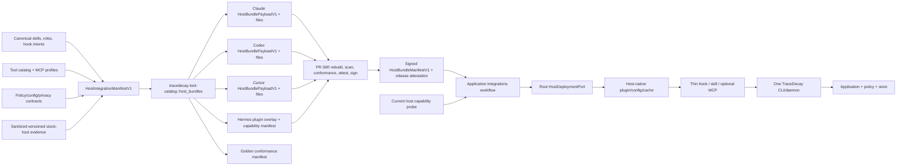
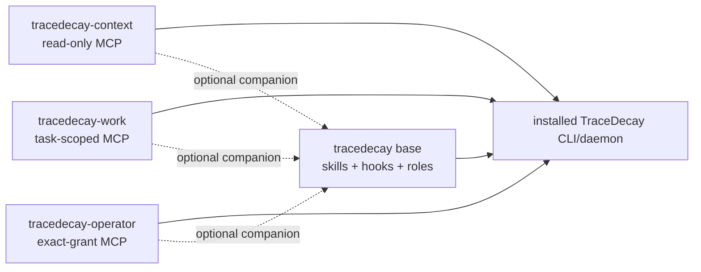
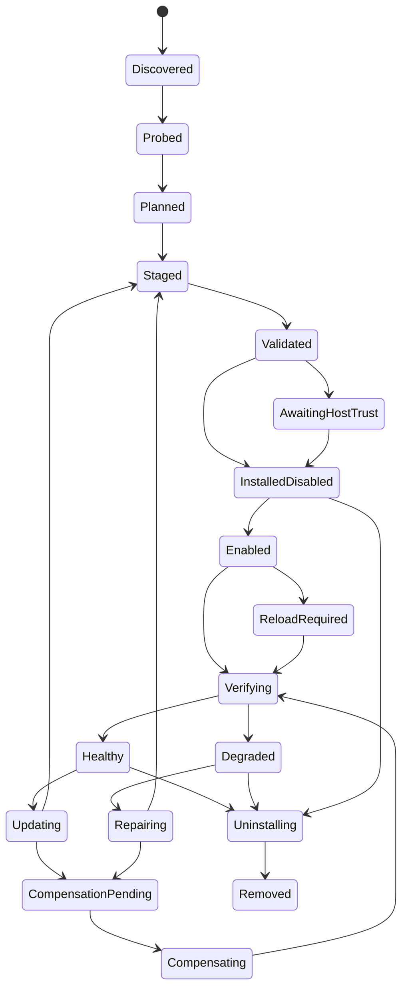
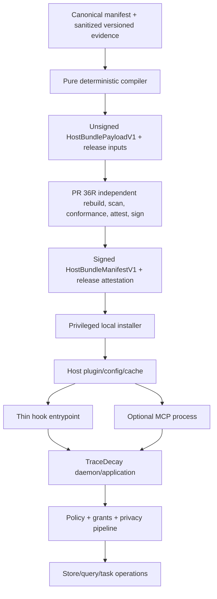
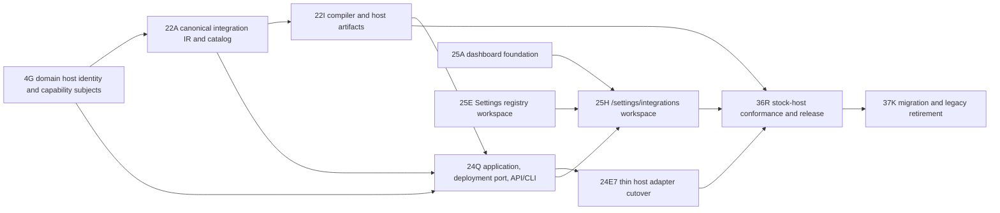

# TraceDecay V2 Cross-Host Agent and Plugin Bundle Plan

**Plan 32 integration:** project stable native workflow definition/version bindings, skills/commands, lifecycle hooks, and compact CLI/MCP/API fallbacks into Codex, Claude Code, Cursor, and Hermes from the canonical catalog/host manifest. Host bundles never copy workflow source, compiler/runtime semantics, grants, or state; unsupported steering boundaries remain explicit capability differences, and provider-native workflows remain observations unless explicitly imported.

**Repo-local execution-skill rule:** `.codex/skills/executing-tracedecay-v2-plan` is the sole implementation/source tree. Claude Code may discover it through a small `.claude/.../SKILL.md` wrapper that reads the canonical skill completely and invokes only canonical scripts; the wrapper contains no copied procedure, scripts, fixtures, tests, generated mirror, or fallback. Claude and Codex entrypoints must receive the same explicit execution-state/graph path and canonical bootstrap-manifest resolution, so both observe one completion ledger, tracking state, and immutable receipt set. Host bundle/cache/data directories cannot contain host-specific execution manifests, ledgers, state, receipts, or output mirrors. Cross-host generation must preserve and drift-test this single-owner, shared-state delegation pattern.

> **Accepted-base refresh delta (audit 29 / packet 30):** preserve current host
> asymmetries as fixtures until deliberate migration; bind the compact Codex
> parent-owns-writes token and the hook trust-state ownership decision to PR 24Q
> and PR 36R, with FM-169/FM-170 as gates. This owner plan, not packet 30, is the
> standing authority for the accepted obligation.

> **Status:** implementation-grade architecture and delivery plan; no production code is changed by this document.
>
> **Product rule:** TraceDecay ships one host-neutral capability and workflow definition, then deterministically projects it into host-native Claude Code, Codex, Cursor, and Hermes integrations. A host package or Hermes plugin overlay is a projection over the same catalog, hooks, skills, agents, CLI, API, task/executor, memory, and authorization system; it is never a second product definition.

**Goal:** Make TraceDecay the durable intelligence and coordination fabric behind Claude Code, Codex, Cursor, and Hermes: preserve exact host-native activity, recover intent and context, provide relevant memory and tools, coordinate and execute bounded work across hosts, carry evidence-backed handoffs between them, and improve from measured outcomes without copying workflows four times, flattening host strengths, flooding model context, exposing operator authority, or requiring MCP.

**Architecture:** Plan 08's existing `tracedecay-tool-catalog` and canonical `HostIntegrationManifestV1` remain the semantic source of truth. Its pure `host_bundles` module validates and deterministically compiles Claude Code, Codex, Cursor, and Hermes release projections; Hermes lowering targets its plugin-native overlay rather than pretending it has another host's marketplace schema. Plan 09 owns `HostDeploymentPort`; root-private `v2::host_deploy` implements it using plan 12's host-effect mechanics for probing, config merge, install, update, repair, owned-state compensation, and removal. This preserves plan 19's at-most-12-package ceiling: no `tracedecay-host-bundles` crate or package is added. Plans 07, 17, 18, 20, 21, and 24 continue to own hook runtime, public API, privacy, configuration, surface rendering, and task execution. Every generated host artifact calls the same separately installed TraceDecay binary/daemon and pins the same integration-manifest and catalog digests.

**Decision:** `HostIntegrationManifestV1` is extended, never renamed or duplicated. `HostBundleManifestV1` means only a signed generated per-host/per-package release artifact manifest: it references the canonical integration-manifest/catalog digests and carries files, omissions, compatibility, provenance, and conformance receipts, but no second workflow, permission, hook, task, or tool semantics. There is one semantic manifest, one compiler path, one thin `tracedecay` integration binary launched by hosts, one private `tracedecayd` authority binary managed by the OS service manager, one catalog, one authorization path, and one install state machine.

The base package may carry both executables, but its generated launch manifest is closed: shells, hooks, skills, and every MCP registration invoke only `tracedecay`; service definitions and the privileged maintenance/probe lifecycle invoke only `tracedecayd` or the packaged probe helper. Host overlays cannot swap those targets, expose a daemon subcommand, or grant a host process the service identity.

---

## 0. Contract lock

1. Plan 08's `HostIntegrationManifestV1` is the only semantic source for shipped skills, workflow bindings, specialist roles, hook intents, lifecycle/capture mappings, context-delivery modes, executor capabilities, MCP facade registrations, install components, host overlays, compatibility requirements, and conformance cases. Generated `HostBundleManifestV1` artifacts and Hermes plugin overlays reference it and cannot restate those semantics.
2. Host manifests, skill directories, agent definitions, hook JSON, MCP config, marketplace entries, app metadata, screenshots, and install copy are generated projections. Hand-editing generated output fails CI.
3. The separately installed `tracedecay` CLI and daemon are the executable product. No plugin package embeds a second TraceDecay binary, database engine, scheduler, tool registry, or copy of application logic.
4. The universal baseline is TraceDecay skills plus the generated CLI. A host without MCP, with MCP disabled, or with MCP temporarily broken retains every semantic capability through CLI and documented HTTP/API fallback recipes.
5. MCP is optional and split into exactly three logical registrations from plan 08: `tracedecay-context`, `tracedecay-work`, and `tracedecay-operator`.
6. The package catalog exposes a base `tracedecay` integration plus independently installable `tracedecay-context`, `tracedecay-work`, and `tracedecay-operator` companion integrations. All companions launch the thin `tracedecay` integration binary and connect to the same private `tracedecayd` authority/catalog; none launches the daemon directly or copies skills, agents, hooks, or domain code.
7. `tracedecay-context` is the only MCP companion eligible for a recommended ordinary-agent install. `tracedecay-work` requires explicit task-worker/orchestrator intent. `tracedecay-operator` is never installed, enabled, inherited, or advertised by default.
8. Every MCP connection pins one registration, one exact `McpSurfaceProfileV1`, one catalog digest, one protocol digest, and one grant ceiling. A host config, prompt, skill, agent, or broader credential cannot widen it in place.
9. Progressive tool-schema disclosure is an optional client optimization, not an MCP protocol guarantee and not a plugin guarantee. Every profile passes eager-client context, routing, security, and latency tests.
10. Skill progressive disclosure is modeled per host from documented behavior. An undocumented host behavior is `Unknown`, never `Supported` by inference.
11. One workflow has one primary discovery surface. A workflow cannot simultaneously be a skill, legacy command, MCP prompt, always-on rule, agent, and generic tool alias.
12. Reusable procedure or guidance belongs in a skill. Deterministic data/action belongs in a cataloged CLI/HTTP/MCP binding. Automatic lifecycle capture belongs in a hook. A focused isolated worker belongs in an agent definition. Large addressable content belongs behind a retrieval anchor or MCP resource link.
13. Claude `commands/` and Cursor commands are compatibility or explicit-user affordances only. New workflows use skills. Codex receives no invented plugin command directory.
14. MCP prompts are not generated for a workflow already represented by a skill. Host-native command menus may list the skill, but they do not mint a second workflow identity.
15. Canonical skill source uses only the portable Agent Skills core shared by Claude, Codex, Cursor, and Hermes. Host-only frontmatter and invocation behavior are emitted by a reviewed host overlay.
16. Canonical role definitions describe purpose, required capabilities, safety class, context policy, output contract, and host fallbacks. Host agent files are projections where packaging is documented, or separately installed host configuration where packaging is not documented.
17. The initial bundle contains two or three focused specialist roles, not a catalogue of near-duplicate personas. Adding a role requires a distinct eval-proven task boundary and context/cost justification.
18. Hook packages contain declarative event wiring only. Every hook invokes one audited TraceDecay host-event entry point; host-specific shell scripts do not reimplement parsing, redaction, hints, ingestion, or retries.
19. Hook input is untrusted. It is schema-validated, bounded, canonicalized, and redacted before any durable store, index, analytics, model, log, or diagnostic sink.
20. Hook events carry stable host, session/thread, turn, subagent, tool-call, worktree, and plugin-version correlation when the host exposes them. Missing fields remain explicit; adapters never infer identity from CWD or transcript filename alone.
21. Duplicate or overlapping hook events are normal. Canonical event fingerprints and idempotency make replay, host retries, parent/subagent overlap, plugin reload, and cloud/local overlap safe.
22. Informational ingestion and hints fail open at the host boundary. A separately cataloged destructive guardrail may fail closed only when that host documents the behavior, policy enables it, and a stock-host conformance test proves the exact event path.
23. Plugin, hook, MCP, agent, and CLI permissions are defense in depth, not authorization. TraceDecay application policy and grant checks remain authoritative for every read and mutation.
24. A read-only/research agent never receives the operator grant ceiling. On a host that cannot prevent MCP inheritance, the installer blocks the incompatible combination or requires a separate session/profile.
25. Plugin configuration stores public endpoints, feature choices, and opaque credential references only. Secrets use the host's protected mechanism or TraceDecay credential binding; they never enter plugin manifests, skill files, hook output, MCP arguments, snapshots, or the repository.
26. Every generated path is relative, contained, normalized, and collision-checked. The installer never follows an untrusted symlink, overwrites foreign content, or deletes a path it cannot prove it owns.
27. Install, update, repair, and uninstall are resumable cataloged operations with expected versions, ownership digests, atomic replacement, crash recovery, and content-free receipts. Rollback is an internal compensation transition, not another public use case.
28. Compensation restores only a signed prior TraceDecay-owned artifact/config snapshot. It never rewinds user settings, host application state, databases, agent transcripts, or foreign plugin files.
29. No host's marketplace/cache/update model is generalized into another host. `HostDifferenceLedgerV1` records documented, absent, version-gated, experimental, and unknown behavior separately.
30. A plugin version is not the protocol version. Bundle SemVer, source commit, adapter version, host capability probe, binary version, catalog digest, hook schema, and MCP protocol digest are independently recorded and checked.
31. An older or incompatible running host integration fails before store or mutation use with one exact upgrade/reload/reinstall action. There is no silent V1 fallback, dual tool namespace, or best-effort use of a stale hook.
32. Multi-root and multi-worktree scope is an explicit set of resolved repository/project/checkout/worktree identities. No host adapter reduces it to the first root or current directory.
33. Host cloud, desktop, IDE, and CLI surfaces are separate conformance targets. Passing one target never establishes parity for another.
34. Generated output is reproducible: sorted entries, normalized UTF-8/LF, fixed archive metadata, canonical JSON/TOML/YAML rendering, deterministic file modes, and no build-machine paths or timestamps.
35. The signed release manifest and attestation bind source, component, license, checksum, signature, compatibility, secret-scan, rebuild, provenance, and stock-host-conformance evidence. Installation refuses an invalid or unsupported artifact before changing host state.
36. Plugin discovery text is a bounded routing index, not product documentation. Descriptions are concise, discriminative, and front-load the use case so truncation or inventory pressure degrades gracefully.
37. There is no always-on “TraceDecay catalog” rule that dumps all tools or skills into context. Discovery uses compact skill metadata, host-native plugin inventory, generated CLI help, and optional deferred tool search.
38. Every omitted component has a typed reason: unsupported host, unsupported version, policy disabled, incompatible scope, missing binary, trust pending, MCP profile omitted, or evidence unknown.
39. The dashboard and Settings show the same resolved manifest, install state, trust state, facade selection, version/digest, compatibility, and doctor findings returned by CLI/HTTP/SDK. They do not inspect host files independently.
40. Completion requires stock-host conformance on the supported Claude Code, Codex, Cursor, and Hermes matrices plus a documented downgrade for every unsupported surface.
41. The Rust workspace remains at or below plan 19's 12-package ceiling. Pure host bundle generation lives in `tracedecay-tool-catalog::host_bundles`; root-private `v2::host_deploy` owns host effects only. A future crate requires the plan-19 package-admission ADR, a merger alternative, and another package retirement.
42. Install topology is a component set, not one mutually exclusive MCP choice: optional MCP-free core plus zero to three independently selected `McpFacade { registration, profile }` companions. A connection still pins exactly one registration/profile. Headless MCP-only deployment omits core; it does not create another implementation.
43. `HostProfileId` is only a host installation/configuration target. It never selects or creates a TraceDecay user profile, Brain, database root, memory partition, or authorization domain.
44. Every Hermes named profile, regardless of `HERMES_HOME` or profile count, binds the same user-global TraceDecay `ProfileId`, daemon, catalog, and stores used by Codex, Claude, and Cursor. Per-profile deployment/trust receipts remain distinct; data ownership does not.
45. Host runtime context is invocation/session scoped. Logical workspace roots and explicit projectless state come from the provider event; process CWD, first/last session workspace, cached project, and host-profile directory cannot route memory, LCM, or retrieval.
46. Every generated host integration, including each Hermes named-profile deployment, stamps its exact TraceDecay component version on every TraceDecay-owned log/diagnostic event. Host application version and connected daemon/collector version are separate fields; forwarding cannot overwrite the originating TraceDecay version.
47. A generated host adapter carries immutable installed/configured `HostProfileRef` ownership separately from per-invocation declared scope/workspace. Ambient `HOME`/`HERMES_HOME`, provider helpers, process CWD, and previous-session state can select neither that owner nor a TraceDecay profile/project. Single Profile-root activity dispatch, optionally filtered by Profile/ZeroProject declared ownership, sends no project locator and runs through the central application resolver; generated Python does not own registration or scope policy.
48. Route behavior is catalog-generated by use-case class: registry discovery is unscoped, explicit cross-project selectors are read-only unless a named mutation authorizes them, project-required calls fail on host-home/unregistered context, and single-root profile/user fact/LCM/message calls bypass project routing. Migration scalar user/profile aliases mixed with compatibility project fields fail before execution; canonical authorized Profile+Project reads use explicit federation. No host adapter maintains a tool-name allowlist.
49. Cross-host continuity is explicit, never inferred from shared CWD or similar prompt text. A handoff binds the originating host/session/Thread/Turn, target host capability snapshot, task or user intent, exact scope, retrieval anchors, relevant decisions, unresolved questions, artifacts, budgets, privacy grants, and source watermarks. The receiver imports a bounded context packet, not the source transcript or hidden reasoning.
50. TraceDecay distinguishes five host roles that may coexist: **observer** (capture exact activity), **context provider** (retrieve and suggest), **knowledge steward** (curate memory/skills), **executor** (perform a leased task), and **operator surface** (configure/repair). Installing one role never grants another.
51. Host-native strengths are additive. Claude's richer lifecycle/delegation, Codex's app-server and external-agent paths, Cursor's IDE/workspace/cloud surfaces, and Hermes's gateway, provider routing, durable jobs, delegation, and messaging delivery remain typed capabilities. The canonical contract defines shared semantics and fallbacks; it does not reduce every host to the weakest surface.
52. TraceDecay owns durable cross-host knowledge, task/evidence lineage, and policy. Each host owns its live conversation loop, model/provider selection, UI/transport identity, native approvals, and ephemeral context. Host transport—including Hermes gateway channel—never selects memory/project scope.

## 1. Product objective and non-goals

### 1.1 Product objective

After this plan is complete:

- a user installs the TraceDecay base integration once and receives the same named workflows, safety language, retrieval anchors, output contracts, and help concepts in Claude Code, Codex, Cursor, and Hermes;
- Hermes participates as a first-class host without becoming a separate TraceDecay profile or data plane: CLI, gateway/chat surfaces, background jobs, delegation, and provider/model routes all resolve through the same user Brain and exact project scopes as Claude, Codex, and Cursor;
- an agent can discover “use TraceDecay code context,” “search prior sessions,” “inspect memories,” “review hook hints,” or “work an assigned task” without knowing which transport happens to be available;
- the skill selects the cheapest legal binding at runtime: native host integration when available, generated CLI by default, HTTP/API when configured, and MCP only when explicitly installed and healthy;
- an ordinary install does not start or advertise operator tools;
- a user can enable only the read-only context facade, add the task-work facade for orchestration, or explicitly add the operator/lab facade without duplicating the daemon or catalog;
- Claude, Codex, and Cursor hook events become one canonical host-event envelope and one idempotent ingestion/hint path;
- specialist agents are focused, permission-bounded, aware of the same retrieval IDs and task/context packet contracts, and never rely on host-specific hidden behavior;
- work can begin in one host and continue in another through an explicit privacy-filtered handoff packet that preserves intent, evidence, task/lease state, decisions, artifacts, and unresolved questions without copying whole transcripts;
- TraceDecay can observe what each host saw and did, explain what context or memory it supplied, measure whether the host used it, correlate work with code/Git/tasks/outcomes, and revise retrieval, hints, skills, and routing from that evidence;
- the Settings UI explains what is installed, what is active, what is trusted, what is missing, why a component was omitted, and which restart/reload action is required;
- a release rebuild produces byte-identical host packages from the same source and proves their semantic parity before publication;
- a later host can be added by supplying a capability evidence record, pure compiler adapter, and conformance suite rather than copying installer/runtime code.

### 1.2 Non-goals

- No attempt to make Claude Code, Codex, and Cursor expose identical UI, config, agent, hook, marketplace, cache, or permission semantics.
- No attempt to make Hermes gateway chats, scheduled jobs, background agents, or model/provider routes pretend to be IDE plugin sessions.
- No generic lowest-common-denominator plugin format.
- No plugin-embedded TraceDecay binary, SQLite database, model runtime, task scheduler, or dashboard server.
- No requirement that MCP be installed for skills, hooks, CLI help, session search, task work, or host diagnostics.
- No assumption that MCP `tools/list` pagination, `list_changed`, plugin installation, or host tool search provides model-side progressive disclosure.
- No generic “invoke any TraceDecay operation” MCP tool or CLI god command.
- No generated host component absent from official documentation unless it is explicitly classified as an installer-owned compatibility projection and tested on stock clients.
- No automatic mutation of a user's personal agent, rule, skill, command, hook, MCP, or plugin files without ownership proof and an installation receipt.
- No skill that silently deploys, publishes, merges, deletes, installs operator access, changes grants, or edits host security configuration.
- No bundled prompt requesting hidden chain-of-thought. Roles and workflows operate on provider-exposed messages, summaries, decisions, tools, artifacts, and retrieval anchors.
- No plugin surface for item-by-item curation approval. Memory/skill evolution remains autonomous under plans 09 and 20 and is observed through ordinary TraceDecay views.
- No replacement for each host's marketplace or organization policy. TraceDecay compiles to those systems and reports their limitations.

## 2. Evidence, guarantees, and current failure inventory

### 2.1 Evidence classification

Every host matrix entry uses one classification:

| Code | Meaning | Compiler behavior |
|---|---|---|
| `D` | Documented by the current official host documentation or pinned official repository | May generate the feature when the probed version satisfies the documented requirement and stock-host conformance passes. |
| `V` | Documented but version-gated, experimental, rollout-dependent, or surface-dependent | Generate only behind an explicit capability probe and compatibility rule; provide a downgrade. |
| `A` | Explicitly absent from the documented package/schema/surface | Do not generate it; use the documented external configuration or fallback. |
| `U` | Undocumented or not established by bounded official research | Treat as unsupported. Never infer from another host, an issue, or a local implementation. |
| `I` | TraceDecay design inference based on documented constraints | Record the evidence and rationale in `HostDifferenceLedgerV1`; conformance is mandatory. |

Official documentation establishes what a host says it supports. A passing local experiment establishes only the exact probed build/surface. Neither upgrades an undocumented behavior into a portable contract.

### 2.2 Dated primary-source table

All sources below were accessed for this design on **2026-07-10 UTC**. Source content must be pinned or re-fetched into a release research manifest before implementation; URLs alone are discovery locators, not immutable evidence.

| Host/topic | Official primary source | Design use |
|---|---|---|
| Claude plugin authoring | [Create plugins](https://code.claude.com/docs/en/plugins) | Plugin root layout, skills-first guidance, testing, settings, reload, distribution. |
| Claude plugin schema | [Plugins reference](https://code.claude.com/docs/en/plugins-reference) | Manifest fields, component paths, agents, hooks, MCP, user config, cache, version behavior. |
| Claude installation | [Discover plugins](https://code.claude.com/docs/en/discover-plugins) | Scopes, enable/disable/uninstall, trust warning, reload behavior, security. |
| Claude marketplace | [Plugin marketplaces](https://code.claude.com/docs/en/plugin-marketplaces) | Catalog schema, strict mode, source pinning, managed restrictions, version resolution. |
| Claude skills/commands | [Extend Claude with skills](https://code.claude.com/docs/en/slash-commands) | Command-to-skill migration, skill progressive disclosure, invocation control, supporting files, evals. |
| Claude subagents | [Create custom subagents](https://code.claude.com/docs/en/sub-agents) | Agent scopes, packaged-agent restrictions, skills, memory, worktrees, delegation and nesting. |
| Claude hooks | [Hooks reference](https://code.claude.com/docs/en/hooks) plus Markdown snapshot digest recorded below | Independent 30-event oracle, five handler types, sources/frontmatter, matchers/`if`, decisions, parallel dedupe, sync/async/rewake, exec/shell/platform, managed controls, privacy/security, and min-version evidence. |
| Claude MCP | [Connect Claude Code to tools via MCP](https://code.claude.com/docs/en/mcp) | Plugin MCP lifecycle, tool naming, resources, output bounds, Tool Search conditions and fallback. |
| Claude permissions | [Configure permissions](https://code.claude.com/docs/en/permissions) | Deny/ask/allow precedence, MCP/agent rules, hook interaction, sandbox limits. |
| Claude config | [Claude Code settings](https://code.claude.com/docs/en/configuration) | User/project/local/managed scopes, plugin enablement, organization restrictions. |
| Claude product map | [Extend Claude Code](https://code.claude.com/docs/en/features-overview) | Choosing skills, hooks, subagents, MCP, and plugins by purpose. |
| Claude reference implementation | [anthropics/claude-code](https://github.com/anthropics/claude-code) and [anthropics/claude-plugins-official](https://github.com/anthropics/claude-plugins-official) | Current official examples, changelog, curated marketplace patterns. |
| Codex plugin authoring | [Build plugins](https://developers.openai.com/codex/plugins/build) | `.codex-plugin/plugin.json`, component layout, marketplace/cache/version, MCP and hook packaging. |
| Codex skills | [Build skills](https://developers.openai.com/codex/skills) | Portable skill format, documented context inventory budget, truncation/omission, activation. |
| Codex hooks | [Hooks](https://developers.openai.com/codex/hooks) | Hash-bound trust, events, current command-only handler support, plugin variables, schema limits. |
| Codex agents | [Subagents](https://developers.openai.com/codex/subagents) | External `.codex/agents/*.toml` and `~/.codex/agents/*.toml` config, evolving format, concurrency/depth. |
| Codex config | [Configuration reference](https://developers.openai.com/codex/config-reference) and [advanced configuration](https://developers.openai.com/codex/config-advanced) | Plugin/MCP/tool policy, config layers, strict parsing, security and runtime settings. |
| Codex commands | [Developer commands](https://developers.openai.com/codex/cli/slash-commands) | Built-in slash commands, skill discovery, custom prompt namespace, strict config and diagnostics. |
| Cursor plugin schema | [Plugin reference](https://cursor.com/docs/reference/plugins.md) and [Plugins](https://cursor.com/docs/plugins.md) | `.cursor-plugin/plugin.json`, default directories, explicit paths, install/package limitations. |
| Cursor skills/rules | [Skills](https://cursor.com/docs/skills.md) and [Rules](https://cursor.com/docs/rules.md) | Skill progressive disclosure versus always-applicable rules and scope behavior. |
| Cursor agents | [Subagents](https://cursor.com/docs/subagents.md) | Bundled agents, `readonly`, MCP inheritance, child/grandchild limits. |
| Cursor hooks | [Hooks](https://cursor.com/docs/hooks.md) and [third-party hooks](https://cursor.com/docs/reference/third-party-hooks.md) | Events, fail-open/`failClosed`, agent/subagent/MCP/compaction/workspace behavior, surface gaps. |
| Cursor MCP | [MCP](https://cursor.com/docs/mcp.md) | MCP configuration and tool exposure; no documented schema deferral guarantee. |
| Cursor CLI | [Using the CLI](https://cursor.com/docs/cli/using.md), [slash commands](https://cursor.com/docs/cli/reference/slash-commands.md), and [permissions](https://cursor.com/docs/cli/reference/permissions.md) | CLI/app differences, commands, permissions, multi-surface capability constraints. |
| Cursor marketplace security | [Marketplace security](https://cursor.com/help/security-and-privacy/marketplace-security.md) | Review, trust, publishing, and executable separation assumptions. |
| Cursor pinned prior art | [cursor/plugins@0dda29e](https://github.com/cursor/plugins/tree/0dda29e839d15464a137af9935665a5a47ee09b8) and [cursor/plugin-template@4621607](https://github.com/cursor/plugin-template/tree/46216072ac5750f782f95bb325b4d12b7c3ae9c9) | Concrete official layouts and patterns, including `orchestrate`, `continual-learning`, `agent-compatibility`, and `cli-for-agent`. |
| Hermes product/docs | [Hermes Agent documentation](https://hermes-agent.nousresearch.com/docs/) and [NousResearch/hermes-agent](https://github.com/NousResearch/hermes-agent) | Authoritative CLI, plugin, toolset, skill, memory-provider, session, gateway, delegation, cron/webhook, profile, provider-routing, and extension behavior. Pin exact docs/source commit before implementation. |
| Hermes messaging/gateway | [Messaging integrations](https://hermes-agent.nousresearch.com/docs/user-guide/messaging/) | Transport/session/thread delivery capabilities and the boundary that transport identity does not select TraceDecay memory scope. |
| Hermes task execution | [Kanban](https://hermes-agent.nousresearch.com/docs/user-guide/features/kanban) and [worker lanes](https://hermes-agent.nousresearch.com/docs/user-guide/features/kanban-worker-lanes) | Proven durable worker, routing, worktree, run, heartbeat, retry, notification, and lane behavior consumed as executor/evidence input rather than a second task authority. |

### 2.3 Decisive source findings

#### Claude Code

- `D` Plugin skills are namespaced and auto-discovered. Skills are the new authoring surface; `commands/` remains compatible but is not preferred.
- `D` A regular skill contributes its description to initial context and loads its full body only when invoked. Supporting files are referenced for later reads. Invoked content remains in the conversation.
- `D` Claude Tool Search defers MCP schemas by default on supported configurations, but `ENABLE_TOOL_SEARCH=false`, unsupported models, certain third-party endpoints, and some cloud configurations load tools eagerly or cannot use Tool Search.
- `D` Plugin MCP servers start automatically with the plugin and are managed through plugin enablement, not ordinary `/mcp` removal.
- `D` The current hook reference has an independent 30-event contract spanning session/setup/instructions, prompt expansion/display, tool/permission/batch, agent/task/team, config/file/worktree, compaction, MCP elicitation, stop failure, and session end lifecycles.
- `D` Claude supports five handler types: command, HTTP, connected MCP tool, prompt, and experimental agent. Event/type support, matcher/`if`, output, exit, timeout, and async behavior are not interchangeable.
- `D` Plugin agents can be packaged and namespaced. Current hook reference permits hooks in skill and agent frontmatter while active and converts agent `Stop` to `SubagentStop`; the compiler gates this against the exact stock version rather than retaining the older ignored-field assumption. `mcpServers` and `permissionMode` remain separately capability-probed.
- `D` Command hooks run with the user's full privileges. Generated TraceDecay hooks use synchronous exec form with closed args; inputs are sanitized, paths contained, and no shell, environment, HTTP, MCP, prompt, or agent handler becomes an authority boundary.
- `D` All matching handlers start in parallel; identical command+args and HTTP URL handlers are host-deduped, while repeated async firings are not. Configured definitions, deduped handlers, runs, and delivered outcomes need separate accounting.
- `D` Sources include user/project/local/managed settings, plugin JSON, skill/agent frontmatter, and observed session/built-in definitions. `/hooks` is read-only; `disableAllHooks` has managed precedence, and `allowManagedHooksOnly` exempts plugins force-enabled by managed policy.
- `D` Matcher semantics are versioned exact/list or unanchored JavaScript regex, with event-specific subjects/no-matcher behavior and literal FileChanged watches. Handler `if` is best-effort permission syntax and fails open on Bash parse uncertainty.
- `D` The official Markdown snapshot retrieved 2026-07-11 has SHA-256 `e94e721874efc802248a7808e35ac917306088c5eaada2aa21e1def3fecc32e1`; PR 36R must refresh and anchor it rather than treating this planning hash as permanent support truth.
- `D` Plugin `settings.json` accepts only a narrow documented set; `userConfig` is the plugin option mechanism. Plugin skills are not controlled by ordinary `skillOverrides`.
- `D` Cache/version resolution and marketplace scope are Claude-specific. Explicit manifest version must be bumped or updates can be masked.

#### Codex

- `D` A plugin root may contain `.codex-plugin/plugin.json`, `skills/`, `hooks/hooks.json`, `.mcp.json`, `.app.json`, and assets.
- `A` The plugin schema does not document packaged custom agent files. Local custom agents are external TOML configuration under `.codex/agents/` or `~/.codex/agents/`, and the documentation says the format may evolve.
- `D` Codex skill inventory begins with name, description, and path; full `SKILL.md` loads on selection. The initial list is capped at 2% of context or 8,000 characters when context is unknown, and skills may be shortened or omitted.
- `D` Enabled plugin MCP servers can be enabled/disabled and tool-allowlisted through `plugins.<plugin>.mcp_servers.<server>` configuration.
- `D` Plugin hooks require trust for the exact definition hash. A changed hook is skipped until re-reviewed. `PLUGIN_ROOT`/`PLUGIN_DATA` and Claude compatibility variables are available.
- `D` Current hook execution supports command handlers; parsed prompt/agent/async forms are not a runtime guarantee.
- `D` The current Codex hook contract has exactly ten events: `SessionStart`, `SubagentStart`, `PreToolUse`, `PermissionRequest`, `PostToolUse`, `PreCompact`, `PostCompact`, `UserPromptSubmit`, `SubagentStop`, and `Stop`. `PostToolUse` also covers Bash nonzero exit; there is no separate current `PostToolUseFailure` event.
- `D` User/repository `hooks.json`, inline `[hooks]`, enabled plugin hooks, session sources, and system/cloud/MDM/`requirements.toml` managed sources compose additively. Higher config precedence does not replace lower hooks. Repository sources require project trust; same-layer JSON+inline merges with a startup warning.
- `D` Codex launches matching command handlers concurrently. Matchers apply only to documented subjects; `UserPromptSubmit`/`Stop` ignore them. `apply_patch` also matches `Edit|Write`. Hook outputs and continuation precedence are event-specific, and pre-tool interception remains incomplete for unified exec/WebSearch/other paths.
- `D` `[features].hooks` is canonical, `codex_hooks` is deprecated, managed policy can force enable/disable or managed-only mode, and managed hooks are trusted/non-disableable. `/hooks` owns user review/disable; the dangerous one-off bypass is not persisted trust.
- `D` Plugins have a Codex-specific marketplace, install cache, version directory, enable state, and app/desktop lifecycle.
- `A` There is no documented plugin `commands/` directory. Enabled skills already participate in skill/slash discovery; custom prompts use a distinct `/prompts:<name>` concept and are not generated for TraceDecay.

#### Cursor

- `D` `.cursor-plugin/plugin.json` can bundle rules, skills, agents, commands, hooks, and MCP server configuration through default directories or explicit manifest paths.
- `D` Skills have documented progressive disclosure. `U` Enabled MCP schema deferral is not documented; every generated Cursor MCP surface is eager-safe.
- `D` Commands are legacy/explicit UX and Cursor provides `/migrate-to-skills`. New TraceDecay workflow definitions use skills.
- `D` Cursor subagents inherit parent MCP tools and can be `readonly`, but there is no documented per-agent MCP allowlist. Direct children may spawn children; grandchildren cannot.
- `D` Hook events cover agent, subagent, MCP, compaction, and workspace lifecycle. Overlapping events can double-ingest. Hooks fail open unless `failClosed` is configured; cloud omits several local events.
- `D` `workspace_roots` is a set. Adapters must preserve all roots and resolve each through plan 16.
- `A` Cursor plugins cannot ship the TraceDecay executable. Installation and binary lifecycle are separate.
- `U` No documented minimum host version, guaranteed namespace isolation, component-selective install, reproducible pin/rollback, or full IDE/CLI/cloud parity exists.
- `D` Official prior art validates focused orchestration, continual-learning, compatibility, and CLI-for-agent patterns, but none establishes TraceDecay-specific authorization or cross-host parity.

#### Hermes

- `D` Hermes is an open plugin/tool host with CLI, API/gateway messaging surfaces, sessions, skills, native MCP client/server support, pluggable memory-provider hooks, delegation, provider/model routing, durable cron/webhooks/background work, and Kanban worker lanes. These are independent capability cells, not one “Hermes supported” boolean.
- `D` Hermes profiles isolate Hermes configuration/session UX, but TraceDecay integration binds every named Hermes profile to the same user TraceDecay profile, daemon, catalog, and project shards. `HERMES_HOME`, gateway platform, chat ID, and profile directory are never TraceDecay storage or scope selectors.
- `D` Hermes owns live host sessions, transport identity, model/provider choice, runtime workspace, and native approval/tool lifecycle. TraceDecay owns durable user/project memory, LCM/session ingestion, curation, managed-skill overlay, canonical tasks/evidence, and cross-host policy.
- `D` Hermes memory-provider lifecycle can supply bounded prompt blocks/prefetch and observe turn/session/compression/memory/delegation boundaries. TraceDecay records delivery receipts and useful silence; it does not mirror facts into a second profile-local authority.
- `D` Delegation is isolated and bounded but not durable across parent termination. Durable TraceDecay tasks use plan-24 leases/attempts and may lower to Hermes background, cron, gateway, or worker-lane execution only through a capability-probed adapter and terminal receipt.
- `D` Gateway delivery is an explicit side effect to a resolved audience/channel/thread. Delivery success neither establishes task completion nor changes user/project memory scope.
- `I` Generated Hermes integration uses its plugin-native overlay and toolsets instead of pretending to be a Claude/Codex/Cursor marketplace package. PR 36R must pin the exact Hermes source/docs version and pass stock CLI/gateway/background/delegation/task-worker conformance before release support is claimed.

### 2.4 Current TraceDecay failure inventory

| Failure | User/implementation impact | V2 response |
|---|---|---|
| Fifteen integrations are currently registered in `src/agents/mod.rs`; nine MCP installer functions contain duplicated mechanical behavior. | Inventory mechanics drift as hosts land; exact Cline/Roo duplication already exists. | Keep the generated fifteen-integration drift check current, then use one compiler plus one root effect adapter. Host descriptors contain only irreducible schema/lifecycle behavior. |
| Skills, plugin manifests, installed cache versions, root help, MCP definition counts, and binaries can disagree. | An agent sees stale or missing workflows; a skill path may reference an older cached version. | Signed resolved artifact manifest, cache/version probe, catalog/binary handshake, and doctor parity gate. |
| A prior task explicitly named the TraceDecay CLI skill, yet stale `0.0.45` paths had to fall back to `0.0.53`. | Host metadata is not a reliable pointer and users cannot tell which package is active. | Never persist cache paths as identity. Resolve current plugin/component by manifest ID/version/digest and expose repair. |
| The agent sometimes reaches for grep/shell instead of TraceDecay code/git/session tools. | Discovery text, skill activation, fallback, and host integration health are not strong enough. | Trigger evals, compact discriminative descriptions, one primary workflow surface, CLI fallback, health-aware hint routing, and underuse telemetry. |
| “Plugin installed” is conflated with enabled, trusted, MCP-connected, authenticated, current, and usable. | Diagnostics falsely report success while hooks or tools remain unavailable. | Typed component state and doctor checks for every layer. |
| MCP inventories are large and some designs assume host-side deferral. | Eager hosts receive schema floods; relevant tools rank poorly; prompt cache churns. | Three reviewed profiles with hard counts/tokens, eager-client conformance, concise server instructions, no generic tool. |
| CLI, MCP, skill, command, and prompt surfaces can describe the same operation differently. | Agents choose redundant routes and receive inconsistent output. | `UseCaseId`-based generation and one primary discovery surface. |
| Hook integrations use host-specific commands and overlapping lifecycle points. | Duplicate events, repeated hints, inconsistent correlations, and unnecessary latency. | One canonical envelope, deterministic fingerprint, materiality/dedupe/cooldown, and host fixture matrix. |
| Host trust and permission controls are mistaken for backend authorization. | A broadly enabled tool or inherited MCP surface can expose data/effects beyond an agent's role. | Server-side grants, profile ceilings, application reauthorization, and incompatible-combination blocks. |
| Cursor research agents inherit all parent MCP tools. | Enabling operator MCP can leak privileged capability into read-only subagents. | Never permit operator facade in a Cursor session allowed to spawn research agents; require separate session/profile until host capability changes. |
| Codex plugins do not document packaged agent files. | Copying Claude/Cursor `agents/` into a Codex plugin produces an unsupported bundle. | Separate generated Codex agent configuration, ownership receipts, and explicit enablement; plugin remains valid without it. |
| Claude plugin agents ignore `hooks`, `mcpServers`, and `permissionMode`. | A generated agent can silently have broader/different behavior than its canonical role requests. | Compiler rejects unsupported fields and lowers restrictions to documented tool lists, host config, session separation, and server grants. |
| Cursor and Claude command directories tempt workflow duplication; Codex has no documented equivalent. | Names, invocation, and maintenance diverge. | Skills own new workflows; compatibility commands are bounded migration artifacts only. |
| Host-specific version/cache/update rules are not represented in one state machine. | Updates can leave old processes, cache artifacts, hooks, or configs active. | Versioned deployment operation with staged validation, atomic owned-file swap, restart/reload, verification, and safe compensation. |
| Current host scope often begins from CWD or a single workspace root. | Multi-repo/worktree sessions miss related projects and duplicate work. | Explicit `workspace_roots` set plus plan-16 project/worktree resolution and coverage report. |
| PR #441 exposed greeting/code regex gating, process-CWD session routing, selector-dropping response-handle dereference, context-engine clone state, and partial named-profile deployment. | General chat is hijacked, concurrent sessions cross-route memory, cross-project retrieval fails, locks/state leak across clones, or some Hermes profiles remain stale. | Canonical intent policy and useful silence; immutable per-invocation workspace; retrieval-anchor binding; explicit shared-versus-session-owned clone fields; frozen target-set reconciliation with per-target receipts (FM-138–FM-143). |
| Merged #443 found orphaned generated blocks and ambiguous legacy Hermes stores could make post-update reinstall loop forever or tempt unsafe user-scope promotion. | Every command retries integration refresh, user text can be overwritten, or vanished/mixed project history is silently promoted to global memory. | One generated ownership grammar with exact orphan recovery and ambiguous fail-closed behavior; per-session migration proof; preserved unresolved memory; nonblocking automatic-update warnings distinct from blocking integrity/copy/identity/partial failures (FM-151–FM-152). |
| Merged #445 found Hermes home/provider state was still conflated with project routing and installed profile ownership. | User-scoped LCM/message/memory accidentally route through CWD, a host profile becomes a project/data owner, a prior session home leaks, or cross-project mutation accepts a read selector. | Immutable installed `HostProfileRef`; per-session route/home reset; host-home exclusion with normally registered descendants; catalog-generated route classes; user-scope-before-project classification and legacy mixed-selector rejection while canonical multi-root reads remain valid (FM-139/FM-141/FM-142). |
| Merged #441 introduced transitional `user-memory.db` and host-specific global-memory injection. | A second fact authority diverges from `activity.db`, and host profile can be mistaken for data profile. | Canonical `DeclaredScope::Profile` in the activity shard, composed profile+project reads, one-time import/retirement only, and one global TraceDecay profile across all hosts. |
| Host configuration files can contain foreign edits and secrets. | Broad rewrite, backup, or diagnostics can overwrite user state or leak credentials. | AST-preserving owned-block merge, opaque credential refs, redaction, secret scan, backup ownership, and content-free receipts. |
| No stock-host matrix proves cloud/desktop/IDE/CLI equivalence. | A feature can pass locally and fail in the surface users actually run. | Per-surface capability probes, fixtures, and supported/degraded matrix in every release. |

### 2.5 Sanitized capability evidence ledger

Plan 13 owns one versioned research manifest for host capability evidence. Each `HostCapabilityEvidenceEntryV1` records host/surface/version scope, capability code, typed state, official source kind, canonical URL or pinned repository commit/path, accessed-at `UtcMicros`, bounded paraphrased finding, source-content digest where collection is permitted, conformance case/ref, reviewer, expiry, and sanitized `RetrievalAnchorId`. It stores neither an authenticated browser snapshot nor a wholesale copy of vendor documentation.

Rules:

- official docs and official repositories are primary; third-party posts can suggest a test but cannot establish support;
- a source URL without dated scope and bounded finding is insufficient;
- `Absent` requires explicit documented absence/schema exclusion or a closed-schema proof; “not found” is `Undocumented`;
- runtime observations are separate evidence entries scoped to exact binary/version/surface and expire to `Stale`;
- every quoted fragment respects source limits; normal records use paraphrase plus anchor;
- URLs, examples, fixture output, host config fragments, and diagnostics pass plan 18 before persistence/export;
- release generation pins the research-manifest digest; an expired required entry blocks publication or produces an explicitly unsupported component;
- capability changes create new versioned evidence, never overwrite the historical ledger needed for replay;
- Settings/API reveal safe finding/source/age only; raw fixtures require authorized research-artifact access.

## 3. Canonical architecture

### 3.1 Package topology

The marketplace-level package set is:

| Package | Contents | Default | MCP registration |
|---|---|---:|---|
| `tracedecay` | Portable skills, two or three focused role definitions where the host packages them, thin hook wiring, help/install metadata, assets | Recommended | None |
| `tracedecay-context` | MCP registration metadata only | Optional recommended for MCP users | `tracedecay-context` with `agent-core`, `developer`, or `research` |
| `tracedecay-work` | MCP registration metadata only | Explicit | `tracedecay-work` with `task-worker` or `orchestrator` |
| `tracedecay-operator` | MCP registration metadata only, high-risk disclosure | Never default | `tracedecay-operator` with `operator` or `admin-lab` |

The packages share:

- one separately installed `tracedecay` executable;
- one daemon/service instance per configured TraceDecay runtime profile, shared by every MCP surface profile;
- one `ToolCatalogSnapshot` and `McpSurfaceProfileV1` registry;
- one authentication and grant service;
- one renderer/output contract;
- one config control plane;
- one hook event entry point;
- one install/update/uninstall engine.

Companions contain no copy of base skills or agent roles and do not depend on core. Removing core preserves explicitly selected healthy headless companions; removing a companion preserves core and every sibling. Every resulting set is reverified against the separately installed binary/daemon, and an unusable remainder stays disabled/degraded with an exact repair action.

### 3.2 Runtime flow



No arrow from a host artifact reaches storage directly. No host artifact constructs a query, hint, task transition, or authorization decision.

### 3.3 Ownership boundaries

| Owner | Owns | Must not own |
|---|---|---|
| `tracedecay-domain` | Existing generic IDs/refs, `HostProfileRef`, `HostInstanceId`, `ManifestId`/`ManifestDigest`, compatibility/result enums shared across public views | Host file formats, plugin directories, install I/O, marketplace rules |
| `tracedecay-tool-catalog`, plan 08 | `UseCaseId`, `BindingId`, `McpSurfaceProfileV1`, `McpLogicalRegistrationV1`, effects, schemas, grant ceilings, the one extended `HostIntegrationManifestV1` semantic IR, and pure `host_bundles` lowering/artifact validation/goldens | Cache paths, install effects, host discovery/process/filesystem access, credentials |
| Root-private `v2::host_deploy`, plan 12 effect adapter | The exact seven plan-09 port effects: `probe`, `stage`, `apply_owned_delta`, `request_reload`, `verify`, `restore_owned_snapshot`, and `remove_owned_delta`; protected config/artifact I/O and content-free receipts | Compilation, application semantics, release publication, another registry/crate/package, authorization/idempotency/workflow state |
| Private root `v2::hooks`, plan 07 | Canonical hook request/response framing, hint/materiality/dedupe behavior, latency and replay conformance | Plugin install, host manifest compilation |
| Application, plan 09 | Integration use cases, authorization, policy, idempotency, expected generation, operation workflow, recovery/compensation decisions, typed views | Host filesystem/process/config implementation |
| API/SDK, plan 17 | Typed host-integration HTTP/SDK resources and operation views | Host file parsing or mutation |
| Privacy, plan 18 | Artifact/input/output/diagnostic secret scanning, redaction floor, quarantine | Host authorization or install state |
| Config, plan 20 | Sole `HostIntegrationDesiredStateV1` and child policy-type owner: declarative target/scope/package/install-set/narrowing/trust/update/credential state and effective config | Plugin manifest copies, duplicate profile selection, or direct host edits |
| CLI/MCP/output, plan 21 | Generated user bindings, Markdown/JSON presentation, continuation and problem shapes | Bundle compilation or host-specific semantic aliases |
| Tasks/executors, plan 24 | Task graph, executor capabilities, context packets, leases/attempts | Host plugin marketplace or agent package authority |

### 3.4 One primary discovery surface

| Canonical need | Primary surface | Legal secondary access | Forbidden duplication |
|---|---|---|---|
| “How do I use TraceDecay for X?” | Skill | Generated CLI help and Settings link | Legacy command plus MCP prompt plus always-on rule |
| Fetch/search/inspect data | Cataloged read use case | CLI, HTTP, optional MCP binding | Skill that embeds a second query implementation |
| Perform a typed mutation/workflow | Cataloged command/operation | CLI, HTTP, optional granted MCP | Free-form command file or agent-only hidden action |
| Respond to host lifecycle | Hook intent | Internal host entry point | Skill/rule asking the model to remember to emit events |
| Execute a focused delegated role | Role definition/agent | Skill `context: fork` or host fallback when documented | Three agents with overlapping descriptions |
| Navigate large content | Retrieval anchor/resource | CLI/HTTP continuation | Giant hook hint or MCP tool text |
| User-facing explicit legacy shortcut | Bounded compatibility command | Replacement skill | Permanent command directory |

### 3.5 Host capability fabric

TraceDecay integrates at capability boundaries rather than treating “plugin installed” as the feature. The closed capability registry groups every host/surface/version observation into these planes; each plane has an independent disposition, grant ceiling, freshness, fallback, and conformance suite:

| Plane | TraceDecay capability | Host-native examples | Required fallback |
|---|---|---|---|
| Observe | Capture prompts, provider-visible responses/reasoning summaries, tool calls/results, approvals, plans, delegation, files, diagnostics, tasks, compaction, lifecycle, usage, and terminal outcomes with exact origin | Claude lifecycle/hooks; Codex hooks/app-server rollout; Cursor hooks/IDE/cloud events; Hermes conversation loop, tool dispatcher, gateway, cron, delegation, and Kanban events | Provider transcript/source ingest with explicit lag and missing-event coverage |
| Understand | Reconstruct Thread/Turn/agent/task/tool/artifact/code/Git relations, intent evolution, decisions, corrections, blockers, and outcomes | Host session IDs, parent/child IDs, workspace roots, task IDs, gateway thread identity | Evidence-backed correlation with uncertainty; never CWD-only or text-similarity authority |
| Contextualize | Supply compact retrieval, memory, prior decisions, code/Git context, task packet, nearby work, and one material suggestion at legal lifecycle points | Claude hook additional context; Codex hook/developer context and skills; Cursor additional context/rules/skills; Hermes memory-provider prompt blocks, prefetch, and tool discovery | Skill plus generated CLI/API retrieval; no repeated always-on prompt dump |
| Remember and learn | Curate profile/project facts, temporal corrections, managed skills, trigger/routing evidence, and outcome feedback across hosts | Host feedback, completed turns, session boundaries, explicit memory writes, automation receipts | Autonomous TraceDecay curation from retained evidence; no host-local second fact authority |
| Act and coordinate | Offer/claim/lease tasks, select host/provider/model/effort, issue context packets and grants, execute tools, publish progress/artifacts, hand off, review, or reconcile | Claude/Codex/Cursor subagents; Codex app-server; Cursor agents; Hermes delegation, model routing, durable cron/background runs, and messaging delivery | Parent skill/manual execution when no worker adapter; no fake success or unfenced mutation |
| Govern | Resolve scope, privacy, authorization, budgets, approvals, trust, effects, retention, and remote authority independently of host packaging | Host approvals/trust as input evidence; TraceDecay grants and task lease as authority | Refuse/degrade with exact remediation; host permission never widens TraceDecay policy |
| Explain and evaluate | Show supplied context, selected binding/model/host, omissions, cost, latency, adoption, outcome, handoff, and replay evidence | Per-host/surface integration and run receipts | Canonical API/CLI/UI views with truthful unknown/partial/capped states |

The registry models **capability composition**, not one host score. A Hermes gateway session may provide transport delivery plus durable scheduling but no IDE edit event; a Cursor IDE session may provide rich file/workspace events but no durable background continuation; a Claude session may expose richer lifecycle hooks; a Codex app-server worker may offer structured execution. The scheduler may route a task to the best legal composition, but every decision records rejected alternatives and their capability evidence. No “preferred host” exists outside a typed route policy and measured outcome.

#### Cross-host continuity contract

`CrossHostHandoffV1` is a plan-24 context-packet specialization, not another message bus or transcript format. It contains source and intended-target `HostIntegrationRuntimeRefV1`, canonical Thread/Turn/agent/task refs, `DeclaredScope`, task lease and authority epochs when applicable, intent and acceptance contract, evidence-backed decisions, unresolved questions, artifact/code/Git refs, retrieval anchors, relevant sibling summaries, config/catalog/policy/privacy versions, budgets, expiry, source watermarks, and a digest. It excludes raw hidden reasoning, ambient host config, credentials, unrelated sibling content, and whole-history replay.

Handoff modes are explicit: user-requested continuation, scheduler dispatch, parent-to-child delegation, worker-to-reviewer, blocked/escalated, provider/model failover, and host/surface migration. Receipt states are offered, accepted, rejected, expired, superseded, started, completed, and reconciled. Acceptance reauthorizes every scope/grant against current target policy; it never inherits source-host permissions. Duplicate acceptance is idempotent, and competing targets cannot both acquire the same task lease.

#### Capability-aware context contract

Before every model turn where the host permits bounded injection, TraceDecay resolves a `ModelVisibleContextReceiptV1`: exact context items offered, selected, omitted, truncated, redacted, or rejected; token budget; retrieval/policy versions; host delivery mechanism; and target Thread/Turn. After the turn it records only observable use/outcome evidence—tool selection, cited anchor, task progress, explicit feedback, or no observed use. It never claims the model read, believed, or causally acted on injected text merely because delivery succeeded.

## 4. Canonical schema and type ownership

### 4.1 Identity reuse

This plan creates no parallel UUID/digest/version/state/privacy families. It reuses `ProfileId`, `ManifestId`, `ManifestDigest`, `ComponentVersion`, `HostProfileId`/`HostProfileRef`, `HostInstanceId`, `BindingId`, `CapabilityId`, `SkillId`/`SkillVersionRef`, `OperationId`, `IdempotencyKeyV1`, `SanitizationReceiptId`, `SanitizerFloorId`, `PrivacyPolicyDigest`, `DataSensitivity`, `RetrievalAnchorId`, `HostCapabilityDispositionV1`, `HostBundleComponentRefV1`, `HostIntegrationRuntimeRefV1`, `HostCapabilitySubjectV1`, and `HostCapabilitySnapshotV1` from plan 01. `HostIntegrationRuntimeRefV1.tracedecay_profile_id` is mandatory and all host targets for one user installation must agree on it.

Host names, component kinds, capability codes, and surface codes are grammar-validated registry entries. Literal marketplace names, cache paths, executable paths, usernames, endpoints, and credentials never become identity.

Type ownership is explicit; an implementation may not create plan-27-local lookalikes:

| Types | Sole owner |
|---|---|
| `HostProfileRef`, `HostInstanceId`, `HostSurfaceKindV1`, `HostInstallScopeV1`, `McpLogicalRegistrationId`, `McpSurfaceProfileId`, `HostCapabilityDispositionV1`, `HostBundleComponentRefV1`, `HostIntegrationRuntimeRefV1`, `HostCapabilitySubjectV1`, `HostCapabilitySnapshotV1`, `HostHookBindingId`, `CodexHookTrustHash`, and all hook source/provenance/definition/run/group/trust/eligibility/support/freshness/visibility refs, generic IDs/digests/time/privacy refs | Plan 01 domain `hooks_v1` companion |
| `HostComponentRefV1`, `HostAdapterId`, `BinaryCompatibilityRequirementV1`, `McpFacadePackageSpecV1`, `HostComponentOmissionV1`, `HostCapabilityCode`, `HostCapabilityPlaneV1`, `HostCapabilityPlaneSpecV1`, `HostDifferenceDecisionV1`, and the compiled capability registry | Plan 08 `host_integration` source IR |
| `CrossHostHandoffPolicyV1`, cross-host `HandoffV1` fields/receipts, and task/lease-bound acceptance rules | Plan 24 task/context/handoff contracts; plan 27 supplies host capability requirements and lowering only |
| `GeneratedHostArtifactV1`, `HostBundlePayloadV1`, `HostBundleCompileResultV1` | Plan 08 `host_bundles` pure compiler contracts |
| `HostEvidenceRefV1`, `HostConformanceCaseRefV1`, sanitized stock-host evidence records | Plan 13 research/evidence contracts |
| `ResolvedWorkspaceRootV1` | Plan 16 scope-resolution contracts |
| `HostIntegrationDesiredStateV1` and all desired/narrowing/update child policy types | Plan 20 configuration contracts; consumes plan-01 hook source/trust observation types unchanged |
| `ResolvedHostPackageV1`, `ResolvedHostBundleV1`, `HostDeploymentStateV1`, integration operation/difference/status view enums | Plan 09 application contracts; this plan specifies their required states but does not fork them |
| `SafeRelativePath`, `PortableFileModeV1`, release-scan input/safe artifact rules | Plan 18 privacy-safe artifact contracts |
| `SignatureRefV1`, `HostBundleReleaseAttestationV1`, `HostBundleManifestV1`, and release/publication receipts | Plan 12/PR 36R release contracts |

`HostComponentRefV1` identifies a canonical source-IR component used while compiling. It is deliberately distinct from plan 01's `HostBundleComponentRefV1`, which identifies a versioned installed runtime component with installation and digest evidence. The compiler maps the former into artifact source maps; only application/deployment receipts create the latter.

### 4.2 Extension to the canonical integration manifest

Plan 08 continues to define `HostIntegrationManifestV1`, including its existing capture, hook, installation, MCP/tool, and executor facets. This plan adds exactly one agent/plugin projection facet to that type; it does not redefine the enclosing identity or any existing facet:

```rust
pub struct HostBundleProjectionFacetV1 {
    pub binary_compatibility: BinaryCompatibilityRequirementV1,
    pub packages: BoundedVec<HostPackageSpecV1, 4>,
    pub workflows: BTreeMap<RegistryEntryId, HostWorkflowSpecV1>,
    pub skills: BTreeMap<RegistryEntryId, CanonicalSkillSpecV1>,
    pub roles: BTreeMap<RegistryEntryId, CanonicalRoleSpecV1>,
    pub hook_intents: BTreeMap<RegistryEntryId, CanonicalHookIntentV1>,
    pub capability_planes: BTreeMap<HostCapabilityPlaneV1, HostCapabilityPlaneSpecV1>,
    pub handoff_modes: BTreeMap<RegistryEntryId, CrossHostHandoffPolicyV1>,
    pub mcp_facades: BTreeMap<McpLogicalRegistrationId, McpFacadePackageSpecV1>,
    pub host_overlays: BTreeMap<HostAdapterId, HostOverlayV1>,
    pub conformance_cases: BoundedVec<HostConformanceCaseRefV1, 4096>,
    pub source_files: BTreeMap<SafeRelativePath, ContentDigest>,
    pub facet_digest: ManifestDigest,
}

pub struct HostPackageSpecV1 {
    pub package_id: RegistryEntryId,
    pub purpose: HostPackagePurposeV1,
    pub default_for_shell_hosts: bool,
    pub component_refs: BTreeSet<HostComponentRefV1>,
    pub dependencies: BTreeSet<RegistryEntryId>,
    pub allowed_execution_modes: BTreeSet<ExecutionModeV2>,
    pub grant_ceiling: BTreeSet<CapabilityGrantId>,
    pub install_scopes: BTreeSet<HostInstallScopeV1>,
}

pub enum HostPackagePurposeV1 {
    BaseSkillsHooksRoles,
    ContextMcpFacade,
    WorkMcpFacade,
    OperatorMcpFacade,
}

pub struct HostWorkflowSpecV1 {
    pub workflow_id: RegistryEntryId,
    pub use_cases: BTreeSet<UseCaseId>,
    pub primary_surface: HostWorkflowPrimarySurfaceV1,
    pub side_effect_class: ExecutionModeV2,
    pub required_capabilities: BTreeSet<CapabilityId>,
    pub fallback_order: BoundedVec<BindingId, 8>,
    pub user_invocable: bool,
    pub model_invocable: bool,
    pub description_budget_chars: u16,
    pub eval_suite: HostConformanceCaseRefV1,
}

pub enum HostWorkflowPrimarySurfaceV1 {
    Skill,
    CatalogBinding,
    Hook,
    AgentRole,
    RetrievalResource,
    LegacyExplicitCommand,
}
```

The enclosing `HostIntegrationManifestV1` remains content-addressed after resolving every facet and referenced canonical source. It already owns the host identity, version/capability/event vocabulary, catalog reference, capture/hook/install/executor relationships, and integration digest. `HostBundleProjectionFacetV1` may refer to those definitions but cannot shadow them.

Host overlays cannot alter `UseCaseId`, effect class, required grants, fallback-order semantics, sanitizer floor, output contract, canonical event identity, install ownership, or executor capability. Generation rejects a field that could be resolved two ways between the existing manifest facets and this new facet.

### 4.2.1 Component-set installation contract

The old mutually exclusive `HostInstallModeV1` cannot represent plans 17/20's valid “core plus any subset of context/work/operator” topology. Plan 08 defines the canonical types; plan 21 consumes them unchanged for bindings and presentation:

```rust
pub use tracedecay_tool_catalog::{HostInstallComponentKindV1, HostInstallSetV1};
```

The imported set carries `host_profile`, a bounded maximum-four component vector, integration-manifest digest, and component-set digest. Its component enum is exactly `CoreSkillsCli | McpFacade { registration, profile }`; the authoritative declaration remains plan 08.

Validation requires a nonempty unique component set, at most one `CoreSkillsCli`, at most one profile per registration, and an allowed plan-08 registration/profile pair. `tracedecay-operator` always requires explicit opt-in and exact grants. The user-facing wire dispositions are derived views:

`CoreSkillsCli` names the portable guaranteed baseline. Its host package may also carry documented thin hook wiring and focused role projections; those are component artifacts/omissions inside core, not additional install-set elements or requirements for semantic completeness.

| Selection | Wire/UI disposition | Meaning |
|---|---|---|
| `CoreSkillsCli` only | `skills_cli_only` | MCP-free portable baseline |
| `CoreSkillsCli` plus one to three facades | `skills_plus_mcp` | Core plus an exact independently selected facade set |
| One to three `McpFacade` components without core | `mcp_only` | Headless integration without skill/hook/role package |

`SkillsAndCli`, `SkillsCliAndMcp { registration, profile }`, and `McpOnly { registration, profile }` survive only as migration inputs. They map respectively to core/no facade, core/one facade, and no core/one facade; multiple compatible legacy rows for the same host/scope are unioned deterministically, while conflicting profiles fail migration with a typed diagnostic. No runtime, API, SDK, Settings, skill, or installer continues to branch on the legacy enum after cutover.

### 4.3 Skills, roles, hooks, and host overlays

```rust
pub struct CanonicalSkillSpecV1 {
    pub skill: SkillVersionRef,
    pub stable_component_id: RegistryEntryId,
    pub name: CatalogText,
    pub description: CatalogText,
    pub body_path: SafeRelativePath,
    pub reference_paths: BTreeSet<SafeRelativePath>,
    pub script_bindings: BTreeSet<BindingId>,
    pub workflow: RegistryEntryId,
    pub trigger_eval: HostConformanceCaseRefV1,
    pub portable_frontmatter: PortableSkillFrontmatterV1,
}

pub struct CanonicalRoleSpecV1 {
    pub role_id: RegistryEntryId,
    pub description: CatalogText,
    pub instruction_path: SafeRelativePath,
    pub required_capabilities: BTreeSet<CapabilityId>,
    pub allowed_effects: BTreeSet<ExecutionModeV2>,
    pub preferred_mcp_registration: Option<McpLogicalRegistrationId>,
    pub tool_policy: RoleToolPolicyV1,
    pub workspace_policy: RoleWorkspacePolicyV1,
    pub context_policy: RoleContextPolicyV1,
    pub output_contract: SchemaRef,
    pub delegation_policy: RoleDelegationPolicyV1,
}

pub struct CanonicalHookIntentV1 {
    pub intent_id: RegistryEntryId,
    pub canonical_event: CanonicalHookEventV1,
    pub cadence: HookCadenceV1,
    pub blocking_class: HookBlockingClassV1,
    pub materiality_policy: PolicyRuleRef,
    pub latency_budget: DurationMicros,
    pub input_schema: SchemaRef,
    pub output_schema: SchemaRef,
    pub dedupe_fields: BTreeSet<RegistryEntryId>,
    pub entry_binding: BindingId,
}

pub struct HostOverlayV1 {
    pub adapter_id: HostAdapterId,
    pub supported_surfaces: BTreeSet<HostSurfaceCapabilityV1>,
    pub component_lowering: BTreeMap<HostComponentRefV1, HostComponentLoweringV1>,
    pub skill_frontmatter: BTreeMap<RegistryEntryId, HostSkillFrontmatterPatchV1>,
    pub role_lowering: BTreeMap<RegistryEntryId, HostRoleLoweringV1>,
    pub hook_event_map: BTreeMap<CanonicalHookEventV1, HostHookEventMappingV1>,
    pub install_layout: HostInstallLayoutV1,
    pub compatibility: HostCompatibilityRequirementV1,
}
```

The compiler rejects an overlay that:

- changes a skill's canonical name/meaning instead of mapping host syntax;
- adds a model/tool grant not present in the role;
- lowers a read-only role to a write-capable host configuration;
- maps two host events to the same canonical event without an explicit dedupe relation;
- emits a command for a skill without a bounded compatibility disposition;
- adds MCP to the base package;
- makes operator MCP a dependency of another package;
- emits a bundled agent where the host plugin schema does not document one;
- emits a host-only frontmatter field without a `D` or `V` capability entry;
- claims tool-schema deferral when the capability is `U`;
- drops a workspace root, project scope, retrieval anchor, use-case binding, or sanitization requirement.

### 4.4 Capability probes and difference ledger

```rust
pub struct HostCapabilityProbeReceiptV1 {
    pub operation_id: OperationId,
    pub host_instance: HostInstanceId,
    pub surface: HostSurfaceKindV1,
    pub observed_version: ComponentVersion,
    pub snapshot: HostCapabilitySnapshotV1,
    pub workspace_roots: BTreeSet<ResolvedWorkspaceRootV1>,
    pub config_inventory_manifest: ManifestDigest,
    pub config_source_total: u64,
    pub config_source_coverage: CoverageReportV1,
    pub evidence_manifest: ManifestDigest,
    pub conformance_manifest: ManifestDigest,
    pub receipt_digest: ManifestDigest,
    pub sanitization_receipt: SanitizationReceiptId,
}

pub struct HostDifferenceEntryV1 {
    pub capability: HostCapabilityCode,
    pub claude: HostCapabilityDispositionV1,
    pub codex: HostCapabilityDispositionV1,
    pub cursor: HostCapabilityDispositionV1,
    pub hermes: HostCapabilityDispositionV1,
    pub canonical_decision: HostDifferenceDecisionV1,
    pub evidence: BoundedVec<HostEvidenceRefV1, 16>,
    pub last_verified_at: UtcMicros,
    pub owner: BoundedContext,
}
```

The immutable content-addressed config/definition inventory manifest commits every sanitized `HostConfigSourceV1` and `HostHookDefinitionObservationV1` row, total, and coverage. Application queries paginate that pinned manifest through expiring cursors; the receipt never embeds a cursor. A cap, parse denial, stale page, or inaccessible layer produces explicit partial coverage and prevents `Healthy`; no plugin count can silently truncate the effective hook inventory.

Plan 01's `HostCapabilitySnapshotV1` is the sole state map. Its `Target` subject represents a pre-install probe using only host profile/instance/surface and adapter version; its `Installed` subject binds a verified `HostIntegrationRuntimeRefV1`. That runtime ref never contains a capability-probe or snapshot digest. `snapshot_digest` covers canonical subject/capability/time fields and excludes itself; this receipt's digest covers its operation/evidence fields plus the already computed snapshot digest and excludes itself. The graph is therefore acyclic, and a clean host can move `Discovered -> Probed` before an installation exists.

Evidence kind is orthogonal to capability state: official documented, official documented-absent, pinned official example, stock-host conformance, runtime probe, or design inference. An experimentally observed feature is `Supported` only for the exact probed host profile/version/surface and expires to `Stale`; it never upgrades another version or host. `TrustPending` means artifacts exist but the host has not accepted the exact definition, so the component is unusable.

The release difference ledger is exhaustive over the closed capability registry. A newly documented or removed host feature fails generation until its canonical disposition, downgrade, tests, and migration are reviewed.

### 4.4.1 Runtime provenance pinning

Every captured host event, hook/hint evaluation, policy decision, executor attempt, task packet, MCP handshake, and integration operation records safe refs to:

- `HostProfileRef` and `HostInstanceId`;
- host surface and observed component version;
- canonical `HostIntegrationManifestV1` digest;
- bundle-payload digest, signed `HostBundleManifestV1` digest, release-attestation ref, and package/component IDs where installed;
- `CatalogSnapshotRefV1` and selected MCP profile digest where applicable;
- capability-probe/difference snapshot digest and observed-at `UtcMicros`;
- hook schema/event-mapping version;
- config/policy/privacy refs already defined by plans 01, 06, 18, and 20;
- trust state and degraded/omitted capability codes.

These are provenance and replay inputs, not authority. Runtime policy rechecks current grants/config/privacy; replay can choose pinned historical facts or current policy explicitly. Missing or stale provenance produces coverage loss, never an inferred capability.

### 4.5 Generated artifact and deployment contracts

Normative declarations live only in their implementation owners:

- plan 08 §6.1 owns `GeneratedHostArtifactV1`, unsigned `HostBundlePayloadV1`, and `HostBundleCompileResultV1`;
- plan 12 §12/PR 36R owns signed `HostBundleManifestV1` and `HostBundleReleaseAttestationV1`;
- plan 09 §10.1 owns `ResolvedHostPackageV1`, `ResolvedHostBundleV1`, and `HostDeploymentStateV1`.

Plan 27 constrains their cross-host semantics and generation chain but declares no duplicate public struct. Architecture/type-owner lint fails if any other module or plan introduces one of these names.

`HostBundlePayloadV1` is the unsigned deterministic artifact index. `HostBundleManifestV1` is only its signed envelope. Neither contains skill instructions, workflow fallback logic, `UseCaseId` definitions, effect/grant policy, hook materiality logic, agent instructions, MCP binding membership, install mutations, or task semantics. Each artifact points back to source components in the canonical `HostIntegrationManifestV1`; semantic parity checks resolve through that digest.

`payload_digest` covers canonical `HostBundlePayloadV1` bytes only; the payload contains neither its own digest nor a signature. Plan 12's outer envelope binds that digest to the post-compile release-attestation digest and signs the pair. Package/component runtime refs retain the payload digest, signed release-manifest digest, and release-attestation reference separately. This construction makes self-reference and unsigned-attestation substitution unrepresentable.

The release payload binds the sanitized, versioned stock-host capability evidence selected by plan 13, never a current runtime probe, `OperationId`, `HostInstanceId`, workspace roots, config sources, or sanitization receipt. Those local facts belong only in `ResolvedHostBundleV1`, `HostCapabilityProbeReceiptV1`, and deployment receipts. The pure compile result contains no operation ID, runtime scan receipt, signature, clock, machine identity, source text, secrets, absolute paths, host usernames, config payloads, or credential values. It emits deterministic scan, rebuild, conformance, provenance, license, and SBOM inputs; PR 36R performs the scans, independent rebuild, stock-host conformance, provenance attestation, signing, and publication, then records those receipts in one `HostBundleReleaseAttestationV1` keyed by `payload_digest`. Deployment receipts may retain privacy-bound path fingerprints and ownership digests but render only authorized safe labels.

### 4.6 Persistence

The activity owner shard remains event truth. Plan 09 owns integration operation semantics; plan 02 alone owns physical table/index/transaction/retention lowering; plan 04 owns the projectors and read models below. Generic operation/workflow storage owns attempts, progress, retry, cancellation, and recovery. No plan-27 runtime opens SQL or defines another repository. Only bounded host-integration projections are added:

| Projection | Key | Stored data | Forbidden data |
|---|---|---|---|
| `host_integration_state` | profile + host instance + install scope | desired/effective package set, versions/digests, current state, facade/profile refs, restart/trust status | secret values, raw config |
| `host_integration_owned_artifacts` | deployment + privacy-bound path fingerprint | relative component identity, pre/post digest, file mode, ownership marker, backup receipt | readable host path for unauthorized callers, file body |
| `host_integration_probe_snapshots` | host instance + surface + version | capability dispositions, evidence/digest, workspace-root identities, expiry | transcript content, environment dump |
| `host_integration_receipts` | operation + deployment | transition, expected/observed versions, artifact counts/digests, problems, compensation ref | plugin files, tokens, hook payloads |
| `host_integration_conformance` | bundle + host/surface/version | case IDs, outcomes, substitutions, coverage, timing, artifact digest | raw private fixtures |

There is no plugin database, marketplace mirror database, hook queue, skill registry, or per-host scheduler. Immutable published artifacts live in the signed release store; transient staging uses the shared protected operation workspace and is deleted after success or expiry.

Projection timestamps use plan 01's `UtcMicros`. Privacy and sanitization fields reuse plan 18's existing refs/receipts; this plan does not mint a host-local privacy enum or store raw host paths. Plan 02 decides physical co-location/indexing after workload measurement, and plan 04 rebuilds every row from durable integration/operation/artifact events.

## 5. Tool-catalog compiler and root deployment module

### 5.1 Package-admission decision

Do not create a Rust crate or published package for plugin bundles. Plan 19 already budgets exactly the maximum 12 packages, including the separately justified Plan-32 workflow kernel. Pure source resolution, validation, overlay lowering, deterministic rendering, artifact manifests, differences, and golden conformance belong in `tracedecay-tool-catalog::host_bundles` beside the canonical `HostIntegrationManifestV1` and catalog it projects. Root-private `v2::host_deploy` implements only plan 09's narrow `HostDeploymentPort` using plan 12's descriptor-driven host effect engine.

This split:

- preserves one `HostIntegrationManifestV1` owner in the tool catalog;
- keeps pure rendering independently testable without publishing another dependency boundary;
- prevents host SDK/schema churn from entering domain, application, hooks, or store;
- lets release tooling and runtime reconciliation use byte-identical renderers;
- replaces duplicated provider installers/generators and reduces package/code footprint;
- leaves future crate extraction subject to plan 19's package-admission ADR, merger analysis, and compensating package retirement.

### 5.2 Proposed tree

```text
crates/tracedecay-tool-catalog/src/
├── host_integration/
│   ├── mod.rs
│   ├── manifest.rs
│   ├── bundle_projection.rs
│   ├── capability.rs
│   ├── differences.rs
│   ├── install_set.rs
│   └── validation.rs
├── host_bundles/
│   ├── mod.rs
│   ├── source.rs
│   ├── compiler.rs
│   ├── artifact.rs
│   ├── deterministic.rs
│   ├── validation.rs
│   ├── diagnostics.rs
│   ├── conformance.rs
│   └── hosts/
│       ├── mod.rs
│       ├── claude.rs
│       ├── codex.rs
│       ├── cursor.rs
│       └── hermes.rs
└── generated/
    ├── host-integration-manifest-v1.json
    ├── host-capability-registry-v1.json
    └── host-bundle-payload-v1.json

crates/tracedecay-tool-catalog/tests/host_bundles/
├── manifest_validation.rs
├── deterministic_build.rs
├── cross_host_semantics.rs
├── path_containment.rs
├── capability_differences.rs
└── fixtures/
    ├── official-capability-snapshots/
    ├── canonical-integrations/
    └── expected-host-trees/

src/v2/host_deploy/
├── mod.rs
├── adapter.rs
├── probe.rs
├── stage.rs
├── config_merge.rs
├── ownership.rs
├── verify.rs
├── compensation.rs
├── recovery.rs
└── stock_host.rs

agent-assets/
├── host-integration-bundle-facet-v1.yaml
├── skills/
│   ├── using-tracedecay/
│   ├── exploring-code/
│   ├── managing-session-context/
│   ├── reviewing-changes/
│   ├── inspecting-memory-and-automation/
│   └── working-task-graph/
├── roles/
│   ├── context-researcher.md
│   ├── change-risk-reviewer.md
│   └── task-worker.md
├── hooks/
│   └── canonical-hook-intents.yaml
├── assets/
│   ├── icon.svg
│   └── screenshots/
└── conformance/
    ├── triggers/
    ├── hooks/
    ├── mcp/
    ├── agents/
    └── installs/
```

`agent-assets` is canonical source imported into plan 08's integration manifest, not an independent manifest or installed output. Generated trees go under the build target/release staging directory and are never checked in except as bounded golden fixtures that contain no private data.

Import lints enforce:

- `tracedecay-tool-catalog` remains pure and cannot import root;
- `tracedecay-tool-catalog::host_bundles` may import its catalog/manifest/domain/schema utilities but not application, store, network, process, filesystem mutation, host CLI invocation, runtime config, or credentials;
- plan 09 defines `HostDeploymentPort`; root `v2::host_deploy` implements only its exact `probe`, `stage`, `apply_owned_delta`, `request_reload`, `verify`, `restore_owned_snapshot`, and `remove_owned_delta` methods, while application orchestration invokes the port and owns authorization/idempotency/operation state;
- `v2::hooks` consumes generated hook mappings but cannot import deployment;
- dashboard/API code consumes typed application views and never imports compiler or deployment internals.

### 5.3 Compiler stages

1. Parse plan 08's closed `HostIntegrationManifestV1` and its bundle projection facet with duplicate-key and unknown-field rejection.
2. Resolve every source path inside `agent-assets`; reject absolute paths, traversal, symlinks escaping the root, devices, sockets, FIFOs, non-UTF-8 text, and unbounded files.
3. Verify source digests, `SkillVersionRef`, catalog refs, policy/config/privacy refs, and package dependency DAG.
4. Join `UseCaseId` to current `BindingId`, effects, grants, schemas, presentations, and host feature requirements.
5. Load the pinned sanitized official/stock-host capability evidence manifest; classify every requirement with the exact `HostCapabilityDispositionV1` vocabulary. Runtime probes are not compiler inputs.
6. Apply the host overlay. An overlay may change syntax/path/layout only within the canonical capability/effect envelope.
7. Validate one-primary-surface, no-duplicate-command/prompt, role least privilege, hook mapping/dedupe, package split, MCP profile ceilings, and eager-client budgets.
8. Render canonical host files with sorted keys, normalized newlines, fixed modes, and no build paths/timestamps.
9. Run pure bounded text/path/control validators and emit the exhaustive plan-18 release-scan input manifest; do not invoke a scanner or mint a runtime receipt inside the compiler.
10. Reparse generated artifacts with host-specific schemas and verify component references/path containment.
11. Generate unsigned non-semantic `HostBundlePayloadV1` plus parity, omission, difference, artifact-digest, and deterministic license/SBOM/conformance/provenance/scan/rebuild input manifests.

PR 36R release orchestration—not this compiler—then runs the plan-18 scanners, rebuilds independently, runs stock-host conformance, creates attestations/SBOM receipts, signs the canonical payload/attestation digest pair, and publishes or quarantines the package set. No compiler API can sign, publish, or mint a runtime scan/conformance receipt.

### 5.4 Compiler diagnostics

Diagnostics use the common plan-01/plan-21 envelope with:

- canonical component and host adapter IDs;
- exact source file plus line/column where safe;
- source/capability evidence code;
- expected and observed host version/capability;
- affected package/workflow/role/hook/facade;
- effect/security severity;
- legal replacement or downgrade;
- documentation/retrieval anchor;
- no raw secret, absolute user path, or full generated content.

Unknown capability is an error for a required component and an explicit omission for an optional component. It is never a warning that silently emits the artifact.

## 6. Cross-host capability matrices

### 6.1 Plugin/package surface

| Capability | Claude Code | Codex | Cursor | Canonical decision |
|---|---|---|---|---|
| Required manifest | `D` `.claude-plugin/plugin.json`, optional in limited default layouts | `D` `.codex-plugin/plugin.json` required | `D` `.cursor-plugin/plugin.json` | Always emit the host-native manifest with the same package ID/version/digest metadata. |
| Skills | `D` `skills/<name>/SKILL.md` | `D` `skills/<name>/SKILL.md` | `D` skills/default or manifest path | Canonical skill source plus host overlay. |
| Commands directory | `D` supported, skills preferred | `A` not documented in plugin schema | `D` supported but legacy/explicit; migration to skills documented | Emit no new command directory. Only bounded migration shims for existing names. |
| Packaged agents | `D` `agents/*.md` | `A` plugin packaging undocumented; external TOML config | `D` plugin agents | Bundle in Claude/Cursor; separately install generated Codex TOML only with explicit component selection. |
| Hooks | `D` plugin hook JSON/inline | `D` default `hooks/hooks.json`; manifest path/path-array/inline/inline-array override; additive user/repo/session/managed layers | `D` plugin hooks | TraceDecay emits one contained plugin-default JSON representation; compiler validates every documented foreign/override form, and deployment observes but never replaces foreign/managed definitions or host trust. |
| MCP config | `D` `.mcp.json`/manifest; servers auto-start with enabled plugin | `D` `.mcp.json`/manifest; per-server/tool policy | `D` `mcpServers` | Separate companion packages on every host for consistent least privilege. |
| Apps/connectors | No TraceDecay requirement | `D` `.app.json` available | Host-specific/unused | Omit in epoch one; public HTTP/dashboard remains plan 17/11. |
| Plugin binary | Claude can expose `bin/`, but not portable | Not required by canonical design | `A` cannot ship binary | Never bundle core executable; probe separately installed signed CLI/daemon. |
| Namespace isolation | `D` plugin skill/agent namespacing | `D` plugin identifier/component namespace | `U` no guaranteed isolation | Prefix every canonical component `tracedecay-*` even where host namespaces exist. |
| Component-selective install | Limited by plugin package; MCP starts with package | `D` MCP server can be disabled/tool-filtered | `U` not documented | Four package entries; optional companions, with finer Codex controls as additive optimization. |
| Local cache | `D` versioned Claude cache | `D` `~/.codex/plugins/cache/...` | Host marketplace-specific, pin/rollback undocumented | Treat cache path as locator only; identity is signed manifest/version/digest. |

### 6.2 Progressive disclosure and discovery

| Surface | Claude Code | Codex | Cursor | Release requirement |
|---|---|---|---|---|
| Skill initial context | `D` description listed; full body on invocation | `D` name/description/path; 2% or 8,000-char initial budget | `D` skills progressively disclosed | Keep names/descriptions short and independently discriminative. |
| Skill omission/truncation | Description has documented truncation limits and context cost | `D` descriptions shorten and skills may be omitted with warning | Exact inventory budget `U` | Minimum-context eval must still discover core entry skill; CLI help remains fallback. |
| Invoked body lifetime | `D` remains in session; compaction reattachment bounded | Host current behavior not treated as portable | Host current behavior not treated as portable | No workflow requires invoked text to persist across compaction; retrieval anchors restore state. |
| MCP schema deferral | `D/V` Tool Search default only on supported configurations | Client/tool discovery may defer, but not a protocol guarantee | `U` | All profiles pass eager injection budget and routing tests. |
| MCP `tools/list` pagination | MCP capability only | MCP capability only | MCP capability only | Never counted as model-context disclosure. |
| Plugin inventory UI | `D` `/plugin` and details/context cost | `D` desktop marketplace/cache/config | `D` marketplace | Doctor reports host-native inspection action plus canonical state. |
| Skills in command UI | `D` `/plugin:skill` | `D` skill selectors/slash list | `D` skill invocation | Same stable user-facing skill names where host grammar permits; no separate commands. |
| Always-on catalog/rule | Not required | Not required | Rules possible | Forbidden. Use one compact discovery skill plus task-specific skills. |

### 6.3 Agent roles

The epoch-one role set is deliberately small:

| Role | Purpose | Effect ceiling | Preferred facade | Host lowering |
|---|---|---|---|---|
| `tracedecay-context-researcher` | Retrieve code/session/memory/Git evidence across explicit scope and return anchors/coverage | Read-only | `tracedecay-context/research` | Claude/Cursor bundled agent; Codex separately installed read-only TOML; plain skill fallback. |
| `tracedecay-change-risk-reviewer` | Assess changed symbols, affected tests, historical regressions, and delivery evidence | Read-only | `tracedecay-context/developer` | Same lowering; cannot modify code or invoke operator. |
| `tracedecay-task-worker` | Execute one addressed plan-24 work item with packet, lease, fenced attempts, and handoff | Task-scoped direct commit/resumable workflow only | `tracedecay-work/task-worker` | Bundled where supported; separately installed Codex TOML; skill/CLI worker protocol fallback. |

Adding “code explorer,” “session historian,” “memory curator,” or other near-duplicate roles is rejected unless evals prove the existing role cannot be specialized by a skill/context packet without unacceptable cost or safety loss.

Host constraints:

- Claude agent hook frontmatter is emitted only when the pinned stock version supports the exact field/event and is scoped/cleaned up with the agent; `Stop` auto-converts to `SubagentStop`. The compiler never assumes these hooks grant MCP or permission authority and retains session/package facade separation.
- Codex plugin output contains no `agents/`. The installer generates separately owned `.codex/agents/*.toml` or `~/.codex/agents/*.toml` only when selected and supported, records its evolving schema version, and can omit it without breaking the base plugin.
- Cursor agents inherit parent MCP. A session with `tracedecay-operator` enabled is incompatible with research/reviewer agent activation. The doctor and application reject that combination rather than trusting `readonly`.
- Delegation depth is host-specific. Canonical roles never require nesting. A task packet may suggest parallel children only when the host probe permits it and plan-24 budgets/leases authorize it.
- No host agent gets raw sibling transcripts, hidden reasoning, global task boards, or ambient project scope. It receives exact context packet entries and retrieval anchors.

### 6.4 Hooks

| Canonical event | Claude mapping | Codex mapping | Cursor mapping | Required dedupe/caveat |
|---|---|---|---|---|
| Host session start/resume/clear/compact | `SessionStart` | `SessionStart` | session/workspace event where documented | Codex source matcher; thread scope; fingerprint host+parent session+source+definition/run/bundle. |
| Explicit host setup | `Setup` | absent | availability probed | Claude init/maintenance only; not normal startup; command/MCP only. |
| Instruction/rule loaded | `InstructionsLoaded` | absent | availability probed | Claude async metadata observation; classified paths, no content inference or blocking. |
| User prompt accepted | `UserPromptSubmit` | `UserPromptSubmit` | before-submit prompt event | Codex matcher ignored; Turn ID required; one delivery-arbiter effect per invocation group. |
| User command/prompt expansion | `UserPromptExpansion` | absent | command expansion where documented | Preserve original/expanded lineage; matcher is command name. |
| Assistant display stream | `MessageDisplay` | absent | display event where documented | Claude display-only transformation never changes model/transcript evidence; metadata-only default. |
| Before supported tool | `PreToolUse` | `PreToolUse` | before tool/MCP hooks | Codex tool matcher includes `apply_patch`=`Edit|Write` and MCP regex; incomplete interception denominator is mandatory. |
| Permission approval requested | `PermissionRequest` | `PermissionRequest` | host approval hook where documented | Distinct from approval evidence; no event fires when no approval is needed; host-specific precedence applies. |
| Permission denied by classifier | `PermissionDenied` | absent | availability probed | Claude auto-mode only; retry is separately authorized, never inferred from denial. |
| After successful tool | `PostToolUse` | `PostToolUse` including Bash nonzero | after tool/MCP/shell/edit events | Claude success-only with duration/output rewrite; Codex has no separate failure event. |
| After failed tool | `PostToolUseFailure` | absent | failure event where documented | Claude error/interrupt/duration; never folded into successful result. |
| After parallel tool batch | `PostToolBatch` | absent | batch event where documented | Authoritative fan-out/fan-in boundary before next model call. |
| Host notification | `Notification` | absent | notification event where documented | Async bounded metadata only. |
| Subagent start | `SubagentStart` | `SubagentStart` | agent/subagent start | Parent session plus agent/Turn identity; `continue:false` cannot stop Codex start. |
| Subagent stop | `SubagentStop` | `SubagentStop` | agent/subagent stop | Distinct terminal/continuation event; preserve `stop_hook_active`; one generated command may issue plan 07's one-shot same-agent task checkpoint; any `continue:false` wins. |
| Before compaction | `PreCompact` | `PreCompact` | pre-compaction hook | `manual|auto` trigger matcher; stop occurs before boundary; no synchronous transcript parse. |
| After compaction | `PostCompact` | `PostCompact` | post-compaction hook where documented | `manual|auto` trigger matcher; stop occurs after boundary; preserve boundary anchors. |
| Turn/response stop | `Stop` | `Stop` | stop/session-end events | Codex matcher ignored; JSON-only exit-0 same-agent continuation, `stop_hook_active` loop guard, any `continue:false` wins. Claude preserves background task/cron evidence and its host block cap; TraceDecay's task checkpoint hard-caps itself at one. |
| Turn API failure | `StopFailure` | absent | failure-end where documented | Claude output/exit ignored; error type remains separate terminal evidence. |
| Teammate about to idle | `TeammateIdle` | absent | team event where documented | Provider team evidence is advisory; continuation is bounded by task policy. |
| Configuration changed | `ConfigChange` | observed config probe, not hook | config event where documented | Claude policy settings cannot be blocked; no raw config body retained. |
| Working directory changed | `CwdChanged` | absent | workspace event where documented | Locator candidate only; never scope/auth truth. |
| Watched file changed | `FileChanged` | absent | file event where documented | Claude literal watch-list semantics and no ambient file read. |
| Worktree create/remove | omit `WorktreeCreate`; capture `WorktreeRemove` as evidence only | host worktree/session evidence, not a Codex hook event | workspace events with `workspace_roots` | Resolve set identities through plan 16; TraceDecay never registers Claude `WorktreeCreate`, provisions a worktree, or invents a Codex event. |
| Task created/completed | `TaskCreated/Completed` | host-native availability probe, not a current hook assumption | host-native availability probed | Provider-native task evidence relates to plan-24 work; never becomes authority. |
| MCP elicitation request/result | `Elicitation`/`ElicitationResult` | absent | MCP lifecycle where documented | Server-scoped request/result lineage; transformation never manufactures consent. |
| Host session ended | `SessionEnd` | absent | session-end where documented | Reason/deadline-bound final capture; no decision control. |

Hook lowering rules:

1. Every generated command is the minimum host-native invocation of `tracedecay host-event ingest --host <host> --event <event> --binding <catalog-binding-id> --stdin`. Codex emits only its supported command shape. Claude emits command exec form with `command:"tracedecay"`, closed `args`, `async:false`, and no shell; neither host uses prompt/agent/HTTP/MCP handlers for TraceDecay authority. The opaque release-manifest-bound binding selects immutable catalog semantics; arbitrary/stale bindings are capture-only or rejected and cannot authorize policy effects.
2. Hook JSON never contains database paths, profile secrets, query semantics, hint text, or tool lists. Codex output is one canonical `hooks/hooks.json`; `.codex-plugin/plugin.json` omits `hooks` so the default is unambiguous. The compiler still validates foreign manifest path/path-array/inline/inline-array forms, `./` prefix, root containment, and manifest-override-of-default semantics.
3. Claude's generated plugin registers the catalog-selected subset of the independent 30-event oracle. It uses explicit short timeouts rather than host defaults; never writes `CLAUDE_ENV_FILE`, `${CLAUDE_PLUGIN_DATA}`, or user config; and uses `${CLAUDE_PLUGIN_ROOT}` only for a contained read-only package resource. Normal execution uses the installed CLI. `asyncRewake` is not a hint/scout channel.
4. Codex receives fixed Unix `command` plus independently escaped `commandWindows`, explicit one-second timeout, and optional catalog-owned `statusMessage`; the compiler accepts JSON/TOML spelling differences only when parsing observed foreign state. Session cwd never resolves the executable. `PLUGIN_ROOT` plus supplied `PLUGIN_DATA` and compatibility aliases are tested but are not identity, authorization, scope, or database storage; generated TraceDecay hooks never write plugin data.
5. Codex installation/enabling never trusts hooks. Exact-definition hash review/disable remains in `/hooks`; update creates `NeedsReview`. Managed hooks and `allow_managed_hooks_only` remain policy-owned/read-only. The dangerous one-off bypass is never generated or persisted.
6. Cursor hook fail-closed is enabled only for an explicit security guardrail with proven coverage; ingestion and hints fail open.
7. Cloud/desktop/IDE/CLI absence is recorded per event. The bundle never registers a polling loop to imitate an unavailable hook.
8. All active Codex source layers compose. The host starts every matching command concurrently, and one result cannot prevent sibling start. TraceDecay retains every observable definition/handler run and groups them separately; retry dedupe is handler-run-specific. One CAS winner may return an advisory context/hint only. Blocking, rewrite, permission, and continuation follow exact host event aggregation; security deny is never suppressed, and only the current signed binding is eligible for a policy effect.
9. Codex matchers are exact plan-07/catalog semantics: tool name/aliases for pre/permission/post, trigger for compact, source for session, agent type for subagent, ignored for prompt/Stop, and `*`/empty/omitted means all. A generated matcher on an ignored event is a compiler error.
10. Claude source inventory preserves user/project/local/managed JSON settings, plugin JSON, skill/agent frontmatter, and observed session/built-in definitions. All compose; component-frontmatter hooks are active only with their component, agent `Stop` converts to `SubagentStop`, and `once` is effective only for skill frontmatter. `/hooks` remains host-owned read-only inspection; TraceDecay never exposes its full sensitive command/prompt/URL details.
11. Claude handler inventory recognizes command, HTTP, MCP tool, prompt, and experimental agent types plus `if`, `once`, timeout/status, exec/shell/PowerShell, async/rewake, headers/env allowlist, model, and input substitution. Foreign definitions are inert evidence and never replay-executed. Generated TraceDecay uses the command subset only.
12. Claude starts matches in parallel and, within one event resolution, host-deduplicates identical command+args and HTTP URLs including async command definitions. Configured, matched, host-deduped, started, completed/timed-out, decision-applied, and context-delivered states remain separate; async executions from separate event firings have no cross-fire dedupe.
13. Claude `WorktreeCreate` is always omitted because registering it replaces native Git worktree creation and plan 24 forbids TraceDecay from provisioning worktrees. TraceDecay observes externally created worktrees through later host/Git/CWD evidence. `WorktreeRemove` may be captured as cleanup evidence only; it is never paired with or treated as proof of TraceDecay creation authority.
14. Task lifecycle continuation compiles only as the generated synchronous command binding for `Stop`/`SubagentStop`. The compiler rejects a `Stop` matcher, missing explicit timeout, `async`, HTTP, MCP, `prompt`, `agent`, shell, or any reliance on Claude frontmatter `once`. Same-host continuation is proven with stock CLI fixtures and selects plan-24 lifecycle-owner commands only for the owner while non-owners receive `participant_handoff`; it must not invoke an external provider, Anthropic API, Hermes provider profile, or second agent. The daemon's persisted plan-07 CAS and `stop_hook_active` implement at-most-once; host-native larger block limits never widen it.

### 6.5 MCP

The MCP package compiler consumes the exact profiles from plan 08:

| Registration | Profiles | Effect ceiling | Package/install rule |
|---|---|---|---|
| `tracedecay-context` | `agent-core`, `developer`, `research` | `ReadOnly` | Optional; recommended first MCP package; safe for ordinary agents within grants. |
| `tracedecay-work` | `task-worker`, `orchestrator` | Addressed task direct-commit and resumable workflows only | Explicit; task packet/lease required for worker effects. |
| `tracedecay-operator` | `operator`, `admin-lab` | Exact operator/lab grants | Separate high-risk install; never inherited/default; incompatible with Cursor research-agent sessions. |

For every host:

- the config launches `tracedecay mcp serve --registration <id> --profile <id> --catalog-digest <digest>`;
- the server verifies the package, binary, daemon, protocol, catalog, profile, and principal before listing or calling tools;
- one connection cannot change registration/profile without reconnect;
- tool definitions are exact `BindingId` projections, not name/prefix globs;
- resources/resource links carry large authorized data; tools return compact Markdown by default and typed JSON explicitly as plan 21 defines;
- no path, token, fence proof, raw task edit bundle, private transcript, or unredacted payload appears in tool descriptions/results;
- `list_changed` reflects genuine catalog/grant changes inside the pinned profile and is not turn-level discovery;
- profile count/definition-token ceilings are checked after host fallback lowering;
- an eager tools-only host receives only its reviewed profile and stays under budget;
- application authorization repeats on every call.

Host-specific lowering:

- Claude MCP companions are separate plugins because every bundled server starts with the enabled plugin. Tool Search is tested enabled and disabled.
- Codex companions are separate packages for cross-host consistency; additionally emit `plugins."<plugin>".mcp_servers.<server>` enable/tool-approval settings and validate them with strict config.
- Cursor companions are separate packages because component-selective install and schema deferral are undocumented. Operator package carries explicit incompatibility metadata for agent inheritance.
- Hermes uses one plugin-native overlay with separately enabled toolsets/MCP registrations rather than marketplace companion packages. The overlay integrates through Hermes's memory-provider hooks, plugin tools, skill materialization, lifecycle/session hooks, and gateway/session identity, while every capability still authenticates to the same TraceDecay daemon and registration/profile ceiling. Hermes named profiles are deployment targets only and never become TraceDecay data profiles.

### 6.6 Configuration, install, version, and cache

| Concern | Claude | Codex | Cursor | Canonical handling |
|---|---|---|---|---|
| Install scope | User/project/local/managed documented | Repo/personal marketplace and plugin enable config documented | Marketplace/project behavior documented per source | Normalize only desired scope enum; adapter preserves native meaning. |
| Enable state | Plugin-scoped; project enable does not necessarily install external source | Per-plugin enable state in config | Host-specific | Store installed and enabled separately. |
| Hook trust/control | Additive user/project/local/managed/plugin/component sources; `/hooks` read-only; `disableAllHooks`; managed-only policy | Exact hook-definition hash trust | Marketplace/hook policy, fail-open/fail-closed | Preserve host-native axes; never project Codex hash review onto Claude or flatten managed policy into one “trusted” badge. |
| MCP controls | Plugin-level lifecycle; permissions and managed MCP controls | Server enable, tool allowlist and approval policy | MCP config/permissions | Compile same profile; render host-native least-privilege settings. |
| Secret config | `userConfig sensitive`/OAuth/keychain mechanisms | Host protected config/credential mechanism | Host protected mechanism; executable separate | Store opaque TraceDecay credential ref and host binding receipt only. |
| Version key | Explicit plugin version or source SHA rules | Manifest version/cache directory | Reproducible pin/rollback `U` | Signed bundle version/digest is canonical; host cache is verified locator. |
| Minimum host version | No reliable universal manifest gate established | Capability depends on current client schema | `U` | Runtime probe plus compatibility table; fail before mutation. |
| Native rollback | Marketplace/update behavior host-specific | Cache/install behavior host-specific | `U` | TraceDecay-owned artifact/config compensation, never claimed as host-native rollback. |
| Restart/reload | `/reload-plugins` and host restart cases | Desktop/client restart or config reload cases | Surface-specific | Install receipt reports exact required action; verification waits for new handshake. |

Claude discovery preserves user `~/.claude/settings.json`, project `.claude/settings.json`, local `.claude/settings.local.json`, managed policy, enabled plugin `hooks/hooks.json`, active skill/agent frontmatter, and observable session/built-in definitions as separate sources. Plugin hooks merge with user/project/local hooks. Component hooks are removed when the component deactivates; agent `Stop` is observed as `SubagentStop`; `once` is effective only for skill frontmatter. `/hooks` is a read-only host browser that exposes sensitive full definitions, so TraceDecay renders a separately sanitized inventory and directs edits to the owning source. `disableAllHooks` cannot disable managed hooks from a lower layer; `allowManagedHooksOnly` suppresses ordinary sources while preserving managed-policy hooks and managed-force-enabled plugin exemptions. There is no Codex-style exact-hash trust or per-definition disable projection.

Codex discovery preserves every active source independently: system/cloud/MDM/`requirements.toml`, user `~/.codex/hooks.json` and inline `~/.codex/config.toml`, trusted-project `<repo>/.codex/hooks.json` and inline `<repo>/.codex/config.toml`, session sources, and each enabled plugin's default or manifest-declared path/path-array/inline/inline-array source. Sources compose; precedence never erases lower-layer hook definitions. A same-layer JSON-plus-inline pair remains two merged sources with a startup-warning state. Untrusted projects suppress only their project layer. The compiler emits one plugin-default `hooks/hooks.json` and no manifest override; the deployment probe can observe every foreign representation but never normalize, delete, disable, or replace it.

`[features].hooks` is canonical; deprecated `codex_hooks` is import-only. Managed requirements may force feature state and `allow_managed_hooks_only`; managed hooks are policy-trusted, non-disableable, and immutable to TraceDecay. All other command definitions remain unusable until Codex records trust for the exact current definition hash; changed bytes return to review. Installation/enabling/repair never automates `/hooks`, trusts a hash, or persists `--dangerously-bypass-hook-trust`. PR #447's `c5e5779a` is a compatibility differential: the Codex loader requires the literal `[hooks.state]` parent when reading trust even when another TOML shape parses equivalently. The importer/stock-host probe recognizes and tests that lexical form while preserving every foreign byte; the V2 bundle compiler emits only hook definitions and never creates or edits host trust state. Generated handlers are synchronous `command` only, carry explicit one-second timeout, `statusMessage` only when useful, independently escaped `commandWindows`, and execute safely from arbitrary session cwd. Parsed-but-skipped `prompt`, `agent`, or `async` handlers are reported unsupported, never healthy.

### 6.7 Hermes first-class capability matrix

Hermes is an epoch-one compiler target with a different native shape, not a migration-only compatibility case. Its open plugin/tool/memory/session interfaces allow deeper integration than a static marketplace bundle, but that depth remains behind the same manifest, grants, scope, privacy, and conformance contracts:

| Capability | Hermes-native lowering | TraceDecay authority and guardrail |
|---|---|---|
| Installation | Standard user-level TraceDecay plugin overlay generated from `HostIntegrationManifestV1`; reconcile every named Hermes profile as a separate deployment target | All profiles bind one user TraceDecay `ProfileId`, daemon, catalog, and stores; `HERMES_HOME` never routes data |
| Session/transport identity | Consume canonical Hermes session ID, source/platform/chat/thread/topic, runtime workspace, profile owner, model/provider, and parent/child refs | Transport identity is provenance/delivery only; projectless chat uses profile/user scope and repository work uses exact resolved project scope |
| Lifecycle capture | Plugin hooks around turn start/end, session end/switch, pre-compress, memory write, delegation, tool calls, background/cron/Kanban transitions, and gateway delivery where exposed | One bounded sanitized host-event envelope; missing hooks fall back to state.db/session-source ingest with explicit lag |
| Context and memory | Memory-provider prompt blocks/prefetch, TraceDecay fact/LCM tools, managed-skill overlay, and one compact route-specific hint | TraceDecay owns durable memory and curation; Hermes built-in/profile memory is not a second TraceDecay authority and injection has a `ModelVisibleContextReceiptV1` |
| Tool discovery | Plugin-native tools plus native MCP client, generated skills, CLI, and deferred tool loading/toolsets | Exact use-case binding and grant ceiling; toolset/profile selection cannot widen server authorization or leak operator tools |
| Delegation | `delegate_task`, orchestrator/leaf depth, route-aware children, isolated context, and exact handoff packets | Children receive authorized task/context slices and no ambient parent transcript; non-durable delegation cannot masquerade as durable work |
| Durable execution | Background processes, cron jobs, webhooks, gateway-triggered sessions, and native TraceDecay task-worker adapter | Durable task authority remains plan-24 attempt/lease/fence; Hermes cron/Kanban IDs are execution evidence/adapters, not a second canonical board |
| Native acting CLI | `ai-coding-agents` may invoke a separately installed Claude Code/Codex CLI under a Hermes/Sol lifecycle owner | Probe executable identity/version/auth/model resolution independently; record it as a plan-24 acting participant. Never translate it into a Hermes provider/MoA route, direct Anthropic/OpenAI API profile, or fallback credential. |
| Model routing | Hermes provider/model/reasoning route capabilities and health are executor capability evidence | Plan-24 route policy chooses from legal routes using privacy, tools, cost, quality, availability, and user policy; TraceDecay does not rewrite Hermes provider credentials |
| Delivery | Gateway replies and notifications across supported chat/service surfaces | Delivery target is explicit effect scope with privacy/audience policy; delivery success is not task success or memory scope |
| Feedback/evolution | Completed-turn evidence, explicit feedback, skill usage/patch telemetry, and automation outcomes | TraceDecay autonomously curates facts/skills/policies from evidence; Hermes curator lifecycle remains host evidence and cannot delete TraceDecay-managed canonical source |
| Operator/admin | Hermes plugin/settings surface may link to canonical TraceDecay Settings/CLI/API | Ordinary sessions receive no operator grant; profile/plugin ownership never authorizes store repair or integration mutation |

Hermes conformance includes CLI, API/gateway, messaging thread/topic, scheduled/background, delegated child, task-worker, projectless, single-project, multi-root, compression, session-switch, provider failover, plugin reload, and multiple named-profile cases. Passing CLI alone does not establish gateway or durable-run support.

### 6.8 Disposition of every current integration

Claude Code, Codex, Cursor, and Hermes are the epoch-one compiler candidates. Claude/Codex/Cursor support is grounded in the dated official-source ledger above; Hermes support is grounded in its version-pinned public repository, authoritative docs, plugin contract, and stock-host conformance ledger. Supported release status remains false until PR 36R records versioned sanitized stock-host probe/conformance receipts and retrieval anchors for the exact surface/version. No existing host silently disappears, but an existing handwritten adapter or local success is not evidence that its integration conventions are portable or safe.

| Current integration ID | Epoch-one disposition | V2 behavior | Legacy implementation disposition |
|---|---|---|---|
| `claude` | Compile | Core plus selected context/work/operator companions; full documented skill/agent/hook lowering | Delete `ClaudeIntegration` mechanics after owned-state import and parity |
| `codex` | Compile | Core plus selected companions; external custom-agent config remains separately selectable | Delete `CodexIntegration` mechanics after owned-state import and parity |
| `cursor` | Compile | Core plus selected companions with inherited-MCP conflict enforcement | Delete `CursorIntegration` mechanics after owned-state import and parity |
| `hermes` | Compile | Generate one plugin-native overlay plus separately selected context/work/operator registrations; integrate session/gateway/memory/delegation/durable-run capabilities without profile-local TraceDecay data | Retire handwritten compatibility lifecycle after import/parity; preserve user data; Hermes task/curation/scheduler mechanisms remain execution and evidence adapters, not canonical TraceDecay authorities |
| `gemini` | Migration-only | Preserve current MCP/config support during bounded V1 window; skills/core promotion requires official capability research | Retire handwritten config mutator after descriptor parity |
| `opencode` | Migration-only | Preserve current MCP/config support during bounded V1 window; no inferred plugin package | Retire handwritten config mutator after descriptor parity |
| `copilot` | Migration-only | Preserve current MCP/config support during bounded V1 window; distinguish CLI/IDE surfaces before promotion | Retire handwritten config mutator after descriptor parity |
| `zed` | Migration-only | Preserve current context-server config during bounded V1 window | Retire handwritten config mutator after descriptor parity |
| `cline` | Migration-only | Preserve current MCP config during bounded V1 window | Delete exact duplicated installer body after descriptor import |
| `roo-code` | Migration-only | Preserve current MCP config during bounded V1 window | Delete exact duplicated installer body after descriptor import |
| `antigravity` | Migration-only | Preserve current MCP config during bounded V1 window | Retire handwritten config mutator after descriptor parity |
| `kilo` | Migration-only | Preserve current MCP config during bounded V1 window | Retire handwritten config mutator after descriptor parity |
| `kiro` | Migration-only | Preserve current MCP/steering/managed-agent/hook assets during bounded V1 window; do not map broad `*` tool grants into V2 | Retire handwritten generator only after ownership, hook, agent, and skill migration fixtures pass |
| `kimi` | Migration-only | Preserve current MCP config during bounded V1 window | Retire handwritten config mutator after descriptor parity |
| `vibe` | Migration-only | Preserve current prompt/MCP integration during bounded V1 window | Retire handwritten prompt/config lifecycle after descriptor parity |

`Core-only` is a valid future disposition for a host with documented skills/shell/hook support but no safe MCP or agent packaging. None of the eleven non-primary hosts is promoted to it by assumption. Promotion requires plan-13 official-source evidence, complete plan-01 `HostCapabilityDispositionV1` coverage, a pure lowering adapter, secret scan, stock-host conformance, migration fixtures, and support ownership. Retirement of a host integration requires usage/support evidence, deprecation notice, data-preserving uninstall, and an explicit removal decision; retirement of its duplicated handwritten implementation is mandatory once the shared descriptor path reaches parity.

## 7. Generated package layouts and representative artifacts

The canonical source-facet example in §7.1 is a shape contract, not separately maintained source. Golden tests import `agent-assets/host-integration-bundle-facet-v1.yaml` into the canonical integration manifest, compile it, and compare parsed semantics, component IDs, effect ceilings, and digests. The later signed-release listing is deliberately abbreviated, non-parseable explanatory pseudocode; plan 08 §6.1 and plan 12 §12 are the only normative serializable contracts, and generated schema-complete fixtures—not this listing—drive round-trip tests.

### 7.1 Canonical integration-manifest facet example

```yaml
schema_version: host-integration-bundle-facet/v1
binary_compatibility:
  protocol: ">=2.0.0,<3.0.0"
  minimum_cli: 2.0.0
packages:
  - package_id: tracedecay
    purpose: base-skills-hooks-roles
    default_for_shell_hosts: true
    allowed_execution_modes: [read-only, internal-host-lifecycle]
    grant_ceiling: []
    components:
      - skill: using-tracedecay
      - skill: exploring-code
      - skill: managing-session-context
      - skill: reviewing-changes
      - skill: inspecting-memory-and-automation
      - skill: working-task-graph
      - role: tracedecay-context-researcher
      - role: tracedecay-change-risk-reviewer
      - role: tracedecay-task-worker
      - hooks: tracedecay-host-events
  - package_id: tracedecay-context
    purpose: context-mcp-facade
    default_for_shell_hosts: false
    allowed_execution_modes: [read-only]
    grant_ceiling: [generated-context-read-grants]
    components:
      - mcp: tracedecay-context
  - package_id: tracedecay-work
    purpose: work-mcp-facade
    default_for_shell_hosts: false
    allowed_execution_modes: [read-only, direct-commit, resumable-workflow]
    grant_ceiling: [generated-addressed-task-grants]
    components:
      - mcp: tracedecay-work
  - package_id: tracedecay-operator
    purpose: operator-mcp-facade
    default_for_shell_hosts: false
    allowed_execution_modes: [read-only, direct-commit, confirmed-destructive, resumable-workflow, internal-host-lifecycle]
    grant_ceiling: [generated-exact-operator-grants]
    components:
      - mcp: tracedecay-operator
```

This facet is resolved inside the canonical `HostIntegrationManifestV1`, which supplies host/version/identity/catalog/policy/config/privacy/capture/install/executor context. It is intentionally not an end-user configuration file. Users select components, scope, profiles, and grants through the plan-20 control plane. The compiler derives all host manifests; users never copy four divergent examples by hand.

The corresponding signed release index is metadata only; its payload and post-compile attestation stay visibly separate:

```yaml
schema_version: host-bundle-manifest/v1
payload_digest: sha256:BUNDLE_DIGEST
payload:
  bundle_id: tracedecay.claude.core
  bundle_version: 2.0.0
  host_profile: claude-code
  package_id: tracedecay
  source_commit: sha256:SOURCE_COMMIT_DIGEST
  integration_manifest: sha256:INTEGRATION_MANIFEST_DIGEST
  catalog: tracedecay.catalog@CATALOG_DIGEST
  adapter_version: 2.0.0
  stock_capability_evidence_manifest: sha256:CAPABILITY_EVIDENCE_DIGEST
  artifacts:
    - relative_path: .claude-plugin/plugin.json
      content_digest: sha256:ARTIFACT_DIGEST
      source_components: [package.tracedecay]
  omissions: []
  difference_ledger: sha256:DIFFERENCE_DIGEST
  conformance_input_manifest: sha256:CONFORMANCE_INPUT_DIGEST
  provenance_input_manifest: sha256:PROVENANCE_INPUT_DIGEST
  sbom_input_manifest: sha256:SBOM_INPUT_DIGEST
  license_input_manifest: sha256:LICENSE_INPUT_DIGEST
  release_scan_input_manifest: sha256:SCAN_INPUT_DIGEST
release_attestation:
  payload_digest: sha256:BUNDLE_DIGEST
  release_scan_receipt: entity:SCAN_RECEIPT
  independent_rebuild_receipt: entity:REBUILD_RECEIPT
  stock_host_conformance_receipt: entity:CONFORMANCE_RECEIPT
  provenance_receipt: entity:PROVENANCE_RECEIPT
  sbom: sha256:SBOM_DIGEST
  license_inventory: sha256:LICENSE_DIGEST
  supported_host_matrix_row: entity:HOST_MATRIX_ROW
release_attestation_digest: sha256:ATTESTATION_DIGEST
signature: ed25519:SIGNATURE_REF
```

No workflow instructions, binding sets, effect/grant rules, or hook/task semantics are copied into that release index.

### 7.2 Claude Code output

Base package:

```text
tracedecay/
├── .claude-plugin/
│   └── plugin.json
├── skills/
│   ├── using-tracedecay/SKILL.md
│   ├── exploring-code/SKILL.md
│   ├── managing-session-context/SKILL.md
│   ├── reviewing-changes/SKILL.md
│   ├── inspecting-memory-and-automation/SKILL.md
│   └── working-task-graph/SKILL.md
├── agents/
│   ├── tracedecay-context-researcher.md
│   ├── tracedecay-change-risk-reviewer.md
│   └── tracedecay-task-worker.md
├── hooks/
│   └── hooks.json
├── LICENSE
└── NOTICE
```

```json
{
  "name": "tracedecay",
  "version": "2.0.0",
  "description": "TraceDecay context, review, task, and lifecycle workflows.",
  "author": { "name": "TraceDecay" },
  "repository": "https://github.com/ScriptedAlchemy/tracedecay",
  "license": "MIT"
}
```

Each optional companion is a separate plugin with only its manifest and `.mcp.json`:

```json
{
  "mcpServers": {
    "tracedecay-context": {
      "command": "tracedecay",
      "args": [
        "mcp",
        "serve",
        "--registration",
        "tracedecay-context",
        "--profile",
        "agent-core",
        "--catalog-digest",
        "CATALOG_DIGEST"
      ]
    }
  }
}
```

Claude-specific rules:

- Skills live in `skills/`; no new `commands/` content is generated.
- The base `hooks/hooks.json` is generated from the pinned 30-event oracle and catalog-selected TraceDecay intents. Every generated handler is synchronous command exec form with `command:"tracedecay"`, closed `args`, explicit timeout, no shell/async/rewake, and one release-bound binding ID; output/event legality is generated, not script-local.
- Plugin agent frontmatter contains only fields documented for the probed stock version. Hook frontmatter is emitted only for a role-scoped intent that cannot be expressed safely at plugin scope; its lifecycle cleanup and `Stop`→`SubagentStop` conversion have stock fixtures. The compiler never treats `mcpServers` or `permissionMode` as granted by agent hook support.
- No generated handler uses HTTP, MCP tool, prompt, or agent hook types, but the probe, status, UI, migration, and conformance schemas fully recognize them. HTTP headers, MCP substituted input, prompt bodies, and agent instructions remain protected foreign evidence and are never replay-executed.
- Generated hooks never write `CLAUDE_ENV_FILE` or `${CLAUDE_PLUGIN_DATA}`, never use `asyncRewake`, and never rely on MCP connection at `SessionStart`/`Setup`. MessageDisplay is omitted by default; FileChanged/watchPaths require a separately cataloged bounded need.
- A role requiring `tracedecay-context` is activated only when the session has the companion enabled and the TraceDecay server confirms a compatible principal/profile; otherwise its portable skill workflow uses CLI.
- `userConfig` exposes only bounded plugin ergonomics such as default output density and optional non-sensitive UI preferences. Canonical policy/config remains plan 20.
- The install adapter validates with `claude plugin validate --strict` when available, records `claude plugin details` evidence, and reports `/reload-plugins` or restart as an explicit pending action.

### 7.3 Codex output

Base plugin:

```text
tracedecay/
├── .codex-plugin/
│   └── plugin.json
├── skills/
│   ├── using-tracedecay/SKILL.md
│   ├── exploring-code/SKILL.md
│   ├── managing-session-context/SKILL.md
│   ├── reviewing-changes/SKILL.md
│   ├── inspecting-memory-and-automation/SKILL.md
│   └── working-task-graph/SKILL.md
├── hooks/
│   └── hooks.json
├── LICENSE
└── NOTICE
```

No `agents/` or `commands/` directory is emitted. If a user selects custom agents and the probe confirms the documented external agent schema, the installer owns separate files:

```text
.codex/
└── agents/
    ├── tracedecay-context-researcher.toml
    ├── tracedecay-change-risk-reviewer.toml
    └── tracedecay-task-worker.toml
```

Representative read-only role lowering:

```toml
name = "tracedecay-context-researcher"
description = "Retrieve scoped TraceDecay evidence and return coverage plus retrieval anchors."
developer_instructions = """
Use only the addressed workspace roots and grants.
Return evidence coverage and retrieval anchors.
Do not edit files, mutate tasks, invoke operator tools, or expose hidden reasoning.
"""
sandbox_mode = "read-only"
```

Exact field names beyond the verified schema snapshot are generated by the versioned adapter and parsed by a stock client; this example must not become an unversioned handwritten template.

Each MCP companion contains only the same identity/version metadata and one server declaration. Host-native config may additionally narrow it:

```toml
[plugins.tracedecay-context.mcp_servers.tracedecay-context]
enabled = true
enabled_tools = ["context.search", "context.get", "code.search", "code.get"]
```

The actual `enabled_tools` list is generated from exact `BindingId` membership in the selected plan-08 profile. A human-maintained list, glob, or prefix is forbidden.

Codex-specific rules:

- Skill inventory budget is evaluated against the documented 2%/8,000-character initial-list ceiling and against an adversarial install containing many unrelated skills.
- Plugin hooks retain exact-definition trust identity. Any generated hook change transitions the deployment to `AwaitingHostTrust` rather than silently accepting old trust.
- External agent TOML is a separately selectable, separately owned install component. Removing the plugin does not delete a user-modified agent file.
- Custom prompts remain independent user assets. TraceDecay does not create `/prompts:*` aliases for skills.
- Desktop, CLI, and IDE surfaces are probed and tested independently; a result from one is not generalized to the others.

### 7.4 Cursor output

Base plugin:

```text
tracedecay/
├── .cursor-plugin/
│   └── plugin.json
├── skills/
│   ├── using-tracedecay/SKILL.md
│   ├── exploring-code/SKILL.md
│   ├── managing-session-context/SKILL.md
│   ├── reviewing-changes/SKILL.md
│   ├── inspecting-memory-and-automation/SKILL.md
│   └── working-task-graph/SKILL.md
├── agents/
│   ├── tracedecay-context-researcher.md
│   ├── tracedecay-change-risk-reviewer.md
│   └── tracedecay-task-worker.md
├── hooks/
│   └── hooks.json
├── LICENSE
└── NOTICE
```

```json
{
  "name": "tracedecay",
  "version": "2.0.0",
  "description": "TraceDecay context, review, task, and lifecycle workflows.",
  "skills": "./skills",
  "agents": "./agents",
  "hooks": "./hooks/hooks.json"
}
```

Cursor-specific rules:

- No TraceDecay executable is shipped in the plugin. Installation probes the separately installed signed CLI/daemon and gives an exact installation action when absent.
- No `rules/` entry is generated for catalog discovery. Skills are the progressive-disclosure surface.
- No new `commands/` entry is generated. Existing command users receive a one-release migration mapping to the replacement skill and Cursor's documented `/migrate-to-skills` workflow where applicable.
- `workspace_roots` is always serialized and interpreted as a set. Ordering cannot change scope identity or a digest.
- Because subagents inherit parent MCP, the UI and installer prohibit enabling research/reviewer agents in an operator-MCP session. Server grants remain decisive even if host UI state is stale.
- Direct-child delegation is only an optimization. Canonical workflows do not require grandchildren, and conformance asserts graceful single-agent fallback.
- Cloud-agent event coverage is recorded separately. Missing cloud hook events are visible coverage gaps, not synthesized local events.

Optional context/work/operator companions use one `mcpServers` entry each. Since component-selective install, schema deferral, and reproducible native rollback are not documented guarantees, the base package never embeds any of them.

### 7.5 Portable skill contract

The canonical source keeps host-neutral semantics in the frontmatter/body and isolates syntax in a generated overlay:

```markdown
---
name: exploring-code
description: Locate and explain TraceDecay-indexed code across explicit repository and worktree scope.
---

Use this skill when the next action is locating code, a symbol, or a type.

1. Resolve explicit scope before searching.
2. Check index freshness and coverage.
3. Use the generated TraceDecay CLI binding; use the optional read-only MCP facade only when present.
4. Return source locations, scope, coverage gaps, and retrieval anchors.
5. Never claim cross-project coverage from a single-project result.
```

Host overlays may add only documented invocation metadata, safe environment-variable syntax, or link formatting. They cannot weaken the five semantic rules, embed an MCP-only dependency, add authorization, or duplicate CLI behavior.

### 7.6 Package dependency invariants



- Base never depends on an MCP companion.
- A companion may recommend base for discoverability but cannot require its hooks or agents.
- Companions never depend on each other.
- Operator never becomes a transitive dependency.
- All packages require a compatible separately installed binary/protocol, not a bundled copy.
- One catalog digest and one policy/config/privacy floor bind all packages in a deployment.

### 7.7 `working-task-graph` skill and complex Markdown editing

The generated `working-task-graph` skill is the portable discovery/workflow layer over plan 24 and plan 21's one protected structured-staging mechanism. It neither embeds a board implementation nor invents host-local task files. Complex editing maps exactly once to:

```text
task_graph.edit_bundles.export
task_graph.edit_bundles.get
task_graph.edit_bundles.validate
task_graph.edit_bundles.diff
task_graph.edit_bundles.rebase
task_graph.edit_bundles.submit
task_graph.edit_bundles.delete
```

Local skill/CLI flow:

1. `tracedecay task-graph edit start <plan-ref> --managed-file` invokes `export`, freezes authorized scope/base version/catalog digest, and writes one frontmatter-Markdown document under TraceDecay's protected runtime staging root.
2. The agent edits ordinary Markdown plus closed YAML frontmatter. It cannot edit derived status, leases, fences, attempts, readiness, outcomes, audit, or implicit deletions.
3. `validate` reparses the exact digest and returns stable schema/identity/reference/cycle/policy/privacy diagnostics with JSON pointer and one-based source span. The skill tells the agent to repair those spans and retry; it never guesses around validation.
4. `diff` renders the canonical plan/item/edge/assignment delta. `rebase` creates a successor bundle and typed conflicts against the newest plan version without writing conflict markers.
5. `submit` revalidates the exact digest/base/catalog/scope and commits canonical task commands atomically with expected versions and idempotency.
6. Successful submit or explicit `clean`/`delete` purges protected payload and deletes a managed file only after staging-root, ownership, inode/device, non-symlink, and digest checks.
7. Expiry and crash recovery consume indexed due records/owned cleanup sidecars. Validation/conflict failure retains the file for repair. `--output <path>` creates a caller-owned copy that TraceDecay never deletes.

Remote HTTP/SDK/MCP flow carries bounded inline content or an authorized expiring upload/resource reference. It never returns or accepts a server filesystem path. A large bundle is navigated through `resource_link`/continuation and submitted by content/upload ref plus digest. MCP resources are read-only; mutation occurs only through the seven typed use cases.

Only `tracedecay-work`/`orchestrator` contains export/rebase/submit/delete mutations. `task-worker` may inspect an addressed bundle/status and execute assigned canonical work, but cannot bulk-edit the plan graph. Context/research profiles receive read-only task views, not staging payload. Cursor inherited-MCP checks reject a parent operator surface that would leak unrelated effects into this workflow.

Cross-host conformance runs a many-item/multi-project board through export → edit → source-span validation failure → repair → diff → concurrent-version conflict → rebase → submit → cleanup, plus crash/expiry, caller-owned output, large resource, malicious frontmatter, symlink/path, unauthorized worker, and duplicate-submit cases. Every host must produce identical canonical commands/diagnostics/receipt or use the CLI fallback.

## 8. Installation, update, repair, compensation, and removal

### 8.1 Desired-state model

Users declare plan 20's exact `HostIntegrationDesiredStateV1`; this plan does not redefine it. It contains the target/profile, instance, install scope, signed packages, plan-08 `HostInstallSetV1`, role/hook selection, narrowing-only MCP policy, trust/update policy, and opaque credential ref.

For Hermes bulk reconciliation, discovery freezes an explicit sorted target set of named host profiles before mutation. Each target receives its own expected-generation operation and receipt, while every application-resolved deployment/runtime record binds the same sealed `tracedecay_profile_id`; editable desired config does not contain that ID. A profile created after the frozen set is not silently mutated; the next reconciliation discovers it. Partial success remains visible and resumable without treating one healthy profile as proof for all profiles.

`packages` constrains signed package versions/generated subcomponents; `install_set` is the sole core/facade topology and sole profile selection. Their host profile, package IDs, facade profiles, and integration-manifest digest must agree. `roles` selects generated role projections, including separately installed Codex agents; it never accepts arbitrary instructions. `mcp_narrowing` may only remove bindings or lower scope/sensitivity/grant ceilings for facades already present in the install set. All fields are projections of plan-20 target descriptors.

Observed state includes host version/surface, config sources and precedence, package/cache contents, owned artifact digests, hook trust, companion enablement, binary/daemon handshake, catalog/profile digest, agent files, restart/reload state, and conformance probes. Reconciliation never infers desired packages from whatever happens to exist in a cache.

### 8.2 State machine



Every transition is an idempotent plan-09 operation with an operation ID, expected prior generation, lease/fence, cancellation boundary, progress events, receipt, and typed failure. In addition to the success edges shown, every effectful state has the plan-09 `CancelRequested`, `Cancelled`, `FailedRecoverable`, `CompensationPending`/`Compensating`, and `FailedTerminal` edges: pre-effect cancellation terminates cleanly; post-effect cancellation/failure reconciles or compensates before terminal state; retry/resume revalidates generations and continues from the last verified receipt; exhausted/unsafe/ownership-conflicted effects terminate with evidence. A process crash follows the same receipt graph; it does not guess from timestamps. There is no public rollback command.

Application owns this state machine. Its `HostDeploymentPort` exposes only typed `probe`, `stage`, `apply_owned_delta`, `request_reload`, `verify`, `restore_owned_snapshot`, and `remove_owned_delta` calls. The root adapter returns observations/receipts; it cannot authorize a component, choose desired state, create idempotency semantics, advance an operation, or decide compensation.

### 8.3 Planning and mutation

Application orchestrates the sequence below and makes every policy/state decision. Filesystem, process, host CLI, and config syntax work occurs only inside one bounded `HostDeploymentPort` call, which returns typed semantic observations/diffs/receipts with no raw paths or secret values.

1. Resolve explicit host instance, surface, scope, workspace-root set, config precedence, and current binary/daemon identity.
2. Run the versioned capability probe without mutation.
3. Resolve desired package versions and verify signature, provenance, license, SBOM, catalog/policy/config/privacy compatibility, and revocation status.
4. Read only relevant host config and artifact paths. Parse with host-native syntax; preserve comments/order where the parser supports it.
5. Compute an owned-artifact/config three-way merge: previous owned baseline, current host state, desired generated state.
6. Refuse collision with unowned components, ambiguous duplicate IDs, unsafe symlinks, ownership changes, incompatible agent permissions, or unresolvable config precedence.
7. Stage on the destination filesystem with restrictive permissions. Validate, reparse, scan, and probe the staged tree.
8. Acquire the host/scope deployment lock and recheck the observed generation.
9. Snapshot only to the protected compensation store: previous owned artifact bytes, bounded host config hunks, modes, and digests. Apply same-filesystem atomic replacements and fsync in dependency order.
10. Record host trust/reload requirements. Never automate a host trust confirmation on the user's behalf.
11. Verify new plugin/package discovery, skill inventory, hook registration, optional MCP initialize/profile digest, role availability, CLI/daemon health, and absence of duplicate old registrations.
12. Mark `Healthy` only after the exact installed generation handshakes. Otherwise classify `Degraded`, provide evidence, and retain a bounded safe compensation route.

### 8.4 Concurrency, ownership, and foreign edits

- Lock key is host instance + install scope + destination root; all config/package/agent mutations for that key serialize.
- Optimistic preconditions include observed config digest, owned artifact generation, host version, and desired-state generation.
- A concurrent host/user edit invalidates the operation before replacement and returns a minimal merge conflict, never an overwrite.
- Ownership markers live in receipts and supported manifest metadata. They do not add comments to formats that treat comments as behavior.
- Matching digest does not prove ownership; only the prior signed receipt plus contained path does.
- User-edited owned files become foreign-modified. Update/repair shows a semantic diff, preserves them, and requires an explicit resolution. Uninstall leaves them in place.
- Unowned files and unrelated config tables are never backed up, reformatted, moved, or deleted.
- Project/local scope cannot mutate user/global scope. Managed/organization scope is read-only unless a separately authorized enterprise adapter exists.
- Staging/compensation paths are private, bounded, and garbage-collected only after receipt reachability and retention checks.

### 8.5 Update

Update resolves and verifies the exact old and requested new signed release manifests/attestations, compares their embedded immutable payloads, classifies changes, and chooses one of the following. Runtime never invokes the compiler; compilation is restricted to PR 22I build inputs and PR 36R release workflows.

| Change | Behavior |
|---|---|
| Text/skill/reference only | Atomic artifact replacement; trigger/inventory regression suite; reload if host requires it |
| Hook definition | New trust identity where host requires; no activation until acknowledged |
| MCP profile/catalog | Install disabled, validate eager schema budget and authorization, then require reconnect |
| Agent permission/schema | Re-probe, surface semantic diff, never broaden automatically |
| Config schema/privacy floor | Run plan-20/18 migration and compatibility checks before package mutation |
| Binary/protocol requirement | Block until compatible signed binary is active |
| Package split/dependency | Preserve explicit selections; never auto-install operator |
| Revoked artifact | Disable affected component, explain replacement/version-recovery/compensation eligibility, preserve evidence |

Updates are pinned by exact bundle digest once resolved. “Latest” is a control-plane preference, not an install receipt identity.

### 8.6 Repair

Repair is declarative reconciliation, not reinstall-everything:

- regenerate and compare expected owned artifacts;
- restore only missing/corrupt owned files;
- merge only missing owned config entries;
- re-register hooks/MCP only when absent or stale;
- re-run trust/reload/handshake checks;
- retain foreign modifications and return a conflict;
- never reset host settings, plugin inventory, custom prompts, unrelated agents, rules, or MCP servers.

### 8.7 Failure compensation and version recovery

Rollback is an internal compensation step of install/update/repair, not a separate public application use case or a user-facing preview/apply ceremony. Compensation may target an exact previously healthy TraceDecay deployment receipt only when:

- its artifact signature/revocation policy permits execution;
- its binary/protocol/catalog/config/privacy floors remain compatible;
- current owned paths have not become foreign-modified;
- no irreversible external migration depends on the newer bundle;
- the target does not restore a known secret leak or unsafe hook;
- the originating operation grant authorizes that exact host/scope/deployment and compensation.

Compensation uses the same staged validation and three-way merge as update. It never calls a host's marketplace “rollback” unless documented, probed, and semantically equivalent. Cursor's undocumented native rollback and every cache-directory trick are treated as absent. A user who wants an older compatible version submits `integrations.update` with that exact signed version; this creates a new desired generation and undergoes current compatibility/security validation.

### 8.8 Uninstall

Uninstall disables components first, terminates/revokes active TraceDecay MCP registrations, removes exact owned config entries, deletes only unmodified owned artifacts, and verifies hooks/skills/agents/packages are no longer discoverable. It preserves:

- user-modified generated files;
- user-created rules, prompts, agents, skills, hooks, or MCP servers;
- TraceDecay application data, projects, sessions, memories, tasks, and configuration unless separately requested;
- sanitized operation/audit receipts required by retention policy.

Temporary staging and compensation data become deletion candidates only after successful verification and retention expiry. A partial uninstall remains resumable and visibly degraded.

### 8.9 Host-specific application order

| Host | Apply order | Verification | Special stop condition |
|---|---|---|---|
| Claude Code | package source/install → enable → trust/reload → optional companion | strict plugin validation, details, skill/agent inventory, hook event, MCP initialize | cached old version, auto-started ungranted MCP, invalid agent fields |
| Codex | package install/cache → enable config → hook trust → optional external agents/companions | manifest parse, skill budget, trust hash, MCP tool allowlist, client handshake | stale trust hash, omitted core skill, evolving agent schema mismatch |
| Cursor | plugin install → enable → hook/MCP settings → reload | manifest/components, skill discovery, hook coverage/dedupe, workspace-root set, MCP/agent inheritance | missing CLI binary, operator inherited by research agent, unsupported cloud event |

## 9. Control plane, API, CLI, and Settings

### 9.1 Canonical application operations

Plan 09 owns orchestration and plan 10/17 project it. All nine operations are admin-scoped; ordinary read/task/curation principals cannot discover or invoke them.

| Operation | Effect | Notes |
|---|---|---|
| `integrations.list` | Admin read | Filtered host-integration installation summaries |
| `integrations.get` | Admin read | One installation detail by opaque installation ref |
| `integrations.diff` | Admin read | Deterministic target/installation desired-versus-observed semantic delta, capability differences, trust/reload effects |
| `integrations.status` | Admin read | Persisted health, pending actions, operation/receipt summaries, coverage and freshness; no fresh probe |
| `integrations.install` | Admin direct commit/resumable | Create desired component set and apply owned state |
| `integrations.update` | Admin direct commit/resumable | Change exact version/components/profiles/grants and reconcile |
| `integrations.repair` | Admin direct commit/resumable | Reconcile current desired state without broadening it |
| `integrations.uninstall` | Admin direct commit/resumable | Remove exact owned components and desired state |
| `integrations.verify` | Admin resumable probe workflow | Fresh bounded host-native doctor/conformance verification; no repair |

These are the exact application use cases. Catalog, differences, doctor, facade changes, version recovery, and component enablement are typed selectors/requests within them, not extra operation IDs. The five workflows `install|update|repair|uninstall|verify` accept `IdempotencyKeyV1`, expected desired/observed/manifest generations, opaque target/installation refs, exact legal component delta where applicable, admin grant, and reason; they return plan-09 operation handles plus compact next action. There is no public rollback use case; failed mutations compensate internally, while selecting an older eligible version is `integrations.update`.

### 9.2 CLI

```text
tracedecay integration list
tracedecay integration show <installation-ref>
tracedecay integration diff <target-or-installation-ref>
tracedecay integration status <target-or-installation-ref>
tracedecay integration install <target-ref>
tracedecay integration update <installation-ref>
tracedecay integration repair <installation-ref>
tracedecay integration uninstall <installation-ref>
tracedecay integration verify <installation-ref>
```

- Human default is compact Markdown with host/scope, desired/effective version, packages, health, capability gaps, and exact next action.
- `--format json` returns the same typed view model, not a handler-specific payload.
- Mutations refuse an implicit host/scope or operator package.
- `list|show|diff|status` bind `integrations.list|get|diff|status`; status uses persisted observations and never probes.
- `install|update|repair|uninstall|verify` bind the remaining five application operations; verify performs the fresh probe, never repairs, and repair never broadens desired state.
- Selection flags are generated from `HostInstallSetV1`/target descriptors; no flag accepts a host path, config body, command line, environment, credential value, arbitrary manifest, or generic action.
- Every command supports operation follow/cancel through the generic plan-09 operation commands.
- Existing `tracedecay install-*` host switches become deprecation shims that print the canonical equivalent and are removed after telemetry and migration gates.

### 9.3 HTTP and SDK

```text
GET    /api/v2/integrations
GET    /api/v2/integrations/{id}
POST   /api/v2/integrations:diff
POST   /api/v2/integrations:status
POST   /api/v2/integrations:install
POST   /api/v2/integrations/{id}:update
POST   /api/v2/integrations/{id}:repair
POST   /api/v2/integrations/{id}:uninstall
POST   /api/v2/integrations/{id}:verify
```

These are plan 10/17's sole generated admin routes, not plan-27 inventions. Rust uses `AdminClient::list_host_integrations`, `get_host_integration`, `diff_host_integration`, `get_host_integration_status`, `install_host_integration`, `update_host_integration`, `repair_host_integration`, `uninstall_host_integration`, and `verify_host_integration`; TypeScript/Python use the corresponding generated `admin.*` methods. All consume the same request/view/operation types. Authorized admin callers see stable capability codes and safe labels, not host config paths or raw generated files. Expected versions protect reads followed by mutation. Operation streams report transition, progress, trust/reload prompt, compensation, and terminal receipt without plugin content or secrets.

### 9.4 MCP exposure

- `tracedecay-context` and `tracedecay-work` expose no integration-administration operation, including reads and verify.
- Only explicitly installed `tracedecay-operator` may expose the reviewed nine admin bindings through exact admin grants, idempotency/expected versions where applicable, and operation handles.
- MCP is never required to install or repair itself.
- An operator connection cannot mutate its own active registration in place; it schedules the operation through HTTP/application and requires a new verified connection.
- Tool results return concise safe state, next action, and retrieval/operation anchors. They never expose host paths/config bodies or arbitrary/generated package manifests; authorized release diagnostics resolve signed artifact metadata through separate protected evidence refs.

### 9.5 Settings UI

Use plan 11's single admin-scoped `/settings/integrations` workspace, backed exclusively by the canonical operations. Host targets/instances are a left rail and comparison pivot inside this workspace, not a second settings page or product:

1. **Overview:** Claude/Codex/Cursor/Hermes cards by detected instance/surface, health, installed bundle or plugin overlay, package badges, pending trust/reload/update, last verified time.
2. **Packages:** base/context/work/operator selection with effect ceiling, profile, grants, token/schema cost, host limitation, and dependency explanation.
3. **Skills and workflows:** canonical skill, host-resolved invocation, trigger coverage, primary surface, fallback, last use, omission/truncation warning.
4. **Agents:** three canonical roles, resolved host form, permissions/effects, MCP inheritance, delegation-depth support, install scope, conflict warnings.
5. **Hooks:** canonical event → host event mapping, coverage, duplicate suppression, p50/p95 latency, last delivery, fail-open/closed class, trust state.
6. **MCP facades:** exact registration/profile, binding count, definition-token budget, grants, active connections, eager/deferred test, restart required.
7. **Compatibility:** plan-09 `HostIntegrationDifferenceRowV1` with separate desired, exact `HostCapabilityDispositionV1`, installed, observed, and effective axes, dated official evidence, and probe results; no flattened “unknown/observed” state.
8. **Configuration:** plan-20 keys with provenance, validation, policy lock, and safe non-secret editing.
9. **History:** desired/observed generations, operations, semantic diffs, receipts, failures, internal compensation, version eligibility, actor/reason.
10. **Verify:** structured doctor/conformance checks and one-click copy of exact safe CLI remediation; no hidden mutation.

The UI never asks users to edit host JSON/TOML manually for a normal path. Advanced viewers show redacted semantic config and generated artifact metadata, not secret values or private absolute paths.

### 9.6 Target-scoped configuration descriptors

Plan 20 owns configuration. A host instance is `ConfigTargetRefV1::HostIntegration { host_profile: HostProfileRef, host_instance: HostInstanceId }` inside one `ConfigTargetV1`; host/instance values never appear in dynamic key names. Plan 27 consumes these canonical descriptors:

| Key on the selected target | Typed value |
|---|---|
| `host_integrations.packages` | `BTreeMap<RegistryEntryId, DesiredPackageStateV1>` |
| `host_integrations.install_scope` | `HostInstallScopeV1` |
| `host_integrations.install_set` | `HostInstallSetV1` |
| `host_integrations.roles` | `BTreeMap<RegistryEntryId, DesiredComponentStateV1>` |
| `host_integrations.hook_policy` | Generated hook-component policy |
| `host_integrations.mcp_narrowing` | `BTreeMap<McpLogicalRegistrationId, McpRegistrationNarrowingV1>`; cannot select/switch profiles |
| `host_integrations.trust_policy` | `HostTrustPolicyV1` |
| `host_integrations.update_policy` | Plan-20 `HostBundleUpdatePolicyV1` |
| `host_integrations.credential_ref` | `Option<CredentialRefId>` |
| `host_integrations.native_acting_cli` | Optional closed executable/version/auth/capability probe plus allowed task roles/models/effort; stores no provider credential and cannot become lifecycle owner implicitly |

The resolved descriptors project into one `HostIntegrationDesiredStateV1`; they are not a second desired-state model. Saving desired config never installs, edits, reloads, probes, or claims effectiveness. Only authorized `integrations.install/update/repair/uninstall/verify` operations cross `HostDeploymentPort`. Every descriptor has scope, provenance, mutability, secrecy, policy-lock behavior, restart/reload impact, validation, and audit metadata. Credential values remain plan-18 secret refs; host-native config keys/bodies are adapter-private effects.

### 9.7 Verify/doctor contract

`integrations.verify` powers CLI/Settings “doctor” views and checks, in order:

1. host binary/process/surface/version and supported capability snapshot;
2. workspace-root set and install-scope resolution;
3. TraceDecay binary signature/version/protocol and daemon health;
4. desired-state/config provenance and policy locks;
5. package discovery, manifest/version/digest/signature, cache/source consistency;
6. skill inventory presence, description budget, core omission, and duplicate legacy command/rule;
7. role schema, effect ceiling, custom-agent ownership, delegation/inheritance conflicts;
8. native acting-CLI executable identity/version/auth/model capability independently from provider/MoA health; mismatched or missing CLI cannot fall back to a direct provider profile;
9. hook trust, registration, event coverage, duplicate mapping, latency, and last safe delivery;
10. MCP package state, exact profile/binding set, eager budget, authorization, active handshake, and operator inheritance;
11. stale/foreign-modified/orphan owned artifacts and compensation snapshot health;
12. release revocation, pending update/reload/restart, and conformance age;
13. secret/private-path scan of owned artifacts and sanitized diagnostic output.

Each result is `Healthy`, `Degraded`, `Blocked`, `Unknown`, or `NotApplicable` with stable code, evidence age, affected component, exact next action, and optional operation link. Unknown never renders as supported.

## 10. Security, privacy, and supply-chain design

### 10.1 Trust boundaries



Compilation is unprivileged and pure. Installation is a narrow privileged boundary. Host/plugin discovery is not authorization. Hooks and MCP authenticate to the daemon and receive only policy-filtered behavior.

### 10.2 Threat model and controls

| Threat | Required control | Gate |
|---|---|---|
| Malicious/tampered marketplace artifact | Signed provenance, digest pin, SBOM/license, revocation, clean reproducible rebuild | Install/publish |
| Plugin manifest path traversal/symlink escape | Safe relative path type, no escaping symlink/device/FIFO, destination containment | Compile/stage |
| Plugin or hook executes bundled binary | Core executable never bundled; exact installed CLI identity/signature/protocol probe | Compile/install |
| Hook command injection | Static argv, no shell interpolation, JSON stdin, bounded schema, hostile fixture corpus | Compile/conformance |
| Hook sees full user permission | Thin local entrypoint, no secret reads, fail-open for telemetry/hints, full-permission warning | Install/UI |
| Duplicate/overlapping host events | Canonical event map, host call/session fingerprints, idempotent ingest, overlap fixture | Runtime/eval |
| MCP tool discovery mistaken for authorization | Per-call grants/policy, exact `BindingId` profile, connection pinning | Runtime |
| Cursor subagent inherits operator MCP | Hard incompatibility check, server principal/effect denial, operator package isolation | Plan/install/runtime |
| Claude agent ignores unsupported fields | Compiler rejects those fields and tests generated agent with stock host | Compile/conformance |
| Codex hook definition changes under old trust | Definition digest transition to `AwaitingHostTrust` | Update |
| Secret in source/example/config/diagnostic | Plan-18 scanning/redaction over every stage; secret refs only | Compile/stage/render |
| Private absolute path or username in receipt | Path fingerprint + authorized safe label; diagnostics redaction | Store/API/UI |
| Config clobber/reformat | Typed parse, owned semantic patch, three-way merge, expected digest | Apply |
| User-modified generated file deleted | Foreign-modified state; uninstall preserves; explicit resolution required | Update/uninstall |
| Stale cache selected as current | Signed desired/observed digest; cache path never identity | Probe/verify |
| Host update silently changes semantics | Runtime capability probe + versioned difference ledger + stock-host matrix | Probe/release |
| Cloud/local parity assumed | Surface-specific capability and conformance rows | UI/release |
| Exfiltration through skill/hint/tool output | Privacy labels, sanitization receipts, resource authorization, output budgets | Runtime/eval |
| Operator package installed transitively | Dependency DAG rejection and explicit effect/grant confirmation | Compile/install |
| Failure compensation restores vulnerable artifact | Revocation/privacy/config/protocol eligibility check before restore | Compensation |

### 10.3 Hook execution contract

- Invoke the TraceDecay binary directly with a fixed subcommand/argv. Never emit `sh -c`, PowerShell expression strings, environment expansion of user text, or executable package scripts.
- Read exactly one bounded host event from stdin; reject extra bytes, invalid encoding/schema, unexpected fields, and oversized payloads.
- Normalize host identifiers and paths before policy. Never trust event-supplied project, worktree, principal, or parent/child correlation as authority.
- Run plan-18 redaction before durable capture, logging, analytics, hint generation, error rendering, or dead-letter persistence.
- Emit no prompt/session/tool body on stderr. Exit messages contain stable error code and safe correlation ID.
- Hint/telemetry hooks fail open within the documented latency budget. A security hook can fail closed only when its event/tool coverage is documented, experimentally verified, configured explicitly, and the failure UX has a safe recovery path.
- Hook retries use event idempotency; no retry can produce a second hint, claim, task transition, or stored event.

### 10.4 MCP execution contract

- Local transport still authenticates the host instance/principal and validates catalog/profile/policy/config/privacy digests.
- Server process receives no long-lived plaintext credential in argv, manifest, environment dump, or diagnostics. Use protected secret refs/handles.
- Initialization returns exact registration/profile/effect ceiling and degraded capability flags. A mismatch closes the connection.
- Read-only, work, and operator registrations use independent process/config identities and grants even though the thin `tracedecay` integration binary implements each and connects to the private daemon.
- Operator methods require exact grant, idempotency, expected generation, reason, and audit receipt. Agent role metadata cannot elevate them.
- Tool descriptions/results contain no ambient project list, hidden transcript content, task fences, raw edit bundles, secrets, or private paths.
- MCP roots are hints to scope resolution, never authorization. Plan 16 resolves registered repositories/worktrees and reports omissions.

### 10.5 Supply-chain release policy

“No marketplace mirror/runtime registry” and “publish native plugins” are compatible rules. Runtime never scrapes a marketplace, treats mutable listing metadata as capability truth, downloads executable logic dynamically, or stores a marketplace catalog. A release adapter may publish the already built/signed `HostBundleManifestV1` package to a host's native marketplace only through capabilities documented or validated for that exact host/version: immutable-addressable artifact, draft/unlisted candidate, dependency ordering, propagation verification, and promotion are independent capability cells. A returned marketplace locator is mutable discovery evidence unless that host explicitly guarantees immutability; the signed digest and TraceDecay release index remain canonical. Installation resolves a candidate to the expected signed digest, then follows the supported host-native install/enable UX. Marketplace state is never semantic or authorization authority.

Every published host package set includes:

- canonical manifest digest and compiler version;
- source commit and deterministic artifact manifest;
- unsigned payload plus package/component/difference/conformance input manifests;
- signed release manifest plus scan, rebuild, conformance, signature, and provenance attestation receipts;
- SBOM, license, NOTICE, and dependency policy result;
- supported host/surface/version matrix and dated official source snapshot;
- binary/protocol/catalog/config/privacy compatibility requirements;
- revocation channel and support URL.

Marketplace packaging jobs consume the already signed artifacts; they do not rebuild from mutable marketplace templates. Host-specific metadata changes require a new bundle digest and the same conformance gates. No package fetches executable code at activation.

The portable atomic boundary is one signed out-of-band TraceDecay release index, not an assumed native marketplace transaction. When a host documents draft/unlisted and transactional promotion, the adapter may upload all four components as candidates and promote them after digest/signature/dependency verification. Otherwise it publishes each artifact only through the host's supported workflow, keeps it non-current in the TraceDecay index, verifies propagation and digest, and flips the signed index only after the complete set is installable; if the host cannot make a candidate unavailable before that flip, publication pauses for explicit release coordination rather than claiming atomicity. Failure leaves the prior signed index current and records/quarantines every candidate it can safely identify. Operator never becomes recommended/default. The capability/difference ledger and release receipt state exactly which native primitives were used or absent.

### 10.6 Secret-scan corpus

Plan 18 owns scanning. This plan adds fixtures for:

- API tokens, OAuth material, private keys, auth headers, DSNs, cookies, and cloud credentials;
- user/home/worktree/temporary paths on Unix and Windows;
- secrets split across JSON/TOML/YAML fields or escaped strings;
- hostile hook payloads, tool results, config comments, environment names/values, and error output;
- Unicode bidi/control characters, homoglyph component IDs, command separators, traversal, symlinks, and archive escapes;
- private transcript/message content accidentally copied into skill examples, goldens, diagnostics, screenshots, or receipts.

Publish/install/update/repair fail before mutation if a source or rendered artifact has an unresolved finding. Runtime inputs are redacted/quarantined under plan 18; they are never copied into package diagnostics.

## 11. Agent-facing discovery and workflow UX

### 11.1 Initial skill set

Six skills cover the initial product without duplicating every CLI group:

| Skill | Positive trigger | Important negative trigger | Primary contracts |
|---|---|---|---|
| `using-tracedecay` | Discover which TraceDecay workflow/surface fits a task or explain an observed availability gap | Do not use as an always-on catalog dump or bypass admin scope | Generated help and plan-08 use-case index; authorized admin integration continuation only when the principal already has that grant |
| `exploring-code` | Locate/explain code, types, symbols, repository/worktree context | Call relationships and change review route to their focused workflows | Plans 05/16/25 code/query bindings |
| `managing-session-context` | Search/replay sessions, LCM, messages, turns, agents, goals, prior work | Durable curated facts route to memory workflow | Plans 13/15/23 session/retrieval bindings |
| `reviewing-changes` | Review a branch/PR/diff, impact, regressions, affected tests | Pure location/search is not a review | Plans 08/16/25 Git/code/diagnostic bindings |
| `inspecting-memory-and-automation` | Inspect facts, memories, skills, curation/reflection/evolution runs and outcomes | It does not add approval gates to autonomous curation | Plans 09/11/18/20/26 read views |
| `working-task-graph` | Inspect or orchestrate initiatives/plans/work items; perform protected complex edit-bundle workflow | Ordinary task worker cannot bulk-edit/orchestrate | Plan 24 and exact seven plan-21 edit-bundle use cases |

Each skill:

- has a short stable name and a front-loaded one-sentence description that distinguishes its nearest sibling;
- names the semantic task and negative trigger, not a host, cache path, or current MCP tool;
- keeps `SKILL.md` procedural and bounded; schemas, long examples, host notes, and troubleshooting live in referenced files loaded only when needed;
- declares exact `UseCaseId` requirements, allowed effect ceiling, expected output/anchors, and legal fallback order;
- never embeds host config, credentials, a second query implementation, copied CLI help, or a broad tool list;
- includes fresh-session positive, negative, ambiguous, missing-component, stale-component, and multi-root trigger cases;
- uses host-native namespacing/invocation presentation while retaining the same canonical component ID and workflow result.

### 11.2 Resolution algorithm

After a skill is selected:

1. Resolve explicit project/repository/worktree/session/task scope through plan 16 and return coverage.
2. Resolve the skill's `UseCaseId` requirements against the active catalog digest.
3. Exclude unavailable, stale, trust-pending, policy-disabled, unauthorized, effect-incompatible, and surface-incompatible bindings.
4. Prefer an already healthy exact MCP binding only when its pinned registration/profile contains it and using it is cheaper/safer for the current host interaction.
5. Otherwise use the generated CLI binding. Use HTTP/API only when explicitly configured and legal for that environment.
6. If no binding is legal, return the exact missing component/profile/grant/reload/update and one safe remediation; never reach for a generic invoke tool.
7. Normalize the result to the shared plan-21 Markdown/JSON contract with coverage, freshness, omissions, next action, and retrieval/operation anchors.

Selection is deterministic for the same catalog/config/capability/policy snapshot. The skill can explain the chosen route but does not mutate integration state implicitly.

### 11.3 Commands, prompts, rules, and workflows

- Skills own reusable model-guided workflows on all four epoch-one hosts.
- Claude/Cursor legacy commands survive only when telemetry proves an explicit shortcut is still needed. Their body delegates to the replacement skill and carries a removal version; it contains no workflow logic.
- Codex receives no plugin command directory. Host-native skill selectors remain the invocation UI, and user custom prompts remain foreign.
- MCP prompts are emitted only for a cataloged interaction not already owned by a skill; the epoch-one set emits none.
- Cursor rules are not used for product discovery. A project may retain a user-owned rule, but TraceDecay neither overwrites it nor counts it as healthy core installation.
- Hooks trigger lifecycle behavior, not model reminders to call TraceDecay.
- Agent roles isolate focused context/work, not provide a second command namespace.

### 11.4 Role invocation UX

Before invoking a role, the host projection or skill shows:

- role purpose and expected result;
- addressed scope/context packet and retrieval anchors;
- read/write/effect ceiling;
- selected transport/profile and capability gaps;
- parent/child/delegation limits;
- whether MCP inheritance exists;
- expected token/time/tool budget;
- handoff/output schema.

The agent returns evidence coverage, anchors, safe summary, unresolved gaps, and task/operation refs. It does not return hidden reasoning. A role unavailable on the current host falls back to the same skill workflow in the parent rather than a different semantic path.

### 11.5 Hint-engine interaction

Plan 07/22's one `DeliveryArbiterV1` may suggest a TraceDecay skill or exact binding when evidence shows a material missed opportunity. Bundle integration adds these candidate facts:

- active host/surface/bundle/component/capability/trust state;
- current skill inventory and whether the core skill was omitted/truncated;
- MCP registration/profile health and eager/deferred mode;
- current turn intent/use-case candidates;
- recent equivalent hint/skill/tool attempts and outcomes;
- nearby agent/task/work claims from plans 22/24;
- known cross-project/worktree coverage gaps;
- underuse evidence such as repeated raw grep/session-file inspection despite a healthy relevant binding.

The arbiter may emit at most one compact, route-specific suggestion per turn and suppresses it after use, refusal, failure, cooldown, or equivalent context already exists. It never advertises a stale/unauthorized component, repeats a generic plugin promotion, injects a tool catalog, or suggests operator installation to an ordinary agent. The hint includes why now, the exact skill/CLI/binding, expected value, and a retrieval anchor when evidence exists.

### 11.6 Degraded experiences

| Condition | Experience |
|---|---|
| Base missing | Generated CLI still works; help gives the exact admin-scoped `tracedecay integration install <target-ref>` continuation, but an ordinary agent cannot self-install |
| Core skill omitted by inventory pressure | CLI help and host inventory remain available; verify marks degraded and trigger eval blocks release if a core-only stock install omits it |
| MCP companion missing | Skill uses CLI with no semantic loss |
| MCP eager and profile too large | Companion is disabled/degraded; no hidden truncation |
| Hook trust pending | Skills/CLI work; hook-dependent capture/hints show explicit coverage gap |
| Custom agent unsupported | Parent skill performs workflow; no fake bundled agent |
| Binary/daemon incompatible | Fail before data access and show exact update/restart action |
| Official evidence stale | Component cannot be newly published; installed component shows stale capability state until verified |
| Cursor operator inheritance conflict | Block the combination and offer a separate session/profile or narrower facade |
| Multi-root resolution partial | Continue only within authorized resolved roots and report every omission |

## 12. Conformance, evaluation, and observability

### 12.1 Test layers

1. **Schema/unit:** closed manifests, IDs, component DAG, install selection, capability states, path types, overlays, difference entries, artifact index.
2. **Golden compiler:** byte-stable host trees, semantic-source refs, omissions, schemas, modes, archives, source maps, license/SBOM/provenance.
3. **Stock-host parse:** each supported native client parses/discovers the generated core and companions.
4. **Workflow parity:** labelled intents produce the same `UseCaseId`, effect, scope, request/result schema, and anchors across skill+CLI, MCP, HTTP, SDK, and UI.
5. **Trigger/discovery:** fresh-session positive/negative/ambiguous cases with empty, normal, and adversarially crowded skill inventories.
6. **MCP:** all profiles in eager tools-only, documented deferred search, missing resources/prompts, reconnect, catalog change, narrower grant, and unauthorized cases.
7. **Hook:** independent Codex ten-event and Claude 30-event oracles; every event/type/source/version disposition; matcher/`if`; overlap/retry/parallel host dedupe; sync/async/rewake; exec/shell/PowerShell; exit/HTTP/MCP/prompt-agent output; component lifetime/managed controls; compaction/subagent/task/team/worktree/elicitation; cloud omission; lag/spill/hostile payload; and latency.
8. **Agent:** role discovery, read-only ceiling, output contract, parent/child limit, unsupported package fallback, context packet, and inherited-MCP denial.
9. **Deployment:** clean install, multi-component selection, update, repair, internal compensation, uninstall, foreign edit, config conflict, trust/reload, crash at each durable transition, and concurrent operation.
10. **Task edit:** the `working-task-graph` lifecycle and security corpus from `7.7`.
11. **Privacy/security:** secret/private-path, traversal/symlink/archive, command injection, manifest tampering, signature/revocation, broad grant, and output leakage.
12. **Migration:** every current integration row in `6.7`, stale caches/versions, duplicate registrations/hooks, owned/unowned files, and interrupted V1 cutover.
13. **Hermes multi-profile/runtime context:** zero/one/many named profiles all bind one sealed TraceDecay profile/store; installed/configured plugin identity pins each `HostProfileRef` despite misleading ambient home/provider helpers; parallel and sequential sessions reset and retain distinct workspaces/runtime homes; the host home itself is projectless while registered descendant repositories remain routable; single Profile-root fact/memory/LCM/message calls use neutral execution and no project route while row ownership remains `DeclaredScope::Profile` or `DeclaredScope::ZeroProject`; legacy mixed selectors and cross-project mutations fail, and canonical Profile+Project reads federate explicitly; clone/reload shares only immutable config/circuit state; greetings and acknowledgements remain silent; cross-project reads retain selector/auth bindings.
14. **Versioned diagnostics:** every generated core/companion/hook/role/installer log record carries its producer TraceDecay build reference; mixed old/current components, forwarding, rotation/retention, and current-runtime-set/compatible-protocol/range/exclusion filters preserve truthful included/excluded/legacy-unknown counts and producer/collector distinction.

### 12.2 Supported stock-host matrix

The release manifest lists exact tested versions; “latest” never appears in a receipt. CI/nightly lanes cover:

| Host | Required surfaces | Required configurations |
|---|---|---|
| Claude Code | CLI/local plugin and remote web independently; other surfaces only when officially supported | core; each companion/profile; independent 30-event oracle; generated event subset; all five handler types; user/project/local/managed/plugin/skill/agent/session/built-in sources; matcher/`if`; parallel dedupe; exec/shell/PowerShell; sync/async/rewake; disable/managed-only policy; Tool Search on/off; packaged agents; reload; documented minimum-version cells |
| Codex | CLI, desktop/app, and IDE surface independently where available | core; each companion/profile; eager inventory pressure; exact ten-event hook matrix; every additive source/representation; same-layer merge warning; exact-hash review/change/disable; trusted/untrusted project; managed/managed-only/feature states; concurrent handlers; Unix/Windows command lowering; external agents selected/omitted; repo/personal scope |
| Cursor | IDE and CLI; cloud separately when available | core; each companion/profile; agents; hook overlap; `workspace_roots` set; operator-inheritance denial; cloud event omissions |
| Hermes | CLI plus every officially supported chat/service surface | zero/one/many named host profiles; one application-sealed shared TraceDecay `ProfileId`/store; installed-profile owner derivation; per-session workspace/home reset; host-home exclusion plus registered descendants; single Profile-root fact/LCM/message-search routing with Profile/ZeroProject ownership filters and no project handshake; canonical multi-root read federation; illegal legacy mixed-selector/cross-project-mutation rejection; context clone/reload; first-turn silence; CLI/MCP fallback parity |

For each host, test minimum-supported, current pinned, and pre-release/nightly observation lanes. Only pinned supported lanes gate publication; observational lanes open compatibility work without changing released support automatically.

### 12.3 Real transcript and project replay

Plans 14, 15, 22, and 23 supply sanitized labelled corpora from real TraceDecay usage across multiple projects/worktrees/providers. Required cases include:

- stale plugin/skill cache path and binary mismatch;
- a named TraceDecay skill not activated, followed by unnecessary raw grep/shell;
- cross-project Rspack/Rsbuild/React Router/plugin work where one-root search missed related evidence;
- nearby agents/worktrees duplicating work because presence/task/context was not surfaced;
- session/LCM retrieval ranking old superseded guidance above newer correction;
- repeated, redundant, irrelevant, or overlong hook hints;
- overlapping hook/provider events causing duplicate ingest/hints;
- task-board confusion across projects/boards and complex bulk edits;
- old host config with foreign changes or secrets;
- agent role receiving inherited tools above its intended ceiling.

Labels identify eligible skill/use case, relevant scope, expected binding/fallback, required evidence/anchors, acceptable omissions, and unsafe actions. Raw private content never enters a checked-in fixture; plan 18 produces sanitized replay packages and receipts.

### 12.4 Quality gates and denominators

| Metric | Denominator | Release gate |
|---|---|---|
| Skill discovery recall | Labelled eligible fresh-session cases per skill/host/surface | ≥95% per skill and no safety-critical miss |
| Skill activation precision | All activations in positive+negative+ambiguous corpus | ≥98%; zero operator/task mutation false activation |
| Workflow routing parity | Labelled cases with a legal binding on each surface | 100% same `UseCaseId`/effect/scope semantics |
| Missing-component remediation accuracy | Cases with exactly one known gap | 100% names legal exact action; zero broader-package suggestion |
| Core inventory survival | Stock core-only installs under documented/adversarial inventory budgets | 100% core discovery entry present |
| MCP profile budget | Every host fallback projection/profile | 100% within plan-08 tool/definition/schema ceilings |
| Unauthorized MCP/agent effect | Adversarial grant/inheritance/profile cases | Zero |
| Hook duplicate delivery | Duplicate/retry/overlap event groups | Zero second hint/effect; all duplicate ingest dispositions explicit |
| Hook source/run conservation | Every eligible observed TraceDecay definition and command-handler run across additive sources | 100% represented as separate definition/run evidence; exactly one invocation-group arbitration result; no flattened or silently skipped run |
| Claude handler lifecycle conservation | Configured → matched → host-deduped → started → completed/timed-out → decision-applied/context-delivered per event/type/version | Exact conservation or explicit unobservable/partial coverage; no inferred foreign run, no async completion attributed to the trigger Turn |
| Hook latency | Eligible invocations by host/event class | Plan-07 p50/p95/p99 budget; no regression beyond its gate |
| Hint relevance | Human-labelled eligible deliveries | Plan-07/22 precision gate; zero repeated equivalent hint inside cooldown |
| Context-delivery truth | Every eligible model-visible context item by host/surface/Turn | 100% offered/selected/omitted/truncated/redacted/delivered conservation; zero delivery-success-as-use claims |
| Cross-host handoff fidelity | Labelled source→target handoffs by mode/host pair | 100% mandatory intent/scope/decision/task/evidence fields preserved or explicitly omitted; zero whole-transcript or unauthorized sibling leakage |
| Cross-host authority isolation | Duplicate, competing-target, stale-lease, and source-permission adversarial handoffs | Zero duplicated active lease, zero inherited source grant, and 100% target reauthorization receipts |
| Executor route explainability | Every admitted or rejected multi-host offer | 100% selected and rejected host/provider/model/effort alternatives have capability/policy/cost/privacy evidence and requested-versus-actual receipt |
| Hermes surface parity truth | Supported Hermes CLI/gateway/background/delegation/task-worker cases | 100% per-surface disposition and exact profile/project scope; no CLI pass may mask gateway/durable-run absence |
| Scope coverage truth | Multi-root/cross-project cases | 100% covered/omitted roots reported; zero false all-scope claim |
| Config preservation | Foreign-comment/order/key/conflict fixtures | 100% unrelated semantics preserved; zero foreign overwrite/delete |
| Crash recovery | Injected kill point × operation transition | 100% resume or safe compensation; zero ambiguous ownership |
| Reproducibility | Two isolated clean builds per artifact set | Byte-identical |
| Secret/private-path escape | Full source/artifact/runtime/diagnostic corpus | Zero unresolved finding and zero unsafe render |
| Stock-host state truth | Enabled/disabled/trust/reload/stale permutations | 100% `integrations.status/verify` matches observed state |

Threshold changes require labelled-corpus/version evidence and a recorded plan-26 decision. Aggregate gates are reported by host/surface/skill/profile; a large easy host cannot hide a failing minority.

### 12.5 Observability event model

Plan 26 owns events, metrics, traces, cost, retention, and dashboard aggregates. Add bounded event families:

```text
integration.capability_probed
integration.bundle_compiled
integration.bundle_published
integration.operation_started
integration.transitioned
integration.component_observed
integration.verified
integration.compensated
integration.workflow_eligible
integration.skill_selected
integration.binding_resolved
integration.fallback_used
integration.hook_definition_observed
integration.hook_handler_run
integration.hook_invocation_grouped
integration.hook_effect_arbitrated
integration.mcp_initialized
integration.role_started
integration.role_completed
integration.context_offered
integration.context_delivered
integration.context_outcome_observed
integration.handoff_offered
integration.handoff_accepted
integration.handoff_terminal
integration.executor_route_resolved
integration.migration_dispositioned
```

Every event pins `HostIntegrationManifestV1`/bundle/catalog/capability refs as applicable, `UtcMicros`, safe component IDs, result code, coverage, and sanitization receipt. It contains no prompt/tool body, generated file, raw path, credential, environment dump, or hidden reasoning.

### 12.6 Metric dimensions and correct denominators

Allowed bounded dimensions:

- host profile, surface class, supported-version bucket;
- package/component kind and closed component ID;
- registration/profile and effect ceiling;
- capability code/state/evidence class;
- operation/transition/result/error class;
- trust/reload/staleness state;
- discovery route and fallback route;
- hook canonical event, handler kind/execution mode, source/component/control/managed/trust/result/version bucket, host-dedupe/invocation-group, and effect/delivery class; exact definition/run/Turn/tool/build identities remain protected drill-down refs;
- install scope class, multi-root count bucket, and migration disposition.

Never use user, raw project/repository/path, session/thread/agent/tool-call ID, URL, error text, config key/value, or retrieval-anchor ID as metric labels. Those correlations remain privacy-filtered trace/event attributes with access control.

Required denominators:

- detected eligible host instances for adoption;
- desired components for install health;
- enabled and trusted components for actual availability;
- labelled/online workflow-eligible turns for discovery/underuse;
- selected workflows for completion/fallback outcome;
- eligible observed hook definitions, matches, host-deduped handlers, actual runs, completions/timeouts, decision applications, context deliveries, and invocation groups separately for source/run conservation, delivery/dedupe/arbitration, and latency;
- initialized MCP connections for profile/authorization health;
- started role invocations for role success;
- integration operations/transitions for reliability;
- published component sets for marketplace propagation.

Do not divide failures by all sessions, adoption by all registered projects, or hint use by all turns. “No activity” is distinct from “healthy zero failures.”

### 12.7 `/settings/integrations` observability workspace

Plan 11's one `/settings/integrations` workspace combines configuration, health, evidence, history, and observability; project/worktree/session filters refine it rather than creating isolated project pages:

- host/surface/component topology and desired-versus-observed state;
- core/context/work/operator availability and effect boundaries;
- version/digest/catalog/policy/config/privacy/capability provenance;
- trust, reload, staleness, omitted capability, and foreign-modified warnings;
- workflow/skill discovery funnel: eligible → surfaced → selected → binding resolved → completed;
- CLI/MCP/HTTP fallback Sankey with failure/recovery reasons;
- hook event volume, overlap/dedupe, hint arbitration, latency, loss and coverage;
- agent role starts/outcomes, scope coverage, MCP inheritance blocks, task/anchor handoffs;
- operation timeline with stage/verify/compensation, no raw paths;
- host capability difference matrix linked to sanitized official evidence;
- release propagation and conformance heatmap by exact version/surface;
- migration inventory for all current integrations;
- links into session/thread/agent/task/timeline graphs through retrieval anchors.

Cards always show numerator, denominator, window, last event/watermark, omitted coverage, and privacy state. No red/green rollup hides `Unknown`, `Stale`, `TrustPending`, unsupported surface, or a denominator of zero.

## 13. Migration, compatibility, and deletion

### 13.1 Preflight inventory

Before changing an integration, build a read-only inventory for every `src/agents/mod.rs` registration:

- detected host instances/surfaces/versions and config precedence;
- current TraceDecay CLI/daemon/binary/protocol/catalog identity;
- installed plugin/skill/agent/rule/prompt/hook/MCP paths represented only as privacy-safe refs;
- manifest/config component IDs, versions, digests, enable/trust/reload state;
- active host/plugin/MCP processes and handshakes;
- managed-skill package ownership and foreign modifications;
- legacy/cache/profile/workspace locations and duplicate registrations;
- secrets/private data findings and sanitization receipt;
- current doctor/adoption/last-use evidence;
- intended `Compile`/`CoreOnly`/`MigrationOnly`/`Retire` disposition.

Inventory is non-mutating and uses the existing host integration only to discover candidates; each ownership claim is re-proven from content/receipt before mutation.

### 13.2 Shadow generation and differential verification

For Claude Code, Codex, Cursor, and Hermes:

1. Resolve a PR 36R-produced signed candidate core/companion set and stage it beside the existing install without registering it; only the build/release workflow compiles packages.
2. Parse both the verified current and candidate release payloads/artifacts into semantic inventory rows.
3. Compare workflows, skills, hook events, MCP bindings/profiles, agents, config scope, permissions/effects, output/help, update/uninstall ownership, and health checks.
4. Replay current host fixtures plus the new conformance suite.
5. Classify each difference as intentional replacement, unsupported legacy behavior, bug, foreign content, or unsafe behavior that must be removed.
6. Require zero unexplained capability loss and zero unapproved effect broadening.
7. Store only the semantic diff/receipts, never copied private config/artifact bodies.

For migration-only hosts, generate compatibility descriptors for detection, owned config merge/removal, health, and current MCP/core behavior. Do not pretend they use an epoch-one host's plugin format.

### 13.3 Cutover phases

| Phase | Action | Exit gate |
|---|---|---|
| 0. Observe | Ship inventory/status/verify and capability ledger; no mutations | All current integrations classified; ownership/secret gaps understood |
| 1. Contracts | Extend canonical manifest/install selection/use cases; project shadow state | Cross-plan contract and rebuild parity |
| 2. Shadow | Compile primary-host artifacts; compare but do not enable | Golden/stock-host/security parity |
| 3. Opt-in | New installs use V2 for one host/scope; existing installs remain V1 | Stable operations, no duplicate hook/MCP, safe compensation |
| 4. Migrate | Import desired state, stage V2 disabled, quiesce V1, atomically enable/verify V2 | Exact new handshake and owned old component disabled |
| 5. Default | V2 becomes default for primary hosts; migration-only hosts use shared descriptors | Aggregate release/telemetry gates stable |
| 6. Retire code | Delete old provider mechanics and compatibility aliases | No live owned V1 install below support cutoff; recovery docs/artifacts retained |

No phase runs both V1 and V2 hooks or MCP registrations for the same canonical component. If verification fails after quiescing V1, application compensation restores the exact eligible owned snapshot or leaves both disabled with a recovery action; it never runs duplicate capture/hints.

### 13.4 State import

- Convert each existing install into `HostIntegrationDesiredStateV1` plus observed component rows.
- Map current full-catalog MCP entries to one explicit plan-08 registration/profile only when exact binding/effect parity is proven; otherwise disable and require selection.
- Map legacy `HostInstallModeV1` values through `4.2.1`, unioning compatible facade rows.
- Resolve old cache/plugin paths to manifest/version/content digest; path alone never proves version or ownership.
- Mark changed generated files foreign-modified and preserve them.
- Preserve current trusted/disabled/reload states as observations, not desired authority.
- Generate baseline ownership receipts only from verified TraceDecay markers/content/digests; ambiguous content remains foreign.
- Pin old integration/bundle/catalog/config/privacy refs so captured events and replay remain explainable.

### 13.5 Compatibility window

Legacy commands/config keys/install switches become cataloged aliases with replacement, warning start, telemetry, support cutoff, and removal version. They route into the exact nine `integrations.*` use cases and cannot retain old installers, MCP names, output shapes, or authorization behavior.

Migration-only hosts keep bounded support through compatibility descriptors until separately researched/promoted or retired. A support window is not permission to expand their legacy implementation. Security fixes may disable an unsafe component before the ordinary cutoff.

### 13.6 Deletion inventory

Delete after the relevant parity/cutover gates:

- provider-specific mechanical install/update/uninstall/config/backup/doctor bodies under `src/agents/*`;
- all nine current MCP installer copies and exact Cline/Roo duplicate bodies;
- host-specific copies of skill text, tool lists/schemas, hook commands, agent instructions, permission lists, help, and output rendering;
- `HostInstallModeV1` runtime branches after migrated state no longer references them;
- full-catalog legacy MCP registration/config and generic aliases;
- duplicate hook event maps/fingerprints and provider-local retry/dedupe logic;
- old plugin/package generators, checked-in generated output, cache-path identity assumptions, and stale version probes;
- dashboard/CLI code that independently inspects host files;
- compatibility descriptors/aliases after the explicit retirement gate.

Filesystem cleanup deletes only paths proven owned, unchanged, contained, and linked to the migrated deployment receipt. It removes empty owned directories only after checking for foreign entries. User-modified files, user-created skills/agents/rules/prompts/hooks/MCP servers, host data, TraceDecay data, transcripts, tasks, memories, and unrelated caches remain.

### 13.7 Data migration and recovery

Plan 02 supplies forward/rollback-safe physical migrations; plan 04 backfills projections from durable events. Before source-code deletion:

- reconstruct desired/observed state and ownership from sanitized legacy evidence;
- verify counts/digests against the preflight inventory;
- replay interrupted operations at every state transition;
- rebuild integration projections from events and compare byte/semantic snapshots;
- prove older captured host events still resolve their pinned manifest/bundle/capability provenance;
- retain signed historical artifact manifests and safe receipts for the configured support/retention window;
- verify removal of a plugin never removes TraceDecay knowledge/session/task data.

## 14. TDD implementation and pull-request DAG

This document is plan file **27**; it is not pull request 27. Master PR 27 is Universal Explorer. Implementation uses the following collision-checked labels and never reuses `PR 27`.



External gates: plan 01's domain foundation precedes 4G; 4G's host identity/capability-subject refs precede plan-08 PR 22A's catalog/profile/source-IR primitives; PR 22A and plan-13 PR 2A's sanitized capability ledger precede 22I's evidence-pinned goldens. Plan 18's scanner/safe-content boundary precedes signing or host mutation; plan 02/04 operation/projection foundations precede 24Q persistence; plan 17 contract IR and plan 20 config registry precede generated public bindings; 24Q precedes plan-12 24E7 thin-adapter cutover, which precedes 36R; dashboard foundation 25A and Settings registry workspace 25E both precede 25H; plan 24 edit-bundle contracts precede the task-graph skill conformance case. These are compile/contract dependencies, not permission to fork their types locally.

Every PR starts with a failing focused test/fixture, lands the smallest implementation, runs affected tests, then runs its declared aggregate gate. A PR cannot hide generated/schema drift by updating a golden before reviewing the semantic diff.

### PR 4G — domain host identity and capability-observation contracts

**Scope**

- Add plan-01 opaque host profile/instance/surface/install-scope refs, capability dispositions, component/runtime refs, and explicit `HostCapabilitySubjectV1::{Target,Installed}`.
- Define acyclic snapshot/receipt digest coverage and the installed-runtime binding without a reverse capability-probe reference.
- Keep catalog manifests/profiles, component sets, bundle/package/workflow/skill/role/hook/overlay contracts, application use cases/views, host I/O, and signing structurally absent.
- Update plan 19's architecture manifest only for the domain contract surface; add no package.

**Tests first**

- closed schema/unknown field/duplicate identity;
- clean-target pre-install probe and installed-runtime snapshot round trips;
- snapshot/receipt/runtime digest graph is acyclic and self-field-excluding;
- fixed four-host enums and root/catalog/application imports fail boundary lint;
- package-count/import-boundary lint;
- canonical subject/snapshot digest stability.

**Gate:** `cargo test -p tracedecay-domain` plus architecture/import checks.

### PR 22A — canonical integration source IR and use-case catalog

**Scope**

- Create plan 08's single `HostIntegrationManifestV1` and extend it with `HostBundleProjectionFacetV1`.
- Own `HostInstallSetV1`/`HostInstallComponentKindV1`, legacy-mode migration mapping, exact capability/difference/evidence refs, and package/workflow/skill/role/hook/overlay source contracts.
- Add exactly nine `integrations.list|get|diff|status|install|update|repair|uninstall|verify` use cases and their effect/grant/output schemas.
- Consume PR 4G's domain refs and plan-13 evidence-ledger schema; reconcile plans 08/17/20/21 and regenerate the live integration/installer inventory without host mutation.

**Tests first**

- closed manifest schema, unknown field, duplicate component and invalid install-set combinations;
- overlay cannot broaden effects/grants or change semantics;
- generated use-case bijection and no extra integration operation;
- legacy inventory/disposition drift and package-count/import-boundary lint.

**Gate:** `cargo test -p tracedecay-tool-catalog` plus architecture/catalog generation checks.

### PR 22I — tool-catalog compiler and host artifacts

**Scope**

- Add `tracedecay-tool-catalog::host_bundles`, canonical `agent-assets`, and no new crate.
- Implement Claude Code, Codex, Cursor pure lowering only.
- Generate unsigned non-semantic `HostBundlePayloadV1`, artifacts, differences, omissions, source maps, and SBOM/license/provenance/conformance/scan/rebuild inputs.
- Add six skills, three roles, exact Codex/Claude hook maps, core and three companions, task-edit skill workflow.
- Add deterministic build, release-scan input generation, pure path/control validation, host-schema parse, eager-MCP budget, and official-evidence fixtures. Codex output follows its exact ten-event contract. Claude compilation consumes the independent 30-event oracle, emits only the catalog-selected synchronous exec-form command subset, and validates all five observed handler schemas, source/frontmatter forms, matcher/`if`, async, platform, and output legality. Signing, runtime scan receipts, stock-host receipts, and publication remain PR 36R concerns.

**Tests first**

- expected host trees fail because generator is absent;
- same source built in two roots differs until determinism is implemented;
- unsupported agent field, unknown capability, path escape, secret, eager overflow, and duplicated workflow fail;
- semantic-source-ref test proves artifact manifest contains no copied semantics.
- an independent fixed Codex ten-event oracle fails if generated coverage omits an event, adds one, emits an ignored matcher, unsupported field/handler, implicit 600-second timeout, unsafe cwd-relative command, or non-contained manifest path; foreign path-array/inline override forms still parse without becoming generated output.
- an independent pinned Claude 30-event oracle fails if generated or probe coverage drops an event/type/source/version cell; generated output fails on shell/async/rewake/implicit timeout, ignored matcher, unsupported effect, MessageDisplay body capture, environment/plugin-data write, or transport-dependent authority.

**Gate:** `cargo test -p tracedecay-tool-catalog` including host-bundle compiler/golden/security suites.

### PR 24Q — application workflow, root deployment port, CLI/API/SDK

**Scope**

- Add plan-09 integration feature owning authorization, idempotency, operations, desired/observed generations, compensation, and typed views.
- Add the narrow `HostDeploymentPort` and root implementations of exactly `probe`, `stage`, `apply_owned_delta`, `request_reload`, `verify`, `restore_owned_snapshot`, and `remove_owned_delta`.
- Add plan-02 physical lowering and plan-04 projections.
- Generate exact CLI/HTTP/Rust/TypeScript/Python SDK bindings and plan-21 Markdown/JSON views.
- Add plan-20 config keys/provenance/policy locks and `integrations.verify` doctor.
- Enforce multi-root scope, trust/reload, ownership merge, foreign edits, component set, Cursor inherited-MCP conflict, and no path leakage.
- Inventory Claude's user/project/local/managed/plugin/skill/agent/session/built-in sources and all 30 event × five handler-type/version dispositions through read-only probes; preserve disable/managed/component lifetime, host-dedupe, async completion, and run visibility without reading or executing protected foreign definitions.
- Inventory all Codex hook source layers/representations and effective/skipped definitions through read-only probes; preserve managed/project/feature/exact-hash trust state, never mutate `/hooks` trust or persist the bypass, and expose definition/run/group receipts through redacted views.

**Tests first**

- operation authorization/idempotency/expected-generation;
- kill point at every transition and deterministic resume/compensation;
- three-way config merge/foreign edit/symlink/concurrent mutation;
- install multiple companions and headless MCP-only selection;
- exact API/CLI/SDK parity and no tenth use case;
- V1 mode/state import and projection rebuild.
- Claude source/frontmatter/control/version, five-handler, parallel-dedupe, async/platform, transport-failure, output/privacy, and configured→delivery conservation fixtures.
- Codex source/trust/managed/feature/dual-representation probe fixtures and reordered concurrent-handler/effect-arbitration conservation.

**Gate:** affected domain/store/projector/application/API/root tests, contract generation diff, and end-to-end local fake-host suite.

### PR 25H — `/settings/integrations` workspace

**Scope**

- Add the one system-wide `/settings/integrations` workspace; host targets are a rail/pivot, not another screen.
- Render package/effect/profile choices, skill/role/hook/MCP state, capability evidence, trust/reload/stale/foreign state, operations, migration, and exact remediation.
- Render a redacted per-definition Claude table with source/component lifetime, 30-event/version disposition, matcher/`if`, handler/execution type, disable/managed state, host dedupe, run/completion/delivery coverage, lag/spill, and owning-source edit guidance; `/hooks` remains read-only and its sensitive details never render.
- Render a redacted per-definition Codex hook table with source layer/representation, exact event/matcher behavior, definition digest, managed/project-trust/review/disable/effective/skip state, overlap group, run visibility, evidenced last handler run/arbitration only when observable, coverage gap, and `/hooks` remediation; never infer foreign execution or render command/path/payload/transcript/environment content.
- Add plan-26 discovery/fallback/hook/agent/operation panels with numerator/denominator/watermark/coverage/privacy.
- Link sessions/agents/tasks/timelines through retrieval anchors; never inspect host files from frontend.

**Tests first**

- typed view fixtures for every capability/deployment state;
- zero-denominator/unknown/stale/trust-pending accessibility;
- operator and Cursor inheritance warning/block;
- no raw path/secret/config rendering;
- CLI/API/UI action/use-case parity;
- visual/accessibility/responsive interaction snapshots.

**Gate:** frontend unit/integration/accessibility tests plus browser verification against fixture and live local API states.

### PR 36R — stock-host conformance and atomic release

**Scope**

- Implement exact supported-version/surface runners for Claude Code, Codex, Cursor, and Hermes, including Hermes CLI, gateway/chat, delegated, scheduled/background, and task-worker surfaces.
- Validate skill discovery, role packaging/fallback, hooks, eager/deferred MCP, install/update/repair/uninstall, task edit, and privacy/security corpora.
- Build/sign/attest/SBOM and atomically advance the signed TraceDecay release index after host-capability-gated marketplace publication/verification; do not claim native transactional promotion where undocumented.
- Pin sanitized plan-13 official evidence, stock-host receipts, compatibility matrix, and release index.
- Add revocation, partial-marketplace-failure quarantine, and propagation verification.

**Tests first**

- unsigned/tampered/stale-evidence/revoked/non-reproducible package rejection;
- partial four-component publication never flips current index;
- core never depends on companion/operator;
- current marketplace artifact round-trips to exact signed digest;
- supported stock-client matrix and documented downgrade assertions.
- Codex exact ten-event wire/output/matcher/exit matrix across every supported surface, additive source/concurrent completion permutations, exact-hash review/change/disable, trusted/untrusted project, feature off/on/alias, managed-only/managed immutable state, plugin manifest forms, arbitrary cwd, and Unix/Windows lowering.
- Claude exact 30-event wire/matcher/input/output/exit matrix across supported CLI/remote versions; five handler types; source/frontmatter/component lifecycle; parallel host dedupe; exec/shell/PowerShell; async/rewake; HTTP/MCP failure; prompt/agent decisions; disable/managed-only policy; transcript lag, output spill, stop cap, and all documented minimum-version behaviors.
- Hermes plugin/memory/session/tool/gateway/delegation/cron/task-worker matrix across projectless, project, multi-root, compression, session-switch, provider failover, plugin reload, and multiple named-profile cases; every event, context delivery, route, handoff, and durable outcome pins the same TraceDecay profile and exact runtime scope.

**Gate:** two independent reproducible builds, full stock-host matrix, a clean plan-18 scan, verified provenance/signatures, and aggregate quality gates from `12.4`.

### PR 37K — migration and legacy retirement

**Scope**

- Inventory all fifteen current integrations and apply `6.8` dispositions.
- Shadow/differential migrate Claude Code, Codex, Cursor, and Hermes.
- Move other hosts to shared migration descriptors without expanding support.
- Migrate desired state/ownership/config/MCP profile selection safely.
- Delete duplicated provider installers/generators/maps/renderers and bounded aliases after gates.
- Remove only proven unchanged owned legacy artifacts; preserve foreign/user state.

**Tests first**

- fixture per current integration, including stale/duplicate/foreign/interrupted installs;
- no dual hook/MCP activation during cutover;
- exact Cline/Roo mechanical deletion with preserved behavior;
- legacy data/provenance replay and projection rebuild;
- uninstall/delete ownership/path safety;
- source scan proving retired registries/functions/files are gone.

**Gate:** full workspace `cargo test-all`, aggregate migration matrix, secret scan, code-size/package-count/dependency delta, and stable multi-host soak before deletion/default cutover.

## 15. Cross-plan reconciliation

| Plan | This plan consumes | This plan contributes / required amendment |
|---|---|---|
| [01 Domain](01-domain-crate.md) | Existing IDs, refs, `UtcMicros`, coverage/privacy/provenance primitives | No parallel IDs/timestamps; host component/capability enums follow registry rules |
| [02 Store](02-store-crate.md) | Owner-shard events, operation/staging persistence, physical lowering | Integration events/receipts/projection workload; no plan-27 SQL |
| [03 Capture](03-capture-crate.md) | Host capture facet and normalized event provenance | Bundle/component/capability refs pinned on captured events |
| [04 Projectors](04-projectors-crate.md) | Rebuildable projection framework | Integration state/probe/receipt/conformance projectors and rebuild parity |
| [05 Query](05-query-crate.md) | Typed filter/scope/cursor semantics | Integration views use ordinary query semantics; no plugin query AST |
| [06 Policy](06-policy-crate.md) | Grants, effects, delivery arbiter, config/privacy pinning | Capability/trust/bundle facts as policy inputs; host permissions never authority |
| [07 Hooks](07-hooks-crate.md) | Private root `v2::hooks` runtime, event normalization, latency/dedupe/hints | Generated declarative host maps only; no hooks crate or second arbiter |
| [08 Tool catalog](08-tool-catalog-crate.md) | Canonical `HostIntegrationManifestV1`, `HostInstallSetV1`/`HostInstallComponentKindV1`, use cases/bindings/effects/MCP profiles | Extend one manifest; keep legacy `HostInstallModeV1` as migration input only; exact nine integration use cases |
| [09 Application](09-application-crate.md) | Operations, authorization, idempotency, typed features/ports | Integration workflow owns state machine and narrow `HostDeploymentPort` |
| [10 API](10-api-crate.md) | HTTP adapter, errors, auth, streams | Generated integration query/command routes only |
| [11 Dashboard](11-dashboard-frontend.md) | Whole-system Brain/Explorer/Settings visual language and frozen `/settings/integrations` route | One integrations workspace with host rail/pivot and anchor links to graphs/timelines |
| [12 Root migration](12-root-compatibility-migration.md) | One descriptor-driven host effect engine and strangler | Root-private `v2::host_deploy` only, migration phases, provider deletion |
| [13 Research provenance](13-research-provenance-and-context-anchors.md) | Versioned research manifests and retrieval anchors | Sanitized official capability ledger and dated evidence refresh |
| [14 Regression matrix](14-historical-failure-regression-matrix.md) | Historical failures/fixtures | Stale plugin, underuse, duplicate hook, one-root, inherited-MCP replay cases |
| [15 Search evaluation](15-search-quality-evaluation-and-retrieval-research.md) | Label/corpus methodology | Agent discovery and context-search workflow outcomes by host |
| [16 Scope](16-cross-project-repository-worktree-scope.md) | Explicit multi-root/repo/worktree resolution | Host `workspace_roots` set, coverage/omission parity |
| [17 Public API/SDK](17-official-public-api-and-sdks.md) | Contract IR, Rust/TS/Python SDK, operation streams | Exact nine operations and component-set install requests |
| [18 Privacy](18-secret-detection-redaction-and-private-data-safety.md) | Existing privacy refs, sanitization, secret scan/quarantine | Source/artifact/config/hook/evidence/runtime corpus; no raw paths |
| [19 Defragmentation](19-system-defragmentation-convergence-and-extensibility.md) | ≤12 packages, root-private adapter rule, negative-code gates | No new host-bundle crate; retire duplicated installers/generators/registries |
| [20 Configuration](20-configuration-control-plane.md) | Registry/provenance/policy locks/secret refs | Desired component set, profiles, host instance/scope/trust/update settings; update any-subset wording consistently |
| [21 Surface/output](21-cli-mcp-tool-surface-and-output-unification.md) | One use-case/binding, generated CLI/MCP, output contracts, edit bundles | Skills+CLI baseline, optional component-set MCP, exact integration CLI and task-edit workflow |
| [22 Context scout](22-incremental-context-scout-and-suggestion-envelopes.md) | Near-real-time candidates and one arbiter | Bundle health/underuse/nearby-work facts; compact nonrepetitive routing hints |
| [23 Session/LCM](23-session-lcm-temporal-retrieval-and-evaluation.md) | Temporal/supersession replay and local corpora | Host/session provenance and skill/search replay outcomes |
| [24 Task graph](24-canonical-task-plan-graph-and-multi-agent-executor.md) | Tasks, packets, leases, attempts, executor facet | Three roles, orchestrator-only edit skill, host capability/provenance on attempts |
| [25 Code intelligence](25-code-intelligence-indexing-crate.md) | Code graph/search/impact use cases | `exploring-code` and review workflows only; no host index |
| [26 Observability](26-observability-accounting-and-usage.md) | Event/metric/trace/cost/retention framework | Integration event families, dimensions, denominators, dashboard aggregates |

Normative conflict resolutions:

1. Preserve and extend `HostIntegrationManifestV1`; `HostBundleManifestV1` is generated non-semantic release metadata only.
2. Keep the 12-package ceiling; compile in `tracedecay-tool-catalog::host_bundles` and keep effects in root-private `v2::host_deploy`.
3. Application owns workflow/auth/idempotency; root implements effects only.
4. Replace the mutually exclusive legacy install mode with core + zero-or-more exact facade components across plans 08/17/20/21.
5. Keep one registration/profile per MCP connection even when one host installation has several companions.
6. Use exactly nine `integrations.*` application use cases; doctor/catalog/facade/version-recovery behaviors are selectors within them.
7. Keep MCP optional; skills+CLI are complete. Optional HTTP is fallback, not a plugin dependency.
8. Keep plan-24 edit-bundle mutations orchestrator-only and resources read-only.
9. Publish deterministic native marketplace artifacts, but keep runtime marketplace scraping/mirroring out of the architecture.

## 16. Definition of done

### Architecture and contracts

- [ ] One extended `HostIntegrationManifestV1` owns semantics; generated bundles contain only artifact/provenance metadata.
- [ ] No new host-bundle crate/package; architecture manifest reports at most 12 Rust packages including the Plan-32 workflow kernel.
- [ ] One catalog, one thin integration-binary/private-daemon/application path, one root deployment adapter, one hook runtime, one authorization path; every host registration launches `tracedecay`, never `tracedecayd`.
- [ ] `HostInstallSetV1` represents `CoreSkillsCli` plus any exact `McpFacade` subset and headless facade-only deployment without semantic duplication.
- [ ] Exactly nine integration use cases exist and generate every surface.
- [ ] Every capability has `Supported`, `VersionGated`, `Absent`, `Undocumented`, `PolicyDisabled`, `Stale`, or `TrustPending` plus evidence.

### Host bundles and workflows

- [ ] Claude Code, Codex, Cursor, and Hermes core/companion or plugin-overlay artifacts parse on every supported stock surface/version.
- [ ] Codex conformance covers exactly the current ten events and every source/trust/concurrency/output/interception state above; the fixed oracle is independent of generated artifacts and no separate `PostToolUseFailure` is claimed.
- [ ] Claude conformance covers exactly the current pinned 30 events and every handler/source/matcher/concurrency/platform/async/output/privacy/version state above; the fixed oracle is independent of generated artifacts and every omitted generated event has an explicit catalog disposition.
- [ ] Six skills and three roles have semantic parity, trigger/negative evals, CLI fallback, and anchor/coverage outputs.
- [ ] Observer/context-provider/knowledge-steward/executor/operator capability planes are independently probed, granted, degraded, and evaluated; no installed flag or host score substitutes for capability truth.
- [ ] Cross-host handoffs preserve intent/evidence/task state while excluding whole transcripts and source-host permissions; duplicate/competing acceptance cannot create two active leases.
- [ ] Every model-visible context delivery has offered/selected/omitted/truncated/redacted/delivered receipts and only observable outcome attribution.
- [ ] No new command/rule/prompt duplication; bounded legacy aliases name removal versions.
- [ ] Core installs no MCP; companions are independent; operator is never default/transitive/inherited into read roles.
- [ ] Eager MCP profiles stay within exact budgets and unauthorized calls/effects are zero.
- [ ] `working-task-graph` passes protected frontmatter-Markdown, resource/upload, source-span, conflict, submit, and cleanup cases.

### Deployment and operations

- [ ] Desired/observed/trust/reload/stale/foreign state is truthful across CLI/API/SDK/UI.
- [ ] Install/update/repair/uninstall are authorized, idempotent, generation-checked, resumable, crash-safe, and content-free in receipts.
- [ ] Internal compensation restores only eligible signed owned state.
- [ ] Config merge preserves unrelated/foreign content; path/symlink/ownership adversarial tests pass.
- [ ] Multi-root/multi-worktree scope is a set with explicit coverage/omissions.
- [ ] Every Hermes host profile has separate deployment health but the same `tracedecay_profile_id`, daemon/catalog handshake, and database set; no `HERMES_HOME`-scoped TraceDecay store exists.
- [ ] Interleaved/sequential Hermes sessions, misleading ambient homes, installed-profile ownership, host-home and registered-descendant routing, projectless/user fact/LCM/message search, illegal legacy mixed selectors plus valid canonical multi-root reads, neutral execution context, update/reinstall, context cloning, greeting silence, and selector-preserving retrieval pass FM-138–FM-143 and FM-151–FM-152 stock-host fixtures.
- [ ] Cursor operator inheritance is blocked at planning, install, runtime authorization, and UI.

### Privacy, evidence, release, and quality

- [ ] Plan-13 official evidence is dated, sanitized, pinned, current, and linked by retrieval anchor.
- [ ] Plan-18 scans canonical sources, generated files/archives, examples, fixtures, config diffs, hook payloads, diagnostics, UI, and release metadata with zero unresolved leak.
- [ ] Two clean builds are byte-identical and signatures/SBOM/provenance/revocation verify.
- [ ] Four-component marketplace publication is atomic or safely indexed/quarantined.
- [ ] All `12.4` gates pass per host/surface/profile, not only in aggregate.
- [ ] `/settings/integrations` shows correct denominators, watermarks, coverage, privacy, and non-green unknown/stale/trust states without a second host settings screen.

### Migration and deletion

- [ ] All fifteen current integrations have inventory, evidence, disposition, migration fixture, and ownership-safe removal policy.
- [ ] Primary-host shadow diffs have zero unexplained loss/effect broadening.
- [ ] No cutover activates duplicate hooks or MCP registrations.
- [ ] Migration-only hosts remain supported through bounded shared descriptors without inferred V2 packaging.
- [ ] Handwritten mechanical installers/generators/registries/renderers and full-catalog aliases are deleted after gates.
- [ ] User/foreign files and all TraceDecay session/memory/task data survive plugin uninstall/migration.
- [ ] Full workspace tests, migration replay, code/package/dependency delta, and multi-host soak are stable before `37K` deletes compatibility code.

## 17. Rejected designs and evidence-refresh policy

Rejected:

- a new `tracedecay-host-bundles` crate or generic plugin SDK package;
- renaming/replacing `HostIntegrationManifestV1` or maintaining a second semantic bundle manifest;
- one lowest-common-denominator plugin format or three handwritten products;
- mutually exclusive single-facade install mode;
- embedding MCP in core, auto-starting operator, or installing a full-catalog server;
- generic `invoke(binding,args)`, runtime glob allowlists, profile switching per turn, or using `tools/list` pagination as disclosure;
- correctness depending on Claude Tool Search, Codex inventory retention, or undocumented Cursor MCP deferral;
- one agent per tool/domain, broad persona catalogues, hidden-reasoning prompts, or agent role metadata as authorization;
- always-on catalog rules, duplicated commands/prompts, or skill bodies copied per host;
- plugin-bundled TraceDecay executables, host-specific query/task/hint logic, or executable package scripts;
- direct dashboard/CLI host-file inspection or handler-specific output/config schemas;
- path/cache/version inference as identity, broad config rewrites, deletion by matching filename, or user-facing native-cache rollback;
- writable MCP resources or server filesystem paths for task-edit documents;
- runtime marketplace scraping/mirroring or mutable marketplace metadata as capability truth;
- marking an undocumented/expired feature supported because it worked once locally.

Open evidence is handled without architectural ambiguity:

- Codex packaged-agent support remains absent until official plugin documentation establishes it; external TOML stays optional/versioned.
- Cursor MCP schema deferral, component-selective install, namespace isolation, native pin/rollback, minimum version, and surface parity remain `Undocumented`.
- Claude Tool Search remains an optional version/surface/model configuration; eager mode is always supported.
- Non-primary current hosts remain `MigrationOnly` until the same official-evidence/compiler/conformance/security bar is met.
- A newly documented host capability creates a versioned ledger entry, adapter change, migration, and stock-host case; it never silently changes an existing artifact.
- Before each release, refresh official sources and pinned repositories, rerun runtime probes, expire stale observations, inspect semantic diffs, and require review for any capability-state change.

The target is not identical host UX. It is identical TraceDecay semantics, explicit host differences, least privilege, reliable discovery, safe installation, and evidence that each supported surface actually works.
