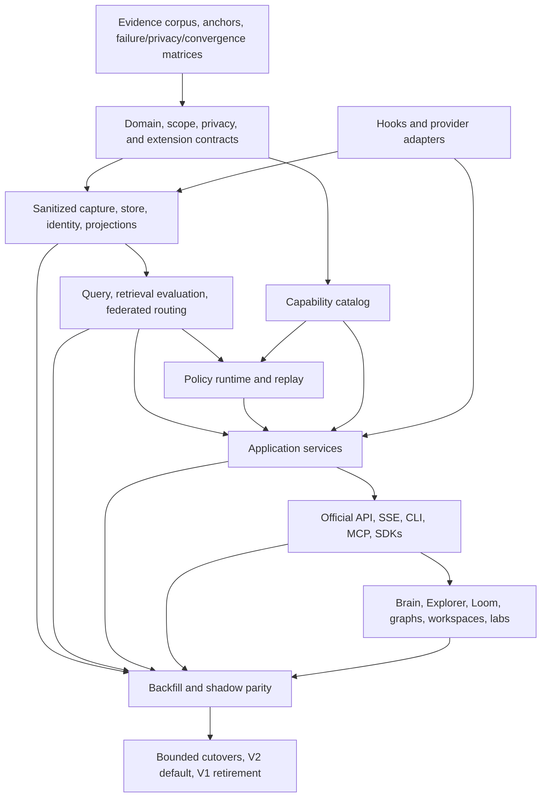

# TraceDecay V2 Rewrite Plan Set Index

**Status:** navigation and ownership index for the total-rewrite plan. This pull request contains plans only.

**Master plan:** [`../2026-07-09-tracedecay-brain-rewrite.md`](../2026-07-09-tracedecay-brain-rewrite.md)

## 1. Intended outcome

TraceDecay V2 defragments and reconciles the product into one local-first “Brain” for human intent, agent/Turn/session activity, tools and visible reasoning summaries, code and diagnostics, Git/delivery, goals/workflows, memory/knowledge, hints/policy, automation/skills, usage/cost, health, privacy, and outcomes. It is not a dashboard skin over existing silos or a set of new crates that preserve duplicate semantics. The plan replaces the internal model, storage/query/policy/privacy architecture, public contracts, and product interface behind bounded parity/cutover/deletion gates.

Core product surfaces:

- All/Brain system view with semantic zoom and coordinated graph-of-graphs lenses.
- Universal Explorer with typed query, search, facets, pivots, compare, explain, collections, and export.
- Causal Loom timeline following an agent/Turn/session through tools, subagents, code, worktrees, commits, PRs, checks, memories, hints, and outcomes.
- Git, code, thread, agent, Turn, timeline, holographic-memory, and automation/skill graph lenses with tables and accessible fallbacks.
- Hint, Retrieval, Search Quality, Coordination, Ingest, Query, Correlation, Scheduler, Memory, Policy Diff, Evolution, and Scope/Federation labs.
- One official contract shared by API, CLI, MCP, generated SDKs, dashboard, hooks, and tool discovery.

## 2. Plan documents and authority

| Plan | Authority |
|---|---|
| [`../2026-07-09-tracedecay-brain-rewrite.md`](../2026-07-09-tracedecay-brain-rewrite.md) | Product/architecture synthesis, invariants, complete system model, phases, PR order, global release gates. |
| [`01-domain-crate.md`](01-domain-crate.md) | Canonical identities, scope/time/evidence/provenance/event/query types and legal relations. |
| [`02-store-crate.md`](02-store-crate.md) | Catalog/activity/project/graph/blob physical storage, migrations, integrity, lifecycle, consistency, backup/repair. |
| [`03-capture-crate.md`](03-capture-crate.md) | Provider/source discovery, immutable observation capture, spools, offsets/generations, parsing, privacy classification. |
| [`04-projectors-crate.md`](04-projectors-crate.md) | Deterministic projections for identity, sessions/agents/Turns, code/Git, knowledge, policy, automation, accounting. |
| [`05-query-crate.md`](05-query-crate.md) | `TraceQueryV1`, scope/shard planner, list/export, search/rank, graph/time/as-of operators, cursors, explain, evaluation. |
| [`06-policy-crate.md`](06-policy-crate.md) | Versioned deterministic hint/retrieval/routing/correlation/curation/scheduler/diagnostic/memory policy and replay. |
| [`07-hooks-crate.md`](07-hooks-crate.md) | Bounded host hook path, durable spool/ack, provider envelopes, hint delivery, latency/privacy/token budgets. |
| [`08-tool-catalog-crate.md`](08-tool-catalog-crate.md) | Capability source of truth, use cases, names/bindings, discovery, current-version handshake, generated metadata/docs. |
| [`09-application-crate.md`](09-application-crate.md) | Transport-neutral use cases, query/command workflows, auth decisions, idempotency, remediation, composition ports. |
| [`10-api-crate.md`](10-api-crate.md) | Axum V2, HTTP/SSE envelopes, auth/security, OpenAPI/schema generation, adapters, generated core of the one official TypeScript client; dashboard binding stays thin. |
| [`11-dashboard-frontend.md`](11-dashboard-frontend.md) | Information architecture, design system, Brain/Explorer/Loom/workspaces/labs, renderers, charts, accessibility/mobile/export. |
| [`12-root-compatibility-migration.md`](12-root-compatibility-migration.md) | Root binary/daemon/CLI/MCP composition, doctor/install/update/service ownership, V1 data migration, cutover/rollback/retirement. |
| [`13-research-provenance-and-context-anchors.md`](13-research-provenance-and-context-anchors.md) | Research manifest, durable retrieval anchors, subagent context, corpus hashes/cutoff, source recovery, future implementation handoff. |
| [`14-historical-failure-regression-matrix.md`](14-historical-failure-regression-matrix.md) | Historical problem -> prevention owner -> visible detection/recovery -> cutover regression gate. |
| [`15-search-quality-evaluation-and-retrieval-research.md`](15-search-quality-evaluation-and-retrieval-research.md) | Real local precision corpus, primary retrieval research, hybrid pipeline, qrels/metrics/holdouts, shadow/online evaluation, Search Quality Lab. |
| [`16-cross-project-repository-worktree-scope.md`](16-cross-project-repository-worktree-scope.md) | Exceptional multi-repo/project/worktree/ref/store behavior, `ScopeSelectorV2`, routed retrieval, graph federation, CLI/MCP UX, Rspack/Rsbuild/React Router corpus. |
| [`17-official-public-api-and-sdks.md`](17-official-public-api-and-sdks.md) | Official direct-agent/public API, contract IR/OpenAPI/JSON Schema, stable IDs/errors/cursors/batch/SSE, Rust/TS/Python SDKs, docs/sandbox/conformance. |
| [`18-secret-detection-redaction-and-private-data-safety.md`](18-secret-detection-redaction-and-private-data-safety.md) | Mandatory structured sanitizer/taint boundary, detector registry, protected quarantine, sink firewalls, retroactive audit/remediation/restore, privacy UI/lab and secret canary gates. |
| [`19-system-defragmentation-convergence-and-extensibility.md`](19-system-defragmentation-convergence-and-extensibility.md) | Whole-system current-to-target convergence, one canonical owner per semantic, extension SPIs, scale/organization governance, anti-corruption adapter retirement, and architecture scorecard. |

When documents overlap:

1. The master plan owns outcome, global constraints, dependency order, and cutover gates.
2. A numbered crate/surface plan owns implementation details in its boundary.
3. Plans 13–19 own cross-cutting evidence, regression, retrieval, scope, public-contract, privacy, and convergence requirements; bounded crates must satisfy them rather than reimplement them.
4. An implementation decision that changes a locked domain contract requires an ADR and coordinated plan update before code diverges.

## 3. Reading paths

### Architecture lead

1. Master sections 1–9, 18–24.
2. Plans 01, 02, 05, 06, 09, and 12.
3. Plans 13–19 as non-negotiable evidence/scope/API/privacy/convergence gates.

### Storage and migration implementer

1. Plans 01–04.
2. Plan 12.
3. Plan 14 storage/identity/durability rows.
4. Plan 16 registry/activity/routing sections.

### Search/query implementer

1. Plans 01, 04, and 05.
2. Plan 15 in full.
3. Plan 16 federated planner/search-to-retrieval requirements.
4. Plan 13 for exact private anchor recovery.

### Hint/hook/tool implementer

1. Plans 06–09.
2. Master sections 5.3–5.5 and 16.
3. Plan 14 hint/tool/remediation rows.
4. Plans 15–16 for search precision, nearby agents, and scope behavior.

### API/SDK implementer

1. Plans 01, 05, 08, 09, 10, and 17.
2. Plan 16 for selector/routing semantics.
3. Plan 12 for cutover/current-client rules.

### Dashboard/product implementer

1. Master sections 11–18.
2. Plan 11 in full.
3. Plans 15–17 for labs, All/system scope, explanations, and official client contracts.
4. Plan 14 dashboard/API/observability regressions.

### Test/evaluation lead

1. Plans 13–16.
2. Every plan’s Definition of Done and verification sections.
3. Master phase/PR gates and SLO section.

### Convergence/maintainability lead

1. Plan 19 in full and the master convergence/phase sections.
2. Plans 01–12 boundary/input/output/dependency/retirement sections.
3. Plans 14 and 18 for historical bypass/privacy regressions.
4. Generated compatibility/capability/schema inventories and architecture scorecard.

## 4. Locked architectural decisions

- Start as one Rust binary with bounded internal crates/ports; allow later daemon/query split without changing contracts.
- Use one profile catalog, one canonical profile activity journal/projection, project/privacy-domain shards, immutable packed graph generations, and privacy-domain content-addressed blobs.
- SQLite/rusqlite is the initial local engine; libSQL/remote federation is a future evaluated option, not an assumption.
- Capture immutable native observations before canonical projection; retain source hashes/offsets/parser versions and unknown fields.
- Run one mandatory parse-before-scan sanitizer before the observation journal; secret plaintext never reaches general stores/indexes/outputs, while optional protected raw retention is isolated/encrypted/short-lived.
- Model bitemporal evidence relations and confidence/provenance; never convert correlation into causal language silently.
- Provider-visible reasoning summaries may be retained according to sensitivity/retention; hidden chain-of-thought is neither captured nor reconstructed.
- Sessions/agents/Turns live canonically in profile activity. Repository/project/worktree attribution is temporal evidence, not one provider key.
- `ScopeSelectorV2` is shared across every surface. Explicit targets never fall back to current CWD/project/ref.
- Search is hybrid and measured: exact/phrase/BM25 first, bounded fuzzy/entity/graph/dense/learned-sparse/rerank channels only when they improve labeled gates.
- Retrieval IDs route globally to exact retained evidence; expiring response handles are never sole citations.
- Hooks remain bounded and local: no synchronous federated fan-out, embeddings, indexing, automation, or long writes.
- Hints optimize useful action and useful silence, not volume; nearby-agent hints are compact, evidence-scored, deduped, and non-authoritative.
- Tool/capability definitions generate CLI/MCP/API/dashboard/skill/hint bindings and drift tests from one catalog.
- Application services own behavior; transports are thin adapters and frontend uses generated client types.
- Official API is supported, versioned, documented, locally authenticated, bounded, and usable directly by agents through Rust/TypeScript/Python SDKs.
- All/Brain is the product default; project views are zoomed scopes inside one system.
- Every visualization has table/outline/export/accessibility parity and explicit evidence/coverage semantics.
- Replay labs are read-only by default and do not contaminate analytics, facts, claims, policies, hints, or live coordination.
- Migrate and retain non-disposable V1 data for rollback; do not emulate stale running clients, old protocol behavior, or obsolete tool names after cutover.
- One canonical owner/contract exists for identity, scope, privacy, capture, projection, query, policy, capability, application, and transport semantics; compatibility adapters have deletion PRs and cannot accept new call sites.

## 5. Dependency and implementation order

No broad V2 rewrite lands as one PR. Use the master plan’s Phase 0–5 sequence and sub-PRs. The first end-to-end vertical slice proves one provider/project session/tool/subagent investigation through capture -> identity -> projection -> query -> API -> timeline/table/inspector before broad domain expansion.

## 6. Phase gates

### Phase 0 — truth and contracts

- ADRs lock logical architecture, evidence language, scope/store ownership, privacy/retention, API/query/cursor semantics, frontend rendering, and stale-client cutoff.
- Redacted corpus and private manifest are reproducible and secret-scanned.
- Research anchors route to exact context or explicit tombstone.
- Synthetic secret corpus/sink inventory and system convergence inventory are complete; no private transcript/store becomes a fixture.
- V1 compatibility inventory is generated and CI detects drift.
- Read-only V1-backed product concept validates Brain/Explorer/Loom interaction before hardening contracts.

### Phase 1 — durable evidence plane

- Observation ingest is idempotent and crash/disk-full safe.
- Mandatory sanitizer/taint types and protected quarantine are fail-closed before journal/store/projector use.
- Catalog identity survives moves/worktrees/renames and preserves ambiguity.
- Project/activity/blob/graph storage passes integrity, backup/restore, permission, writer, and fault matrices.
- Projections are deterministic, versioned, rebuildable, lag-visible, and dead-letter safe.

### Phase 2 — query and retrieval plane

- Scope resolution, shard pruning, partial/stale coverage, global routing, and stable distributed cursors pass.
- Privacy containment prevents unsafe entities/shards from search/graph/ranking/cursors/exports and reports unknown coverage.
- Exact/phrase/BM25 and V1 parity pass before optional representations/rerankers.
- Real chronological/project/provider holdouts, qrels, metrics, resource gates, and no-answer behavior are frozen.
- Search results load exact evidence across project boundaries.

### Phase 3 — domain intelligence

- Sessions/agents/Turns/tools/goals/workflows and temporal project attribution backfill with parity.
- Code snapshots/lineage, cross-repo graph, Git/delivery, knowledge, automation/skills, accounting, tool catalog, policy, nearby-agent claims, and replay inputs backfill with evidence manifests.
- Merged/open PR semantics named in the master/failure matrix are fixtures, not assumptions.

### Phase 4 — official product

- Application, HTTP/SSE, API contracts, CLI/MCP, the one official TypeScript client plus thin dashboard binding, Rust/Python SDKs, docs/sandbox, and exports pass semantic conformance.
- Privacy status/scan/remediation/verify and convergence/capability status share application contracts; Secret Safety Lab uses synthetic values only.
- Brain/All, Observatory, Explorer, Loom, graphs, workspaces, and labs pass desktop/mobile/accessibility/table/export/partial-state acceptance.
- Rspack/Rsbuild/React Router multi-repository workflows complete without manual registry/store choreography.

### Phase 5 — migration and retirement

- Resumable backfill manifests account for every retained, skipped, quarantined, redacted, and deleted entity.
- Retroactive privacy audit/rotation-first remediation/rebuild/restore gates account for every sink/backup; superseded V1/parallel paths have verified deletion receipts.
- Shadow parity has no unexplained gaps and stable projection lag.
- Every bounded-context cutover has feature flag, receipt, rollback drill, telemetry gate, and current-client/catalog handshake.
- V1 data remains read-only for the declared rollback/evidence window; V1 live adapters and obsolete names are removed.

## 7. Evidence and privacy boundary

Private research corpus:

- `/fast/tracedecay-redesign-research/user-messages-chronological.jsonl`
- `/fast/tracedecay-redesign-research/human-messages-chronological.jsonl`
- `/fast/tracedecay-redesign-research/manifest.json`
- `/fast/tracedecay-redesign-research/intent-evolution.md`
- `/fast/tracedecay-redesign-research/README.md`

These files are deliberately outside the repository and mode `0600`. Plan 13 records cutoff, hashes, limitations, retrieval recipes, and subagent/session anchors. Never copy raw private transcript content or private relevance judgments into an implementation PR. Promote only minimal redacted/synthetic fixtures and aggregate reports after secret scanning.

## 8. Plan-maintenance protocol

Before implementing any slice:

1. Fetch current master and open PR state.
2. Resolve the slice’s research anchors and check for newer corrections/fixes.
3. Reconcile TraceDecay indexed Git/code context with live Git/GitHub state.
4. Identify failure-matrix rows and merged/open-PR behavior that the slice owns.
5. Freeze the exact schema/capability/compatibility delta in the PR.
6. Write historical/regression/fault/conformance tests first.
7. Update plan/ADR only when evidence changes a locked decision; record rejected alternatives.
8. Publish migration/parity/benchmark/privacy receipts with the slice.

## 9. Whole-program definition of done

- [ ] A person can understand TraceDecay as one Brain from the default All view.
- [ ] An agent can discover and call the right capability through CLI, MCP, or official API without namespace/store/project choreography.
- [ ] One stable selector and retrieval-ID system works across every repository, project, worktree, ref, provider, domain, transport, and retained historical object.
- [ ] A Causal Loom investigation follows agent/Turn/session intent through subagents, tools, visible reasoning summaries, code, Git, PRs, hints, memories, automations, costs, and outcomes.
- [ ] Graph-of-graphs lenses are interactive, explainable, bounded, accessible, responsive, and backed by exact tables/exports.
- [ ] Search and hints have real local precision/recall/no-answer/repetition/latency/resource evaluations across many projects and providers.
- [ ] Nearby agents can discover overlapping work compactly without prompt leakage, spam, false ownership, or suppression of deliberate parallel review.
- [ ] Hint/search/coordination/scope/policy behavior can be replayed safely against exact historical inputs and candidate versions.
- [ ] Knowledge, memories, and managed skills have evidence -> proposal -> validation -> approval/autonomy -> apply -> use -> outcome -> revision/rollback lineage.
- [ ] Every output reports coverage, freshness, provenance, limits, uncertainty, and source class truthfully.
- [ ] Every historical failure class has prevention, visible detection, recovery, and a deterministic/probabilistic cutover gate.
- [ ] One sanitizer protects every source/sink and one convergence scorecard proves duplicate authorities/bypasses/adapters are removed, not renamed.
- [ ] No non-disposable evidence is silently lost, duplicated as authority, mis-scoped, or destroyed during migration.
- [ ] Stale clients and obsolete tool names fail explicitly after cutover; data rollback does not become indefinite protocol compatibility.
- [ ] Final V2 default and V1 retirement occur only after aggregate verification is stable, not after one flaky pass.
