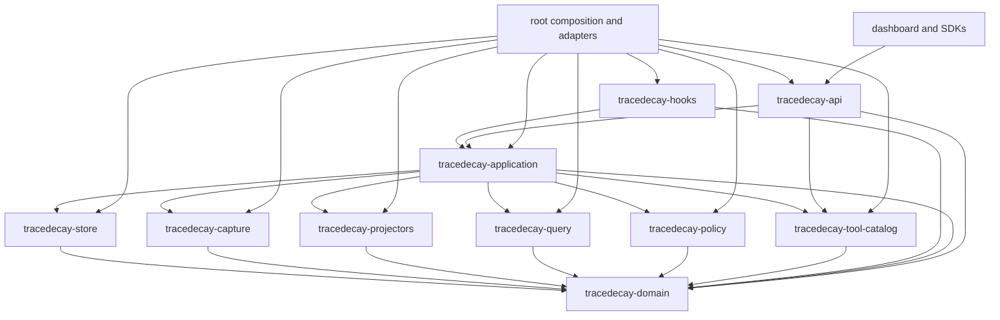

# TraceDecay V2 System Defragmentation, Convergence, and Extensibility Plan

**Status:** program-level implementation blueprint; this document changes no product code, data, store, or protocol.

**Parent plan:** [`../2026-07-09-tracedecay-brain-rewrite.md`](../2026-07-09-tracedecay-brain-rewrite.md)

**Normative supporting plans:** [`01-domain-crate.md`](01-domain-crate.md), [`02-store-crate.md`](02-store-crate.md), [`03-capture-crate.md`](03-capture-crate.md), [`04-projectors-crate.md`](04-projectors-crate.md), [`05-query-crate.md`](05-query-crate.md), [`06-policy-crate.md`](06-policy-crate.md), [`07-hooks-crate.md`](07-hooks-crate.md), [`08-tool-catalog-crate.md`](08-tool-catalog-crate.md), [`09-application-crate.md`](09-application-crate.md), [`10-api-crate.md`](10-api-crate.md), [`11-dashboard-frontend.md`](11-dashboard-frontend.md), [`12-root-compatibility-migration.md`](12-root-compatibility-migration.md), [`13-research-provenance-and-context-anchors.md`](13-research-provenance-and-context-anchors.md), [`14-historical-failure-regression-matrix.md`](14-historical-failure-regression-matrix.md), [`15-search-quality-evaluation-and-retrieval-research.md`](15-search-quality-evaluation-and-retrieval-research.md), [`16-cross-project-repository-worktree-scope.md`](16-cross-project-repository-worktree-scope.md), [`17-official-public-api-and-sdks.md`](17-official-public-api-and-sdks.md), [`18-secret-detection-redaction-and-private-data-safety.md`](18-secret-detection-redaction-and-private-data-safety.md), [`20-configuration-control-plane.md`](20-configuration-control-plane.md), [`21-cli-mcp-tool-surface-and-output-unification.md`](21-cli-mcp-tool-surface-and-output-unification.md), [`22-incremental-context-scout-and-suggestion-envelopes.md`](22-incremental-context-scout-and-suggestion-envelopes.md), [`23-session-lcm-temporal-retrieval-and-evaluation.md`](23-session-lcm-temporal-retrieval-and-evaluation.md), and [`24-canonical-task-plan-graph-and-multi-agent-executor.md`](24-canonical-task-plan-graph-and-multi-agent-executor.md).

## 1. Program objective

The rewrite succeeds only if TraceDecay stops behaving like a collection of adjacent products that happen to share a binary. V2 must reconcile capture, LCM, sessions, code intelligence, Git, memory, analytics, automations, tasks/plans/executors, hints, tools, API, and dashboard into one system with:

- one authoritative owner for every concept and side effect;
- one immutable evidence path from every source into canonical observations;
- one identity and scope language across profile, repository, project, checkout, worktree, ref, provider, session, agent, and historical snapshot;
- one query/search/graph algebra and one result/coverage contract;
- one versioned policy and replay substrate;
- one generated capability catalog;
- one transport-neutral application command/query layer;
- thin CLI, MCP, HTTP, SDK, hook, and UI adapters;
- bounded, versioned extension points rather than copies or special cases;
- explicit scale, concurrency, privacy, reliability, and complexity budgets;
- a mandatory retirement path for every V1 implementation and temporary adapter.

The target is not merely fewer files. It is less semantic entropy: fewer competing meanings, fewer hidden defaults, fewer duplicated state machines, fewer untyped strings, fewer paths around policy, and fewer ways for two clients to receive different answers to the same question.

## 2. Evidence that convergence is required

### 2.1 Live planning probe

A TraceDecay context lookup against the planning worktree failed with an identity-cutover conflict: the same checkout resolved to both a selected store and a legacy store, each healthy and each containing materially different graph, fact, session, message, LCM, branch, automation, and payload counts. Retrying with an explicit project ID still re-entered the path resolver and returned the same conflict.

This is the architecture problem in miniature:

1. More than one store can appear authoritative for one logical identity.
2. Resolution and tool execution do not share one decisive scope result.
3. An explicit identifier is not always sufficient to bypass implicit path/CWD resolution.
4. Health is reported per shard, but the user needs a reconciliation decision for the logical system.
5. The safe behavior—preserve both and demand consolidation—is correct, but the recovery is not yet a first-class application workflow with a typed plan, preview, receipt, and postcondition.

V2 must retain the safe refusal while making ambiguity inspectable and repairable through the same canonical identity, command, status, and receipt contracts used by CLI, MCP, API, SDKs, and dashboard.

### 2.2 Fragmentation inventory

The Phase 0 inventory generator must produce this table from source, schemas, routes, catalogs, configs, and store manifests. The human rows below establish the minimum audit surface.

| Area | Existing fragmentation to inventory | Canonical V2 owner | Required retirement proof |
|---|---|---|---|
| Physical stores | Global/session databases, project stores, LCM stores, code graph stores, analytics tables, payload directories, automation artifacts, legacy identity shards, WAL/recovery generations | `tracedecay-store` physical layout plus catalog/activity/project/graph/blob ownership rules | Every discovered store classified as migrated, retained read-only, quarantined, disposable, or deleted; no unowned store opens after cutover |
| Sessions and LCM | Provider transcript ingestion, global session/message projection, V1 LCM native rows, summary DAGs, compression payloads, search tables, workflow/subagent ingestion | Sanitized capture observations plus profile activity projections; LCM is context lineage, not a second session authority | V1 session and LCM readers removed after parity and rollback window; one entity/retrieval ID loads sanitized-native message, summary lineage, and projection; protected plaintext is quarantine-only |
| Tasks, plans, boards, and execution | Provider goals/plans/workflows, automation jobs, advisory work claims, Hermes board DBs/current selector, per-repo tickets, assignee strings, host processes, worktrees/branches, executor queues, task-like dashboard/plugin state | One profile activity-shard initiative/plan/work-item event graph plus typed dependencies, assignments, fenced leases/attempts, executor SPI/routes, context packets, evidence relations, and saved query projections from plan 24 | One scheduler/lease owner; boards copy no task rows; ambient board/CWD never routes; every stale epoch is rejected; external/provider task evidence is linked or explicitly materialized; legacy dispatch/current-file/direct-DB paths are deleted |
| Provider capture | Per-provider scanners, hook records, workflow ingestion, Git correlation, automation import, ad hoc backfill markers | `tracedecay-capture` adapter registry and one observation journal | Every adapter passes one conformance suite; direct canonical writes and provider-specific redaction/store logic deleted |
| Identity | Path hashes, project keys, registry rows, worktree discovery, remote aliases, store markers, provider-local session IDs | `tracedecay-domain` IDs and `tracedecay-store` allocation/alias ledger | No public API accepts ambiguous `project_key`; no crate derives canonical IDs independently |
| Scope | CWD defaults, project selectors, registry search, worktree/ref selection, profile/global modes, tool-specific flags | `ScopeSelectorV2` plus one application resolver | Explicit scope never silently falls back; all transports pass the same scope conformance corpus |
| Code intelligence | Extraction, code graph, AST search, text search, diagnostics mapping, context assembly, dependency import, PR-context branch resolution | Capture/projectors/query/application in their bounded roles | Root/V1 graph query paths and direct DB calls removed; graph generation and snapshot IDs required in results |
| Query | Session search, LCM search, memory search, code search, SQL-shaped dashboards, graph traversals, context tools, exports | Domain `TraceQueryV1` AST plus `tracedecay-query` parser, planner, operators, rank pipeline, cursor, explain | No transport or UI builds SQL/query semantics; parity and quality gates prove replacement |
| Search ranking | Exact/FTS/BM25-like paths, fuzzy matching, embeddings, graph expansion, copied-message behavior, per-tool filtering | Versioned retrieval pipeline in `tracedecay-query`, evaluated by plan 15 | All rankers registered/versioned; no unmeasured ranking fork remains |
| Evidence and relations | Provider facts, correlation records, Git links, memory provenance, agent trees, tool results, code impact, PR links | Immutable observations plus bitemporal `RelationAssertion` and deterministic projections | Correlation never becomes fact by transport formatting; legacy relation tables are imported or retired |
| Policy | Hint classification, routing, retrieval choices, curation, memory injection, diagnostics, scheduling, coordination, automation decisions | `tracedecay-policy` bundles and deterministic replay | Every live decision identifies policy bundle/evaluator/input digest; ad hoc condition stacks removed |
| Hooks | Host-specific scripts, event matchers, spool behavior, hint rendering, acknowledgement, latency/error behavior | `tracedecay-hooks` over capture/application/policy ports | Hosts pass one conformance suite; hook cannot own query, indexing, migration, or long-running work |
| Tools/capabilities | CLI commands, MCP tool names/schemas, HTTP routes, dashboard actions, skills, hook hints, aliases | `tracedecay-tool-catalog` source of truth | Catalog generation covers every public action; hand-maintained semantic duplicates fail CI |
| Application behavior | Mutations and queries embedded in CLI, MCP, dashboard routes, daemon tasks, doctor/remediation, installers | `tracedecay-application` use cases | Transports contain binding/rendering only; behavior conformance proves identical outcomes |
| Transports | CLI output/flags, MCP JSON/Markdown, HTTP envelopes, SSE events, SDK helpers | Thin adapters generated from catalog/application/API contracts | Semantic drift suite passes; stale clients fail explicitly before store access |
| Dashboard | Per-project pages, bespoke SQL endpoints, duplicated filters, separate graph products, action-specific state | V2 workbench over generated client and shared investigation state | No frontend data adapter bypasses the official client; legacy shell/routes retired after parity |
| Configuration | CLI flags, env vars, project/profile config, provider metadata, dashboard settings, hook config, daemon defaults | Typed versioned configuration resolver in application/root composition | Every effective value reports source/precedence/restart effect; no provider record weakens global safety floor |
| Analytics | Hook counts, session usage, savings, policy metrics, store health, automation runs, errors, dashboard aggregates | Observation-derived accounting/observability projections | Denominators, coverage, version, replay exclusion, and freshness required; bespoke counter writers deleted |
| Status/health | Doctor, diagnostics, store health, index freshness, LCM status, dashboard badges, daemon/service checks | Typed `SystemStatusSnapshot` assembled by application services | Same status facts and remediation IDs render on every surface; no health inferred from incidental row existence |
| Errors | Domain errors, SQLite strings, anyhow chains, CLI exit text, MCP errors, HTTP codes, dashboard toasts | One layered error taxonomy and generated transport mappings | Every public error has stable code, retryability, safe context, remediation capability, and trace ID |
| IDs/handles | Path hashes, row IDs, provider IDs, response handles, session IDs, retrieval IDs, graph IDs, URL parameters | Domain newtypes and global retrieval-anchor resolver | Strings are not interchanged accidentally; response handles never become sole durable citations |
| Privacy/redaction | Optional LCM redactor, memory secret rejection, remote URL omission, provider redaction markers, output-specific scrubbing | Mandatory sanitizer and typed safe-content boundary from plan 18 | Every old detector becomes fixture/reference or a plugin behind the one boundary, then is deleted |

### 2.3 Inventory artifact contract

Phase 0 generates `target/tracedecay-v2-inventory/` artifacts, never hand-edited production manifests:

- `stores.json`: location class, owner, schema/version, identity candidates, size, health, privacy domain, writer/readers, migration state;
- `tables.json`: table/index/trigger/FTS owner, reader/writer call sites, canonical target;
- `public-surfaces.json`: CLI, MCP, HTTP, SSE, SDK, dashboard, skill, hook, installer, config, and file-format surfaces;
- `semantic-implementations.json`: ID derivation, scope resolution, redaction, search/ranking, hinting, status, error mapping, config resolution, retry, and rendering implementations;
- `dependency-graph.json`: crate/module dependency edges, cycles, forbidden imports, SQL/file-system/network use;
- `adapter-ledger.json`: every anti-corruption adapter with owner, creation PR, traffic, parity gate, rollback dependency, and deletion PR;
- `convergence-scorecard.json`: metrics in Section 13 with baseline and target;
- `inventory.md`: safe human summary with no store content or secret candidates.

The inventory records symbols and schema names, not private content. It uses supported readers and manifests; it does not crawl raw databases as an implementation shortcut.

## 3. Governing architecture rules

1. **One meaning, one owner.** A concept has one canonical type and one crate responsible for its invariants.
2. **One effect, one route.** A side effect enters through one application command; adapters cannot reimplement it.
3. **Evidence first.** Sources produce immutable observations before mutable projections or policy decisions.
4. **Projection, not duplication.** Read models may repeat derived fields for performance but never become competing authority; every row carries source/projection versions and watermarks.
5. **Explicit scope.** CWD is one input to resolution, never invisible authority after an explicit selector is supplied.
6. **Typed boundaries.** IDs, safe text, cursors, scopes, errors, status, commands, and query results cross crates as domain/application types, not unvalidated strings or JSON blobs.
7. **Thin transports.** CLI, MCP, HTTP, SSE, SDK, hook, and UI bind and render application behavior.
8. **Generated parity.** Repeated public schemas and capability metadata are generated from one contract IR.
9. **Extensions use SPIs.** New providers, detectors, projectors, operators, policies, and UI contributions register through bounded contracts with budgets and provenance.
10. **Local-first scale.** One binary and embedded stores are the first deployment; contracts permit isolated workers or remote/federated backends without distributing semantics.
11. **No permanent bridge.** Every compatibility adapter has a deletion gate when created.
12. **Safe failure.** Ambiguity, partial coverage, stale generations, privacy uncertainty, budget exhaustion, and version mismatch are visible typed states, not fallback triggers.

## 4. Target canonical planes

### 4.1 Ingestion and evidence plane

`tracedecay-capture` owns source discovery, framing, parser/adapter execution, sanitization invocation, source offsets/generations, and construction of `ObservationEnvelopeV1`. `tracedecay-store` owns atomic journal publication, blob/quarantine persistence, outbox records, and acknowledgements. `tracedecay-projectors` alone converts observations into read models.

Required convergence:

- Provider transcripts, hook events, Git snapshots, code extraction, diagnostics, workflows, LCM V1, automation, memory imports, and legacy stores all enter through an adapter registry.
- One deterministic observation-ID function lives in domain; no adapter invents another UUID namespace or canonical encoder.
- Duplicate, late, rewritten, malformed, unavailable, quarantined, and unsupported records remain explicit evidence states.
- Canonical activity is written once. Project-attributed projections contain locators and derived indexes, not duplicate message bodies.
- Every projector is idempotent, deterministic for a pinned observation range/config/version, rebuildable, and watermarked.
- Direct writes from hooks/providers/transports into session, LCM, graph, analytics, memory, or dashboard stores are prohibited by architecture tests.

### 4.2 Identity and scope plane

`tracedecay-domain` defines `ProfileId`, `RepositoryId`, `ProjectId`, `CheckoutId`, `WorktreeId`, `RefId`, `CodeSnapshotId`, `GraphGenerationId`, `SourceInstanceId`, `ProviderId`, `ActorId`, `AgentId`, `SessionId`, `ThreadId`, `TurnId`, `MessageId`, `ObservationId`, `EntityId`, `RelationId`, `PolicyBundleId`, `CapabilityId`, and `RetrievalAnchorId`. `tracedecay-store` persists allocation and alias history. `tracedecay-application` resolves user selectors.

Required convergence:

- One `ScopeSelectorV2` serves CLI, MCP, API, SDKs, dashboard, hooks, jobs, and saved views.
- Resolution accepts stable IDs plus names, paths, remotes, branches, worktrees, PRs, collections, agents, and sessions as evidence-backed aliases.
- Explicit IDs bypass implicit CWD identity selection after access validation. Explicit paths resolve exactly or return candidates; they never collapse to the current project.
- A resolution result pins canonical IDs, candidate evidence, snapshot/ref generation, store routes, access decision, freshness, and ambiguity state.
- Resolution happens once per request. Downstream query, policy, and transport code receives `ScopeResolutionV2`, never repeats path/registry discovery.
- Identity reconciliation is an application workflow: preview candidates, compare coverage, choose merge/link/keep-separate, run resumably, emit receipt, verify postconditions, and preserve rollback sources.

### 4.3 Storage and projection plane

Physical federation remains explicit:

- profile `catalog.db`: identity allocations, content-free keyed alias-routing projections, store registry, schema/catalog versions, entity/anchor routes, migration receipts; canonical alias values/history do not live here;
- profile `activity.db`: observations and canonical provider/agent/session/Turn/message/workflow/goal activity plus cross-project/profile knowledge and automation;
- repository/privacy-domain `project.db`: code/Git/delivery evidence and explicitly project-scoped projections;
- immutable graph generations: packed snapshot-scoped graph data;
- privacy-domain content-addressed blobs: sanitized eligible payloads plus separate protected quarantine when explicitly enabled.

There is one logical system, not one giant SQLite file. `tracedecay-query` federates shards through declared capabilities and watermarks; transactions remain local. Cross-shard commands use journal/outbox/saga semantics and report incomplete compensation instead of pretending to be atomic.

Every projection declares:

- stable projection ID and owner crate/module;
- input observation/event kinds;
- schema and algorithm version;
- output store/shard class;
- watermark and lag contract;
- rebuild/checkpoint/rollback strategy;
- privacy eligibility and retention behavior;
- query operators and capability IDs it serves;
- parity corpus and performance budget.

### 4.4 Query, search, and graph plane

`tracedecay-domain` owns the one canonical `TraceQueryV1` AST/value/schema contract. `tracedecay-query` owns parsing, validation, canonicalization, planning, cost/budget enforcement, shard pruning, distributed cursors, graph/time/as-of operators, lexical/hybrid retrieval, ranking, diversity, explanation, and coverage reporting.

Required convergence:

- Session, LCM, memory, code, diagnostics, Git, agent, automation, facts, skills, and analytics queries compile from the same typed AST or call a specialized facade that compiles to it.
- Text search uses one versioned pipeline with exact/phrase/lexical foundations and optional measured fuzzy/entity/graph/dense/learned-sparse/rerank channels.
- Code graph, Git graph, thread graph, agent graph, Turn graph, timeline graph, knowledge graph, and automation graph share entity/relation/time/provenance primitives while retaining domain-specific operators.
- A query response always returns rows/nodes/edges plus pinned scope, coverage, freshness, watermarks, truncation, cost, planner/ranker versions, explanation, and stable retrieval anchors.
- No UI endpoint, MCP tool, or CLI command embeds SQL, FTS syntax, graph traversal, ranking, pagination, or store routing.
- Query caches key on normalized AST, resolved scope, access decision, snapshot/watermarks, representation/ranker versions, and privacy policy digest.

### 4.5 Policy and replay plane

`tracedecay-policy` owns deterministic evaluators for hints, retrieval routing, correlation, diagnostics, curation, memory, scheduler, automation, and nearby-agent coordination. It consumes immutable inputs and returns decisions/proposed effects. `tracedecay-application` revalidates effects; its curation worker autonomously applies every eligible owned fact/memory/managed-skill/profile-curation effect, monitors outcomes, and automatically revises/recovers. No item approval/apply command exists.

Required convergence:

- A `PolicyBundle` pins evaluator versions, configuration, catalog, index/snapshot watermarks, memory/skill versions, seed, time source, and budgets.
- Evaluation cannot write stores, call transports, read ambient CWD, or silently fetch live state.
- Exact replay uses matching artifacts; recorded replay returns stored decisions; best-effort replay declares every substitution.
- Labs and offline evaluation use the same evaluator path as live operation but an effect sink that cannot mutate live state or contaminate analytics.
- Hint/retrieval/coordination analytics distinguish eligible, emitted, suppressed, acted-on, useful, false-positive, repeated, ignored, and outcome-unknown states.
- Policy code cannot define capability names, scope rules, redaction rules, query ranking, or output rendering independently.

### 4.6 Capability catalog

`tracedecay-tool-catalog` is the single registry for user/agent-visible capabilities. Each `CapabilityDefinition` owns:

- stable ID, semantic version, status, owner, aliases, and replacement;
- use-case command/query type and result/error schemas;
- allowed scopes, access requirements, privacy class, side-effect class, idempotency, retry policy, and budgets;
- CLI/MCP/HTTP/SDK/dashboard/hook/skill bindings;
- availability requirements and degraded/partial states;
- human/agent discovery phrases and examples;
- telemetry event IDs and conformance fixtures.

Catalog generation produces CLI metadata, MCP schemas, OpenAPI/JSON Schema references, SDK method manifests, dashboard action metadata, skill/hint discovery, docs, and drift tests. It does not generate business behavior; every binding resolves to one application use case.

### 4.7 Application command/query layer

`tracedecay-application` owns orchestration and is the only layer allowed to combine repositories, query services, policy evaluators, permissions, locks/leases, idempotency records, jobs, and audit effects into a public use case.

Each use case has:

- `Command` or `Query` input with `RequestContext`, explicit `ScopeSelectorV2`, access subject, idempotency key where applicable, deadline/budget, and expected version;
- one handler with injected ports;
- typed result, warnings, coverage, status deltas, audit receipt, and stable anchors;
- typed error variants mapped by generated transport tables;
- transaction/saga boundaries and retry semantics;
- conformance cases reusable by every transport;
- a declared capability ID.

Root composition wires implementations. Root may own bootstrap/process/service lifecycle and V1 anti-corruption adapters; it must not become a second application layer.

### 4.8 Thin transports, SDKs, and UI

Transport responsibilities are limited to authentication/session establishment, protocol handshake, input binding, deadline/cancellation propagation, streaming/framing, safe rendering, and transport-specific error/status mapping.

- CLI adds terminal formatting, exit codes, stdin/files, and shell completion.
- MCP adds JSON-RPC lifecycle, tool/resource binding, Markdown/JSON rendering, and protocol/catalog handshake.
- HTTP/SSE adds auth, request/response framing, cache headers, conditional requests, streaming, and OpenAPI.
- Rust/TypeScript/Python SDKs add idiomatic types, pagination/stream helpers, retry policy, cancellation, and debug-safe rendering.
- Hooks bind host events to the bounded spool/evaluation route and host response envelope.
- Dashboard uses only the generated TypeScript client plus UI-local view state; it never calls a hidden SQL or legacy endpoint.

Semantic conformance executes the same fixture through direct application invocation, CLI, MCP, HTTP, and SDK clients and compares normalized results, errors, warnings, coverage, anchors, and effects.

### 4.9 Security/redaction as the model convergence case

Redaction demonstrates why shared utilities alone are insufficient. Current behavior includes an optional LCM sanitizer, memory-specific secret rejection, Git-remote output omission, provider-native redaction markers, and tool-event content decisions. These paths answer different questions and permit gaps between input, storage, indexing, prompting, output, fixtures, and exports.

Plan 18 replaces them with:

1. One mandatory, versioned, parse-before-scan sanitizer before any TraceDecay persistence or agent exposure.
2. Domain taint types (`Unclassified`, `Classified`, `Sanitized`, and sink-specific eligible text) that make bypasses difficult to compile.
3. One detector registry and privacy-policy precedence model.
4. Sanitization receipts, coverage, quarantine, rescan, descendant invalidation, and secure-retirement workflows.
5. Sink-specific eligibility derived from the same sanitized result rather than independent regex calls.
6. Existing redactors/detectors retained only as fixtures/reference adapters until the canonical engine proves parity and stronger protection.

The same convergence pattern applies to identity, search, policy, config, status, and errors: preserve useful cases, establish one typed owner, adapt temporarily, prove parity, cut over, and delete the duplicate.

## 5. Canonical ownership matrix

| Concern | Defines contract | Executes behavior | Persists state | Exposes behavior |
|---|---|---|---|---|
| IDs, scope/time/evidence types | Domain | Application/capture/projectors/query as constrained | Store | All via generated schemas |
| Sanitized content eligibility | Domain/privacy contracts | Capture sanitizer | Store/quarantine | Application/API safe renderers |
| Source/provider adapters | Capture SPI | Capture | Store journal through injected port | Status/catalog only |
| Canonical observations | Domain | Capture | Store | Query/application |
| Identity allocation and canonical alias evidence | Domain | Application/store repository | Allocation ledger plus activity/project owner shards | Query/application |
| Keyed alias routing projection | Domain/store route contract | Projector/store | Content-free catalog routes only | Scope resolver |
| Projections | Projector registry | Projectors | Activity/project/graph stores | Query |
| Query AST/value/schema | Domain | Query parses/validates/canonicalizes | None | Query/application/generated bindings |
| Query planning/ranking/execution | Query | Query | Query cache/eval artifacts through ports | Application |
| Policy bundles/evaluators | Policy | Policy | Policy artifacts/results through ports | Application/labs |
| Capability metadata | Tool catalog | Catalog generation/runtime lookup | Generated/catalog snapshots | All transports/UI/docs |
| Use-case semantics | Application | Application | Injected repositories/job/audit ledger | CLI/MCP/API/SDK/UI/hooks |
| Protocol envelopes | API or transport-owned generated bindings | Thin adapter | None except safe request audit | Corresponding transport |
| Effective configuration | Domain schema + application resolver | Application/root bootstrap | Profile/project config repository | Status/settings/all transports |
| System status/remediation | Application typed models | Application | Observability projections/audit | All transports/UI |
| Error semantics | Domain/application error taxonomy | Owning layer | Safe error/audit projection | Generated mapping/rendering |
| UI information architecture | Frontend | Frontend view models/interactions | Saved-view command only | Browser |

No row may gain a second owner without an ADR that explains why it is a distinct bounded concept rather than a convenience copy.

## 6. Crate and module dependency DAG

### 6.1 Target workspace

```text
crates/
├── tracedecay-domain/          # pure canonical types, invariants, schemas, no I/O
├── tracedecay-store/           # repository implementations, migrations, journal, blobs
├── tracedecay-capture/         # source SPIs/adapters, normalization, privacy engine, spools
├── tracedecay-projectors/      # deterministic observation -> projection handlers
├── tracedecay-query/           # TraceQueryV1 parser/execution, federation, search, graph/time, explain
├── tracedecay-policy/          # pure versioned evaluators and replay
├── tracedecay-hooks/           # bounded host event/delivery adapters
├── tracedecay-tool-catalog/    # capability IR, validation, generators, runtime snapshot
├── tracedecay-application/     # commands, queries, workflows, ports, typed status/errors
├── tracedecay-api/             # HTTP/SSE and generated public contract artifacts
└── tracedecay-client/          # official Rust client and generated public types
src/                            # root binary, composition, CLI/MCP, host install/update, V1 adapters
dashboard/                      # workbench using generated TypeScript client
packages/tracedecay-client/     # official TypeScript client independent of dashboard state
python/tracedecay-client/       # official typed sync/async Python client
```

Do not create a generic `core`, `common`, `utils`, `services`, or `plugin` crate. Shared code moves to the crate that owns its invariant. A new crate requires:

- at least two real consumers;
- a coherent domain or deployment boundary;
- a dependency direction that reduces, not hides, cycles;
- public contract and non-goals;
- independent tests/benchmarks only when it has independent behavior;
- an ADR and deletion/migration plan for code it replaces.

### 6.2 Allowed edges



The diagram is a deployment/composition view. To preserve testability, repository and executor traits are owned by the consumer: capture owns `ObservationSink`, query owns read capabilities, projectors own projection sinks, and application owns orchestration ports. Concrete cross-crate adapters live in application/root composition, not in the lower-level crates.

### 6.3 Forbidden edges and capabilities

- Domain imports no TraceDecay crate and performs no filesystem, database, network, process, clock, random, or ambient-environment I/O.
- Store contains no provider parser, ranking, policy, transport, dashboard, or remediation decisions.
- Capture contains no SQL/store implementation, projection, query, ranking, policy, transport, or dashboard code.
- Projectors contain no transport, UI, provider discovery, live network, policy decision, or ad hoc ID derivation.
- Query contains no writes to canonical stores, transport rendering, provider discovery, policy decisions, or ambient CWD resolution.
- Policy contains no store/network/filesystem/clock/random capability except injected deterministic inputs and bounded pure extension runtimes.
- Hooks contain no broad graph scan, migration, indexing, automation, remote request, or direct store/query implementation.
- Tool catalog contains metadata/validation/generation, never use-case execution.
- API contains no business mutation, SQL, ranking, policy, provider parsing, or V1 fallback.
- Root contains no new business rules; new behavior lands in its owning crate/application first.
- Dashboard contains no private endpoint client, SQL-shaped request, capability-name literal registry, or independent error/status semantics.

CI validates these constraints through `cargo metadata`, import/source scans, feature matrices, compile-fail tests, and a checked dependency policy file.

## 7. Extension and plugin SPIs

### 7.1 Principle

Extensibility means adding a bounded implementation without copying a pipeline or editing every transport. It does not mean arbitrary code can mutate stores or introspect private content.

Every SPI has:

- stable namespaced ID and version range;
- manifest-declared inputs, outputs, source/effect/privacy classes, capabilities, resource budgets, and determinism;
- typed host calls and no access beyond declared capabilities;
- schema validation and conformance fixtures;
- executable/content digest and provenance;
- timeout, memory, output-size, cancellation, and failure-isolation rules;
- availability/status reporting;
- safe upgrade, disable, rollback, and state-migration behavior;
- compatibility policy that rejects unsupported major versions explicitly.

### 7.2 Supported SPIs

| SPI | Owner | Extension can do | Extension cannot do |
|---|---|---|---|
| Source adapter/parser | Capture | Discover declared source, frame records, parse into observation drafts | Allocate canonical IDs independently, write stores, weaken privacy, make policy decisions |
| Code extractor/grammar | Capture/projectors | Produce typed syntax/symbol/edge observations for a snapshot | Query live project stores or publish graph generations directly |
| Secret detector | Capture privacy engine | Return protected spans/classes/confidence under sandbox and budgets | Emit candidate content, use network/filesystem, bypass mandatory built-ins |
| Projector | Projectors | Consume declared observation kinds and emit typed projection mutations | Read ambient state, call transports, mutate unrelated projections |
| Query operator | Query | Add a typed bounded operator with cost/coverage/explain implementation | Bypass scope/access/budget, return unanchored evidence, mutate state |
| Retrieval representation/ranker | Query | Build/version representation and score bounded candidates | Receive unauthorized content, silently become default, skip labeled evaluation |
| Policy evaluator | Policy | Evaluate pinned typed inputs and return decisions/proposed effects | Perform I/O/effects, invent capability IDs, hide substitutions |
| Output renderer | Transport-owned | Render typed safe view models | Fetch data, apply business rules, reveal protected fields |
| Dashboard contribution | Frontend registry | Register route/panel/lens for declared capability/view model | Call private endpoints, inject global CSS/state, bypass access/coverage semantics |
| Automation/skill provider | Application/policy/catalog | Register candidate/validation/autonomous-execution/monitoring/recovery capability with audit lifecycle | Execute outside configured authority, modify own evidence, access secrets, or create a per-item human gate |

### 7.3 Runtime tiers

1. **Built-in Rust:** first-party, compiled, full conformance, least runtime overhead.
2. **WASM component:** preferred untrusted/third-party pure transform/evaluator; capability-free by default with bounded host calls.
3. **Isolated subprocess:** only for extractors/tools needing native runtimes; authenticated framed protocol, sandbox profile, restricted environment/filesystem/network, hard budgets.
4. **Remote extension:** deferred; requires explicit user configuration, authenticated protocol, privacy-domain egress policy, offline/degraded semantics, and threat-model ADR.

No unstable Rust dynamic-library ABI is a public plugin contract. WIT/JSON Schema/protobuf-like wire contracts are generated from the same versioned SPI IR where applicable. The first release may keep SPIs internal until two implementations and conformance suites prove the boundary; internal status must not be documented as stable public API.

### 7.4 Extension registry and dependency rule

The capability catalog references extensions by ID/digest and exposes availability. Owning crates host the registries. Do not add a general extension-runtime crate until at least two owners share identical sandbox/protocol lifecycle behavior; if that threshold is reached, extract a narrow `tracedecay-extension-host` crate that depends only on domain wire contracts and contains no domain-specific policy.

## 8. Naming, schema, version, configuration, status, and error governance

### 8.1 Ubiquitous language

Maintain `docs/architecture/glossary.md` and machine-readable domain registry. Reserved terms have one meaning:

- **observation:** immutable source record plus provenance;
- **event:** canonical domain occurrence projected from evidence;
- **entity:** stable logical thing with aliases/occurrences;
- **relation assertion:** time-bound, sourced claim connecting entities;
- **projection:** rebuildable derived read model;
- **session:** provider/user interaction container;
- **Turn:** one agent execution unit, distinct from a message;
- **agent:** actor/runtime instance, distinct from provider/model/session;
- **project:** logical scoped workspace, distinct from repository/checkout/worktree;
- **scope:** explicit query/effect boundary;
- **snapshot/generation:** immutable pinned code/graph/index state;
- **capability:** discoverable public use case, distinct from transport binding;
- **policy decision:** deterministic evaluation output, distinct from applied effect;
- **retrieval anchor:** durable locator to retained evidence, distinct from response handle.

The registry forbids overloaded aliases in public schemas without a migration annotation. Rust types, JSON fields, CLI flags, MCP properties, OpenAPI, SDKs, UI labels, telemetry, and docs derive from or validate against the same vocabulary.

### 8.2 Schema governance

- Every persisted/event/API/SPI schema has a namespaced ID, semantic version, owner, compatibility class, privacy classification, and migration function or explicit non-migratable status.
- Additive optional changes are minor only when defaults do not change meaning. New required fields, changed units/meaning, or removed variants are major.
- Persisted observations retain original bytes only when eligible; canonical decoded representation records parser/schema version.
- Projection schema changes use new generation/backfill and atomic publication, not in-place semantic mutation without a receipt.
- Unknown enum variants/fields survive capture where the source format permits, but public handlers fail or degrade explicitly according to the schema contract.
- Golden schema snapshots, upgrade/downgrade fixtures, and API/SPI compatibility checks run in CI.

### 8.3 Configuration governance

One typed resolver evaluates built-in defaults, profile, project/privacy-domain, provider/source, environment, CLI/request override, and policy floor according to field-specific precedence. Each `EffectiveConfigValue<T>` carries value, source, version, validation, sensitivity, changeability, and restart/rebuild impact.

- Safety floors cannot be weakened downstream.
- Unknown keys and obsolete names are errors with current replacement/remediation.
- Secret values are references to an external protected mechanism, never status/debug content.
- Query/policy/replay pin effective-config digests.
- Dashboard settings, CLI config, doctor, hooks, daemon, automation, and SDKs use the same read/update application commands.

### 8.4 Status governance

One `SystemStatusSnapshot` assembles component states without hiding disagreement:

```text
component_id, owner, state, reason_code, observed_at,
coverage, freshness, watermark, configured_version, effective_version,
desired_version, dependencies, blocked_by, remediation_capability_id,
safe_details, retrieval_anchors
```

States include `Healthy`, `Degraded`, `Partial`, `Stale`, `Reconciling`, `Blocked`, `Quarantined`, `Unavailable`, and `Unknown`. “Healthy” cannot be inferred merely because a table has rows or a database opens. Conflicting identity stores, missing shards, unscanned privacy data, unsupported adapters, skipped sources, and lagging projections remain first-class components.

### 8.5 Error governance

Errors are layered without leaking implementation strings:

- domain invariant errors;
- repository/storage errors;
- capture/projection/query/policy errors;
- application use-case errors;
- transport binding/rendering errors.

Every public `TraceErrorV2` includes stable `code`, category, safe message, retryability, retry-after when applicable, capability/use-case ID, trace/request ID, safe structured details, cause class, partial-result/side-effect state, remediation capability ID, and retrieval anchors. Sensitive candidates, SQL, filesystem internals, raw provider records, tokens, and unbounded chains never enter public details.

Generated mapping enforces CLI exit code, MCP error, HTTP status/problem detail, SDK exception, SSE terminal event, and dashboard presentation parity. Tests assert semantic identity across transports.

## 9. Generated contracts and drift prevention

### 9.1 Contract IR inputs

- domain schema registry;
- capability catalog;
- application use-case registry;
- API route/event registry;
- SPI registry;
- error/status/remediation registries;
- configuration schema and vocabulary registry.

### 9.2 Generated outputs

- JSON Schema and OpenAPI;
- CLI command/flag/completion/reference metadata;
- MCP tool/resource/prompt schemas and discovery metadata;
- Rust/TypeScript/Python public types and method manifests;
- dashboard client, query keys, event discriminants, error/status maps, action registry;
- hook/provider binding manifests;
- managed-skill capability references and hint-discovery facts;
- docs/reference/examples with synthetic safe values;
- telemetry event/field registry;
- conformance vectors and compatibility snapshots.

### 9.3 Drift gates

CI regenerates into a temporary directory and fails on diff. It also fails when:

- a public route/command/tool/action lacks a capability ID;
- two bindings claim the same public name without an explicit alias/replacement relation;
- a hand-written transport schema conflicts with generated IR;
- an error/status/config enum is missing a transport mapping;
- a dashboard action calls an unregistered route;
- SDK/API schema digests differ from the binary/catalog handshake;
- a removed capability lacks migration/replacement and cutoff metadata;
- generated fixtures/examples fail the privacy scan.

Generated code remains mechanical. Human-written ergonomic SDK helpers and UI view models may wrap it but cannot redefine semantics.

## 10. Concurrency, sharding, and scale

### 10.1 Workload model

Design and benchmark at minimum:

- 128 simultaneous hook/agent producer lanes on one profile;
- agents split across the same worktree and parallel worktrees;
- hundreds of registered repositories/projects and many historical checkouts;
- millions of messages/tool events and large LCM summary DAGs;
- multiple code graph generations per branch/ref/worktree;
- concurrent capture, projection, query, backup, rescan, automation, and dashboard streaming;
- disk-full, locked database, corrupt tail, process crash, stale daemon, upgrade drain, and unavailable shard conditions.

### 10.2 Writer and consistency topology

- Per-profile and per-project writer ownership is explicit; processes do not race for implicit global SQLite writers.
- Hooks append to per-producer durable spool segments with monotonic producer sequence and bounded synchronous deadline.
- Drainers publish observations idempotently and acknowledge only after journal durability.
- Journal/outbox drives projectors, representations, analytics, policy outcomes, and notifications.
- Readers pin vector watermarks across catalog/activity/project/graph/representation generations.
- Distributed/federated responses report per-shard coverage and staleness; they never claim one atomic snapshot when one was not available.
- Backpressure propagates typed states and preserves priority/reserved capacity for safety/ack records.
- Leases have owner, fencing token, expiry, heartbeat, takeover, and diagnostic history.

### 10.3 Shard and representation policy

- Shard by ownership/privacy/failure domain, not by whichever module first needs a database.
- Catalog routes logical scope to stores; query planner prunes before opening shards.
- Graph and search generations are immutable and atomically published.
- Large payloads are content-addressed in their privacy domain; projections carry safe locators/digests.
- Rebalancing/moving a repository creates a resumable copy/verify/publish/retire receipt without changing logical IDs.
- Optional remote federation must implement the same repository/query capability traits, coverage semantics, privacy egress rules, and cursor model before it can be selected.

### 10.4 Performance budgets

Each plane publishes a benchmark manifest and current/10x/100x corpus results. At minimum gate:

- hook append plus mandatory safety floor meets the hook plan p95 target and never bypasses privacy on timeout;
- point identity/scope resolution does not scan all registered shards;
- common scoped list/search queries prune to the minimal shard set;
- cross-project query latency reports planning, shard-open, candidate, rank, hydration, and rendering components;
- projector throughput remains above sustained ingest with bounded recovery lag;
- graph/timeline queries enforce node/edge/time/memory budgets and stream progressive results;
- dashboard renderers enforce level-of-detail and main-thread/frame budgets;
- no benchmark improvement may trade away correctness, coverage truth, privacy, or deterministic replay.

The exact numeric SLOs remain those in owning plans and the master performance section. This document adds the requirement that every SLO identify one canonical measured path; V1/adapter paths cannot be averaged together to conceal a regression.

## 11. Organization and complexity budgets

### 11.1 Source layout budgets

- Production Rust/TypeScript files target at most 400 lines; 800 lines is a hard default ceiling.
- A file above 800 lines requires a temporary architecture waiver naming split owner, reason, and deletion PR; generated files and data-only registries are exempt but must be clearly generated.
- Functions target at most 60 lines and a hard default of 100; parsers/state machines may exceed only with focused tests and a documented reason.
- Cyclomatic complexity target is <=15 per function; higher values require decomposition or an explicit tested state-machine/table representation.
- Public functions target <=6 parameters; use typed request/context structs instead of positional growth.
- Nesting deeper than four control levels is rejected unless generated or a parser with a documented grammar.
- A module directory with more than 12 peer implementation files requires subdomain grouping and a `mod.rs`/README ownership map.
- One source file owns one primary responsibility; `utils`, `helpers`, `common`, `misc`, and numbered continuation files are prohibited as destinations for new behavior.

### 11.2 Dependency and API budgets

- Zero dependency cycles among V2 crates.
- Domain has zero runtime dependencies on database, async runtime, web, CLI, provider SDK, or filesystem libraries.
- Public API growth is measured per PR; additions require owner, use case, compatibility class, tests, and docs.
- Each crate publishes an `ARCHITECTURE.md` with responsibility, non-goals, public ports, allowed/forbidden edges, state ownership, and extension points.
- Internal module visibility is default; public re-exports occur from deliberate crate facades.
- Feature flags represent deployment/optional heavy capabilities, not contradictory semantics.

### 11.3 Review gates

CI/reporting records file/function/complexity deltas, new public items, new dependencies/features, unsafe blocks, SQL locations, stringly typed IDs, duplicate detectors/resolvers/rankers, and adapter count. A budget violation blocks the slice unless the waiver is reviewed with the architecture owner and has a specific expiry.

## 12. Strangler migration and mandatory deletion schedule

### 12.1 Anti-corruption adapter contract

Every V1 adapter is registered at creation:

```text
adapter_id, bounded_context, v1_source, v2_target, owner,
created_in_pr, shadow_start_gate, cutover_gate, rollback_dependency,
traffic_counter, mismatch_counter, delete_in_pr, status, waiver_expiry
```

Adapters may translate types/calls/results. They may not add policy, query planning, identity derivation, projection, SQL beyond the V1 repository, or silent fallback. Each invocation emits safe adapter telemetry so unused bridges can be proven removable.

### 12.2 Per-context strangler sequence

1. **Inventory/freeze:** enumerate V1 surface/store/schema/config/error/status behavior and freeze fixtures.
2. **Contract:** land V2 types/ports/catalog definition with no route change.
3. **Import/shadow:** capture/import V1 evidence and execute V2 read/decision path without effects.
4. **Compare:** explain mismatches against pinned watermarks; resolve or explicitly approve intentional differences.
5. **Cut over one effect owner:** route writes/commands to V2, retain V1 read-only data for declared rollback.
6. **Cut over reads:** V2 becomes default; no live fallback to stale clients/protocols/names.
7. **Rollback drill:** current binary can restore declared data route without reactivating obsolete client semantics.
8. **Retire:** remove route flag, adapter, direct readers/writers, schema migration code no longer required, config/metrics/docs/tests for obsolete behavior.
9. **Delete/securely archive:** remove disposable stores/artifacts after retention/privacy gates; preserve signed manifests/receipts and minimal redacted fixtures.

### 12.3 Mandatory deletion waves

| Wave | Earliest owning phase/PR | Must be deleted when gate passes |
|---|---|---|
| D0: semantic duplicates | PR 4/8/22A contracts | Duplicate ID derivation, scope enums, capability lists, shared error/status/config constants after callers use canonical types |
| D1: store and capture writes | PR 5–10 | Direct provider/hook/session/LCM/analytics/graph writes outside capture/journal/projectors; obsolete backfill markers after receipts |
| D2: query forks | PR 11–16 | Direct SQL/FTS/graph/ranking in CLI/MCP/dashboard and duplicate session/LCM/memory/code pagination/filter paths |
| D3: policy forks | PR 23 series | V1 hint/routing/retrieval/curation/scheduler/coordination evaluators after shadow/calibration/replay gates |
| D4: application/transport forks | PR 24 series | Business mutations/remediation/store routing in CLI/MCP/HTTP/hooks; hand-maintained schemas and clients |
| D5: legacy dashboard | PR 25–32 | Old per-project shell, bespoke endpoints, duplicated filter/action state after route/deep-link/table/export/accessibility parity |
| D6: V1 live system | PR 33–37 | V1 writers, live readers, route flags, adapters, old tool names/protocols, duplicate stores eligible for retirement, obsolete tests/config/docs |

An adapter cannot survive beyond its `delete_in_pr` merely because it is convenient. Extension requires an ADR, evidence of an unmet rollback/parity obligation, a new bounded expiry, and scorecard visibility. PR 37 cannot complete with a non-waived V1 adapter, live V1 store route, or duplicated semantic owner.

### 12.4 Reconciliation workflows before deletion

For split identity/store/session/graph cases:

- freeze writers and capture a signed inventory/watermark;
- compute entity/observation/projection overlap by stable source hashes and aliases;
- classify unique, duplicate, conflicting, corrupt, unavailable, secret-flagged, and unsupported records;
- preview merge/link/keep-separate effects without content disclosure;
- append/import idempotently into canonical evidence, never copy projection rows as authority;
- rebuild projections/representations;
- compare counts, hashes, coverage, retrieval anchors, and representative queries;
- publish route atomically and emit a reconciliation receipt;
- retain old store read-only for the bounded rollback/evidence window;
- securely retire WAL/temp/cache/backups as required by plan 18.

## 13. Convergence scorecard and architecture tests

### 13.1 Scorecard metrics

| Metric | Definition | V2-default target |
|---|---|---|
| Canonical ownership coverage | Inventoried concepts/effects with exactly one declared owner | 100% |
| Duplicate authority count | Stores/tables/state machines simultaneously treated as canonical for one concept | 0 |
| Unowned store/table count | Persisted structures without owner/migration/retention classification | 0 |
| Direct canonical writers | Call sites outside capture/store/projector/application ownership | 0 |
| Scope resolver implementations | Independent public identity/scope resolution paths | 1 |
| Query semantic implementations | Public query paths bypassing `TraceQueryV1`/owned facades | 0 |
| Policy decision implementations | Live ad hoc evaluators outside policy bundles | 0 |
| Redaction entry implementations | Persistence/exposure paths bypassing mandatory sanitizer | 0 |
| Capability coverage | Public actions with catalog ID and application handler | 100% |
| Transport conformance | Capability fixtures semantically identical across supported transports | 100% |
| Generated contract drift | Uncommitted or conflicting generated output | 0 |
| Adapter burn-down | Temporary adapters past deletion PR/expiry | 0 |
| V1 traffic after context cutover | Calls to cut-over V1 path outside explicit rollback drill | 0 |
| Typed-ID boundary coverage | Public/store interfaces using canonical ID newtypes | 100% |
| Error/status/config parity | Registered variants with mappings on all supported surfaces | 100% |
| Dependency cycles/forbidden imports | Violations in workspace/module graph | 0 |
| Complexity debt | Non-waived hard file/function/complexity violations introduced by V2 | 0 |
| Replayability | Policy/query/capture cases with pinned artifacts and declared substitutions | 100% for supported exact paths |
| Coverage truth | Responses/status that omit required partial/stale/unknown declarations | 0 known cases |

Scores are published per PR and as trends. A high aggregate score cannot mask a security, durability, identity, or silent-data-loss violation; critical invariants are hard gates.

### 13.2 Architecture tests

Add deterministic tests/tools for:

- workspace DAG and forbidden crate imports;
- source scans limiting SQL to store/V1 adapters and route/query semantics to owners;
- compile-fail tests preventing raw `String` IDs/content at protected boundaries;
- exactly one canonical ID encoder and `ScopeSelectorV2` resolver entry;
- capability/use-case/transport/SDK/dashboard bijection;
- generated OpenAPI/JSON Schema/MCP/CLI/SDK/UI drift;
- error/status/config mapping exhaustiveness;
- adapter ledger completeness, expiry, traffic, and deletion PR;
- projection registry uniqueness and rebuild determinism;
- schema compatibility/migration fixtures;
- public replay result determinism for pinned inputs;
- privacy sink/canary coverage for every store/index/cache/log/output/fixture/export;
- semantic conformance across application, CLI, MCP, HTTP, SDKs, hooks, and dashboard client;
- split-store identity reconciliation preview/apply/rollback/idempotency;
- cross-repo/worktree/ref scope and graph/search routing;
- file/function/complexity/public-API/dependency budget deltas.

### 13.3 Architecture observatory

Expose a read-only `Architecture`/`Convergence` view in Observatory and CLI/API:

- crate/module DAG and forbidden-edge findings;
- owner map from capability to use case to query/policy/repository/projection;
- store/shard/identity route map with conflicts and coverage;
- projection lag/version/watermarks;
- generated-contract digest parity;
- adapter burn-down and live traffic;
- complexity and public-surface trends;
- reconciliation jobs/receipts and blockers;
- exact retrieval anchors to safe evidence and plan/failure rows.

This view cannot expose private data, raw SQL, secret candidates, or filesystem details outside the caller’s access scope.

## 14. Incremental implementation slices

These slices are program gates mapped into the master plan’s PRs, not a competing PR numbering scheme.

### C0 — Phase 0 architecture inventory and ownership lock (`PR 1`, `PR 3`)

- Generate the inventories in Section 2.3 from the accepted master base.
- Add ADRs for canonical planes, ownership, DAG, config/error/status governance, extension tiers, complexity budgets, and adapter expiry.
- Baseline convergence scorecard and historical failure links.
- Freeze representative semantic parity fixtures without private content.
- Gate: every V1 surface/store/implementation has owner, target, disposition, and retrieval anchor.

### C1 — Pure canonical contracts (`PR 4`, `PR 4A`)

- Land domain IDs, scope, evidence, time, safe-content, error/status/config primitives.
- Land capability/use-case/projection/SPI registry shapes and architecture compile-fail tests.
- Build a read-only V1-backed vertical view through adapters; no new V1 behavior.
- Gate: contracts contain no transport/store/provider dependencies.

### C2 — One evidence and storage path (`PR 5–10`)

- Land catalog/activity/project/graph/blob stores, observation journal/outbox, capture registry, mandatory sanitizer, identity allocation, and deterministic projectors.
- Redirect one provider/session/tool/subagent vertical slice end to end.
- Delete its direct write paths as soon as rollback no longer requires them.
- Gate: acknowledged input is neither lost nor written to competing authority under crash/duplicate/late/disk-full tests.

### C3 — One scope/query/search/graph path (`PR 8A`, `PR 11–16`)

- Land `ScopeSelectorV2`, resolve once, `TraceQueryV1`, federated planner/cursors, lexical baseline, evaluation harness, graph/time operators, and all-scope aggregates.
- Route one CLI/MCP/HTTP/dashboard investigation through it.
- Delete corresponding direct SQL/FTS/graph paths.
- Gate: Rspack/Rsbuild/React Router and split-worktree fixtures resolve without manual store choreography and with truthful partial coverage.

### C4 — Reconciled domain projections (`PR 17–22`)

- Add agent/session/Turn, work claim, code/lineage, Git/delivery, cross-repo, knowledge, automation/skill, accounting/observability projections.
- Prove canonical entity/relation/time primitives support graph-of-graphs without a generic untyped graph blob.
- Gate: Causal Loom vertical slice follows source -> Turn -> tools -> subagents -> code -> Git/PR -> outcome with stable anchors.

### C5 — One capability and policy runtime (`PR 22A`, `PR 23 series`)

- Generate all public bindings from the capability catalog.
- Move hints/retrieval/correlation/coordination/curation/scheduler/memory decisions into versioned pure evaluators.
- Run shadow/calibration/replay gates; delete replaced condition stacks.
- Gate: live and lab evaluations share code, but labs cannot apply effects or pollute analytics.

### C6 — One application layer and official interface (`PR 24 series`)

- Move public use cases, remediation, jobs, status, config, access, idempotency, and audit into application handlers.
- Bind CLI, MCP, HTTP/SSE, SDKs, and hooks as thin adapters.
- Run semantic transport conformance and current-version handshake tests.
- Gate: no public transport owns SQL, scope resolution, ranking, policy, or business mutation.

### C7 — One product (`PR 25–32`)

- Build Brain/All, Explorer, Causal Loom, domain workspaces, graph lenses, labs, and Observatory over generated client/view models.
- Expose Convergence Observatory and adapter/reconciliation status.
- Remove bespoke frontend data/behavior paths as parity slices land.
- Gate: project view is a scoped zoom of one system, not a separate product; table/export/accessibility parity passes.

### C8 — Backfill, reconcile, cut over (`PR 33–36`)

- Run resumable evidence imports, identity/store reconciliations, projection rebuilds, privacy rescans, and shadow comparisons.
- Cut bounded contexts one effect owner at a time with signed receipts and rollback drills.
- Reject stale clients/obsolete protocols/names before store use.
- Gate: no unexplained parity gap, unscanned private descendant, or split authoritative identity remains.

### C9 — Delete V1 and close entropy budget (`PR 37`)

- Remove V1 routes/adapters/writers/readers/stores eligible for retirement, obsolete flags/config/docs/tests/dependencies, and expired waivers.
- Regenerate inventory and scorecard from the final tree/runtime manifests.
- Archive only minimal redacted evidence, manifests, benchmark/calibration/parity/privacy/reconciliation/rollback receipts.
- Gate: every scorecard target passes and no active use case depends on V1 code or a compatibility adapter.

## 15. Risks and mitigations

| Risk | Mitigation/gate |
|---|---|
| “Canonical” crates become monoliths | Bounded contexts, module/file budgets, consumer-owned ports, owner maps, architecture reviews |
| Shared abstractions erase domain meaning | Shared entity/evidence primitives plus typed domain projections/operators; reject generic map/blob APIs |
| Over-generation creates unreadable APIs | Generate mechanical bindings only; keep reviewed application contracts and thin idiomatic helpers |
| Extension points freeze too early | Keep internal until two implementations; version manifests; require conformance and explicit stability status |
| Plugin sandbox is falsely trusted | Capability-deny default, WASM/subprocess isolation, resource limits, no-content findings, threat-model tests |
| Embedded shards create distributed-system bugs | Local transaction boundaries, journal/outbox, vector watermarks, partial-state responses, reconciliation receipts |
| Strangler doubles complexity indefinitely | Adapter ledger, traffic metrics, delete-by PR, CI expiry, PR 37 zero-adapter gate |
| Parity preserves known bad behavior | Historical failures classify intended fix vs parity; ADR records deliberate semantic changes and new fixtures |
| Reconciliation merges unrelated identities | Evidence-backed candidate model, preview, human confirmation for ambiguity, reversible publish, preserved sources |
| Reconciliation loses unique evidence | Append/import observations, manifests/hashes/counts/anchors, rebuild projections, idempotent resume, rollback drill |
| Scope convenience reintroduces implicit routing | Resolve once; explicit selectors bypass CWD; response echoes resolved scope; conformance corpus |
| Query unification becomes slow | Capability-based planner, shard pruning, immutable representations, budgets, benchmark decomposition |
| Policy centralization becomes a god engine | Independent pure evaluators under bundle registry; application owns effects; no I/O in policy |
| Redaction unification destroys useful evidence | Typed classification, marker/quarantine policy, false-positive adjudication, receipts, synthetic regression corpus |
| Complexity metrics encourage superficial splitting | Pair numeric budgets with responsibility/ownership review and prohibit continuation/helper dumping grounds |
| Open PR/master changes invalidate inventory | Refresh base and open PR state before each slice; manifests pin commit/catalog/schema digests |

## 16. Definition of done

- [ ] Every persisted concept, state machine, public capability, configuration value, status fact, error, and effect has exactly one canonical owner.
- [ ] Every supported source enters one observation/sanitization/journal path; no acknowledged record is silently lost or written as competing authority.
- [ ] Sessions and LCM reconcile as activity plus context lineage with one identity/retrieval-anchor model.
- [ ] One identity/scope resolver handles profile/repository/project/checkout/worktree/ref/session/agent/all-system scope on every surface.
- [ ] Split legacy/selected stores are discoverable, previewable, reconcilable, verifiable, and safely retireable through typed application workflows.
- [ ] One query/search/graph plane serves CLI, MCP, API, SDKs, dashboard, policy, and labs with pinned scope, coverage, freshness, explain, and anchors.
- [ ] One policy/replay plane evaluates hints, retrieval, coordination, curation, memory, diagnostics, and scheduling without hidden I/O or effects.
- [ ] One capability catalog generates every public binding and discovery surface; drift tests pass.
- [ ] One application layer owns commands, queries, remediation, status, config, jobs, idempotency, access, and audit.
- [ ] CLI, MCP, HTTP/SSE, SDKs, hooks, and dashboard are semantically conformant thin adapters.
- [ ] Redaction is one mandatory typed boundary; no optional/provider/memory/output-specific path can bypass it.
- [ ] Extension SPIs are bounded, versioned, budgeted, provenance-rich, sandboxed by trust tier, and incapable of bypassing scope/privacy/effect rules.
- [ ] Crate dependency DAG has zero cycles and zero non-waived forbidden edges.
- [ ] File/function/complexity/public-API budgets have no non-waived V2-default violations.
- [ ] Every temporary adapter has been deleted or has an approved bounded rollback obligation; PR 37 closes with zero live V1 adapters.
- [ ] Generated schema/catalog/client/docs artifacts are reproducible, privacy-scanned, and current with the binary handshake.
- [ ] Convergence scorecard reaches every hard target; critical privacy/durability/identity/coverage gates cannot be averaged away.
- [ ] Brain/All, Explorer, Causal Loom, graphs, workspaces, labs, and Observatory all expose the same reconciled system rather than separate stores/products.
- [ ] Final inventory contains no unowned store/table/path, duplicate authority, obsolete protocol/name, or unexplained historical failure gap.

## 17. Implementation handoff rule

Before implementing any slice, the lead must refresh master/open-PR state, regenerate the relevant inventory subset, resolve the research/failure/privacy/convergence anchors from plans 13–19, identify the exact owner and adapter/deletion rows, and add the slice’s scorecard delta to the PR description. A change that creates a second semantic implementation without a registered adapter and deletion PR is incomplete even if its local tests pass.
